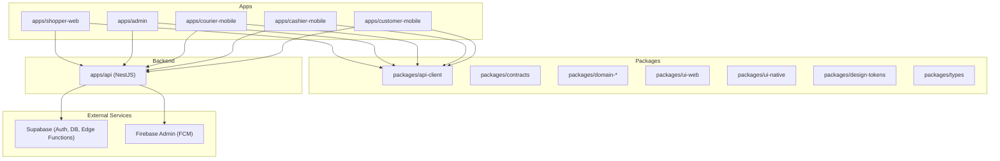
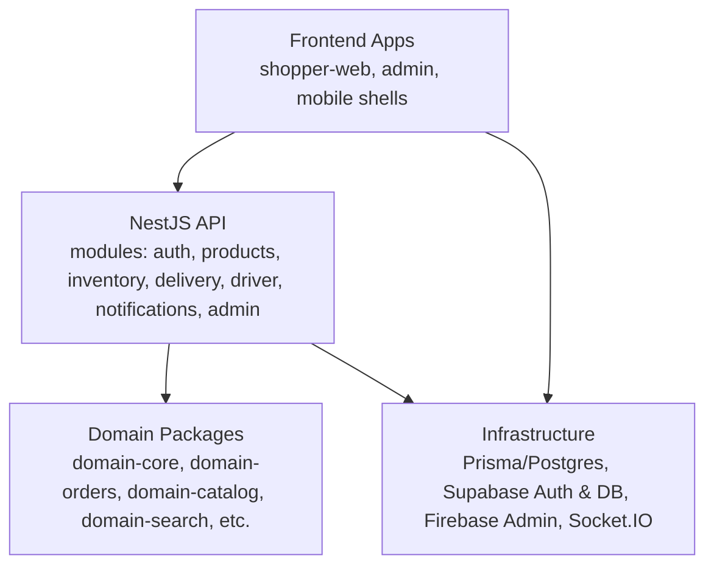
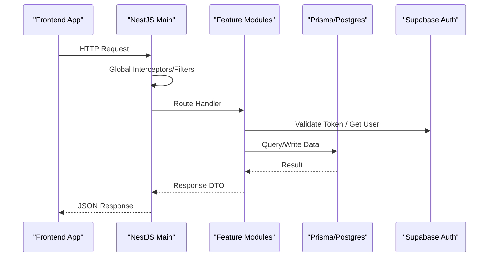
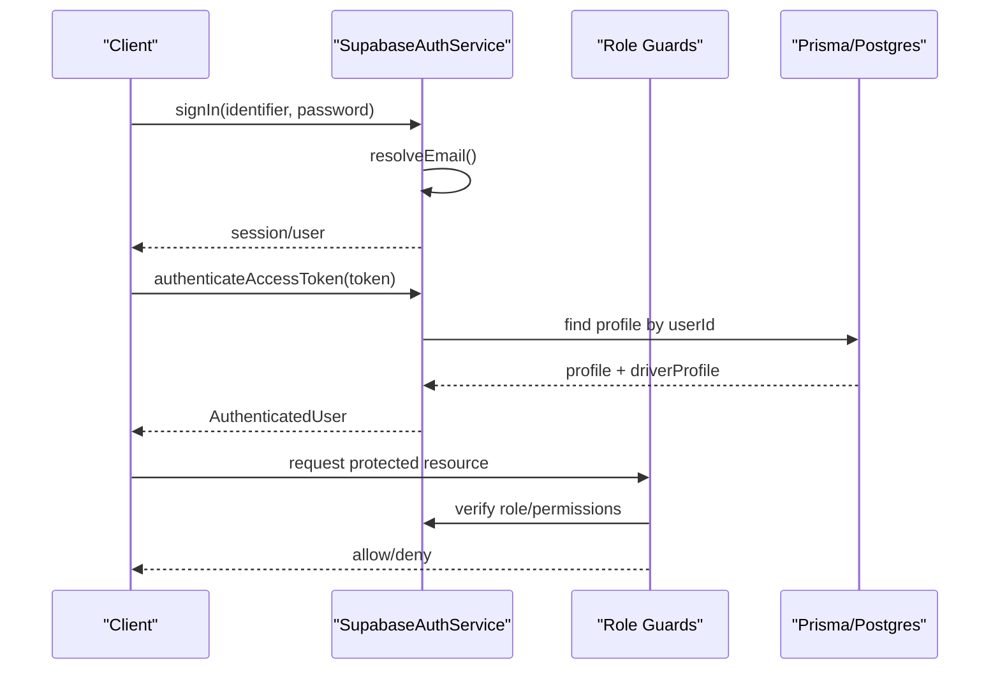
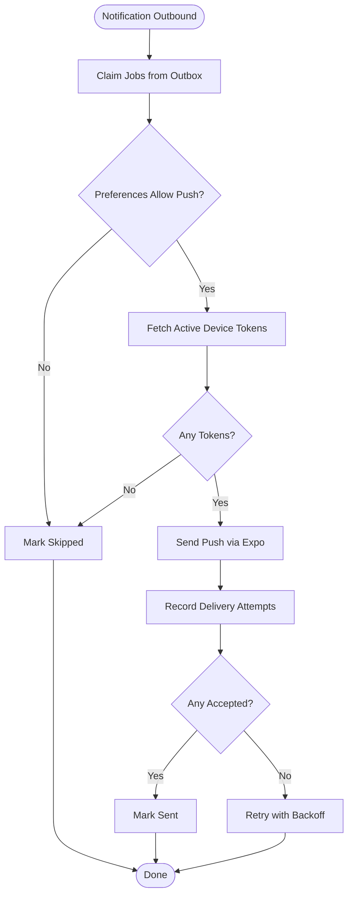
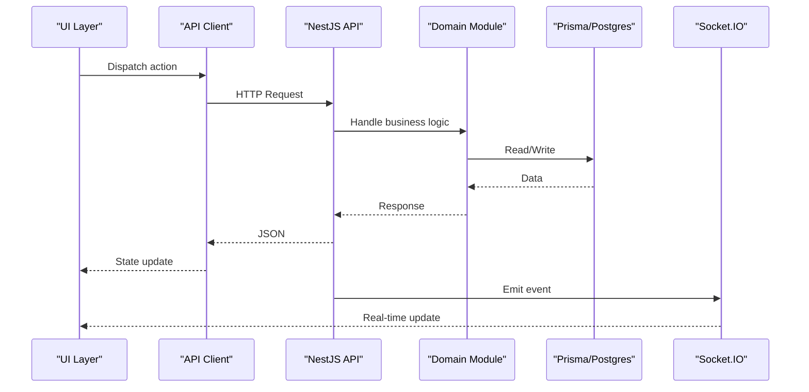
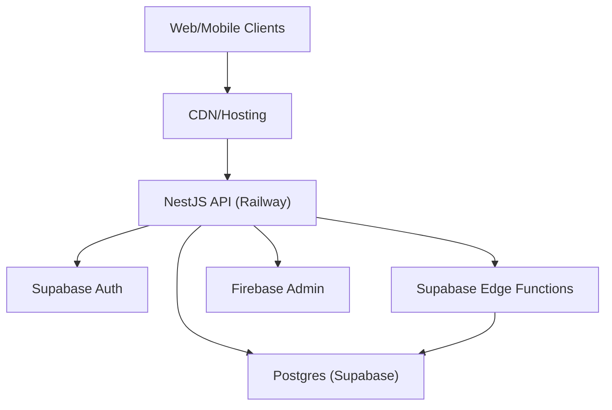
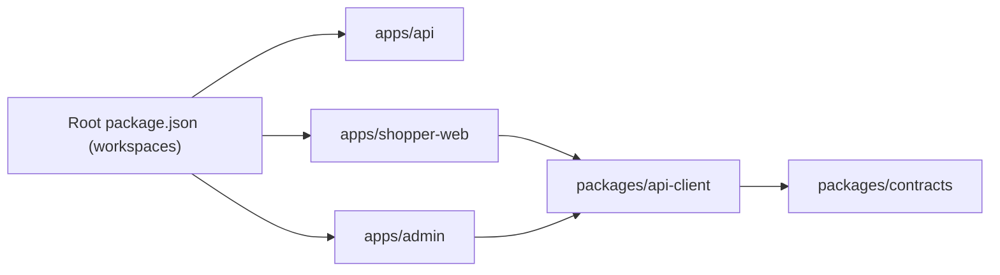

# Architecture Guide

<cite>
**Referenced Files in This Document**
- [package.json](file://package.json)
- [README.md](file://README.md)
- [apps/api/package.json](file://apps/api/package.json)
- [apps/admin/package.json](file://apps/admin/package.json)
- [apps/shopper-web/package.json](file://apps/shopper-web/package.json)
- [apps/api/src/main.ts](file://apps/api/src/main.ts)
- [apps/api/src/app.module.ts](file://apps/api/src/app.module.ts)
- [apps/api/src/auth/auth.module.ts](file://apps/api/src/auth/auth.module.ts)
- [apps/api/src/auth/supabase-auth.service.ts](file://apps/api/src/auth/supabase-auth.service.ts)
- [packages/api-client/package.json](file://packages/api-client/package.json)
- [supabase/functions/notification-worker/index.ts](file://supabase/functions/notification-worker/index.ts)
</cite>

## Table of Contents
1. Introduction
2. Project Structure
3. Core Components
4. Architecture Overview
5. Detailed Component Analysis
6. Dependency Analysis
7. Performance Considerations
8. Troubleshooting Guide
9. Conclusion

## Introduction
This document describes the architecture of the United Pharmacy Monorepo system. It explains how Domain-Driven Design principles are applied across a monorepo built with npm workspaces, and how frontend applications, backend API, shared domain logic, and UI libraries are separated to maintain clarity and scalability. It also details data flow from user interactions through API calls to database operations and real-time updates, authentication and authorization using Supabase JWT tokens and role-based access control, integration points with external services (Supabase and Firebase), deployment topology, and considerations for scalability, performance, and security.

## Project Structure
The repository is an npm workspaces monorepo that organizes multiple apps and shared packages:
- Apps: shopper web, admin dashboard, courier mobile, cashier mobile, customer mobile shells
- Packages: api client, contracts, design tokens, domain modules (account, cart, catalog, checkout, core, courier, location, ops, orders, prescriptions, search), types, UI libraries (web and native)

**Diagram sources**
- [package.json:9-13](file://package.json#L9-L13)
- [README.md:7-15](file://README.md#L7-L15)

**Section sources**
- [package.json:9-13](file://package.json#L9-L13)
- [README.md:7-15](file://README.md#L7-L15)

## Core Components
- Backend API: NestJS application exposing REST endpoints and WebSockets, integrated with Prisma and Supabase Auth.
- Frontend Apps: React-based web and mobile shells consuming a shared API client and domain packages.
- Shared Domain Logic: Feature-focused packages encapsulating business rules and state models (e.g., orders, catalog, search).
- UI Libraries: Reusable components and design tokens for web and native platforms.
- External Integrations: Supabase for auth, database, edge functions; Firebase Admin for push notifications.

Key responsibilities:
- apps/api: orchestrates modules, global interceptors/filters, CORS, and routes to domain modules.
- packages/api-client: centralized HTTP client and request/response contracts used by all apps.
- packages/domain-*: pure domain logic and shared state patterns (e.g., search, location).
- supabase/functions: background workers (e.g., notification outbox processing).

**Section sources**
- [apps/api/package.json:14-35](file://apps/api/package.json#L14-L35)
- [packages/api-client/package.json:1-20](file://packages/api-client/package.json#L1-L20)
- [README.md:17-24](file://README.md#L17-L24)

## Architecture Overview
High-level architecture follows Domain-Driven Design with clear boundaries:
- Presentation Layer: apps (shopper-web, admin, mobile shells)
- Application/API Layer: NestJS modules per domain feature
- Domain Layer: packages/domain-* containing business rules and shared state
- Infrastructure Layer: Prisma/Postgres, Supabase Auth/DB, Firebase Admin, Socket.IO/WebSockets

**Diagram sources**
- [apps/api/src/app.module.ts:14-27](file://apps/api/src/app.module.ts#L14-L27)
- [apps/api/package.json:14-35](file://apps/api/package.json#L14-L35)
- [README.md:17-24](file://README.md#L17-L24)

## Detailed Component Analysis

### Backend API (NestJS)
- Bootstrap: initializes Nest app, configures CORS with explicit origins, applies global response interceptor and exception filter, listens on port.
- Module Composition: imports feature modules (auth, branches, delivery, promotion-copilot, driver, notifications, admin, products, inventory, customers) and Prisma module.
- Security: CORS configured for production domains and localhost; credentials enabled; preflight caching.

**Diagram sources**
- [apps/api/src/main.ts:7-35](file://apps/api/src/main.ts#L7-L35)
- [apps/api/src/app.module.ts:14-27](file://apps/api/src/app.module.ts#L14-L27)

**Section sources**
- [apps/api/src/main.ts:7-35](file://apps/api/src/main.ts#L7-L35)
- [apps/api/src/app.module.ts:14-27](file://apps/api/src/app.module.ts#L14-L27)

### Authentication and Authorization
- SupabaseAuthService handles sign-in, user creation, and token validation. It uses service-role client to interact with Supabase Auth and fetches profiles via Prisma.
- Guards: AdminAuthGuard, DriverAuthGuard, RoleAuthGuard provide role-based access control at route level.
- Flow: clients send requests with Supabase JWT; API validates token via Supabase; profile resolved from Postgres; guards enforce roles.

**Diagram sources**
- [apps/api/src/auth/supabase-auth.service.ts:26-64](file://apps/api/src/auth/supabase-auth.service.ts#L26-L64)
- [apps/api/src/auth/auth.module.ts:8-12](file://apps/api/src/auth/auth.module.ts#L8-L12)

**Section sources**
- [apps/api/src/auth/supabase-auth.service.ts:26-64](file://apps/api/src/auth/supabase-auth.service.ts#L26-L64)
- [apps/api/src/auth/auth.module.ts:8-12](file://apps/api/src/auth/auth.module.ts#L8-L12)

### Real-Time Updates and Notifications
- WebSockets: NestJS integrates Socket.IO for real-time features (e.g., order tracking, live updates).
- Notification Worker: Supabase Edge Function processes an outbox table, sends push notifications via Expo, tracks delivery attempts, and handles receipts to mark delivered or failed messages.

**Diagram sources**
- [supabase/functions/notification-worker/index.ts:37-125](file://supabase/functions/notification-worker/index.ts#L37-L125)

**Section sources**
- [supabase/functions/notification-worker/index.ts:37-125](file://supabase/functions/notification-worker/index.ts#L37-L125)

### Data Flow: User Interaction to Database
- Frontend apps use a shared API client to call backend endpoints.
- Backend modules validate input, enforce auth/roles, perform domain logic, and persist changes via Prisma.
- Real-time channels broadcast updates to subscribed clients.

**Diagram sources**
- [packages/api-client/package.json:16-19](file://packages/api-client/package.json#L16-L19)
- [apps/api/src/app.module.ts:14-27](file://apps/api/src/app.module.ts#L14-L27)

**Section sources**
- [packages/api-client/package.json:16-19](file://packages/api-client/package.json#L16-L19)
- [apps/api/src/app.module.ts:14-27](file://apps/api/src/app.module.ts#L14-L27)

### System Boundaries and Integration Points
- Boundary: Frontend apps communicate only via the API client and WebSockets; no direct DB access.
- Integrations:
  - Supabase: Auth (JWT), Database (Postgres), Edge Functions (background workers)
  - Firebase Admin: Push notifications via FCM (used alongside Expo where applicable)
  - Socket.IO: Real-time communication between API and clients

**Section sources**
- [apps/api/package.json:14-35](file://apps/api/package.json#L14-L35)
- [supabase/functions/notification-worker/index.ts:37-125](file://supabase/functions/notification-worker/index.ts#L37-L125)

### Deployment Topology
- API runs on Node.js (NestJS) behind a reverse proxy (e.g., Railway), with CORS explicitly configured for production domains.
- Frontend apps are static builds served via CDN or hosting platform.
- Supabase Edge Functions run serverless within Supabase’s runtime.
- Mobile apps consume the same API client and WebSockets.

**Diagram sources**
- [apps/api/src/main.ts:13-28](file://apps/api/src/main.ts#L13-L28)
- [apps/api/package.json:14-35](file://apps/api/package.json#L14-L35)

**Section sources**
- [apps/api/src/main.ts:13-28](file://apps/api/src/main.ts#L13-L28)
- [apps/api/package.json:14-35](file://apps/api/package.json#L14-L35)

## Dependency Analysis
- Workspaces: Root package.json defines workspaces for apps and packages, enabling shared dependencies and unified scripts.
- API Dependencies: NestJS ecosystem, Prisma, Supabase JS, Firebase Admin, Socket.IO, Zod for validation.
- Client Dependencies: Axios and contracts package for typed requests/responses.
- App Dependencies: Vite/React for web, mobile frameworks for native apps.

**Diagram sources**
- [package.json:9-13](file://package.json#L9-L13)
- [apps/api/package.json:14-35](file://apps/api/package.json#L14-L35)
- [packages/api-client/package.json:16-19](file://packages/api-client/package.json#L16-L19)

**Section sources**
- [package.json:9-13](file://package.json#L9-L13)
- [apps/api/package.json:14-35](file://apps/api/package.json#L14-L35)
- [packages/api-client/package.json:16-19](file://packages/api-client/package.json#L16-L19)

## Performance Considerations
- CORS Optimization: Preflight responses cached for 24 hours to reduce OPTIONS overhead.
- Real-Time Efficiency: Use WebSockets for live updates instead of polling; batch events where possible.
- Database Access: Leverage Prisma queries efficiently; ensure indexes exist for frequent lookups.
- Background Processing: Offload heavy tasks (e.g., push notifications) to Supabase Edge Functions with retry/backoff.
- Client-Side Caching: Utilize TanStack Query and local stores to minimize redundant requests.

[No sources needed since this section provides general guidance]

## Troubleshooting Guide
- Authentication Failures:
  - Invalid/expired tokens result in unauthorized exceptions; verify token validity and refresh strategy.
  - Profile not found indicates mismatched user IDs; ensure consistent identity mapping between Supabase Auth and Postgres profiles.
- CORS Errors:
  - Ensure requests originate from allowed domains; check browser console for preflight failures.
- Notification Delivery Issues:
  - Review outbox status and delivery attempts; handle device invalidation when receipts report errors.

**Section sources**
- [apps/api/src/auth/supabase-auth.service.ts:49-64](file://apps/api/src/auth/supabase-auth.service.ts#L49-L64)
- [apps/api/src/main.ts:13-28](file://apps/api/src/main.ts#L13-L28)
- [supabase/functions/notification-worker/index.ts:102-125](file://supabase/functions/notification-worker/index.ts#L102-L125)

## Conclusion
The United Pharmacy Monorepo employs Domain-Driven Design within an npm workspaces structure to separate concerns across frontend apps, backend API, shared domain logic, and UI libraries. The NestJS API enforces secure, role-based access using Supabase JWTs and integrates with Postgres via Prisma. Real-time updates and background processing are handled through WebSockets and Supabase Edge Functions. The architecture supports scalability through modular services, efficient caching, and offloading heavy tasks to serverless functions. Security is maintained via strict CORS policies, token validation, and role-based guards.