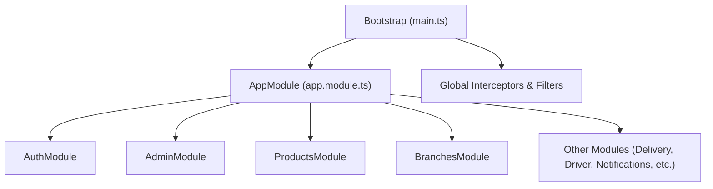
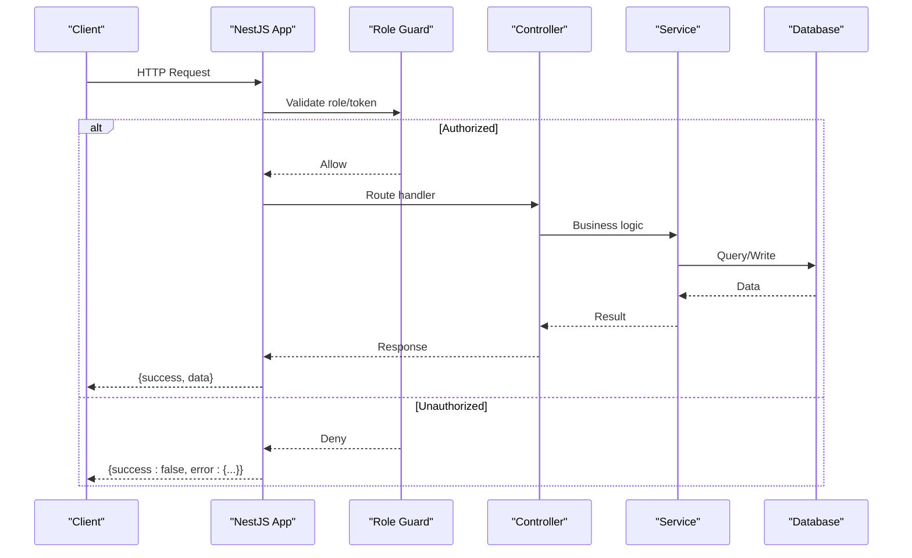
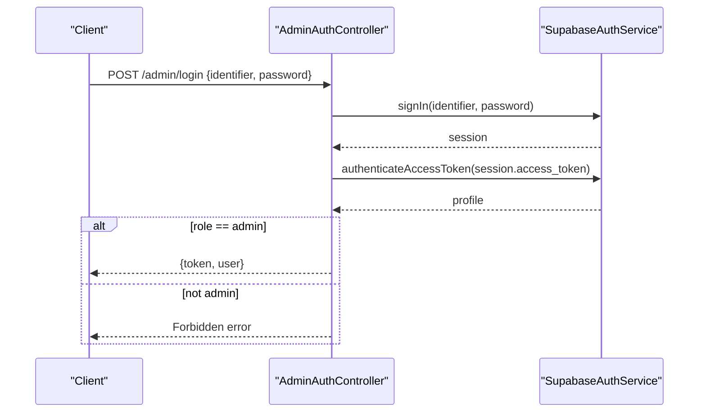
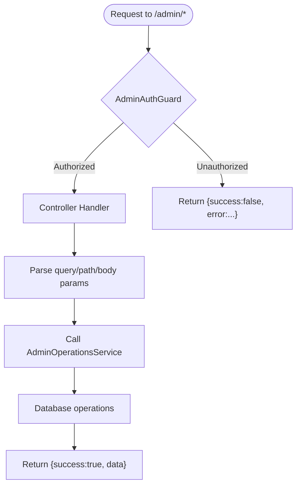
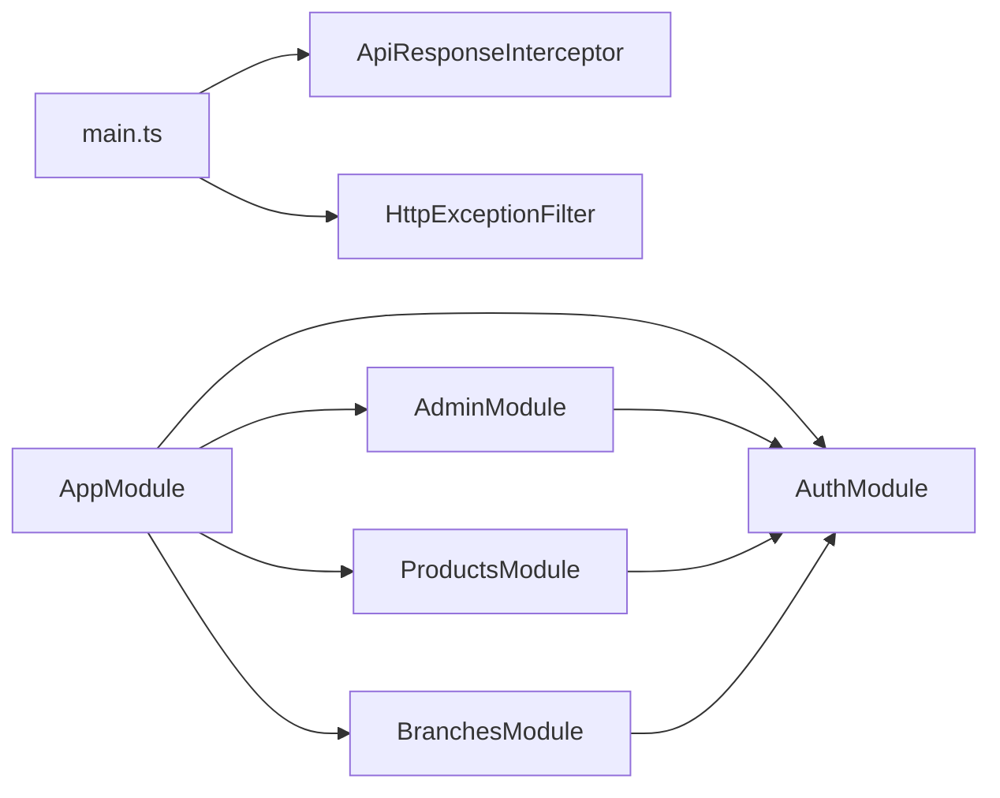

# API Endpoints & Controllers

<cite>
**Referenced Files in This Document**
- [main.ts](file://apps/api/src/main.ts)
- [app.module.ts](file://apps/api/src/app.module.ts)
- [api-response.interceptor.ts](file://apps/api/src/common/api-response.interceptor.ts)
- [http-exception.filter.ts](file://apps/api/src/common/http-exception.filter.ts)
- [auth.module.ts](file://apps/api/src/auth/auth.module.ts)
- [supabase-auth.service.ts](file://apps/api/src/auth/supabase-auth.service.ts)
- [admin-auth.controller.ts](file://apps/api/src/modules/admin/admin-auth.controller.ts)
- [admin-operations.controller.ts](file://apps/api/src/modules/admin/admin-operations.controller.ts)
- [products.controller.ts](file://apps/api/src/modules/products/products.controller.ts)
- [branches.controller.ts](file://apps/api/src/modules/branches/branches.controller.ts)
</cite>

## Table of Contents
1. Introduction
2. Project Structure
3. Core Components
4. Architecture Overview
5. Detailed Component Analysis
6. Dependency Analysis
7. Performance Considerations
8. Troubleshooting Guide
9. Conclusion

## Introduction
This document provides comprehensive documentation for the RESTful API endpoints and controller implementations in the application. It covers endpoint routing, request/response schemas, parameter validation, authentication requirements, error handling via a global HTTP exception filter, consistent response formatting through an interceptor, and the overall request pipeline. It also includes guidance on security measures, input sanitization, rate limiting strategies, and performance optimization techniques suitable for high-throughput scenarios.

## Project Structure
The API is built with NestJS and organized into feature modules under apps/api/src/modules. The application bootstrap configures CORS, registers a global response interceptor and exception filter, and starts the server. Feature modules are imported at the root AppModule level.

**Diagram sources**
- [main.ts:7-35](file://apps/api/src/main.ts#L7-L35)
- [app.module.ts:14-27](file://apps/api/src/app.module.ts#L14-L27)

**Section sources**
- [main.ts:7-35](file://apps/api/src/main.ts#L7-L35)
- [app.module.ts:14-27](file://apps/api/src/app.module.ts#L14-L27)

## Core Components
- Global Response Interceptor: Wraps all successful responses in a consistent envelope with success flag, data payload, and null error field.
- Global HTTP Exception Filter: Catches exceptions and returns a standardized error envelope including code, message, and request details.
- Authentication Service: Validates credentials via Supabase, resolves email from phone if needed, and verifies access tokens to retrieve user profiles.
- Guards: Role-based guards enforce admin or driver access on protected routes.

Key responsibilities:
- Consistent API responses for both success and error cases.
- Centralized authentication and authorization logic.
- Clear separation of concerns between controllers (routing), services (business logic), and guards (access control).

**Section sources**
- [api-response.interceptor.ts:10-21](file://apps/api/src/common/api-response.interceptor.ts#L10-L21)
- [http-exception.filter.ts:9-44](file://apps/api/src/common/http-exception.filter.ts#L9-L44)
- [supabase-auth.service.ts:11-80](file://apps/api/src/auth/supabase-auth.service.ts#L11-L80)
- [auth.module.ts:8-12](file://apps/api/src/auth/auth.module.ts#L8-L12)

## Architecture Overview
The request lifecycle flows through the NestJS pipeline:
1. Request enters the Express server configured by main.ts with CORS enabled.
2. Global interceptors transform successful responses into a unified format.
3. Route handlers in controllers delegate to services for business logic.
4. Guards validate roles and permissions before allowing access to protected endpoints.
5. Exceptions are caught by the global filter and returned as standardized errors.

**Diagram sources**
- [main.ts:10-31](file://apps/api/src/main.ts#L10-L31)
- [api-response.interceptor.ts:12-19](file://apps/api/src/common/api-response.interceptor.ts#L12-L19)
- [http-exception.filter.ts:11-43](file://apps/api/src/common/http-exception.filter.ts#L11-L43)

## Detailed Component Analysis

### Admin Authentication
- Endpoint: POST /admin/login
- Purpose: Authenticate an admin user using identifier (email or phone) and password; returns token and profile info.
- Validation: Uses class-validator decorators to ensure fields are strings.
- Authorization: Requires admin role; non-admins receive a forbidden response.
- Request Schema:
  - Body: identifier (string), password (string)
- Response Schema:
  - Token (string)
  - User object with id, fullName, email, phone, role
- Error Handling:
  - Invalid credentials return unauthorized error.
  - Non-admin role returns forbidden error.

**Diagram sources**
- [admin-auth.controller.ts:13-37](file://apps/api/src/modules/admin/admin-auth.controller.ts#L13-L37)
- [supabase-auth.service.ts:26-64](file://apps/api/src/auth/supabase-auth.service.ts#L26-L64)

**Section sources**
- [admin-auth.controller.ts:1-37](file://apps/api/src/modules/admin/admin-auth.controller.ts#L1-L37)
- [supabase-auth.service.ts:26-64](file://apps/api/src/auth/supabase-auth.service.ts#L26-L64)

### Admin Operations
- Endpoints:
  - GET /admin/drivers?page&limit&status
  - GET /admin/drivers/:id
  - PATCH /admin/drivers/:id/approve
  - PATCH /admin/drivers/:id/reject
  - PATCH /admin/drivers/:id/suspend
  - GET /admin/orders?page&limit&status
  - POST /admin/orders/:id/assign
  - PATCH /admin/orders/:id/status
  - GET /admin/stats
- Authorization: Protected by AdminAuthGuard; requires valid admin token.
- Parameters:
  - Pagination: page (number, default 1), limit (number, default 20)
  - Filtering: status (string)
  - Path params: id (string)
  - Body params: reason (optional string), driverId (optional string), status (optional string)
- Responses:
  - Success: Standard envelope with data payload.
  - Errors: Standardized error envelope with code, message, and path/method details.

**Diagram sources**
- [admin-operations.controller.ts:15-72](file://apps/api/src/modules/admin/admin-operations.controller.ts#L15-L72)

**Section sources**
- [admin-operations.controller.ts:15-72](file://apps/api/src/modules/admin/admin-operations.controller.ts#L15-L72)

### Products Management
- Endpoint: GET /admin/products?page&limit
- Authorization: Protected by AdminAuthGuard.
- Parameters:
  - page (number, default 1)
  - limit (number, default 20)
- Response: Paginated product list wrapped in standard envelope.

**Section sources**
- [products.controller.ts:5-14](file://apps/api/src/modules/products/products.controller.ts#L5-L14)

### Branches Management
- Public Endpoints:
  - GET /branches (list branches)
- Admin Endpoints (Protected by AdminAuthGuard):
  - GET /admin/branches?page&limit
  - GET /admin/branches/:id
  - POST /admin/branches
  - PATCH /admin/branches/:id
- Parameters:
  - Pagination: page (number, default 1), limit (number, default 20)
  - Path param: id (string)
  - Body: branch data (object)

**Section sources**
- [branches.controller.ts:5-39](file://apps/api/src/modules/branches/branches.controller.ts#L5-L39)

### Authentication Service
- Responsibilities:
  - Sign-in with email or phone resolution.
  - Create users with metadata.
  - Verify access tokens and fetch profiles.
- Security:
  - Uses service role key for privileged operations.
  - Throws unauthorized exceptions for invalid/expired tokens or missing profiles.

**Section sources**
- [supabase-auth.service.ts:11-80](file://apps/api/src/auth/supabase-auth.service.ts#L11-L80)

## Dependency Analysis
Feature modules depend on shared infrastructure:
- AuthModule provides guards and auth service used across modules.
- PrismaModule provides database access.
- Controllers depend on services for business logic.
- Global components (interceptor/filter) apply across all routes.

**Diagram sources**
- [main.ts:30-31](file://apps/api/src/main.ts#L30-L31)
- [app.module.ts:14-27](file://apps/api/src/app.module.ts#L14-L27)
- [auth.module.ts:8-12](file://apps/api/src/auth/auth.module.ts#L8-L12)

**Section sources**
- [app.module.ts:14-27](file://apps/api/src/app.module.ts#L14-L27)
- [auth.module.ts:8-12](file://apps/api/src/auth/auth.module.ts#L8-L12)

## Performance Considerations
- CORS Optimization: Preflight caching reduces OPTIONS requests overhead.
- Pagination: Use page and limit parameters to avoid large payloads.
- Database Indexing: Ensure appropriate indexes on frequently queried fields (e.g., status, ids).
- Connection Pooling: Configure Prisma connection pool size based on workload.
- Caching: Consider adding response caching for read-heavy endpoints behind a CDN or reverse proxy.
- Rate Limiting: Implement per-IP or per-user rate limiting at the gateway or application layer to protect against abuse.
- Compression: Enable gzip/br compression for JSON responses.
- Monitoring: Add request tracing and metrics to identify bottlenecks.

[No sources needed since this section provides general guidance]

## Troubleshooting Guide
Common issues and resolutions:
- Invalid Credentials:
  - Cause: Incorrect email/phone or password.
  - Resolution: Verify credentials; check Supabase configuration.
- Unauthorized Access:
  - Cause: Missing or invalid token; insufficient role.
  - Resolution: Ensure token is included in Authorization header; verify role assignment.
- Unexpected Errors:
  - Cause: Unhandled exceptions in services or database failures.
  - Resolution: Check logs; inspect stack traces; validate inputs and environment variables.
- CORS Issues:
  - Cause: Requests from disallowed origins.
  - Resolution: Update allowed origins in CORS configuration.

Error response schema:
- success: boolean (false)
- data: null
- error:
  - code: string (e.g., HTTP_4xx or UNEXPECTED_ERROR)
  - message: string
  - details:
    - path: string
    - method: string

**Section sources**
- [http-exception.filter.ts:11-43](file://apps/api/src/common/http-exception.filter.ts#L11-L43)

## Conclusion
The API follows a clean, modular architecture with consistent response formatting and centralized error handling. Authentication and authorization are enforced via guards and a robust service that integrates with Supabase. Endpoints are well-scoped, with clear pagination and filtering support. For production readiness, implement rate limiting, monitoring, and performance optimizations tailored to your traffic patterns.

[No sources needed since this section summarizes without analyzing specific files]