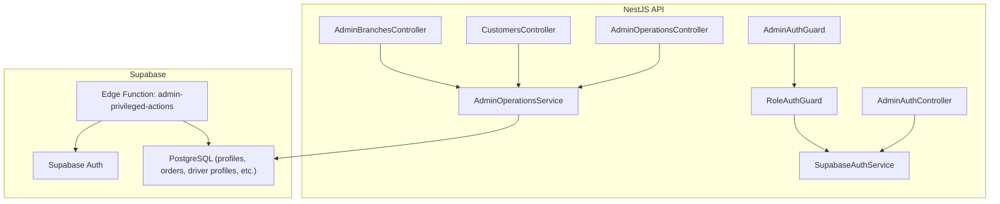
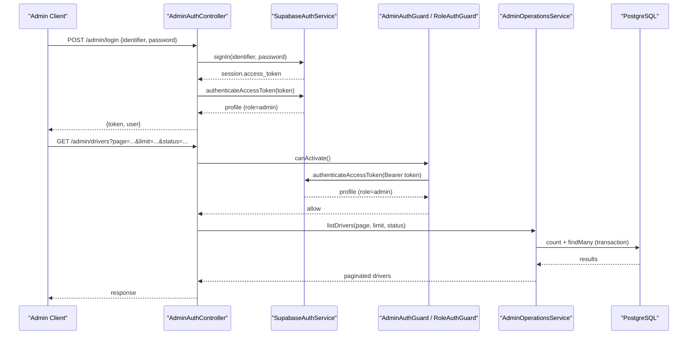
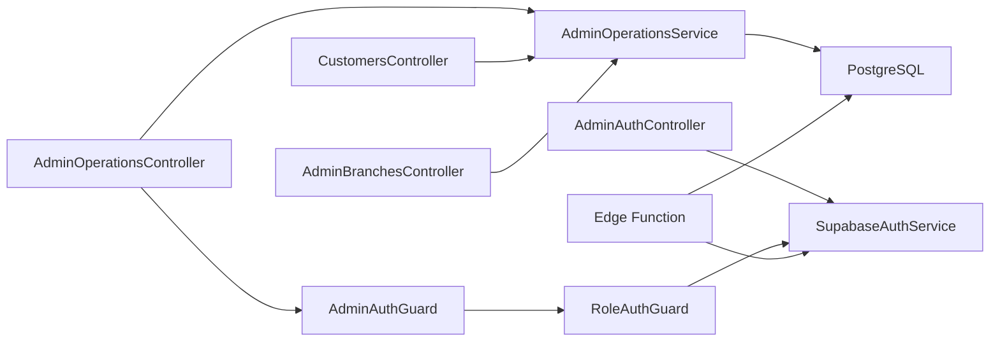

# Admin Endpoints

<cite>
**Referenced Files in This Document**
- [admin-auth.controller.ts](file://apps/api/src/modules/admin/admin-auth.controller.ts)
- [admin-operations.controller.ts](file://apps/api/src/modules/admin/admin-operations.controller.ts)
- [admin-operations.service.ts](file://apps/api/src/modules/admin/admin-operations.service.ts)
- [admin.module.ts](file://apps/api/src/modules/admin/admin.module.ts)
- [admin-auth.guard.ts](file://apps/api/src/auth/admin-auth.guard.ts)
- [role-auth.guard.ts](file://apps/api/src/auth/role-auth.guard.ts)
- [supabase-auth.service.ts](file://apps/api/src/auth/supabase-auth.service.ts)
- [customers.controller.ts](file://apps/api/src/modules/customers/customers.controller.ts)
- [branches.controller.ts](file://apps/api/src/modules/branches/branches.controller.ts)
- [index.ts](file://supabase/functions/admin-privileged-actions/index.ts)
</cite>

## Table of Contents
1. Introduction
2. Project Structure
3. Core Components
4. Architecture Overview
5. Detailed Component Analysis
6. Dependency Analysis
7. Performance Considerations
8. Troubleshooting Guide
9. Conclusion
10. Appendices

## Introduction
This document provides comprehensive API documentation for administrative endpoints that manage users, orders, drivers, branches, and system operations. It covers authentication via admin guards, request/response schemas, parameter validation rules, security measures, audit logging, and access control patterns specific to admin functionality. Examples include user suspension, order assignment, status transitions, and bulk operational controls.

## Project Structure
The admin API is implemented as a NestJS module with:
- Authentication controller for admin login
- Operations controller protected by an admin guard
- A service layer handling business logic and database interactions
- Shared auth guards and Supabase integration
- Additional admin-scoped controllers for customers and branches
- A Supabase Edge Function for privileged actions (staff creation, account lock/unlock, session reset)

**Diagram sources**
- [admin-auth.controller.ts:13-36](file://apps/api/src/modules/admin/admin-auth.controller.ts#L13-L36)
- [admin-operations.controller.ts:15-71](file://apps/api/src/modules/admin/admin-operations.controller.ts#L15-L71)
- [admin-operations.service.ts:47-391](file://apps/api/src/modules/admin/admin-operations.service.ts#L47-L391)
- [admin-auth.guard.ts:5-9](file://apps/api/src/auth/admin-auth.guard.ts#L5-L9)
- [role-auth.guard.ts:5-36](file://apps/api/src/auth/role-auth.guard.ts#L5-L36)
- [supabase-auth.service.ts:11-80](file://apps/api/src/auth/supabase-auth.service.ts#L11-L80)
- [customers.controller.ts:5-14](file://apps/api/src/modules/customers/customers.controller.ts#L5-L14)
- [branches.controller.ts:15-39](file://apps/api/src/modules/branches/branches.controller.ts#L15-L39)
- [index.ts:92-295](file://supabase/functions/admin-privileged-actions/index.ts#L92-L295)

**Section sources**
- [admin.module.ts:1-13](file://apps/api/src/modules/admin/admin.module.ts#L1-L13)

## Core Components
- Admin authentication endpoint: issues tokens after verifying credentials and role.
- Admin operations endpoints: list and manage drivers, orders, and stats; all guarded by admin role.
- Customer listing endpoint under admin scope.
- Branch management endpoints under admin scope.
- Privileged actions via Supabase Edge Function for staff creation and account lifecycle controls.

Key responsibilities:
- Enforce admin-only access through guards.
- Validate inputs using DTOs and query parameters.
- Perform safe pagination and limit enforcement.
- Apply canonical order lifecycle transitions.
- Persist changes atomically using transactions.
- Log privileged actions to an audit table.

**Section sources**
- [admin-auth.controller.ts:13-36](file://apps/api/src/modules/admin/admin-auth.controller.ts#L13-L36)
- [admin-operations.controller.ts:15-71](file://apps/api/src/modules/admin/admin-operations.controller.ts#L15-L71)
- [admin-operations.service.ts:47-391](file://apps/api/src/modules/admin/admin-operations.service.ts#L47-L391)
- [customers.controller.ts:5-14](file://apps/api/src/modules/customers/customers.controller.ts#L5-L14)
- [branches.controller.ts:15-39](file://apps/api/src/modules/branches/branches.controller.ts#L15-L39)
- [index.ts:92-295](file://supabase/functions/admin-privileged-actions/index.ts#L92-L295)

## Architecture Overview
Admin requests flow through NestJS controllers protected by guards. The admin guard enforces the required role using the shared role guard and Supabase token verification. Business logic resides in services that interact with Prisma and PostgreSQL. Privileged actions are delegated to a Supabase Edge Function that validates caller identity and role server-side before performing sensitive operations.

**Diagram sources**
- [admin-auth.controller.ts:17-36](file://apps/api/src/modules/admin/admin-auth.controller.ts#L17-L36)
- [supabase-auth.service.ts:26-64](file://apps/api/src/auth/supabase-auth.service.ts#L26-L64)
- [admin-auth.guard.ts:5-9](file://apps/api/src/auth/admin-auth.guard.ts#L5-L9)
- [role-auth.guard.ts:11-36](file://apps/api/src/auth/role-auth.guard.ts#L11-L36)
- [admin-operations.controller.ts:20-27](file://apps/api/src/modules/admin/admin-operations.controller.ts#L20-L27)
- [admin-operations.service.ts:51-73](file://apps/api/src/modules/admin/admin-operations.service.ts#L51-L73)

## Detailed Component Analysis

### Authentication: Admin Login
- Endpoint: POST /admin/login
- Request body:
  - identifier: string (email or phone)
  - password: string
- Response:
  - token: string (access token)
  - user: object with id, fullName, email, phone, role
- Validation:
  - Both fields validated as strings
- Security:
  - After sign-in, verifies profile role equals admin; otherwise returns forbidden
- Error responses:
  - Unauthorized on invalid credentials
  - Forbidden if not admin

**Section sources**
- [admin-auth.controller.ts:5-11](file://apps/api/src/modules/admin/admin-auth.controller.ts#L5-L11)
- [admin-auth.controller.ts:17-36](file://apps/api/src/modules/admin/admin-auth.controller.ts#L17-L36)
- [supabase-auth.service.ts:26-33](file://apps/api/src/auth/supabase-auth.service.ts#L26-L33)

### Access Control: Admin Guard
- Guards enforce admin role on protected routes
- Reads Bearer token from Authorization header
- Verifies token and ensures profile.role == 'admin'
- Attaches user context to request for downstream handlers

**Section sources**
- [admin-auth.guard.ts:5-9](file://apps/api/src/auth/admin-auth.guard.ts#L5-L9)
- [role-auth.guard.ts:11-36](file://apps/api/src/auth/role-auth.guard.ts#L11-L36)

### Driver Management
Endpoints (all require admin):
- GET /admin/drivers?page=...&limit=...&status=...
  - Parameters: page (number, default 1), limit (number, max 100), status (optional)
  - Response: paginated list with total, totalPages, drivers array
- GET /admin/drivers/:id
  - Returns single driver details including user info
- PATCH /admin/drivers/:id/approve
  - Approves driver and sets profile status to Active
  - Records adminUserId for auditability
- PATCH /admin/drivers/:id/reject
  - Rejects driver with optional reason; sets profile status to Inactive
- PATCH /admin/drivers/:id/suspend
  - Suspends driver; sets profile status to Suspended; records reason

Validation and safety:
- Pagination bounds enforced (page >= 1, limit between 1 and 100)
- Transactions ensure consistent updates across driverProfile and profiles
- Errors:
  - Not found when driver does not exist
  - Conflict when driver not eligible for assignment (for related flows)

Example: User suspension
- Call PATCH /admin/drivers/:id/suspend with { reason?: string }
- System updates driver status to SUSPENDED and profile status to Suspended
- Returns success with driverId and status

**Section sources**
- [admin-operations.controller.ts:20-47](file://apps/api/src/modules/admin/admin-operations.controller.ts#L20-L47)
- [admin-operations.service.ts:51-181](file://apps/api/src/modules/admin/admin-operations.service.ts#L51-L181)

### Order Management
Endpoints (all require admin):
- GET /admin/orders?page=...&limit=...&status=...
  - Parameters: page (number, default 1), limit (number, max 100), status (optional, normalized)
  - Response: paginated list with totals and order summaries
- POST /admin/orders/:id/assign
  - Body: { driverId?: string }
  - Assigns order to an eligible driver; creates or updates deliveryAssignment
  - Validates driver eligibility and order lifecycle state
- PATCH /admin/orders/:id/status
  - Body: { status?: string }
  - Updates order status following canonical transitions

Validation and safety:
- Status normalization supports legacy aliases
- Canonical transitions enforced per current order status
- Transactional updates for assignment and status changes
- Errors:
  - Bad request for missing or illegal transitions
  - Not found for missing order/driver
  - Conflict for ineligible driver or already assigned order

Example: Bulk operation pattern
- Use GET /admin/orders with filters to retrieve batches
- Iterate assignments or status updates respecting rate limits and transaction boundaries

**Section sources**
- [admin-operations.controller.ts:49-66](file://apps/api/src/modules/admin/admin-operations.controller.ts#L49-L66)
- [admin-operations.service.ts:183-338](file://apps/api/src/modules/admin/admin-operations.service.ts#L183-L338)

### System Monitoring: Stats
Endpoint (admin):
- GET /admin/stats
- Response:
  - activeDeliveries: number
  - todayDeliveries: number
  - todayRevenue: string (numeric string)

Implementation notes:
- Aggregates counts and sums for active statuses and delivered orders within the current day

**Section sources**
- [admin-operations.controller.ts:68-71](file://apps/api/src/modules/admin/admin-operations.controller.ts#L68-L71)
- [admin-operations.service.ts:340-359](file://apps/api/src/modules/admin/admin-operations.service.ts#L340-L359)

### Customer Listing (Admin Scope)
Endpoint:
- GET /admin/customers?page=...&limit=...
- Requires admin guard
- Returns paginated customer list via service

**Section sources**
- [customers.controller.ts:5-14](file://apps/api/src/modules/customers/customers.controller.ts#L5-L14)

### Branch Management (Admin Scope)
Endpoints:
- GET /admin/branches?page=...&limit=...
- GET /admin/branches/:id
- POST /admin/branches
- PATCH /admin/branches/:id
- All require admin guard

**Section sources**
- [branches.controller.ts:15-39](file://apps/api/src/modules/branches/branches.controller.ts#L15-L39)

### Privileged Actions (Supabase Edge Function)
Purpose:
- Create staff accounts with role and status
- Lock/unlock accounts (ban duration)
- Reset sessions (temporary ban to invalidate refresh)

Security:
- Re-verifies caller identity and role inside the function
- Uses anon client to verify caller JWT and role; uses service-role client only for privileged actions
- Writes audit entries to admin_audit_log

Request:
- Method: POST
- Headers: Authorization (Bearer token)
- Body: { action, ...payload }
  - create_staff: { fullName, email, phone, username, role, status, password }
  - set_account_lock: { userId, locked }
  - reset_sessions: { userId }

Response:
- Success payloads with relevant identifiers and flags
- Error payloads with descriptive messages and stages

Example: Staff creation
- POST with action=create_staff and required fields
- Creates auth user and upserts profile; audits the action

Example: Account lock
- POST with action=set_account_lock and { userId, locked: true/false }
- Sets ban_duration accordingly; audits the action

**Section sources**
- [index.ts:92-295](file://supabase/functions/admin-privileged-actions/index.ts#L92-L295)

## Dependency Analysis
- Controllers depend on guards for authorization and services for business logic
- Services depend on Prisma for data access and use transactions for consistency
- Auth service depends on Supabase Auth and Prisma for profile resolution
- Edge function depends on Supabase clients and writes to audit tables

**Diagram sources**
- [admin-auth.controller.ts:13-36](file://apps/api/src/modules/admin/admin-auth.controller.ts#L13-L36)
- [admin-operations.controller.ts:15-71](file://apps/api/src/modules/admin/admin-operations.controller.ts#L15-L71)
- [admin-operations.service.ts:47-391](file://apps/api/src/modules/admin/admin-operations.service.ts#L47-L391)
- [admin-auth.guard.ts:5-9](file://apps/api/src/auth/admin-auth.guard.ts#L5-L9)
- [role-auth.guard.ts:5-36](file://apps/api/src/auth/role-auth.guard.ts#L5-L36)
- [supabase-auth.service.ts:11-80](file://apps/api/src/auth/supabase-auth.service.ts#L11-L80)
- [index.ts:92-295](file://supabase/functions/admin-privileged-actions/index.ts#L92-L295)

**Section sources**
- [admin.module.ts:1-13](file://apps/api/src/modules/admin/admin.module.ts#L1-L13)

## Performance Considerations
- Pagination:
  - Page and limit are bounded to prevent excessive queries
- Transactions:
  - Multi-table updates wrapped in $transaction for consistency
- Aggregation:
  - Stats endpoint uses efficient counts and aggregates
- Normalization:
  - Order status normalization reduces branching complexity
- Indexing:
  - Ensure indexes on frequently filtered columns (e.g., status, created_at)

[No sources needed since this section provides general guidance]

## Troubleshooting Guide
Common errors and resolutions:
- Invalid credentials:
  - Ensure correct email/phone and password; check Supabase configuration
- Forbidden:
  - Verify user role is admin; confirm token is valid and not expired
- Not found:
  - Check resource IDs for drivers, orders, or customers
- Illegal transition:
  - Ensure target order status is allowed from current status
- Driver not eligible:
  - Confirm driver status is APPROVED or ACTIVE before assignment
- Audit write failed:
  - For privileged actions, ensure admin_audit_log exists and is writable

**Section sources**
- [admin-auth.controller.ts:17-36](file://apps/api/src/modules/admin/admin-auth.controller.ts#L17-L36)
- [role-auth.guard.ts:11-36](file://apps/api/src/auth/role-auth.guard.ts#L11-L36)
- [admin-operations.service.ts:183-338](file://apps/api/src/modules/admin/admin-operations.service.ts#L183-L338)
- [index.ts:233-249](file://supabase/functions/admin-privileged-actions/index.ts#L233-L249)

## Conclusion
The admin API provides secure, role-gated endpoints for managing drivers, orders, customers, and branches, along with privileged actions for staff lifecycle and account controls. Robust validation, canonical state transitions, and transactional updates ensure data integrity. Audit logging and strict role checks protect sensitive operations.

[No sources needed since this section summarizes without analyzing specific files]

## Appendices

### Request/Response Schemas Summary
- Admin login:
  - Request: { identifier: string, password: string }
  - Response: { token: string, user: { id, fullName, email, phone, role } }
- List drivers:
  - Query: page (number), limit (number), status (string?)
  - Response: { page, limit, total, totalPages, drivers[] }
- Approve/Reject/Suspend driver:
  - Path: /admin/drivers/:id/{approve|reject|suspend}
  - Body (reject/suspend): { reason?: string }
  - Response: { success, message, driverId, status[, reason] }
- List orders:
  - Query: page (number), limit (number), status (string?)
  - Response: { page, limit, total, totalPages, orders[] }
- Assign order:
  - Path: /admin/orders/:id/assign
  - Body: { driverId?: string }
  - Response: { success, message, orderId, driverId, status }
- Update order status:
  - Path: /admin/orders/:id/status
  - Body: { status?: string }
  - Response: { success, message, orderId, from, to }
- Stats:
  - Response: { activeDeliveries, todayDeliveries, todayRevenue }
- Customers list:
  - Query: page (number), limit (number)
  - Response: paginated customer list
- Branches:
  - List/Create/Get/Update under /admin/branches with admin guard

[No sources needed since this section lists schemas derived from analyzed endpoints]

### Security and Audit Notes
- Admin guard enforces role-based access at the controller level
- Token verification performed via Supabase Auth service
- Privileged actions re-validate caller role server-side in Edge Function
- Audit log entries recorded for critical actions (staff creation, account lock/unlock, session reset)

**Section sources**
- [admin-auth.guard.ts:5-9](file://apps/api/src/auth/admin-auth.guard.ts#L5-L9)
- [role-auth.guard.ts:11-36](file://apps/api/src/auth/role-auth.guard.ts#L11-L36)
- [supabase-auth.service.ts:49-64](file://apps/api/src/auth/supabase-auth.service.ts#L49-L64)
- [index.ts:104-136](file://supabase/functions/admin-privileged-actions/index.ts#L104-L136)
- [index.ts:60-74](file://supabase/functions/admin-privileged-actions/index.ts#L60-L74)