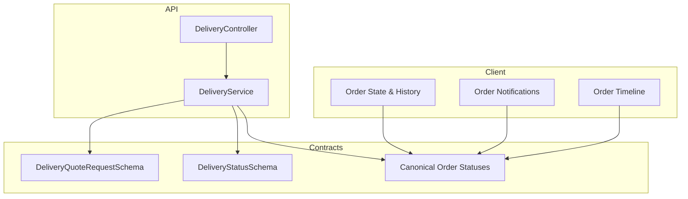
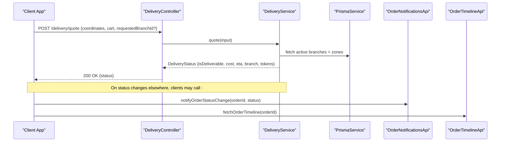
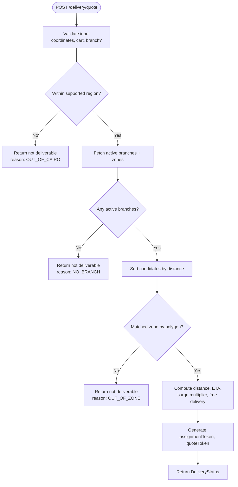
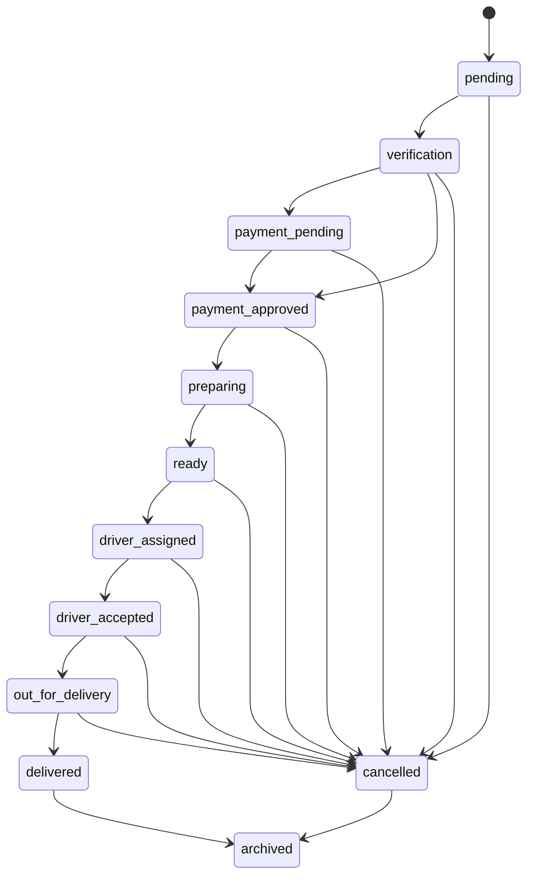
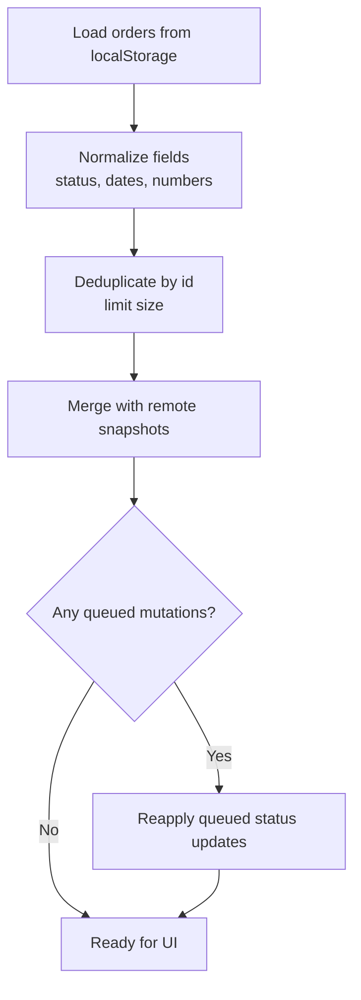
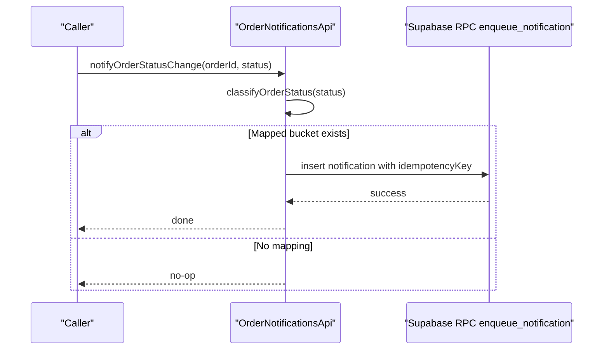
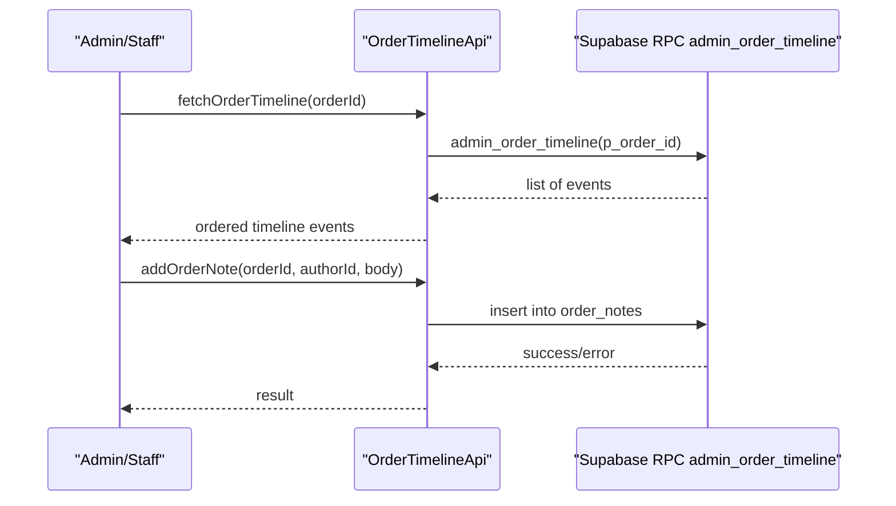
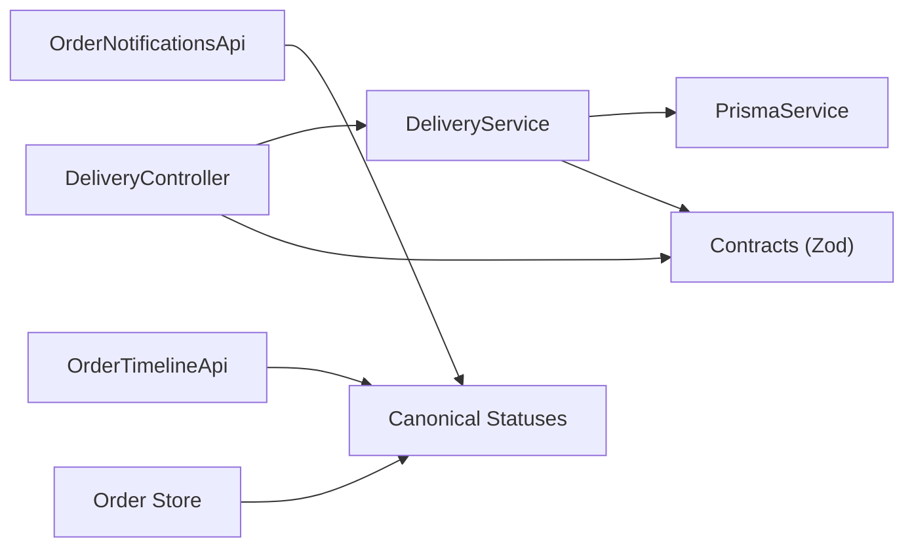

# Orders Endpoints

<cite>
**Referenced Files in This Document**
- [delivery.controller.ts](file://apps/api/src/modules/delivery/delivery.controller.ts)
- [delivery.service.ts](file://apps/api/src/modules/delivery/delivery.service.ts)
- [delivery.ts](file://packages/contracts/src/delivery.ts)
- [orderStatus.ts](file://packages/contracts/src/orderStatus.ts)
- [orders.ts](file://apps/shopper-web/src/app/orders.ts)
- [orderNotificationsApi.ts](file://apps/shopper-web/src/services/orderNotificationsApi.ts)
- [orderTimelineApi.ts](file://apps/shopper-web/src/services/orderTimelineApi.ts)
</cite>

## Table of Contents
1. [Introduction](#introduction)
2. [Project Structure](#project-structure)
3. [Core Components](#core-components)
4. [Architecture Overview](#architecture-overview)
5. [Detailed Component Analysis](#detailed-component-analysis)
6. [Dependency Analysis](#dependency-analysis)
7. [Performance Considerations](#performance-considerations)
8. [Troubleshooting Guide](#troubleshooting-guide)
9. [Conclusion](#conclusion)
10. [Appendices](#appendices)

## Introduction
This document provides comprehensive API documentation for order management endpoints with a focus on delivery coordination, order status tracking, and customer order history. It covers:
- Order creation workflow (client-side modeling and persistence)
- Delivery quote and assignment tokens
- Status lifecycle and transitions
- Real-time tracking updates via notifications and timeline events
- Validation rules, error handling, and integration points with delivery and notification systems

The goal is to help developers integrate with the order and delivery subsystems confidently, using consistent schemas and lifecycle semantics.

## Project Structure
Order-related functionality spans several layers:
- API layer: delivery quote endpoint that computes deliverability, cost, ETA, and returns tokens for assignment and quoting.
- Contracts: shared Zod schemas for requests/responses and canonical order statuses.
- Client-side order state: local storage-backed order history, mutation queue, and normalization utilities.
- Notifications and timeline: event-driven notifications for customers and drivers, plus an order timeline RPC for audit trails.

**Diagram sources**
- [delivery.controller.ts:6-14](file://apps/api/src/modules/delivery/delivery.controller.ts#L6-L14)
- [delivery.service.ts:58-239](file://apps/api/src/modules/delivery/delivery.service.ts#L58-L239)
- [delivery.ts:26-66](file://packages/contracts/src/delivery.ts#L26-L66)
- [orderStatus.ts:59-167](file://packages/contracts/src/orderStatus.ts#L59-L167)
- [orders.ts:17-179](file://apps/shopper-web/src/app/orders.ts#L17-L179)
- [orderNotificationsApi.ts:16-84](file://apps/shopper-web/src/services/orderNotificationsApi.ts#L16-L84)
- [orderTimelineApi.ts:13-51](file://apps/shopper-web/src/services/orderTimelineApi.ts#L13-L51)

**Section sources**
- [delivery.controller.ts:6-14](file://apps/api/src/modules/delivery/delivery.controller.ts#L6-L14)
- [delivery.service.ts:58-239](file://apps/api/src/modules/delivery/delivery.service.ts#L58-L239)
- [delivery.ts:26-66](file://packages/contracts/src/delivery.ts#L26-L66)
- [orderStatus.ts:59-167](file://packages/contracts/src/orderStatus.ts#L59-L167)
- [orders.ts:17-179](file://apps/shopper-web/src/app/orders.ts#L17-L179)
- [orderNotificationsApi.ts:16-84](file://apps/shopper-web/src/services/orderNotificationsApi.ts#L16-L84)
- [orderTimelineApi.ts:13-51](file://apps/shopper-web/src/services/orderTimelineApi.ts#L13-L51)

## Core Components
- Delivery Quote Endpoint: Computes whether delivery is possible, calculates cost and ETA, identifies branch and zone, and returns tokens for assignment and quoting.
- Canonical Order Lifecycle: A single source of truth for statuses, labels, and allowed transitions across all surfaces.
- Client-Side Order Store: Normalizes, persists, and queues order mutations; supports offline-first behavior and sync metadata.
- Notifications: Emits customer and driver notifications for key lifecycle events with idempotency keys.
- Timeline: Provides a unified per-order event log via a read-only RPC and supports adding notes.

**Section sources**
- [delivery.controller.ts:6-14](file://apps/api/src/modules/delivery/delivery.controller.ts#L6-L14)
- [delivery.service.ts:58-239](file://apps/api/src/modules/delivery/delivery.service.ts#L58-L239)
- [orderStatus.ts:59-167](file://packages/contracts/src/orderStatus.ts#L59-L167)
- [orders.ts:17-179](file://apps/shopper-web/src/app/orders.ts#L17-L179)
- [orderNotificationsApi.ts:16-84](file://apps/shopper-web/src/services/orderNotificationsApi.ts#L16-L84)
- [orderTimelineApi.ts:13-51](file://apps/shopper-web/src/services/orderTimelineApi.ts#L13-L51)

## Architecture Overview
The order system integrates three primary flows:
- Delivery Quoting: Validates coordinates, finds nearest branch and matching zone, computes cost and ETA, and returns tokens.
- Order Lifecycle Management: Uses canonical statuses and transitions to ensure consistency across admin, staff, and driver surfaces.
- Notifications and Timeline: Emits events for status changes and builds a chronological timeline for each order.

**Diagram sources**
- [delivery.controller.ts:6-14](file://apps/api/src/modules/delivery/delivery.controller.ts#L6-L14)
- [delivery.service.ts:58-239](file://apps/api/src/modules/delivery/delivery.service.ts#L58-L239)
- [orderNotificationsApi.ts:163-185](file://apps/shopper-web/src/services/orderNotificationsApi.ts#L163-L185)
- [orderTimelineApi.ts:39-51](file://apps/shopper-web/src/services/orderTimelineApi.ts#L39-L51)

## Detailed Component Analysis

### Delivery Quote Endpoint
- Purpose: Determine if delivery is possible from given coordinates, compute cost and ETA, identify branch and zone, and return tokens for subsequent assignment and quoting steps.
- Input schema: Coordinates, cart snapshot, optional requested branch ID.
- Output schema: Deliverability flag, cost, currency, ETA band, distance, branch info, assignment and quote tokens, zone ID, reason code, breakdown, and timestamp.
- Key logic:
  - Geographic guardrails (e.g., Cairo bounding box).
  - Branch selection by proximity.
  - Zone matching via polygon point-in-polygon.
  - Surge pricing windows and free delivery thresholds.
  - ETA estimation based on distance and load factor.

**Diagram sources**
- [delivery.service.ts:58-239](file://apps/api/src/modules/delivery/delivery.service.ts#L58-L239)

**Section sources**
- [delivery.controller.ts:6-14](file://apps/api/src/modules/delivery/delivery.controller.ts#L6-L14)
- [delivery.service.ts:58-239](file://apps/api/src/modules/delivery/delivery.service.ts#L58-L239)
- [delivery.ts:26-66](file://packages/contracts/src/delivery.ts#L26-L66)

### Order Lifecycle and Status Transitions
- Canonical statuses define the full lifecycle including payment verification, preparation, dispatch, delivery, cancellation, and archival.
- Allowed transitions are enforced centrally to prevent inconsistent state changes across different interfaces.
- Labels provide localized display strings for UIs.

**Diagram sources**
- [orderStatus.ts:59-167](file://packages/contracts/src/orderStatus.ts#L59-L167)

**Section sources**
- [orderStatus.ts:59-167](file://packages/contracts/src/orderStatus.ts#L59-L167)

### Customer Order History and Local Persistence
- The client maintains a local store of orders with normalization, deduplication, and TTL-based cache metadata.
- Supports offline-first operations via a mutation queue for status updates when connectivity is unavailable.
- Provides helpers to map between remote snapshots and stored orders, and to query by customer phone.

**Diagram sources**
- [orders.ts:145-179](file://apps/shopper-web/src/app/orders.ts#L145-L179)
- [orders.ts:328-362](file://apps/shopper-web/src/app/orders.ts#L328-L362)
- [orders.ts:422-453](file://apps/shopper-web/src/app/orders.ts#L422-L453)
- [orders.ts:455-481](file://apps/shopper-web/src/app/orders.ts#L455-L481)
- [orders.ts:603-644](file://apps/shopper-web/src/app/orders.ts#L603-L644)

**Section sources**
- [orders.ts:17-179](file://apps/shopper-web/src/app/orders.ts#L17-L179)
- [orders.ts:328-362](file://apps/shopper-web/src/app/orders.ts#L328-L362)
- [orders.ts:422-453](file://apps/shopper-web/src/app/orders.ts#L422-L453)
- [orders.ts:455-481](file://apps/shopper-web/src/app/orders.ts#L455-L481)
- [orders.ts:603-644](file://apps/shopper-web/src/app/orders.ts#L603-L644)

### Notifications Integration
- Emits notifications for key order events such as payment approval, preparation, readiness, driver assignment/acceptance, out-for-delivery, delivery completion, and cancellation.
- Uses idempotency keys to avoid duplicate notifications.
- Routes notifications through a secure RPC to insert into the notifications table.

**Diagram sources**
- [orderNotificationsApi.ts:16-84](file://apps/shopper-web/src/services/orderNotificationsApi.ts#L16-L84)
- [orderNotificationsApi.ts:95-130](file://apps/shopper-web/src/services/orderNotificationsApi.ts#L95-L130)
- [orderNotificationsApi.ts:163-185](file://apps/shopper-web/src/services/orderNotificationsApi.ts#L163-L185)

**Section sources**
- [orderNotificationsApi.ts:16-84](file://apps/shopper-web/src/services/orderNotificationsApi.ts#L16-L84)
- [orderNotificationsApi.ts:95-130](file://apps/shopper-web/src/services/orderNotificationsApi.ts#L95-L130)
- [orderNotificationsApi.ts:163-185](file://apps/shopper-web/src/services/orderNotificationsApi.ts#L163-L185)

### Order Timeline and Notes
- Provides a unified timeline of events for an order via a read-only RPC, aggregating data from orders, delivery assignments, issues, and notes.
- Allows adding notes to an order with validation and persistence.

**Diagram sources**
- [orderTimelineApi.ts:13-51](file://apps/shopper-web/src/services/orderTimelineApi.ts#L13-L51)
- [orderTimelineApi.ts:53-64](file://apps/shopper-web/src/services/orderTimelineApi.ts#L53-L64)

**Section sources**
- [orderTimelineApi.ts:13-51](file://apps/shopper-web/src/services/orderTimelineApi.ts#L13-L51)
- [orderTimelineApi.ts:53-64](file://apps/shopper-web/src/services/orderTimelineApi.ts#L53-L64)

## Dependency Analysis
- Delivery controller depends on contracts for request/response validation and on the delivery service for business logic.
- Delivery service depends on Prisma for branch and zone data and uses geometry utilities for zone matching and distance calculations.
- Client modules depend on canonical order statuses to normalize and enforce lifecycle semantics consistently.
- Notifications and timeline APIs depend on Supabase RPCs and tables for persistent eventing and auditing.

**Diagram sources**
- [delivery.controller.ts:6-14](file://apps/api/src/modules/delivery/delivery.controller.ts#L6-L14)
- [delivery.service.ts:58-239](file://apps/api/src/modules/delivery/delivery.service.ts#L58-L239)
- [orderStatus.ts:59-167](file://packages/contracts/src/orderStatus.ts#L59-L167)
- [orderNotificationsApi.ts:16-84](file://apps/shopper-web/src/services/orderNotificationsApi.ts#L16-L84)
- [orderTimelineApi.ts:13-51](file://apps/shopper-web/src/services/orderTimelineApi.ts#L13-L51)
- [orders.ts:17-179](file://apps/shopper-web/src/app/orders.ts#L17-L179)

**Section sources**
- [delivery.controller.ts:6-14](file://apps/api/src/modules/delivery/delivery.controller.ts#L6-L14)
- [delivery.service.ts:58-239](file://apps/api/src/modules/delivery/delivery.service.ts#L58-L239)
- [orderStatus.ts:59-167](file://packages/contracts/src/orderStatus.ts#L59-L167)
- [orderNotificationsApi.ts:16-84](file://apps/shopper-web/src/services/orderNotificationsApi.ts#L16-L84)
- [orderTimelineApi.ts:13-51](file://apps/shopper-web/src/services/orderTimelineApi.ts#L13-L51)
- [orders.ts:17-179](file://apps/shopper-web/src/app/orders.ts#L17-L179)

## Performance Considerations
- Delivery quoting performs geographic checks and branch/zone lookups; consider caching active branches/zones where appropriate.
- ETA computation uses simple formulas; ensure load factors reflect real traffic conditions.
- Client-side order history limits stored orders and applies TTL to keep UI responsive.
- Notifications use idempotency keys to prevent redundant work and database writes.

[No sources needed since this section provides general guidance]

## Troubleshooting Guide
Common issues and resolutions:
- Out-of-region or out-of-zone deliveries: Check coordinates and branch zones; review reason codes returned by the delivery quote.
- Missing branches: Ensure at least one active branch exists; otherwise delivery cannot be matched.
- Status transition errors: Use canonical statuses and allowed transitions; do not write legacy synonyms directly.
- Notification failures: Verify user IDs and idempotency keys; check RPC permissions and network errors.
- Timeline loading failures: Confirm order exists and RPC is available; validate parameters.

**Section sources**
- [delivery.service.ts:71-179](file://apps/api/src/modules/delivery/delivery.service.ts#L71-L179)
- [orderStatus.ts:134-167](file://packages/contracts/src/orderStatus.ts#L134-L167)
- [orderNotificationsApi.ts:95-130](file://apps/shopper-web/src/services/orderNotificationsApi.ts#L95-L130)
- [orderTimelineApi.ts:39-51](file://apps/shopper-web/src/services/orderTimelineApi.ts#L39-L51)

## Conclusion
The order management system centers around a robust delivery quote endpoint, a canonical order lifecycle, and integrated notifications and timeline features. By adhering to shared schemas and transition rules, teams can build consistent experiences across customer, staff, and driver applications while maintaining reliable tracking and auditability.

[No sources needed since this section summarizes without analyzing specific files]

## Appendices

### API Reference: Delivery Quote
- Endpoint: POST /delivery/quote
- Request schema:
  - coordinates: object with latitude and longitude
  - cart: items array, itemCount, subtotal
  - requestedBranchId: optional string
- Response schema:
  - isDeliverable: boolean
  - cost: number or null
  - currency: "EGP"
  - eta: object with minMinutes and maxMinutes or null
  - branch: object or null
  - distanceKm: number or null
  - assignmentToken: string or null
  - quoteToken: string or null
  - zoneId: string or null
  - reasonCode: enum including OK, NO_COORDINATES, NO_BRANCH, OUT_OF_ZONE, OUT_OF_CAIRO, UNEXPECTED_ERROR
  - breakdown: optional object with baseFee, surgeMultiplier, freeDeliveryApplied
  - updatedAt: string timestamp

**Section sources**
- [delivery.controller.ts:6-14](file://apps/api/src/modules/delivery/delivery.controller.ts#L6-L14)
- [delivery.ts:26-66](file://packages/contracts/src/delivery.ts#L26-L66)

### Order Lifecycle Reference
- Canonical statuses include pending, verification, payment_pending, payment_approved, preparing, ready, driver_assigned, driver_accepted, out_for_delivery, delivered, cancelled, archived.
- Allowed transitions are defined centrally; terminal states have no outgoing edges.
- Labels provide bilingual text for UIs.

**Section sources**
- [orderStatus.ts:59-167](file://packages/contracts/src/orderStatus.ts#L59-L167)

### Client-Side Order Store Reference
- Functions for reading, appending, updating status, queuing mutations, syncing remote snapshots, and clearing history.
- Ensures normalized statuses and resilient offline behavior.

**Section sources**
- [orders.ts:17-179](file://apps/shopper-web/src/app/orders.ts#L17-L179)
- [orders.ts:328-362](file://apps/shopper-web/src/app/orders.ts#L328-L362)
- [orders.ts:422-453](file://apps/shopper-web/src/app/orders.ts#L422-L453)
- [orders.ts:455-481](file://apps/shopper-web/src/app/orders.ts#L455-L481)
- [orders.ts:603-644](file://apps/shopper-web/src/app/orders.ts#L603-L644)

### Notifications and Timeline Reference
- Notifications: functions to notify customers and drivers for order status changes, payment decisions, and driver assignments/unassignments.
- Timeline: fetch order timeline via RPC and add notes with validation.

**Section sources**
- [orderNotificationsApi.ts:16-84](file://apps/shopper-web/src/services/orderNotificationsApi.ts#L16-L84)
- [orderNotificationsApi.ts:95-130](file://apps/shopper-web/src/services/orderNotificationsApi.ts#L95-L130)
- [orderNotificationsApi.ts:163-185](file://apps/shopper-web/src/services/orderNotificationsApi.ts#L163-L185)
- [orderTimelineApi.ts:13-51](file://apps/shopper-web/src/services/orderTimelineApi.ts#L13-L51)
- [orderTimelineApi.ts:53-64](file://apps/shopper-web/src/services/orderTimelineApi.ts#L53-L64)