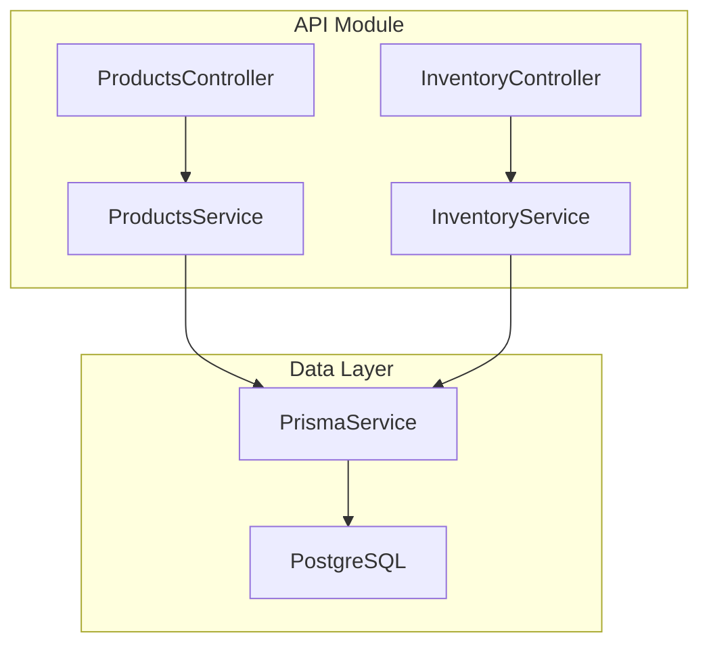
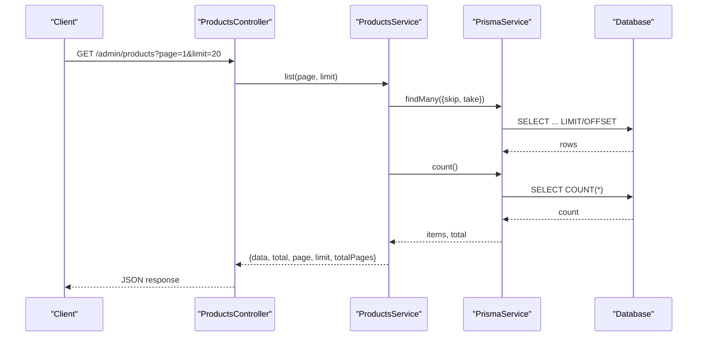
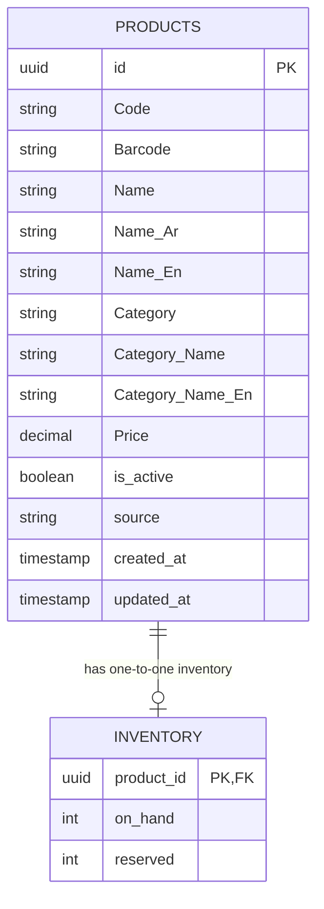
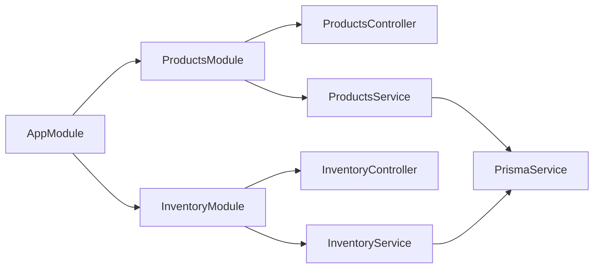

# Products Endpoints

<cite>
**Referenced Files in This Document**
- [products.controller.ts](file://apps/api/src/modules/products/products.controller.ts)
- [products.service.ts](file://apps/api/src/modules/products/products.service.ts)
- [inventory.controller.ts](file://apps/api/src/modules/inventory/inventory.controller.ts)
- [inventory.service.ts](file://apps/api/src/modules/inventory/inventory.service.ts)
- [schema.prisma](file://apps/api/prisma/schema.prisma)
- [app.module.ts](file://apps/api/src/app.module.ts)
</cite>

## Table of Contents
1. Introduction
2. Project Structure
3. Core Components
4. Architecture Overview
5. Detailed Component Analysis
6. Dependency Analysis
7. Performance Considerations
8. Troubleshooting Guide
9. Conclusion

## Introduction
This document provides detailed API documentation for product management endpoints, focusing on the current implementation in the API module. It covers:
- Product listing with pagination
- Inventory listing with pagination
- Data models and relationships (products and inventory)
- Request/response schemas based on actual code
- Filtering parameters supported today
- Guidance for extending to full CRUD, search, categories, image uploads, and real-time updates

Note: The repository currently exposes read-only, paginated endpoints for products and inventory under admin routes. Additional operations (create/update/delete), category management, search, and image upload are not implemented yet in these modules.

## Project Structure
The product-related functionality is organized into a NestJS module with controllers and services that interact with Prisma to query the database.

**Diagram sources**
- [products.controller.ts:1-15](file://apps/api/src/modules/products/products.controller.ts#L1-L15)
- [products.service.ts:1-27](file://apps/api/src/modules/products/products.service.ts#L1-L27)
- [inventory.controller.ts:1-15](file://apps/api/src/modules/inventory/inventory.controller.ts#L1-L15)
- [inventory.service.ts:1-27](file://apps/api/src/modules/inventory/inventory.service.ts#L1-L27)
- [app.module.ts:1-30](file://apps/api/src/app.module.ts#L1-L30)

**Section sources**
- [app.module.ts:1-30](file://apps/api/src/app.module.ts#L1-L30)

## Core Components
- ProductsController: Exposes GET /admin/products with pagination.
- ProductsService: Queries products via Prisma with skip/take and returns total count and page metadata.
- InventoryController: Exposes GET /admin/inventory with pagination.
- InventoryService: Queries inventory via Prisma with skip/take and returns total count and page metadata.

Authentication: Both controllers are guarded by AdminAuthGuard, requiring admin privileges.

**Section sources**
- [products.controller.ts:1-15](file://apps/api/src/modules/products/products.controller.ts#L1-L15)
- [products.service.ts:1-27](file://apps/api/src/modules/products/products.service.ts#L1-L27)
- [inventory.controller.ts:1-15](file://apps/api/src/modules/inventory/inventory.controller.ts#L1-L15)
- [inventory.service.ts:1-27](file://apps/api/src/modules/inventory/inventory.service.ts#L1-L27)

## Architecture Overview
The request flow for product and inventory listing:
- Client sends an authenticated GET request to the admin endpoint.
- Controller validates query parameters (page, limit).
- Service computes skip and calls Prisma to fetch items and counts.
- Response includes data array and pagination metadata.

**Diagram sources**
- [products.controller.ts:10-13](file://apps/api/src/modules/products/products.controller.ts#L10-L13)
- [products.service.ts:8-24](file://apps/api/src/modules/products/products.service.ts#L8-L24)

## Detailed Component Analysis

### Products API
- Endpoint: GET /admin/products
- Authentication: AdminAuthGuard required
- Query Parameters:
  - page: integer, default 1
  - limit: integer, default 20
- Behavior:
  - Computes skip = (page - 1) * limit
  - Fetches items and total count concurrently
  - Returns paginated results with metadata

Request Example
- GET /admin/products?page=1&limit=20

Response Schema
- data: array of product objects
- total: number
- page: number
- limit: number
- totalPages: number

Notes
- No filtering or sorting parameters are implemented at this time.
- No create/update/delete endpoints are exposed.

**Section sources**
- [products.controller.ts:5-13](file://apps/api/src/modules/products/products.controller.ts#L5-L13)
- [products.service.ts:8-24](file://apps/api/src/modules/products/products.service.ts#L8-L24)

### Inventory API
- Endpoint: GET /admin/inventory
- Authentication: AdminAuthGuard required
- Query Parameters:
  - page: integer, default 1
  - limit: integer, default 20
- Behavior:
  - Computes skip = (page - 1) * limit
  - Fetches inventory records and total count concurrently
  - Returns paginated results with metadata

Request Example
- GET /admin/inventory?page=1&limit=20

Response Schema
- data: array of inventory objects
- total: number
- page: number
- limit: number
- totalPages: number

Notes
- No filtering or sorting parameters are implemented at this time.
- No create/update/delete endpoints are exposed.

**Section sources**
- [inventory.controller.ts:5-13](file://apps/api/src/modules/inventory/inventory.controller.ts#L5-L13)
- [inventory.service.ts:8-24](file://apps/api/src/modules/inventory/inventory.service.ts#L8-L24)

### Data Models and Relationships
The database schema defines the core entities used by the APIs.

Key fields
- products: identification (Code, Barcode), names (multilingual), category fields, pricing, active flag, timestamps
- inventory: stock levels per product (on_hand, reserved)

Relationships
- One product maps to one inventory record via product_id foreign key

**Diagram sources**
- [schema.prisma:595-613](file://apps/api/prisma/schema.prisma#L595-L613)
- [schema.prisma:529-536](file://apps/api/prisma/schema.prisma#L529-L536)

**Section sources**
- [schema.prisma:595-613](file://apps/api/prisma/schema.prisma#L595-L613)
- [schema.prisma:529-536](file://apps/api/prisma/schema.prisma#L529-L536)

### Search Functionality
Current state
- No search endpoints are implemented in the products or inventory modules.

Recommendations for future implementation
- Add text search on product Name, Name_En, Name_Ar, Category, and Category_Name using PostgreSQL trigram or full-text search.
- Provide query parameters such as q, category, min_price, max_price, sort_by, order.
- Use indexes on searchable columns to optimize performance.

[No sources needed since this section does not analyze specific files]

### Category Management
Current state
- No dedicated category endpoints exist. Categories are stored as strings in the products model.

Recommendations for future implementation
- Introduce a categories table with normalized fields and relationships to products.
- Provide CRUD endpoints for categories and update products to reference category IDs.

[No sources needed since this section does not analyze specific files]

### Image Upload Capabilities
Current state
- No image upload endpoints are implemented for products.

Recommendations for future implementation
- Add file upload handling (e.g., multipart/form-data) to store images in object storage.
- Persist image URLs in a new images table linked to products.
- Provide endpoints to upload, list, update, and delete product images.

[No sources needed since this section does not analyze specific files]

### Real-Time Inventory Updates
Current state
- No real-time mechanisms are implemented in the inventory module.

Recommendations for future implementation
- Emit events when inventory changes (e.g., on_hand adjustments).
- Use server-side events or websockets to push updates to clients.
- Implement optimistic UI updates on client apps.

[No sources needed since this section does not analyze specific files]

## Dependency Analysis
Module registration and dependencies:
- AppModule imports ProductsModule and InventoryModule.
- Controllers depend on their respective services.
- Services depend on PrismaService for database access.

**Diagram sources**
- [app.module.ts:14-27](file://apps/api/src/app.module.ts#L14-L27)
- [products.controller.ts:1-15](file://apps/api/src/modules/products/products.controller.ts#L1-L15)
- [products.service.ts:1-27](file://apps/api/src/modules/products/products.service.ts#L1-L27)
- [inventory.controller.ts:1-15](file://apps/api/src/modules/inventory/inventory.controller.ts#L1-L15)
- [inventory.service.ts:1-27](file://apps/api/src/modules/inventory/inventory.service.ts#L1-L27)

**Section sources**
- [app.module.ts:14-27](file://apps/api/src/app.module.ts#L14-L27)

## Performance Considerations
- Pagination: Current implementations use skip/take; ensure appropriate limits to avoid large offsets.
- Count queries: Separate count queries can be expensive; consider caching totals for high-traffic endpoints.
- Indexing: Ensure indexes on frequently filtered columns (e.g., Category, is_active) once filtering/search is added.
- Concurrency: Services already fetch items and counts concurrently; maintain this pattern for other endpoints.
- Caching: Consider application-level caching (e.g., Redis) for read-heavy catalog endpoints.
- Database tuning: Use connection pooling and query optimization for large catalogs.

[No sources needed since this section provides general guidance]

## Troubleshooting Guide
Common issues and resolutions:
- Unauthorized access: Ensure requests include valid admin credentials; endpoints are guarded by AdminAuthGuard.
- Invalid pagination: page must be >= 1; limit should be reasonable (default 20).
- Empty results: Verify database contains products/inventory records; check filters if extended later.
- Slow responses: Review indexes and consider adding caching for frequent reads.

**Section sources**
- [products.controller.ts:5-13](file://apps/api/src/modules/products/products.controller.ts#L5-L13)
- [inventory.controller.ts:5-13](file://apps/api/src/modules/inventory/inventory.controller.ts#L5-L13)

## Conclusion
The current product and inventory APIs provide secure, paginated read access for administrators. To support full product management, consider implementing:
- Full CRUD endpoints for products and categories
- Search and filtering capabilities
- Image upload and management
- Real-time inventory updates via events/websockets
- Robust caching and indexing strategies for large catalogs

These enhancements will improve usability, performance, and scalability for product catalog operations.