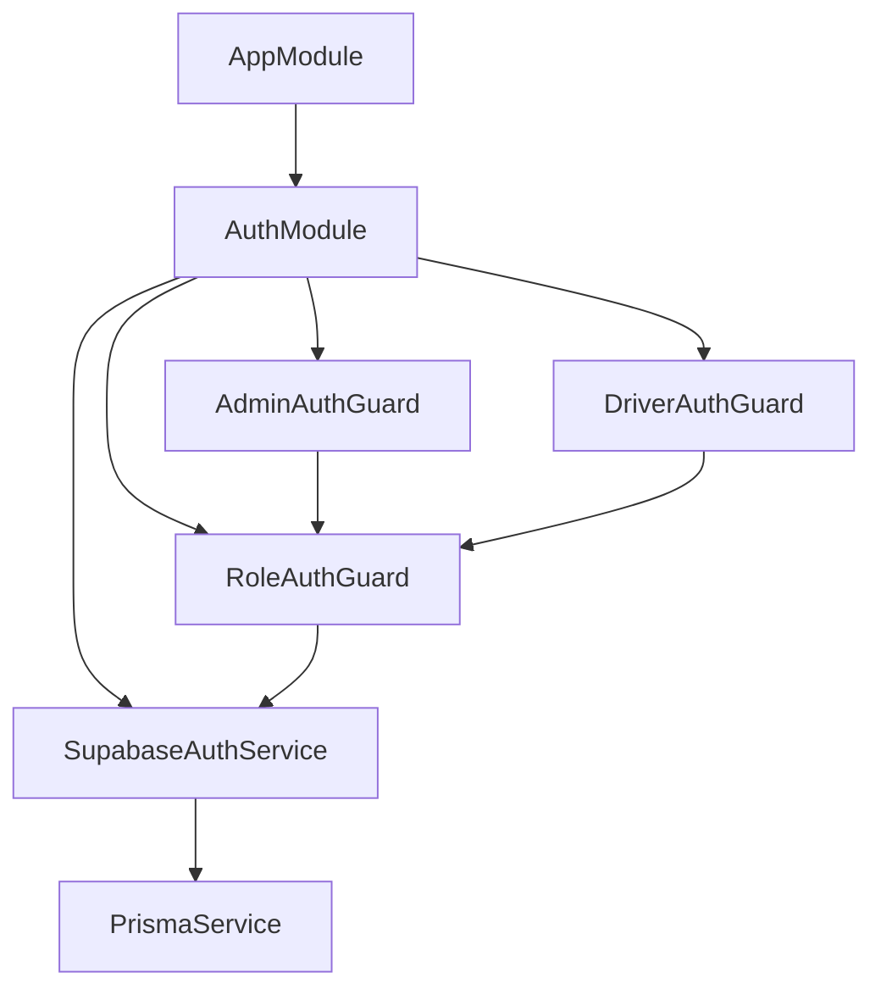
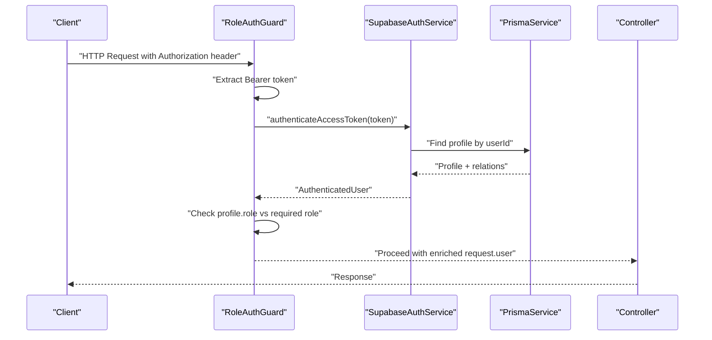
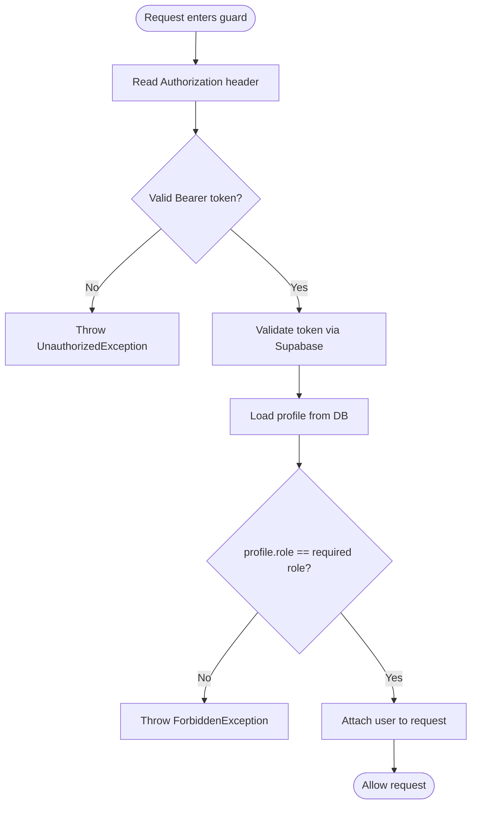
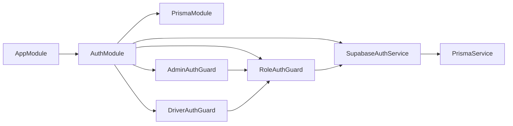

# Authentication & Authorization

<cite>
**Referenced Files in This Document**
- [supabase-auth.service.ts](file://apps/api/src/auth/supabase-auth.service.ts)
- [role-auth.guard.ts](file://apps/api/src/auth/role-auth.guard.ts)
- [admin-auth.guard.ts](file://apps/api/src/auth/admin-auth.guard.ts)
- [driver-auth.guard.ts](file://apps/api/src/auth/driver-auth.guard.ts)
- [auth.module.ts](file://apps/api/src/auth/auth.module.ts)
- [app.module.ts](file://apps/api/src/app.module.ts)
- [schema.prisma](file://apps/api/prisma/schema.prisma)
- [authSession.ts](file://apps/shopper-web/src/lib/authSession.ts)
</cite>

## Table of Contents
1. [Introduction](#introduction)
2. [Project Structure](#project-structure)
3. [Core Components](#core-components)
4. [Architecture Overview](#architecture-overview)
5. [Detailed Component Analysis](#detailed-component-analysis)
6. [Dependency Analysis](#dependency-analysis)
7. [Performance Considerations](#performance-considerations)
8. [Troubleshooting Guide](#troubleshooting-guide)
9. [Conclusion](#conclusion)
10. [Appendices](#appendices)

## Introduction
This document explains the authentication and authorization system implemented in the API service. It covers:
- JWT token validation via Supabase
- Role-based access control (RBAC) for admin, driver, and customer roles
- Guard mechanisms to protect routes
- Session management on the web client
- Security best practices, token refresh strategies, and common issues

The system uses Supabase Auth to authenticate users and validate access tokens. The API validates incoming Bearer tokens, resolves user identity, loads profile data from the database, and enforces role-based permissions through NestJS guards.

## Project Structure
Authentication-related code is organized under apps/api/src/auth with a dedicated module that wires providers and guards. The application module imports this module to make auth services and guards available across features.

**Diagram sources**
- [app.module.ts:14-27](file://apps/api/src/app.module.ts#L14-L27)
- [auth.module.ts:8-12](file://apps/api/src/auth/auth.module.ts#L8-L12)
- [role-auth.guard.ts:1-37](file://apps/api/src/auth/role-auth.guard.ts#L1-L37)
- [admin-auth.guard.ts:1-10](file://apps/api/src/auth/admin-auth.guard.ts#L1-L10)
- [driver-auth.guard.ts:1-10](file://apps/api/src/auth/driver-auth.guard.ts#L1-L10)
- [supabase-auth.service.ts:1-24](file://apps/api/src/auth/supabase-auth.service.ts#L1-L24)

**Section sources**
- [app.module.ts:14-27](file://apps/api/src/app.module.ts#L14-L27)
- [auth.module.ts:8-12](file://apps/api/src/auth/auth.module.ts#L8-L12)

## Core Components
- SupabaseAuthService: Validates tokens, signs in users, creates users, and resolves profiles.
- Role-based Guards: Enforce required roles by validating tokens and checking profile.role.
- Module wiring: Exposes auth services and guards for use in feature modules.

Key responsibilities:
- Token validation against Supabase using service role credentials
- Profile resolution from Prisma-managed database
- Role checks and request context enrichment
- Error handling for invalid or expired tokens and insufficient permissions

**Section sources**
- [supabase-auth.service.ts:11-68](file://apps/api/src/auth/supabase-auth.service.ts#L11-L68)
- [role-auth.guard.ts:4-37](file://apps/api/src/auth/role-auth.guard.ts#L4-L37)
- [admin-auth.guard.ts:5-10](file://apps/api/src/auth/admin-auth.guard.ts#L5-L10)
- [driver-auth.guard.ts:5-10](file://apps/api/src/auth/driver-auth.guard.ts#L5-L10)
- [auth.module.ts:8-12](file://apps/api/src/auth/auth.module.ts#L8-L12)

## Architecture Overview
End-to-end flow for protected requests:
- Client sends HTTP request with Authorization: Bearer <token>
- Role guard extracts token and delegates to SupabaseAuthService
- Service validates token via Supabase and fetches profile from DB
- Guard verifies role and attaches user info to request
- Controller processes request with authenticated context

**Diagram sources**
- [role-auth.guard.ts:11-37](file://apps/api/src/auth/role-auth.guard.ts#L11-L37)
- [supabase-auth.service.ts:49-68](file://apps/api/src/auth/supabase-auth.service.ts#L49-L68)

## Detailed Component Analysis

### SupabaseAuthService
Responsibilities:
- Initialize Supabase client with service role key and URL
- Sign-in with email/password, supporting phone lookup to resolve email
- Create users via admin API with metadata
- Validate access tokens and attach profile data

Token validation process:
- Calls Supabase getUser with the provided token
- Throws unauthorized if token is invalid or expired
- Loads profile including driverProfile relation
- Returns authenticated user context

Error handling:
- UnauthorizedException for invalid credentials or tokens
- Generic errors for creation failures

Security notes:
- Uses service role key server-side; never expose to clients
- Disables session persistence and auto-refresh on server client

**Section sources**
- [supabase-auth.service.ts:11-24](file://apps/api/src/auth/supabase-auth.service.ts#L11-L24)
- [supabase-auth.service.ts:26-47](file://apps/api/src/auth/supabase-auth.service.ts#L26-L47)
- [supabase-auth.service.ts:49-68](file://apps/api/src/auth/supabase-auth.service.ts#L49-L68)
- [supabase-auth.service.ts:70-79](file://apps/api/src/auth/supabase-auth.service.ts#L70-L79)

### Role-Based Access Control (RBAC)
Roles:
- Defined in schema enum app_role includes manager, pharmacist, driver, admin, customer
- Profiles store role per user and are used for authorization decisions

Guard logic:
- Extracts Bearer token from Authorization header
- Validates token and loads profile
- Compares profile.role with required role
- Attaches user context to request for downstream controllers

Extensibility:
- Add new roles by extending the allowed set in RoleAuthGuard constructor type and updating guards as needed
- Create specific guards for each role by extending RoleAuthGuard

**Diagram sources**
- [role-auth.guard.ts:11-37](file://apps/api/src/auth/role-auth.guard.ts#L11-L37)

**Section sources**
- [schema.prisma:617-635](file://apps/api/prisma/schema.prisma#L617-L635)
- [schema.prisma:743-751](file://apps/api/prisma/schema.prisma#L743-L751)
- [role-auth.guard.ts:11-37](file://apps/api/src/auth/role-auth.guard.ts#L11-L37)

### Admin and Driver Guards
- AdminAuthGuard: Requires role 'admin'
- DriverAuthGuard: Requires role 'driver'

These are thin wrappers around RoleAuthGuard to simplify route protection.

Usage example pattern:
- Apply @UseGuards(AdminAuthGuard) to admin-only endpoints
- Apply @UseGuards(DriverAuthGuard) to driver-only endpoints

**Section sources**
- [admin-auth.guard.ts:5-10](file://apps/api/src/auth/admin-auth.guard.ts#L5-L10)
- [driver-auth.guard.ts:5-10](file://apps/api/src/auth/driver-auth.guard.ts#L5-L10)

### Web Client Session Management
The web client persists an auth session locally with expiration handling:
- Stores session token and expiry timestamp
- Reads stored session and clears if expired
- Provides helpers to persist and clear sessions

Integration with API:
- Include Authorization: Bearer <sessionToken> in API requests
- On expiration, clear local storage and redirect to login

**Section sources**
- [authSession.ts:1-68](file://apps/shopper-web/src/lib/authSession.ts#L1-L68)

## Dependency Analysis
- AppModule imports AuthModule to register auth providers and guards
- AuthModule depends on PrismaModule for database access
- Guards depend on SupabaseAuthService for token validation
- SupabaseAuthService depends on PrismaService to load profiles

**Diagram sources**
- [app.module.ts:14-27](file://apps/api/src/app.module.ts#L14-L27)
- [auth.module.ts:8-12](file://apps/api/src/auth/auth.module.ts#L8-L12)
- [role-auth.guard.ts:1-37](file://apps/api/src/auth/role-auth.guard.ts#L1-L37)
- [admin-auth.guard.ts:1-10](file://apps/api/src/auth/admin-auth.guard.ts#L1-L10)
- [driver-auth.guard.ts:1-10](file://apps/api/src/auth/driver-auth.guard.ts#L1-L10)
- [supabase-auth.service.ts:1-24](file://apps/api/src/auth/supabase-auth.service.ts#L1-L24)

**Section sources**
- [app.module.ts:14-27](file://apps/api/src/app.module.ts#L14-L27)
- [auth.module.ts:8-12](file://apps/api/src/auth/auth.module.ts#L8-L12)

## Performance Considerations
- Token validation calls Supabase on every request; consider caching validated claims where appropriate at the gateway or API layer
- Profile loading includes driverProfile relation; ensure only necessary fields are requested to reduce payload size
- Avoid heavy operations inside guards; keep them fast and stateless
- Use connection pooling and indexes in the database for profile lookups

[No sources needed since this section provides general guidance]

## Troubleshooting Guide
Common issues and resolutions:
- Invalid or expired token: Ensure the client sends a valid Bearer token and that it has not expired. The guard throws UnauthorizedException for invalid or expired tokens.
- Missing Authorization header: The guard expects Authorization: Bearer <token>. Missing or malformed headers result in UnauthorizedException.
- Insufficient permissions: If profile.role does not match the required role, the guard throws ForbiddenException.
- Profile not found: If no profile exists for the authenticated user, an UnauthorizedException is thrown during token validation.
- Environment variables: SUPABASE_URL and SUPABASE_SERVICE_ROLE_KEY must be set; otherwise, initialization fails.

Operational tips:
- Log failed attempts with sanitized details for auditing
- Implement rate limiting on login endpoints to prevent brute force
- Rotate service keys periodically and restrict their scope

**Section sources**
- [role-auth.guard.ts:30-37](file://apps/api/src/auth/role-auth.guard.ts#L30-L37)
- [supabase-auth.service.ts:15-24](file://apps/api/src/auth/supabase-auth.service.ts#L15-L24)
- [supabase-auth.service.ts:49-68](file://apps/api/src/auth/supabase-auth.service.ts#L49-L68)

## Conclusion
The authentication and authorization system leverages Supabase Auth for secure token validation and NestJS guards for role-based access control. Profiles store roles and are checked at request time to enforce permissions. The web client manages sessions with expiration handling. By following the patterns outlined here, you can add custom guards, introduce new roles, and secure API endpoints consistently.

[No sources needed since this section summarizes without analyzing specific files]

## Appendices

### How to Protect Routes with Guards
- Apply the appropriate guard decorator to controller methods or classes:
  - For admin-only routes: AdminAuthGuard
  - For driver-only routes: DriverAuthGuard
- Ensure the client sends Authorization: Bearer <token> with each request

**Section sources**
- [admin-auth.guard.ts:5-10](file://apps/api/src/auth/admin-auth.guard.ts#L5-L10)
- [driver-auth.guard.ts:5-10](file://apps/api/src/auth/driver-auth.guard.ts#L5-L10)
- [role-auth.guard.ts:11-37](file://apps/api/src/auth/role-auth.guard.ts#L11-L37)

### Adding a New Role
- Extend the allowed roles in RoleAuthGuard constructor type to include the new role
- Create a new guard class extending RoleAuthGuard for the new role
- Update business logic to handle the new role where necessary

**Section sources**
- [role-auth.guard.ts:4-9](file://apps/api/src/auth/role-auth.guard.ts#L4-L9)

### Token Refresh Strategy
- Clients should monitor session expiration and refresh tokens before expiry
- On expiration, clear local session and prompt re-login
- Server-side, rely on Supabase token validation; do not implement custom signing

**Section sources**
- [authSession.ts:9-16](file://apps/shopper-web/src/lib/authSession.ts#L9-L16)
- [authSession.ts:43-54](file://apps/shopper-web/src/lib/authSession.ts#L43-L54)

### Security Best Practices
- Keep SUPABASE_SERVICE_ROLE_KEY secret and server-side only
- Validate all inputs and sanitize logs
- Use HTTPS for all communications
- Limit exposed endpoints and apply least privilege principles
- Monitor and alert on authentication failures

[No sources needed since this section provides general guidance]