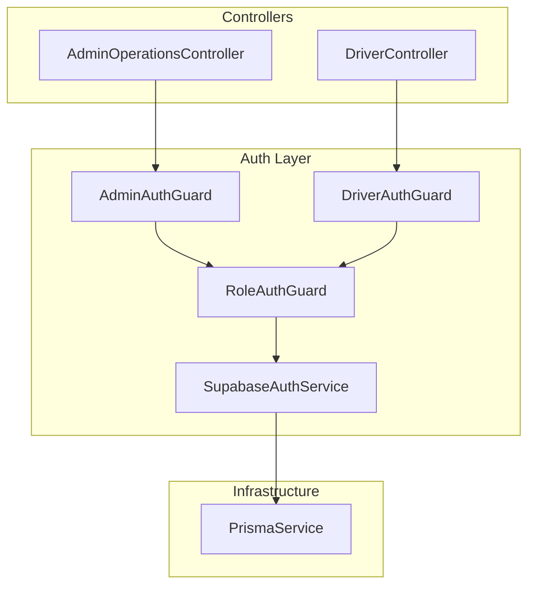
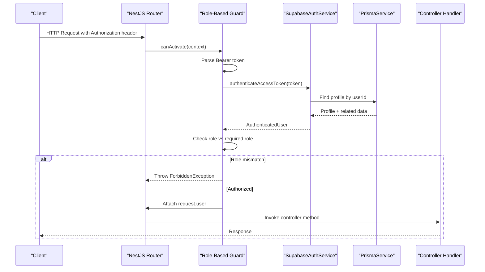
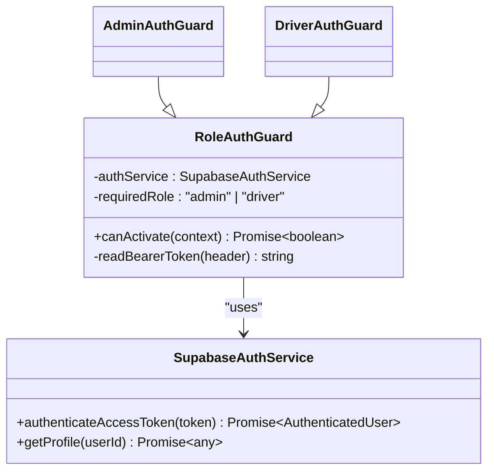
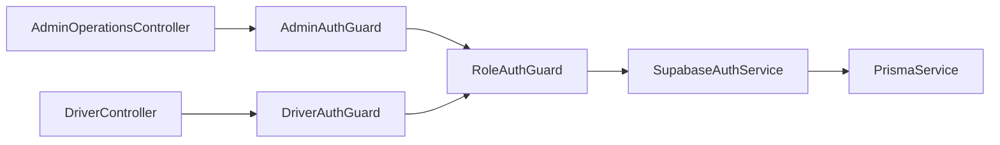

# Guard Implementations

<cite>
**Referenced Files in This Document**
- [admin-auth.guard.ts](file://apps/api/src/auth/admin-auth.guard.ts)
- [driver-auth.guard.ts](file://apps/api/src/auth/driver-auth.guard.ts)
- [role-auth.guard.ts](file://apps/api/src/auth/role-auth.guard.ts)
- [supabase-auth.service.ts](file://apps/api/src/auth/supabase-auth.service.ts)
- [auth.module.ts](file://apps/api/src/auth/auth.module.ts)
- [driver.controller.ts](file://apps/api/src/modules/driver/driver.controller.ts)
- [admin-operations.controller.ts](file://apps/api/src/modules/admin/admin-operations.controller.ts)
- [main.ts](file://apps/api/src/main.ts)
- [prisma.service.ts](file://apps/api/src/prisma/prisma.service.ts)
</cite>

## Table of Contents
1. [Introduction](#introduction)
2. [Project Structure](#project-structure)
3. [Core Components](#core-components)
4. [Architecture Overview](#architecture-overview)
5. [Detailed Component Analysis](#detailed-component-analysis)
6. [Dependency Analysis](#dependency-analysis)
7. [Performance Considerations](#performance-considerations)
8. [Troubleshooting Guide](#troubleshooting-guide)
9. [Conclusion](#conclusion)
10. [Appendices](#appendices)

## Introduction
This document explains the guard implementations used to protect API endpoints in the application. It covers admin guards, driver guards, and a reusable role-based guard that validates user roles against Supabase authentication tokens. You will learn how guards integrate with NestJS’s dependency injection, their lifecycle and execution order, and how they validate permissions. The guide also includes strategies for creating custom guards, combining multiple guards, handling failures gracefully, testing, debugging authorization issues, and performance considerations.

## Project Structure
The guard system is implemented under apps/api/src/auth and consumed by controllers across modules:
- Role-based guard base class and concrete guards for admin and driver roles
- Authentication service that validates Supabase access tokens and enriches request context
- Controllers that apply guards at controller or method level to enforce authorization

**Diagram sources**
- [role-auth.guard.ts:1-37](file://apps/api/src/auth/role-auth.guard.ts#L1-L37)
- [admin-auth.guard.ts:1-10](file://apps/api/src/auth/admin-auth.guard.ts#L1-L10)
- [driver-auth.guard.ts:1-10](file://apps/api/src/auth/driver-auth.guard.ts#L1-L10)
- [supabase-auth.service.ts:1-80](file://apps/api/src/auth/supabase-auth.service.ts#L1-L80)
- [admin-operations.controller.ts:1-72](file://apps/api/src/modules/admin/admin-operations.controller.ts#L1-L72)
- [driver.controller.ts:1-200](file://apps/api/src/modules/driver/driver.controller.ts#L1-L200)
- [prisma.service.ts:1-15](file://apps/api/src/prisma/prisma.service.ts#L1-L15)

**Section sources**
- [auth.module.ts:1-13](file://apps/api/src/auth/auth.module.ts#L1-L13)
- [main.ts:1-44](file://apps/api/src/main.ts#L1-L44)

## Core Components
- Role-based guard (base): Validates bearer token via Supabase, checks profile role, and attaches user metadata to the request.
- Admin guard: Extends the role-based guard to require the admin role.
- Driver guard: Extends the role-based guard to require the driver role.
- Supabase auth service: Validates access tokens, fetches profiles from Prisma, and returns authenticated user context.

Key responsibilities:
- Token parsing and validation
- Role enforcement
- Request enrichment with user data
- Centralized error responses for unauthorized/forbidden scenarios

**Section sources**
- [role-auth.guard.ts:1-37](file://apps/api/src/auth/role-auth.guard.ts#L1-L37)
- [admin-auth.guard.ts:1-10](file://apps/api/src/auth/admin-auth.guard.ts#L1-L10)
- [driver-auth.guard.ts:1-10](file://apps/api/src/auth/driver-auth.guard.ts#L1-L10)
- [supabase-auth.service.ts:1-80](file://apps/api/src/auth/supabase-auth.service.ts#L1-L80)

## Architecture Overview
NestJS executes guards before route handlers. For protected routes:
1. The framework invokes the guard’s canActivate method.
2. The guard reads the Authorization header, extracts the bearer token, and calls SupabaseAuthService.authenticateAccessToken.
3. The service validates the token and retrieves the user profile from Prisma.
4. The guard verifies the user’s role matches the required role and attaches user info to the request.
5. If validation fails, appropriate HTTP exceptions are thrown; otherwise, the handler runs.

**Diagram sources**
- [role-auth.guard.ts:11-27](file://apps/api/src/auth/role-auth.guard.ts#L11-L27)
- [supabase-auth.service.ts:49-64](file://apps/api/src/auth/supabase-auth.service.ts#L49-L64)
- [prisma.service.ts:1-15](file://apps/api/src/prisma/prisma.service.ts#L1-L15)

## Detailed Component Analysis

### Role-Based Guard (Base)
Purpose:
- Validate bearer token format
- Authenticate via Supabase
- Enforce required role
- Enrich request with user context

Behavior:
- Extracts token from Authorization header
- Calls SupabaseAuthService.authenticateAccessToken
- Compares profile.role with required role
- Sets request.user with userId, role, profile, and driverProfile
- Throws UnauthorizedException for invalid headers/tokens/profiles
- Throws ForbiddenException for insufficient permissions

Complexity:
- O(1) per request for token parsing and role check
- One database lookup per authenticated request via Prisma

Error handling:
- Invalid header format -> UnauthorizedException
- Invalid/expired token -> UnauthorizedException
- Missing profile -> UnauthorizedException
- Role mismatch -> ForbiddenException

Usage:
- Extended by AdminAuthGuard and DriverAuthGuard

**Section sources**
- [role-auth.guard.ts:1-37](file://apps/api/src/auth/role-auth.guard.ts#L1-L37)

#### Class Diagram

**Diagram sources**
- [role-auth.guard.ts:1-37](file://apps/api/src/auth/role-auth.guard.ts#L1-L37)
- [admin-auth.guard.ts:1-10](file://apps/api/src/auth/admin-auth.guard.ts#L1-L10)
- [driver-auth.guard.ts:1-10](file://apps/api/src/auth/driver-auth.guard.ts#L1-L10)
- [supabase-auth.service.ts:1-80](file://apps/api/src/auth/supabase-auth.service.ts#L1-L80)

### Admin Guard
Purpose:
- Protect admin-only endpoints by requiring the admin role.

Implementation:
- Extends RoleAuthGuard with requiredRole set to admin
- Injected via NestJS DI and exported through AuthModule

Use cases:
- Admin operations controller endpoints
- Any endpoint requiring administrative privileges

**Section sources**
- [admin-auth.guard.ts:1-10](file://apps/api/src/auth/admin-auth.guard.ts#L1-L10)
- [auth.module.ts:1-13](file://apps/api/src/auth/auth.module.ts#L1-L13)

### Driver Guard
Purpose:
- Protect driver-specific endpoints by requiring the driver role.

Implementation:
- Extends RoleAuthGuard with requiredRole set to driver
- Re-exported via a local module for convenience in driver module

Use cases:
- Driver profile management
- Location updates
- Order acceptance/rejection and delivery lifecycle

**Section sources**
- [driver-auth.guard.ts:1-10](file://apps/api/src/auth/driver-auth.guard.ts#L1-L10)
- [driver.controller.ts:1-200](file://apps/api/src/modules/driver/driver.controller.ts#L1-L200)

### Supabase Auth Service
Purpose:
- Validate Supabase access tokens
- Retrieve user profiles and related data from Prisma
- Provide login and user creation utilities

Key methods:
- authenticateAccessToken: Validates token and returns authenticated user with profile
- getProfile: Fetches profile by userId
- signIn/createUser: Authentication and user provisioning helpers

Integration:
- Uses PrismaService to query profiles
- Configured with environment variables for Supabase URL and service role key

**Section sources**
- [supabase-auth.service.ts:1-80](file://apps/api/src/auth/supabase-auth.service.ts#L1-L80)
- [prisma.service.ts:1-15](file://apps/api/src/prisma/prisma.service.ts#L1-L15)

### Controller Usage Examples
- Admin endpoints protected by AdminAuthGuard at controller level
- Driver endpoints protected by DriverAuthGuard at method level

Examples:
- AdminOperationsController applies AdminAuthGuard to all its routes
- DriverController applies DriverAuthGuard to individual endpoints such as profile, location, and orders

**Section sources**
- [admin-operations.controller.ts:1-72](file://apps/api/src/modules/admin/admin-operations.controller.ts#L1-L72)
- [driver.controller.ts:1-200](file://apps/api/src/modules/driver/driver.controller.ts#L1-L200)

## Dependency Analysis
- Guards depend on SupabaseAuthService for token validation and profile retrieval
- SupabaseAuthService depends on PrismaService for profile queries
- Controllers depend on guards via decorators
- Global interceptors and filters are configured in main.ts but do not interfere with guard execution

**Diagram sources**
- [admin-auth.guard.ts:1-10](file://apps/api/src/auth/admin-auth.guard.ts#L1-L10)
- [driver-auth.guard.ts:1-10](file://apps/api/src/auth/driver-auth.guard.ts#L1-L10)
- [role-auth.guard.ts:1-37](file://apps/api/src/auth/role-auth.guard.ts#L1-L37)
- [supabase-auth.service.ts:1-80](file://apps/api/src/auth/supabase-auth.service.ts#L1-L80)
- [prisma.service.ts:1-15](file://apps/api/src/prisma/prisma.service.ts#L1-L15)
- [admin-operations.controller.ts:1-72](file://apps/api/src/modules/admin/admin-operations.controller.ts#L1-L72)
- [driver.controller.ts:1-200](file://apps/api/src/modules/driver/driver.controller.ts#L1-L200)

**Section sources**
- [auth.module.ts:1-13](file://apps/api/src/auth/auth.module.ts#L1-L13)
- [main.ts:1-44](file://apps/api/src/main.ts#L1-L44)

## Performance Considerations
- Token validation and profile lookup occur on every protected request. Ensure:
  - Supabase client is configured without session persistence to avoid unnecessary overhead
  - Database queries are optimized and indexed appropriately
- Prefer controller-level guards for entire modules to reduce decorator repetition
- Avoid heavy logic inside guards; delegate complex checks to services
- Use global interceptors/filters for consistent response formatting and error handling to keep guards focused

[No sources needed since this section provides general guidance]

## Troubleshooting Guide
Common errors and resolutions:
- Invalid authorization header format: Ensure requests include Authorization: Bearer <token>
- Invalid or expired token: Verify token validity and refresh if necessary
- Profile not found: Confirm user has a corresponding profile record in the database
- Insufficient permissions: Check that the user’s role matches the required role enforced by the guard

Debugging steps:
- Log the presence and format of the Authorization header in your client
- Temporarily add logging in the guard’s canActivate to inspect parsed token and authenticated user
- Verify environment variables SUPABASE_URL and SUPABASE_SERVICE_ROLE_KEY are set correctly
- Test with known valid tokens and roles using an API client

Graceful failure handling:
- Guards throw standard NestJS exceptions which are handled globally by HttpExceptionFilter
- Clients should handle 401 Unauthorized and 403 Forbidden responses accordingly

**Section sources**
- [role-auth.guard.ts:11-36](file://apps/api/src/auth/role-auth.guard.ts#L11-L36)
- [supabase-auth.service.ts:26-64](file://apps/api/src/auth/supabase-auth.service.ts#L26-L64)
- [main.ts:30-31](file://apps/api/src/main.ts#L30-L31)

## Conclusion
The guard system uses a clean, extensible design centered around a role-based guard that validates Supabase tokens and enforces roles. Admin and driver guards extend this base to provide simple, declarative protection for endpoints. Integration with NestJS DI ensures testability and modularity. By following the patterns outlined here, you can create custom guards, combine them when needed, and maintain robust authorization across the application.

[No sources needed since this section summarizes without analyzing specific files]

## Appendices

### Guard Lifecycle and Execution Order
- NestJS executes guards before invoking controller handlers
- Multiple guards can be applied; they execute in the order specified
- If any guard throws an exception, the handler is skipped and the global filter formats the response

[No sources needed since this section provides general guidance]

### Creating Custom Guards
To create a custom guard:
- Implement CanActivate and inject dependencies via constructor
- In canActivate, extract context, perform checks, and either return true or throw an appropriate exception
- Register the guard in a module and apply it via @UseGuards

Example pattern reference:
- See how AdminAuthGuard and DriverAuthGuard extend RoleAuthGuard to define required roles

**Section sources**
- [admin-auth.guard.ts:1-10](file://apps/api/src/auth/admin-auth.guard.ts#L1-L10)
- [driver-auth.guard.ts:1-10](file://apps/api/src/auth/driver-auth.guard.ts#L1-L10)
- [role-auth.guard.ts:1-37](file://apps/api/src/auth/role-auth.guard.ts#L1-L37)

### Combining Multiple Guards
- Apply multiple guards at controller or method level to layer permissions
- Example: Require both authentication and a specific role by stacking guards

[No sources needed since this section provides general guidance]

### Testing Strategies
- Unit tests: Mock SupabaseAuthService and PrismaService to isolate guard logic
- Integration tests: Spin up a test server with real guards and assert responses for valid/invalid tokens and roles
- Assert behavior for:
  - Valid token with correct role -> 200 OK
  - Valid token with wrong role -> 403 Forbidden
  - Invalid/expired token -> 401 Unauthorized
  - Missing/invalid Authorization header -> 401 Unauthorized

[No sources needed since this section provides general guidance]

### Debugging Techniques
- Add temporary console logs in canActivate to inspect request.user and role checks
- Validate environment configuration for Supabase credentials
- Use API clients to reproduce issues with different tokens and roles
- Review global exception filter output for standardized error messages

**Section sources**
- [role-auth.guard.ts:11-36](file://apps/api/src/auth/role-auth.guard.ts#L11-L36)
- [supabase-auth.service.ts:15-24](file://apps/api/src/auth/supabase-auth.service.ts#L15-L24)
- [main.ts:30-31](file://apps/api/src/main.ts#L30-L31)