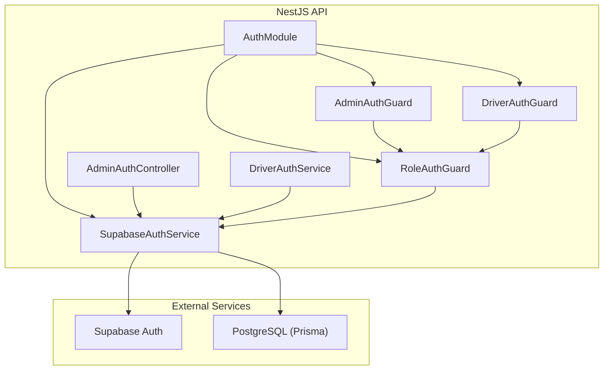
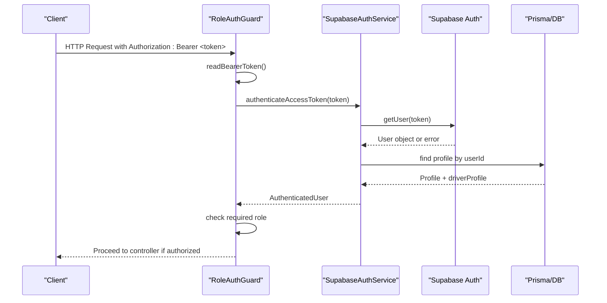
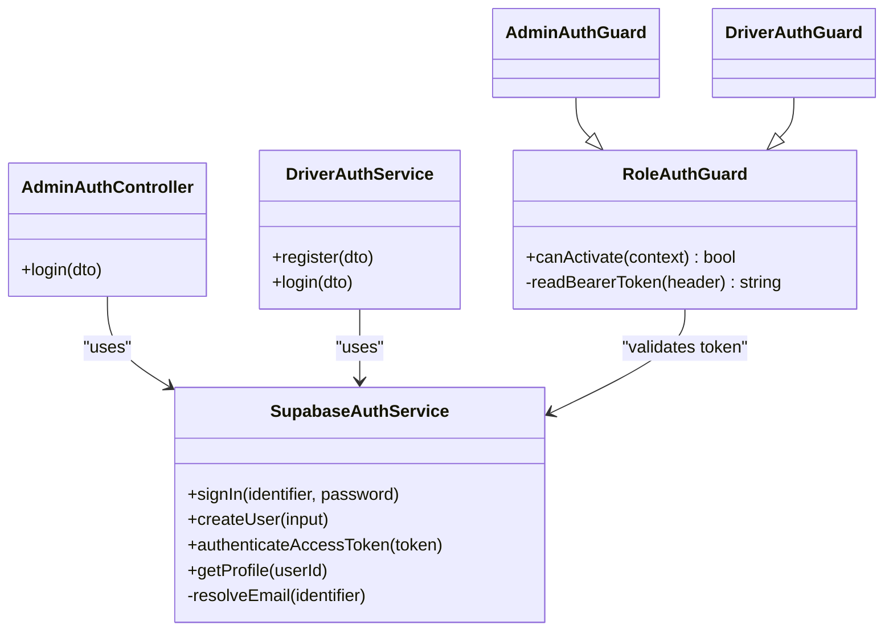
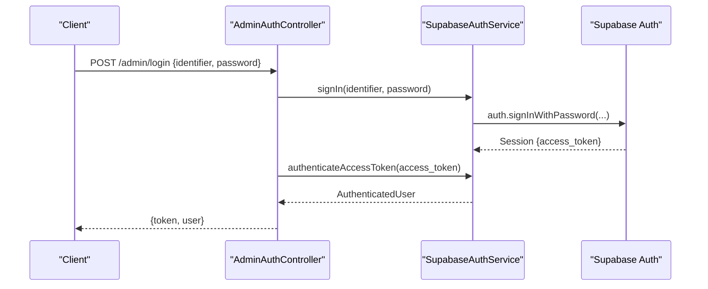
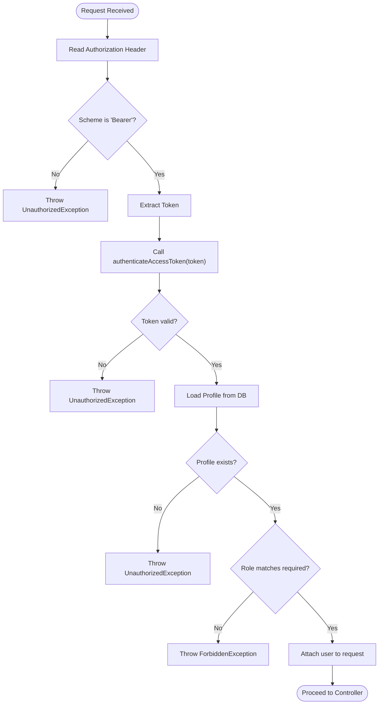
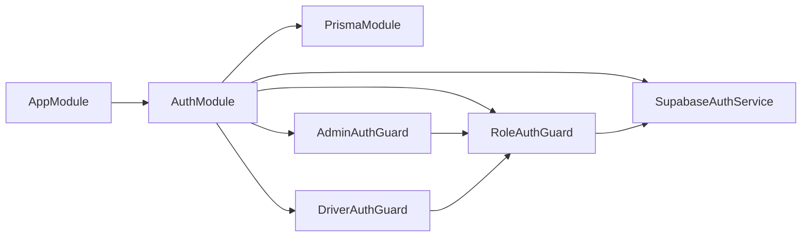

# JWT Token Management

<cite>
**Referenced Files in This Document**
- [supabase-auth.service.ts](file://apps/api/src/auth/supabase-auth.service.ts)
- [role-auth.guard.ts](file://apps/api/src/auth/role-auth.guard.ts)
- [admin-auth.guard.ts](file://apps/api/src/auth/admin-auth.guard.ts)
- [driver-auth.guard.ts](file://apps/api/src/auth/driver-auth.guard.ts)
- [auth.module.ts](file://apps/api/src/auth/auth.module.ts)
- [app.module.ts](file://apps/api/src/app.module.ts)
- [main.ts](file://apps/api/src/main.ts)
- [admin-auth.controller.ts](file://apps/api/src/modules/admin/admin-auth.controller.ts)
- [driver-auth.service.ts](file://apps/api/src/modules/driver/driver-auth.service.ts)
</cite>

## Table of Contents
1. Introduction
2. Project Structure
3. Core Components
4. Architecture Overview
5. Detailed Component Analysis
6. Dependency Analysis
7. Performance Considerations
8. Troubleshooting Guide
9. Conclusion
10. Appendices

## Introduction
This document explains how the NestJS backend integrates with Supabase Auth to manage JWT tokens for authentication and authorization. It covers token generation, validation, refresh behavior, token structure assumptions, expiration handling, security measures, and error handling. It also provides guidance on implementing custom token validators, adding token-based middleware, and troubleshooting common JWT issues. Finally, it outlines best practices for token storage and production security.

## Project Structure
The authentication system is centered around a dedicated Auth module that exposes:
- A service to interact with Supabase Auth (sign-in, user creation, access token verification).
- Role-based guards that extract Bearer tokens from requests, validate them via Supabase, and enforce role checks.
- Controllers and services that use these guards to protect endpoints.

**Diagram sources**
- [auth.module.ts:8-12](file://apps/api/src/auth/auth.module.ts#L8-L12)
- [role-auth.guard.ts:5-36](file://apps/api/src/auth/role-auth.guard.ts#L5-L36)
- [admin-auth.guard.ts:5-9](file://apps/api/src/auth/admin-auth.guard.ts#L5-L9)
- [driver-auth.guard.ts:5-9](file://apps/api/src/auth/driver-auth.guard.ts#L5-L9)
- [supabase-auth.service.ts:11-64](file://apps/api/src/auth/supabase-auth.service.ts#L11-L64)
- [admin-auth.controller.ts:13-36](file://apps/api/src/modules/admin/admin-auth.controller.ts#L13-L36)
- [driver-auth.service.ts:11-126](file://apps/api/src/modules/driver/driver-auth.service.ts#L11-L126)

**Section sources**
- [auth.module.ts:8-12](file://apps/api/src/auth/auth.module.ts#L8-L12)
- [app.module.ts:14-27](file://apps/api/src/app.module.ts#L14-L27)
- [main.ts:7-35](file://apps/api/src/main.ts#L7-L35)

## Core Components
- SupabaseAuthService: Handles sign-in, user creation, and access token verification against Supabase Auth. It also resolves email identifiers and fetches profiles from the database.
- Role-based Guards: Extract and validate Bearer tokens, call the service to authenticate, and attach user context to the request. Admin and Driver guards specialize by enforcing specific roles.
- AdminAuthController: Provides an admin login endpoint that returns the access token after verifying admin role.
- DriverAuthService: Manages driver registration and login flows, returning access tokens and enriched driver profile data.

Key responsibilities:
- Token extraction from Authorization headers.
- Token validation via Supabase Auth.
- Role enforcement using profile metadata stored in the database.
- Error handling for invalid or expired tokens.

**Section sources**
- [supabase-auth.service.ts:11-64](file://apps/api/src/auth/supabase-auth.service.ts#L11-L64)
- [role-auth.guard.ts:11-36](file://apps/api/src/auth/role-auth.guard.ts#L11-L36)
- [admin-auth.guard.ts:5-9](file://apps/api/src/auth/admin-auth.guard.ts#L5-L9)
- [driver-auth.guard.ts:5-9](file://apps/api/src/auth/driver-auth.guard.ts#L5-L9)
- [admin-auth.controller.ts:13-36](file://apps/api/src/modules/admin/admin-auth.controller.ts#L13-L36)
- [driver-auth.service.ts:11-126](file://apps/api/src/modules/driver/driver-auth.service.ts#L11-L126)

## Architecture Overview
The flow begins when a client calls a protected endpoint. The guard extracts the Bearer token, validates it with Supabase, loads the user’s profile, enforces the required role, and attaches user context to the request. For login endpoints, controllers return the access token obtained from Supabase Auth.

**Diagram sources**
- [role-auth.guard.ts:11-36](file://apps/api/src/auth/role-auth.guard.ts#L11-L36)
- [supabase-auth.service.ts:49-64](file://apps/api/src/auth/supabase-auth.service.ts#L49-L64)

## Detailed Component Analysis

### SupabaseAuthService
Responsibilities:
- Initialize Supabase client with environment variables.
- Sign in users and resolve email identifiers (email or phone).
- Create users via admin API.
- Validate access tokens and enrich with profile data.

Token validation flow:
- Calls Supabase Auth to verify the access token.
- On success, retrieves the corresponding profile from the database.
- Returns an authenticated user object containing user ID, Supabase user, and profile.

Error handling:
- Throws unauthorized exceptions for invalid credentials, invalid/expired tokens, or missing profiles.

Security considerations:
- Uses service role key for server-side operations.
- Disables automatic token refresh and session persistence in the client configuration.

**Section sources**
- [supabase-auth.service.ts:15-24](file://apps/api/src/auth/supabase-auth.service.ts#L15-L24)
- [supabase-auth.service.ts:26-33](file://apps/api/src/auth/supabase-auth.service.ts#L26-L33)
- [supabase-auth.service.ts:35-47](file://apps/api/src/auth/supabase-auth.service.ts#L35-L47)
- [supabase-auth.service.ts:49-64](file://apps/api/src/auth/supabase-auth.service.ts#L49-L64)
- [supabase-auth.service.ts:70-79](file://apps/api/src/auth/supabase-auth.service.ts#L70-L79)

### Role-based Guards (RoleAuthGuard, AdminAuthGuard, DriverAuthGuard)
Responsibilities:
- Extract Bearer token from Authorization header.
- Validate token via SupabaseAuthService.
- Enforce required role based on profile.
- Attach user context to the request for downstream handlers.

Token extraction:
- Splits Authorization header into scheme and token; rejects malformed headers.

Role enforcement:
- Compares profile.role against the required role; throws forbidden exception if insufficient permissions.

Customization:
- AdminAuthGuard and DriverAuthGuard extend RoleAuthGuard to specify required roles.

**Section sources**
- [role-auth.guard.ts:11-36](file://apps/api/src/auth/role-auth.guard.ts#L11-L36)
- [admin-auth.guard.ts:5-9](file://apps/api/src/auth/admin-auth.guard.ts#L5-L9)
- [driver-auth.guard.ts:5-9](file://apps/api/src/auth/driver-auth.guard.ts#L5-L9)

### AdminAuthController
Responsibilities:
- Provide an admin login endpoint.
- Authenticate via Supabase Auth and verify admin role.
- Return access token and user information.

Flow:
- Accepts identifier and password.
- Signs in through Supabase Auth.
- Validates admin role before issuing token response.

**Section sources**
- [admin-auth.controller.ts:13-36](file://apps/api/src/modules/admin/admin-auth.controller.ts#L13-L36)

### DriverAuthService
Responsibilities:
- Register drivers with profile and vehicle details.
- Login drivers and enforce approval/suspension status.
- Return access tokens and enriched driver responses.

Flow:
- Registration creates Supabase user, upserts profile, creates driver profile, then signs in to obtain token.
- Login verifies credentials, checks driver profile status, and returns token and driver data.

**Section sources**
- [driver-auth.service.ts:21-90](file://apps/api/src/modules/driver/driver-auth.service.ts#L21-L90)
- [driver-auth.service.ts:95-126](file://apps/api/src/modules/driver/driver-auth.service.ts#L95-L126)

### Class Diagram

**Diagram sources**
- [supabase-auth.service.ts:11-64](file://apps/api/src/auth/supabase-auth.service.ts#L11-L64)
- [role-auth.guard.ts:5-36](file://apps/api/src/auth/role-auth.guard.ts#L5-L36)
- [admin-auth.guard.ts:5-9](file://apps/api/src/auth/admin-auth.guard.ts#L5-L9)
- [driver-auth.guard.ts:5-9](file://apps/api/src/auth/driver-auth.guard.ts#L5-L9)
- [admin-auth.controller.ts:13-36](file://apps/api/src/modules/admin/admin-auth.controller.ts#L13-L36)
- [driver-auth.service.ts:11-126](file://apps/api/src/modules/driver/driver-auth.service.ts#L11-L126)

### Sequence Diagram: Admin Login

**Diagram sources**
- [admin-auth.controller.ts:17-36](file://apps/api/src/modules/admin/admin-auth.controller.ts#L17-L36)
- [supabase-auth.service.ts:26-33](file://apps/api/src/auth/supabase-auth.service.ts#L26-L33)
- [supabase-auth.service.ts:49-64](file://apps/api/src/auth/supabase-auth.service.ts#L49-L64)

### Flowchart: Token Validation in Guards

**Diagram sources**
- [role-auth.guard.ts:11-36](file://apps/api/src/auth/role-auth.guard.ts#L11-L36)
- [supabase-auth.service.ts:49-64](file://apps/api/src/auth/supabase-auth.service.ts#L49-L64)

## Dependency Analysis
- AppModule imports AuthModule, enabling guards and service providers across the application.
- AuthModule depends on PrismaModule for database access during profile retrieval.
- Guards depend on SupabaseAuthService for token validation.
- Controllers and services use guards to protect routes and rely on SupabaseAuthService for authentication flows.

**Diagram sources**
- [app.module.ts:14-27](file://apps/api/src/app.module.ts#L14-L27)
- [auth.module.ts:8-12](file://apps/api/src/auth/auth.module.ts#L8-L12)

**Section sources**
- [app.module.ts:14-27](file://apps/api/src/app.module.ts#L14-L27)
- [auth.module.ts:8-12](file://apps/api/src/auth/auth.module.ts#L8-L12)

## Performance Considerations
- Token validation involves a network call to Supabase Auth and a database query for profile retrieval. Minimize redundant validations by reusing validated user context within request scope.
- Avoid excessive logging of sensitive token data.
- Ensure database indexes exist on frequently queried fields (e.g., user id) to reduce latency during profile lookups.

[No sources needed since this section provides general guidance]

## Troubleshooting Guide
Common issues and resolutions:
- Invalid or expired token: Occurs when Supabase Auth rejects the token. Ensure clients send a current access token and handle token refresh on the client side.
- Missing Authorization header or malformed format: Guards require Authorization: Bearer <token>. Verify header presence and format.
- Insufficient permissions: Role mismatch between profile.role and required role. Confirm user role assignment in the database.
- Profile not found: After token validation, profile lookup fails. Ensure the user has a corresponding profile record.

Operational tips:
- Use consistent error messages to aid debugging while avoiding leaking sensitive details.
- Log failed attempts without capturing full tokens; log token prefixes or hashes for traceability.

**Section sources**
- [role-auth.guard.ts:11-36](file://apps/api/src/auth/role-auth.guard.ts#L11-L36)
- [supabase-auth.service.ts:49-64](file://apps/api/src/auth/supabase-auth.service.ts#L49-L64)

## Conclusion
The authentication system leverages Supabase Auth for secure JWT issuance and validation, with NestJS guards enforcing role-based access. Tokens are extracted from Authorization headers, validated against Supabase, and enriched with profile data from the database. This design centralizes token management, simplifies role enforcement, and provides clear error handling paths. For production, ensure strict environment configuration, secure token storage on clients, and robust monitoring for authentication failures.

[No sources needed since this section summarizes without analyzing specific files]

## Appendices

### Token Structure and Expiration Handling
- Token source: Access tokens are issued by Supabase Auth during sign-in flows.
- Validation: Server validates tokens via Supabase Auth’s getUser method.
- Expiration: If a token is invalid or expired, Supabase Auth returns an error; the server responds with an unauthorized exception. Clients should implement refresh strategies using Supabase Auth SDKs.

**Section sources**
- [supabase-auth.service.ts:26-33](file://apps/api/src/auth/supabase-auth.service.ts#L26-L33)
- [supabase-auth.service.ts:49-64](file://apps/api/src/auth/supabase-auth.service.ts#L49-L64)

### Implementing Custom Token Validators
- Extend RoleAuthGuard or create a new guard to implement custom logic before or after token validation.
- Inject SupabaseAuthService to reuse token validation and profile loading.
- Throw appropriate NestJS exceptions for errors (UnauthorizedException, ForbiddenException).

**Section sources**
- [role-auth.guard.ts:11-36](file://apps/api/src/auth/role-auth.guard.ts#L11-L36)

### Adding Token-Based Middleware
- Use global interceptors or filters for cross-cutting concerns like request correlation IDs and standardized responses.
- Apply guards at route level for fine-grained protection; use global guards only when all routes require authentication.

**Section sources**
- [main.ts:30-31](file://apps/api/src/main.ts#L30-L31)

### Token Storage Best Practices and Security Considerations
- Store tokens securely on clients (e.g., httpOnly cookies for web apps, secure storage for mobile).
- Never log full tokens; log minimal identifiers for tracing.
- Enforce HTTPS everywhere to prevent token interception.
- Configure CORS explicitly to limit origins and allowed headers.
- Rotate secrets and restrict service role keys to server-only environments.

**Section sources**
- [main.ts:13-28](file://apps/api/src/main.ts#L13-L28)
- [supabase-auth.service.ts:15-24](file://apps/api/src/auth/supabase-auth.service.ts#L15-L24)