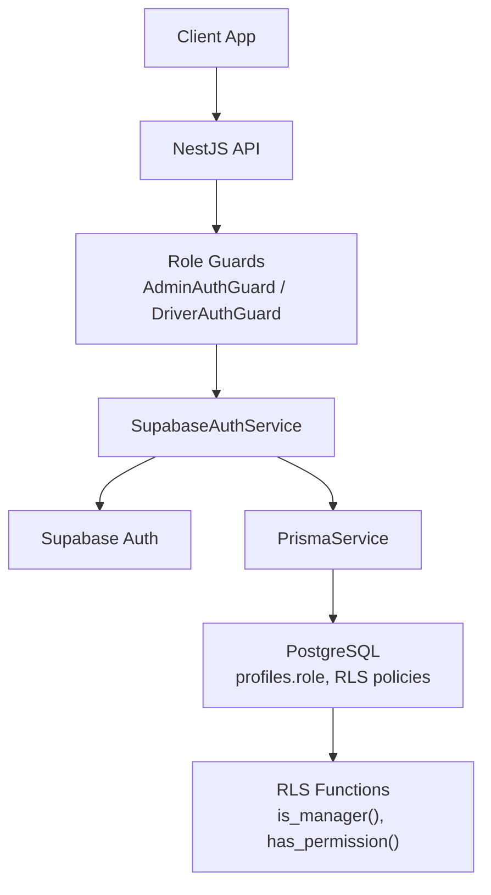
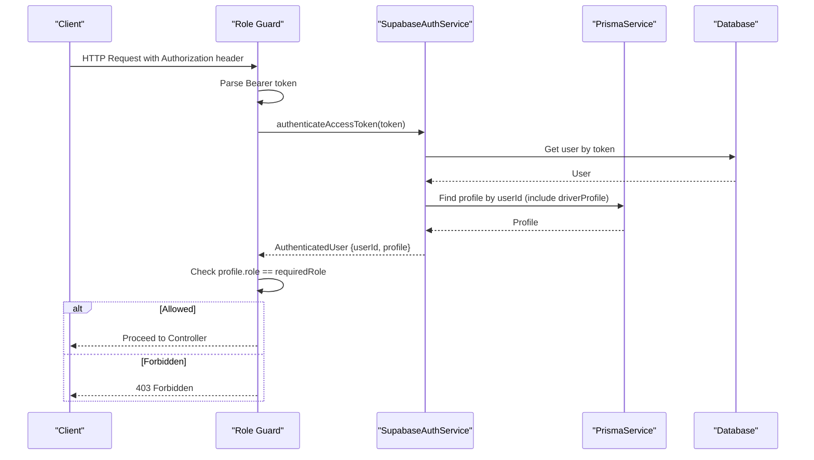
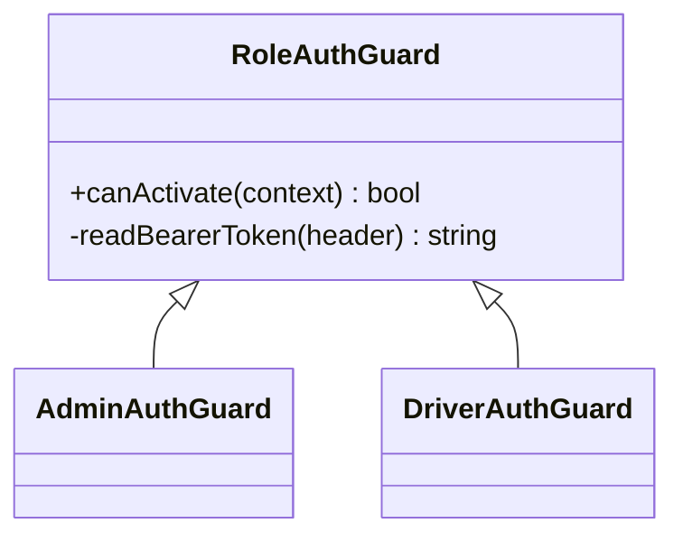
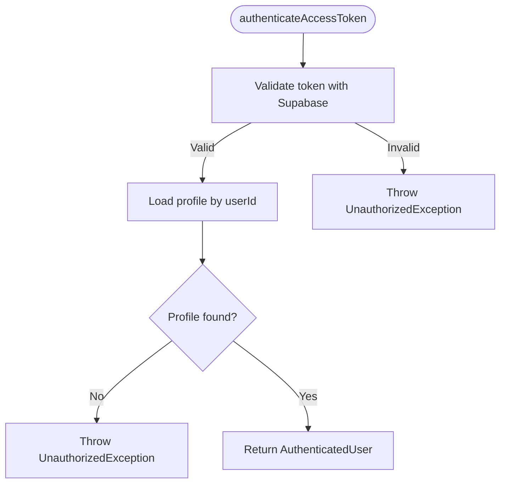
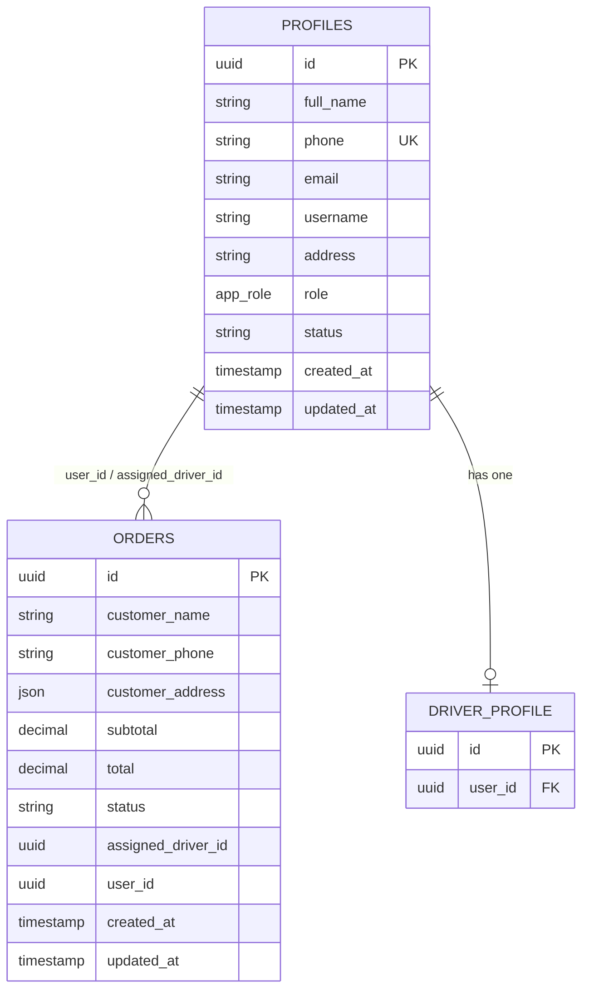
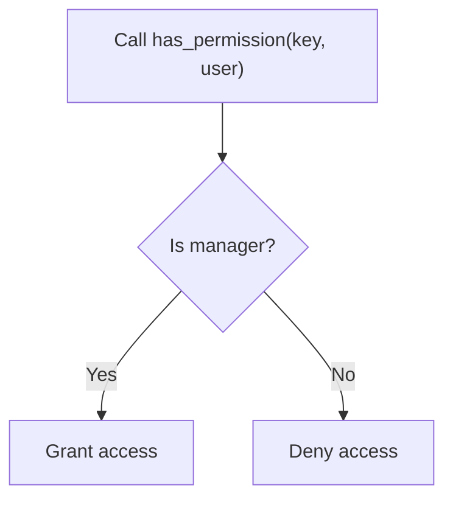
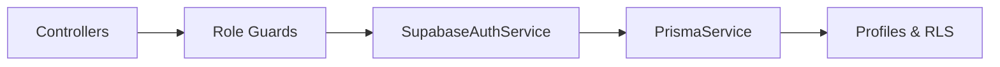

# Role-Based Access Control (RBAC)

<cite>
**Referenced Files in This Document**
- [role-auth.guard.ts](file://apps/api/src/auth/role-auth.guard.ts)
- [admin-auth.guard.ts](file://apps/api/src/auth/admin-auth.guard.ts)
- [driver-auth.guard.ts](file://apps/api/src/auth/driver-auth.guard.ts)
- [supabase-auth.service.ts](file://apps/api/src/auth/supabase-auth.service.ts)
- [auth.module.ts](file://apps/api/src/auth/auth.module.ts)
- [schema.prisma](file://apps/api/prisma/schema.prisma)
- [20260705_fix_has_permission_rbac_crash.sql](file://database/20260705_fix_has_permission_rbac_crash.sql)
- [20260713130000_admin_profile_access_controls.sql](file://supabase/migrations/20260713130000_admin_profile_access_controls.sql)
- [driver.controller.ts](file://apps/api/src/modules/driver/driver.controller.ts)
- [admin-driver.controller.ts](file://apps/api/src/modules/driver/admin-driver.controller.ts)
- [branches.controller.ts](file://apps/api/src/modules/branches/branches.controller.ts)
- [customers.controller.ts](file://apps/api/src/modules/customers/customers.controller.ts)
- [inventory.controller.ts](file://apps/api/src/modules/inventory/inventory.controller.ts)
</cite>

## Table of Contents
1. Introduction
2. Project Structure
3. Core Components
4. Architecture Overview
5. Detailed Component Analysis
6. Dependency Analysis
7. Performance Considerations
8. Troubleshooting Guide
9. Conclusion
10. Appendices

## Introduction
This document explains the Role-Based Access Control (RBAC) system implemented in the API service and enforced at the database layer. It covers roles, permission hierarchy, role checking logic, storage and management of roles, guards and middleware used to protect routes, and how to extend the system with new roles and permissions. It also addresses inheritance patterns, dynamic evaluation, and security implications.

## Project Structure
The RBAC implementation spans three layers:
- API authentication and authorization: Guards validate tokens and enforce role-based access on controllers.
- Database schema and RLS: Roles are stored in profiles; Row-Level Security policies and SQL functions enforce fine-grained data access.
- Admin operations: A secure function allows authorized users to update roles and status with auditing.

**Diagram sources**
- [role-auth.guard.ts:1-37](file://apps/api/src/auth/role-auth.guard.ts#L1-L37)
- [supabase-auth.service.ts:1-80](file://apps/api/src/auth/supabase-auth.service.ts#L1-L80)
- [schema.prisma:617-635](file://apps/api/prisma/schema.prisma#L617-L635)
- [schema.prisma:743-751](file://apps/api/prisma/schema.prisma#L743-L751)
- [20260705_fix_has_permission_rbac_crash.sql:35-44](file://database/20260705_fix_has_permission_rbac_crash.sql#L35-L44)

**Section sources**
- [role-auth.guard.ts:1-37](file://apps/api/src/auth/role-auth.guard.ts#L1-L37)
- [supabase-auth.service.ts:1-80](file://apps/api/src/auth/supabase-auth.service.ts#L1-L80)
- [schema.prisma:617-635](file://apps/api/prisma/schema.prisma#L617-L635)
- [schema.prisma:743-751](file://apps/api/prisma/schema.prisma#L743-L751)
- [20260705_fix_has_permission_rbac_crash.sql:35-44](file://database/20260705_fix_has_permission_rbac_crash.sql#L35-L44)

## Core Components
- Role guards:
  - RoleAuthGuard validates Bearer tokens, authenticates via Supabase, loads profile from the database, and enforces a required role.
  - AdminAuthGuard and DriverAuthGuard specialize RoleAuthGuard for admin and driver roles respectively.
- Authentication service:
  - SupabaseAuthService handles sign-in, user creation, token validation, and profile retrieval including related driverProfile.
- Module registration:
  - AuthModule wires up guards and the auth service and exports them for use across modules.

Key behaviors:
- Token parsing and validation occur before any controller logic runs.
- On success, request.user is populated with userId, role, profile, and driverProfile for downstream use.
- Insufficient role results in a forbidden response.

**Section sources**
- [role-auth.guard.ts:1-37](file://apps/api/src/auth/role-auth.guard.ts#L1-L37)
- [admin-auth.guard.ts:1-10](file://apps/api/src/auth/admin-auth.guard.ts#L1-L10)
- [driver-auth.guard.ts:1-10](file://apps/api/src/auth/driver-auth.guard.ts#L1-L10)
- [supabase-auth.service.ts:1-80](file://apps/api/src/auth/supabase-auth.service.ts#L1-L80)
- [auth.module.ts:1-13](file://apps/api/src/auth/auth.module.ts#L1-L13)

## Architecture Overview
RBAC is enforced at two levels:
- API level: NestJS guards check the authenticated user’s role against route requirements.
- Database level: RLS policies and SQL functions restrict row-level access based on roles and ownership.

**Diagram sources**
- [role-auth.guard.ts:11-27](file://apps/api/src/auth/role-auth.guard.ts#L11-L27)
- [supabase-auth.service.ts:49-64](file://apps/api/src/auth/supabase-auth.service.ts#L49-L64)

## Detailed Component Analysis

### Role Guards and Middleware
- RoleAuthGuard:
  - Validates Authorization header format.
  - Authenticates token using Supabase.
  - Loads profile and checks role equality.
  - Attaches user context to the request.
- AdminAuthGuard and DriverAuthGuard:
  - Extend RoleAuthGuard with fixed required roles.

Usage examples in controllers:
- Admin-only endpoints protected by AdminAuthGuard.
- Driver-only endpoints protected by DriverAuthGuard.

**Diagram sources**
- [role-auth.guard.ts:4-37](file://apps/api/src/auth/role-auth.guard.ts#L4-L37)
- [admin-auth.guard.ts:5-10](file://apps/api/src/auth/admin-auth.guard.ts#L5-L10)
- [driver-auth.guard.ts:5-10](file://apps/api/src/auth/driver-auth.guard.ts#L5-L10)

**Section sources**
- [role-auth.guard.ts:1-37](file://apps/api/src/auth/role-auth.guard.ts#L1-L37)
- [admin-auth.guard.ts:1-10](file://apps/api/src/auth/admin-auth.guard.ts#L1-L10)
- [driver-auth.guard.ts:1-10](file://apps/api/src/auth/driver-auth.guard.ts#L1-L10)
- [driver.controller.ts:64-229](file://apps/api/src/modules/driver/driver.controller.ts#L64-L229)
- [admin-driver.controller.ts:7](file://apps/api/src/modules/driver/admin-driver.controller.ts#L7)
- [branches.controller.ts:16](file://apps/api/src/modules/branches/branches.controller.ts#L16)
- [customers.controller.ts:6](file://apps/api/src/modules/customers/customers.controller.ts#L6)
- [inventory.controller.ts:6](file://apps/api/src/modules/inventory/inventory.controller.ts#L6)

### Authentication Service
- Sign-in and user creation flow through Supabase Auth.
- Token validation retrieves the user and their profile, including driverProfile when present.
- Email resolution supports phone-based identifiers.

**Diagram sources**
- [supabase-auth.service.ts:49-64](file://apps/api/src/auth/supabase-auth.service.ts#L49-L64)

**Section sources**
- [supabase-auth.service.ts:1-80](file://apps/api/src/auth/supabase-auth.service.ts#L1-L80)

### Data Model and Role Storage
- Profiles store the application role and status.
- The app_role enum defines allowed roles: manager, pharmacist, driver, admin, customer.
- Relationships include orders and driverProfile.

**Diagram sources**
- [schema.prisma:617-635](file://apps/api/prisma/schema.prisma#L617-L635)
- [schema.prisma:743-751](file://apps/api/prisma/schema.prisma#L743-L751)
- [schema.prisma:556-592](file://apps/api/prisma/schema.prisma#L556-L592)

**Section sources**
- [schema.prisma:617-635](file://apps/api/prisma/schema.prisma#L617-L635)
- [schema.prisma:743-751](file://apps/api/prisma/schema.prisma#L743-L751)
- [schema.prisma:556-592](file://apps/api/prisma/schema.prisma#L556-L592)

### Database-Level Permissions and RLS
- has_permission(): Currently delegates to is_manager() to avoid crashes and simplify permission checks.
- RLS policies on profiles restrict reads/writes to owner or managers.
- Admin operations:
  - admin_update_profile_access() enforces strict rules: only admin/manager can change roles/status, prevents self-updates, validates allowed roles and statuses, logs changes to an audit table, and revokes public execute privileges.

**Diagram sources**
- [20260705_fix_has_permission_rbac_crash.sql:35-44](file://database/20260705_fix_has_permission_rbac_crash.sql#L35-L44)

**Section sources**
- [20260705_fix_has_permission_rbac_crash.sql:1-81](file://database/20260705_fix_has_permission_rbac_crash.sql#L1-L81)
- [20260713130000_admin_profile_access_controls.sql:1-26](file://supabase/migrations/20260713130000_admin_profile_access_controls.sql#L1-L26)

### Route Protection Examples
- Admin-only controllers:
  - Branches, Customers, Inventory, and admin driver operations are guarded by AdminAuthGuard.
- Driver-only controllers:
  - Driver endpoints are guarded by DriverAuthGuard.

These decorators ensure that only users with the appropriate role can invoke the protected endpoints.

**Section sources**
- [branches.controller.ts:16](file://apps/api/src/modules/branches/branches.controller.ts#L16)
- [customers.controller.ts:6](file://apps/api/src/modules/customers/customers.controller.ts#L6)
- [inventory.controller.ts:6](file://apps/api/src/modules/inventory/inventory.controller.ts#L6)
- [admin-driver.controller.ts:7](file://apps/api/src/modules/driver/admin-driver.controller.ts#L7)
- [driver.controller.ts:64-229](file://apps/api/src/modules/driver/driver.controller.ts#L64-L229)

## Dependency Analysis
- Role guards depend on SupabaseAuthService for token validation and profile loading.
- SupabaseAuthService depends on PrismaService to read profiles.
- Controllers depend on guards to enforce access control.
- Database RLS policies and functions enforce data-level security independent of API code.

**Diagram sources**
- [auth.module.ts:1-13](file://apps/api/src/auth/auth.module.ts#L1-L13)
- [role-auth.guard.ts:1-37](file://apps/api/src/auth/role-auth.guard.ts#L1-L37)
- [supabase-auth.service.ts:1-80](file://apps/api/src/auth/supabase-auth.service.ts#L1-L80)

**Section sources**
- [auth.module.ts:1-13](file://apps/api/src/auth/auth.module.ts#L1-L13)
- [role-auth.guard.ts:1-37](file://apps/api/src/auth/role-auth.guard.ts#L1-L37)
- [supabase-auth.service.ts:1-80](file://apps/api/src/auth/supabase-auth.service.ts#L1-L80)

## Performance Considerations
- Token validation and profile lookup happen per request; ensure caching strategies where appropriate without compromising security.
- Database indexes on frequently queried fields (e.g., profiles.id, orders.user_id) improve performance under load.
- RLS policies should be concise and leverage indexed columns to minimize overhead.

[No sources needed since this section provides general guidance]

## Troubleshooting Guide
Common issues and resolutions:
- Invalid or expired token:
  - Ensure Authorization header uses Bearer scheme and contains a valid token.
  - Verify Supabase environment variables are configured correctly.
- Profile not found:
  - Confirm that a profile exists for the authenticated user and that the user ID matches.
- Insufficient permissions:
  - Check that the user’s role matches the guard’s required role.
  - For data-level restrictions, verify RLS policies and whether the user is considered a manager/admin.
- Permission function crash:
  - The migration ensures has_permission() safely returns false for non-managers instead of crashing.

**Section sources**
- [role-auth.guard.ts:30-36](file://apps/api/src/auth/role-auth.guard.ts#L30-L36)
- [supabase-auth.service.ts:49-64](file://apps/api/src/auth/supabase-auth.service.ts#L49-L64)
- [20260705_fix_has_permission_rbac_crash.sql:1-81](file://database/20260705_fix_has_permission_rbac_crash.sql#L1-L81)

## Conclusion
The RBAC system combines API-level guards with database-level RLS to provide robust access control. Roles are stored in profiles and validated during authentication. Guards protect routes, while RLS policies and SQL functions enforce data-level security. Admin operations are audited and constrained to prevent unauthorized role changes. Extending the system involves adding new roles in the schema, updating guards if necessary, and refining RLS policies and functions.

[No sources needed since this section summarizes without analyzing specific files]

## Appendices

### How to Define a New Role
- Add the role to the app_role enum in the schema.
- Update guards or create new guards if you need route-level enforcement for the new role.
- Adjust RLS policies and SQL functions to recognize the new role where needed.

**Section sources**
- [schema.prisma:743-751](file://apps/api/prisma/schema.prisma#L743-L751)
- [role-auth.guard.ts:1-37](file://apps/api/src/auth/role-auth.guard.ts#L1-L37)

### How to Assign Permissions
- API-level: Use guards to protect endpoints based on roles.
- Database-level: Use RLS policies and functions like has_permission() and is_manager() to control row access.
- Admin updates: Use admin_update_profile_access() to change roles and status securely with auditing.

**Section sources**
- [20260713130000_admin_profile_access_controls.sql:1-26](file://supabase/migrations/20260713130000_admin_profile_access_controls.sql#L1-L26)
- [20260705_fix_has_permission_rbac_crash.sql:35-44](file://database/20260705_fix_has_permission_rbac_crash.sql#L35-L44)

### Protecting Routes with RBAC
- Apply AdminAuthGuard to admin-only endpoints.
- Apply DriverAuthGuard to driver-only endpoints.
- Ensure controllers import and register guards via the module.

**Section sources**
- [auth.module.ts:1-13](file://apps/api/src/auth/auth.module.ts#L1-L13)
- [driver.controller.ts:64-229](file://apps/api/src/modules/driver/driver.controller.ts#L64-L229)
- [admin-driver.controller.ts:7](file://apps/api/src/modules/driver/admin-driver.controller.ts#L7)

### Role Inheritance Patterns
- Current implementation uses explicit role checks rather than inheritance.
- Managers and admins are treated as privileged roles in RLS functions and policies.
- To introduce inheritance, extend guards and RLS functions to evaluate role hierarchies explicitly.

**Section sources**
- [20260705_fix_has_permission_rbac_crash.sql:35-44](file://database/20260705_fix_has_permission_rbac_crash.sql#L35-L44)
- [schema.prisma:743-751](file://apps/api/prisma/schema.prisma#L743-L751)

### Dynamic Permission Evaluation
- has_permission() currently delegates to is_manager() for safety and simplicity.
- Future enhancements can add granular permission keys and evaluate them dynamically in both API and database layers.

**Section sources**
- [20260705_fix_has_permission_rbac_crash.sql:1-81](file://database/20260705_fix_has_permission_rbac_crash.sql#L1-L81)

### Security Implications
- Always validate tokens server-side and never trust client-provided roles.
- Enforce least privilege: grant minimal roles necessary for each endpoint.
- Audit sensitive operations like role changes and status updates.
- Keep RLS policies simple and indexed to reduce risk and improve performance.

[No sources needed since this section provides general guidance]