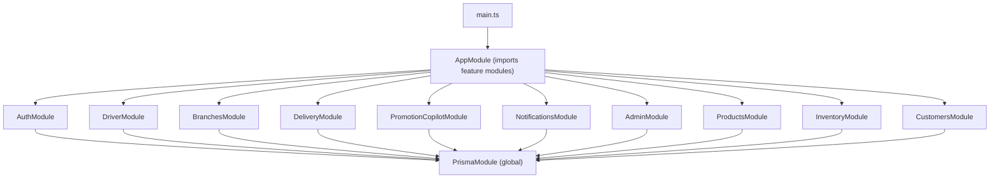
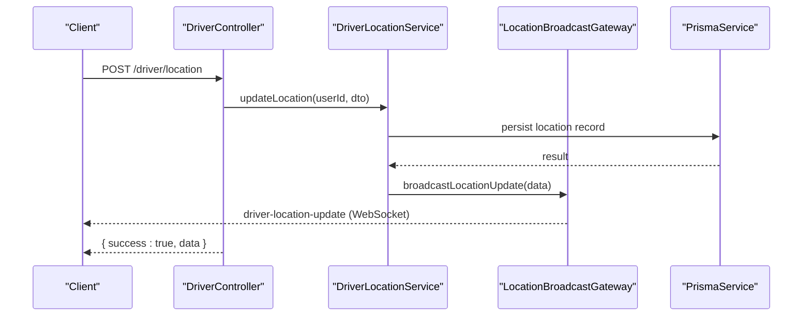
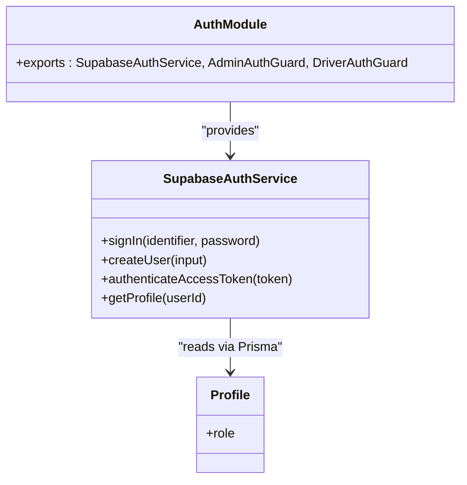
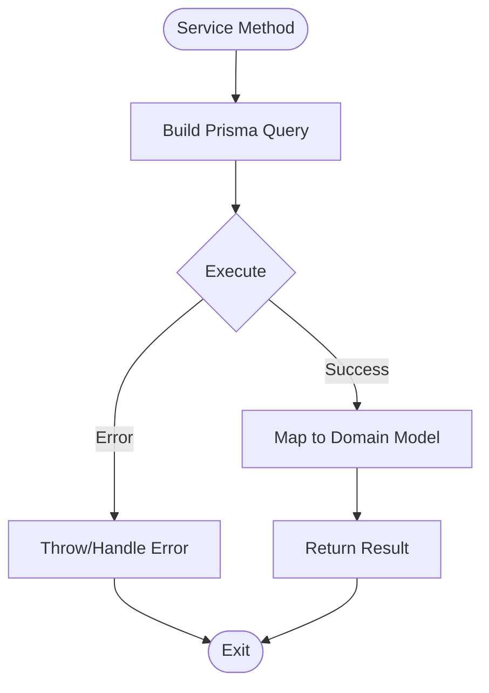
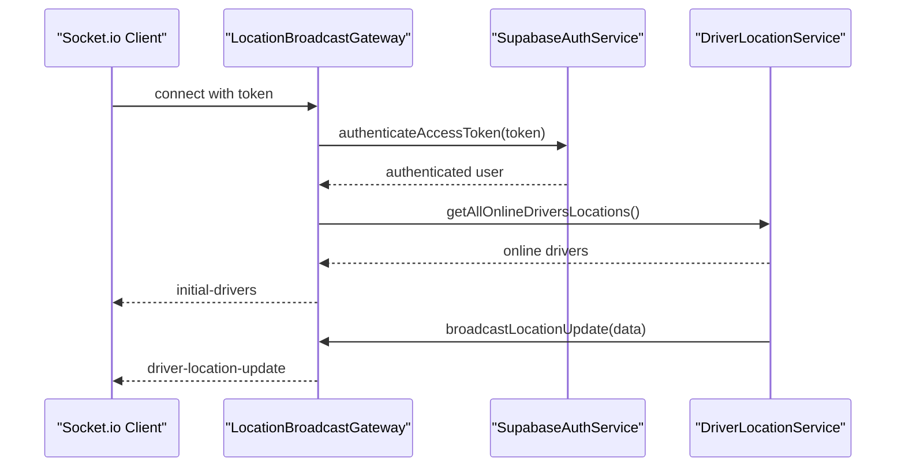
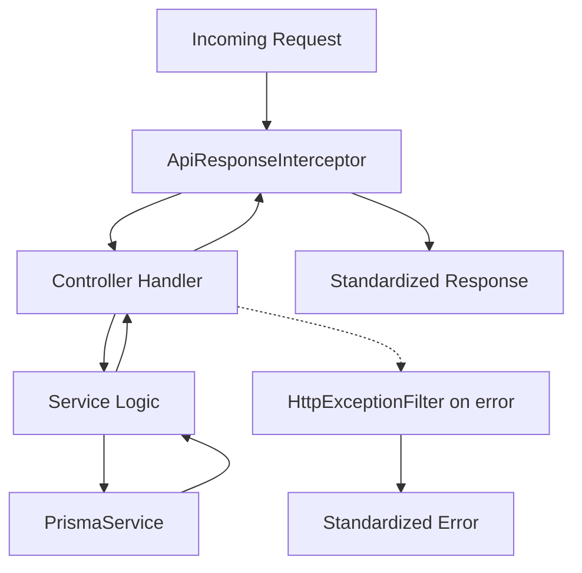
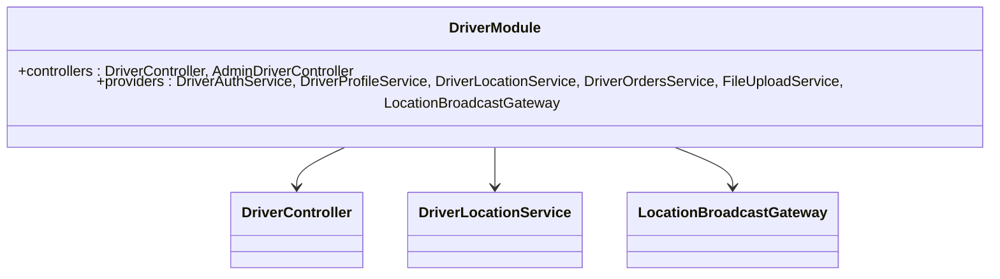
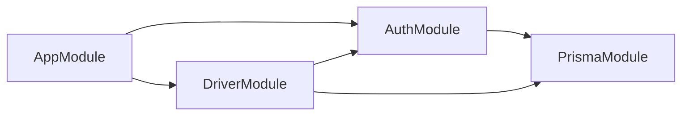

# Backend Architecture

<cite>
**Referenced Files in This Document**
- [main.ts](file://apps/api/src/main.ts)
- [app.module.ts](file://apps/api/src/app.module.ts)
- [api-response.interceptor.ts](file://apps/api/src/common/api-response.interceptor.ts)
- [http-exception.filter.ts](file://apps/api/src/common/http-exception.filter.ts)
- [auth.module.ts](file://apps/api/src/auth/auth.module.ts)
- [supabase-auth.service.ts](file://apps/api/src/auth/supabase-auth.service.ts)
- [prisma.module.ts](file://apps/api/src/prisma/prisma.module.ts)
- [schema.prisma](file://apps/api/prisma/schema.prisma)
- [driver.module.ts](file://apps/api/src/modules/driver/driver.module.ts)
- [driver.controller.ts](file://apps/api/src/modules/driver/driver.controller.ts)
- [location-broadcast.gateway.ts](file://apps/api/src/modules/driver/location-broadcast.gateway.ts)
</cite>

## Table of Contents
1. Introduction
2. Project Structure
3. Core Components
4. Architecture Overview
5. Detailed Component Analysis
6. Dependency Analysis
7. Performance Considerations
8. Troubleshooting Guide
9. Conclusion

## Introduction
This document explains the backend architecture of the NestJS API server with a focus on modular design, dependency injection, authentication and authorization, database layer via Prisma ORM, and real-time communication using Socket.io. It also covers request-response flow, error handling strategies, middleware implementation, security considerations, API versioning approach, and performance optimization techniques. Examples for module creation, service composition, and database query patterns are included to guide development.

## Project Structure
The API is organized into feature modules under apps/api/src/modules, shared infrastructure under common and auth, and a global data access layer via Prisma. The application bootstrap wires CORS, global interceptors, and filters, then starts the HTTP server.

**Diagram sources**
- [main.ts:7-35](file://apps/api/src/main.ts#L7-L35)
- [app.module.ts:14-27](file://apps/api/src/app.module.ts#L14-L27)
- [prisma.module.ts:4-8](file://apps/api/src/prisma/prisma.module.ts#L4-L8)

**Section sources**
- [main.ts:7-35](file://apps/api/src/main.ts#L7-L35)
- [app.module.ts:14-27](file://apps/api/src/app.module.ts#L14-L27)

## Core Components
- Application bootstrap: configures CORS, registers global interceptor and filter, and starts the server.
- Global response interceptor: wraps all successful responses in a consistent envelope.
- Global exception filter: converts exceptions into standardized error envelopes.
- Authentication module: provides Supabase-based authentication and role guards.
- Database module: exposes a global Prisma service for type-safe queries.
- Feature modules: encapsulate domain logic (e.g., Driver, Branches, Delivery).

Key responsibilities:
- main.ts: HTTP server setup, CORS policy, global interceptors/filters.
- api-response.interceptor.ts: success envelope wrapping.
- http-exception.filter.ts: unified error envelope with code and details.
- auth.module.ts: exports auth services and guards.
- supabase-auth.service.ts: token validation, user profile resolution.
- prisma.module.ts: global Prisma client provider.

**Section sources**
- [main.ts:7-35](file://apps/api/src/main.ts#L7-L35)
- [api-response.interceptor.ts:10-21](file://apps/api/src/common/api-response.interceptor.ts#L10-L21)
- [http-exception.filter.ts:9-44](file://apps/api/src/common/http-exception.filter.ts#L9-L44)
- [auth.module.ts:8-12](file://apps/api/src/auth/auth.module.ts#L8-L12)
- [supabase-auth.service.ts:11-64](file://apps/api/src/auth/supabase-auth.service.ts#L11-L64)
- [prisma.module.ts:4-8](file://apps/api/src/prisma/prisma.module.ts#L4-L8)

## Architecture Overview
The system follows a layered, modular architecture:
- Controllers handle HTTP requests and delegate to services.
- Services implement business logic and orchestrate repositories (via Prisma).
- PrismaService provides typed database access across modules.
- AuthModule supplies authentication and role-based guards.
- Real-time features use a WebSocket gateway for live updates.

**Diagram sources**
- [driver.controller.ts:99-104](file://apps/api/src/modules/driver/driver.controller.ts#L99-L104)
- [location-broadcast.gateway.ts:124-127](file://apps/api/src/modules/driver/location-broadcast.gateway.ts#L124-L127)
- [prisma.module.ts:4-8](file://apps/api/src/prisma/prisma.module.ts#L4-L8)

## Detailed Component Analysis

### Authentication and Authorization
- SupabaseAuthService validates tokens, resolves user profiles, and supports sign-in and user creation flows.
- Role-based guards (admin, driver) enforce access control at controller endpoints.
- Profiles store roles used by guards to authorize requests.

**Diagram sources**
- [supabase-auth.service.ts:11-64](file://apps/api/src/auth/supabase-auth.service.ts#L11-L64)
- [auth.module.ts:8-12](file://apps/api/src/auth/auth.module.ts#L8-L12)
- [schema.prisma:617-635](file://apps/api/prisma/schema.prisma#L617-L635)

**Section sources**
- [supabase-auth.service.ts:11-64](file://apps/api/src/auth/supabase-auth.service.ts#L11-L64)
- [auth.module.ts:8-12](file://apps/api/src/auth/auth.module.ts#L8-L12)
- [schema.prisma:617-635](file://apps/api/prisma/schema.prisma#L617-L635)

### Database Layer with Prisma ORM
- PrismaModule is global and exports PrismaService for reuse across modules.
- schema.prisma defines multi-schema configuration (auth, public) and core entities such as orders, products, inventory, profiles, and branches.
- Queries are executed through PrismaService within services, enabling type safety and maintainability.

**Diagram sources**
- [prisma.module.ts:4-8](file://apps/api/src/prisma/prisma.module.ts#L4-L8)
- [schema.prisma:6-11](file://apps/api/prisma/schema.prisma#L6-L11)
- [schema.prisma:556-592](file://apps/api/prisma/schema.prisma#L556-L592)

**Section sources**
- [prisma.module.ts:4-8](file://apps/api/src/prisma/prisma.module.ts#L4-L8)
- [schema.prisma:6-11](file://apps/api/prisma/schema.prisma#L6-L11)
- [schema.prisma:556-592](file://apps/api/prisma/schema.prisma#L556-L592)

### Real-Time Communication via Socket.io
- LocationBroadcastGateway manages WebSocket connections under /driver-locations.
- Connections are authenticated using tokens; only authorized clients receive updates.
- Supports broadcasting driver locations and status changes to admin dashboards and specific drivers.

**Diagram sources**
- [location-broadcast.gateway.ts:27-93](file://apps/api/src/modules/driver/location-broadcast.gateway.ts#L27-L93)
- [location-broadcast.gateway.ts:124-127](file://apps/api/src/modules/driver/location-broadcast.gateway.ts#L124-L127)
- [supabase-auth.service.ts:49-64](file://apps/api/src/auth/supabase-auth.service.ts#L49-L64)

**Section sources**
- [location-broadcast.gateway.ts:27-93](file://apps/api/src/modules/driver/location-broadcast.gateway.ts#L27-L93)
- [location-broadcast.gateway.ts:124-127](file://apps/api/src/modules/driver/location-broadcast.gateway.ts#L124-L127)

### Request-Response Flow and Middleware
- Global interceptor wraps successful responses in a standard envelope.
- Global filter catches exceptions and returns structured errors with codes and context.
- CORS is explicitly configured to allow specified origins and methods.

**Diagram sources**
- [main.ts:30-31](file://apps/api/src/main.ts#L30-L31)
- [api-response.interceptor.ts:10-21](file://apps/api/src/common/api-response.interceptor.ts#L10-L21)
- [http-exception.filter.ts:9-44](file://apps/api/src/common/http-exception.filter.ts#L9-L44)

**Section sources**
- [main.ts:30-31](file://apps/api/src/main.ts#L30-L31)
- [api-response.interceptor.ts:10-21](file://apps/api/src/common/api-response.interceptor.ts#L10-L21)
- [http-exception.filter.ts:9-44](file://apps/api/src/common/http-exception.filter.ts#L9-L44)

### Module Organization and Example: Driver Module
- DriverModule composes controllers, services, and a WebSocket gateway.
- It imports AuthModule to leverage authentication and guards.
- Exports services for reuse by other modules if needed.

**Diagram sources**
- [driver.module.ts:12-31](file://apps/api/src/modules/driver/driver.module.ts#L12-L31)
- [driver.controller.ts:37-45](file://apps/api/src/modules/driver/driver.controller.ts#L37-L45)
- [location-broadcast.gateway.ts:27-56](file://apps/api/src/modules/driver/location-broadcast.gateway.ts#L27-L56)

**Section sources**
- [driver.module.ts:12-31](file://apps/api/src/modules/driver/driver.module.ts#L12-L31)
- [driver.controller.ts:37-45](file://apps/api/src/modules/driver/driver.controller.ts#L37-L45)

### Security Considerations
- Token-based authentication via Supabase; tokens validated before granting access.
- Role-based access control enforced by guards derived from user profiles.
- CORS restricted to known domains; credentials allowed for cross-origin requests.
- WebSocket connections require valid tokens; unauthorized clients are disconnected.

**Section sources**
- [supabase-auth.service.ts:49-64](file://apps/api/src/auth/supabase-auth.service.ts#L49-L64)
- [location-broadcast.gateway.ts:61-81](file://apps/api/src/modules/driver/location-broadcast.gateway.ts#L61-L81)
- [main.ts:13-28](file://apps/api/src/main.ts#L13-L28)

### API Versioning Approach
- No explicit URL versioning is present in the analyzed files.
- Recommended approaches:
  - URL prefix versioning (e.g., /v1/drivers) for backward compatibility.
  - Header-based versioning (e.g., Accept-Version) when maintaining multiple API contracts.
  - Deprecation strategy with clear migration timelines.

[No sources needed since this section provides general guidance]

### Performance Optimization Techniques
- Use Prisma relations and selective field projection to reduce payload size.
- Add indexes on frequently queried columns (as defined in schema.prisma).
- Cache hot reads where appropriate (e.g., branch zones, product catalogs).
- Limit real-time broadcasts to relevant rooms to reduce bandwidth.
- Configure CORS maxAge to reduce preflight overhead.

**Section sources**
- [schema.prisma:588-591](file://apps/api/prisma/schema.prisma#L588-L591)
- [main.ts:26-28](file://apps/api/src/main.ts#L26-L28)
- [location-broadcast.gateway.ts:148-167](file://apps/api/src/modules/driver/location-broadcast.gateway.ts#L148-L167)

## Dependency Analysis
Feature modules depend on:
- AuthModule for authentication and guards.
- PrismaModule for database access.
- Each other via explicit imports when necessary.

**Diagram sources**
- [app.module.ts:14-27](file://apps/api/src/app.module.ts#L14-L27)
- [driver.module.ts:12-13](file://apps/api/src/modules/driver/driver.module.ts#L12-L13)
- [auth.module.ts:8-12](file://apps/api/src/auth/auth.module.ts#L8-L12)
- [prisma.module.ts:4-8](file://apps/api/src/prisma/prisma.module.ts#L4-L8)

**Section sources**
- [app.module.ts:14-27](file://apps/api/src/app.module.ts#L14-L27)
- [driver.module.ts:12-13](file://apps/api/src/modules/driver/driver.module.ts#L12-L13)
- [auth.module.ts:8-12](file://apps/api/src/auth/auth.module.ts#L8-L12)
- [prisma.module.ts:4-8](file://apps/api/src/prisma/prisma.module.ts#L4-L8)

## Performance Considerations
- Prefer efficient queries with Prisma (select fields, use relations).
- Leverage indexes defined in schema.prisma for frequent lookups.
- Minimize real-time message volume by targeting rooms and batching updates.
- Use global CORS caching to reduce OPTIONS requests.
- Monitor WebSocket connection stats and disconnect idle clients.

[No sources needed since this section provides general guidance]

## Troubleshooting Guide
Common issues and resolutions:
- Invalid or expired tokens: ensure tokens are passed correctly in headers or socket handshake; verify Supabase configuration.
- Unauthorized access: confirm user roles match guard requirements.
- Unexpected errors: check global exception filter output for code and path details.
- CORS failures: verify origin list includes your frontend domain.

**Section sources**
- [supabase-auth.service.ts:49-64](file://apps/api/src/auth/supabase-auth.service.ts#L49-L64)
- [http-exception.filter.ts:16-42](file://apps/api/src/common/http-exception.filter.ts#L16-L42)
- [main.ts:13-28](file://apps/api/src/main.ts#L13-L28)

## Conclusion
The NestJS API employs a clean, modular architecture with strong separation of concerns: controllers for routing, services for business logic, Prisma for data access, and a dedicated authentication module. Real-time capabilities are implemented via a Socket.io gateway that integrates seamlessly with services. Global interceptors and filters provide consistent response shapes and robust error handling. Security is enforced through token validation and role-based guards, while performance is optimized via indexing, selective queries, and targeted real-time broadcasts. For future growth, consider adding explicit API versioning and expanding caching strategies as needed.

[No sources needed since this section summarizes without analyzing specific files]