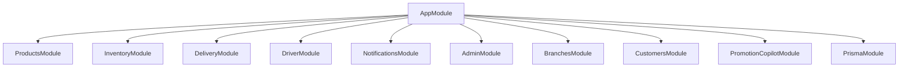
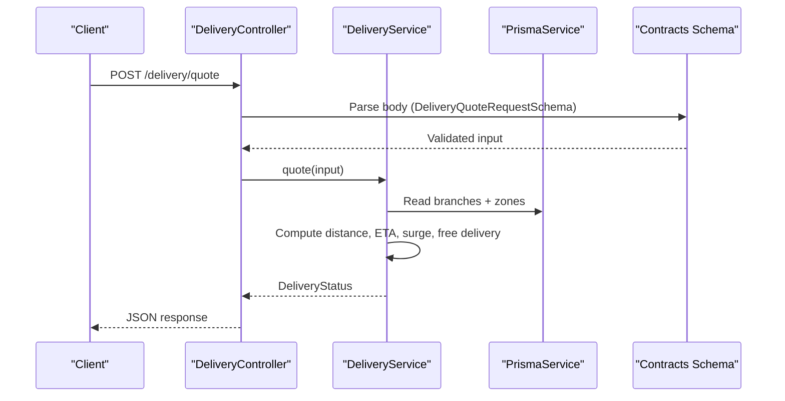
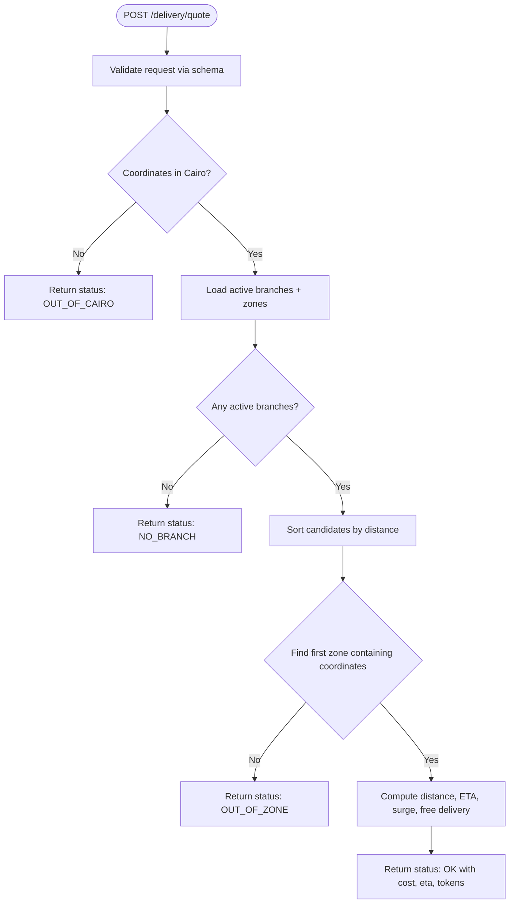
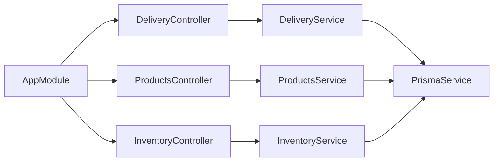

# Business Logic Modules

<cite>
**Referenced Files in This Document**
- [app.module.ts](file://apps/api/src/app.module.ts)
- [schema.prisma](file://apps/api/prisma/schema.prisma)
- [products.controller.ts](file://apps/api/src/modules/products/products.controller.ts)
- [products.service.ts](file://apps/api/src/modules/products/products.service.ts)
- [inventory.controller.ts](file://apps/api/src/modules/inventory/inventory.controller.ts)
- [inventory.service.ts](file://apps/api/src/modules/inventory/inventory.service.ts)
- [delivery.controller.ts](file://apps/api/src/modules/delivery/delivery.controller.ts)
- [delivery.service.ts](file://apps/api/src/modules/delivery/delivery.service.ts)
</cite>

## Table of Contents
1. Introduction
2. Project Structure
3. Core Components
4. Architecture Overview
5. Detailed Component Analysis
6. Dependency Analysis
7. Performance Considerations
8. Troubleshooting Guide
9. Conclusion
10. Appendices

## Introduction
This document explains the core business logic modules for products, orders, inventory, delivery, and prescription management within the application. It focuses on domain-driven design principles as implemented in the API layer, service-layer architecture, business rule enforcement, cross-module interactions, API controllers, request validation, response formatting, complex transactions, state transitions, error handling patterns, logging strategies, testing approaches, and guidance for extending or creating new domains.

## Project Structure
The API is a NestJS application organized by feature modules. The root module wires together shared infrastructure (Prisma), authentication, and feature modules including Products, Inventory, Delivery, Drivers, Notifications, Admin, Branches, Customers, and Promotion Copilot. Domain packages exist under packages/ to encapsulate shared contracts and future domain logic.

**Diagram sources**
- [app.module.ts:1-30](file://apps/api/src/app.module.ts#L1-L30)

**Section sources**
- [app.module.ts:1-30](file://apps/api/src/app.module.ts#L1-L30)

## Core Components
- Products: Provides listing with pagination backed by Prisma.
- Inventory: Provides listing with pagination backed by Prisma.
- Delivery: Computes quotes based on branch zones, distance, surge pricing, free delivery thresholds, and ETAs; validates inputs via schema parsing.
- Orders: Data model exists in the database schema; order lifecycle states are defined.
- Prescriptions: Domain package present; data models and flows are managed via Supabase migrations and functions.

Key responsibilities:
- Controllers expose HTTP endpoints and delegate to services.
- Services implement business rules and interact with Prisma.
- Shared contracts provide request/response schemas used for validation.

**Section sources**
- [products.controller.ts:1-15](file://apps/api/src/modules/products/products.controller.ts#L1-L15)
- [products.service.ts:1-27](file://apps/api/src/modules/products/products.service.ts#L1-L27)
- [inventory.controller.ts:1-15](file://apps/api/src/modules/inventory/inventory.controller.ts#L1-L15)
- [inventory.service.ts:1-27](file://apps/api/src/modules/inventory/inventory.service.ts#L1-L27)
- [delivery.controller.ts:1-17](file://apps/api/src/modules/delivery/delivery.controller.ts#L1-L17)
- [delivery.service.ts:1-240](file://apps/api/src/modules/delivery/delivery.service.ts#L1-L240)
- [schema.prisma:528-592](file://apps/api/prisma/schema.prisma#L528-L592)
- [schema.prisma:595-613](file://apps/api/prisma/schema.prisma#L595-L613)
- [schema.prisma:753-763](file://apps/api/prisma/schema.prisma#L753-L763)

## Architecture Overview
The system follows a layered architecture:
- Controllers handle HTTP concerns (routing, guards, body parsing).
- Services encapsulate business logic and orchestrate data access.
- Prisma provides type-safe database access.
- Contracts define request/response schemas for validation and consistency.

**Diagram sources**
- [delivery.controller.ts:1-17](file://apps/api/src/modules/delivery/delivery.controller.ts#L1-L17)
- [delivery.service.ts:58-239](file://apps/api/src/modules/delivery/delivery.service.ts#L58-L239)

## Detailed Component Analysis

### Products Module
- Controller: Exposes GET /admin/products with pagination query parameters and admin guard protection.
- Service: Lists products with skip/take pagination and returns total count and computed totalPages.

Business rules:
- Pagination boundaries derived from page and limit.
- Aggregates total items for UI paging.

Error handling:
- Guard enforces admin access at controller level.

Testing approach:
- Unit test service list method with mocked Prisma calls.
- Integration test controller endpoint with admin token.

Extensibility:
- Add filtering, sorting, or search by adding query params and service logic.
- Introduce DTOs for consistent responses.

**Section sources**
- [products.controller.ts:1-15](file://apps/api/src/modules/products/products.controller.ts#L1-L15)
- [products.service.ts:1-27](file://apps/api/src/modules/products/products.service.ts#L1-L27)

### Inventory Module
- Controller: Exposes GET /admin/inventory with pagination and admin guard.
- Service: Lists inventory records with skip/take pagination and totals.

Business rules:
- Pagination applied consistently across listings.

Error handling:
- Admin guard protects endpoints.

Testing approach:
- Unit tests for service pagination logic.
- Controller tests validating query parameter parsing and guard behavior.

Extensatility:
- Add stock adjustments, reservations, and low-stock alerts in service layer.

**Section sources**
- [inventory.controller.ts:1-15](file://apps/api/src/modules/inventory/inventory.controller.ts#L1-L15)
- [inventory.service.ts:1-27](file://apps/api/src/modules/inventory/inventory.service.ts#L1-L27)

### Delivery Module
- Controller: Exposes POST /delivery/quote, parses request using contract schema, delegates to service.
- Service: Implements quote computation including:
  - Geographic bounds check (Greater Cairo bounding box).
  - Branch selection (active branches sorted by distance).
  - Zone matching using polygon point-in-polygon checks.
  - Distance calculation using haversine formula.
  - ETA band computation considering base prep time, drive speed, handover buffer, and load factor.
  - Surge pricing window detection and multiplier application.
  - Free delivery threshold based on cart subtotal vs zone configuration.
  - Token generation for assignment and quote tracking.

Business rules:
- Deliverability depends on location being within Cairo bounds and inside a configured zone.
- Cost is zero when cart subtotal meets free delivery threshold; otherwise base fee multiplied by surge if applicable.
- ETA is returned as min/max minutes reflecting traffic and operational factors.

State transitions:
- Quote result includes reason codes (e.g., OUT_OF_CAIRO, NO_BRANCH, OUT_OF_ZONE, OK) to communicate deliverability status.

Cross-module interactions:
- Reads Branch and DeliveryZone entities from database.
- Uses shared contracts for request validation and geometry utilities.

Error handling:
- Returns structured status objects with reason codes when not deliverable.
- Input validation enforced via schema parsing in controller.

Performance considerations:
- Efficient candidate ordering by distance and zone fees.
- Minimal queries: fetch active branches with zones once per quote.

Testing approach:
- Unit tests for geographic checks, ETA calculations, surge windows, and free delivery logic.
- Contract-based integration tests for request validation.

Extensibility:
- Add new zones, branches, or pricing policies without changing controller.
- Extend ETA model with additional factors (weather, historical delays).

**Diagram sources**
- [delivery.controller.ts:1-17](file://apps/api/src/modules/delivery/delivery.controller.ts#L1-L17)
- [delivery.service.ts:58-239](file://apps/api/src/modules/delivery/delivery.service.ts#L58-L239)

**Section sources**
- [delivery.controller.ts:1-17](file://apps/api/src/modules/delivery/delivery.controller.ts#L1-L17)
- [delivery.service.ts:1-240](file://apps/api/src/modules/delivery/delivery.service.ts#L1-L240)

### Orders Module
- Data model: Orders and Order Items are defined in the database schema with fields for totals, payment status, timestamps, and relationships to profiles and delivery assignments.
- Lifecycle states: Enumerated statuses include pending, confirmed, preparing, ready, picked_up, delivered, cancelled.

Business rules:
- Order totals and line items must be consistent; unit price and line total should reflect snapshots at time of purchase.
- Payment status tracks payment lifecycle separately from fulfillment status.

Cross-module interactions:
- Links to customers via profiles and to delivery via deliveryAssignment.
- Can integrate with inventory reservation/release during order confirmation and fulfillment.

Complex transactions:
- Creating an order typically involves:
  - Validating cart and pricing.
  - Reserving inventory.
  - Persisting order and order items.
  - Setting initial status to pending.
  - Optionally triggering notifications.

State transitions:
- Transitions follow canonical lifecycle: pending → confirmed → preparing → ready → picked_up → delivered or cancelled at any stage where allowed.

Error handling:
- Validation failures return appropriate client errors.
- Database constraints enforce referential integrity.

Testing approach:
- Unit tests for state transition rules.
- Integration tests for order creation and item persistence.

Extensibility:
- Add new statuses or workflows by updating enum and service logic.
- Integrate with promotions and coupons in checkout flow.

**Section sources**
- [schema.prisma:540-592](file://apps/api/prisma/schema.prisma#L540-L592)
- [schema.prisma:753-763](file://apps/api/prisma/schema.prisma#L753-L763)

### Prescriptions Module
- Domain package: Present under packages/domain-prescriptions for shared types and future domain logic.
- Migrations and functions: Supabase migrations and functions manage prescription submission, review, and notifications.

Business rules:
- Prescription workflow includes submission, pharmacist review, and approval/rejection.
- Notifications inform relevant parties about status changes.

Cross-module interactions:
- Integrates with orders when prescriptions are part of an order.
- May trigger inventory checks for prescription-related items.

Complex transactions:
- Submission creates a record and notifies staff.
- Review updates status and may create order items or adjust inventory.

Error handling:
- Enforced via database constraints and function-level validations.

Testing approach:
- Test migration effects and function behaviors.
- End-to-end tests for prescription lifecycle.

Extensibility:
- Add new roles or permissions for prescription handling.
- Extend notification channels.

**Section sources**
- [schema.prisma:639-671](file://apps/api/prisma/schema.prisma#L639-L671)

## Dependency Analysis
- AppModule imports all feature modules and PrismaModule, establishing runtime dependencies.
- DeliveryService depends on PrismaService and shared contracts for geometry and request validation.
- Products and Inventory services depend on PrismaService for data access.
- Controllers depend on services and guards for authorization.

**Diagram sources**
- [app.module.ts:1-30](file://apps/api/src/app.module.ts#L1-L30)
- [delivery.controller.ts:1-17](file://apps/api/src/modules/delivery/delivery.controller.ts#L1-L17)
- [delivery.service.ts:1-240](file://apps/api/src/modules/delivery/delivery.service.ts#L1-L240)
- [products.controller.ts:1-15](file://apps/api/src/modules/products/products.controller.ts#L1-L15)
- [products.service.ts:1-27](file://apps/api/src/modules/products/products.service.ts#L1-L27)
- [inventory.controller.ts:1-15](file://apps/api/src/modules/inventory/inventory.controller.ts#L1-L15)
- [inventory.service.ts:1-27](file://apps/api/src/modules/inventory/inventory.service.ts#L1-L27)

**Section sources**
- [app.module.ts:1-30](file://apps/api/src/app.module.ts#L1-L30)

## Performance Considerations
- Pagination: Use skip/take to avoid large result sets in Products and Inventory listings.
- Query optimization: Fetch related data in single queries (e.g., branches with zones).
- Geometry checks: Point-in-polygon computations are efficient for typical zone counts; consider caching or spatial indexes if scale increases.
- ETA computation: Haversine distance is O(1); sorting candidates by distance is O(n log n) over branches.
- Surge and free delivery: Constant-time checks after fetching zone configuration.

[No sources needed since this section provides general guidance]

## Troubleshooting Guide
Common issues and resolutions:
- Not deliverable due to location:
  - Ensure coordinates fall within Greater Cairo bounds and inside a configured zone.
  - Verify branch and zone configurations are active and correctly set.
- Unexpected costs:
  - Check surge window settings and cart subtotal against free delivery thresholds.
- Input validation errors:
  - Confirm request body matches DeliveryQuoteRequestSchema structure.
- Access denied:
  - Admin endpoints require valid admin authentication via guards.

Logging strategy recommendations:
- Log key decision points in DeliveryService (location checks, matched branch/zone, surge application, final cost).
- Include correlation IDs for tracing requests across modules.

Testing strategies:
- Unit tests for pure functions (distance, ETA bands, surge windows).
- Contract tests for request/response shapes.
- Integration tests for end-to-end quote flow with mock branches/zones.

**Section sources**
- [delivery.service.ts:39-56](file://apps/api/src/modules/delivery/delivery.service.ts#L39-L56)
- [delivery.service.ts:74-179](file://apps/api/src/modules/delivery/delivery.service.ts#L74-L179)
- [delivery.controller.ts:10-14](file://apps/api/src/modules/delivery/delivery.controller.ts#L10-L14)

## Conclusion
The API implements clear separation of concerns with controllers handling HTTP concerns and services encapsulating business logic. Delivery quoting demonstrates robust domain rules for geography, pricing, and ETAs. Products and Inventory modules provide foundational listing capabilities with pagination. Orders and Prescriptions have strong data models and lifecycle definitions, enabling complex workflows and cross-module integrations. Extending the system involves adding domain logic in services, defining schemas in contracts, and wiring new modules into the application root.

[No sources needed since this section summarizes without analyzing specific files]

## Appendices

### API Endpoints Summary
- GET /admin/products?page=...&limit=...
  - Requires admin authentication.
  - Returns paginated product list with totals.
- GET /admin/inventory?page=...&limit=...
  - Requires admin authentication.
  - Returns paginated inventory list with totals.
- POST /delivery/quote
  - Validates request via schema.
  - Returns delivery status including cost, ETA, branch, zone, and tokens.

**Section sources**
- [products.controller.ts:5-13](file://apps/api/src/modules/products/products.controller.ts#L5-L13)
- [inventory.controller.ts:5-13](file://apps/api/src/modules/inventory/inventory.controller.ts#L5-L13)
- [delivery.controller.ts:6-14](file://apps/api/src/modules/delivery/delivery.controller.ts#L6-L14)

### Data Models Overview
- Products: Identifier, name, category, price, activity flag, timestamps.
- Inventory: Product linkage, on-hand quantity, reserved quantity.
- Orders: Totals, payment status, timestamps, user and driver associations, delivery assignment.
- Order Items: Line details with product snapshot and quantities.
- Branches and Zones: Geographic coverage, fees, surge windows, load factors.

**Section sources**
- [schema.prisma:595-613](file://apps/api/prisma/schema.prisma#L595-L613)
- [schema.prisma:528-536](file://apps/api/prisma/schema.prisma#L528-L536)
- [schema.prisma:540-592](file://apps/api/prisma/schema.prisma#L540-L592)
- [schema.prisma:765-800](file://apps/api/prisma/schema.prisma#L765-L800)