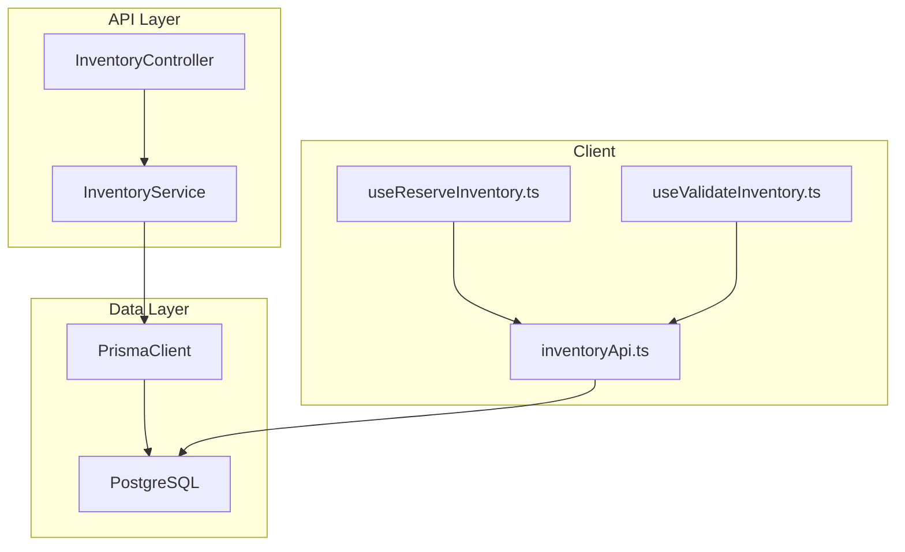
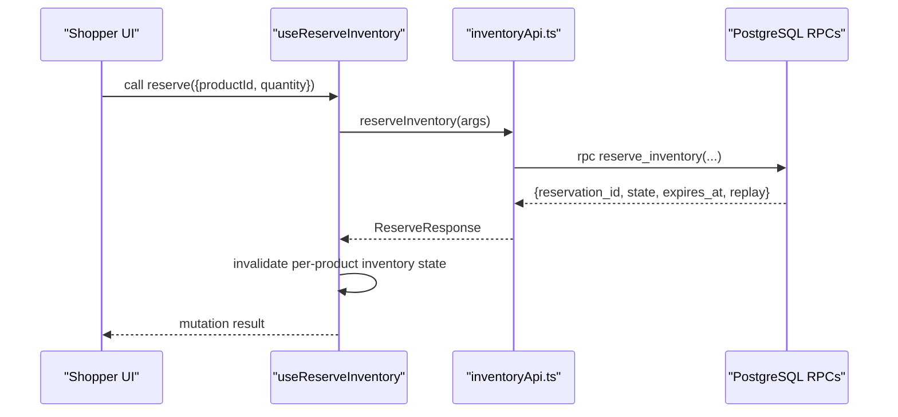
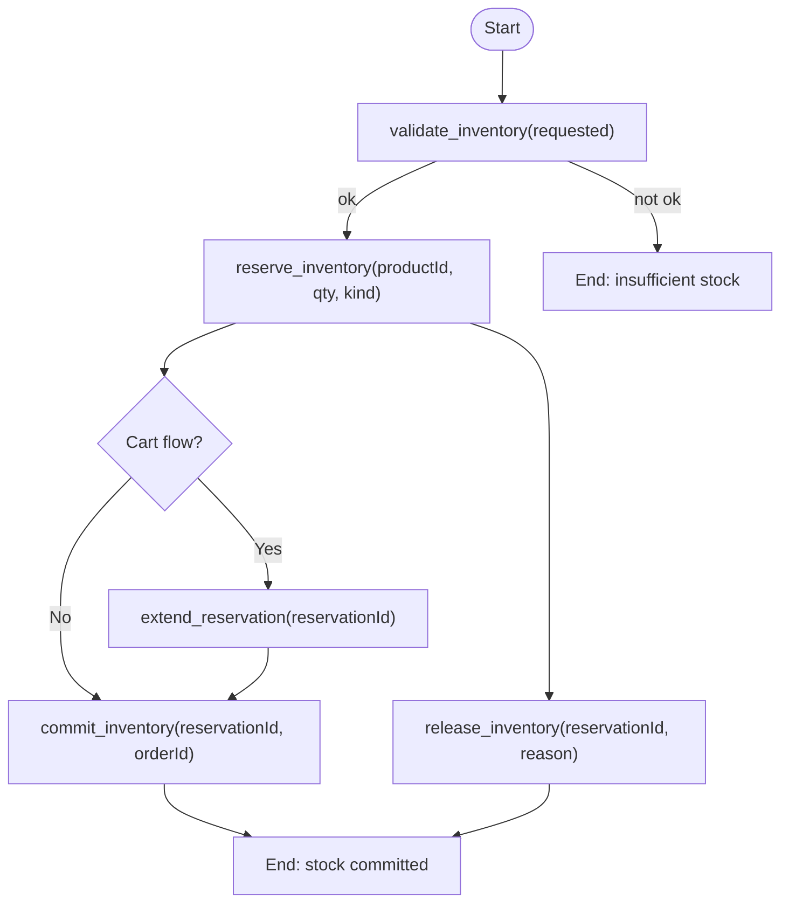
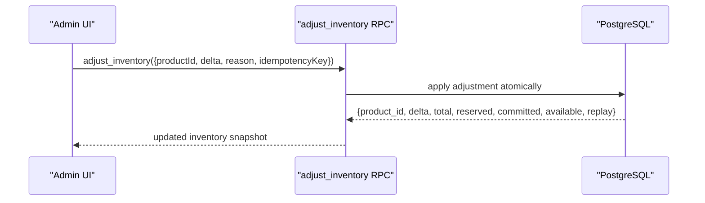
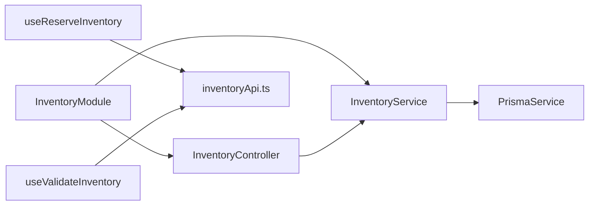

# Inventory Module

<cite>
**Referenced Files in This Document**
- [inventory.controller.ts](file://apps/api/src/modules/inventory/inventory.controller.ts)
- [inventory.service.ts](file://apps/api/src/modules/inventory/inventory.service.ts)
- [inventory.module.ts](file://apps/api/src/modules/inventory/inventory.module.ts)
- [schema.prisma](file://apps/api/prisma/schema.prisma)
- [inventoryApi.ts](file://apps/shopper-native/src/features/inventory/api/inventoryApi.ts)
- [useReserveInventory.ts](file://apps/shopper-native/src/features/inventory/hooks/useReserveInventory.ts)
- [useValidateInventory.ts](file://apps/shopper-native/src/features/inventory/hooks/useValidateInventory.ts)
- [types/index.ts](file://apps/shopper-native/src/features/inventory/types/index.ts)
</cite>

## Table of Contents
1. [Introduction](#introduction)
2. [Project Structure](#project-structure)
3. [Core Components](#core-components)
4. [Architecture Overview](#architecture-overview)
5. [Detailed Component Analysis](#detailed-component-analysis)
6. [Dependency Analysis](#dependency-analysis)
7. [Performance Considerations](#performance-considerations)
8. [Troubleshooting Guide](#troubleshooting-guide)
9. [Conclusion](#conclusion)
10. [Appendices](#appendices)

## Introduction
This document explains the Inventory module, focusing on stock tracking, reservations, and the current state of multi-branch inventory synchronization. It covers the Inventory entity schema, how stock levels are computed, automated reorder points (as implemented), API endpoints for inventory operations, bulk updates, real-time stock visibility, and example workflows such as stock adjustments, reservation lifecycles, and low-stock alerts. It also addresses inventory valuation, batch tracking, supplier integration, optimization strategies, and custom rules based on what is present in the codebase.

## Project Structure
The Inventory module spans both the backend API and the shopper-native client:
- Backend API (NestJS):
  - Controller exposes a paginated list endpoint under admin scope.
  - Service queries the database via Prisma to return inventory records with pagination metadata.
- Database Schema (Prisma):
  - Defines the core inventory model linked to products.
- Shopper-Native Client:
  - Provides typed RPC wrappers for reading availability and performing reservation lifecycle operations (reserve, extend, commit, release).
  - Includes React Query hooks to integrate with UI flows and invalidate caches on mutations.

**Diagram sources**
- [inventory.controller.ts:5-13](file://apps/api/src/modules/inventory/inventory.controller.ts#L5-L13)
- [inventory.service.ts:8-25](file://apps/api/src/modules/inventory/inventory.service.ts#L8-L25)
- [schema.prisma:529-536](file://apps/api/prisma/schema.prisma#L529-L536)
- [inventoryApi.ts:38-189](file://apps/shopper-native/src/features/inventory/api/inventoryApi.ts#L38-L189)

**Section sources**
- [inventory.controller.ts:1-15](file://apps/api/src/modules/inventory/inventory.controller.ts#L1-L15)
- [inventory.service.ts:1-27](file://apps/api/src/modules/inventory/inventory.service.ts#L1-L27)
- [inventory.module.ts:1-14](file://apps/api/src/modules/inventory/inventory.module.ts#L1-L14)
- [schema.prisma:529-536](file://apps/api/prisma/schema.prisma#L529-L536)
- [inventoryApi.ts:1-203](file://apps/shopper-native/src/features/inventory/api/inventoryApi.ts#L1-L203)

## Core Components
- InventoryController:
  - Exposes GET /admin/inventory with pagination query parameters page and limit.
  - Protected by AdminAuthGuard.
- InventoryService:
  - Implements list(page, limit) using Prisma to fetch inventory items and total count concurrently.
  - Returns data, total, page, limit, and totalPages.
- Prisma Inventory Model:
  - product_id (PK), on_hand (default 0), reserved (default 0).
  - Relation to products table.
- Shopper-Native Inventory API:
  - Reads from available_inventory view for real-time availability.
  - Uses SECURITY DEFINER RPCs for idempotent mutations: reserve_inventory, extend_reservation, commit_inventory, release_inventory, adjust_inventory, validate_inventory.
- Hooks:
  - useReserveInventory: wraps reserve_inventory, generates idempotency keys, invalidates per-product inventory state on success.
  - useValidateInventory: read-only validation of requested quantity against available stock.

**Section sources**
- [inventory.controller.ts:5-13](file://apps/api/src/modules/inventory/inventory.controller.ts#L5-L13)
- [inventory.service.ts:8-25](file://apps/api/src/modules/inventory/inventory.service.ts#L8-L25)
- [schema.prisma:529-536](file://apps/api/prisma/schema.prisma#L529-L536)
- [inventoryApi.ts:38-189](file://apps/shopper-native/src/features/inventory/api/inventoryApi.ts#L38-L189)
- [useReserveInventory.ts:36-59](file://apps/shopper-native/src/features/inventory/hooks/useReserveInventory.ts#L36-L59)
- [useValidateInventory.ts:16-22](file://apps/shopper-native/src/features/inventory/hooks/useValidateInventory.ts#L16-L22)

## Architecture Overview
The system separates read and write paths:
- Reads:
  - The client reads availability from the available_inventory view, which aggregates total, reserved, committed, and available quantities along with derived availability state.
- Writes:
  - All mutations go through SECURITY DEFINER RPCs that enforce concurrency control, idempotency, and business rules.
- Admin listing:
  - The NestJS controller provides a simple paginated list of inventory records for administrative purposes.

**Diagram sources**
- [useReserveInventory.ts:36-59](file://apps/shopper-native/src/features/inventory/hooks/useReserveInventory.ts#L36-L59)
- [inventoryApi.ts:80-98](file://apps/shopper-native/src/features/inventory/api/inventoryApi.ts#L80-L98)

**Section sources**
- [inventoryApi.ts:38-189](file://apps/shopper-native/src/features/inventory/api/inventoryApi.ts#L38-L189)
- [useReserveInventory.ts:1-61](file://apps/shopper-native/src/features/inventory/hooks/useReserveInventory.ts#L1-L61)

## Detailed Component Analysis

### Inventory Entity Schema
- Fields:
  - product_id: primary key linking to products.
  - on_hand: integer representing physical stock on hand.
  - reserved: integer representing stock reserved by active reservations.
- Relations:
  - One-to-one with products via product_id.

Notes:
- Multi-branch inventory is not modeled in the current schema; there is no branch or location dimension on the inventory record.

**Section sources**
- [schema.prisma:529-536](file://apps/api/prisma/schema.prisma#L529-L536)

### Stock Level Calculations and Real-Time Visibility
- Read path:
  - available_inventory view exposes total, reserved, committed, available, and availability state.
  - Clients use this view for catalog and cart screens to show real-time availability.
- Validation:
  - validate_inventory RPC returns whether the requested quantity can be fulfilled and provides context (available, reserved, committed, total).

Implications:
- Available stock is computed server-side and exposed consistently to all clients.
- UI can react to changes by invalidating cached queries after mutations.

**Section sources**
- [inventoryApi.ts:38-68](file://apps/shopper-native/src/features/inventory/api/inventoryApi.ts#L38-L68)
- [types/index.ts:15-27](file://apps/shopper-native/src/features/inventory/types/index.ts#L15-L27)

### Reservation Lifecycle
- Reserve:
  - Creates a reservation row with an expiration time and optional kind (cart, order, gift_redemption, manual).
  - Idempotency key ensures safe retries without double-reserving.
- Extend:
  - Extends the reservation’s expiration window.
- Commit:
  - Converts a reservation into a committed deduction tied to an order.
- Release:
  - Releases a reservation back to available stock when a cart is abandoned or validation fails.

**Diagram sources**
- [inventoryApi.ts:59-189](file://apps/shopper-native/src/features/inventory/api/inventoryApi.ts#L59-L189)
- [types/index.ts:48-88](file://apps/shopper-native/src/features/inventory/types/index.ts#L48-L88)

**Section sources**
- [inventoryApi.ts:59-189](file://apps/shopper-native/src/features/inventory/api/inventoryApi.ts#L59-L189)
- [types/index.ts:48-88](file://apps/shopper-native/src/features/inventory/types/index.ts#L48-L88)

### Admin API Endpoints
- GET /admin/inventory?page=...&limit=...
  - Returns paginated inventory records with metadata (data, total, page, limit, totalPages).
  - Requires admin authentication guard.

Use cases:
- Administrative overview of inventory records.
- Integration with admin dashboards or reporting tools.

**Section sources**
- [inventory.controller.ts:5-13](file://apps/api/src/modules/inventory/inventory.controller.ts#L5-L13)
- [inventory.service.ts:8-25](file://apps/api/src/modules/inventory/inventory.service.ts#L8-L25)

### Bulk Updates
- Current implementation:
  - No explicit bulk update endpoint is defined in the provided files.
- Recommended approach:
  - Use multiple calls to adjust_inventory with idempotency keys for safe batching at the client level.
  - Ensure each call includes a unique idempotency key to prevent duplicate adjustments on retries.

**Section sources**
- [inventoryApi.ts:176-189](file://apps/shopper-native/src/features/inventory/api/inventoryApi.ts#L176-L189)

### Automated Reorder Points
- Current implementation:
  - No automated reorder point logic is visible in the provided files.
- Practical guidance:
  - Implement a background job or event-driven process that monitors available_inventory and triggers purchase orders or notifications when available falls below thresholds.
  - Integrate with supplier APIs to auto-create orders when thresholds are breached.

[No sources needed since this section provides general guidance]

### Inventory Valuation
- Current implementation:
  - No valuation fields or methods are present in the schema or service.
- Practical guidance:
  - Add cost fields to products or inventory snapshots and compute valuation as sum(quantity * unit_cost).
  - Maintain historical cost snapshots for accurate financial reporting.

[No sources needed since this section provides general guidance]

### Batch Tracking
- Current implementation:
  - No batch or lot tracking is modeled in the schema.
- Practical guidance:
  - Introduce batch/lot identifiers with expiry dates and track movements per batch for compliance and recall management.
  - Adjust reservation and commitment logic to operate at batch granularity where required.

[No sources needed since this section provides general guidance]

### Supplier Integration
- Current implementation:
  - No direct supplier integration is present in the provided files.
- Practical guidance:
  - Create supplier profiles and purchase order workflows triggered by low-stock events.
  - Use webhooks or polling to sync inbound receipts back into inventory via adjust_inventory.

[No sources needed since this section provides general guidance]

### Example Workflows

#### Stock Adjustment Workflow
- Use adjust_inventory with productId, delta (+/-), optional reason, and idempotency key.
- On success, the client should refresh per-product inventory state to reflect new totals.

**Diagram sources**
- [inventoryApi.ts:176-189](file://apps/shopper-native/src/features/inventory/api/inventoryApi.ts#L176-L189)

**Section sources**
- [inventoryApi.ts:176-189](file://apps/shopper-native/src/features/inventory/api/inventoryApi.ts#L176-L189)

#### Transfer Operations
- Current implementation:
  - No transfer operation is modeled; inventory is not branch-scoped.
- Practical guidance:
  - If multi-branch becomes necessary, introduce branch-scoped inventory and implement transfer endpoints that debit source and credit destination branches within a transaction.

[No sources needed since this section provides general guidance]

#### Low-Stock Alerts
- Current implementation:
  - available_inventory view exposes availability state; clients can surface badges accordingly.
- Practical guidance:
  - Trigger notifications when availability transitions to low or out_of_stock.
  - Optionally integrate with Supabase functions or external notification services.

**Section sources**
- [inventoryApi.ts:38-68](file://apps/shopper-native/src/features/inventory/api/inventoryApi.ts#L38-L68)
- [types/index.ts:15-27](file://apps/shopper-native/src/features/inventory/types/index.ts#L15-L27)

## Dependency Analysis
- Module wiring:
  - InventoryModule imports PrismaModule and AuthModule, registers InventoryController and InventoryService.
- Controller dependencies:
  - Depends on InventoryService for business logic.
- Service dependencies:
  - Depends on PrismaService to access the database.
- Client dependencies:
  - Hooks depend on inventoryApi.ts for RPC calls and types for schema validation.

**Diagram sources**
- [inventory.module.ts:7-12](file://apps/api/src/modules/inventory/inventory.module.ts#L7-L12)
- [inventory.controller.ts:5-13](file://apps/api/src/modules/inventory/inventory.controller.ts#L5-L13)
- [inventory.service.ts:1-25](file://apps/api/src/modules/inventory/inventory.service.ts#L1-L25)
- [useReserveInventory.ts:36-59](file://apps/shopper-native/src/features/inventory/hooks/useReserveInventory.ts#L36-L59)
- [useValidateInventory.ts:16-22](file://apps/shopper-native/src/features/inventory/hooks/useValidateInventory.ts#L16-L22)

**Section sources**
- [inventory.module.ts:1-14](file://apps/api/src/modules/inventory/inventory.module.ts#L1-L14)
- [inventory.controller.ts:1-15](file://apps/api/src/modules/inventory/inventory.controller.ts#L1-L15)
- [inventory.service.ts:1-27](file://apps/api/src/modules/inventory/inventory.service.ts#L1-L27)
- [useReserveInventory.ts:1-61](file://apps/shopper-native/src/features/inventory/hooks/useReserveInventory.ts#L1-L61)
- [useValidateInventory.ts:1-24](file://apps/shopper-native/src/features/inventory/hooks/useValidateInventory.ts#L1-L24)

## Performance Considerations
- Pagination:
  - Admin list uses skip/take to avoid loading entire datasets.
- Concurrency and Idempotency:
  - RPCs support idempotency keys to safely handle retries and network issues.
- Read Path Optimization:
  - Using available_inventory view reduces client-side computation and ensures consistent metrics.
- Cache Invalidation:
  - Hooks invalidate per-product inventory state after mutations to keep UI fresh without excessive polling.

[No sources needed since this section provides general guidance]

## Troubleshooting Guide
- Insufficient stock:
  - validate_inventory will return ok=false with a reason; UI should block adding to cart or checkout.
- Duplicate reservations:
  - Ensure unique idempotency keys per intended action; the RPCs are designed to replay safely.
- Stale UI:
  - After mutations, ensure per-product inventory queries are invalidated to reflect latest state.
- Timeouts:
  - Network timeouts are handled in the client; consider retry policies and user feedback for long-running operations.

**Section sources**
- [inventoryApi.ts:59-68](file://apps/shopper-native/src/features/inventory/api/inventoryApi.ts#L59-L68)
- [useReserveInventory.ts:36-59](file://apps/shopper-native/src/features/inventory/hooks/useReserveInventory.ts#L36-L59)

## Conclusion
The Inventory module provides a robust foundation for stock tracking and reservation management with clear separation between reads and writes. The available_inventory view enables real-time visibility, while SECURITY DEFINER RPCs ensure safe, idempotent mutations. While multi-branch synchronization, automated reorder points, valuation, and batch tracking are not yet implemented in the provided code, the architecture supports extending these capabilities through additional models, views, and RPCs.

[No sources needed since this section summarizes without analyzing specific files]

## Appendices

### API Reference Summary
- Admin Listing:
  - GET /admin/inventory?page={number}&limit={number}
  - Response includes data array, total, page, limit, totalPages.
- Client RPCs:
  - validate_inventory(p_product_id, p_requested)
  - reserve_inventory(p_product_id, p_quantity, p_reservation_kind, p_reservation_ref, p_idempotency_key, p_expires_in_secs)
  - extend_reservation(p_reservation_id, p_extend_by_secs)
  - commit_inventory(p_reservation_id, p_order_id, p_idempotency_key)
  - release_inventory(p_reservation_id, p_reason, p_idempotency_key)
  - adjust_inventory(p_product_id, p_delta, p_reason, p_idempotency_key)

**Section sources**
- [inventory.controller.ts:5-13](file://apps/api/src/modules/inventory/inventory.controller.ts#L5-L13)
- [inventory.service.ts:8-25](file://apps/api/src/modules/inventory/inventory.service.ts#L8-L25)
- [inventoryApi.ts:38-189](file://apps/shopper-native/src/features/inventory/api/inventoryApi.ts#L38-L189)

### Custom Inventory Rules Guidance
- Enforce minimum available thresholds before allowing reservations.
- Implement category-specific rules (e.g., controlled substances require pharmacist approval).
- Add audit logging for all adjustments and reservations for compliance.

[No sources needed since this section provides general guidance]