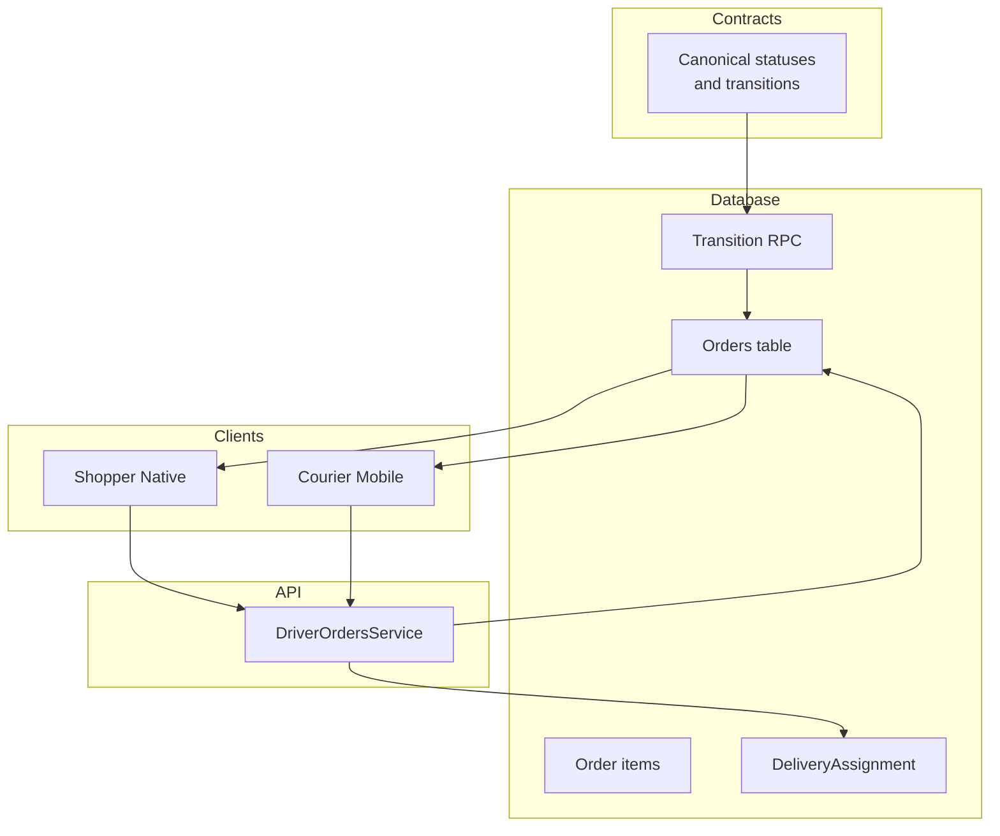
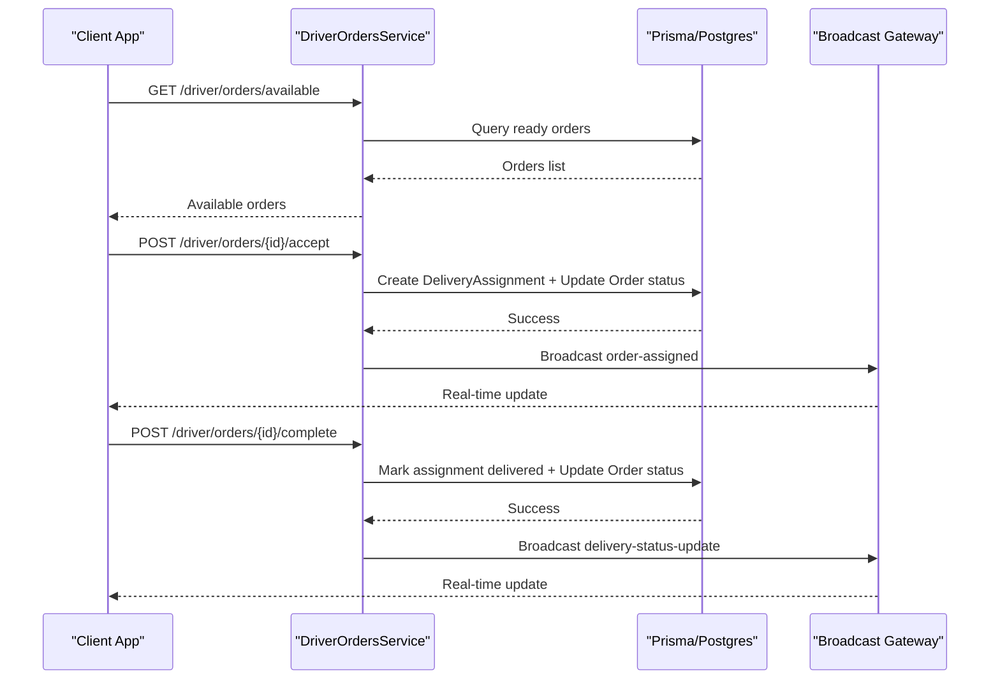
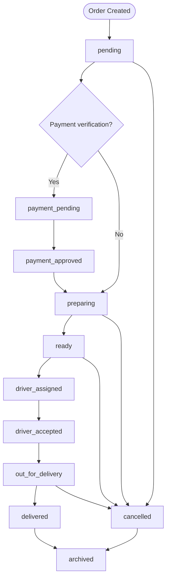
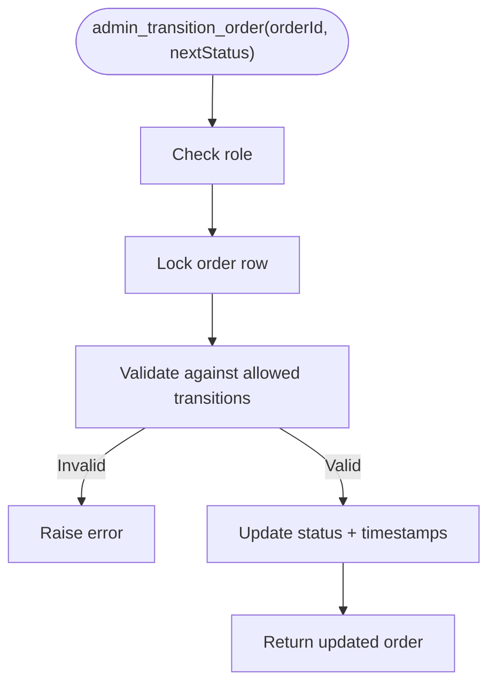
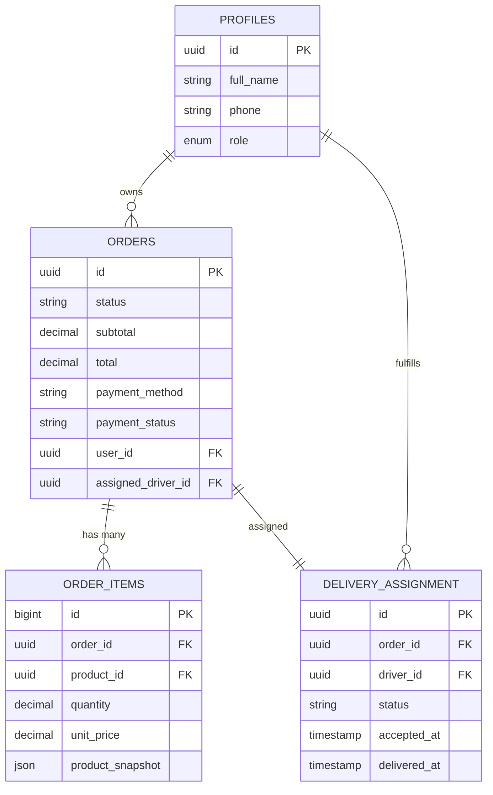
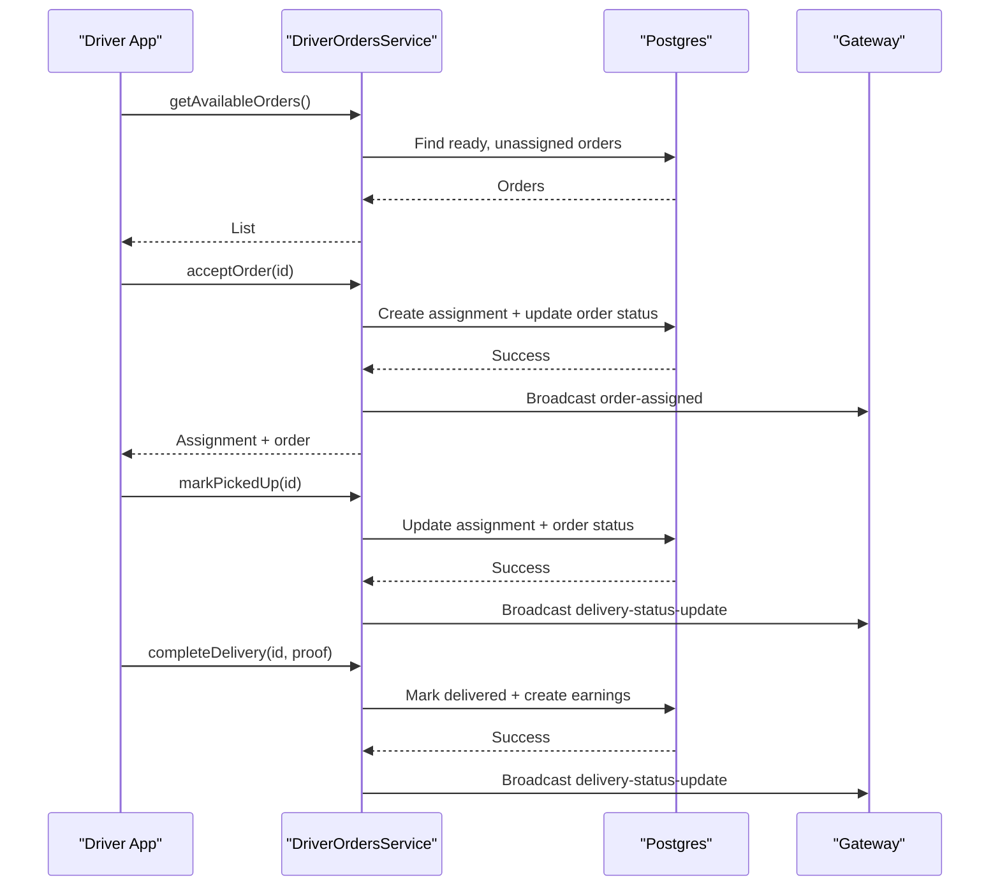
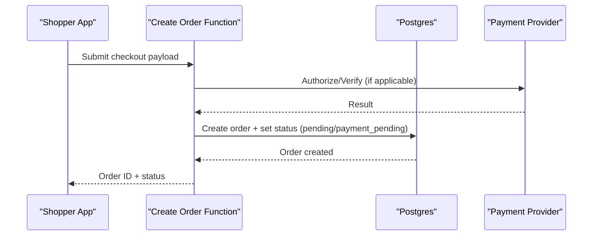
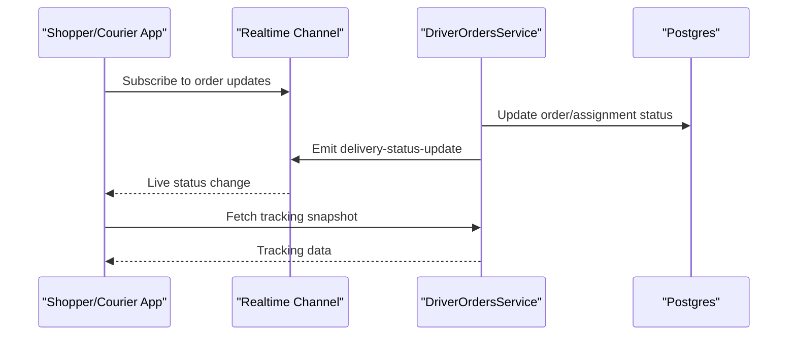
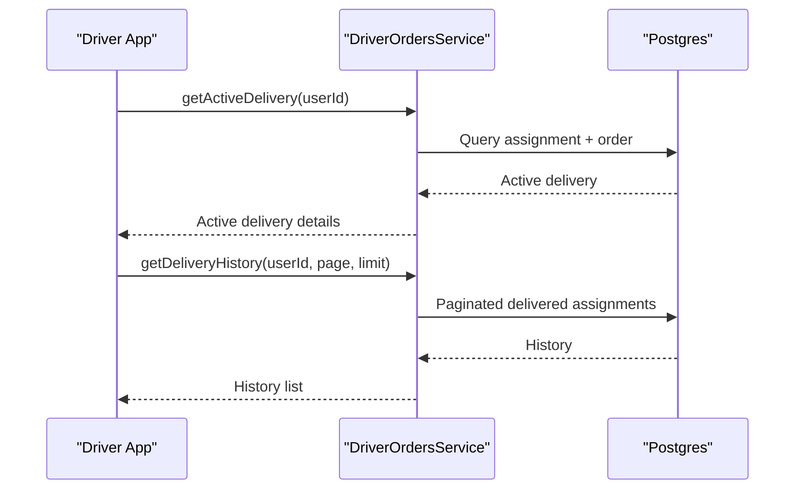
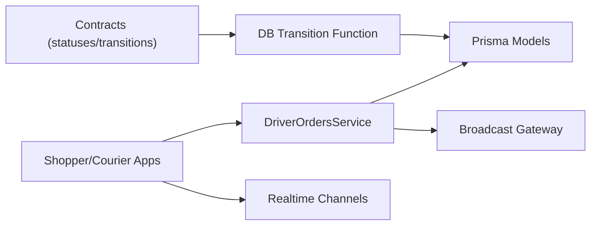

# Orders Module

<cite>
**Referenced Files in This Document**
- [orderStatus.ts](file://packages/contracts/src/orderStatus.ts)
- [20260715150000_canonical_order_lifecycle.sql](file://supabase/migrations/20260715150000_canonical_order_lifecycle.sql)
- [schema.prisma](file://apps/api/prisma/schema.prisma)
- [driver-orders.service.ts](file://apps/api/src/modules/driver/driver-orders.service.ts)
- [create-order/index.ts](file://apps/shopper-native/supabase/functions/create-order/index.ts)
- [realtime.ts](file://apps/shopper-native/src/features/orders/realtime.ts)
- [fetchOrderTracking.ts](file://apps/shopper-native/src/features/orders/api/fetchOrderTracking.ts)
- [orders.store.ts](file://apps/courier-mobile/src/stores/orders.store.ts)
</cite>

## Table of Contents
1. Introduction
2. Project Structure
3. Core Components
4. Architecture Overview
5. Detailed Component Analysis
6. Dependency Analysis
7. Performance Considerations
8. Troubleshooting Guide
9. Conclusion

## Introduction
This document explains the Orders module end-to-end: how orders are created, validated, routed across branches and drivers, fulfilled, and tracked in real time. It covers the canonical order lifecycle, state transitions enforced at the database layer, API endpoints for driver workflows, real-time status updates, and analytics/reporting considerations. It also provides guidance on extending order types and integrating payments and inventory reservation.

## Project Structure
The Orders module spans several layers:
- Contracts define the canonical order statuses and allowed transitions.
- Database migrations enforce a strict transition graph via a security-definer function.
- The Prisma schema models orders, order items, and related entities (profiles, delivery assignments).
- Driver service implements order assignment and fulfillment workflow with geofencing and broadcasting.
- Client apps consume order APIs and subscribe to real-time updates.

**Diagram sources**
- [orderStatus.ts:59-167](file://packages/contracts/src/orderStatus.ts#L59-L167)
- [20260715150000_canonical_order_lifecycle.sql:16-40](file://supabase/migrations/20260715150000_canonical_order_lifecycle.sql#L16-L40)
- [schema.prisma:540-592](file://apps/api/prisma/schema.prisma#L540-L592)
- [driver-orders.service.ts:74-322](file://apps/api/src/modules/driver/driver-orders.service.ts#L74-L322)

**Section sources**
- [orderStatus.ts:59-167](file://packages/contracts/src/orderStatus.ts#L59-L167)
- [20260715150000_canonical_order_lifecycle.sql:16-40](file://supabase/migrations/20260715150000_canonical_order_lifecycle.sql#L16-L40)
- [schema.prisma:540-592](file://apps/api/prisma/schema.prisma#L540-L592)

## Core Components
- Canonical order lifecycle and transitions: single source of truth for statuses and allowed moves.
- Database transition enforcement: a security-definer function validates transitions and updates timestamps.
- Order data model: orders, order_items, profiles, and delivery assignments.
- Driver workflow service: available orders listing, acceptance, rejection, and step-by-step fulfillment with geofencing and broadcast events.
- Real-time tracking: client subscriptions and tracking endpoints.

Key responsibilities:
- Enforce valid state changes at the DB layer.
- Provide driver-facing endpoints for assignment and fulfillment.
- Keep clients synchronized via real-time updates.

**Section sources**
- [orderStatus.ts:59-167](file://packages/contracts/src/orderStatus.ts#L59-L167)
- [20260715150000_canonical_order_lifecycle.sql:16-40](file://supabase/migrations/20260715150000_canonical_order_lifecycle.sql#L16-L40)
- [schema.prisma:540-592](file://apps/api/prisma/schema.prisma#L540-L592)
- [driver-orders.service.ts:74-322](file://apps/api/src/modules/driver/driver-orders.service.ts#L74-L322)

## Architecture Overview
The order lifecycle is governed by a canonical contract and enforced by a database function. Driver operations update both order status and delivery assignment states, then broadcast changes to admins and clients.

**Diagram sources**
- [driver-orders.service.ts:74-183](file://apps/api/src/modules/driver/driver-orders.service.ts#L74-L183)
- [driver-orders.service.ts:187-295](file://apps/api/src/modules/driver/driver-orders.service.ts#L187-L295)
- [driver-orders.service.ts:435-510](file://apps/api/src/modules/driver/driver-orders.service.ts#L435-L510)

## Detailed Component Analysis

### Canonical Order Lifecycle and Transitions
- Defines all canonical statuses, labels, normalization helpers, and the complete allowed transition graph.
- Provides utilities to check if a transition is allowed and whether a status is terminal.

**Diagram sources**
- [orderStatus.ts:59-167](file://packages/contracts/src/orderStatus.ts#L59-L167)

**Section sources**
- [orderStatus.ts:59-167](file://packages/contracts/src/orderStatus.ts#L59-L167)

### Database Transition Enforcement
- A security-definer function enforces the canonical transition graph and updates timestamps atomically.
- Only authorized roles can invoke it; invalid transitions raise specific errors.

**Diagram sources**
- [20260715150000_canonical_order_lifecycle.sql:16-40](file://supabase/migrations/20260715150000_canonical_order_lifecycle.sql#L16-L40)

**Section sources**
- [20260715150000_canonical_order_lifecycle.sql:16-40](file://supabase/migrations/20260715150000_canonical_order_lifecycle.sql#L16-L40)

### Order Data Model and Relationships
- Orders link to customers via profile relationships and store shipping/payment metadata.
- Order items snapshot product details and quantities at time of purchase.
- DeliveryAssignment ties an order to a driver and tracks fulfillment steps.

**Diagram sources**
- [schema.prisma:540-592](file://apps/api/prisma/schema.prisma#L540-L592)

**Section sources**
- [schema.prisma:540-592](file://apps/api/prisma/schema.prisma#L540-L592)

### Driver Workflow Service
Responsibilities include:
- Listing available orders for drivers.
- Accepting/rejecting orders with concurrency-safe transactions.
- Advancing fulfillment states with geofence checks.
- Completing deliveries, recording earnings, and broadcasting updates.

**Diagram sources**
- [driver-orders.service.ts:74-183](file://apps/api/src/modules/driver/driver-orders.service.ts#L74-L183)
- [driver-orders.service.ts:187-295](file://apps/api/src/modules/driver/driver-orders.service.ts#L187-L295)
- [driver-orders.service.ts:382-433](file://apps/api/src/modules/driver/driver-orders.service.ts#L382-L433)
- [driver-orders.service.ts:435-510](file://apps/api/src/modules/driver/driver-orders.service.ts#L435-L510)

**Section sources**
- [driver-orders.service.ts:74-183](file://apps/api/src/modules/driver/driver-orders.service.ts#L74-L183)
- [driver-orders.service.ts:187-295](file://apps/api/src/modules/driver/driver-orders.service.ts#L187-L295)
- [driver-orders.service.ts:382-433](file://apps/api/src/modules/driver/driver-orders.service.ts#L382-L433)
- [driver-orders.service.ts:435-510](file://apps/api/src/modules/driver/driver-orders.service.ts#L435-L510)

### Order Creation and Payment Integration
- Orders are created via a Supabase Edge Function that sets initial status and integrates with payment flows (e.g., manual wallet verification).
- Statuses such as payment_pending and payment_approved reflect manual payment verification stages before fulfillment begins.

**Diagram sources**
- [create-order/index.ts](file://apps/shopper-native/supabase/functions/create-order/index.ts)
- [orderStatus.ts:59-167](file://packages/contracts/src/orderStatus.ts#L59-L167)

**Section sources**
- [create-order/index.ts](file://apps/shopper-native/supabase/functions/create-order/index.ts)
- [orderStatus.ts:59-167](file://packages/contracts/src/orderStatus.ts#L59-L167)

### Real-Time Status Updates and Tracking
- Clients subscribe to real-time channels to receive live order status changes.
- Tracking endpoints provide snapshots of location and status for active deliveries.

**Diagram sources**
- [realtime.ts](file://apps/shopper-native/src/features/orders/realtime.ts)
- [fetchOrderTracking.ts](file://apps/shopper-native/src/features/orders/api/fetchOrderTracking.ts)
- [driver-orders.service.ts:613-619](file://apps/api/src/modules/driver/driver-orders.service.ts#L613-L619)

**Section sources**
- [realtime.ts](file://apps/shopper-native/src/features/orders/realtime.ts)
- [fetchOrderTracking.ts](file://apps/shopper-native/src/features/orders/api/fetchOrderTracking.ts)
- [driver-orders.service.ts:613-619](file://apps/api/src/modules/driver/driver-orders.service.ts#L613-L619)

### Order History and Courier View
- Drivers view their active delivery and delivery history through dedicated queries.
- Courier mobile stores expose order structures for UI rendering.

**Diagram sources**
- [driver-orders.service.ts:326-378](file://apps/api/src/modules/driver/driver-orders.service.ts#L326-L378)
- [driver-orders.service.ts:514-554](file://apps/api/src/modules/driver/driver-orders.service.ts#L514-L554)
- [orders.store.ts](file://apps/courier-mobile/src/stores/orders.store.ts)

**Section sources**
- [driver-orders.service.ts:326-378](file://apps/api/src/modules/driver/driver-orders.service.ts#L326-L378)
- [driver-orders.service.ts:514-554](file://apps/api/src/modules/driver/driver-orders.service.ts#L514-L554)
- [orders.store.ts](file://apps/courier-mobile/src/stores/orders.store.ts)

## Dependency Analysis
- Contracts depend only on TypeScript types and constants.
- Database migration depends on Postgres and defines the authoritative transition logic.
- Driver service depends on Prisma and a gateway for broadcasts.
- Client features depend on services and realtime channels.

**Diagram sources**
- [orderStatus.ts:59-167](file://packages/contracts/src/orderStatus.ts#L59-L167)
- [20260715150000_canonical_order_lifecycle.sql:16-40](file://supabase/migrations/20260715150000_canonical_order_lifecycle.sql#L16-L40)
- [schema.prisma:540-592](file://apps/api/prisma/schema.prisma#L540-L592)
- [driver-orders.service.ts:613-619](file://apps/api/src/modules/driver/driver-orders.service.ts#L613-L619)

**Section sources**
- [orderStatus.ts:59-167](file://packages/contracts/src/orderStatus.ts#L59-L167)
- [20260715150000_canonical_order_lifecycle.sql:16-40](file://supabase/migrations/20260715150000_canonical_order_lifecycle.sql#L16-L40)
- [schema.prisma:540-592](file://apps/api/prisma/schema.prisma#L540-L592)
- [driver-orders.service.ts:613-619](file://apps/api/src/modules/driver/driver-orders.service.ts#L613-L619)

## Performance Considerations
- Use indexed queries for orders by status and created_at to optimize listing and pagination.
- Keep driver availability checks and distance calculations server-side to reduce client overhead.
- Batch real-time broadcasts to avoid flooding clients during high-volume transitions.
- Snapshot product data in order_items to prevent read amplification on catalog changes.

[No sources needed since this section provides general guidance]

## Troubleshooting Guide
Common issues and resolutions:
- Invalid state transition: occurs when attempting an unsupported move; ensure transitions follow the canonical graph or use the admin transition function.
- Driver not online: acceptance requires driver to be marked online; verify driver profile status.
- Geofence validation failures: arrival actions require proximity to pharmacy/customer; confirm GPS coordinates and radius thresholds.
- Concurrency conflicts: multiple drivers may attempt to accept the same order; rely on transactional locks and unique constraints to prevent double assignment.
- Realtime disconnects: handle reconnection and replay last known status from polling or stored timeline.

**Section sources**
- [20260715150000_canonical_order_lifecycle.sql:16-40](file://supabase/migrations/20260715150000_canonical_order_lifecycle.sql#L16-L40)
- [driver-orders.service.ts:68-70](file://apps/api/src/modules/driver/driver-orders.service.ts#L68-L70)
- [driver-orders.service.ts:386-400](file://apps/api/src/modules/driver/driver-orders.service.ts#L386-L400)
- [driver-orders.service.ts:413-433](file://apps/api/src/modules/driver/driver-orders.service.ts#L413-L433)

## Conclusion
The Orders module enforces a robust, canonical lifecycle with database-level transition guards, a clear driver workflow for fulfillment, and real-time updates for transparency. By centralizing statuses and transitions, the system ensures consistency across admin panels, driver apps, and customer interfaces. Extending order types should reuse the canonical statuses and add domain-specific fields while preserving the core transition graph.

[No sources needed since this section summarizes without analyzing specific files]