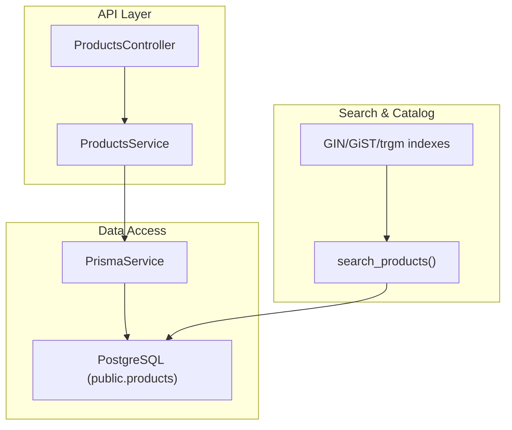
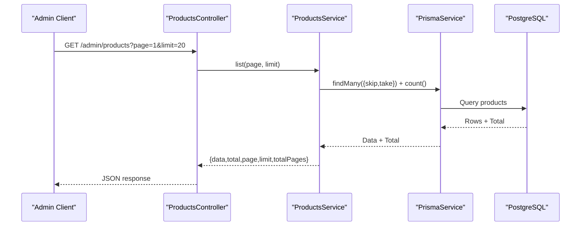
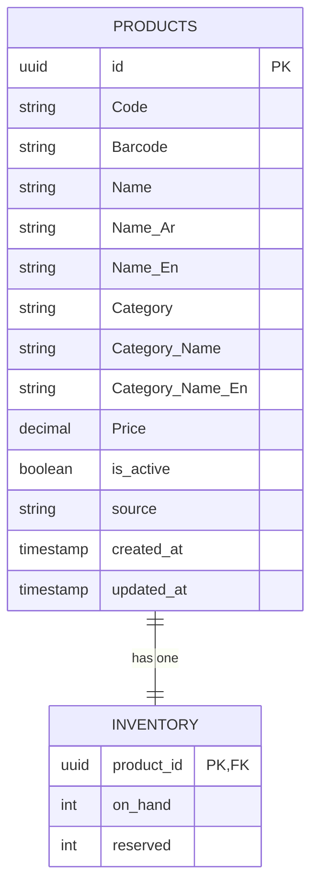
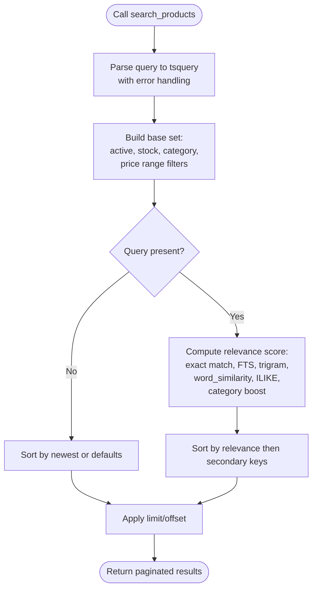
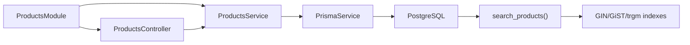

# Products Module

<cite>
**Referenced Files in This Document**
- [products.controller.ts](file://apps/api/src/modules/products/products.controller.ts)
- [products.service.ts](file://apps/api/src/modules/products/products.service.ts)
- [products.module.ts](file://apps/api/src/modules/products/products.module.ts)
- [schema.prisma](file://apps/api/prisma/schema.prisma)
- [20260530_product_real_fields.sql](file://database/20260530_product_real_fields.sql)
- [20260603_products_search_vector.sql](file://database/20260603_products_search_vector.sql)
- [20260604_search_products_resilient.sql](file://database/20260604_search_products_resilient.sql)
</cite>

## Table of Contents
1. Introduction
2. Project Structure
3. Core Components
4. Architecture Overview
5. Detailed Component Analysis
6. Dependency Analysis
7. Performance Considerations
8. Troubleshooting Guide
9. Conclusion
10. Appendices

## Introduction
This document describes the Products module that powers product catalog management, including CRUD operations, search and filtering, category handling, inventory integration, pricing calculations, image handling, and extensibility guidance. It explains the Product entity schema, validation rules, business logic for lifecycle management, API endpoints, performance optimizations, and integration with the search engine via a database function.

## Project Structure
The Products module is implemented as a NestJS feature module under apps/api/src/modules/products, exposing an admin endpoint for listing products. The data model lives in Prisma schema and is extended by SQL migrations for ratings/discounts/badges and full-text search capabilities.

**Diagram sources**
- [products.controller.ts:5-13](file://apps/api/src/modules/products/products.controller.ts#L5-L13)
- [products.service.ts:8-25](file://apps/api/src/modules/products/products.service.ts#L8-L25)
- [schema.prisma:595-613](file://apps/api/prisma/schema.prisma#L595-L613)
- [20260604_search_products_resilient.sql:39-215](file://database/20260604_search_products_resilient.sql#L39-L215)

**Section sources**
- [products.controller.ts:1-15](file://apps/api/src/modules/products/products.controller.ts#L1-L15)
- [products.service.ts:1-27](file://apps/api/src/modules/products/products.service.ts#L1-L27)
- [products.module.ts:1-14](file://apps/api/src/modules/products/products.module.ts#L1-L14)
- [schema.prisma:595-613](file://apps/api/prisma/schema.prisma#L595-L613)

## Core Components
- ProductsModule: Registers controller and service, imports Prisma and Auth modules.
- ProductsController: Exposes GET /admin/products with pagination query parameters page and limit; protected by AdminAuthGuard.
- ProductsService: Paginates products using Prisma findMany/count and returns items, total, page, limit, totalPages.
- Product Entity (public.products): Holds identifiers, multilingual names, category fields, price, active flag, source, timestamps, and optional inventory relation.
- Inventory Integration: A one-to-one relation to inventory table with on_hand and reserved quantities.
- Search Engine Integration: Database function search_products provides robust search, filtering, sorting, and ranking using FTS, trigrams, word similarity, and ILIKE fallbacks.

**Section sources**
- [products.module.ts:1-14](file://apps/api/src/modules/products/products.module.ts#L1-L14)
- [products.controller.ts:5-13](file://apps/api/src/modules/products/products.controller.ts#L5-L13)
- [products.service.ts:8-25](file://apps/api/src/modules/products/products.service.ts#L8-L25)
- [schema.prisma:529-536](file://apps/api/prisma/schema.prisma#L529-L536)
- [schema.prisma:595-613](file://apps/api/prisma/schema.prisma#L595-L613)
- [20260604_search_products_resilient.sql:39-215](file://database/20260604_search_products_resilient.sql#L39-L215)

## Architecture Overview
The module follows a layered architecture:
- Controller receives HTTP requests and delegates to service.
- Service uses Prisma to read from PostgreSQL.
- Search functionality is provided by a stored procedure that leverages multiple indexing strategies for performance and resilience.

**Diagram sources**
- [products.controller.ts:5-13](file://apps/api/src/modules/products/products.controller.ts#L5-L13)
- [products.service.ts:8-25](file://apps/api/src/modules/products/products.service.ts#L8-L25)

## Detailed Component Analysis

### Product Entity Schema and Validation Rules
- Identifier and metadata: id, Code, Barcode, Name (multilingual), Category fields, Price, is_active, source, created_at, updated_at.
- Optional relations: inventory (one-to-one).
- Validation considerations:
  - Ensure required fields are present at the API layer before persistence.
  - Enforce numeric ranges for Price and discount_percent where applicable.
  - Validate barcode/code uniqueness if needed.
  - Use boolean flags like is_active to control visibility in browse/search.

**Diagram sources**
- [schema.prisma:595-613](file://apps/api/prisma/schema.prisma#L595-L613)
- [schema.prisma:529-536](file://apps/api/prisma/schema.prisma#L529-L536)

**Section sources**
- [schema.prisma:595-613](file://apps/api/prisma/schema.prisma#L595-L613)
- [schema.prisma:529-536](file://apps/api/prisma/schema.prisma#L529-L536)

### CRUD Operations
- List: Implemented via GET /admin/products with pagination.
- Create/Update/Delete: Not yet exposed in the controller; can be added by extending the controller and service with corresponding methods and Prisma calls.
- Recommended validations:
  - Input sanitization and type checks.
  - Business rule enforcement (e.g., non-negative prices, valid categories).
  - Idempotency keys for create/update to prevent duplicates.

**Section sources**
- [products.controller.ts:5-13](file://apps/api/src/modules/products/products.controller.ts#L5-L13)
- [products.service.ts:8-25](file://apps/api/src/modules/products/products.service.ts#L8-L25)

### Search Functionality and Filtering
- Unified search via search_products():
  - Parameters: query, category, in_stock, min_price, max_price, sort, limit, offset.
  - Filters: category name, stock availability, price range, active status.
  - Sorting: relevance (default for keyword searches), price asc/desc, name asc.
  - Ranking: combines exact code/barcode match, full-text cover density, trigram whole-string similarity, word/partial similarity, ILIKE substring fallback, and category soft boost.
  - Resilience: gracefully handles malformed queries; works without search_vector column; falls back to trigram and ILIKE when needed.

**Diagram sources**
- [20260604_search_products_resilient.sql:39-215](file://database/20260604_search_products_resilient.sql#L39-L215)

**Section sources**
- [20260604_search_products_resilient.sql:39-215](file://database/20260604_search_products_resilient.sql#L39-L215)

### Category Management
- Categories are represented as strings on products (Category, Category_Name, Category_Name_En).
- Filtering by category is supported in search_products via p_category parameter.
- For advanced category hierarchies or translations, consider adding a dedicated categories table and relations.

**Section sources**
- [schema.prisma:595-613](file://apps/api/prisma/schema.prisma#L595-L613)
- [20260604_search_products_resilient.sql:140-147](file://database/20260604_search_products_resilient.sql#L140-L147)

### Inventory Integration
- One-to-one relation between products and inventory with on_hand and reserved counts.
- Stock availability filter in search_products ensures only in-stock items appear when requested.
- Business logic recommendations:
  - Deduct on_hand on order placement and adjust reserved during checkout.
  - Prevent negative stock via constraints or application checks.
  - Expose endpoints to adjust stock levels and log adjustments.

**Section sources**
- [schema.prisma:529-536](file://apps/api/prisma/schema.prisma#L529-L536)
- [20260604_search_products_resilient.sql:143-145](file://database/20260604_search_products_resilient.sql#L143-L145)

### Image Handling
- The search function includes image_url in its output, indicating images are associated with products.
- Recommendations:
  - Store images in object storage and persist URLs in product records.
  - Provide endpoints to upload, update, and delete images.
  - Implement CDN caching and image transformations for performance.

**Section sources**
- [20260604_search_products_resilient.sql:49-61](file://database/20260604_search_products_resilient.sql#L49-L61)

### Pricing Calculations
- Base price stored in Price field.
- Additional promotional fields exist in migrations (rating_avg, rating_count, discount_percent, is_new, is_bestseller, is_sale).
- Calculation approach:
  - Final price = Price adjusted by discount_percent when is_sale is true.
  - Display badges based on flags for marketing UI.
  - Ensure rounding and currency formatting at the API layer.

**Section sources**
- [schema.prisma:595-613](file://apps/api/prisma/schema.prisma#L595-L613)
- [20260530_product_real_fields.sql:10-28](file://database/20260530_product_real_fields.sql#L10-L28)

### Product Lifecycle Management
- Active/inactive state controlled by is_active.
- Browse path excludes inactive products unless explicitly queried.
- Lifecycle steps:
  - Create product with default is_active=true.
  - Update details, pricing, and inventory.
  - Deactivate for removal from public catalogs while retaining history.
  - Archive or soft-delete via additional fields if needed.

**Section sources**
- [schema.prisma:595-613](file://apps/api/prisma/schema.prisma#L595-L613)
- [20260604_search_products_resilient.sql:140-142](file://database/20260604_search_products_resilient.sql#L140-L142)

### API Endpoints
- GET /admin/products?page={number}&limit={number}
  - Returns paginated product list with metadata (data, total, page, limit, totalPages).
  - Protected by AdminAuthGuard.

Example usage:
- Fetch first page of 20 products: GET /admin/products?page=1&limit=20

**Section sources**
- [products.controller.ts:5-13](file://apps/api/src/modules/products/products.controller.ts#L5-L13)
- [products.service.ts:8-25](file://apps/api/src/modules/products/products.service.ts#L8-L25)

### Bulk Operations
- Current implementation supports pagination but not bulk create/update/delete.
- Recommendations:
  - Add POST /admin/products/bulk-create with array payload.
  - Add PATCH /admin/products/bulk-update with partial updates.
  - Add DELETE /admin/products/bulk-delete with IDs array.
  - Implement transactional batches and validation per item.

[No sources needed since this section proposes future enhancements]

### Extending Product Types and Custom Validation
- To support specialized product types (e.g., pharmaceuticals vs. general goods):
  - Add a type discriminator field and type-specific attributes in a JSON column or related tables.
  - Extend service validation to enforce type-specific rules.
  - Update search function to include type-specific fields in ranking if needed.
- Custom validation rules:
  - Implement DTOs and class-validator decorators at the controller layer.
  - Centralize business rules in service methods.
  - Use database constraints for critical invariants (e.g., non-negative prices).

[No sources needed since this section provides general guidance]

## Dependency Analysis
- ProductsModule depends on PrismaModule and AuthModule.
- Controller depends on ProductsService.
- Service depends on PrismaService for data access.
- Search functionality depends on PostgreSQL functions and indexes.

**Diagram sources**
- [products.module.ts:7-11](file://apps/api/src/modules/products/products.module.ts#L7-L11)
- [products.controller.ts:5-13](file://apps/api/src/modules/products/products.controller.ts#L5-L13)
- [products.service.ts:8-25](file://apps/api/src/modules/products/products.service.ts#L8-L25)
- [20260604_search_products_resilient.sql:39-215](file://database/20260604_search_products_resilient.sql#L39-L215)

**Section sources**
- [products.module.ts:1-14](file://apps/api/src/modules/products/products.module.ts#L1-L14)
- [products.controller.ts:1-15](file://apps/api/src/modules/products/products.controller.ts#L1-L15)
- [products.service.ts:1-27](file://apps/api/src/modules/products/products.service.ts#L1-L27)

## Performance Considerations
- Pagination: Use skip/take to avoid large result sets.
- Indexing:
  - GIN index on search_vector (if applied) accelerates full-text search.
  - Trigram and GiST indexes improve fuzzy matching and partial word searches.
- Query optimization:
  - Pre-parse tsquery once per call.
  - Use composite relevance scoring to prioritize exact matches and reduce scanning.
- Caching:
  - Cache frequent category listings and popular searches at the API layer or CDN.
- Connection pooling:
  - Configure Prisma connection pool size appropriately for load.

**Section sources**
- [products.service.ts:8-25](file://apps/api/src/modules/products/products.service.ts#L8-L25)
- [20260603_products_search_vector.sql:24-39](file://database/20260603_products_search_vector.sql#L24-L39)
- [20260604_search_products_resilient.sql:74-82](file://database/20260604_search_products_resilient.sql#L74-L82)

## Troubleshooting Guide
- Search errors due to missing search_vector:
  - The search function is resilient and computes tsvector inline; ensure migrations are applied.
  - If issues persist, verify trigram extensions and indexes exist.
- Malformed query strings:
  - The function wraps tsquery parsing in exception handling; bad inputs fall back to trigram-only matching.
- Inactive products appearing:
  - Confirm is_active filtering is applied in browse paths; check search function WHERE clause.
- Stock visibility:
  - Ensure in_stock filter is used correctly; verify inventory on_hand values.

**Section sources**
- [20260604_search_products_resilient.sql:74-82](file://database/20260604_search_products_resilient.sql#L74-L82)
- [20260604_search_products_resilient.sql:140-147](file://database/20260604_search_products_resilient.sql#L140-L147)

## Conclusion
The Products module provides a solid foundation for catalog management with pagination, robust search, and inventory integration. While CRUD beyond listing is not yet exposed, the architecture allows easy extension. Leveraging database-level search and indexing ensures scalability and resilience. Future enhancements should include full CRUD endpoints, bulk operations, image upload endpoints, and advanced category structures.

[No sources needed since this section summarizes without analyzing specific files]

## Appendices

### Example Workflows

- Product Creation Workflow:
  - Validate input (name, price, category, barcode).
  - Create product record with is_active=true.
  - Initialize inventory with on_hand=0, reserved=0.
  - Optionally set promotional flags and discount_percent.
  - Reindex or trigger search vector update if applicable.

- Bulk Import Workflow:
  - Accept CSV/JSON payload.
  - Validate each item and batch insert with transactions.
  - Report successes and failures per item.
  - Update search indexes post-batch.

- Integration with Search Engine:
  - Call search_products with query, category, stock, price filters.
  - Use returned rank for relevance-based display.
  - Apply client-side sorting and pagination.

[No sources needed since this section provides general guidance]