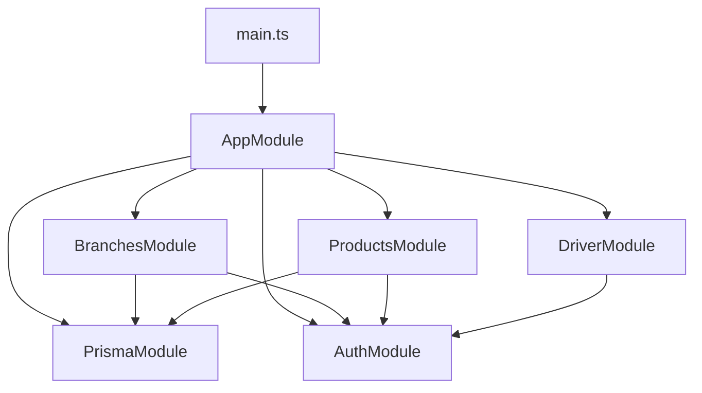
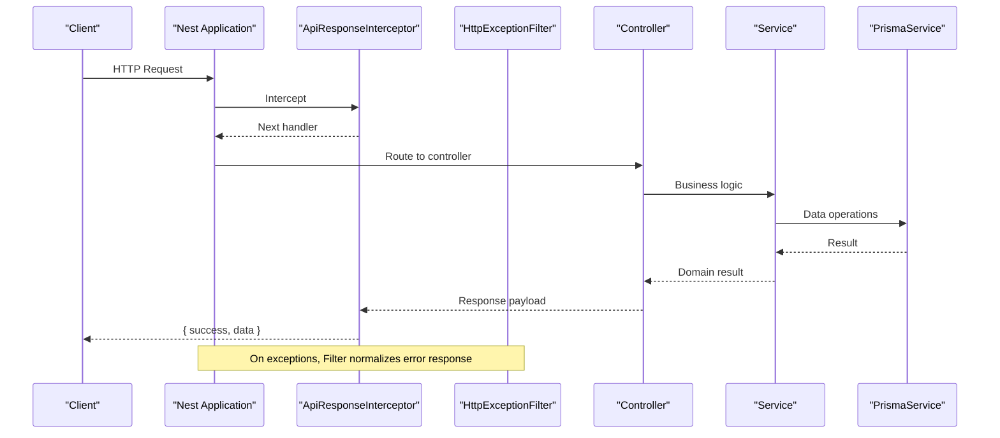
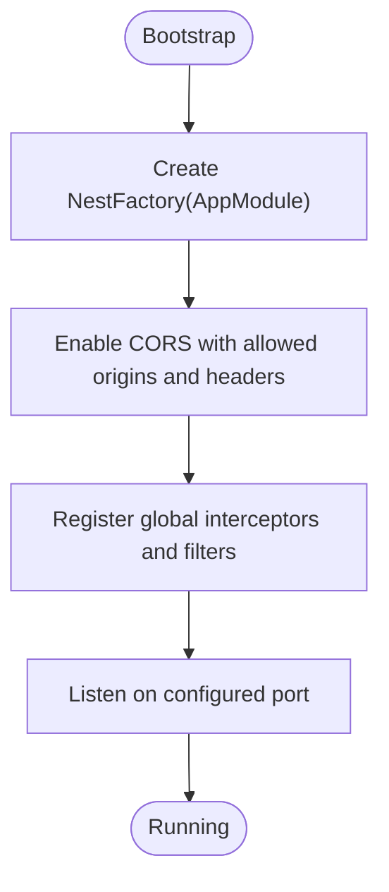
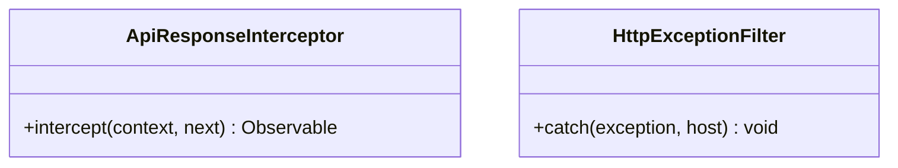
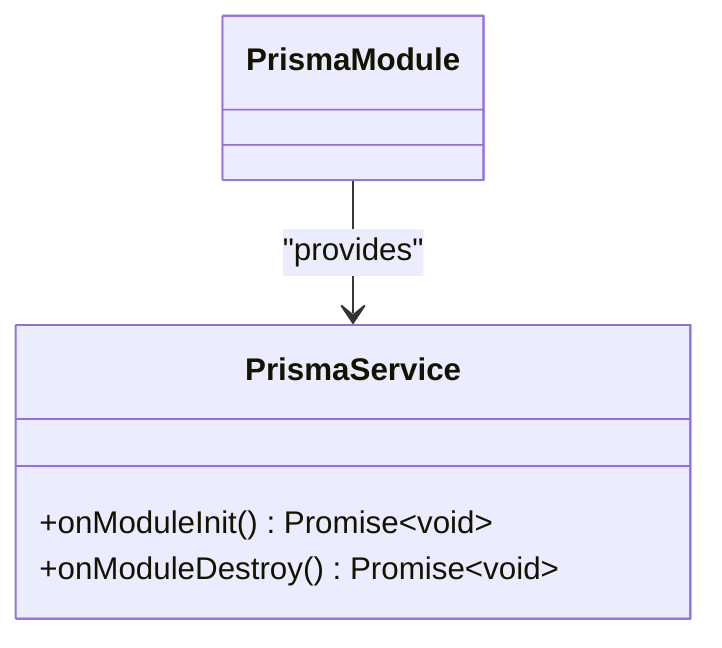
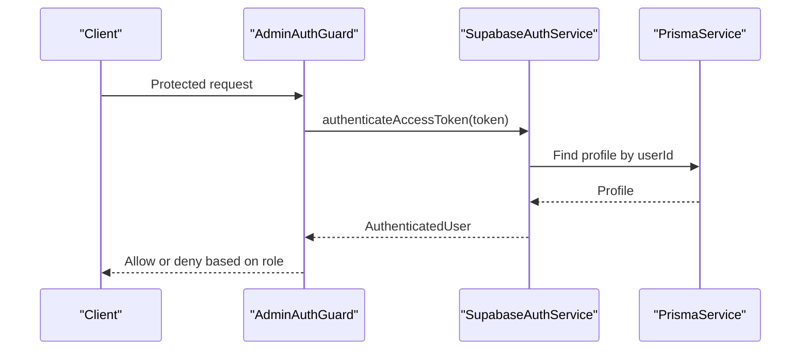
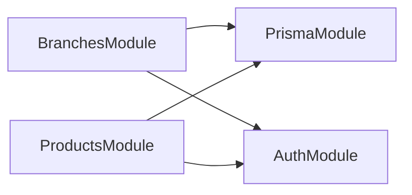
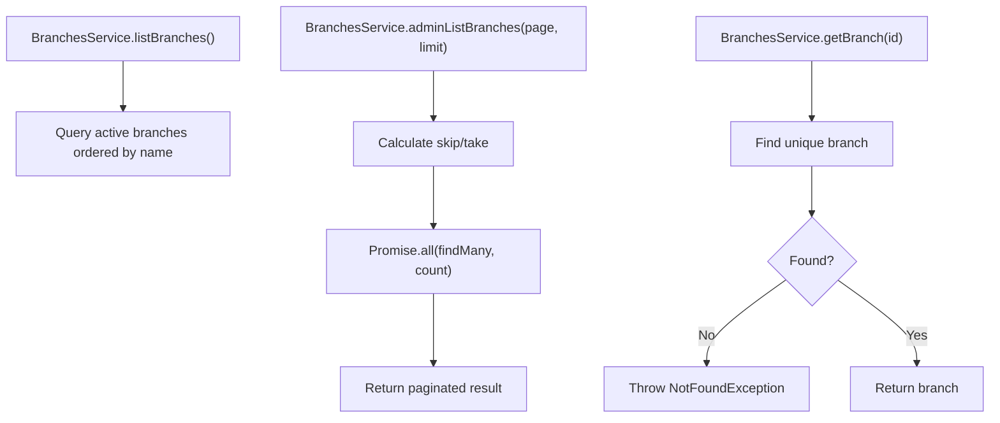
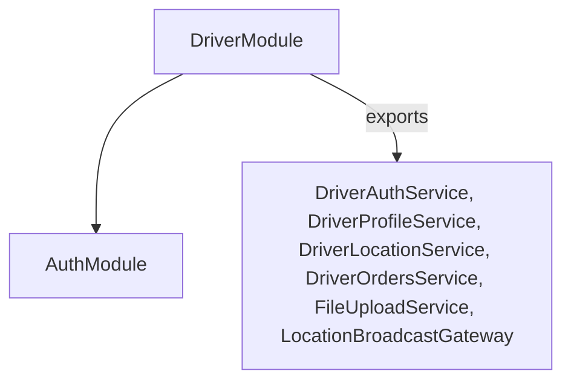
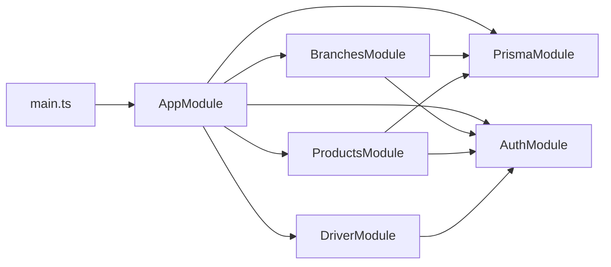

# Core Modules & Services

<cite>
**Referenced Files in This Document**
- [main.ts](file://apps/api/src/main.ts)
- [app.module.ts](file://apps/api/src/app.module.ts)
- [api-response.interceptor.ts](file://apps/api/src/common/api-response.interceptor.ts)
- [http-exception.filter.ts](file://apps/api/src/common/http-exception.filter.ts)
- [prisma.module.ts](file://apps/api/src/prisma/prisma.module.ts)
- [prisma.service.ts](file://apps/api/src/prisma/prisma.service.ts)
- [auth.module.ts](file://apps/api/src/auth/auth.module.ts)
- [supabase-auth.service.ts](file://apps/api/src/auth/supabase-auth.service.ts)
- [admin-auth.guard.ts](file://apps/api/src/auth/admin-auth.guard.ts)
- [branches.module.ts](file://apps/api/src/modules/branches/branches.module.ts)
- [branches.service.ts](file://apps/api/src/modules/branches/branches.service.ts)
- [products.module.ts](file://apps/api/src/modules/products/products.module.ts)
- [driver.module.ts](file://apps/api/src/modules/driver/driver.module.ts)
</cite>

## Table of Contents
1. Introduction
2. Project Structure
3. Core Components
4. Architecture Overview
5. Detailed Component Analysis
6. Dependency Analysis
7. Performance Considerations
8. Troubleshooting Guide
9. Conclusion

## Introduction
This document explains the core NestJS modules and services architecture for the API application. It covers modular design, dependency injection configuration, service layer organization, shared utilities (interceptors, exception filters), module registration, inter-module communication, and lifecycle management. It also provides guidance on creating new modules, implementing services with proper dependency injection, structuring business logic, error handling strategies, and testing approaches for services.

## Project Structure
The API is organized around a root AppModule that imports feature modules and shared infrastructure:
- Root bootstrap wires global interceptors and filters, configures CORS, and starts the server.
- Feature modules encapsulate controllers, services, and their dependencies.
- Shared infrastructure includes a global Prisma module, an Auth module, and common utilities like response formatting and exception filtering.

**Diagram sources**
- [main.ts:1-44](file://apps/api/src/main.ts#L1-L44)
- [app.module.ts:1-30](file://apps/api/src/app.module.ts#L1-L30)
- [prisma.module.ts:1-11](file://apps/api/src/prisma/prisma.module.ts#L1-L11)
- [auth.module.ts:1-13](file://apps/api/src/auth/auth.module.ts#L1-L13)
- [branches.module.ts:1-14](file://apps/api/src/modules/branches/branches.module.ts#L1-L14)
- [products.module.ts:1-14](file://apps/api/src/modules/products/products.module.ts#L1-L14)
- [driver.module.ts:1-33](file://apps/api/src/modules/driver/driver.module.ts#L1-L33)

**Section sources**
- [main.ts:1-44](file://apps/api/src/main.ts#L1-L44)
- [app.module.ts:1-30](file://apps/api/src/app.module.ts#L1-L30)

## Core Components
- Global request/response pipeline:
  - ApiResponseInterceptor wraps successful responses into a consistent envelope.
  - HttpExceptionFilter standardizes error responses with status, code, message, and context details.
- Data access:
  - PrismaService manages PrismaClient lifecycle and is provided globally via PrismaModule.
- Authentication:
  - SupabaseAuthService integrates with Supabase Auth and maps tokens to profiles stored in the database.
  - Role-based guards (e.g., AdminAuthGuard) enforce role checks using SupabaseAuthService.
- Feature modules:
  - BranchesModule, ProductsModule, DriverModule demonstrate typical module composition with controllers, services, and shared dependencies.

**Section sources**
- [api-response.interceptor.ts:1-23](file://apps/api/src/common/api-response.interceptor.ts#L1-L23)
- [http-exception.filter.ts:1-46](file://apps/api/src/common/http-exception.filter.ts#L1-L46)
- [prisma.module.ts:1-11](file://apps/api/src/prisma/prisma.module.ts#L1-L11)
- [prisma.service.ts:1-15](file://apps/api/src/prisma/prisma.service.ts#L1-L15)
- [auth.module.ts:1-13](file://apps/api/src/auth/auth.module.ts#L1-L13)
- [supabase-auth.service.ts:1-80](file://apps/api/src/auth/supabase-auth.service.ts#L1-L80)
- [admin-auth.guard.ts:1-10](file://apps/api/src/auth/admin-auth.guard.ts#L1-L10)
- [branches.module.ts:1-14](file://apps/api/src/modules/branches/branches.module.ts#L1-L14)
- [products.module.ts:1-14](file://apps/api/src/modules/products/products.module.ts#L1-L14)
- [driver.module.ts:1-33](file://apps/api/src/modules/driver/driver.module.ts#L1-L33)

## Architecture Overview
The runtime bootstraps the Nest application, registers global middleware-like components (interceptors and filters), and loads all feature modules. Requests flow through the interceptor stack, are routed to controllers, delegated to services, and return data wrapped by the response interceptor. Errors are caught by the global filter and normalized.

**Diagram sources**
- [main.ts:7-35](file://apps/api/src/main.ts#L7-L35)
- [api-response.interceptor.ts:10-21](file://apps/api/src/common/api-response.interceptor.ts#L10-L21)
- [http-exception.filter.ts:9-44](file://apps/api/src/common/http-exception.filter.ts#L9-L44)
- [prisma.service.ts:4-13](file://apps/api/src/prisma/prisma.service.ts#L4-L13)

## Detailed Component Analysis

### Module Registration and Bootstrap
- The application entry point creates the Nest app, enables CORS with explicit origins and headers, registers global interceptors and filters, and listens on a configurable port.
- The root AppModule aggregates feature modules and shared modules, centralizing module registration.

**Diagram sources**
- [main.ts:7-35](file://apps/api/src/main.ts#L7-L35)

**Section sources**
- [main.ts:1-44](file://apps/api/src/main.ts#L1-L44)
- [app.module.ts:1-30](file://apps/api/src/app.module.ts#L1-L30)

### Global Utilities: Interceptors and Filters
- ApiResponseInterceptor transforms successful responses into a uniform envelope containing success flag, data, and error fields.
- HttpExceptionFilter catches all exceptions, extracts status and message from HttpException instances or defaults to internal server error, and returns a structured error object including path and method.

**Diagram sources**
- [api-response.interceptor.ts:10-21](file://apps/api/src/common/api-response.interceptor.ts#L10-L21)
- [http-exception.filter.ts:9-44](file://apps/api/src/common/http-exception.filter.ts#L9-L44)

**Section sources**
- [api-response.interceptor.ts:1-23](file://apps/api/src/common/api-response.interceptor.ts#L1-L23)
- [http-exception.filter.ts:1-46](file://apps/api/src/common/http-exception.filter.ts#L1-L46)

### Data Access Layer: Prisma Integration
- PrismaModule is marked global so any module can import PrismaService without re-importing it.
- PrismaService extends PrismaClient and implements lifecycle hooks to connect on module initialization and disconnect on destruction.

**Diagram sources**
- [prisma.module.ts:1-11](file://apps/api/src/prisma/prisma.module.ts#L1-L11)
- [prisma.service.ts:1-15](file://apps/api/src/prisma/prisma.service.ts#L1-L15)

**Section sources**
- [prisma.module.ts:1-11](file://apps/api/src/prisma/prisma.module.ts#L1-L11)
- [prisma.service.ts:1-15](file://apps/api/src/prisma/prisma.service.ts#L1-L15)

### Authentication and Authorization
- SupabaseAuthService initializes a Supabase client using environment variables and exposes methods for sign-in, user creation, token authentication, and profile retrieval.
- Role-based guards extend a base guard to enforce roles; AdminAuthGuard enforces the admin role.

**Diagram sources**
- [admin-auth.guard.ts:1-10](file://apps/api/src/auth/admin-auth.guard.ts#L1-L10)
- [supabase-auth.service.ts:1-80](file://apps/api/src/auth/supabase-auth.service.ts#L1-L80)

**Section sources**
- [auth.module.ts:1-13](file://apps/api/src/auth/auth.module.ts#L1-L13)
- [supabase-auth.service.ts:1-80](file://apps/api/src/auth/supabase-auth.service.ts#L1-L80)
- [admin-auth.guard.ts:1-10](file://apps/api/src/auth/admin-auth.guard.ts#L1-L10)

### Feature Modules: Branches and Products
- BranchesModule and ProductsModule follow a consistent pattern:
  - Import shared modules (PrismaModule, AuthModule).
  - Declare controllers and providers.
  - Export services for reuse across modules.

**Diagram sources**
- [branches.module.ts:1-14](file://apps/api/src/modules/branches/branches.module.ts#L1-L14)
- [products.module.ts:1-14](file://apps/api/src/modules/products/products.module.ts#L1-L14)
- [auth.module.ts:1-13](file://apps/api/src/auth/auth.module.ts#L1-L13)
- [prisma.module.ts:1-11](file://apps/api/src/prisma/prisma.module.ts#L1-L11)

**Section sources**
- [branches.module.ts:1-14](file://apps/api/src/modules/branches/branches.module.ts#L1-L14)
- [products.module.ts:1-14](file://apps/api/src/modules/products/products.module.ts#L1-L14)

### Service Layer Organization: Branches Service Example
- BranchesService demonstrates dependency injection of PrismaService and typical CRUD operations with pagination and error handling.
- It uses NotFoundException for missing resources and returns standardized structures for list endpoints.

**Diagram sources**
- [branches.service.ts:1-57](file://apps/api/src/modules/branches/branches.service.ts#L1-L57)

**Section sources**
- [branches.service.ts:1-57](file://apps/api/src/modules/branches/branches.service.ts#L1-L57)

### Inter-Module Communication Patterns
- Modules communicate by importing shared modules (e.g., AuthModule, PrismaModule) and consuming exported services.
- DriverModule shows exporting multiple services and gateways for cross-module reuse.

**Diagram sources**
- [driver.module.ts:1-33](file://apps/api/src/modules/driver/driver.module.ts#L1-L33)

**Section sources**
- [driver.module.ts:1-33](file://apps/api/src/modules/driver/driver.module.ts#L1-L33)

## Dependency Analysis
- Root-level dependencies:
  - main.ts depends on AppModule and registers global utilities.
  - AppModule aggregates feature modules and shared modules.
- Shared dependencies:
  - All feature modules depend on PrismaModule for data access.
  - Most feature modules depend on AuthModule for authentication and authorization.
- Cohesion and coupling:
  - High cohesion within modules (controllers/services grouped by domain).
  - Low coupling via explicit imports and exports; shared stateless services reduce coupling.

**Diagram sources**
- [main.ts:1-44](file://apps/api/src/main.ts#L1-L44)
- [app.module.ts:1-30](file://apps/api/src/app.module.ts#L1-L30)
- [prisma.module.ts:1-11](file://apps/api/src/prisma/prisma.module.ts#L1-L11)
- [auth.module.ts:1-13](file://apps/api/src/auth/auth.module.ts#L1-L13)
- [branches.module.ts:1-14](file://apps/api/src/modules/branches/branches.module.ts#L1-L14)
- [products.module.ts:1-14](file://apps/api/src/modules/products/products.module.ts#L1-L14)
- [driver.module.ts:1-33](file://apps/api/src/modules/driver/driver.module.ts#L1-L33)

**Section sources**
- [app.module.ts:1-30](file://apps/api/src/app.module.ts#L1-L30)
- [main.ts:1-44](file://apps/api/src/main.ts#L1-L44)

## Performance Considerations
- Use pagination in list endpoints to avoid large payloads (see BranchesService admin list).
- Prefer specific field selection where possible to reduce payload size.
- Leverage Prisma’s query optimization (e.g., include only necessary relations).
- Cache frequently accessed read-only data at the service layer if appropriate.
- Configure CORS once at bootstrap to minimize overhead per request.

[No sources needed since this section provides general guidance]

## Troubleshooting Guide
- Unexpected errors:
  - HttpExceptionFilter ensures all exceptions return a consistent structure with code, message, and request details.
- Authentication failures:
  - SupabaseAuthService throws UnauthorizedException for invalid credentials or expired tokens; ensure environment variables are set correctly.
- Missing resources:
  - Services throw NotFoundException when entities are not found; clients should handle 404 responses accordingly.
- CORS issues:
  - Ensure requested origins match the configured allowlist; preflight requests are cached for 24 hours.

**Section sources**
- [http-exception.filter.ts:9-44](file://apps/api/src/common/http-exception.filter.ts#L9-L44)
- [supabase-auth.service.ts:1-80](file://apps/api/src/auth/supabase-auth.service.ts#L1-L80)
- [branches.service.ts:35-42](file://apps/api/src/modules/branches/branches.service.ts#L35-L42)
- [main.ts:10-28](file://apps/api/src/main.ts#L10-L28)

## Conclusion
The API follows a clean NestJS modular architecture with clear separation of concerns:
- Global utilities provide consistent response formatting and error handling.
- Shared infrastructure (PrismaModule, AuthModule) is reused across feature modules.
- Feature modules encapsulate domain-specific controllers and services, promoting cohesion and maintainability.
- Lifecycle management is handled via PrismaService hooks, ensuring robust resource management.
This structure supports scalable growth, straightforward testing, and predictable behavior across the system.

[No sources needed since this section summarizes without analyzing specific files]