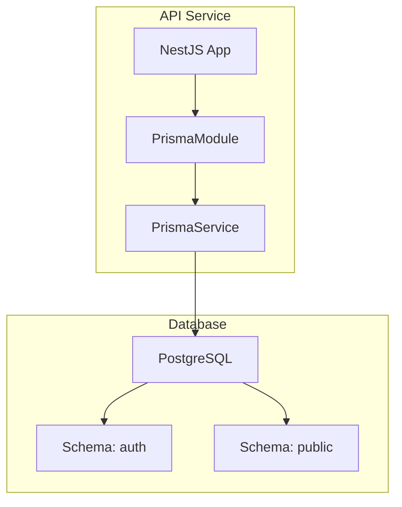
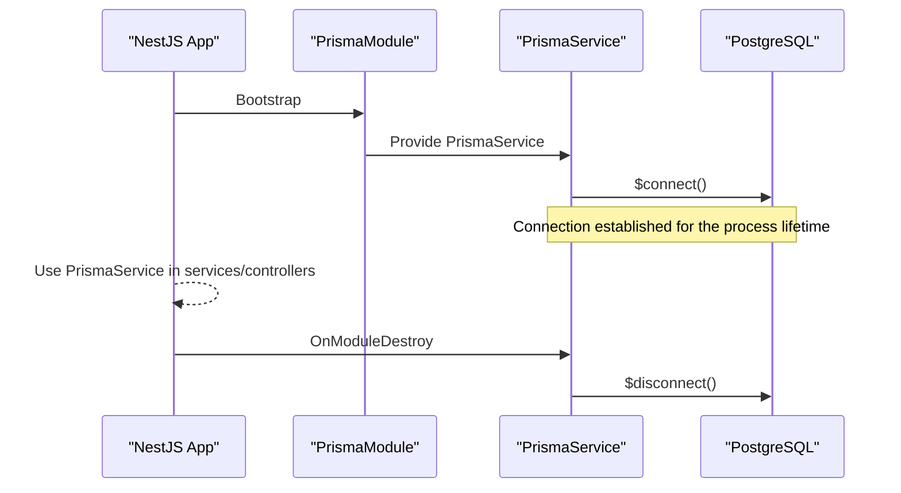
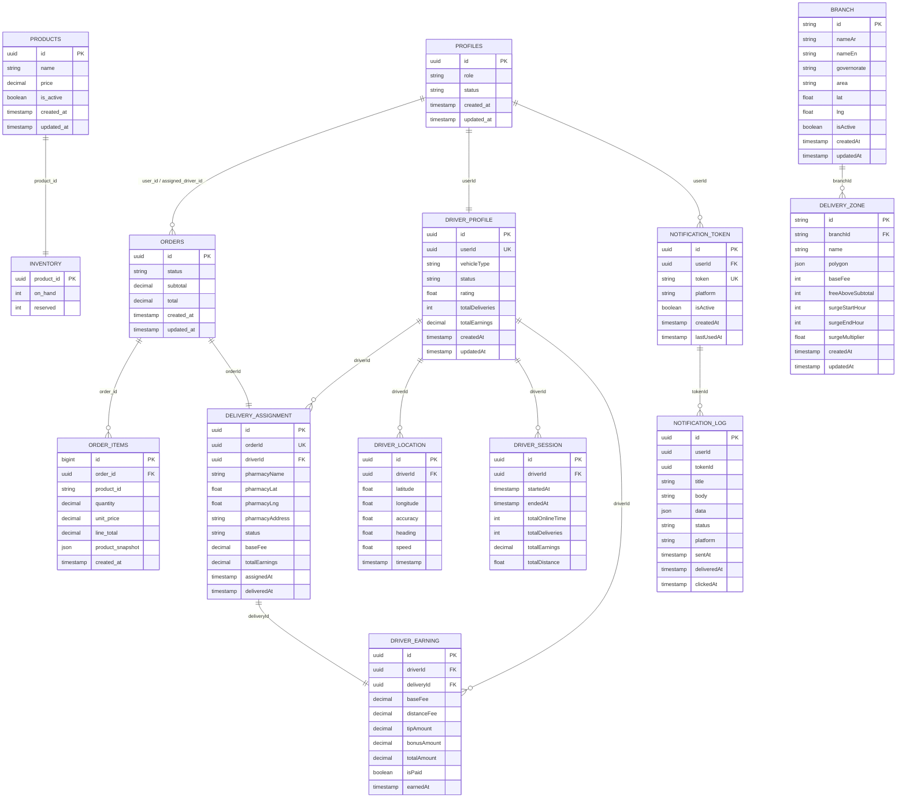
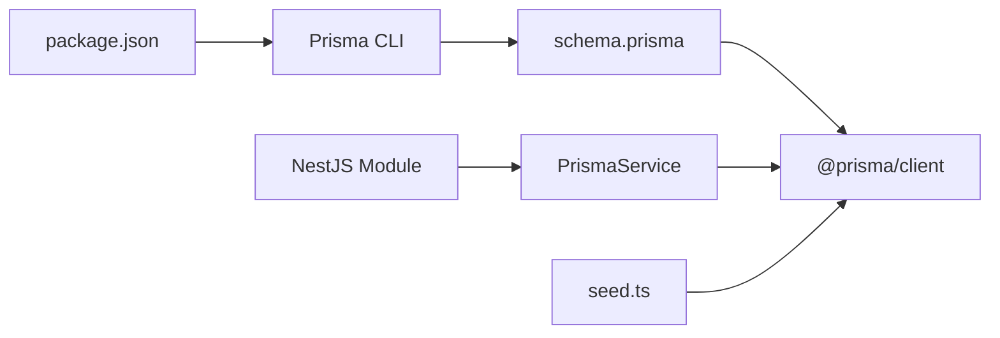
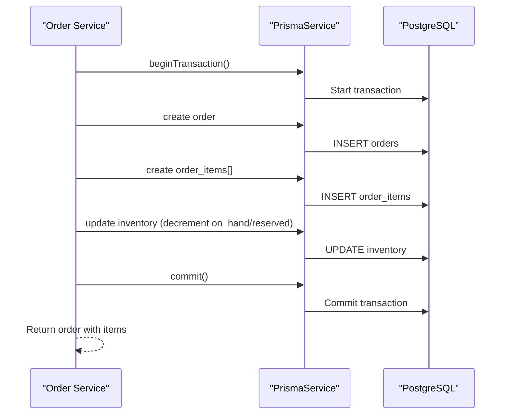
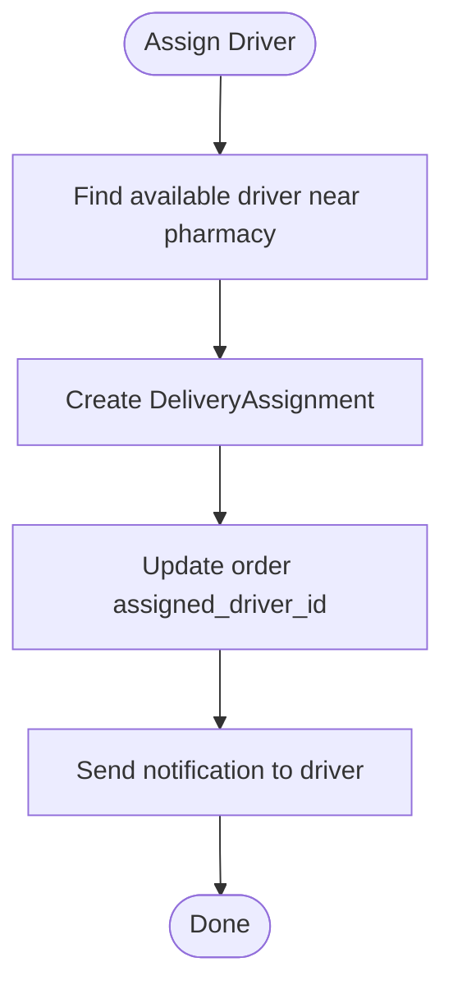

# Database Layer & Prisma ORM

<cite>
**Referenced Files in This Document**
- [schema.prisma](file://apps/api/prisma/schema.prisma)
- [prisma.service.ts](file://apps/api/src/prisma/prisma.service.ts)
- [prisma.module.ts](file://apps/api/src/prisma/prisma.module.ts)
- [seed.ts](file://apps/api/prisma/seed.ts)
- [migration.sql](file://apps/api/prisma/migrations/20260726042623_add_driver_tables/migration.sql)
- [performance_indexes.sql](file://database/performance_indexes.sql)
- [SUPABASE_INDEXES.sql](file://SUPABASE_INDEXES.sql)
</cite>

## Table of Contents
1. [Introduction](#introduction)
2. [Project Structure](#project-structure)
3. [Core Components](#core-components)
4. [Architecture Overview](#architecture-overview)
5. [Detailed Component Analysis](#detailed-component-analysis)
6. [Dependency Analysis](#dependency-analysis)
7. [Performance Considerations](#performance-considerations)
8. [Troubleshooting Guide](#troubleshooting-guide)
9. [Conclusion](#conclusion)
10. [Appendices](#appendices)

## Introduction
This document explains the database layer built with Prisma ORM for the API service. It covers schema design principles, entity relationships, data modeling patterns, migration strategy, seeding, and version control practices. It also details query optimization techniques, transaction handling, connection pooling configuration, complex queries, relationship management, validation strategies, performance considerations, indexing approaches, and maintenance procedures. The goal is to help developers write efficient Prisma queries and handle large datasets effectively.

## Project Structure
The database layer lives under the API application:
- Prisma schema defines models, enums, relations, and multi-schema support (auth and public).
- NestJS module exposes a global Prisma service that manages lifecycle and connections.
- Migrations are stored under apps/api/prisma/migrations.
- Seed scripts populate reference data such as branches and delivery zones.
- Additional SQL indexes and performance tuning scripts exist at the repository root and in the database folder.

**Diagram sources**
- [prisma.module.ts:1-11](file://apps/api/src/prisma/prisma.module.ts#L1-L11)
- [prisma.service.ts:1-15](file://apps/api/src/prisma/prisma.service.ts#L1-L15)
- [schema.prisma:1-11](file://apps/api/prisma/schema.prisma#L1-L11)

**Section sources**
- [schema.prisma:1-11](file://apps/api/prisma/schema.prisma#L1-L11)
- [prisma.module.ts:1-11](file://apps/api/src/prisma/prisma.module.ts#L1-L11)
- [prisma.service.ts:1-15](file://apps/api/src/prisma/prisma.service.ts#L1-L15)

## Core Components
- Prisma client configuration and multi-schema setup define how the app connects to PostgreSQL and which schemas are exposed.
- NestJS integration provides a globally available Prisma service with lifecycle hooks for connection and disconnection.
- Models cover core domains: users/auth, orders, products, inventory, profiles, drivers, deliveries, notifications, and delivery zones.
- Enums standardize statuses and roles across the system.

Key responsibilities:
- Schema.prisma: Central source of truth for types, relations, constraints, and indexes.
- PrismaService: Connects/disconnects on NestJS lifecycle events.
- PrismaModule: Exposes PrismaService globally to all modules.
- Seed script: Populates branches and delivery zones with distance-based pricing logic.

**Section sources**
- [schema.prisma:1-11](file://apps/api/prisma/schema.prisma#L1-L11)
- [schema.prisma:595-613](file://apps/api/prisma/schema.prisma#L595-L613)
- [schema.prisma:617-635](file://apps/api/prisma/schema.prisma#L617-L635)
- [schema.prisma:765-803](file://apps/api/prisma/schema.prisma#L765-L803)
- [schema.prisma:805-855](file://apps/api/prisma/schema.prisma#L805-L855)
- [schema.prisma:857-877](file://apps/api/prisma/schema.prisma#L857-L877)
- [schema.prisma:879-934](file://apps/api/prisma/schema.prisma#L879-L934)
- [schema.prisma:936-983](file://apps/api/prisma/schema.prisma#L936-L983)
- [schema.prisma:985-1036](file://apps/api/prisma/schema.prisma#L985-L1036)
- [schema.prisma:1038-1065](file://apps/api/prisma/schema.prisma#L1038-L1065)
- [prisma.service.ts:1-15](file://apps/api/src/prisma/prisma.service.ts#L1-L15)
- [prisma.module.ts:1-11](file://apps/api/src/prisma/prisma.module.ts#L1-L11)
- [seed.ts:1-177](file://apps/api/prisma/seed.ts#L1-L177)

## Architecture Overview
The API uses Prisma ORM over PostgreSQL with two schemas:
- auth: Identity and session management tables (users, sessions, OAuth, MFA, etc.).
- public: Application domain tables (profiles, orders, products, inventory, drivers, deliveries, notifications, delivery zones).

PrismaClient is instantiated once per process via NestJS lifecycle hooks, ensuring connection reuse and graceful shutdown.

**Diagram sources**
- [prisma.module.ts:1-11](file://apps/api/src/prisma/prisma.module.ts#L1-L11)
- [prisma.service.ts:1-15](file://apps/api/src/prisma/prisma.service.ts#L1-L15)
- [schema.prisma:1-11](file://apps/api/prisma/schema.prisma#L1-L11)

## Detailed Component Analysis

### Schema Design Principles
- Multi-schema separation:
  - auth schema isolates identity-related entities.
  - public schema holds business entities and application-specific data.
- Strong typing and constraints:
  - Primary keys, unique constraints, and foreign keys ensure referential integrity.
  - Enums model finite state spaces (e.g., order_status, driver_status, delivery_status).
- Indexing strategy:
  - Explicit indexes defined in Prisma for frequently queried fields and composite filters.
  - Additional GIN trigram and B-tree indexes provided by SQL scripts for search and filtering performance.
- Data modeling patterns:
  - One-to-one: DriverProfile to profiles via userId.
  - One-to-many: Orders to OrderItems; DriverProfile to DriverLocation, DeliveryAssignment, DriverSession, DriverEarning.
  - Many-to-one: DeliveryAssignment to Orders and DriverProfile.
  - Optional relations: Profiles to Orders via user_id and assigned_driver_id.

**Section sources**
- [schema.prisma:1-11](file://apps/api/prisma/schema.prisma#L1-L11)
- [schema.prisma:595-613](file://apps/api/prisma/schema.prisma#L595-L613)
- [schema.prisma:617-635](file://apps/api/prisma/schema.prisma#L617-L635)
- [schema.prisma:765-803](file://apps/api/prisma/schema.prisma#L765-L803)
- [schema.prisma:805-855](file://apps/api/prisma/schema.prisma#L805-L855)
- [schema.prisma:857-877](file://apps/api/prisma/schema.prisma#L857-L877)
- [schema.prisma:879-934](file://apps/api/prisma/schema.prisma#L879-L934)
- [schema.prisma:936-983](file://apps/api/prisma/schema.prisma#L936-L983)
- [schema.prisma:985-1036](file://apps/api/prisma/schema.prisma#L985-L1036)
- [schema.prisma:1038-1065](file://apps/api/prisma/schema.prisma#L1038-L1065)

### Entity Relationships

**Diagram sources**
- [schema.prisma:595-613](file://apps/api/prisma/schema.prisma#L595-L613)
- [schema.prisma:617-635](file://apps/api/prisma/schema.prisma#L617-L635)
- [schema.prisma:540-592](file://apps/api/prisma/schema.prisma#L540-L592)
- [schema.prisma:529-536](file://apps/api/prisma/schema.prisma#L529-L536)
- [schema.prisma:805-855](file://apps/api/prisma/schema.prisma#L805-L855)
- [schema.prisma:879-934](file://apps/api/prisma/schema.prisma#L879-L934)
- [schema.prisma:857-877](file://apps/api/prisma/schema.prisma#L857-L877)
- [schema.prisma:936-983](file://apps/api/prisma/schema.prisma#L936-L983)
- [schema.prisma:985-1036](file://apps/api/prisma/schema.prisma#L985-L1036)
- [schema.prisma:765-803](file://apps/api/prisma/schema.prisma#L765-L803)

### Migration Strategy
- Versioned migrations live under apps/api/prisma/migrations.
- The latest migration adds driver-related tables, enums, indexes, and foreign keys.
- Use Prisma CLI to generate and apply migrations consistently across environments.
- For Supabase-managed databases, additional SQL scripts can be applied via the SQL editor or CI pipelines.

Best practices:
- Keep migrations small and focused.
- Ensure backward compatibility when altering columns or adding constraints.
- Validate migrations locally before applying to production.

**Section sources**
- [migration.sql:1-244](file://apps/api/prisma/migrations/20260726042623_add_driver_tables/migration.sql#L1-L244)

### Database Seeding
- Seed script creates branches and concentric delivery zones based on distance tiers.
- Upserts branches and recreates zones per branch to maintain deterministic state.
- Uses geometric approximation to build polygons around branch coordinates.

Usage:
- Configure seed command in package.json prisma section.
- Run seed after migrations to initialize reference data.

**Section sources**
- [seed.ts:1-177](file://apps/api/prisma/seed.ts#L1-L177)
- [package.json:48-51](file://apps/api/package.json#L48-L51)

### Query Optimization Techniques
- Leverage Prisma’s relation loading to avoid N+1 queries:
  - Use include/select to fetch related data in a single query.
- Filter and sort using indexed fields:
  - Prefer queries that match existing indexes (status, timestamps, IDs).
- Use pagination:
  - Cursor-based or offset-based pagination to handle large result sets efficiently.
- Avoid selecting unnecessary fields:
  - Reduce payload size and memory usage by projecting only needed columns.

Examples of complex queries:
- Fetch orders with items and profile details using includes.
- Retrieve driver assignments filtered by status and date range with sorting.
- Aggregate earnings per driver grouped by time windows.

Relationship management:
- Create/update/delete operations respect foreign key constraints and cascade rules.
- Use transactions for multi-step writes to maintain consistency.

Data validation:
- Enforce constraints at the database level (unique, not null, check constraints).
- Apply application-level validation where necessary (e.g., Zod schemas in services).

**Section sources**
- [schema.prisma:540-592](file://apps/api/prisma/schema.prisma#L540-L592)
- [schema.prisma:879-934](file://apps/api/prisma/schema.prisma#L879-L934)
- [schema.prisma:936-983](file://apps/api/prisma/schema.prisma#L936-L983)

### Transaction Handling
- Wrap multi-step operations in transactions to ensure atomicity:
  - Begin transaction, perform writes, commit or rollback on error.
- Use Prisma’s transaction APIs to group related changes (e.g., creating an order and its items).
- Handle errors gracefully to prevent partial updates.

Connection pooling:
- Prisma maintains a connection pool per process.
- NestJS lifecycle ensures a single PrismaClient instance per process, optimizing connection reuse.
- Tune pool size if needed via environment variables or Prisma client options.

**Section sources**
- [prisma.service.ts:1-15](file://apps/api/src/prisma/prisma.service.ts#L1-L15)

### Indexing Strategies
- Prisma-defined indexes:
  - Composite and single-column indexes for frequent queries and sorting.
- Additional SQL indexes:
  - GIN trigram indexes for fuzzy search on product names and codes.
  - B-tree indexes for equality and range filters.
  - Partial indexes to optimize common query patterns.

Maintenance:
- Rebuild or recreate indexes concurrently to avoid downtime.
- Monitor index usage and remove unused indexes.

**Section sources**
- [schema.prisma:805-855](file://apps/api/prisma/schema.prisma#L805-L855)
- [schema.prisma:879-934](file://apps/api/prisma/schema.prisma#L879-L934)
- [SUPABASE_INDEXES.sql:1-109](file://SUPABASE_INDEXES.sql#L1-L109)
- [performance_indexes.sql:1-243](file://database/performance_indexes.sql#L1-L243)

### Performance Considerations
- Use appropriate indexes for search and filter patterns.
- Minimize data transfer by selecting only required fields.
- Implement caching at the application layer for read-heavy endpoints.
- Monitor slow queries and adjust indexes accordingly.
- Use EXPLAIN ANALYZE to validate query plans.

[No sources needed since this section provides general guidance]

### Database Maintenance Procedures
- Regularly analyze tables to update statistics.
- Archive or purge old data (e.g., location logs, notification logs) based on retention policies.
- Periodically review and rebuild indexes for optimal performance.
- Back up databases regularly and test restore procedures.

**Section sources**
- [performance_indexes.sql:178-215](file://database/performance_indexes.sql#L178-L215)

## Dependency Analysis
Prisma client depends on the configured datasource and schemas. NestJS modules depend on PrismaService for database access. Seed scripts depend on generated Prisma client types.

**Diagram sources**
- [package.json:48-51](file://apps/api/package.json#L48-L51)
- [schema.prisma:1-11](file://apps/api/prisma/schema.prisma#L1-L11)
- [prisma.module.ts:1-11](file://apps/api/src/prisma/prisma.module.ts#L1-L11)
- [prisma.service.ts:1-15](file://apps/api/src/prisma/prisma.service.ts#L1-L15)
- [seed.ts:1-177](file://apps/api/prisma/seed.ts#L1-L177)

**Section sources**
- [package.json:48-51](file://apps/api/package.json#L48-L51)
- [schema.prisma:1-11](file://apps/api/prisma/schema.prisma#L1-L11)
- [prisma.module.ts:1-11](file://apps/api/src/prisma/prisma.module.ts#L1-L11)
- [prisma.service.ts:1-15](file://apps/api/src/prisma/prisma.service.ts#L1-L15)
- [seed.ts:1-177](file://apps/api/prisma/seed.ts#L1-L177)

## Performance Considerations
- Prefer indexed fields in WHERE clauses and ORDER BY.
- Use includes to reduce round trips.
- Paginate large datasets and avoid deep nesting in responses.
- Monitor query execution plans and adjust indexes.
- Cache frequently accessed data at the application layer.

[No sources needed since this section provides general guidance]

## Troubleshooting Guide
Common issues and resolutions:
- Slow searches:
  - Ensure GIN trigram indexes are created for ilike queries.
  - Verify pg_trgm extension is enabled.
- High latency on order listings:
  - Check indexes on status and created_at.
  - Use cursor-based pagination.
- Driver assignment bottlenecks:
  - Confirm indexes on driverId and status.
  - Optimize queries to fetch only necessary fields.

Validation steps:
- Run EXPLAIN ANALYZE on slow queries.
- Inspect index usage stats and query plans.
- Review Prisma logs for generated SQL.

**Section sources**
- [SUPABASE_INDEXES.sql:1-109](file://SUPABASE_INDEXES.sql#L1-L109)
- [performance_indexes.sql:1-243](file://database/performance_indexes.sql#L1-L243)

## Conclusion
The database layer leverages Prisma ORM with a clear separation between identity and application data across multiple schemas. Strong typing, explicit constraints, and targeted indexing provide a robust foundation for scalable queries. Migrations and seeding ensure consistent state across environments. By following the recommended query patterns, transaction practices, and maintenance procedures, teams can maintain high performance and reliability even with large datasets.

[No sources needed since this section summarizes without analyzing specific files]

## Appendices

### Example Workflows

#### Creating an Order with Items and Inventory Update

**Diagram sources**
- [schema.prisma:540-592](file://apps/api/prisma/schema.prisma#L540-L592)
- [schema.prisma:529-536](file://apps/api/prisma/schema.prisma#L529-L536)

#### Assigning a Driver to an Order

**Diagram sources**
- [schema.prisma:879-934](file://apps/api/prisma/schema.prisma#L879-L934)
- [schema.prisma:595-613](file://apps/api/prisma/schema.prisma#L595-L613)