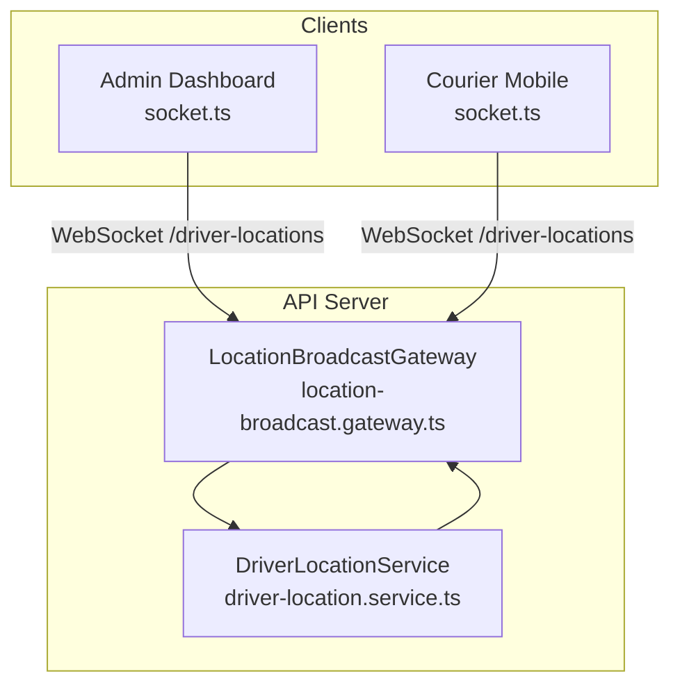
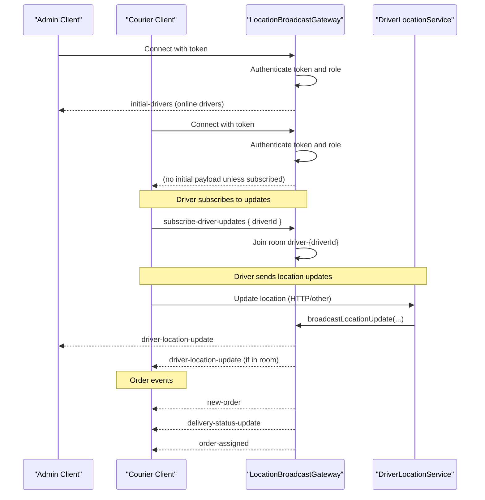
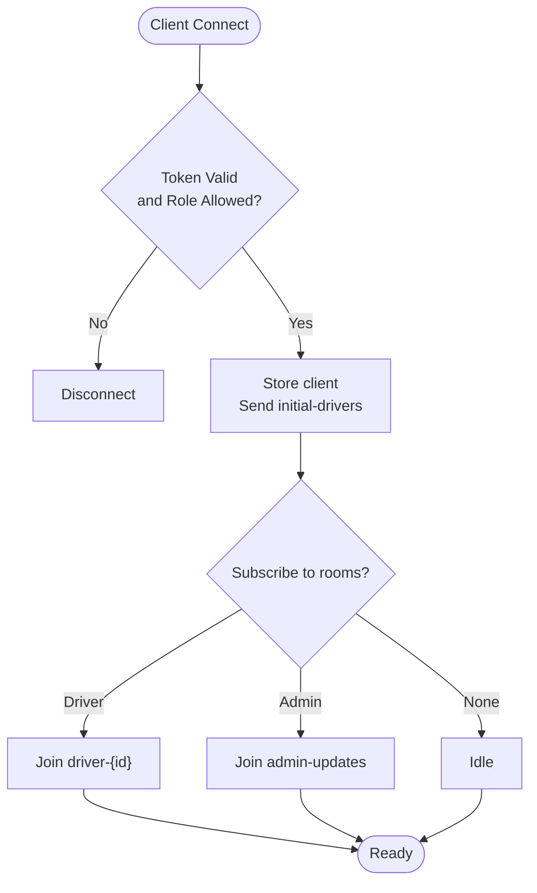
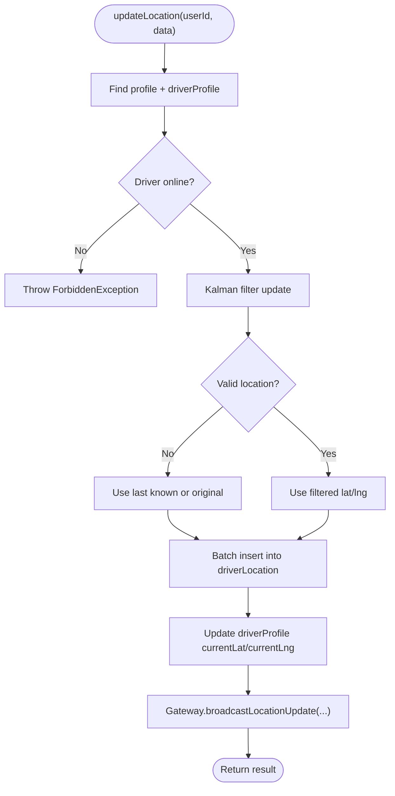
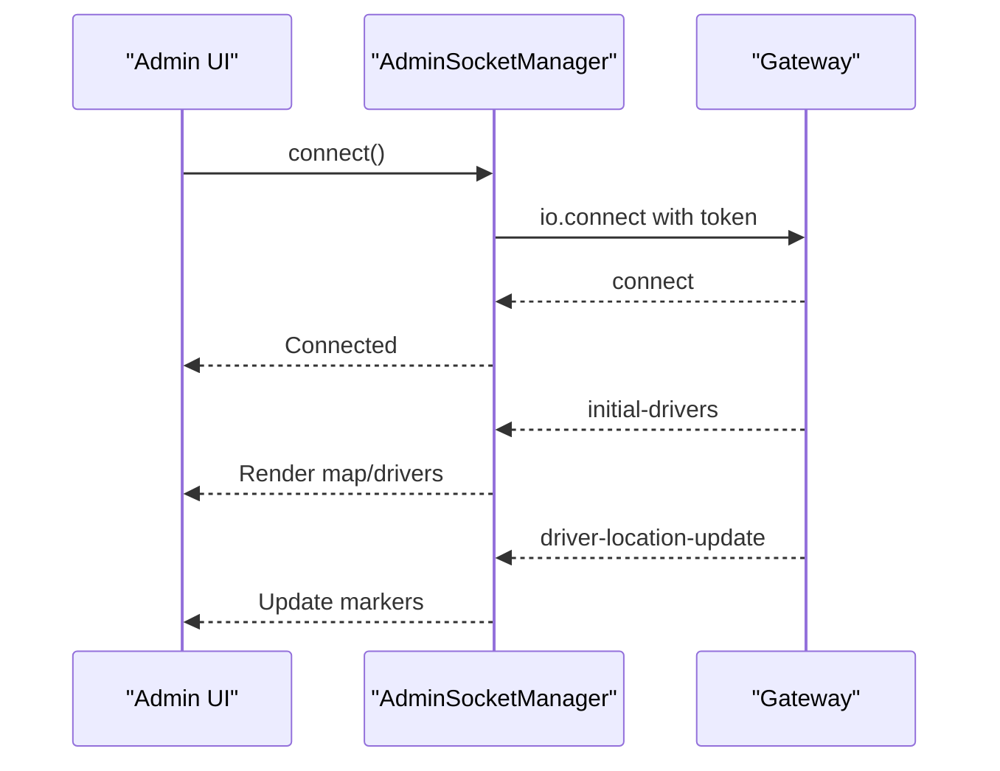
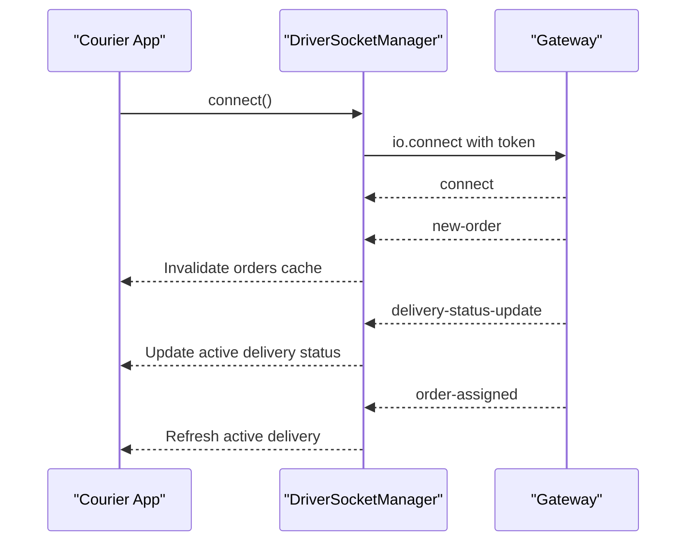
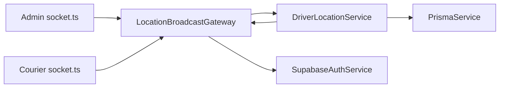

# Real-time Communication & WebSockets

<cite>
**Referenced Files in This Document**
- [location-broadcast.gateway.ts](file://apps/api/src/modules/driver/location-broadcast.gateway.ts)
- [driver-location.service.ts](file://apps/api/src/modules/driver/driver-location.service.ts)
- [socket.ts (Admin)](file://apps/admin/src/lib/socket.ts)
- [socket.ts (Courier Mobile)](file://apps/courier-mobile/src/lib/socket.ts)
</cite>

## Table of Contents
1. [Introduction](#introduction)
2. [Project Structure](#project-structure)
3. [Core Components](#core-components)
4. [Architecture Overview](#architecture-overview)
5. [Detailed Component Analysis](#detailed-component-analysis)
6. [Dependency Analysis](#dependency-analysis)
7. [Performance Considerations](#performance-considerations)
8. [Troubleshooting Guide](#troubleshooting-guide)
9. [Conclusion](#conclusion)
10. [Appendices](#appendices)

## Introduction
This document explains the real-time communication features built with Socket.io and WebSocket connections across the platform. It covers the gateway architecture, event-driven patterns, client-server synchronization, driver location broadcasting, notification delivery mechanisms, live order status updates, connection management, room-based messaging, error handling, scaling strategies, performance optimizations, security considerations, and debugging techniques.

## Project Structure
Real-time functionality spans server-side gateways and services alongside client-side socket managers:
- Server: A NestJS WebSocket gateway handles authentication, rooms, broadcasts, and integrates with a driver location service that persists and filters GPS data.
- Clients: Admin dashboard and courier mobile apps maintain persistent WebSocket connections, subscribe to events, and update UI state or query caches on incoming messages.

**Diagram sources**
- [location-broadcast.gateway.ts:27-40](file://apps/api/src/modules/driver/location-broadcast.gateway.ts#L27-L40)
- [driver-location.service.ts:18-25](file://apps/api/src/modules/driver/driver-location.service.ts#L18-L25)
- [socket.ts (Admin):10-20](file://apps/admin/src/lib/socket.ts#L10-L20)
- [socket.ts (Courier Mobile):24-36](file://apps/courier-mobile/src/lib/socket.ts#L24-L36)

**Section sources**
- [location-broadcast.gateway.ts:27-40](file://apps/api/src/modules/driver/location-broadcast.gateway.ts#L27-L40)
- [driver-location.service.ts:18-25](file://apps/api/src/modules/driver/driver-location.service.ts#L18-L25)
- [socket.ts (Admin):10-20](file://apps/admin/src/lib/socket.ts#L10-L20)
- [socket.ts (Courier Mobile):24-36](file://apps/courier-mobile/src/lib/socket.ts#L24-L36)

## Core Components
- LocationBroadcastGateway: Manages WebSocket connections under the /driver-locations namespace, authenticates clients, maintains rooms for targeted messaging, and emits real-time events such as driver location updates and status changes.
- DriverLocationService: Processes driver location updates with GPS filtering, batches database writes, updates current driver positions, and triggers broadcasts via the gateway.
- AdminSocketManager: Client-side manager for the admin dashboard that connects to the gateway, reattaches listeners on reconnect, and listens for driver-related events.
- DriverSocketManager: Client-side manager for the courier mobile app that connects, listens for new orders, delivery status updates, and order assignments, and invalidates relevant queries.

Key responsibilities:
- Authentication and authorization at connection time.
- Room-based messaging for drivers and admins.
- Broadcasting driver locations and status changes.
- Handling disconnections and reconnection logic on clients.
- Integrating with persistence and background processing for location history.

**Section sources**
- [location-broadcast.gateway.ts:58-118](file://apps/api/src/modules/driver/location-broadcast.gateway.ts#L58-L118)
- [driver-location.service.ts:30-127](file://apps/api/src/modules/driver/driver-location.service.ts#L30-L127)
- [socket.ts (Admin):6-57](file://apps/admin/src/lib/socket.ts#L6-L57)
- [socket.ts (Courier Mobile):18-83](file://apps/courier-mobile/src/lib/socket.ts#L18-L83)

## Architecture Overview
The system uses an event-driven architecture centered around a single WebSocket gateway namespace for driver locations. Clients authenticate on connect, join rooms for targeted messaging, and receive real-time updates. The driver location service coordinates GPS filtering, batching, and persistence while triggering broadcasts through the gateway.

**Diagram sources**
- [location-broadcast.gateway.ts:61-93](file://apps/api/src/modules/driver/location-broadcast.gateway.ts#L61-L93)
- [location-broadcast.gateway.ts:148-167](file://apps/api/src/modules/driver/location-broadcast.gateway.ts#L148-L167)
- [location-broadcast.gateway.ts:124-143](file://apps/api/src/modules/driver/location-broadcast.gateway.ts#L124-L143)
- [driver-location.service.ts:100-113](file://apps/api/src/modules/driver/driver-location.service.ts#L100-L113)
- [socket.ts (Courier Mobile):51-68](file://apps/courier-mobile/src/lib/socket.ts#L51-L68)

## Detailed Component Analysis

### Gateway: Connection Management and Rooms
- Namespace: /driver-locations with CORS configured for multiple origins.
- Authentication: Reads token from handshake auth or Authorization header; validates role for admin/manager access.
- Rooms: 
  - Per-driver rooms via driver-{driverId} for targeted messaging.
  - Shared admin-updates room for admin dashboards.
- Events:
  - Initial data: Sends online drivers to newly connected clients.
  - Broadcasts: driver-location-update, driver-status-change.
  - Subscriptions: subscribe-driver-updates, subscribe-admin-updates, unsubscribe.
- Utilities: sendToDriver, sendToAdmins, broadcast, getStats.

**Diagram sources**
- [location-broadcast.gateway.ts:61-93](file://apps/api/src/modules/driver/location-broadcast.gateway.ts#L61-L93)
- [location-broadcast.gateway.ts:148-167](file://apps/api/src/modules/driver/location-broadcast.gateway.ts#L148-L167)

**Section sources**
- [location-broadcast.gateway.ts:27-40](file://apps/api/src/modules/driver/location-broadcast.gateway.ts#L27-L40)
- [location-broadcast.gateway.ts:58-118](file://apps/api/src/modules/driver/location-broadcast.gateway.ts#L58-L118)
- [location-broadcast.gateway.ts:148-195](file://apps/api/src/modules/driver/location-broadcast.gateway.ts#L148-L195)

### Service: Driver Location Processing and Broadcasting
- Input validation and profile lookup; ensures driver is online before accepting updates.
- GPS filtering using Kalman filter to reject invalid or impossible movements; returns filtered or fallback position.
- Batching location history writes to reduce DB load; periodic flush and cleanup on module destroy.
- Updates current driver position immediately and triggers real-time broadcast via gateway.
- Provides methods to retrieve current location, history, and all online drivers for admin views.

**Diagram sources**
- [driver-location.service.ts:30-127](file://apps/api/src/modules/driver/driver-location.service.ts#L30-L127)
- [driver-location.service.ts:268-318](file://apps/api/src/modules/driver/driver-location.service.ts#L268-L318)

**Section sources**
- [driver-location.service.ts:30-127](file://apps/api/src/modules/driver/driver-location.service.ts#L30-L127)
- [driver-location.service.ts:186-221](file://apps/api/src/modules/driver/driver-location.service.ts#L186-L221)
- [driver-location.service.ts:268-318](file://apps/api/src/modules/driver/driver-location.service.ts#L268-L318)

### Admin Client: Socket Manager
- Connects to /driver-locations with token and WebSocket transport only.
- Reconnection enabled with exponential backoff caps.
- Maintains listener registry to reattach after reconnect.
- Exposes on/off/disconnect/isConnected helpers.

**Diagram sources**
- [socket.ts (Admin):10-36](file://apps/admin/src/lib/socket.ts#L10-L36)
- [socket.ts (Admin):38-57](file://apps/admin/src/lib/socket.ts#L38-L57)

**Section sources**
- [socket.ts (Admin):6-57](file://apps/admin/src/lib/socket.ts#L6-L57)

### Courier Mobile Client: Socket Manager
- Connects to base URL with token and WebSocket transport only.
- Handles connect, disconnect, and connect_error events.
- Listens for:
  - new-order: invalidates available orders cache.
  - delivery-status-update: updates active delivery status and refreshes delivery cache.
  - order-assigned: refreshes active delivery cache.
- Disconnects cleanly and resets reconnect attempts.

**Diagram sources**
- [socket.ts (Courier Mobile):24-68](file://apps/courier-mobile/src/lib/socket.ts#L24-L68)

**Section sources**
- [socket.ts (Courier Mobile):18-83](file://apps/courier-mobile/src/lib/socket.ts#L18-L83)

## Dependency Analysis
- Gateway depends on:
  - SupabaseAuthService for token validation and role checks.
  - DriverLocationService for fetching online drivers and triggering broadcasts.
- DriverLocationService depends on:
  - PrismaService for persistence.
  - LocationBroadcastGateway to emit real-time events.
- Clients depend on:
  - Token stores for authentication context.
  - Query clients or local stores to react to events.

**Diagram sources**
- [location-broadcast.gateway.ts:52-56](file://apps/api/src/modules/driver/location-broadcast.gateway.ts#L52-L56)
- [driver-location.service.ts:18-25](file://apps/api/src/modules/driver/driver-location.service.ts#L18-L25)
- [socket.ts (Admin):10-20](file://apps/admin/src/lib/socket.ts#L10-L20)
- [socket.ts (Courier Mobile):24-36](file://apps/courier-mobile/src/lib/socket.ts#L24-L36)

**Section sources**
- [location-broadcast.gateway.ts:52-56](file://apps/api/src/modules/driver/location-broadcast.gateway.ts#L52-L56)
- [driver-location.service.ts:18-25](file://apps/api/src/modules/driver/driver-location.service.ts#L18-L25)

## Performance Considerations
- GPS Filtering: Kalman filter reduces noise and prevents invalid spikes from being persisted or broadcasted.
- Batched Writes: Location history is batched by driver and flushed periodically or when thresholds are reached, reducing DB write overhead.
- Transport Selection: Clients explicitly use WebSocket transport to minimize overhead and ensure low-latency communication.
- Room-Based Messaging: Targeted emissions via rooms limit unnecessary message fan-out.
- Reconnection Strategy: Configured delays and max attempts balance reliability and resource usage.

[No sources needed since this section provides general guidance]

## Troubleshooting Guide
Common issues and diagnostics:
- Authentication failures:
  - Ensure token is present in handshake.auth or Authorization header.
  - Verify roles allow access (admin/manager).
- No initial data:
  - Confirm gateway sends initial-drivers upon successful connection.
- Missing location updates:
  - Check driver is online and has valid GPS data.
  - Validate that service calls updateLocation successfully and trigger broadcast.
- Client not receiving events:
  - Ensure proper subscriptions (subscribe-driver-updates, subscribe-admin-updates).
  - Verify rooms are joined correctly.
- Disconnections:
  - Inspect connect_error and disconnect reasons on clients.
  - Confirm reconnection logic reattaches listeners.

Operational tips:
- Use getStats to monitor connection counts and room sizes.
- Log warnings for rejected tokens and non-admin sockets.
- On mobile, handle network changes and gracefully reconnect.

**Section sources**
- [location-broadcast.gateway.ts:61-81](file://apps/api/src/modules/driver/location-broadcast.gateway.ts#L61-L81)
- [location-broadcast.gateway.ts:207-213](file://apps/api/src/modules/driver/location-broadcast.gateway.ts#L207-L213)
- [socket.ts (Courier Mobile):43-49](file://apps/courier-mobile/src/lib/socket.ts#L43-L49)
- [socket.ts (Admin):22-28](file://apps/admin/src/lib/socket.ts#L22-L28)

## Conclusion
The real-time layer leverages a focused WebSocket gateway and a robust driver location service to deliver live updates efficiently. Clients manage connections and reactions to events, ensuring responsive experiences for both admin dashboards and courier mobile apps. With room-based messaging, authentication, filtering, and batching, the system balances performance and reliability while remaining extensible for additional real-time features.

[No sources needed since this section summarizes without analyzing specific files]

## Appendices

### Security Considerations for WebSocket Connections
- Enforce token-based authentication at connection time.
- Restrict roles for sensitive namespaces or endpoints.
- Validate and sanitize all incoming payloads.
- Configure CORS to allow only trusted origins.
- Use HTTPS/WSS in production and enforce secure transports.

[No sources needed since this section provides general guidance]

### Scaling Real-time Services
- Horizontal scaling behind a reverse proxy that supports sticky sessions or shared adapter if needed.
- Offload heavy computations (e.g., GPS filtering) to background workers if necessary.
- Monitor memory and CPU usage; tune batch sizes and intervals based on traffic.
- Implement graceful shutdowns to process pending batches and close connections cleanly.

[No sources needed since this section provides general guidance]

### Debugging Techniques
- Enable detailed logs on gateway and service for connection lifecycle and errors.
- Use client-side logs for connect, disconnect, and event receipts.
- Inspect rooms and stats via gateway utilities.
- Reproduce issues with minimal clients and controlled payloads.

[No sources needed since this section provides general guidance]