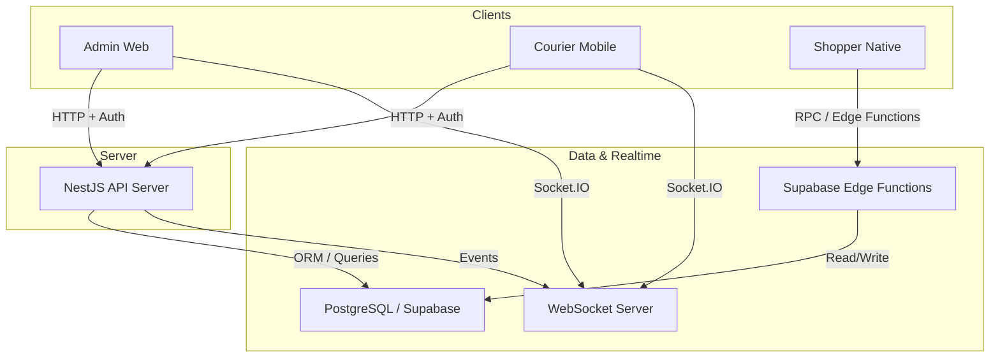
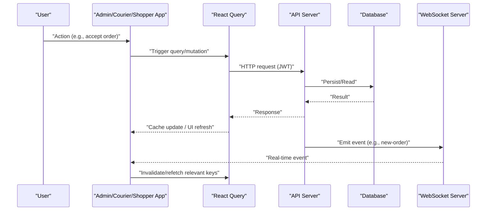
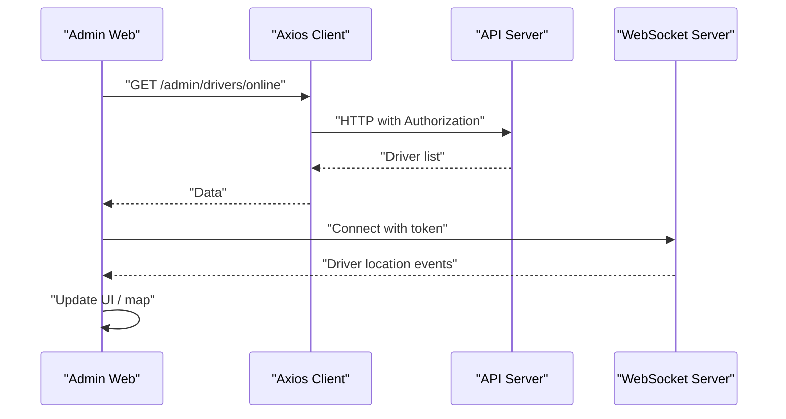
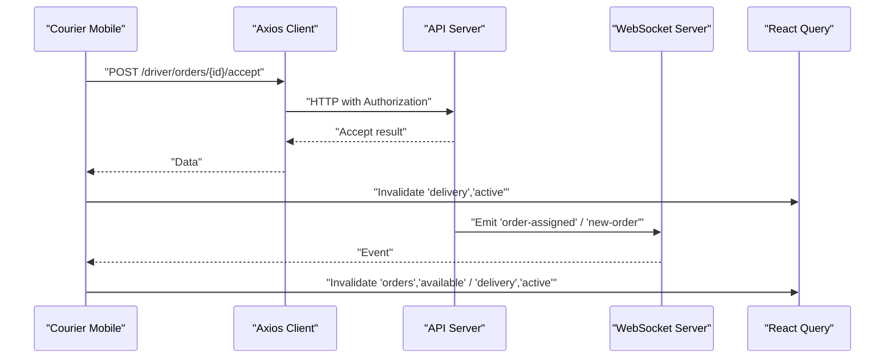
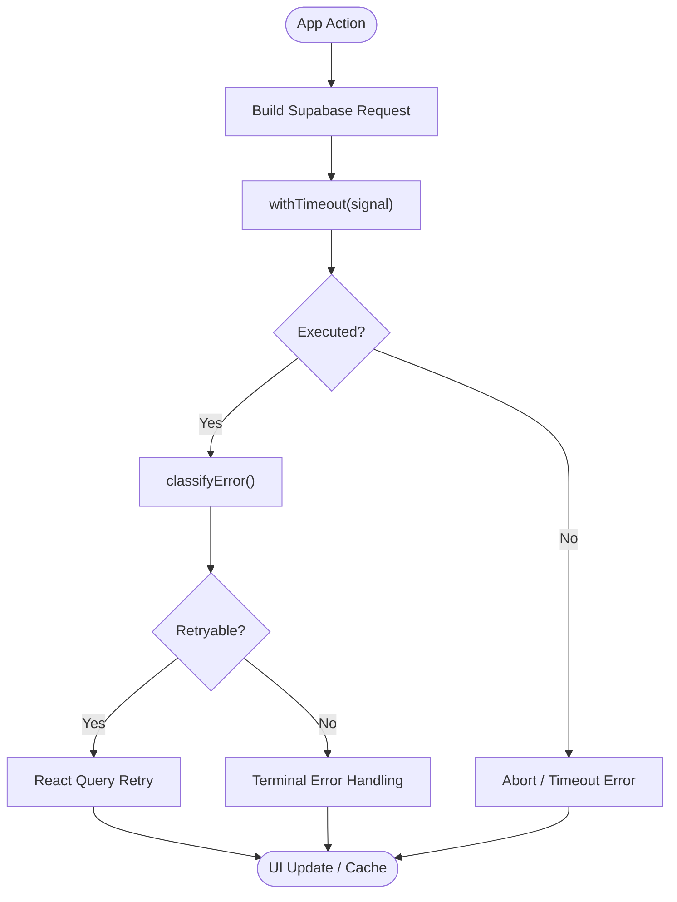
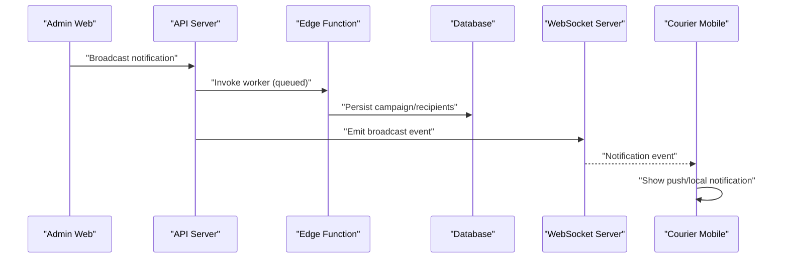
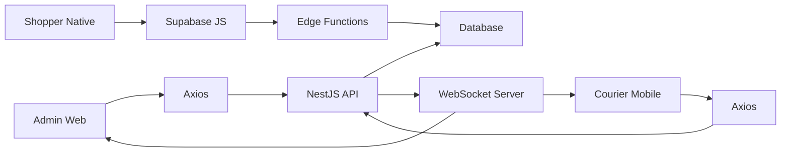

# Data Flow & State Management

<cite>
**Referenced Files in This Document**
- [apps/api/src/main.ts](file://apps/api/src/main.ts)
- [apps/admin/src/lib/api.ts](file://apps/admin/src/lib/api.ts)
- [apps/admin/src/lib/socket.ts](file://apps/admin/src/lib/socket.ts)
- [apps/courier-mobile/src/lib/api.ts](file://apps/courier-mobile/src/lib/api.ts)
- [apps/courier-mobile/src/lib/socket.ts](file://apps/courier-mobile/src/lib/socket.ts)
- [apps/courier-mobile/src/lib/queryClient.ts](file://apps/courier-mobile/src/lib/queryClient.ts)
- [apps/shopper-native/src/lib/queryClient.ts](file://apps/shopper-native/src/lib/queryClient.ts)
- [apps/shopper-native/src/lib/supabaseRequest.ts](file://apps/shopper-native/src/lib/supabaseRequest.ts)
</cite>

## Table of Contents
1. Introduction
2. Project Structure
3. Core Components
4. Architecture Overview
5. Detailed Component Analysis
6. Dependency Analysis
7. Performance Considerations
8. Troubleshooting Guide
9. Conclusion

## Introduction
This document explains how data flows through the system from user interactions to API calls, database operations, and real-time broadcasts. It covers client-server communication patterns, WebSocket-based updates, state synchronization across multiple applications (Admin Web, Courier Mobile, Shopper Native), caching strategies with React Query, optimistic updates, conflict resolution, event-driven cross-service communication, message queuing via Supabase Edge Functions, and offline persistence strategies.

## Project Structure
The system is composed of:
- A NestJS API server that exposes REST endpoints and serves as the central integration point for business logic and database access.
- Multiple client applications:
  - Admin Web: manages drivers, orders, inventory, products, customers, and notifications; uses HTTP and WebSockets for live driver location tracking.
  - Courier Mobile: handles driver workflows (orders, status transitions, location updates); uses HTTP, WebSockets, and React Query with offline-first persistence.
  - Shopper Native: customer-facing mobile app using Supabase RPCs/Edge Functions with robust retry policies and error classification.

**Diagram sources**
- [apps/api/src/main.ts:7-35](file://apps/api/src/main.ts#L7-L35)
- [apps/admin/src/lib/socket.ts:10-20](file://apps/admin/src/lib/socket.ts#L10-L20)
- [apps/courier-mobile/src/lib/socket.ts:24-36](file://apps/courier-mobile/src/lib/socket.ts#L24-L36)
- [apps/shopper-native/src/lib/queryClient.ts:32-55](file://apps/shopper-native/src/lib/queryClient.ts#L32-L55)

**Section sources**
- [apps/api/src/main.ts:7-35](file://apps/api/src/main.ts#L7-L35)

## Core Components
- API Server: Initializes CORS, global interceptors/filters, and listens on a configurable port.
- Admin Client: Axios-based HTTP client with auth interceptor; Socket.IO manager for driver locations; typed admin API helpers.
- Courier Mobile Client: Axios-based HTTP client with auth interceptor; Socket.IO manager for order events; React Query configured for offline-first with AsyncStorage persister.
- Shopper Native Client: Supabase request wrapper with timeouts, abort handling, and error classification; React Query tuned for mobile with online/offline modes and retry policies.

Key responsibilities:
- Authentication propagation via Authorization headers.
- Real-time updates via Socket.IO events (driver locations, order assignments, delivery status).
- Caching and retries via React Query with platform-specific tuning.
- Offline persistence for mutations and queries where applicable.

**Section sources**
- [apps/api/src/main.ts:7-35](file://apps/api/src/main.ts#L7-L35)
- [apps/admin/src/lib/api.ts:12-28](file://apps/admin/src/lib/api.ts#L12-L28)
- [apps/admin/src/lib/socket.ts:10-20](file://apps/admin/src/lib/socket.ts#L10-L20)
- [apps/courier-mobile/src/lib/api.ts:24-43](file://apps/courier-mobile/src/lib/api.ts#L24-L43)
- [apps/courier-mobile/src/lib/socket.ts:24-69](file://apps/courier-mobile/src/lib/socket.ts#L24-L69)
- [apps/courier-mobile/src/lib/queryClient.ts:5-20](file://apps/courier-mobile/src/lib/queryClient.ts#L5-L20)
- [apps/shopper-native/src/lib/queryClient.ts:32-55](file://apps/shopper-native/src/lib/queryClient.ts#L32-L55)
- [apps/shopper-native/src/lib/supabaseRequest.ts:59-97](file://apps/shopper-native/src/lib/supabaseRequest.ts#L59-L97)

## Architecture Overview
End-to-end flow highlights:
- User actions trigger HTTP requests or Supabase RPCs/Edge Functions.
- Requests are authenticated via JWT attached by client interceptors.
- The API processes business logic and persists changes to the database.
- Real-time updates are broadcast via WebSocket events to subscribed clients.
- Clients use React Query to cache, deduplicate, and refetch data; offline-first strategies queue mutations when disconnected.

**Diagram sources**
- [apps/courier-mobile/src/lib/socket.ts:51-68](file://apps/courier-mobile/src/lib/socket.ts#L51-L68)
- [apps/courier-mobile/src/lib/queryClient.ts:5-20](file://apps/courier-mobile/src/lib/queryClient.ts#L5-L20)
- [apps/api/src/main.ts:7-35](file://apps/api/src/main.ts#L7-L35)

## Detailed Component Analysis

### Admin Web: HTTP + WebSocket Data Flow
- HTTP: Axios client attaches Bearer token via interceptor; typed helpers wrap endpoints for drivers, orders, inventory, products, customers, and notifications.
- WebSocket: Socket.IO connects to the API’s driver-locations namespace with token auth; reconnection is enabled with exponential backoff; listeners are reattached after reconnect.
- Real-time: Admin subscribes to driver location events to render live maps and statuses.

**Diagram sources**
- [apps/admin/src/lib/api.ts:33-89](file://apps/admin/src/lib/api.ts#L33-L89)
- [apps/admin/src/lib/socket.ts:10-20](file://apps/admin/src/lib/socket.ts#L10-L20)

**Section sources**
- [apps/admin/src/lib/api.ts:12-28](file://apps/admin/src/lib/api.ts#L12-L28)
- [apps/admin/src/lib/api.ts:33-89](file://apps/admin/src/lib/api.ts#L33-L89)
- [apps/admin/src/lib/socket.ts:10-20](file://apps/admin/src/lib/socket.ts#L10-L20)

### Courier Mobile: Orders, Status Updates, and Location
- HTTP: Axios client attaches JWT; typed helpers cover authentication, profile, status, location, orders lifecycle, and document uploads.
- WebSocket: Connects with token; invalidates React Query keys on new-order, order-assigned, and delivery-status-update events; updates local store for active delivery.
- Caching: React Query configured with staleTime, gcTime, retry policy, and offlineFirst networkMode; persisted to AsyncStorage for resilience.

**Diagram sources**
- [apps/courier-mobile/src/lib/api.ts:75-132](file://apps/courier-mobile/src/lib/api.ts#L75-L132)
- [apps/courier-mobile/src/lib/socket.ts:51-68](file://apps/courier-mobile/src/lib/socket.ts#L51-L68)
- [apps/courier-mobile/src/lib/queryClient.ts:5-20](file://apps/courier-mobile/src/lib/queryClient.ts#L5-L20)

**Section sources**
- [apps/courier-mobile/src/lib/api.ts:24-43](file://apps/courier-mobile/src/lib/api.ts#L24-L43)
- [apps/courier-mobile/src/lib/api.ts:75-132](file://apps/courier-mobile/src/lib/api.ts#L75-L132)
- [apps/courier-mobile/src/lib/socket.ts:24-69](file://apps/courier-mobile/src/lib/socket.ts#L24-L69)
- [apps/courier-mobile/src/lib/queryClient.ts:5-20](file://apps/courier-mobile/src/lib/queryClient.ts#L5-L20)

### Shopper Native: Supabase RPCs, Edge Functions, and Resilient Caching
- Request layer: Wraps Supabase builders with timeout and abort support; classifies errors into transient/terminal/timeout/aborted/offline to drive retry decisions.
- Caching: React Query tuned for mobile with longer gcTime, selective refetch behavior, and online/offline modes; mutations queued offline-first.
- Cross-service: Uses Supabase Edge Functions for background tasks (e.g., SMS campaigns, notifications) while maintaining strong error handling and auditability.

**Diagram sources**
- [apps/shopper-native/src/lib/supabaseRequest.ts:59-97](file://apps/shopper-native/src/lib/supabaseRequest.ts#L59-L97)
- [apps/shopper-native/src/lib/supabaseRequest.ts:103-131](file://apps/shopper-native/src/lib/supabaseRequest.ts#L103-L131)
- [apps/shopper-native/src/lib/queryClient.ts:32-55](file://apps/shopper-native/src/lib/queryClient.ts#L32-L55)

**Section sources**
- [apps/shopper-native/src/lib/supabaseRequest.ts:59-97](file://apps/shopper-native/src/lib/supabaseRequest.ts#L59-L97)
- [apps/shopper-native/src/lib/supabaseRequest.ts:103-131](file://apps/shopper-native/src/lib/supabaseRequest.ts#L103-L131)
- [apps/shopper-native/src/lib/queryClient.ts:32-55](file://apps/shopper-native/src/lib/queryClient.ts#L32-L55)

### Event-Driven Architecture and Message Queuing
- Events: The API emits WebSocket events for order lifecycle changes and driver locations; clients invalidate React Query keys upon receiving events to keep UI consistent.
- Queuing: Supabase Edge Functions handle asynchronous workloads (e.g., SMS campaign batches, notifications) invoked by clients or internal processes; results are persisted and audited.

**Diagram sources**
- [apps/admin/src/lib/api.ts:71-89](file://apps/admin/src/lib/api.ts#L71-L89)

**Section sources**
- [apps/admin/src/lib/api.ts:71-89](file://apps/admin/src/lib/api.ts#L71-L89)

## Dependency Analysis
- Client dependencies:
  - Admin and Courier apps depend on Axios for HTTP and Socket.IO for real-time.
  - Shopper Native depends on Supabase JS client and Edge Functions.
- Server dependencies:
  - NestJS application wires CORS, global interceptors/filters, and listens on a port.
- Data dependencies:
  - Database accessed via ORM or direct SQL migrations; Supabase used for RPCs and Edge Functions.

**Diagram sources**
- [apps/api/src/main.ts:7-35](file://apps/api/src/main.ts#L7-L35)
- [apps/admin/src/lib/api.ts:12-28](file://apps/admin/src/lib/api.ts#L12-L28)
- [apps/courier-mobile/src/lib/api.ts:24-43](file://apps/courier-mobile/src/lib/api.ts#L24-L43)
- [apps/shopper-native/src/lib/queryClient.ts:32-55](file://apps/shopper-native/src/lib/queryClient.ts#L32-L55)

**Section sources**
- [apps/api/src/main.ts:7-35](file://apps/api/src/main.ts#L7-L35)

## Performance Considerations
- Caching:
  - Courier Mobile: 5-minute stale time, 1-hour garbage collection, offline-first network mode, persisted cache to AsyncStorage.
  - Shopper Native: 5-minute stale time, 24-hour garbage collection, online network mode for queries, offline-first for mutations; refetch on reconnect.
- Retries:
  - Exponential backoff capped per platform; terminal errors (4xx, specific PostgREST codes) do not retry.
- Timeouts:
  - Shopper Native enforces hard timeouts on Supabase requests to avoid indefinite hangs.
- Real-time:
  - WebSocket reconnection with bounded delays reduces churn during network instability.

[No sources needed since this section provides general guidance]

## Troubleshooting Guide
Common issues and resolutions:
- Authentication failures:
  - 401 responses clear tokens and redirect/log out on Admin and Courier clients.
- Network instability:
  - Use WebSocket reconnection and React Query retry policies; ensure offline-first mutation queues.
- Supabase request hangs:
  - Ensure withTimeout is used; check classifyError to avoid retrying terminal errors.
- Real-time disconnects:
  - Verify socket connection and reattach listeners; check server-side event emission.

**Section sources**
- [apps/admin/src/lib/api.ts:20-28](file://apps/admin/src/lib/api.ts#L20-L28)
- [apps/courier-mobile/src/lib/api.ts:34-43](file://apps/courier-mobile/src/lib/api.ts#L34-L43)
- [apps/courier-mobile/src/lib/socket.ts:43-49](file://apps/courier-mobile/src/lib/socket.ts#L43-L49)
- [apps/shopper-native/src/lib/supabaseRequest.ts:59-97](file://apps/shopper-native/src/lib/supabaseRequest.ts#L59-L97)
- [apps/shopper-native/src/lib/supabaseRequest.ts:103-131](file://apps/shopper-native/src/lib/supabaseRequest.ts#L103-L131)

## Conclusion
The system combines robust HTTP APIs, real-time WebSocket updates, and resilient caching with React Query to deliver consistent, responsive experiences across Admin, Courier, and Shopper apps. Error classification, timeouts, and offline-first strategies ensure reliability under varying network conditions. Event-driven patterns and Edge Functions enable scalable background processing and cross-service communication.

[No sources needed since this section summarizes without analyzing specific files]