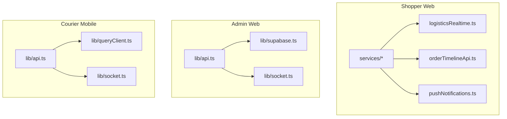
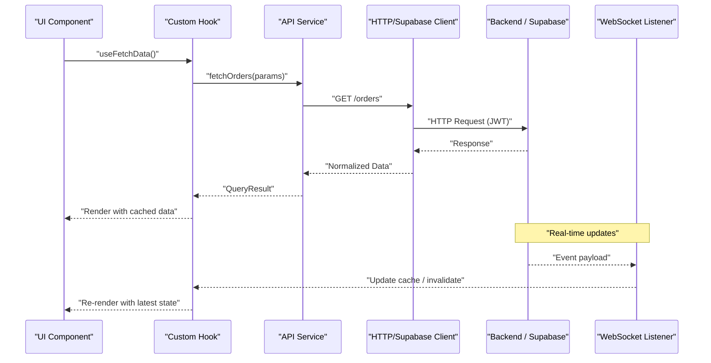
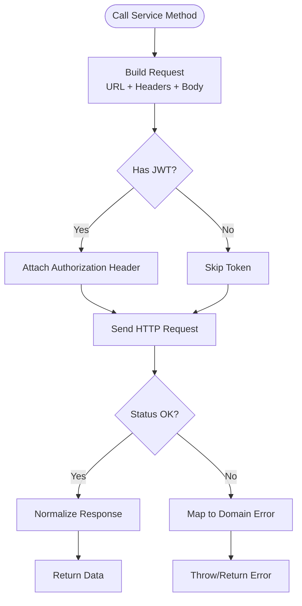
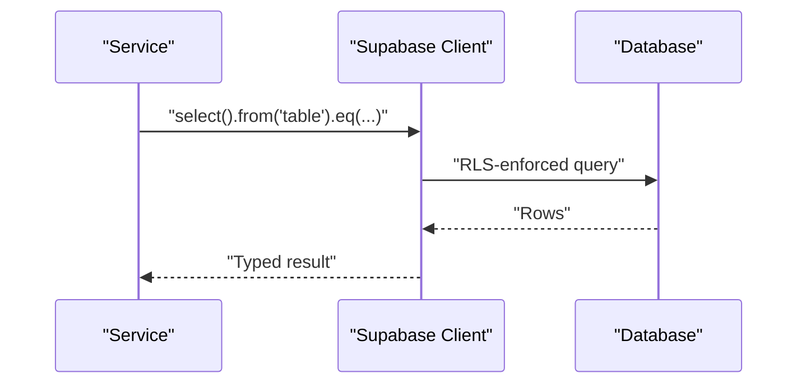
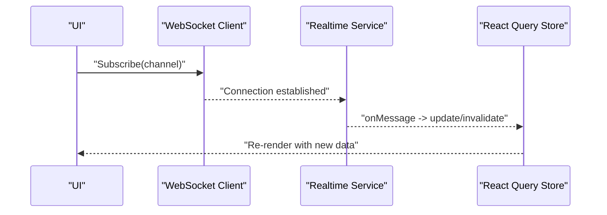
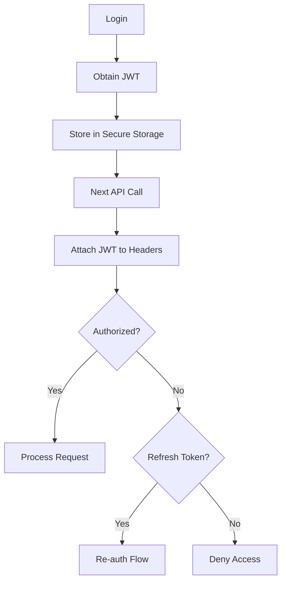
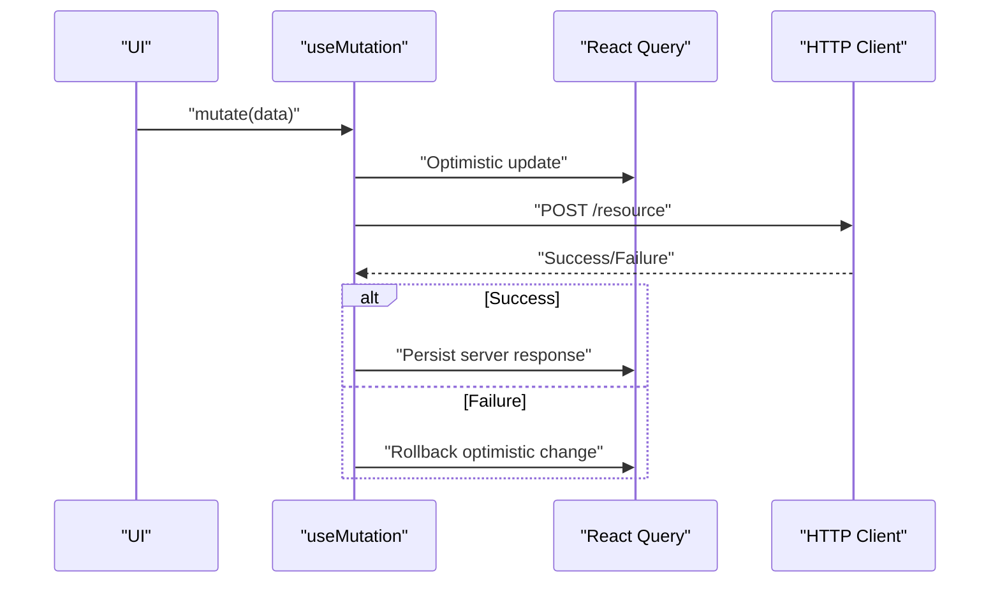
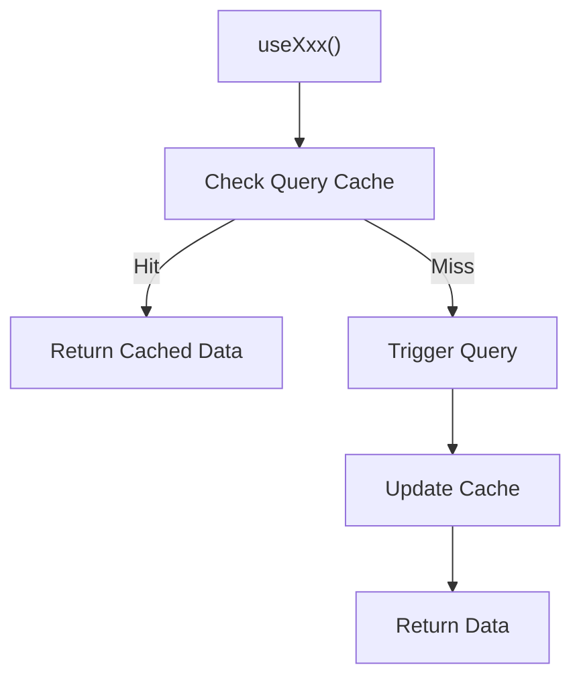
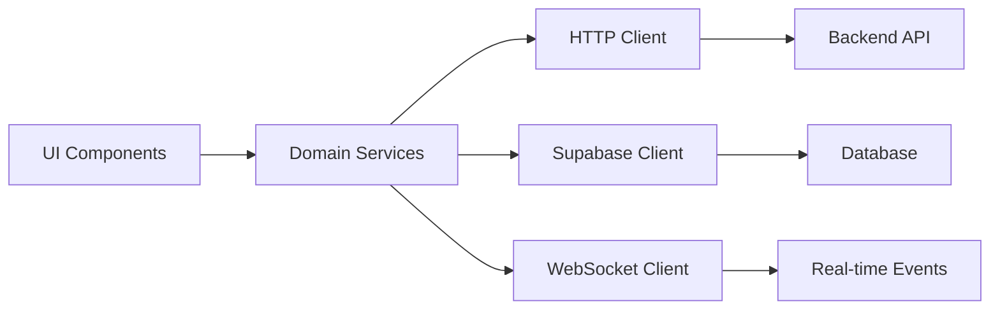

# API Integration Layer

<cite>
**Referenced Files in This Document**
- [shopper-web services index](file://apps/shopper-web/src/services)
- [admin lib api.ts](file://apps/admin/src/lib/api.ts)
- [admin lib socket.ts](file://apps/admin/src/lib/socket.ts)
- [admin lib supabase.ts](file://apps/admin/src/lib/supabase.ts)
- [courier-mobile lib api.ts](file://apps/courier-mobile/src/lib/api.ts)
- [courier-mobile lib queryClient.ts](file://apps/courier-mobile/src/lib/queryClient.ts)
- [courier-mobile lib socket.ts](file://apps/courier-mobile/src/lib/socket.ts)
- [shopper-web logisticsRealtime.ts](file://apps/shopper-web/src/services/logisticsRealtime.ts)
- [shopper-web orderTimelineApi.ts](file://apps/shopper-web/src/services/orderTimelineApi.ts)
- [shopper-web pushNotifications.ts](file://apps/shopper-web/src/services/pushNotifications.ts)
</cite>

## Table of Contents
1. Introduction
2. Project Structure
3. Core Components
4. Architecture Overview
5. Detailed Component Analysis
6. Dependency Analysis
7. Performance Considerations
8. Troubleshooting Guide
9. Conclusion

## Introduction
This document explains the API integration layer across the web and mobile applications, focusing on REST calls, Supabase client usage, real-time subscriptions via WebSockets, service layer architecture, error handling patterns, request/response transformations, authentication with JWT tokens, session management, role-based permissions, caching with React Query (including optimistic updates), offline support, custom hooks for data fetching, WebSocket connections for real-time features, error boundaries, retry logic, and network status handling.

## Project Structure
The integration layer is organized by application:
- Shopper Web: feature-oriented API services under apps/shopper-web/src/services, including REST clients and real-time modules.
- Admin Web: shared HTTP client, Supabase client, and WebSocket utilities under apps/admin/src/lib.
- Courier Mobile: HTTP client, React Query configuration, and WebSocket utilities under apps/courier-mobile/src/lib.

**Diagram sources**
- [shopper-web services index](file://apps/shopper-web/src/services)
- [shopper-web logisticsRealtime.ts](file://apps/shopper-web/src/services/logisticsRealtime.ts)
- [shopper-web orderTimelineApi.ts](file://apps/shopper-web/src/services/orderTimelineApi.ts)
- [shopper-web pushNotifications.ts](file://apps/shopper-web/src/services/pushNotifications.ts)
- [admin lib api.ts](file://apps/admin/src/lib/api.ts)
- [admin lib supabase.ts](file://apps/admin/src/lib/supabase.ts)
- [admin lib socket.ts](file://apps/admin/src/lib/socket.ts)
- [courier-mobile lib api.ts](file://apps/courier-mobile/src/lib/api.ts)
- [courier-mobile lib queryClient.ts](file://apps/courier-mobile/src/lib/queryClient.ts)
- [courier-mobile lib socket.ts](file://apps/courier-mobile/src/lib/socket.ts)

**Section sources**
- [shopper-web services index](file://apps/shopper-web/src/services)
- [admin lib api.ts](file://apps/admin/src/lib/api.ts)
- [admin lib socket.ts](file://apps/admin/src/lib/socket.ts)
- [admin lib supabase.ts](file://apps/admin/src/lib/supabase.ts)
- [courier-mobile lib api.ts](file://apps/courier-mobile/src/lib/api.ts)
- [courier-mobile lib queryClient.ts](file://apps/courier-mobile/src/lib/queryClient.ts)
- [courier-mobile lib socket.ts](file://apps/courier-mobile/src/lib/socket.ts)

## Core Components
- REST API clients: Centralized HTTP clients per app that handle base URLs, headers, token injection, and response normalization.
- Supabase client: Typed client used for direct database operations and real-time channels where appropriate.
- Real-time subscriptions: WebSocket-based listeners for live updates (e.g., order timeline, logistics).
- React Query integration: Query client configured for caching, retries, optimistic updates, and background refetching.
- Authentication and sessions: JWT-based auth flow with token storage and refresh strategies; role checks enforced at service or route level.
- Error handling: Consistent error transformation, user-facing messages, and retry/backoff policies.
- Offline support: Network-aware queries and local cache fallbacks using React Query persistence strategies.

**Section sources**
- [admin lib api.ts](file://apps/admin/src/lib/api.ts)
- [admin lib supabase.ts](file://apps/admin/src/lib/supabase.ts)
- [courier-mobile lib api.ts](file://apps/courier-mobile/src/lib/api.ts)
- [courier-mobile lib queryClient.ts](file://apps/courier-mobile/src/lib/queryClient.ts)

## Architecture Overview
The integration layer follows a service-layer pattern:
- UI components call domain-specific services (e.g., orders, catalog, promotions).
- Services encapsulate REST calls via an HTTP client and/or Supabase client.
- Real-time events are consumed through dedicated WebSocket handlers.
- React Query manages caching, deduplication, and optimistic updates.
- Auth middleware injects JWT tokens and enforces roles where needed.

[No diagram sources since this is a conceptual flow]

## Detailed Component Analysis

### REST API Clients
- Purpose: Provide typed methods for each domain (orders, catalog, admin, etc.) with consistent error handling and response shaping.
- Key responsibilities:
  - Base URL and header configuration.
  - JWT injection from session store.
  - Response normalization (data envelope, errors).
  - Retry and timeout policies.
- Examples by module:
  - Admin: centralized API client under apps/admin/src/lib/api.ts.
  - Courier Mobile: HTTP client under apps/courier-mobile/src/lib/api.ts.
  - Shopper Web: multiple domain services under apps/shopper-web/src/services.

**Section sources**
- [admin lib api.ts](file://apps/admin/src/lib/api.ts)
- [courier-mobile lib api.ts](file://apps/courier-mobile/src/lib/api.ts)
- [shopper-web services index](file://apps/shopper-web/src/services)

### Supabase Client Usage
- Purpose: Direct database access, RLS enforcement, and optional real-time channels.
- Typical usage:
  - Initialize client with environment variables.
  - Use typed queries/mutations for entities.
  - Combine with services for complex flows.
- Where implemented:
  - Admin Supabase client under apps/admin/src/lib/supabase.ts.

**Diagram sources**
- [admin lib supabase.ts](file://apps/admin/src/lib/supabase.ts)

**Section sources**
- [admin lib supabase.ts](file://apps/admin/src/lib/supabase.ts)

### Real-Time Subscriptions (WebSockets)
- Purpose: Live updates for time-sensitive data such as order timelines and logistics tracking.
- Implementation highlights:
  - Dedicated WebSocket clients per app (Admin: apps/admin/src/lib/socket.ts; Courier Mobile: apps/courier-mobile/src/lib/socket.ts).
  - Event-driven updates integrated with React Query cache invalidation or local stores.
  - Shopper Web real-time service for logistics and order timeline under apps/shopper-web/src/services/logisticsRealtime.ts and orderTimelineApi.ts.

**Diagram sources**
- [admin lib socket.ts](file://apps/admin/src/lib/socket.ts)
- [courier-mobile lib socket.ts](file://apps/courier-mobile/src/lib/socket.ts)
- [shopper-web logisticsRealtime.ts](file://apps/shopper-web/src/services/logisticsRealtime.ts)
- [shopper-web orderTimelineApi.ts](file://apps/shopper-web/src/services/orderTimelineApi.ts)

**Section sources**
- [admin lib socket.ts](file://apps/admin/src/lib/socket.ts)
- [courier-mobile lib socket.ts](file://apps/courier-mobile/src/lib/socket.ts)
- [shopper-web logisticsRealtime.ts](file://apps/shopper-web/src/services/logisticsRealtime.ts)
- [shopper-web orderTimelineApi.ts](file://apps/shopper-web/src/services/orderTimelineApi.ts)

### Authentication, Session Management, and Role-Based Permissions
- JWT-based authentication:
  - Tokens stored securely and attached to requests via the HTTP client.
  - Refresh strategy handled centrally to minimize re-auth prompts.
- Session management:
  - Persisted session state with expiration handling.
  - Auto logout on token expiry or invalidation.
- Role-based permissions:
  - Enforced at service or route level based on decoded claims.
  - Guards or interceptors can block unauthorized actions.

[No diagram sources since this is a conceptual flow]

**Section sources**
- [admin lib api.ts](file://apps/admin/src/lib/api.ts)
- [courier-mobile lib api.ts](file://apps/courier-mobile/src/lib/api.ts)

### Caching Strategies with React Query, Optimistic Updates, and Offline Support
- Caching:
  - React Query configured per app (e.g., courier-mobile under apps/courier-mobile/src/lib/queryClient.ts).
  - Stale times, refetch intervals, and deduplication tuned per endpoint.
- Optimistic updates:
  - Mutations update cache immediately, then reconcile with server response.
  - Rollback on failure to maintain consistency.
- Offline support:
  - Network-aware queries with fallback to cached data.
  - Background sync when connectivity returns.

**Diagram sources**
- [courier-mobile lib queryClient.ts](file://apps/courier-mobile/src/lib/queryClient.ts)

**Section sources**
- [courier-mobile lib queryClient.ts](file://apps/courier-mobile/src/lib/queryClient.ts)

### Custom Hooks for Data Fetching
- Encapsulate React Query usage into domain-specific hooks:
  - useGetOrders, useCreateOrder, useUpdateProfile, etc.
  - Provide loading states, error states, and refetch triggers.
  - Integrate with real-time invalidations for live updates.

[No diagram sources since this is a conceptual flow]

**Section sources**
- [shopper-web services index](file://apps/shopper-web/src/services)

### Push Notifications
- Purpose: Deliver system alerts, order updates, and marketing messages.
- Implementation:
  - Service wrapper for notification registration, permission handling, and message routing.
  - Integrates with platform-specific providers and deep links.

**Section sources**
- [shopper-web pushNotifications.ts](file://apps/shopper-web/src/services/pushNotifications.ts)

## Dependency Analysis
- Cohesion: Each service focuses on a single domain (orders, catalog, admin, etc.), improving maintainability.
- Coupling:
  - Services depend on a shared HTTP client and optionally Supabase client.
  - Real-time services depend on WebSocket clients and integrate with React Query cache.
- External dependencies:
  - Backend REST APIs.
  - Supabase for database and real-time features.
  - Platform notification services.

[No diagram sources since this is a conceptual flow]

**Section sources**
- [admin lib api.ts](file://apps/admin/src/lib/api.ts)
- [admin lib supabase.ts](file://apps/admin/src/lib/supabase.ts)
- [admin lib socket.ts](file://apps/admin/src/lib/socket.ts)
- [courier-mobile lib api.ts](file://apps/courier-mobile/src/lib/api.ts)
- [courier-mobile lib queryClient.ts](file://apps/courier-mobile/src/lib/queryClient.ts)
- [courier-mobile lib socket.ts](file://apps/courier-mobile/src/lib/socket.ts)
- [shopper-web services index](file://apps/shopper-web/src/services)

## Performance Considerations
- Minimize network calls:
  - Use React Query caching and stale-while-revalidate strategies.
  - Deduplicate concurrent requests.
- Optimize payloads:
  - Select only required fields.
  - Paginate large lists.
- Real-time efficiency:
  - Subscribe to specific channels and filter events server-side when possible.
- Error resilience:
  - Configure exponential backoff and retry limits.
  - Graceful degradation when offline.

[No sources needed since this section provides general guidance]

## Troubleshooting Guide
- Authentication issues:
  - Verify JWT presence and validity in headers.
  - Ensure token refresh flow handles expired sessions.
- Network errors:
  - Check timeouts and retry settings.
  - Inspect normalized error responses for actionable messages.
- Real-time problems:
  - Confirm WebSocket connection state and channel subscriptions.
  - Validate event payloads and cache invalidation triggers.
- Offline behavior:
  - Ensure cached data is available and marked appropriately.
  - Queue mutations for later execution when connectivity resumes.

**Section sources**
- [admin lib api.ts](file://apps/admin/src/lib/api.ts)
- [courier-mobile lib api.ts](file://apps/courier-mobile/src/lib/api.ts)
- [courier-mobile lib queryClient.ts](file://apps/courier-mobile/src/lib/queryClient.ts)
- [admin lib socket.ts](file://apps/admin/src/lib/socket.ts)
- [courier-mobile lib socket.ts](file://apps/courier-mobile/src/lib/socket.ts)

## Conclusion
The API integration layer combines REST clients, Supabase usage, and WebSocket-based real-time subscriptions within a cohesive service architecture. It leverages React Query for robust caching, optimistic updates, and offline support, while enforcing secure authentication and role-based permissions. The modular design promotes maintainability and scalability across web and mobile applications.