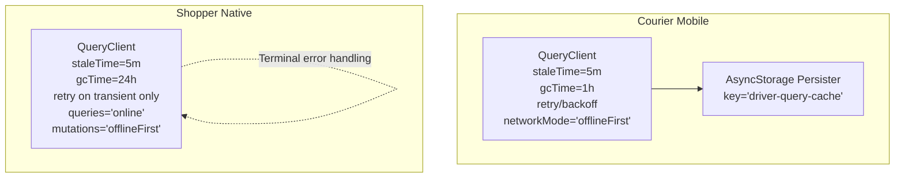
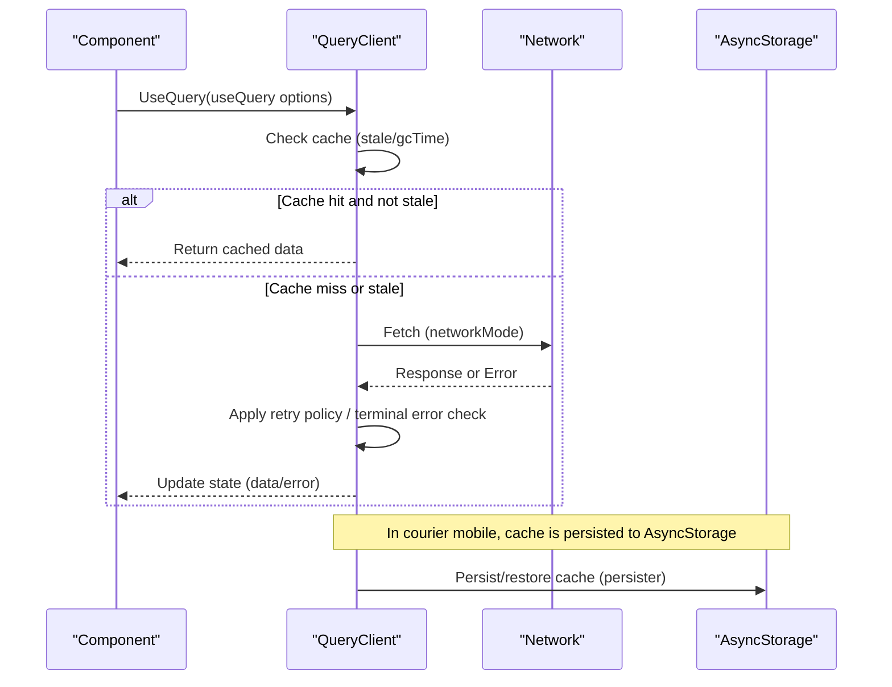
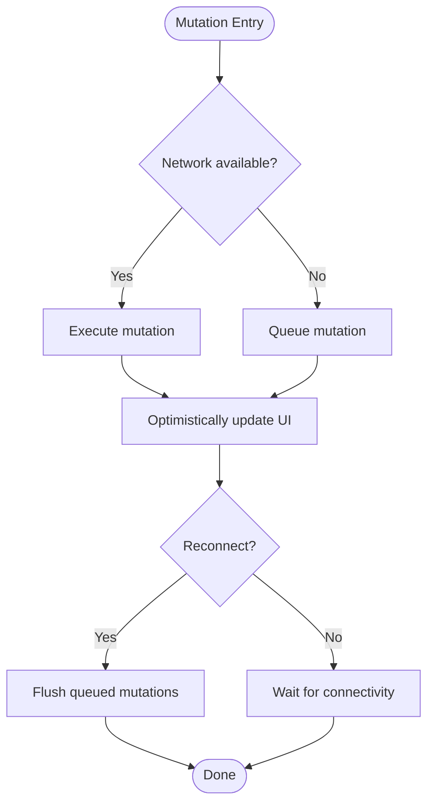
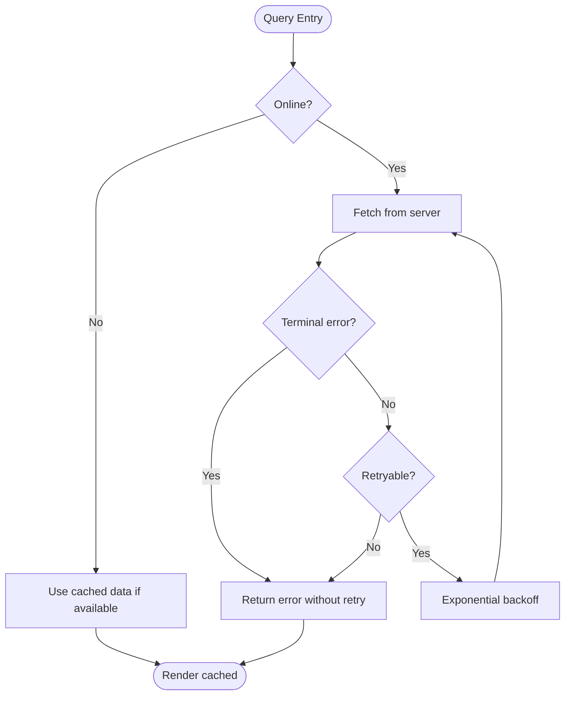
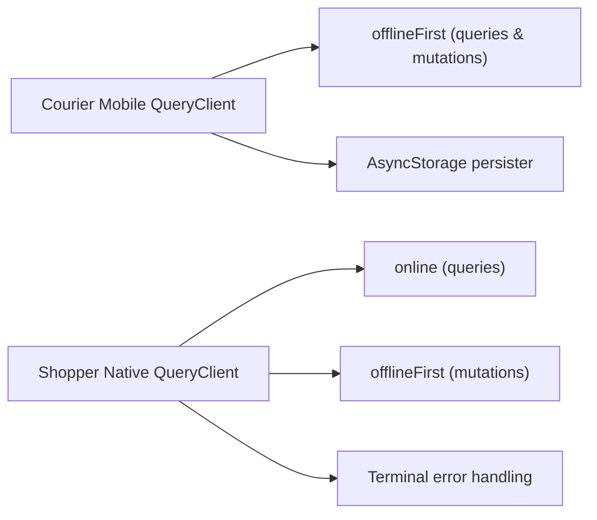

# Caching Strategies

<cite>
**Referenced Files in This Document**
- [queryClient.ts](file://apps/courier-mobile/src/lib/queryClient.ts)
- [queryClient.ts](file://apps/shopper-native/src/lib/queryClient.ts)
</cite>

## Table of Contents
1. [Introduction](#introduction)
2. [Project Structure](#project-structure)
3. [Core Components](#core-components)
4. [Architecture Overview](#architecture-overview)
5. [Detailed Component Analysis](#detailed-component-analysis)
6. [Dependency Analysis](#dependency-analysis)
7. [Performance Considerations](#performance-considerations)
8. [Troubleshooting Guide](#troubleshooting-guide)
9. [Conclusion](#conclusion)
10. [Appendices](#appendices)

## Introduction
This document explains the caching strategies implemented with React Query and local storage across mobile apps in this repository. It covers cache configuration, stale time and garbage collection policies, optimistic updates, cache invalidation, background refetching, offline support with persisted queries, request queuing, conflict resolution, cache warming/prefetching, and performance monitoring for cache effectiveness. The guidance is grounded in the actual QueryClient configurations found in the codebase.

## Project Structure
The caching strategy is centralized in per-app QueryClient definitions:
- Courier Mobile app configures a QueryClient with persistence to AsyncStorage and an offline-first network mode for both queries and mutations.
- Shopper Native app configures a QueryClient tuned for mobile with online-only queries (to avoid retry storms when offline), offline-first mutations (for optimistic flows), and a terminal error classifier that avoids retrying 4xx errors.

**Diagram sources**
- [queryClient.ts:5-26](file://apps/courier-mobile/src/lib/queryClient.ts#L5-L26)
- [queryClient.ts:32-57](file://apps/shopper-native/src/lib/queryClient.ts#L32-L57)

**Section sources**
- [queryClient.ts:5-26](file://apps/courier-mobile/src/lib/queryClient.ts#L5-L26)
- [queryClient.ts:32-57](file://apps/shopper-native/src/lib/queryClient.ts#L32-L57)

## Core Components
- QueryClient instances define global defaults for queries and mutations:
  - Stale time controls how long data is considered fresh before refetching.
  - Garbage collection time (gcTime) defines how long unused entries remain in memory.
  - Retry policies use exponential backoff capped at a maximum delay; shopper native differentiates terminal vs retryable errors.
  - Network modes determine behavior when offline: courier mobile uses offline-first for both queries and mutations; shopper native uses online for queries and offline-first for mutations.
- Persistence:
  - Courier mobile persists the query cache to AsyncStorage via a persister with throttling.
  - Shopper native includes a cache buster constant to invalidate stale caches after schema or DTO changes.

Key behaviors derived from the code:
- Background refetching is controlled by disabling window focus refetch where configured and relying on reconnect-based refetch or explicit triggers.
- Optimistic updates are enabled by offline-first mutations so UI can update immediately while requests queue and reconcile later.
- Terminal error handling prevents retries on client errors (e.g., 4xx), saving bandwidth and avoiding noisy retries.

**Section sources**
- [queryClient.ts:5-26](file://apps/courier-mobile/src/lib/queryClient.ts#L5-L26)
- [queryClient.ts:32-57](file://apps/shopper-native/src/lib/queryClient.ts#L32-L57)

## Architecture Overview
The architecture centers around a single QueryClient per app that orchestrates:
- Data fetching with configurable staleness and garbage collection.
- Retries with exponential backoff and terminal error detection.
- Offline-first mutation execution to support optimistic UI.
- Optional cache persistence to device storage for resilience across app restarts.

**Diagram sources**
- [queryClient.ts:5-26](file://apps/courier-mobile/src/lib/queryClient.ts#L5-L26)
- [queryClient.ts:32-57](file://apps/shopper-native/src/lib/queryClient.ts#L32-L57)

## Detailed Component Analysis

### Courier Mobile QueryClient
- Staleness and lifetime:
  - Queries are considered stale after 5 minutes.
  - Entries are retained in memory for 1 hour before garbage collection.
- Retry behavior:
  - Exponential backoff with a cap at 10 seconds.
- Network mode:
  - Both queries and mutations run offline-first, enabling immediate UI updates and queued requests when offline.
- Persistence:
  - Uses an Async Storage persister with a dedicated key and throttled writes to reduce I/O overhead.

**Diagram sources**
- [queryClient.ts:5-26](file://apps/courier-mobile/src/lib/queryClient.ts#L5-L26)

**Section sources**
- [queryClient.ts:5-26](file://apps/courier-mobile/src/lib/queryClient.ts#L5-L26)

### Shopper Native QueryClient
- Staleness and lifetime:
  - Queries are stale after 5 minutes; entries persist up to 24 hours.
- Retry behavior:
  - Retries only for transient errors; terminal errors (including 4xx and specific PostgREST codes) do not retry.
  - Exponential backoff capped at 8 seconds.
- Network mode:
  - Queries run online-only to avoid retry storms when offline.
  - Mutations run offline-first to support optimistic flows and request queuing.
- Cache busting:
  - A versioned cache buster constant helps invalidate stale caches after schema or DTO changes.

**Diagram sources**
- [queryClient.ts:18-30](file://apps/shopper-native/src/lib/queryClient.ts#L18-L30)
- [queryClient.ts:32-57](file://apps/shopper-native/src/lib/queryClient.ts#L32-L57)

**Section sources**
- [queryClient.ts:18-30](file://apps/shopper-native/src/lib/queryClient.ts#L18-L30)
- [queryClient.ts:32-57](file://apps/shopper-native/src/lib/queryClient.ts#L32-L57)

## Dependency Analysis
- Shared concepts:
  - Both apps configure a QueryClient with sensible defaults for mobile: moderate staleness, bounded retries, and gcTime to control memory usage.
- Differences:
  - Courier mobile emphasizes offline-first for all operations and persists the cache to AsyncStorage.
  - Shopper native separates concerns: online queries to prevent unnecessary retries offline, offline-first mutations for optimistic UX, and robust terminal error handling.

**Diagram sources**
- [queryClient.ts:5-26](file://apps/courier-mobile/src/lib/queryClient.ts#L5-L26)
- [queryClient.ts:32-57](file://apps/shopper-native/src/lib/queryClient.ts#L32-L57)

**Section sources**
- [queryClient.ts:5-26](file://apps/courier-mobile/src/lib/queryClient.ts#L5-L26)
- [queryClient.ts:32-57](file://apps/shopper-native/src/lib/queryClient.ts#L32-L57)

## Performance Considerations
- Stale time tuning:
  - 5-minute stale time balances freshness and network usage for most read-heavy screens.
- Garbage collection:
  - Shorter gcTime reduces memory footprint; longer gcTime improves resilience during backgrounding and quick reopens.
- Retry strategy:
  - Exponential backoff with caps prevents thundering herds and conserves battery/data.
  - Terminal error classification avoids futile retries on client errors.
- Network mode selection:
  - offlineFirst enables seamless UX when connectivity fluctuates but may increase local queue size.
  - online queries prevent unnecessary retries when offline, reducing wasted work.
- Persistence:
  - Throttled persistence reduces disk I/O and improves responsiveness.

[No sources needed since this section provides general guidance]

## Troubleshooting Guide
- Unexpected refetches:
  - Verify staleTime and refetchOn* settings; ensure components are not forcing refetch unnecessarily.
- Excessive retries:
  - Confirm terminal error handling is active; ensure errors are classified correctly to avoid retry loops.
- Memory growth:
  - Adjust gcTime if cache grows too large; monitor memory usage under real-world navigation patterns.
- Offline behavior mismatch:
  - For queries, ensure networkMode aligns with desired UX (online vs offlineFirst).
  - For mutations, confirm offlineFirst is used when optimistic updates are expected.
- Cache staleness after updates:
  - Use cache invalidation (invalidateQueries) after successful mutations to keep UI consistent.
- Schema or DTO changes:
  - Bump the cache buster version to clear stale persisted data and avoid type mismatches.

**Section sources**
- [queryClient.ts:18-30](file://apps/shopper-native/src/lib/queryClient.ts#L18-L30)
- [queryClient.ts:32-57](file://apps/shopper-native/src/lib/queryClient.ts#L32-L57)
- [queryClient.ts:5-26](file://apps/courier-mobile/src/lib/queryClient.ts#L5-L26)

## Conclusion
The repository implements robust, mobile-aware caching strategies using React Query:
- Courier mobile prioritizes offline-first operations and persistent caching for resilience and smooth UX.
- Shopper native separates query and mutation network modes to optimize for reliability and performance, with strong terminal error handling and a cache-busting mechanism for safe evolution.
These configurations provide a solid foundation for optimistic updates, background refetching, and effective cache management across varying network conditions.

[No sources needed since this section summarizes without analyzing specific files]

## Appendices

### Practical Patterns Derived from Configuration
- Query key design:
  - Use stable, hierarchical keys that reflect resource identity and filters to enable precise invalidation and sharing across components.
- Mutation callbacks:
  - On success, invalidate related queries to refresh dependent data.
  - On failure, revert optimistic updates and surface actionable errors.
- Cache synchronization:
  - Coordinate multiple components via shared query keys; rely on React Query’s deduplication to avoid duplicate requests.
- Prefetching and cache warming:
  - Preload likely-needed data on route transitions or user interactions to reduce perceived latency.
- Monitoring cache effectiveness:
  - Track metrics such as cache hit rates, refetch frequency, and retry counts to guide tuning of staleTime, gcTime, and retry policies.

[No sources needed since this section provides general guidance]