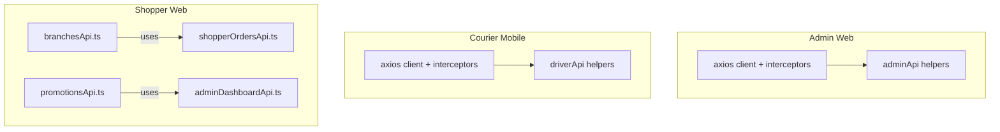
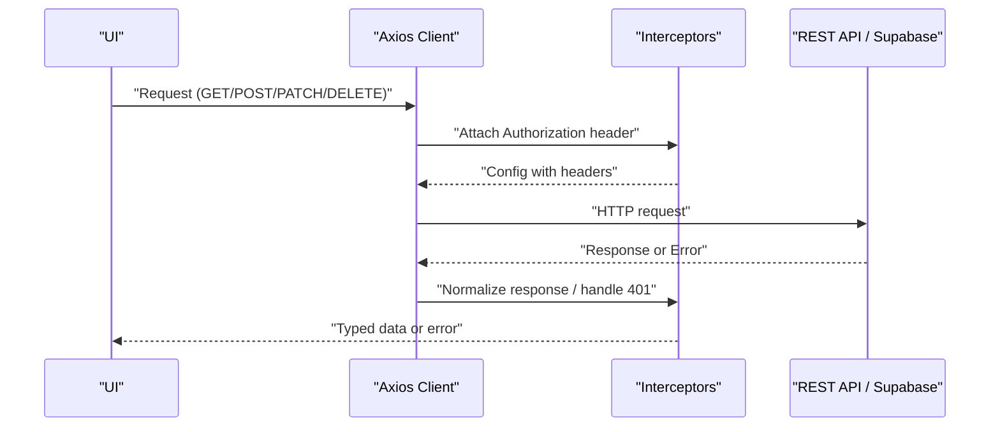
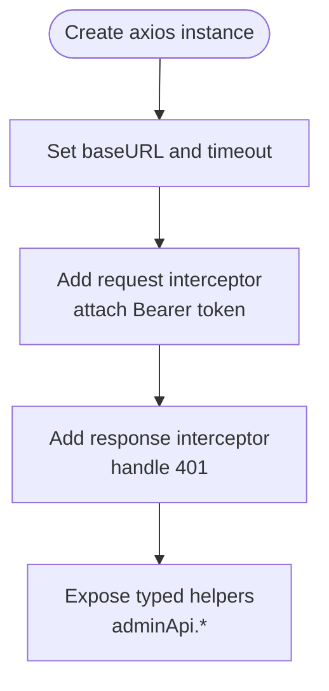
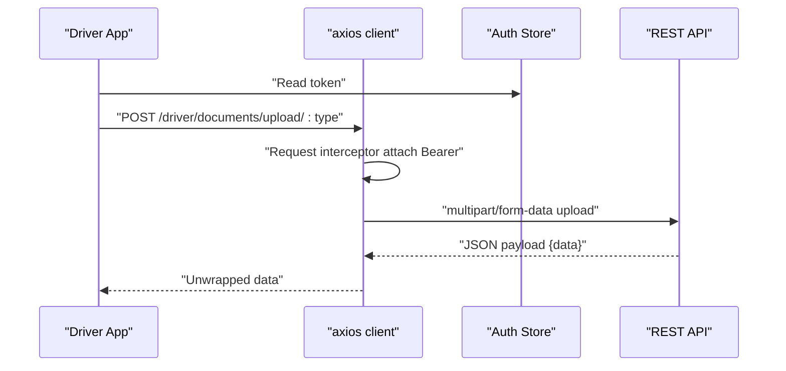
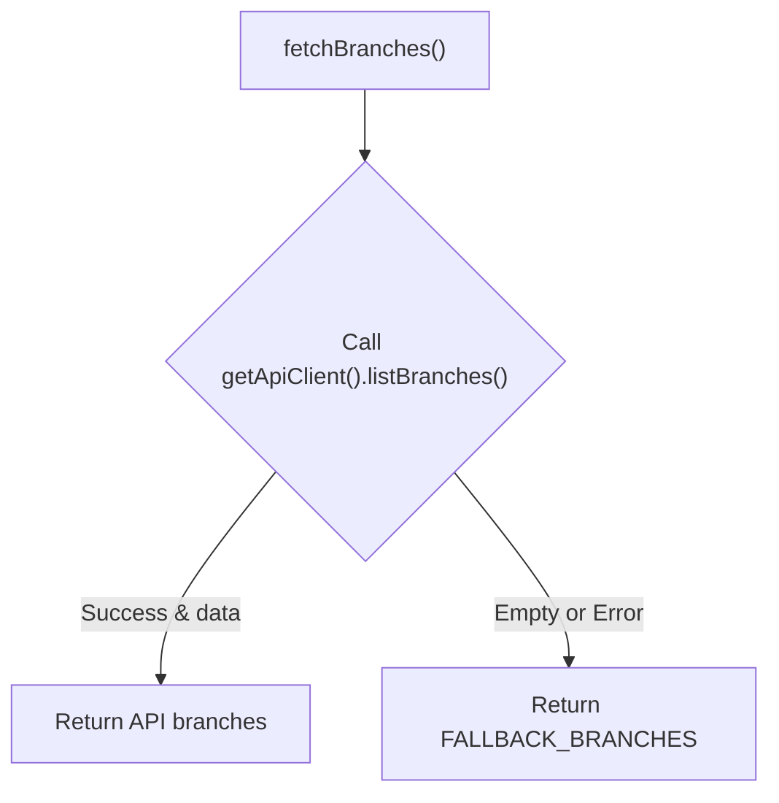
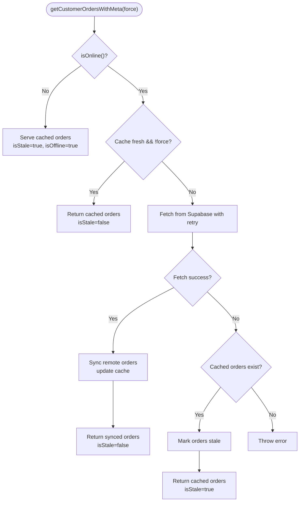
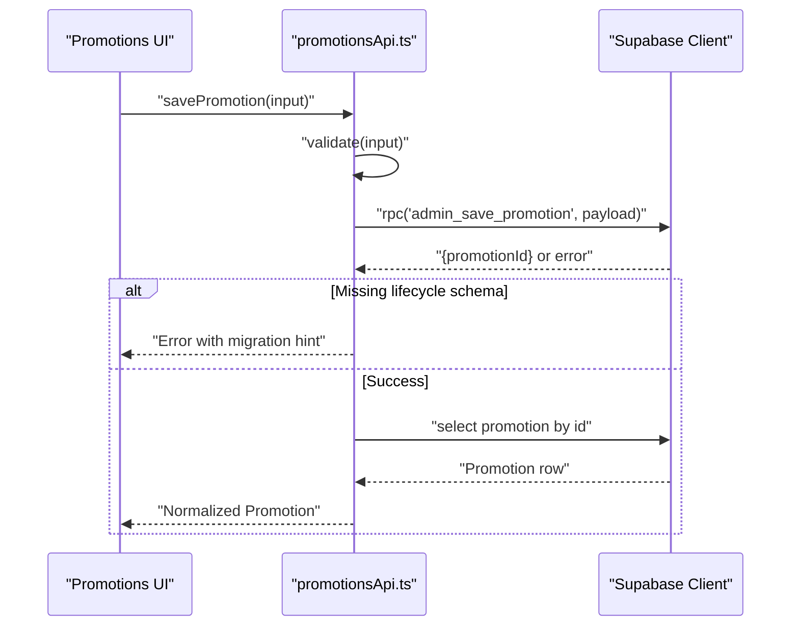
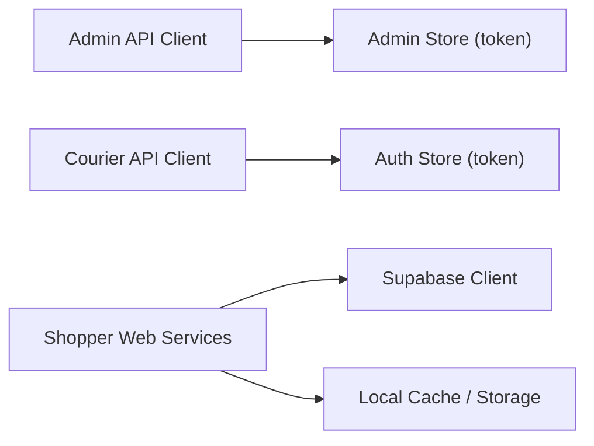

# REST API Services

<cite>
**Referenced Files in This Document**
- [apps/admin/src/lib/api.ts](file://apps/admin/src/lib/api.ts)
- [apps/courier-mobile/src/lib/api.ts](file://apps/courier-mobile/src/lib/api.ts)
- [apps/shopper-web/src/services/branchesApi.ts](file://apps/shopper-web/src/services/branchesApi.ts)
- [apps/shopper-web/src/services/shopperOrdersApi.ts](file://apps/shopper-web/src/services/shopperOrdersApi.ts)
- [apps/shopper-web/src/services/promotionsApi.ts](file://apps/shopper-web/src/services/promotionsApi.ts)
- [apps/shopper-web/src/services/adminDashboardApi.ts](file://apps/shopper-web/src/services/adminDashboardApi.ts)
</cite>

## Table of Contents
1. Introduction
2. Project Structure
3. Core Components
4. Architecture Overview
5. Detailed Component Analysis
6. Dependency Analysis
7. Performance Considerations
8. Troubleshooting Guide
9. Conclusion

## Introduction
This document explains the REST API service layer across multiple applications in the repository, focusing on HTTP client configuration, authentication with JWT tokens, request/response interceptors, error handling strategies, response transformation utilities, and robust network resilience patterns such as retry logic, timeouts, and offline caching. It also covers CRUD operations, file uploads, pagination, query parameter construction, and integration points with both REST endpoints and Supabase RPCs.

## Project Structure
The codebase organizes API services per application:
- Admin web app uses an Axios-based client with request/response interceptors for JWT injection and 401 handling, plus a set of typed admin API helpers.
- Courier mobile app defines a shared Axios client with interceptors and generic typed helpers (apiGet, apiPost, apiPatch, apiDelete), plus a driver-specific API surface including file upload via FormData.
- Shopper web app primarily uses Supabase clients for data access, with layered services that implement retries, caching, normalization, and fallbacks. Some services wrap external APIs through a shared client factory.

**Diagram sources**
- [apps/admin/src/lib/api.ts:1-30](file://apps/admin/src/lib/api.ts#L1-L30)
- [apps/courier-mobile/src/lib/api.ts:1-43](file://apps/courier-mobile/src/lib/api.ts#L1-L43)
- [apps/shopper-web/src/services/branchesApi.ts:1-84](file://apps/shopper-web/src/services/branchesApi.ts#L1-L84)
- [apps/shopper-web/src/services/shopperOrdersApi.ts:1-269](file://apps/shopper-web/src/services/shopperOrdersApi.ts#L1-L269)
- [apps/shopper-web/src/services/promotionsApi.ts:1-307](file://apps/shopper-web/src/services/promotionsApi.ts#L1-L307)
- [apps/shopper-web/src/services/adminDashboardApi.ts:1-75](file://apps/shopper-web/src/services/adminDashboardApi.ts#L1-L75)

**Section sources**
- [apps/admin/src/lib/api.ts:1-30](file://apps/admin/src/lib/api.ts#L1-L30)
- [apps/courier-mobile/src/lib/api.ts:1-43](file://apps/courier-mobile/src/lib/api.ts#L1-L43)
- [apps/shopper-web/src/services/branchesApi.ts:1-84](file://apps/shopper-web/src/services/branchesApi.ts#L1-L84)
- [apps/shopper-web/src/services/shopperOrdersApi.ts:1-269](file://apps/shopper-web/src/services/shopperOrdersApi.ts#L1-L269)
- [apps/shopper-web/src/services/promotionsApi.ts:1-307](file://apps/shopper-web/src/services/promotionsApi.ts#L1-L307)
- [apps/shopper-web/src/services/adminDashboardApi.ts:1-75](file://apps/shopper-web/src/services/adminDashboardApi.ts#L1-L75)

## Core Components
- Admin API client:
  - Axios instance with base URL and timeout.
  - Request interceptor attaches Bearer token from store.
  - Response interceptor handles 401 by clearing session and redirecting to login.
  - Typed helper methods for admin resources (drivers, orders, notifications, inventory, products, customers).
- Courier mobile API client:
  - Axios instance with dynamic base URL resolution and timeout.
  - Request interceptor injects JWT; response interceptor logs out on 401.
  - Generic typed helpers unwrap envelope responses.
  - Driver API includes CRUD, status updates, location reporting, order lifecycle, push token registration, and document uploads using FormData.
- Shopper web services:
  - Branches service fetches from a shared API client with fallback static list when API is unreachable.
  - Orders service implements exponential backoff retry, offline-first caching, normalization, and metadata exposure for UI states.
  - Promotions service validates inputs, calls Supabase RPCs, supports pagination/sorting/filtering, and provides migration-aware fallbacks.
  - Dashboard service aggregates stats via RPCs and tables.

**Section sources**
- [apps/admin/src/lib/api.ts:1-30](file://apps/admin/src/lib/api.ts#L1-L30)
- [apps/admin/src/lib/api.ts:31-89](file://apps/admin/src/lib/api.ts#L31-L89)
- [apps/courier-mobile/src/lib/api.ts:18-43](file://apps/courier-mobile/src/lib/api.ts#L18-L43)
- [apps/courier-mobile/src/lib/api.ts:45-72](file://apps/courier-mobile/src/lib/api.ts#L45-L72)
- [apps/courier-mobile/src/lib/api.ts:73-160](file://apps/courier-mobile/src/lib/api.ts#L73-L160)
- [apps/shopper-web/src/services/branchesApi.ts:74-81](file://apps/shopper-web/src/services/branchesApi.ts#L74-L81)
- [apps/shopper-web/src/services/shopperOrdersApi.ts:24-95](file://apps/shopper-web/src/services/shopperOrdersApi.ts#L24-L95)
- [apps/shopper-web/src/services/shopperOrdersApi.ts:140-172](file://apps/shopper-web/src/services/shopperOrdersApi.ts#L140-L172)
- [apps/shopper-web/src/services/shopperOrdersApi.ts:199-268](file://apps/shopper-web/src/services/shopperOrdersApi.ts#L199-L268)
- [apps/shopper-web/src/services/promotionsApi.ts:98-109](file://apps/shopper-web/src/services/promotionsApi.ts#L98-L109)
- [apps/shopper-web/src/services/promotionsApi.ts:127-139](file://apps/shopper-web/src/services/promotionsApi.ts#L127-L139)
- [apps/shopper-web/src/services/promotionsApi.ts:151-169](file://apps/shopper-web/src/services/promotionsApi.ts#L151-L169)
- [apps/shopper-web/src/services/promotionsApi.ts:186-256](file://apps/shopper-web/src/services/promotionsApi.ts#L186-L256)
- [apps/shopper-web/src/services/adminDashboardApi.ts:28-54](file://apps/shopper-web/src/services/adminDashboardApi.ts#L28-L54)

## Architecture Overview
The system composes three primary layers:
- HTTP client layer (Axios) with interceptors for auth and error handling.
- Service layer modules encapsulating domain-specific operations (admin, driver, shopper).
- Data access layer using REST endpoints and Supabase RPCs, with caching and fallbacks where appropriate.

**Diagram sources**
- [apps/admin/src/lib/api.ts:12-29](file://apps/admin/src/lib/api.ts#L12-L29)
- [apps/courier-mobile/src/lib/api.ts:24-43](file://apps/courier-mobile/src/lib/api.ts#L24-L43)

**Section sources**
- [apps/admin/src/lib/api.ts:12-29](file://apps/admin/src/lib/api.ts#L12-L29)
- [apps/courier-mobile/src/lib/api.ts:24-43](file://apps/courier-mobile/src/lib/api.ts#L24-L43)

## Detailed Component Analysis

### Admin API Client (Axios + Interceptors + Helpers)
- Base configuration sets baseURL and timeout; Content-Type defaults to JSON.
- Request interceptor reads token from store and adds Authorization header.
- Response interceptor clears session and redirects on 401.
- Helper methods provide typed CRUD-like operations for drivers, orders, notifications, inventory, products, and customers, consistently unwrapping response envelopes.

**Diagram sources**
- [apps/admin/src/lib/api.ts:6-29](file://apps/admin/src/lib/api.ts#L6-L29)
- [apps/admin/src/lib/api.ts:31-89](file://apps/admin/src/lib/api.ts#L31-L89)

**Section sources**
- [apps/admin/src/lib/api.ts:6-29](file://apps/admin/src/lib/api.ts#L6-L29)
- [apps/admin/src/lib/api.ts:31-89](file://apps/admin/src/lib/api.ts#L31-L89)

### Courier Mobile API Client (Axios + Envelope Unwrap + File Upload)
- Dynamic base URL resolution supports Expo environment variables and runtime constants.
- Request interceptor injects JWT; response interceptor triggers logout on 401.
- Generic helpers (apiGet, apiPost, apiPatch, apiDelete) unwrap envelope payloads into typed results.
- Driver API exposes full lifecycle endpoints and a dedicated document upload method using FormData and native fetch to ensure correct multipart encoding.

**Diagram sources**
- [apps/courier-mobile/src/lib/api.ts:18-43](file://apps/courier-mobile/src/lib/api.ts#L18-L43)
- [apps/courier-mobile/src/lib/api.ts:45-72](file://apps/courier-mobile/src/lib/api.ts#L45-L72)
- [apps/courier-mobile/src/lib/api.ts:135-155](file://apps/courier-mobile/src/lib/api.ts#L135-L155)

**Section sources**
- [apps/courier-mobile/src/lib/api.ts:18-43](file://apps/courier-mobile/src/lib/api.ts#L18-L43)
- [apps/courier-mobile/src/lib/api.ts:45-72](file://apps/courier-mobile/src/lib/api.ts#L45-L72)
- [apps/courier-mobile/src/lib/api.ts:73-160](file://apps/courier-mobile/src/lib/api.ts#L73-L160)

### Shopper Web: Branches Service with Fallback
- Attempts to fetch branches via a shared API client.
- On success with empty data or failure, returns a curated fallback list ensuring UI continuity.

**Diagram sources**
- [apps/shopper-web/src/services/branchesApi.ts:74-81](file://apps/shopper-web/src/services/branchesApi.ts#L74-L81)

**Section sources**
- [apps/shopper-web/src/services/branchesApi.ts:1-84](file://apps/shopper-web/src/services/branchesApi.ts#L1-L84)

### Shopper Web: Orders Service (Retry, Cache, Normalization)
- Implements exponential backoff retry for transient network errors.
- Provides offline-first behavior: serves cached orders immediately when offline or when cache is fresh.
- Normalizes raw rows into consistent snapshots and tracks metadata (stale, cachedAt, offline, queued mutations).
- Syncs remote orders into local storage and marks stale on failures.

**Diagram sources**
- [apps/shopper-web/src/services/shopperOrdersApi.ts:24-95](file://apps/shopper-web/src/services/shopperOrdersApi.ts#L24-L95)
- [apps/shopper-web/src/services/shopperOrdersApi.ts:140-172](file://apps/shopper-web/src/services/shopperOrdersApi.ts#L140-L172)
- [apps/shopper-web/src/services/shopperOrdersApi.ts:199-268](file://apps/shopper-web/src/services/shopperOrdersApi.ts#L199-L268)

**Section sources**
- [apps/shopper-web/src/services/shopperOrdersApi.ts:24-95](file://apps/shopper-web/src/services/shopperOrdersApi.ts#L24-L95)
- [apps/shopper-web/src/services/shopperOrdersApi.ts:140-172](file://apps/shopper-web/src/services/shopperOrdersApi.ts#L140-L172)
- [apps/shopper-web/src/services/shopperOrdersApi.ts:199-268](file://apps/shopper-web/src/services/shopperOrdersApi.ts#L199-L268)

### Shopper Web: Promotions Service (Validation, RPCs, Pagination, Migration Fallbacks)
- Validates input constraints before issuing requests.
- Uses Supabase RPCs for create/update/status changes and product search with pagination, sorting, filtering, and locale support.
- Detects missing lifecycle migrations and falls back to legacy queries for read paths while writes require migration.
- Supports abort signals for cancellable requests.

**Diagram sources**
- [apps/shopper-web/src/services/promotionsApi.ts:98-109](file://apps/shopper-web/src/services/promotionsApi.ts#L98-L109)
- [apps/shopper-web/src/services/promotionsApi.ts:151-169](file://apps/shopper-web/src/services/promotionsApi.ts#L151-L169)
- [apps/shopper-web/src/services/promotionsApi.ts:186-256](file://apps/shopper-web/src/services/promotionsApi.ts#L186-L256)

**Section sources**
- [apps/shopper-web/src/services/promotionsApi.ts:98-109](file://apps/shopper-web/src/services/promotionsApi.ts#L98-L109)
- [apps/shopper-web/src/services/promotionsApi.ts:127-139](file://apps/shopper-web/src/services/promotionsApi.ts#L127-L139)
- [apps/shopper-web/src/services/promotionsApi.ts:151-169](file://apps/shopper-web/src/services/promotionsApi.ts#L151-L169)
- [apps/shopper-web/src/services/promotionsApi.ts:186-256](file://apps/shopper-web/src/services/promotionsApi.ts#L186-L256)

### Shopper Web: Admin Dashboard Aggregation
- Aggregates dashboard metrics by calling RPCs and querying tables concurrently.
- Maps raw rows to typed dashboard structures for consumption by UI components.

**Section sources**
- [apps/shopper-web/src/services/adminDashboardApi.ts:28-54](file://apps/shopper-web/src/services/adminDashboardApi.ts#L28-L54)

## Dependency Analysis
- Admin and courier apps depend on Axios for HTTP communication and on stores for token state.
- Shopper web services depend on Supabase clients and internal caches; some services wrap external APIs via a shared client factory.
- Cross-cutting concerns:
  - Authentication: JWT attached via request interceptors.
  - Error handling: 401 handled centrally; custom errors thrown for validation and network issues.
  - Caching and fallbacks: implemented in shopper web services to improve resilience.

**Diagram sources**
- [apps/admin/src/lib/api.ts:12-29](file://apps/admin/src/lib/api.ts#L12-L29)
- [apps/courier-mobile/src/lib/api.ts:24-43](file://apps/courier-mobile/src/lib/api.ts#L24-L43)
- [apps/shopper-web/src/services/shopperOrdersApi.ts:140-172](file://apps/shopper-web/src/services/shopperOrdersApi.ts#L140-L172)

**Section sources**
- [apps/admin/src/lib/api.ts:12-29](file://apps/admin/src/lib/api.ts#L12-L29)
- [apps/courier-mobile/src/lib/api.ts:24-43](file://apps/courier-mobile/src/lib/api.ts#L24-L43)
- [apps/shopper-web/src/services/shopperOrdersApi.ts:140-172](file://apps/shopper-web/src/services/shopperOrdersApi.ts#L140-L172)

## Performance Considerations
- Timeouts: Both Axios clients configure a 15-second timeout to prevent hanging requests.
- Retries: Exponential backoff with limited attempts reduces load during transient failures.
- Caching: Offline-first strategy minimizes network usage and improves perceived performance.
- Aborts: Abort signals allow cancellation of long-running queries (e.g., promotions search).
- Payload shaping: Consistent envelope unwrapping reduces duplication and centralizes normalization.

[No sources needed since this section provides general guidance]

## Troubleshooting Guide
- Authentication failures:
  - 401 responses trigger logout and navigation in admin and courier clients.
  - Ensure token is present in store and correctly attached via interceptors.
- Network errors:
  - Retry logic only targets network/timeout errors; application errors are rethrown immediately.
  - Use offline indicators and stale cache flags to inform users.
- Validation errors:
  - Input validation throws descriptive errors (e.g., promotion name length, discount value constraints).
- Migration-related errors:
  - Read paths gracefully fall back to legacy schemas; write paths require applying migrations.

**Section sources**
- [apps/admin/src/lib/api.ts:20-29](file://apps/admin/src/lib/api.ts#L20-L29)
- [apps/courier-mobile/src/lib/api.ts:33-43](file://apps/courier-mobile/src/lib/api.ts#L33-L43)
- [apps/shopper-web/src/services/shopperOrdersApi.ts:75-95](file://apps/shopper-web/src/services/shopperOrdersApi.ts#L75-L95)
- [apps/shopper-web/src/services/promotionsApi.ts:98-109](file://apps/shopper-web/src/services/promotionsApi.ts#L98-L109)
- [apps/shopper-web/src/services/promotionsApi.ts:114-123](file://apps/shopper-web/src/services/promotionsApi.ts#L114-L123)

## Conclusion
The repository implements a robust, multi-app REST API service layer with consistent authentication, centralized error handling, and resilient data access patterns. Axios clients standardize request/response flows, while shopper web services add advanced features like retry with backoff, offline caching, and migration-aware fallbacks. Together, these patterns enable reliable CRUD operations, file uploads, pagination, and query parameter construction across diverse environments.

[No sources needed since this section summarizes without analyzing specific files]