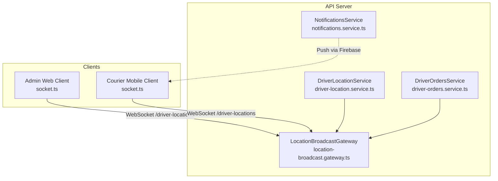
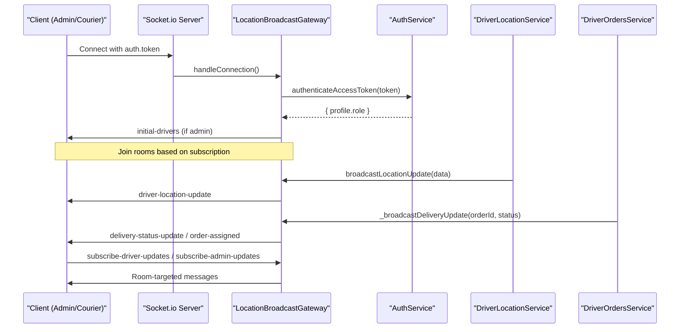
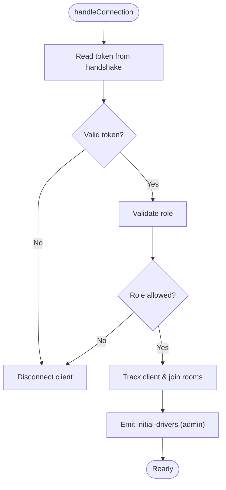
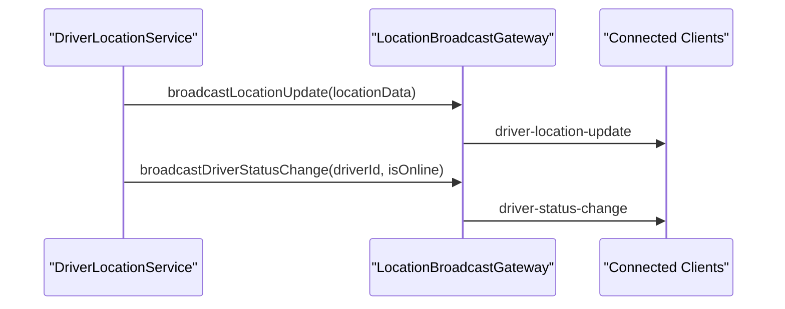
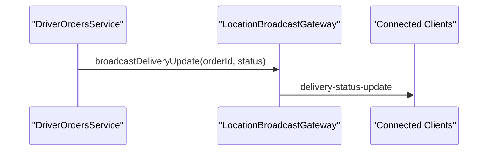
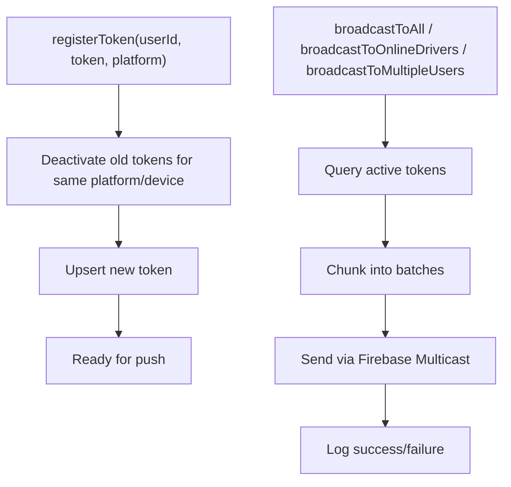
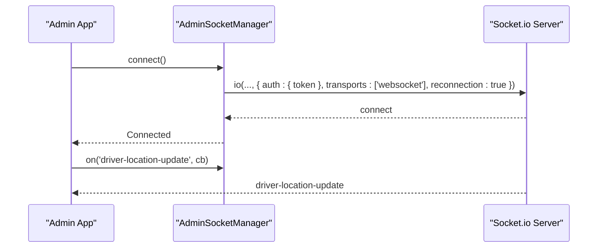
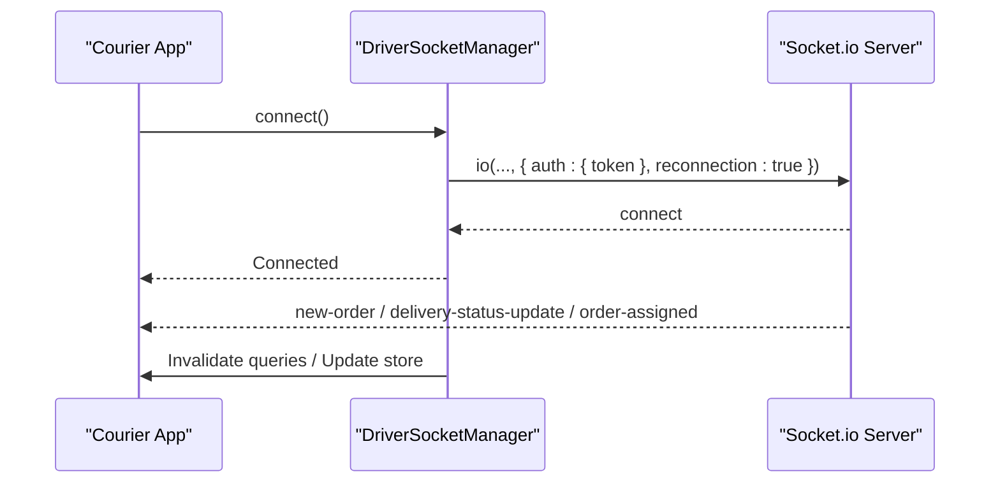
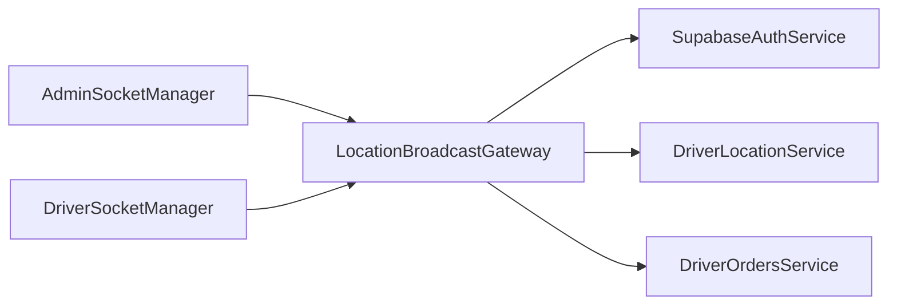

# Real-time Subscriptions

<cite>
**Referenced Files in This Document**
- [location-broadcast.gateway.ts](file://apps/api/src/modules/driver/location-broadcast.gateway.ts)
- [driver-location.service.ts](file://apps/api/src/modules/driver/driver-location.service.ts)
- [driver-orders.service.ts](file://apps/api/src/modules/driver/driver-orders.service.ts)
- [notifications.service.ts](file://apps/api/src/modules/notifications/notifications.service.ts)
- [socket.ts (Admin)](file://apps/admin/src/lib/socket.ts)
- [socket.ts (Courier Mobile)](file://apps/courier-mobile/src/lib/socket.ts)
</cite>

## Table of Contents
1. Introduction
2. Project Structure
3. Core Components
4. Architecture Overview
5. Detailed Component Analysis
6. Dependency Analysis
7. Performance Considerations
8. Troubleshooting Guide
9. Conclusion

## Introduction
This document explains the real-time subscription system built with WebSockets and Socket.io across the API server and client applications. It covers connection management, automatic reconnection logic, heartbeat considerations, event-driven architecture for order updates, inventory changes, and notifications, authentication for WebSocket connections, room-based messaging for user-specific updates, message serialization formats, connection pooling, memory management, and graceful disconnection handling.

## Project Structure
The real-time system spans:
- API server (NestJS + Socket.io): a gateway that authenticates clients, manages rooms, and broadcasts events.
- Admin web client: connects to the driver locations namespace, subscribes to admin updates, and listens for driver location/status events.
- Courier mobile client: connects to the API, subscribes to delivery-related events, and refreshes UI state on real-time updates.

**Diagram sources**
- [location-broadcast.gateway.ts:27-40](file://apps/api/src/modules/driver/location-broadcast.gateway.ts#L27-L40)
- [location-broadcast.gateway.ts:61-93](file://apps/api/src/modules/driver/location-broadcast.gateway.ts#L61-L93)
- [driver-location.service.ts:90-110](file://apps/api/src/modules/driver/driver-location.service.ts#L90-L110)
- [driver-orders.service.ts:398-503](file://apps/api/src/modules/driver/driver-orders.service.ts#L398-L503)
- [notifications.service.ts:136-158](file://apps/api/src/modules/notifications/notifications.service.ts#L136-L158)
- [socket.ts (Admin):10-36](file://apps/admin/src/lib/socket.ts#L10-L36)
- [socket.ts (Courier Mobile):24-69](file://apps/courier-mobile/src/lib/socket.ts#L24-L69)

**Section sources**
- [location-broadcast.gateway.ts:27-40](file://apps/api/src/modules/driver/location-broadcast.gateway.ts#L27-L40)
- [socket.ts (Admin):10-36](file://apps/admin/src/lib/socket.ts#L10-L36)
- [socket.ts (Courier Mobile):24-69](file://apps/courier-mobile/src/lib/socket.ts#L24-L69)

## Core Components
- LocationBroadcastGateway: Authenticates WebSocket connections, tracks connected clients, manages rooms, and emits real-time events such as driver location updates and status changes.
- DriverLocationService: Publishes location updates and online/offline status changes to the gateway.
- DriverOrdersService: Emits delivery lifecycle events (e.g., arrived at pharmacy/customer, delivered) to clients.
- NotificationsService: Manages push notification tokens and broadcasts via Firebase; complements real-time updates with offline reachability.
- AdminSocketManager: Client-side manager for connecting to the driver locations namespace, subscribing to admin updates, and listening to driver events.
- DriverSocketManager: Client-side manager for connecting to the API, subscribing to delivery events, and refreshing UI state on real-time updates.

Key responsibilities:
- Authentication: Validate tokens on connect and restrict access by role where required.
- Rooms: Use Socket.io rooms for targeted messaging (e.g., per-driver rooms, admin-updates).
- Events: Emit structured events for location updates, status changes, and delivery lifecycle.
- Reconnection: Configure client-side reconnection with backoff and attempt limits.
- Graceful disconnect: Clean up mappings and leave rooms on disconnect.

**Section sources**
- [location-broadcast.gateway.ts:61-118](file://apps/api/src/modules/driver/location-broadcast.gateway.ts#L61-L118)
- [location-broadcast.gateway.ts:148-181](file://apps/api/src/modules/driver/location-broadcast.gateway.ts#L148-L181)
- [driver-location.service.ts:90-110](file://apps/api/src/modules/driver/driver-location.service.ts#L90-L110)
- [driver-orders.service.ts:398-503](file://apps/api/src/modules/driver/driver-orders.service.ts#L398-L503)
- [notifications.service.ts:63-158](file://apps/api/src/modules/notifications/notifications.service.ts#L63-L158)
- [socket.ts (Admin):10-57](file://apps/admin/src/lib/socket.ts#L10-L57)
- [socket.ts (Courier Mobile):24-83](file://apps/courier-mobile/src/lib/socket.ts#L24-L83)

## Architecture Overview
The system uses a namespace-scoped WebSocket gateway for driver locations. Clients authenticate via token during handshake. The gateway maintains client maps and rooms for targeted messaging. Services publish domain events (location, status, delivery lifecycle), which the gateway broadcasts or routes to specific rooms. Clients subscribe to relevant rooms/events and update local state accordingly. Push notifications complement real-time channels for offline reachability.

**Diagram sources**
- [location-broadcast.gateway.ts:61-93](file://apps/api/src/modules/driver/location-broadcast.gateway.ts#L61-L93)
- [location-broadcast.gateway.ts:148-181](file://apps/api/src/modules/driver/location-broadcast.gateway.ts#L148-L181)
- [driver-location.service.ts:90-110](file://apps/api/src/modules/driver/driver-location.service.ts#L90-L110)
- [driver-orders.service.ts:398-503](file://apps/api/src/modules/driver/driver-orders.service.ts#L398-L503)

## Detailed Component Analysis

### LocationBroadcastGateway
- Namespace: /driver-locations with CORS configured for multiple origins.
- Authentication: Reads token from handshake.auth or Authorization header; validates via SupabaseAuthService and enforces role checks for admin access.
- Connection tracking: Maintains connectedClients map and driverSockets mapping for targeted messaging.
- Rooms: Supports per-driver rooms and an admin-updates room for broadcasting to all admins.
- Events:
  - initial-drivers: Sent to newly connected admin clients with current online drivers.
  - driver-location-update: Broadcast when a driver’s location is updated.
  - driver-status-change: Broadcast when a driver goes online/offline.
  - Delivery lifecycle events emitted by services are routed through this gateway to appropriate rooms.

**Diagram sources**
- [location-broadcast.gateway.ts:61-93](file://apps/api/src/modules/driver/location-broadcast.gateway.ts#L61-L93)
- [location-broadcast.gateway.ts:95-102](file://apps/api/src/modules/driver/location-broadcast.gateway.ts#L95-L102)

**Section sources**
- [location-broadcast.gateway.ts:27-40](file://apps/api/src/modules/driver/location-broadcast.gateway.ts#L27-L40)
- [location-broadcast.gateway.ts:61-118](file://apps/api/src/modules/driver/location-broadcast.gateway.ts#L61-L118)
- [location-broadcast.gateway.ts:148-181](file://apps/api/src/modules/driver/location-broadcast.gateway.ts#L148-L181)
- [location-broadcast.gateway.ts:186-201](file://apps/api/src/modules/driver/location-broadcast.gateway.ts#L186-L201)

### DriverLocationService
- Publishes location updates to the gateway after persisting driver location data.
- Emits driver online/offline status changes via the gateway.

**Diagram sources**
- [driver-location.service.ts:90-110](file://apps/api/src/modules/driver/driver-location.service.ts#L90-L110)
- [driver-location.service.ts:226-235](file://apps/api/src/modules/driver/driver-location.service.ts#L226-L235)
- [location-broadcast.gateway.ts:124-143](file://apps/api/src/modules/driver/location-broadcast.gateway.ts#L124-L143)

**Section sources**
- [driver-location.service.ts:90-110](file://apps/api/src/modules/driver/driver-location.service.ts#L90-L110)
- [driver-location.service.ts:226-235](file://apps/api/src/modules/driver/driver-location.service.ts#L226-L235)

### DriverOrdersService
- Emits delivery lifecycle events (e.g., ARRIVED_AT_PHARMACY, ARRIVED_AT_CUSTOMER, DELIVERED) to clients via the gateway.
- Ensures clients receive timely updates for active deliveries.

**Diagram sources**
- [driver-orders.service.ts:398-503](file://apps/api/src/modules/driver/driver-orders.service.ts#L398-L503)
- [driver-orders.service.ts:609-613](file://apps/api/src/modules/driver/driver-orders.service.ts#L609-L613)
- [location-broadcast.gateway.ts:186-201](file://apps/api/src/modules/driver/location-broadcast.gateway.ts#L186-L201)

**Section sources**
- [driver-orders.service.ts:398-503](file://apps/api/src/modules/driver/driver-orders.service.ts#L398-L503)
- [driver-orders.service.ts:609-613](file://apps/api/src/modules/driver/driver-orders.service.ts#L609-L613)

### NotificationsService
- Manages push notification tokens, deactivating stale tokens and upserting new ones.
- Provides broadcast methods to target users, online drivers, or all users.
- Logs delivery results and handles invalid tokens gracefully.

**Diagram sources**
- [notifications.service.ts:63-98](file://apps/api/src/modules/notifications/notifications.service.ts#L63-L98)
- [notifications.service.ts:136-158](file://apps/api/src/modules/notifications/notifications.service.ts#L136-L158)
- [notifications.service.ts:166-210](file://apps/api/src/modules/notifications/notifications.service.ts#L166-L210)

**Section sources**
- [notifications.service.ts:63-98](file://apps/api/src/modules/notifications/notifications.service.ts#L63-L98)
- [notifications.service.ts:136-158](file://apps/api/src/modules/notifications/notifications.service.ts#L136-L158)
- [notifications.service.ts:166-210](file://apps/api/src/modules/notifications/notifications.service.ts#L166-L210)

### AdminSocketManager (Admin Client)
- Connects to /driver-locations with token-based authentication.
- Configures reconnection with exponential backoff caps.
- Tracks listeners and reattaches them on reconnect.
- Provides on/off/disconnect utilities and connection state checks.

**Diagram sources**
- [socket.ts (Admin):10-36](file://apps/admin/src/lib/socket.ts#L10-L36)
- [socket.ts (Admin):38-57](file://apps/admin/src/lib/socket.ts#L38-L57)

**Section sources**
- [socket.ts (Admin):10-57](file://apps/admin/src/lib/socket.ts#L10-L57)

### DriverSocketManager (Courier Mobile Client)
- Connects to the API with token-based authentication.
- Configures reconnection with attempt limits and backoff.
- Subscribes to delivery events and invalidates queries to refresh UI state.
- Handles disconnect and cleanup.

**Diagram sources**
- [socket.ts (Courier Mobile):24-69](file://apps/courier-mobile/src/lib/socket.ts#L24-L69)
- [socket.ts (Courier Mobile):71-83](file://apps/courier-mobile/src/lib/socket.ts#L71-L83)

**Section sources**
- [socket.ts (Courier Mobile):24-83](file://apps/courier-mobile/src/lib/socket.ts#L24-L83)

## Dependency Analysis
- Gateway depends on:
  - SupabaseAuthService for token validation and role checks.
  - DriverLocationService to emit location and status events.
  - DriverOrdersService to emit delivery lifecycle events.
- Clients depend on:
  - socket.io-client for WebSocket transport and reconnection.
  - Local stores/query clients to update UI state upon receiving events.

**Diagram sources**
- [location-broadcast.gateway.ts:52-56](file://apps/api/src/modules/driver/location-broadcast.gateway.ts#L52-L56)
- [driver-location.service.ts:90-110](file://apps/api/src/modules/driver/driver-location.service.ts#L90-L110)
- [driver-orders.service.ts:398-503](file://apps/api/src/modules/driver/driver-orders.service.ts#L398-L503)
- [socket.ts (Admin):10-36](file://apps/admin/src/lib/socket.ts#L10-L36)
- [socket.ts (Courier Mobile):24-69](file://apps/courier-mobile/src/lib/socket.ts#L24-L69)

**Section sources**
- [location-broadcast.gateway.ts:52-56](file://apps/api/src/modules/driver/location-broadcast.gateway.ts#L52-L56)
- [driver-location.service.ts:90-110](file://apps/api/src/modules/driver/driver-location.service.ts#L90-L110)
- [driver-orders.service.ts:398-503](file://apps/api/src/modules/driver/driver-orders.service.ts#L398-L503)
- [socket.ts (Admin):10-36](file://apps/admin/src/lib/socket.ts#L10-L36)
- [socket.ts (Courier Mobile):24-69](file://apps/courier-mobile/src/lib/socket.ts#L24-L69)

## Performance Considerations
- Connection pooling:
  - Socket.io manages underlying connections efficiently; ensure transports are limited to websocket where possible to reduce overhead.
- Memory management:
  - Maintain minimal in-memory maps for connected clients and driver sockets; clean up on disconnect to prevent leaks.
  - Avoid storing large payloads in client-side listener sets; prefer lightweight references and detach listeners on unmount.
- Event volume:
  - Throttle high-frequency location updates at the service layer if needed to avoid overwhelming clients.
  - Use rooms to scope broadcasts to relevant recipients rather than global broadcasts.
- Reconnection strategy:
  - Use bounded reconnection attempts and exponential backoff to prevent thundering herds on reconnect storms.
- Push vs. real-time:
  - Use push notifications for offline reachability and real-time channels for live updates; coordinate to avoid duplicate alerts.

[No sources needed since this section provides general guidance]

## Troubleshooting Guide
Common issues and resolutions:
- Unauthenticated connections:
  - Ensure clients send a valid token in handshake.auth or Authorization header. Invalid or missing tokens result in immediate disconnect.
- Role-based access denied:
  - Only permitted roles (e.g., admin/manager) can connect to certain namespaces or rooms. Verify user roles.
- Reconnection loops:
  - Check network stability and server availability. Adjust reconnectionDelay and reconnectionAttempts on clients.
- Missing events:
  - Confirm clients have joined the correct rooms (e.g., driver-{id}, admin-updates). Verify subscriptions are established post-connect.
- Stale push tokens:
  - NotificationsService deactivates invalid tokens automatically; ensure clients register fresh tokens on app start or login.

**Section sources**
- [location-broadcast.gateway.ts:61-81](file://apps/api/src/modules/driver/location-broadcast.gateway.ts#L61-L81)
- [location-broadcast.gateway.ts:107-118](file://apps/api/src/modules/driver/location-broadcast.gateway.ts#L107-L118)
- [socket.ts (Admin):10-36](file://apps/admin/src/lib/socket.ts#L10-L36)
- [socket.ts (Courier Mobile):24-69](file://apps/courier-mobile/src/lib/socket.ts#L24-L69)
- [notifications.service.ts:63-98](file://apps/api/src/modules/notifications/notifications.service.ts#L63-L98)

## Conclusion
The real-time subscription system leverages Socket.io namespaces, room-based messaging, and service-driven event emission to deliver live updates for driver locations, delivery lifecycle, and notifications. Robust authentication, reconnection strategies, and graceful disconnect handling ensure reliability. Complementary push notifications extend reach beyond online sessions. Following the outlined patterns will help maintain scalability, performance, and a responsive user experience across admin and courier applications.

[No sources needed since this section summarizes without analyzing specific files]