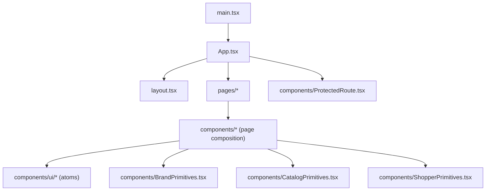
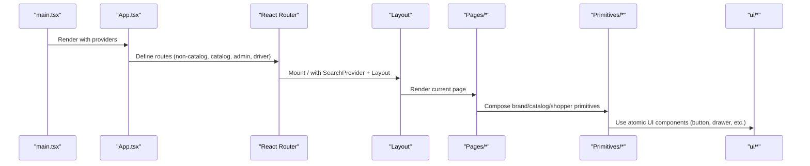
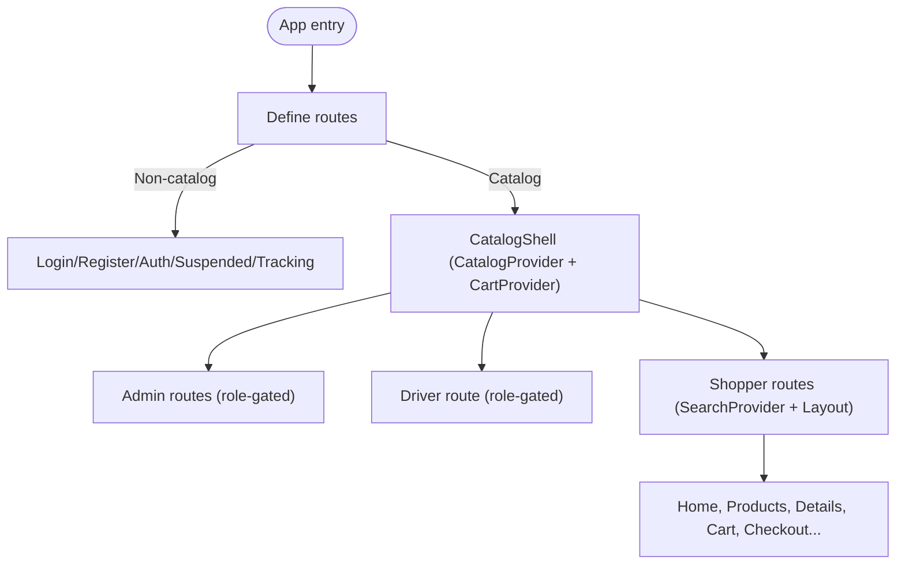
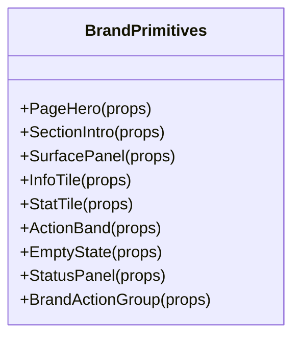
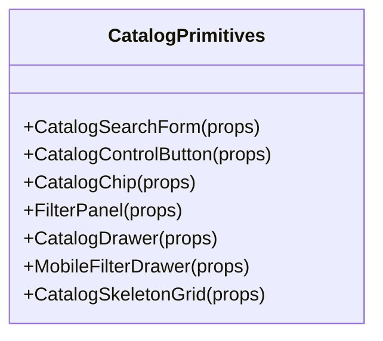
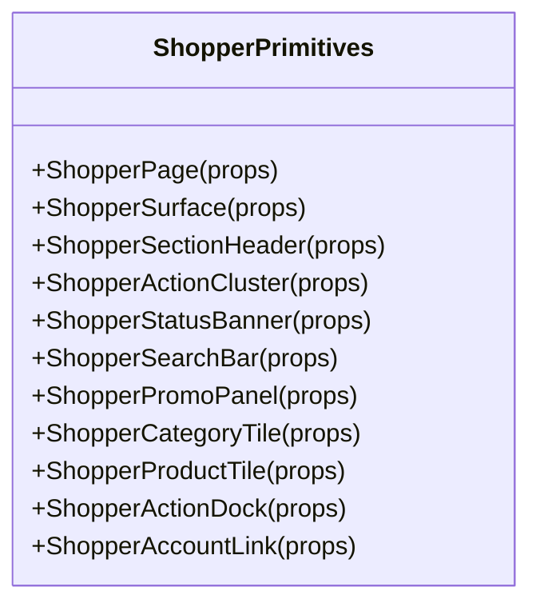
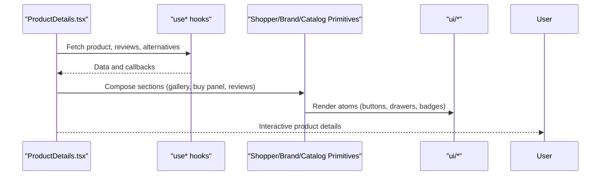
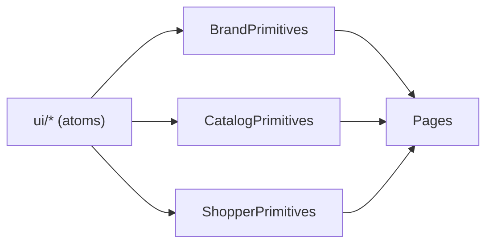
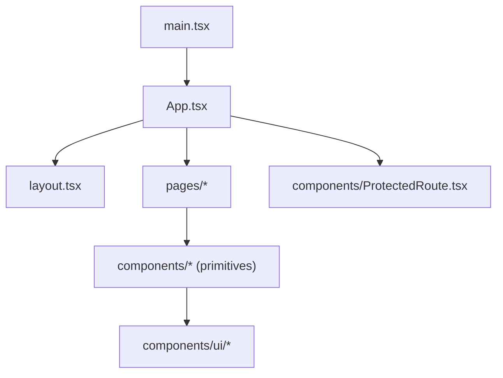

# Component Hierarchy & Structure

<cite>
**Referenced Files in This Document**
- [main.tsx](file://apps/shopper-web/src/main.tsx)
- [App.tsx](file://apps/shopper-web/src/app/App.tsx)
- [layout.tsx](file://apps/shopper-web/src/app/layout.tsx)
- [BrandPrimitives.tsx](file://apps/shopper-web/src/app/components/BrandPrimitives.tsx)
- [CatalogPrimitives.tsx](file://apps/shopper-web/src/app/components/CatalogPrimitives.tsx)
- [ShopperPrimitives.tsx](file://apps/shopper-web/src/app/components/ShopperPrimitives.tsx)
- [Home.tsx](file://apps/shopper-web/src/app/pages/Home.tsx)
- [ProductDetails.tsx](file://apps/shopper-web/src/app/pages/ProductDetails.tsx)
- [ProtectedRoute.tsx](file://apps/shopper-web/src/components/ProtectedRoute.tsx)
- [ui/button.tsx](file://apps/shopper-web/src/app/components/ui/button.tsx)
- [ui/drawer.tsx](file://apps/shopper-web/src/app/components/ui/drawer.tsx)
</cite>

## Table of Contents
1. Introduction
2. Project Structure
3. Core Components
4. Architecture Overview
5. Detailed Component Analysis
6. Dependency Analysis
7. Performance Considerations
8. Troubleshooting Guide
9. Conclusion

## Introduction
This document explains the React component hierarchy and structure for the shopper web application. It focuses on how UI components, page components, and shared components are organized; how feature-based and type-based directories work together; and how reusable primitives compose into business-specific components. It also covers prop interfaces, state management patterns within components, and integration with the design system to ensure consistent UI across the app.

## Project Structure
The shopper web app follows a layered, feature-aware structure:
- Root bootstrap and providers live at the app root (e.g., main.tsx).
- Routing and shell layout live under src/app/.
- Page-level components live under src/app/pages/.
- Shared UI primitives and domain-specific primitives live under src/app/components/.
- Low-level accessible UI atoms live under src/app/components/ui/.
- Cross-app generic helpers and guards live under src/components/.

**Diagram sources**
- [main.tsx:1-60](file://apps/shopper-web/src/main.tsx#L1-L60)
- [App.tsx:1-196](file://apps/shopper-web/src/app/App.tsx#L1-L196)
- [layout.tsx](file://apps/shopper-web/src/app/layout.tsx)
- [BrandPrimitives.tsx:1-505](file://apps/shopper-web/src/app/components/BrandPrimitives.tsx#L1-L505)
- [CatalogPrimitives.tsx:1-296](file://apps/shopper-web/src/app/components/CatalogPrimitives.tsx#L1-L296)
- [ShopperPrimitives.tsx:1-655](file://apps/shopper-web/src/app/components/ShopperPrimitives.tsx#L1-L655)
- [ProtectedRoute.tsx](file://apps/shopper-web/src/components/ProtectedRoute.tsx)

**Section sources**
- [main.tsx:1-60](file://apps/shopper-web/src/main.tsx#L1-L60)
- [App.tsx:1-196](file://apps/shopper-web/src/app/App.tsx#L1-L196)

## Core Components
- AppShell and routing: The top-level App composes BrowserRouter, MotionConfig, and route definitions. It groups routes by capability (catalog vs non-catalog), mounts providers like CatalogProvider and CartProvider around catalog routes, and applies role-based protection via ProtectedRoute.
- Layout: The Layout component provides the shopper shell chrome (header, footer, mobile nav) and is mounted inside the primary / route group.
- Primitives:
  - BrandPrimitives: High-level brand surfaces (PageHero, SectionIntro, SurfacePanel, InfoTile, StatTile, ActionBand, EmptyState, StatusPanel, BrandActionGroup).
  - CatalogPrimitives: Catalog-specific building blocks (search form, control buttons, chips, filter panels, drawers, skeleton grids).
  - ShopperPrimitives: Shopper-facing primitives (page surface, section headers, action clusters, status banners, search bar, promo panel, category/product tiles, account links).
- Pages: Feature pages such as Home and ProductDetails compose primitives and hooks to render rich experiences. They often switch between desktop and mobile views using a mobile detection hook.

**Section sources**
- [App.tsx:1-196](file://apps/shopper-web/src/app/App.tsx#L1-L196)
- [BrandPrimitives.tsx:1-505](file://apps/shopper-web/src/app/components/BrandPrimitives.tsx#L1-L505)
- [CatalogPrimitives.tsx:1-296](file://apps/shopper-web/src/app/components/CatalogPrimitives.tsx#L1-L296)
- [ShopperPrimitives.tsx:1-655](file://apps/shopper-web/src/app/components/ShopperPrimitives.tsx#L1-L655)
- [Home.tsx:1-200](file://apps/shopper-web/src/app/pages/Home.tsx#L1-L200)
- [ProductDetails.tsx:1-200](file://apps/shopper-web/src/app/pages/ProductDetails.tsx#L1-L200)

## Architecture Overview
The application bootstraps providers, configures API clients, and renders the routed App. Routes are grouped by feature and capability:
- Non-catalog routes: login, register, auth callback, suspended pages, order tracking.
- Catalog routes: wrapped with CatalogProvider and CartProvider to supply product data and cart state.
- Admin and driver routes: protected by roles.
- Shopper routes: wrapped with SearchProvider and Layout.

**Diagram sources**
- [main.tsx:1-60](file://apps/shopper-web/src/main.tsx#L1-L60)
- [App.tsx:1-196](file://apps/shopper-web/src/app/App.tsx#L1-L196)
- [layout.tsx](file://apps/shopper-web/src/app/layout.tsx)
- [BrandPrimitives.tsx:1-505](file://apps/shopper-web/src/app/components/BrandPrimitives.tsx#L1-L505)
- [CatalogPrimitives.tsx:1-296](file://apps/shopper-web/src/app/components/CatalogPrimitives.tsx#L1-L296)
- [ShopperPrimitives.tsx:1-655](file://apps/shopper-web/src/app/components/ShopperPrimitives.tsx#L1-L655)

## Detailed Component Analysis

### AppShell and Routing Composition
- Groups routes by capability to minimize provider scope (e.g., CatalogProvider only where needed).
- Uses lazy loading for heavy pages and admin features.
- Applies role-based guards (AdminOnly, ManagerAndAbove, PharmacistAndAbove) and a general ProtectedRoute for authenticated sections.
- Provides global UX elements like TopProgressBar and RouteLoadingSkeleton.

**Diagram sources**
- [App.tsx:1-196](file://apps/shopper-web/src/app/App.tsx#L1-L196)

**Section sources**
- [App.tsx:1-196](file://apps/shopper-web/src/app/App.tsx#L1-L196)

### BrandPrimitives: High-Level Surfaces
- Exposes cohesive surfaces for page headers, sections, panels, info tiles, stats, actions, empty states, and status panels.
- Props include content nodes, optional actions, alignment, spacing, and tone variants.
- Integrates with Reveal animations and consistent typography/color tokens via utility classes.

**Diagram sources**
- [BrandPrimitives.tsx:1-505](file://apps/shopper-web/src/app/components/BrandPrimitives.tsx#L1-L505)

**Section sources**
- [BrandPrimitives.tsx:1-505](file://apps/shopper-web/src/app/components/BrandPrimitives.tsx#L1-L505)

### CatalogPrimitives: Catalog-Specific Building Blocks
- Provides search forms, control buttons, chips, filter panels, drawers, and skeleton grids tailored for browsing and filtering catalogs.
- Supports RTL languages and responsive behavior via props like lang and direction.
- Composes lower-level ui/drawer and ui/button components.

**Diagram sources**
- [CatalogPrimitives.tsx:1-296](file://apps/shopper-web/src/app/components/CatalogPrimitives.tsx#L1-L296)
- [ui/drawer.tsx](file://apps/shopper-web/src/app/components/ui/drawer.tsx)

**Section sources**
- [CatalogPrimitives.tsx:1-296](file://apps/shopper-web/src/app/components/CatalogPrimitives.tsx#L1-L296)

### ShopperPrimitives: Shopper-Facing UI
- Offers page surfaces, section headers, action clusters, status banners, search bars, promo panels, category and product tiles, and account links.
- Integrates with language context for i18n and cart context for add-to-cart interactions.
- Uses localized names and availability labels from catalog utilities.

**Diagram sources**
- [ShopperPrimitives.tsx:1-655](file://apps/shopper-web/src/app/components/ShopperPrimitives.tsx#L1-L655)

**Section sources**
- [ShopperPrimitives.tsx:1-655](file://apps/shopper-web/src/app/components/ShopperPrimitives.tsx#L1-L655)

### Page Components: Composition Patterns and State
- Home: Composes search, categories carousel, featured picks, and suggestions. Uses local state for carousels and integrates with catalog/search contexts. Switches to mobile view when detected.
- ProductDetails: Builds a full product experience with image gallery, buy panel, reviews, alternatives, and recently viewed. Uses multiple hooks for data fetching and mutations, and persists recent items locally.

**Diagram sources**
- [ProductDetails.tsx:1-200](file://apps/shopper-web/src/app/pages/ProductDetails.tsx#L1-L200)
- [ShopperPrimitives.tsx:1-655](file://apps/shopper-web/src/app/components/ShopperPrimitives.tsx#L1-L655)
- [CatalogPrimitives.tsx:1-296](file://apps/shopper-web/src/app/components/CatalogPrimitives.tsx#L1-L296)
- [BrandPrimitives.tsx:1-505](file://apps/shopper-web/src/app/components/BrandPrimitives.tsx#L1-L505)

**Section sources**
- [Home.tsx:1-200](file://apps/shopper-web/src/app/pages/Home.tsx#L1-L200)
- [ProductDetails.tsx:1-200](file://apps/shopper-web/src/app/pages/ProductDetails.tsx#L1-L200)

### Prop Interfaces and Consistency
- BrandPrimitives accept typed props for titles, descriptions, actions, and styling variants (e.g., tones, alignments).
- CatalogPrimitives expose controlled inputs (value, onChange, onSubmit) and configuration (lang, direction, variants).
- ShopperPrimitives integrate with contexts (language, cart) and provide consistent interaction patterns (add to cart, favorites, navigation).

Examples of interface patterns:
- Controlled form primitives with value/onChange/onSubmit.
- Variant-driven styling via props (e.g., accent, active, tone).
- Optional slots for actions and aside content.

**Section sources**
- [BrandPrimitives.tsx:1-505](file://apps/shopper-web/src/app/components/BrandPrimitives.tsx#L1-L505)
- [CatalogPrimitives.tsx:1-296](file://apps/shopper-web/src/app/components/CatalogPrimitives.tsx#L1-L296)
- [ShopperPrimitives.tsx:1-655](file://apps/shopper-web/src/app/components/ShopperPrimitives.tsx#L1-L655)

### State Management Within Components
- Local state: Used for UI concerns like carousel slides, toggles, and temporary feedback (e.g., “Added” state).
- Contexts: Language, catalog, cart, search, and auth are consumed via hooks to keep pages focused on composition.
- Persistence: Recently viewed list persisted to localStorage for personalization.

**Section sources**
- [Home.tsx:1-200](file://apps/shopper-web/src/app/pages/Home.tsx#L1-L200)
- [ProductDetails.tsx:1-200](file://apps/shopper-web/src/app/pages/ProductDetails.tsx#L1-L200)

### Design System Integration
- Atomic UI layer: ui/* provides accessible, themeable primitives (button, drawer, input, table, etc.).
- Domain primitives: BrandPrimitives, CatalogPrimitives, and ShopperPrimitives build higher-level surfaces using ui/* and consistent styling tokens.
- Consistent patterns: Rounded surfaces, subtle shadows, clear hierarchy, and motion via framer-motion.

**Diagram sources**
- [ui/button.tsx](file://apps/shopper-web/src/app/components/ui/button.tsx)
- [ui/drawer.tsx](file://apps/shopper-web/src/app/components/ui/drawer.tsx)
- [BrandPrimitives.tsx:1-505](file://apps/shopper-web/src/app/components/BrandPrimitives.tsx#L1-L505)
- [CatalogPrimitives.tsx:1-296](file://apps/shopper-web/src/app/components/CatalogPrimitives.tsx#L1-L296)
- [ShopperPrimitives.tsx:1-655](file://apps/shopper-web/src/app/components/ShopperPrimitives.tsx#L1-L655)

**Section sources**
- [ui/button.tsx](file://apps/shopper-web/src/app/components/ui/button.tsx)
- [ui/drawer.tsx](file://apps/shopper-web/src/app/components/ui/drawer.tsx)
- [BrandPrimitives.tsx:1-505](file://apps/shopper-web/src/app/components/BrandPrimitives.tsx#L1-L505)
- [CatalogPrimitives.tsx:1-296](file://apps/shopper-web/src/app/components/CatalogPrimitives.tsx#L1-L296)
- [ShopperPrimitives.tsx:1-655](file://apps/shopper-web/src/app/components/ShopperPrimitives.tsx#L1-L655)

## Dependency Analysis
- Entry point: main.tsx sets up providers and renders App.
- Routing: App.tsx defines routes and composes shells and protections.
- Pages depend on primitives for presentation and contexts for state/data.
- Primitives depend on ui/* for low-level components and shared utilities.

**Diagram sources**
- [main.tsx:1-60](file://apps/shopper-web/src/main.tsx#L1-L60)
- [App.tsx:1-196](file://apps/shopper-web/src/app/App.tsx#L1-L196)
- [ProtectedRoute.tsx](file://apps/shopper-web/src/components/ProtectedRoute.tsx)

**Section sources**
- [main.tsx:1-60](file://apps/shopper-web/src/main.tsx#L1-L60)
- [App.tsx:1-196](file://apps/shopper-web/src/app/App.tsx#L1-L196)

## Performance Considerations
- Lazy loading: Heavy pages and admin features are lazily imported to reduce initial bundle size.
- Provider scoping: CatalogProvider and CartProvider are mounted only around catalog routes to avoid unnecessary re-renders.
- Skeletons and progress indicators: RouteLoadingSkeleton and TopProgressBar improve perceived performance during navigation and data fetches.
- Local persistence: Small client-side caches (e.g., recently viewed) reduce redundant network calls.

[No sources needed since this section provides general guidance]

## Troubleshooting Guide
- Authentication and authorization: Ensure ProtectedRoute and role guards are applied to sensitive routes. Misconfiguration can lead to unauthorized access or blocked navigation.
- Catalog data errors: Catalog errors should not block rendering; rely on inline skeletons and error states within pages.
- Mobile/desktop switching: Verify mobile detection hook usage to ensure correct view rendering.

**Section sources**
- [App.tsx:1-196](file://apps/shopper-web/src/app/App.tsx#L1-L196)
- [ProtectedRoute.tsx](file://apps/shopper-web/src/components/ProtectedRoute.tsx)

## Conclusion
The shopper web application uses a clear separation between atomic UI components, domain-specific primitives, and page-level components. Pages compose primitives to deliver feature-rich experiences while keeping logic minimal. Providers and routing are structured to optimize performance and maintainability. The design system integration ensures consistent visuals and interactions across the app.

[No sources needed since this section summarizes without analyzing specific files]