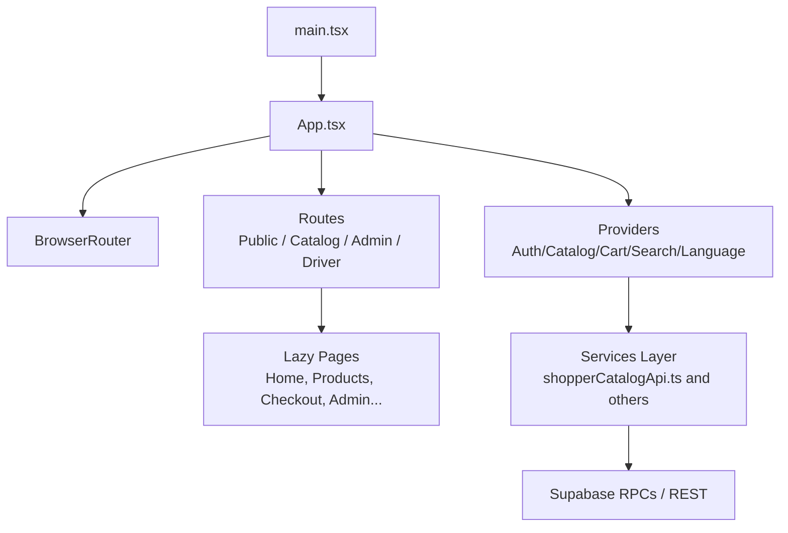
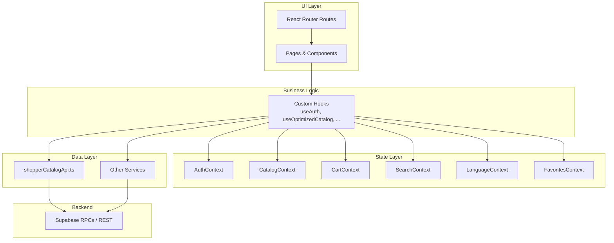
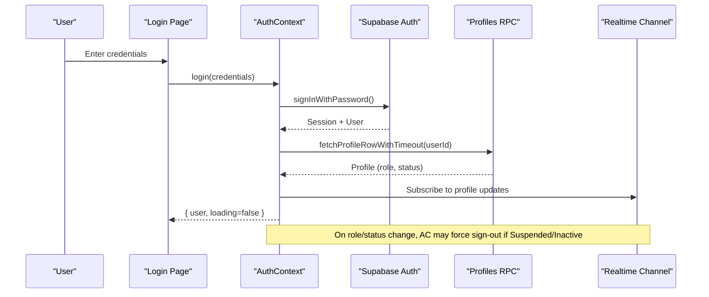
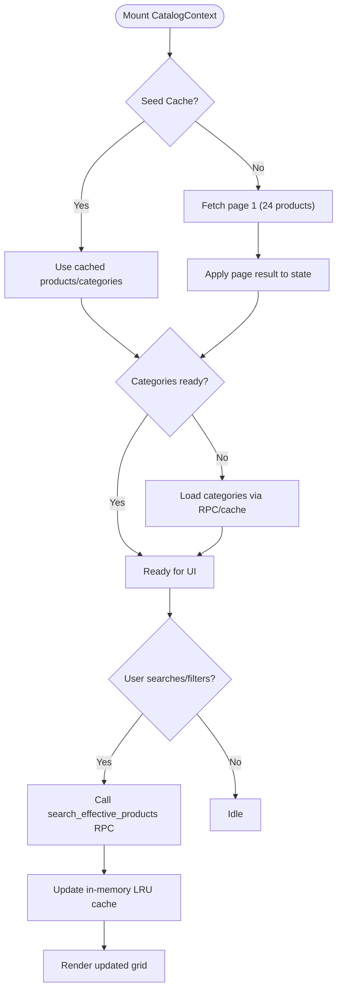
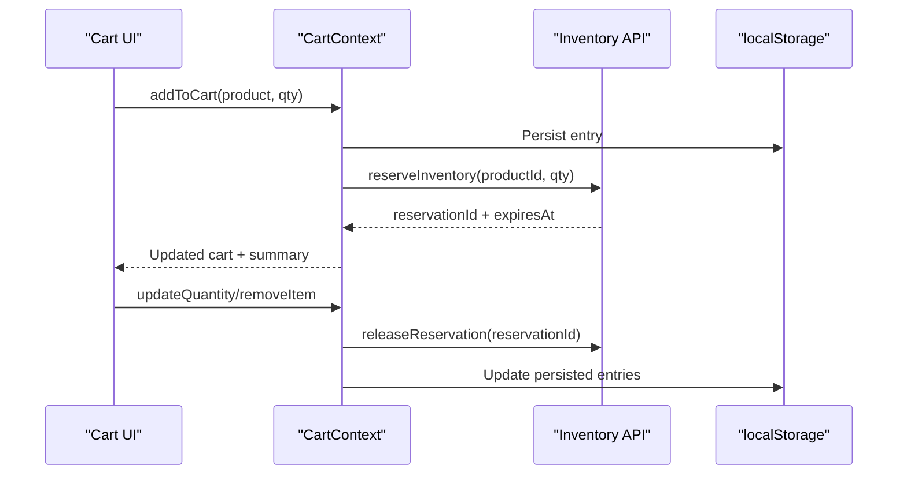
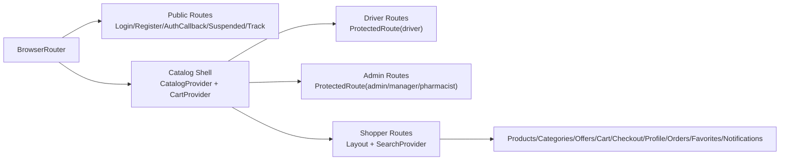
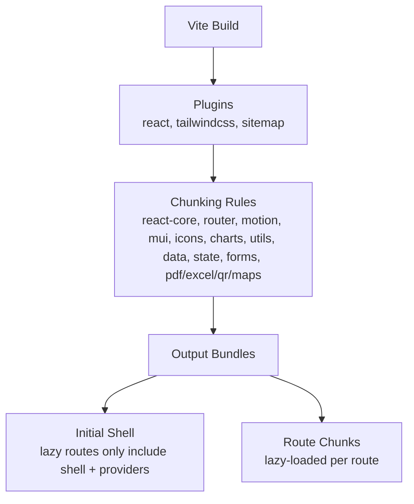
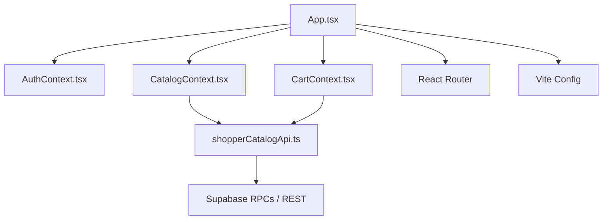

# Frontend Architecture

<cite>
**Referenced Files in This Document**
- [main.tsx](file://apps/shopper-web/src/main.tsx)
- [App.tsx](file://apps/shopper-web/src/app/App.tsx)
- [vite.config.ts](file://apps/shopper-web/vite.config.ts)
- [package.json](file://apps/shopper-web/package.json)
- [AuthContext.tsx](file://apps/shopper-web/src/contexts/AuthContext.tsx)
- [CartContext.tsx](file://apps/shopper-web/src/contexts/CartContext.tsx)
- [CatalogContext.tsx](file://apps/shopper-web/src/contexts/CatalogContext.tsx)
- [shopperCatalogApi.ts](file://apps/shopper-web/src/services/shopperCatalogApi.ts)
</cite>

## Table of Contents
1. Introduction
2. Project Structure
3. Core Components
4. Architecture Overview
5. Detailed Component Analysis
6. Dependency Analysis
7. Performance Considerations
8. Troubleshooting Guide
9. Conclusion

## Introduction
This document explains the frontend architecture of the React web application under apps/shopper-web. It covers component hierarchy, state management with Context and React Query, routing via React Router, context providers for global state, separation between UI components, business logic hooks, and API services. It also documents the Vite build process, code splitting strategies, performance optimizations, authentication flow, error boundaries, and testing considerations.

## Project Structure
The shopper-web app is a Vite-based React application organized into feature-oriented directories:
- Entry and bootstrapping: main.tsx sets up providers, environment configuration, and renders the root App.
- Routing and layout: App.tsx defines routes, protected areas, lazy-loaded pages, and shell providers like CatalogProvider and CartProvider.
- Global state: contexts folder holds domain-specific providers (Auth, Cart, Catalog, Favorites, Language, Search).
- Services: services folder encapsulates API calls (catalog, orders, inventory, etc.).
- Hooks: reusable business logic hooks live under hooks.
- Build configuration: vite.config.ts configures plugins, aliases, chunking, and optimization.

**Diagram sources**
- [main.tsx:1-60](file://apps/shopper-web/src/main.tsx#L1-L60)
- [App.tsx:1-196](file://apps/shopper-web/src/app/App.tsx#L1-L196)
- [shopperCatalogApi.ts:1-587](file://apps/shopper-web/src/services/shopperCatalogApi.ts#L1-L587)

**Section sources**
- [main.tsx:1-60](file://apps/shopper-web/src/main.tsx#L1-L60)
- [App.tsx:1-196](file://apps/shopper-web/src/app/App.tsx#L1-L196)
- [vite.config.ts:1-204](file://apps/shopper-web/vite.config.ts#L1-L204)
- [package.json:1-26](file://apps/shopper-web/package.json#L1-L26)

## Core Components
- Root bootstrap: main.tsx configures the API client base URLs, initializes location tracking, reports Web Vitals, wraps the app in ErrorBoundary, QueryClientProvider, LanguageProvider, AuthProvider, and FavoritesProvider, then renders App.
- Application shell: App.tsx uses BrowserRouter, MotionConfig, and defines route groups:
  - Public routes: login, register, auth callback, suspended pages, order tracking.
  - Catalog routes: wrapped in CatalogProvider + CartProvider; includes driver and admin sections with role guards.
  - Shopper routes: wrapped in SearchProvider and Layout; includes cart, checkout, products, categories, offers, profile, orders, favorites, notifications.
- Providers:
  - AuthContext: manages user session, roles, status, sign-in/sign-out, Google OAuth, realtime role/status updates, and forced sign-out on suspension/inactivation.
  - CatalogContext: manages product catalog state, server-side pagination/search/filtering, full-catalog background load, category list, and metrics.
  - CartContext: manages cart items, local storage persistence, inventory reservations, summary calculations, and online/offline behavior.

**Section sources**
- [main.tsx:1-60](file://apps/shopper-web/src/main.tsx#L1-L60)
- [App.tsx:1-196](file://apps/shopper-web/src/app/App.tsx#L1-L196)
- [AuthContext.tsx:1-738](file://apps/shopper-web/src/contexts/AuthContext.tsx#L1-L738)
- [CatalogContext.tsx:1-505](file://apps/shopper-web/src/contexts/CatalogContext.tsx#L1-L505)
- [CartContext.tsx:1-560](file://apps/shopper-web/src/contexts/CartContext.tsx#L1-L560)

## Architecture Overview
High-level architecture emphasizes clear separation:
- UI layer: React components/pages rendered by React Router.
- State layer: Context providers for auth, catalog, cart, search, language, favorites.
- Business logic: Custom hooks encapsulate complex behaviors (e.g., useAuth, useOptimizedCatalog).
- Data layer: Services that call Supabase RPCs and REST endpoints, with caching and retries.
- Build layer: Vite with manual chunking, code splitting via lazy(), and optimized dependencies.

**Diagram sources**
- [App.tsx:1-196](file://apps/shopper-web/src/app/App.tsx#L1-L196)
- [AuthContext.tsx:1-738](file://apps/shopper-web/src/contexts/AuthContext.tsx#L1-L738)
- [CatalogContext.tsx:1-505](file://apps/shopper-web/src/contexts/CatalogContext.tsx#L1-L505)
- [CartContext.tsx:1-560](file://apps/shopper-web/src/contexts/CartContext.tsx#L1-L560)
- [shopperCatalogApi.ts:1-587](file://apps/shopper-web/src/services/shopperCatalogApi.ts#L1-L587)

## Detailed Component Analysis

### Authentication Flow
- Provider setup: main.tsx mounts AuthProvider above BrowserRouter so auth state is available globally.
- Session handling: AuthContext subscribes to Supabase auth events, resolves user profiles with timeouts, and handles INITIAL_SESSION reliably.
- Role and status: Realtime subscription listens for profile updates; suspensions or inactivity trigger forced sign-out and redirects.
- Login methods: Password-based login and Google OAuth redirect; both resolve to the same event-driven flow.
- Protected routes: App.tsx uses ProtectedRoute and role-based wrappers for admin and driver sections.

**Diagram sources**
- [AuthContext.tsx:244-389](file://apps/shopper-web/src/contexts/AuthContext.tsx#L244-L389)
- [AuthContext.tsx:391-521](file://apps/shopper-web/src/contexts/AuthContext.tsx#L391-L521)
- [AuthContext.tsx:524-689](file://apps/shopper-web/src/contexts/AuthContext.tsx#L524-L689)
- [App.tsx:123-151](file://apps/shopper-web/src/app/App.tsx#L123-L151)

**Section sources**
- [AuthContext.tsx:1-738](file://apps/shopper-web/src/contexts/AuthContext.tsx#L1-L738)
- [App.tsx:108-181](file://apps/shopper-web/src/app/App.tsx#L108-L181)

### Catalog and Product Data Flow
- Fast first paint: CatalogContext fetches only page 1 (24 products) on mount; categories are loaded from cache or RPC.
- Server-side pagination/search/filter: Uses shopperCatalogApi.ts to call search_effective_products RPC with filters and pagination.
- Full catalog: Optional background refresh via refreshCatalog() for admin features; not auto-fetched to avoid heavy loads.
- Caching: In-memory LRU page cache with TTL; localStorage category cache with 30-minute TTL; snapshot caching for full catalog.

**Diagram sources**
- [CatalogContext.tsx:117-242](file://apps/shopper-web/src/contexts/CatalogContext.tsx#L117-L242)
- [shopperCatalogApi.ts:259-386](file://apps/shopper-web/src/services/shopperCatalogApi.ts#L259-L386)
- [shopperCatalogApi.ts:464-484](file://apps/shopper-web/src/services/shopperCatalogApi.ts#L464-L484)

**Section sources**
- [CatalogContext.tsx:1-505](file://apps/shopper-web/src/contexts/CatalogContext.tsx#L1-L505)
- [shopperCatalogApi.ts:1-587](file://apps/shopper-web/src/services/shopperCatalogApi.ts#L1-L587)

### Cart Management and Inventory Reservations
- Local persistence: CartContext persists entries to localStorage and hydrates them when catalog data is available.
- Online behavior: When online and authenticated, attempts to reserve inventory for cart items; releases reservations on changes or removals.
- Summary computation: Uses pricing utilities to compute subtotal, discount, tax, shipping, total.
- Robustness: Guards against offline state, missing products, expired reservations, and insufficient stock.

**Diagram sources**
- [CartContext.tsx:197-388](file://apps/shopper-web/src/contexts/CartContext.tsx#L197-L388)
- [CartContext.tsx:414-527](file://apps/shopper-web/src/contexts/CartContext.tsx#L414-L527)

**Section sources**
- [CartContext.tsx:1-560](file://apps/shopper-web/src/contexts/CartContext.tsx#L1-L560)

### Routing Structure and Code Splitting
- Route organization:
  - Public routes: login, register, auth callback, suspended pages, order tracking.
  - Catalog routes: driver and admin sections with role protection; shopper routes under Layout with SearchProvider.
- Lazy loading: All major pages are lazy() wrapped and Suspense fallbacks provide consistent loading states.
- Navigation progress: TopProgressBar indicates navigation transitions; BootstrapBlockingProvider gates UI during auth loading.

**Diagram sources**
- [App.tsx:108-181](file://apps/shopper-web/src/app/App.tsx#L108-L181)

**Section sources**
- [App.tsx:1-196](file://apps/shopper-web/src/app/App.tsx#L1-L196)

### Build Process and Optimization (Vite)
- Plugins: React, Tailwind CSS, custom sitemap generation plugin runs after bundle close.
- Aliases: Centralized imports for packages/types, contracts, api-client, domain modules, and UI libraries.
- Chunking strategy: Manual chunks group react-core, router, motion, MUI/emotion, icons, charts, utils, data, state, forms, and large optional libs (pdf, excel, qr, maps).
- Budgeting: Warns at 600 KB chunk size; targets initial shell ≤ 250 KB gzipped via lazy routes.
- Dev server: Allows access to workspace and packages for monorepo development.

**Diagram sources**
- [vite.config.ts:1-204](file://apps/shopper-web/vite.config.ts#L1-L204)

**Section sources**
- [vite.config.ts:1-204](file://apps/shopper-web/vite.config.ts#L1-L204)
- [package.json:1-26](file://apps/shopper-web/package.json#L1-L26)

### Error Boundaries and Resilience
- Root boundary: main.tsx wraps the app in ErrorBoundary to catch rendering errors.
- Catalog resilience: CatalogContext has emergency timers to unblock UI if network hangs; serves stale cache when possible.
- Auth resilience: AuthContext uses timeouts for profile fetch and emergency timeout to ensure loading clears; realtime channel retry on errors.
- Cart resilience: Gracefully handles missing products, expired reservations, and insufficient stock; releases reservations on mutations.

**Section sources**
- [main.tsx:42-59](file://apps/shopper-web/src/main.tsx#L42-L59)
- [CatalogContext.tsx:186-222](file://apps/shopper-web/src/contexts/CatalogContext.tsx#L186-L222)
- [AuthContext.tsx:313-389](file://apps/shopper-web/src/contexts/AuthContext.tsx#L313-L389)
- [CartContext.tsx:273-340](file://apps/shopper-web/src/contexts/CartContext.tsx#L273-L340)

### Testing Architecture
- Unit tests: Jest configuration exists in shopper-native; for shopper-web, consider adding Vitest or Jest with React Testing Library to test hooks, contexts, and components.
- Integration tests: Test route guards, provider interactions, and API service mocks using Supabase client stubs.
- E2E tests: Consider Playwright or Cypress for critical flows (login, catalog browsing, checkout).
- Mocking: Mock Supabase RPCs and REST endpoints in services to isolate unit tests from backend.

[No sources needed since this section provides general guidance]

## Dependency Analysis
- Internal dependencies:
  - App depends on providers (Auth, Catalog, Cart, Search, Language, Favorites).
  - CatalogContext depends on shopperCatalogApi for paginated data and categories.
  - CartContext depends on shopperCatalogApi for product resolution and inventory APIs for reservations.
- External dependencies:
  - React Router for routing.
  - Supabase for auth, RPCs, and realtime.
  - Vite for build tooling and chunking.
  - Tailwind CSS for styling.

**Diagram sources**
- [App.tsx:1-196](file://apps/shopper-web/src/app/App.tsx#L1-L196)
- [CatalogContext.tsx:1-505](file://apps/shopper-web/src/contexts/CatalogContext.tsx#L1-L505)
- [CartContext.tsx:1-560](file://apps/shopper-web/src/contexts/CartContext.tsx#L1-L560)
- [shopperCatalogApi.ts:1-587](file://apps/shopper-web/src/services/shopperCatalogApi.ts#L1-L587)

**Section sources**
- [App.tsx:1-196](file://apps/shopper-web/src/app/App.tsx#L1-L196)
- [CatalogContext.tsx:1-505](file://apps/shopper-web/src/contexts/CatalogContext.tsx#L1-L505)
- [CartContext.tsx:1-560](file://apps/shopper-web/src/contexts/CartContext.tsx#L1-L560)
- [shopperCatalogApi.ts:1-587](file://apps/shopper-web/src/services/shopperCatalogApi.ts#L1-L587)

## Performance Considerations
- Initial shell optimization: Lazy routes ensure only essential code loads first; manual chunking isolates heavy libraries.
- Catalog performance: Page-1 fetch for fast first paint; server-side search/filter reduces payload; LRU page cache minimizes network calls; category cache avoids repeated RPCs.
- Auth performance: Timeout-guarded profile fetch prevents indefinite blocking; realtime updates avoid unnecessary refetches.
- Cart performance: Local storage persistence avoids re-fetching; reservation lifecycle prevents stale inventory locks; optimistic updates improve perceived responsiveness.
- Monitoring: Web Vitals reporting enabled at startup for performance insights.

[No sources needed since this section provides general guidance]

## Troubleshooting Guide
- Auth issues:
  - If login fails due to invalid credentials, check error messages thrown by AuthContext login method.
  - For slow cold starts, profile fetch timeout ensures UI remains responsive; background retry updates role once available.
  - Realtime channel errors trigger retries; monitor logs for CHANNEL_ERROR/TIMED_OUT.
- Catalog issues:
  - If search shows no results, verify RPC column name mapping and normalization; ensure search queries are trimmed and valid.
  - Category mismatches resolved by fetching DB-driven categories; stale caches invalidated on refresh.
- Cart issues:
  - Insufficient stock or expired reservations handled gracefully; check reservation IDs and expiry times.
  - Offline mode disables reservation attempts; resume when online.

**Section sources**
- [AuthContext.tsx:524-689](file://apps/shopper-web/src/contexts/AuthContext.tsx#L524-L689)
- [AuthContext.tsx:476-521](file://apps/shopper-web/src/contexts/AuthContext.tsx#L476-L521)
- [shopperCatalogApi.ts:290-386](file://apps/shopper-web/src/services/shopperCatalogApi.ts#L290-L386)
- [CartContext.tsx:273-340](file://apps/shopper-web/src/contexts/CartContext.tsx#L273-L340)

## Conclusion
The shopper-web frontend employs a layered architecture with clear separation between UI, state, business logic, and data layers. Context providers manage global state, while services encapsulate API interactions with robust caching and error handling. Vite’s code splitting and manual chunking optimize performance, and resilient patterns ensure reliability under network variability. The authentication flow integrates seamlessly with Supabase, and route protection enforces role-based access. Continuous monitoring via Web Vitals supports ongoing performance improvements.