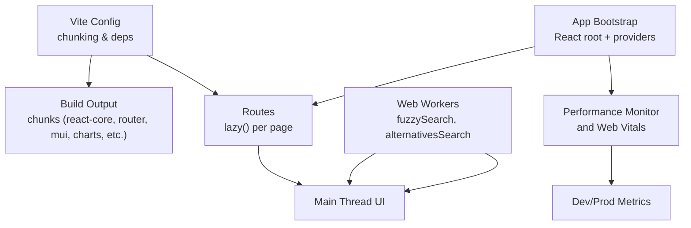
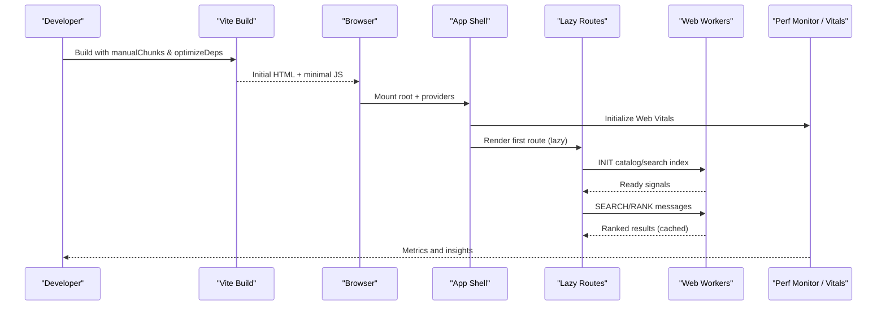
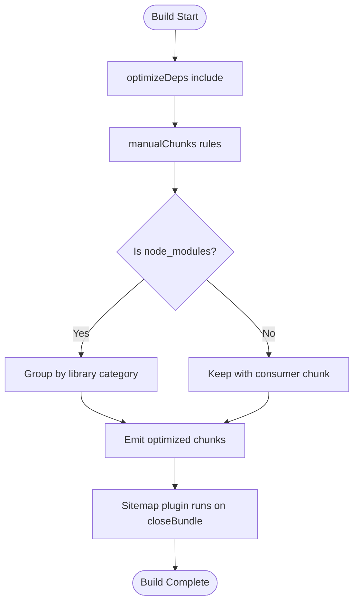
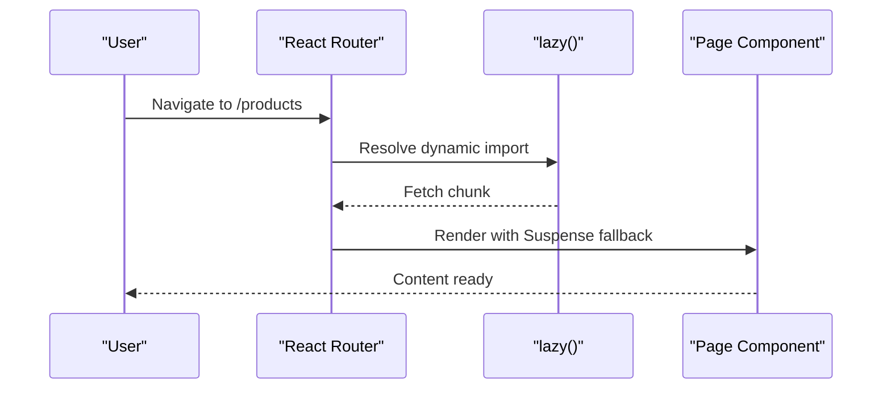
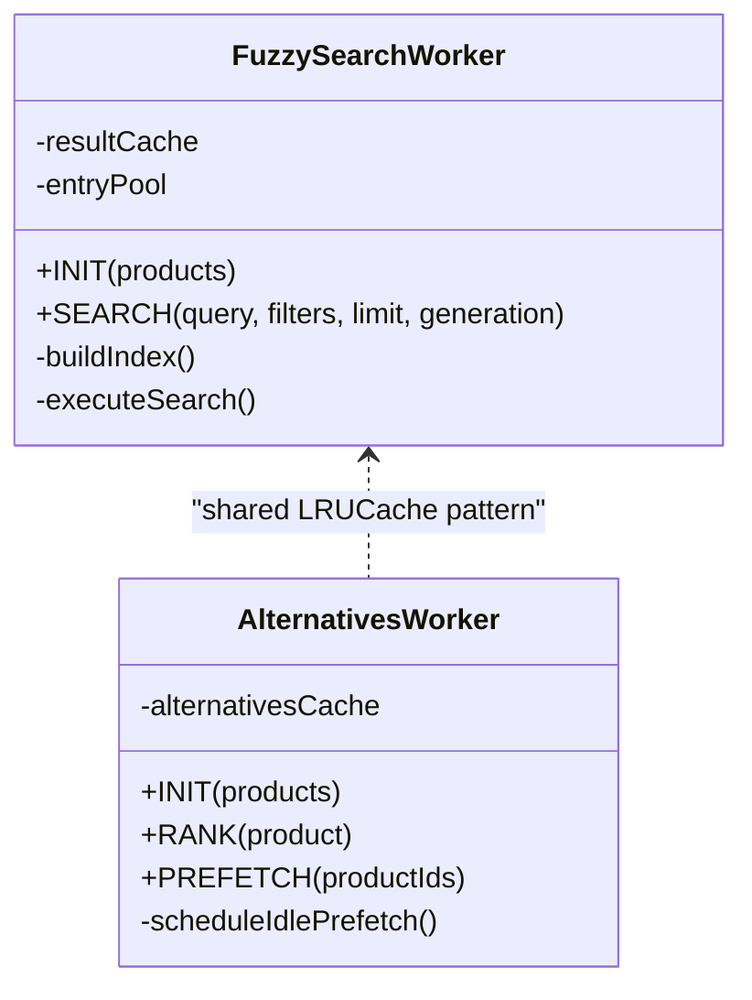
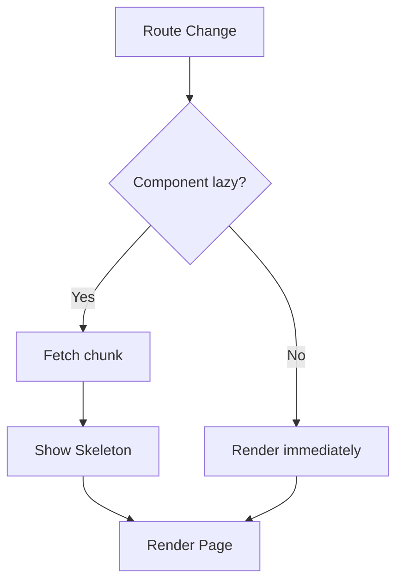
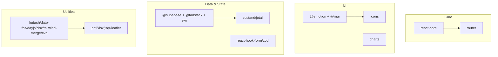

# Performance Optimization

<cite>
**Referenced Files in This Document**
- [vite.config.ts](file://apps/shopper-web/vite.config.ts)
- [OPTIMIZATION_SETUP.md](file://apps/shopper-web/OPTIMIZATION_SETUP.md)
- [PERFORMANCE_OPTIMIZATION_GUIDE.md](file://PERFORMANCE_OPTIMIZATION_GUIDE.md)
- [fuzzySearch.worker.ts](file://apps/shopper-web/src/workers/fuzzySearch.worker.ts)
- [alternativesSearch.worker.ts](file://apps/shopper-web/src/workers/alternativesSearch.worker.ts)
- [main.tsx](file://apps/shopper-web/src/main.tsx)
- [App.tsx](file://apps/shopper-web/src/app/App.tsx)
</cite>

## Table of Contents
1. [Introduction](#introduction)
2. [Project Structure](#project-structure)
3. [Core Components](#core-components)
4. [Architecture Overview](#architecture-overview)
5. [Detailed Component Analysis](#detailed-component-analysis)
6. [Dependency Analysis](#dependency-analysis)
7. [Performance Considerations](#performance-considerations)
8. [Troubleshooting Guide](#troubleshooting-guide)
9. [Conclusion](#conclusion)
10. [Appendices](#appendices)

## Introduction
This document explains the performance optimization techniques implemented in the React web application, focusing on Vite build configuration, code splitting, bundle optimization, lazy loading, memoization patterns, rendering optimizations, Web Workers for heavy computations, image and caching strategies, monitoring and profiling, memory management, and anti-pattern prevention. It synthesizes findings from the Vite configuration, worker implementations, app bootstrap, and route-level lazy loading to provide a comprehensive guide for maintaining optimal performance.

## Project Structure
The shopper-web application is built with Vite and React. The build pipeline uses custom chunking, dependency pre-bundling, and a sitemap plugin. Routes are lazily loaded to minimize initial payload. Web Workers offload expensive search and ranking tasks. A performance monitor and Web Vitals reporting are integrated at startup.

**Diagram sources**
- [vite.config.ts:28-80](file://apps/shopper-web/vite.config.ts#L28-L80)
- [vite.config.ts:81-199](file://apps/shopper-web/vite.config.ts#L81-L199)
- [App.tsx:1-55](file://apps/shopper-web/src/app/App.tsx#L1-L55)
- [main.tsx:19-31](file://apps/shopper-web/src/main.tsx#L19-L31)
- [fuzzySearch.worker.ts:1-67](file://apps/shopper-web/src/workers/fuzzySearch.worker.ts#L1-L67)
- [alternativesSearch.worker.ts:1-43](file://apps/shopper-web/src/workers/alternativesSearch.worker.ts#L1-L43)

**Section sources**
- [vite.config.ts:28-80](file://apps/shopper-web/vite.config.ts#L28-L80)
- [vite.config.ts:81-199](file://apps/shopper-web/vite.config.ts#L81-L199)
- [App.tsx:1-55](file://apps/shopper-web/src/app/App.tsx#L1-L55)
- [main.tsx:19-31](file://apps/shopper-web/src/main.tsx#L19-L31)

## Core Components
- Vite build configuration:
  - Dependency pre-bundling for key packages to speed up dev and cold starts.
  - Custom manualChunks to isolate core libraries (React, Router, MUI/emotion, icons, charts, data layer, state, forms, maps, PDF/XLSX/QR).
  - Chunk size warning limit to guard bundle growth.
  - Assets include for SVG/CSV raw imports.
  - Sitemap generation plugin post-build.
- Lazy route loading:
  - All routes use React.lazy with Suspense fallbacks to defer non-critical code until navigation.
- Web Workers:
  - Fuzzy search worker builds an inverted index and trie, caches results, and supports cancellation via generation counters or SharedArrayBuffer.
  - Alternatives ranking worker precomputes alternatives for visible products and caches them.
- Performance monitoring:
  - Web Vitals reporting initialized at app start.
  - In-app performance monitors track load times, cache hit rates, and metrics.

**Section sources**
- [vite.config.ts:75-80](file://apps/shopper-web/vite.config.ts#L75-L80)
- [vite.config.ts:81-199](file://apps/shopper-web/vite.config.ts#L81-L199)
- [App.tsx:16-55](file://apps/shopper-web/src/app/App.tsx#L16-L55)
- [fuzzySearch.worker.ts:1-67](file://apps/shopper-web/src/workers/fuzzySearch.worker.ts#L1-L67)
- [alternativesSearch.worker.ts:1-43](file://apps/shopper-web/src/workers/alternativesSearch.worker.ts#L1-L43)
- [main.tsx:19-31](file://apps/shopper-web/src/main.tsx#L19-L31)

## Architecture Overview
The runtime architecture separates concerns across build-time bundling, runtime routing, and background computation:

**Diagram sources**
- [vite.config.ts:28-80](file://apps/shopper-web/vite.config.ts#L28-L80)
- [vite.config.ts:81-199](file://apps/shopper-web/vite.config.ts#L81-L199)
- [App.tsx:16-55](file://apps/shopper-web/src/app/App.tsx#L16-L55)
- [fuzzySearch.worker.ts:378-441](file://apps/shopper-web/src/workers/fuzzySearch.worker.ts#L378-L441)
- [alternativesSearch.worker.ts:170-208](file://apps/shopper-web/src/workers/alternativesSearch.worker.ts#L170-L208)
- [main.tsx:19-31](file://apps/shopper-web/src/main.tsx#L19-L31)

## Detailed Component Analysis

### Vite Build Configuration and Bundle Optimization
- Dependency optimization:
  - Pre-bundle critical packages to accelerate dev server and reduce parse time.
- Manual chunking strategy:
  - Isolate react-core, router, motion, MUI/emotion, ui-libs, icons, charts, utils, data, state, forms, pdf/excel/qr/maps to improve caching and parallel loading.
- Budget guard:
  - Warn when chunks exceed thresholds to prevent regressions.
- Asset handling:
  - Allow raw imports for SVG/CSV assets.
- Post-build plugin:
  - Generate sitemaps after bundling.

**Diagram sources**
- [vite.config.ts:75-80](file://apps/shopper-web/vite.config.ts#L75-L80)
- [vite.config.ts:81-199](file://apps/shopper-web/vite.config.ts#L81-L199)

**Section sources**
- [vite.config.ts:75-80](file://apps/shopper-web/vite.config.ts#L75-L80)
- [vite.config.ts:81-199](file://apps/shopper-web/vite.config.ts#L81-L199)

### Route-Level Code Splitting and Lazy Loading
- Every route is wrapped with React.lazy and Suspense, ensuring only the necessary code is fetched when navigated to.
- Critical shell (router, providers, layout) loads first; feature pages (admin, driver, product details, cart, checkout, etc.) are deferred.

**Diagram sources**
- [App.tsx:16-55](file://apps/shopper-web/src/app/App.tsx#L16-L55)
- [App.tsx:108-179](file://apps/shopper-web/src/app/App.tsx#L108-L179)

**Section sources**
- [App.tsx:16-55](file://apps/shopper-web/src/app/App.tsx#L16-L55)
- [App.tsx:108-179](file://apps/shopper-web/src/app/App.tsx#L108-L179)

### Web Workers for Heavy Computations
- Fuzzy Search Worker:
  - Builds an inverted index and prefix trie once per catalog snapshot.
  - Uses LRU result cache keyed by normalized query plus filters.
  - Applies filter-before-score to avoid unnecessary scoring.
  - Supports cancellation via generation counter or SharedArrayBuffer to drop stale searches.
  - Memory pool for Entry objects reduces GC pressure during hot paths.
  - Sorted top-K insertion maintains bounded result sets efficiently.
- Alternatives Ranking Worker:
  - Computes alternative products using domain logic.
  - Prefetch engine precomputates alternatives for visible products using microtask scheduling to keep the event loop responsive.
  - LRU cache avoids recomputation across navigations.

**Diagram sources**
- [fuzzySearch.worker.ts:128-179](file://apps/shopper-web/src/workers/fuzzySearch.worker.ts#L128-L179)
- [fuzzySearch.worker.ts:267-376](file://apps/shopper-web/src/workers/fuzzySearch.worker.ts#L267-L376)
- [alternativesSearch.worker.ts:95-125](file://apps/shopper-web/src/workers/alternativesSearch.worker.ts#L95-L125)
- [alternativesSearch.worker.ts:127-166](file://apps/shopper-web/src/workers/alternativesSearch.worker.ts#L127-L166)

**Section sources**
- [fuzzySearch.worker.ts:1-67](file://apps/shopper-web/src/workers/fuzzySearch.worker.ts#L1-L67)
- [fuzzySearch.worker.ts:128-179](file://apps/shopper-web/src/workers/fuzzySearch.worker.ts#L128-L179)
- [fuzzySearch.worker.ts:267-376](file://apps/shopper-web/src/workers/fuzzySearch.worker.ts#L267-L376)
- [alternativesSearch.worker.ts:1-43](file://apps/shopper-web/src/workers/alternativesSearch.worker.ts#L1-L43)
- [alternativesSearch.worker.ts:95-125](file://apps/shopper-web/src/workers/alternativesSearch.worker.ts#L95-L125)
- [alternativesSearch.worker.ts:127-166](file://apps/shopper-web/src/workers/alternativesSearch.worker.ts#L127-L166)

### Memoization and Rendering Optimizations
- Route-level lazy loading reduces initial render work and defers heavy components.
- Providers are scoped to relevant route trees to limit re-renders.
- MotionConfig respects user preferences for reduced motion, minimizing animation overhead.
- Top progress bar and skeleton loaders provide perceived performance improvements during async operations.

**Diagram sources**
- [App.tsx:16-55](file://apps/shopper-web/src/app/App.tsx#L16-L55)
- [App.tsx:108-179](file://apps/shopper-web/src/app/App.tsx#L108-L179)

**Section sources**
- [App.tsx:16-55](file://apps/shopper-web/src/app/App.tsx#L16-L55)
- [App.tsx:108-179](file://apps/shopper-web/src/app/App.tsx#L108-L179)

### Image Optimization Strategies
- Static assets under publicDir are served directly by Vite for fast caching and CDN friendliness.
- Raw asset imports are supported for SVG/CSV, enabling efficient inclusion where needed.
- For further gains, prefer vector formats (SVG) for scalable graphics and consider responsive images at component level.

**Section sources**
- [vite.config.ts:28-37](file://apps/shopper-web/vite.config.ts#L28-L37)
- [vite.config.ts:201-203](file://apps/shopper-web/vite.config.ts#L201-L203)

### Caching Mechanisms
- Client-side LRU caches:
  - Worker-side caches for search results and alternatives ranking to avoid redundant computation.
- Catalog and API caching:
  - Application-level caching strategies referenced in optimization guides (e.g., server-side pagination, LRU eviction, TTL-based invalidation).
- Database indexing:
  - Optimized indexes are essential for query performance and are highlighted in setup documentation.

**Section sources**
- [fuzzySearch.worker.ts:170-189](file://apps/shopper-web/src/workers/fuzzySearch.worker.ts#L170-L189)
- [alternativesSearch.worker.ts:111-118](file://apps/shopper-web/src/workers/alternativesSearch.worker.ts#L111-L118)
- [OPTIMIZATION_SETUP.md:45-59](file://apps/shopper-web/OPTIMIZATION_SETUP.md#L45-L59)
- [PERFORMANCE_OPTIMIZATION_GUIDE.md:46-63](file://PERFORMANCE_OPTIMIZATION_GUIDE.md#L46-L63)

### Performance Monitoring and Profiling
- Web Vitals:
  - Initialized at app bootstrap to capture Core Web Vitals in development and production endpoints.
- In-app monitors:
  - Real-time metrics including load times, cache hit rates, and performance grades with actionable tips.
- Development tooling:
  - Use browser performance panels and network waterfall to validate chunk sizes and timing.

**Section sources**
- [main.tsx:19-31](file://apps/shopper-web/src/main.tsx#L19-L31)
- [OPTIMIZATION_SETUP.md:55-59](file://apps/shopper-web/OPTIMIZATION_SETUP.md#L55-L59)
- [PERFORMANCE_OPTIMIZATION_GUIDE.md:129-144](file://PERFORMANCE_OPTIMIZATION_GUIDE.md#L129-L144)

### Memory Management and Cleanup
- Worker memory efficiency:
  - Entry object pooling minimizes allocations during search scoring.
  - Direct assignment of structured clone arrays avoids extra copies during initialization.
- Cancellation:
  - Generation counters and optional SharedArrayBuffer ensure stale searches abort promptly.
- Cache sizing:
  - LRU caches sized appropriately to balance memory usage and hit rates.

**Section sources**
- [fuzzySearch.worker.ts:191-220](file://apps/shopper-web/src/workers/fuzzySearch.worker.ts#L191-L220)
- [fuzzySearch.worker.ts:256-265](file://apps/shopper-web/src/workers/fuzzySearch.worker.ts#L256-L265)
- [alternativesSearch.worker.ts:97-103](file://apps/shopper-web/src/workers/alternativesSearch.worker.ts#L97-L103)

### Preventing Common Performance Anti-Patterns
- Avoid synchronous heavy work on the main thread; delegate to workers.
- Do not load entire catalogs into memory; use pagination and server-side filtering.
- Prefer lazy loading for routes and large libraries.
- Guard against excessive re-renders by scoping providers and using memoization where appropriate.
- Monitor chunk sizes and set budgets to prevent bundle bloat.

[No sources needed since this section provides general guidance]

## Dependency Analysis
The build system groups dependencies into logical chunks to maximize caching and parallelism. Key groupings include core runtime, router, UI libraries, charts, utilities, data layer, state management, forms, and optional features like maps and PDF tools.

**Diagram sources**
- [vite.config.ts:88-199](file://apps/shopper-web/vite.config.ts#L88-L199)

**Section sources**
- [vite.config.ts:88-199](file://apps/shopper-web/vite.config.ts#L88-L199)

## Performance Considerations
- Initial load budget:
  - Configure chunk size warnings to enforce limits and maintain fast Time to Interactive.
- Parallel loading:
  - Leverage multiple chunks to allow browsers to fetch resources concurrently.
- Worker utilization:
  - Offload CPU-intensive tasks (search, ranking) to workers to keep the UI responsive.
- Caching:
  - Combine client-side LRU caches with server-side pagination and database indexes for end-to-end performance.
- Monitoring:
  - Track Core Web Vitals and in-app metrics to detect regressions early.

[No sources needed since this section provides general guidance]

## Troubleshooting Guide
- Slow initial load:
  - Verify chunk sizes and ensure lazy loading is applied to non-critical routes.
  - Check that optimizeDeps includes critical packages.
- Search latency spikes:
  - Ensure the worker index is built and ready before processing searches.
  - Confirm cancellation is active to drop stale queries.
- High memory usage:
  - Review LRU cache sizes and entry pools.
  - Validate that workers reset state on catalog updates.
- Database bottlenecks:
  - Apply recommended indexes and analyze slow queries.

**Section sources**
- [OPTIMIZATION_SETUP.md:90-105](file://apps/shopper-web/OPTIMIZATION_SETUP.md#L90-L105)
- [PERFORMANCE_OPTIMIZATION_GUIDE.md:193-217](file://PERFORMANCE_OPTIMIZATION_GUIDE.md#L193-L217)
- [fuzzySearch.worker.ts:464-484](file://apps/shopper-web/src/workers/fuzzySearch.worker.ts#L464-L484)

## Conclusion
The application employs a robust performance strategy combining Vite’s advanced bundling, route-level code splitting, Web Workers for heavy computation, intelligent caching, and continuous monitoring. These techniques collectively deliver fast initial loads, responsive interactions, and scalable performance even with large datasets. Ongoing monitoring and adherence to chunk budgets will help sustain these gains over time.

[No sources needed since this section summarizes without analyzing specific files]

## Appendices
- Setup references:
  - Product catalog optimization setup guide outlines database indexes, pagination, caching, and monitoring steps.
  - Comprehensive performance guide covers expected improvements, maintenance tasks, and success metrics.

**Section sources**
- [OPTIMIZATION_SETUP.md:1-59](file://apps/shopper-web/OPTIMIZATION_SETUP.md#L1-L59)
- [PERFORMANCE_OPTIMIZATION_GUIDE.md:1-63](file://PERFORMANCE_OPTIMIZATION_GUIDE.md#L1-L63)