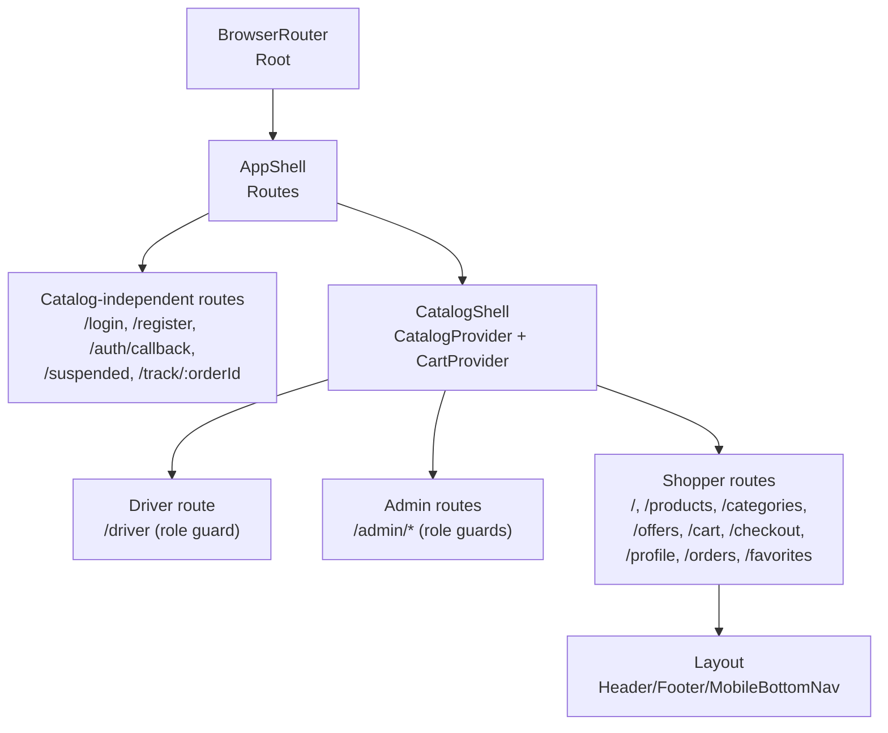
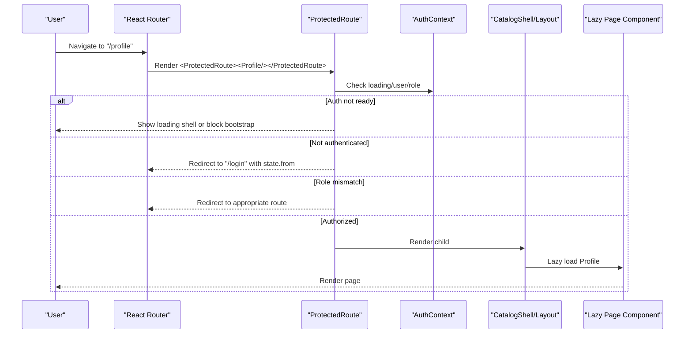
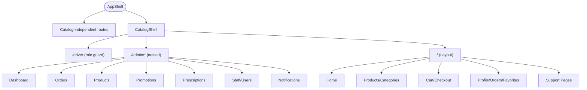
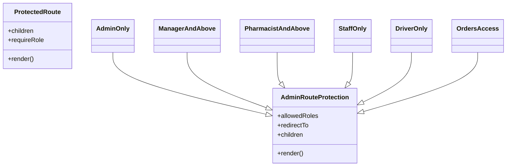
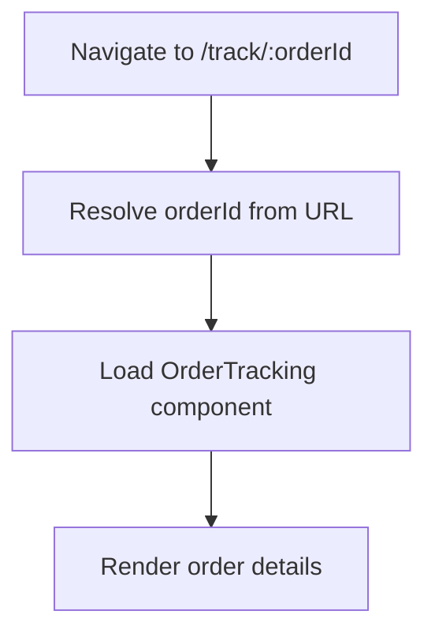
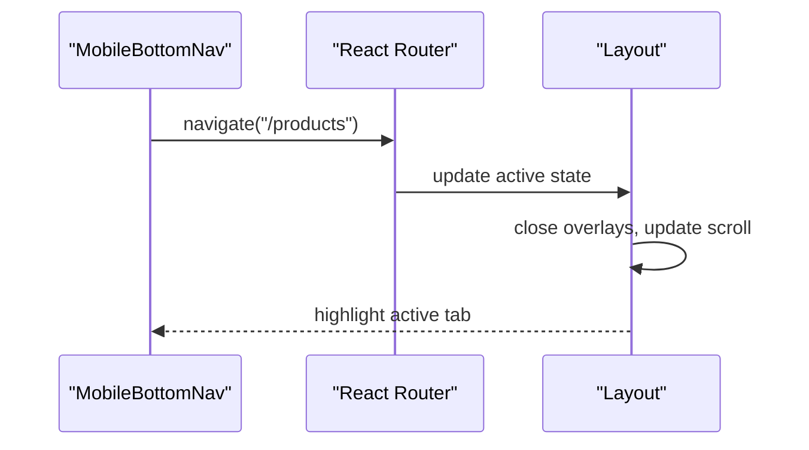
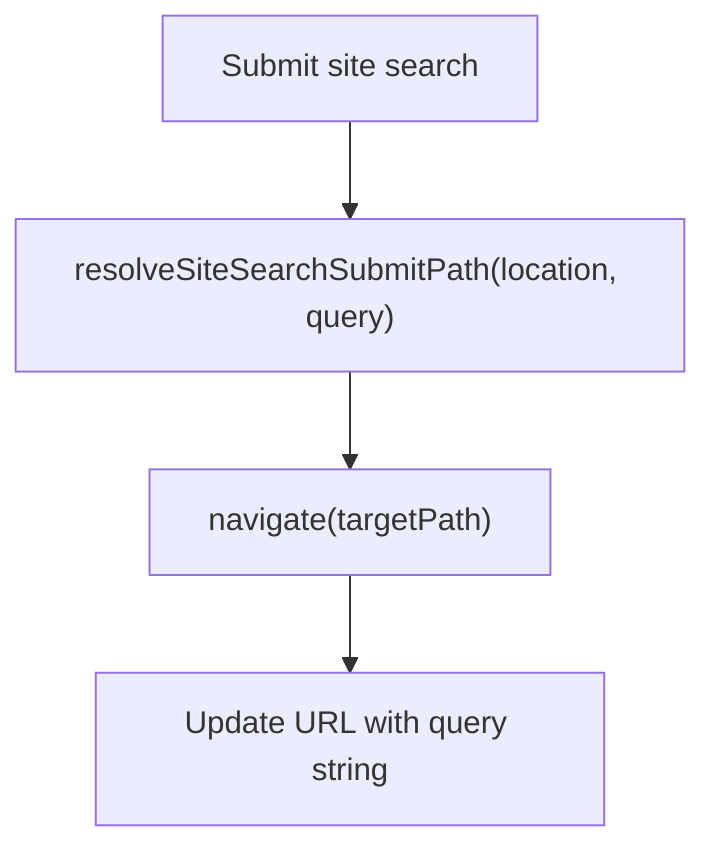
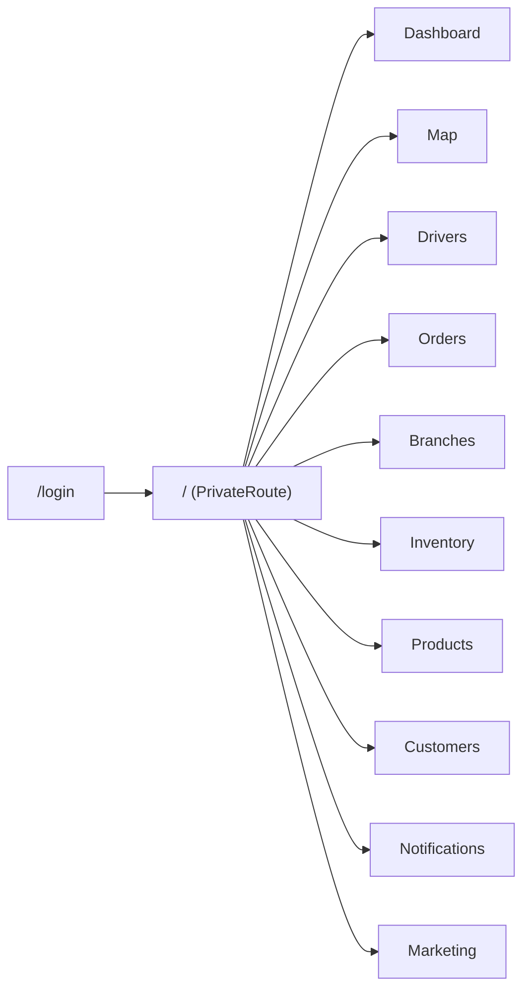
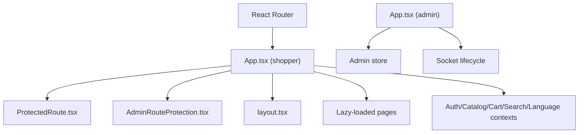

# Routing & Navigation

<cite>
**Referenced Files in This Document**
- [App.tsx](file://apps/shopper-web/src/app/App.tsx)
- [ProtectedRoute.tsx](file://apps/shopper-web/src/components/ProtectedRoute.tsx)
- [AdminRouteProtection.tsx](file://apps/shopper-web/src/app/admin/AdminRouteProtection.tsx)
- [layout.tsx](file://apps/shopper-web/src/app/layout.tsx)
- [App.tsx](file://apps/admin/src/App.tsx)
</cite>

## Table of Contents
1. Introduction
2. Project Structure
3. Core Components
4. Architecture Overview
5. Detailed Component Analysis
6. Dependency Analysis
7. Performance Considerations
8. Troubleshooting Guide
9. Conclusion

## Introduction
This document explains the routing and navigation system across the web applications in this repository, focusing on React Router usage for the shopper web app and a simple router setup for the admin app. It covers route structure, nested routes, dynamic segments, authentication guards, role-based access control, route-based code splitting with lazy loading, mobile bottom navigation, responsive navigation patterns, programmatic navigation, query strings, deep linking, and how routing integrates with authentication and permissions.

## Project Structure
The routing is primarily implemented in the shopper web application using React Router v6 with nested routes and protected components. The admin application uses a simpler flat route tree with a private route wrapper.

Key files:
- Shopper web root routes and shell: apps/shopper-web/src/app/App.tsx
- Protected route component (auth + role checks): apps/shopper-web/src/components/ProtectedRoute.tsx
- Admin-specific role guards: apps/shopper-web/src/app/admin/AdminRouteProtection.tsx
- Shopper layout (header/footer/mobile bottom nav, SEO, scroll handling): apps/shopper-web/src/app/layout.tsx
- Admin app routes: apps/admin/src/App.tsx

**Diagram sources**
- [App.tsx:108-182](file://apps/shopper-web/src/app/App.tsx#L108-L182)
- [layout.tsx:417-700](file://apps/shopper-web/src/app/layout.tsx#L417-L700)

**Section sources**
- [App.tsx:108-182](file://apps/shopper-web/src/app/App.tsx#L108-L182)
- [layout.tsx:417-700](file://apps/shopper-web/src/app/layout.tsx#L417-L700)

## Core Components
- Root router and route tree: Defines top-level routes, nested shells, and redirects. Uses lazy imports to split code per route and Suspense fallbacks for loading states.
- ProtectedRoute: Guards authenticated and role-restricted routes; handles auth loading state and redirects with “from” state preservation.
- AdminRouteProtection: Role-based guards for admin features (admin-only, manager-and-above, pharmacist-and-above, staff-only, driver-only).
- Layout: Provides header, footer, mobile bottom navigation, SEO metadata updates, scroll restoration, and responsive behavior.

**Section sources**
- [App.tsx:16-55](file://apps/shopper-web/src/app/App.tsx#L16-L55)
- [ProtectedRoute.tsx:74-103](file://apps/shopper-web/src/components/ProtectedRoute.tsx#L74-L103)
- [AdminRouteProtection.tsx:23-79](file://apps/shopper-web/src/app/admin/AdminRouteProtection.tsx#L23-L79)
- [layout.tsx:417-700](file://apps/shopper-web/src/app/layout.tsx#L417-L700)

## Architecture Overview
The shopper web app organizes routes into three main groups:
- Catalog-independent routes: login, register, callback, suspended pages, order tracking.
- Catalog shell routes: require catalog context; include driver, admin, and shopper sections.
- Shopper routes: public and protected customer-facing pages under a shared Layout.

Nested routes are used extensively:
- Admin section nests multiple sub-routes under /admin.
- Shopper section nests product/category detail routes and user account routes.

Authentication and authorization:
- Public routes are accessible without auth.
- Protected routes use ProtectedRoute to ensure an authenticated user and optionally enforce roles.
- Admin routes use specialized wrappers for fine-grained role checks.

Code splitting:
- All major route components are lazily loaded with React.lazy and wrapped in Suspense with a consistent skeleton UI.

Mobile bottom navigation:
- The Layout renders a MobileBottomNav for small screens, providing quick access to key shopper routes.

Deep linking and query strings:
- Order tracking supports dynamic segment /track/:orderId.
- Search integration navigates with query parameters via a helper that resolves the target path based on current location.

Scroll and SEO:
- RouteViewportManager restores scroll positions and handles hash scrolling.
- RouteMetaManager updates title, meta tags, canonical links, and JSON-LD structured data on each navigation.

**Diagram sources**
- [ProtectedRoute.tsx:74-103](file://apps/shopper-web/src/components/ProtectedRoute.tsx#L74-L103)
- [App.tsx:154-179](file://apps/shopper-web/src/app/App.tsx#L154-L179)

**Section sources**
- [App.tsx:16-55](file://apps/shopper-web/src/app/App.tsx#L16-L55)
- [ProtectedRoute.tsx:74-103](file://apps/shopper-web/src/components/ProtectedRoute.tsx#L74-L103)
- [AdminRouteProtection.tsx:23-79](file://apps/shopper-web/src/app/admin/AdminRouteProtection.tsx#L23-L79)
- [layout.tsx:245-343](file://apps/shopper-web/src/app/layout.tsx#L245-L343)

## Detailed Component Analysis

### Shopper Web Routes (App.tsx)
- Top-level Routes define:
  - Catalog-independent routes: /login, /register, /auth/callback, /suspended, /suspension-info, /track/:orderId.
  - CatalogShell wrapping driver, admin, and shopper sections.
  - Driver route guarded by role requirement.
  - Admin routes nested under /admin with role-based wrappers for specific pages.
  - Shopper routes nested under / with Layout, including products, categories, offers, cart, checkout, profile, orders, favorites/wishlist, and support pages.
- Code splitting:
  - All route components are imported via React.lazy and rendered inside Suspense with a consistent skeleton.
- Redirects:
  - Legacy /ops redirects to /admin/orders.
  - Unknown paths redirect to home within their respective shells.

**Diagram sources**
- [App.tsx:108-182](file://apps/shopper-web/src/app/App.tsx#L108-L182)

**Section sources**
- [App.tsx:16-55](file://apps/shopper-web/src/app/App.tsx#L16-L55)
- [App.tsx:108-182](file://apps/shopper-web/src/app/App.tsx#L108-L182)

### Authentication and Role Guards
- ProtectedRoute:
  - Shows a branded loading shell while auth is resolving unless bootstrap blocking is active.
  - Redirects unauthenticated users to /login, preserving the intended destination in state.
  - Enforces optional role requirements; if mismatched, redirects to a role-appropriate route.
- AdminRouteProtection:
  - Provides granular wrappers: AdminOnly, ManagerAndAbove, PharmacistAndAbove, StaffOnly, DriverOnly, OrdersAccess.
  - Handles unauthorized access by either redirecting or rendering an AdminUnauthorized page.

**Diagram sources**
- [ProtectedRoute.tsx:74-103](file://apps/shopper-web/src/components/ProtectedRoute.tsx#L74-L103)
- [AdminRouteProtection.tsx:23-79](file://apps/shopper-web/src/app/admin/AdminRouteProtection.tsx#L23-L79)

**Section sources**
- [ProtectedRoute.tsx:74-103](file://apps/shopper-web/src/components/ProtectedRoute.tsx#L74-L103)
- [AdminRouteProtection.tsx:23-79](file://apps/shopper-web/src/app/admin/AdminRouteProtection.tsx#L23-L79)

### Nested Routes and Dynamic Segments
- Nested admin routes under /admin provide a cohesive workspace with index and multiple subpages.
- Dynamic segments:
  - /track/:orderId enables deep linking to order tracking with a URL parameter.
  - Product and category details use dynamic segments for resource identification.

**Diagram sources**
- [App.tsx:115](file://apps/shopper-web/src/app/App.tsx#L115)

**Section sources**
- [App.tsx:131-151](file://apps/shopper-web/src/app/App.tsx#L131-L151)
- [App.tsx:154-179](file://apps/shopper-web/src/app/App.tsx#L154-L179)

### Mobile Bottom Navigation and Responsive Patterns
- MobileBottomNav is integrated into the Layout for small screens, offering quick access to primary shopper routes.
- Header and navigation adapt to screen size; overlays close on route change; search and user menus collapse when needed.
- Scroll restoration and transition classes improve perceived performance during navigation.

**Diagram sources**
- [layout.tsx:417-700](file://apps/shopper-web/src/app/layout.tsx#L417-L700)

**Section sources**
- [layout.tsx:417-700](file://apps/shopper-web/src/app/layout.tsx#L417-L700)

### Programmatic Navigation, Query Strings, and Deep Linking
- Programmatic navigation:
  - Use navigate() from react-router-dom within Layout for actions like logout and cart interactions.
- Query strings:
  - Site search resolves a target path based on current location and navigates with query parameters.
- Deep linking:
  - Hash scrolling is handled to jump to in-page anchors.
  - Order tracking supports deep links via /track/:orderId.

**Diagram sources**
- [layout.tsx:657-665](file://apps/shopper-web/src/app/layout.tsx#L657-L665)

**Section sources**
- [layout.tsx:657-665](file://apps/shopper-web/src/app/layout.tsx#L657-L665)
- [App.tsx:115](file://apps/shopper-web/src/app/App.tsx#L115)

### Integration with Authentication and RBAC
- Public routes do not require authentication.
- Protected routes enforce authentication and optional role checks.
- Admin routes use specialized wrappers to restrict access based on roles.
- Redirects preserve intended destinations to improve UX after login.

**Section sources**
- [ProtectedRoute.tsx:74-103](file://apps/shopper-web/src/components/ProtectedRoute.tsx#L74-L103)
- [AdminRouteProtection.tsx:23-79](file://apps/shopper-web/src/app/admin/AdminRouteProtection.tsx#L23-L79)

### Admin App Routing
- Flat route structure with a PrivateRoute wrapper ensuring authentication before accessing dashboard and management pages.
- Routes include map, drivers, orders, branches, inventory, products, customers, notifications, marketing.

**Diagram sources**
- [App.tsx:42-63](file://apps/admin/src/App.tsx#L42-L63)

**Section sources**
- [App.tsx:20-23](file://apps/admin/src/App.tsx#L20-L23)
- [App.tsx:42-63](file://apps/admin/src/App.tsx#L42-L63)

## Dependency Analysis
- Shopper web routing depends on:
  - React Router (BrowserRouter, Routes, Route, Navigate, useLocation, useNavigate).
  - Context providers (Auth, Catalog, Cart, Search, Language).
  - Custom guards (ProtectedRoute, AdminRouteProtection).
  - Layout components (header/footer/mobile bottom nav).
- Admin app routing depends on:
  - React Router (Routes, Route, Navigate).
  - Local store for authentication state.
  - Socket connection lifecycle tied to authentication.

**Diagram sources**
- [App.tsx:1-15](file://apps/shopper-web/src/app/App.tsx#L1-L15)
- [ProtectedRoute.tsx:1-10](file://apps/shopper-web/src/components/ProtectedRoute.tsx#L1-L10)
- [AdminRouteProtection.tsx:1-12](file://apps/shopper-web/src/app/admin/AdminRouteProtection.tsx#L1-L12)
- [layout.tsx:1-12](file://apps/shopper-web/src/app/layout.tsx#L1-L12)
- [App.tsx:1-18](file://apps/admin/src/App.tsx#L1-L18)

**Section sources**
- [App.tsx:1-15](file://apps/shopper-web/src/app/App.tsx#L1-L15)
- [App.tsx:1-18](file://apps/admin/src/App.tsx#L1-L18)

## Performance Considerations
- Route-based code splitting:
  - All major route components are lazily loaded to reduce initial bundle size.
  - Suspense fallbacks provide consistent loading indicators.
- Bootstrap blocking:
  - Global bootstrap overlay prevents interaction until auth is resolved, improving perceived stability.
- Scroll restoration:
  - Manual scroll restoration avoids jarring jumps and preserves user context across navigations.
- Reduced motion:
  - Respects prefers-reduced-motion to disable transitions for accessibility.

[No sources needed since this section provides general guidance]

## Troubleshooting Guide
- Unexpected redirects:
  - Verify ProtectedRoute role requirements and AdminRouteProtection wrappers for admin pages.
  - Ensure user role matches allowed roles; otherwise, redirects occur to role-appropriate routes.
- Login loop:
  - Confirm that the “from” state is preserved and correctly redirected after authentication.
- Missing content on protected routes:
  - Check that auth loading state is handled; if bootstrap blocking is active, ProtectedRoute may render null.
- Deep link issues:
  - Validate dynamic segments (e.g., /track/:orderId) and ensure the route exists.
  - Confirm hash scrolling logic targets valid elements.

**Section sources**
- [ProtectedRoute.tsx:74-103](file://apps/shopper-web/src/components/ProtectedRoute.tsx#L74-L103)
- [AdminRouteProtection.tsx:23-79](file://apps/shopper-web/src/app/admin/AdminRouteProtection.tsx#L23-L79)
- [layout.tsx:352-411](file://apps/shopper-web/src/app/layout.tsx#L352-L411)

## Conclusion
The routing system leverages React Router’s nested routes, protected components, and lazy loading to deliver a secure, performant, and user-friendly experience. Authentication and role-based access control are enforced at the route level, while the Layout centralizes navigation chrome, SEO, and scroll behavior. The admin app uses a straightforward route tree with a private route wrapper. Together, these patterns support scalable feature growth, clear separation of concerns, and robust navigation across desktop and mobile experiences.