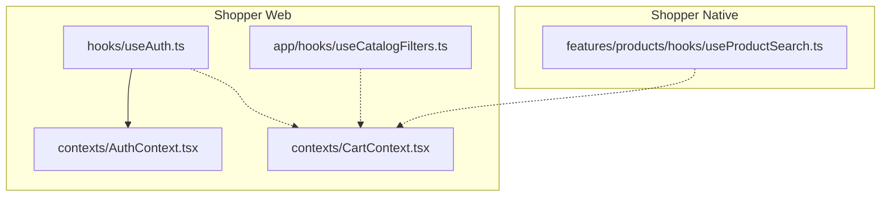
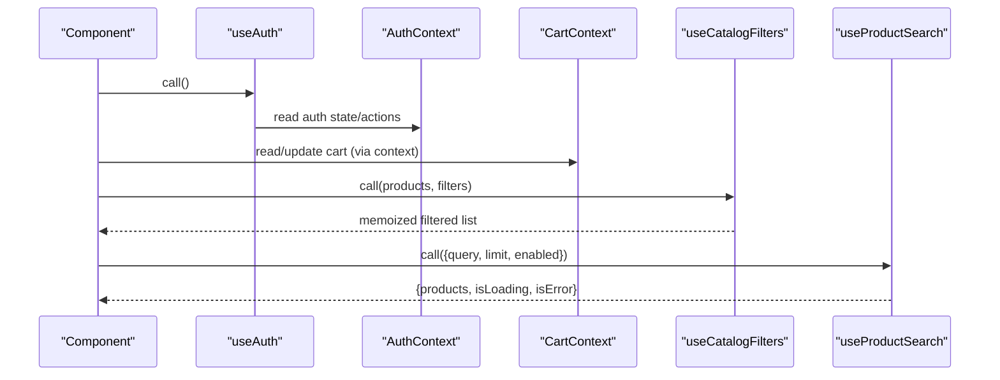
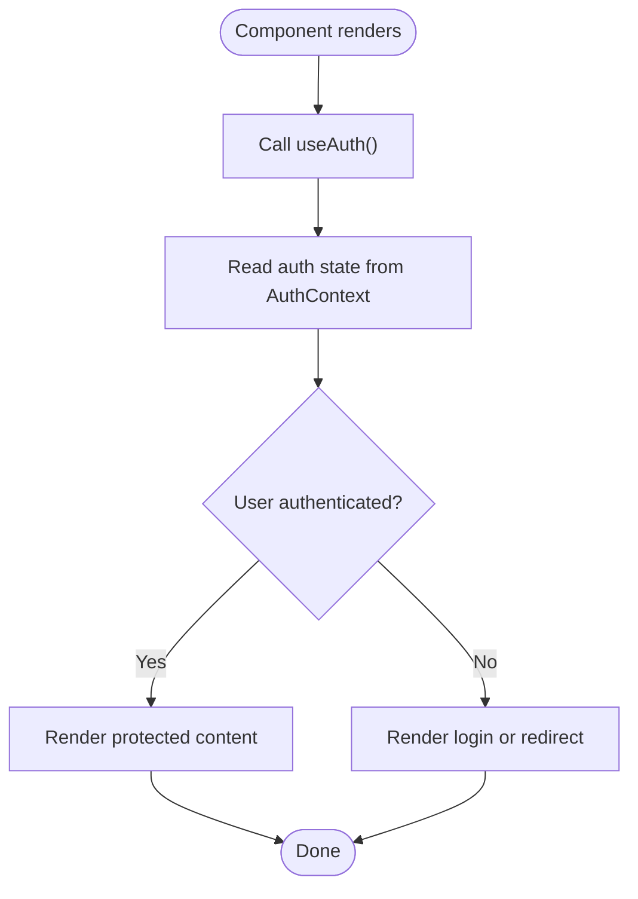
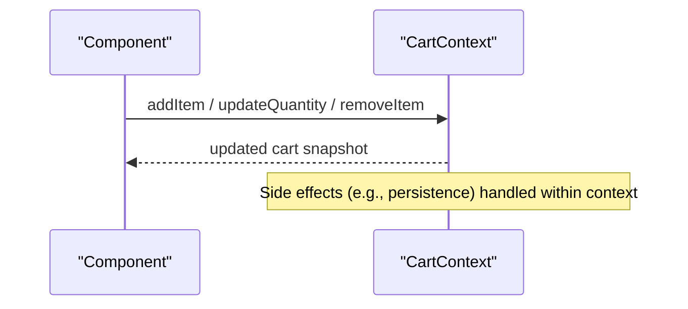
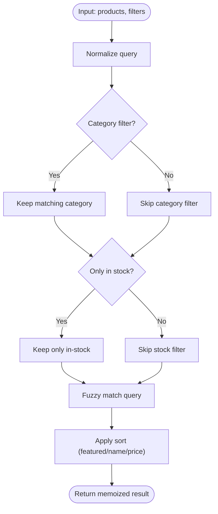
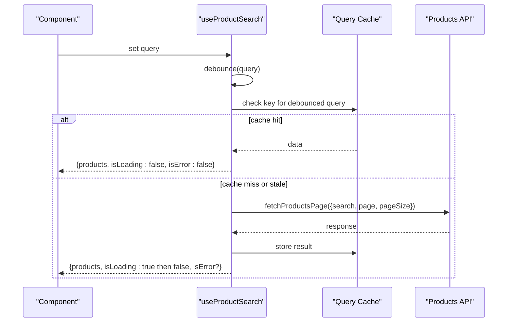
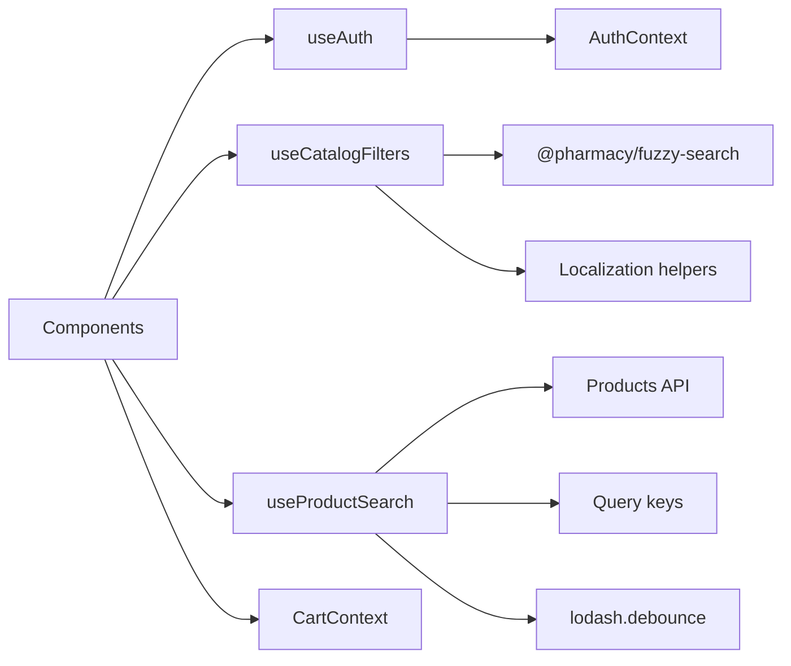

# Custom Hooks for State Management

<cite>
**Referenced Files in This Document**
- [useAuth.ts](file://apps/shopper-web/src/hooks/useAuth.ts)
- [AuthContext.tsx](file://apps/shopper-web/src/contexts/AuthContext.tsx)
- [CartContext.tsx](file://apps/shopper-web/src/contexts/CartContext.tsx)
- [useCatalogFilters.ts](file://apps/shopper-web/src/app/hooks/useCatalogFilters.ts)
- [useProductSearch.ts](file://apps/shopper-native/src/features/products/hooks/useProductSearch.ts)
</cite>

## Table of Contents
1. [Introduction](#introduction)
2. [Project Structure](#project-structure)
3. [Core Components](#core-components)
4. [Architecture Overview](#architecture-overview)
5. [Detailed Component Analysis](#detailed-component-analysis)
6. [Dependency Analysis](#dependency-analysis)
7. [Performance Considerations](#performance-considerations)
8. [Troubleshooting Guide](#troubleshooting-guide)
9. [Conclusion](#conclusion)

## Introduction
This document explains the custom hooks that manage state logic across the application, focusing on authentication, cart operations, catalog filtering, and product search. It covers naming conventions, parameter patterns, return value structures, composition strategies, loading/error handling, side effects, testing best practices, and performance optimization techniques used throughout the codebase.

## Project Structure
The relevant hooks and contexts are organized by app:
- Shopper Web:
  - Authentication hook re-exported from a central context
  - Catalog filtering utilities and hook
  - Cart context (state source for cart-related features)
- Shopper Native:
  - Product search hook with debounced input and query caching

**Diagram sources**
- [useAuth.ts:1-3](file://apps/shopper-web/src/hooks/useAuth.ts#L1-L3)
- [AuthContext.tsx](file://apps/shopper-web/src/contexts/AuthContext.tsx)
- [CartContext.tsx](file://apps/shopper-web/src/contexts/CartContext.tsx)
- [useCatalogFilters.ts:1-162](file://apps/shopper-web/src/app/hooks/useCatalogFilters.ts#L1-L162)
- [useProductSearch.ts:1-74](file://apps/shopper-native/src/features/products/hooks/useProductSearch.ts#L1-L74)

**Section sources**
- [useAuth.ts:1-3](file://apps/shopper-web/src/hooks/useAuth.ts#L1-L3)
- [useCatalogFilters.ts:1-162](file://apps/shopper-web/src/app/hooks/useCatalogFilters.ts#L1-L162)
- [useProductSearch.ts:1-74](file://apps/shopper-native/src/features/products/hooks/useProductSearch.ts#L1-L74)

## Core Components
- useAuth: Provides authenticated user state and actions via a centralized AuthContext. Consumers import the hook from the web hooks barrel which re-exports from the canonical context.
- useCatalogFilters: Pure filter/sort utilities plus a React hook that memoizes filtered results based on products and filters.
- useProductSearch: Debounced search hook returning a small page of products with loading and error states, backed by a query cache.
- Cart integration: While the cart hook is not shown directly here, components typically consume CartContext to read/update cart state; other hooks compose with it where needed.

Naming conventions:
- All hooks follow the useXxx pattern.
- Parameters are grouped into an options object when multiple inputs exist (e.g., useProductSearch).
- Return values are normalized objects exposing data, isLoading, and isError for consistent UI handling.

Parameter patterns:
- Filtering hooks accept stable references for arrays and filter descriptors to optimize recomputation.
- Search hooks accept query strings and optional flags like enabled or limit.

Return value structures:
- Data array or computed list
- Boolean flags for isLoading and isError
- Optional additional metadata as needed

**Section sources**
- [useAuth.ts:1-3](file://apps/shopper-web/src/hooks/useAuth.ts#L1-L3)
- [useCatalogFilters.ts:14-28](file://apps/shopper-web/src/app/hooks/useCatalogFilters.ts#L14-L28)
- [useProductSearch.ts:21-36](file://apps/shopper-native/src/features/products/hooks/useProductSearch.ts#L21-L36)

## Architecture Overview
The hooks form a layered state management approach:
- Contexts provide global state (auth, cart).
- Feature hooks encapsulate domain-specific logic (catalog filters, product search).
- UI components consume hooks and render accordingly.

**Diagram sources**
- [useAuth.ts:1-3](file://apps/shopper-web/src/hooks/useAuth.ts#L1-L3)
- [AuthContext.tsx](file://apps/shopper-web/src/contexts/AuthContext.tsx)
- [CartContext.tsx](file://apps/shopper-web/src/contexts/CartContext.tsx)
- [useCatalogFilters.ts:154-162](file://apps/shopper-web/src/app/hooks/useCatalogFilters.ts#L154-L162)
- [useProductSearch.ts:28-72](file://apps/shopper-native/src/features/products/hooks/useProductSearch.ts#L28-L72)

## Detailed Component Analysis

### Authentication Hook (useAuth)
- Purpose: Exposes current user identity and authentication actions through a single hook.
- Implementation: Re-exports the canonical hook from the AuthContext to keep imports consistent across the app.
- Usage pattern:
  - Call at component top level
  - Access user/session state and login/logout methods
  - Guard routes or conditionally render UI based on auth status

**Diagram sources**
- [useAuth.ts:1-3](file://apps/shopper-web/src/hooks/useAuth.ts#L1-L3)
- [AuthContext.tsx](file://apps/shopper-web/src/contexts/AuthContext.tsx)

**Section sources**
- [useAuth.ts:1-3](file://apps/shopper-web/src/hooks/useAuth.ts#L1-L3)

### Cart Operations (via CartContext)
- Purpose: Centralize cart state (items, quantities, totals) and mutations.
- Integration: Other hooks and components read/write cart state through this context.
- Typical flow:
  - Add/remove items
  - Update quantities
  - Compute totals and eligibility rules
  - Persist to storage if needed

**Diagram sources**
- [CartContext.tsx](file://apps/shopper-web/src/contexts/CartContext.tsx)

**Section sources**
- [CartContext.tsx](file://apps/shopper-web/src/contexts/CartContext.tsx)

### Catalog Filtering (useCatalogFilters)
- Purpose: Filter and sort catalog products based on category, stock, query, and sort mode.
- Key behaviors:
  - Uses safe iterative loops to compute min/max price to avoid V8 argument limits
  - Normalizes query and applies fuzzy matching
  - Sorts by featured relevance, name, or price with deterministic tie-breakers
  - Memoizes results using useMemo for performance

**Diagram sources**
- [useCatalogFilters.ts:32-72](file://apps/shopper-web/src/app/hooks/useCatalogFilters.ts#L32-L72)
- [useCatalogFilters.ts:76-150](file://apps/shopper-web/src/app/hooks/useCatalogFilters.ts#L76-L150)
- [useCatalogFilters.ts:154-162](file://apps/shopper-web/src/app/hooks/useCatalogFilters.ts#L154-L162)

**Section sources**
- [useCatalogFilters.ts:14-28](file://apps/shopper-web/src/app/hooks/useCatalogFilters.ts#L14-L28)
- [useCatalogFilters.ts:32-72](file://apps/shopper-web/src/app/hooks/useCatalogFilters.ts#L32-L72)
- [useCatalogFilters.ts:76-150](file://apps/shopper-web/src/app/hooks/useCatalogFilters.ts#L76-L150)
- [useCatalogFilters.ts:154-162](file://apps/shopper-web/src/app/hooks/useCatalogFilters.ts#L154-L162)

### Product Search (useProductSearch)
- Purpose: Provide fast, debounced product suggestions with minimal network overhead.
- Behavior:
  - Debounces input changes to reduce requests
  - Queries a small page size optimized for autocomplete
  - Returns flat list with isLoading and isError
  - Integrates with a query cache for efficient refetching

**Diagram sources**
- [useProductSearch.ts:28-72](file://apps/shopper-native/src/features/products/hooks/useProductSearch.ts#L28-L72)

**Section sources**
- [useProductSearch.ts:1-74](file://apps/shopper-native/src/features/products/hooks/useProductSearch.ts#L1-L74)

## Dependency Analysis
- useAuth depends on AuthContext for user session state and actions.
- useCatalogFilters depends on catalog types and localization helpers; uses a fuzzy search utility for query matching.
- useProductSearch depends on a products API and a query key factory for caching; uses lodash.debounce for input throttling.
- CartContext is consumed by components and potentially composed with feature hooks to coordinate cart state with other features.

**Diagram sources**
- [useAuth.ts:1-3](file://apps/shopper-web/src/hooks/useAuth.ts#L1-L3)
- [useCatalogFilters.ts:14-18](file://apps/shopper-web/src/app/hooks/useCatalogFilters.ts#L14-L18)
- [useProductSearch.ts:11-16](file://apps/shopper-native/src/features/products/hooks/useProductSearch.ts#L11-L16)
- [CartContext.tsx](file://apps/shopper-web/src/contexts/CartContext.tsx)

**Section sources**
- [useAuth.ts:1-3](file://apps/shopper-web/src/hooks/useAuth.ts#L1-L3)
- [useCatalogFilters.ts:14-18](file://apps/shopper-web/src/app/hooks/useCatalogFilters.ts#L14-L18)
- [useProductSearch.ts:11-16](file://apps/shopper-native/src/features/products/hooks/useProductSearch.ts#L11-L16)

## Performance Considerations
- Memoization:
  - useCatalogFilters uses useMemo to avoid recalculating filtered lists on every render.
- Safe iteration:
  - Price range calculations use iterative loops to prevent stack overflows with large datasets.
- Debouncing:
  - useProductSearch debounces user input to minimize network calls during typing.
- Query caching:
  - useProductSearch leverages a query cache to reuse recent results and reduce redundant requests.
- Composition:
  - Compose hooks to isolate concerns; pass stable references (arrays, filter objects) to prevent unnecessary recomputations.

[No sources needed since this section provides general guidance]

## Troubleshooting Guide
- Authentication issues:
  - Ensure the component is wrapped under the provider that supplies AuthContext.
  - Verify that the re-exported useAuth points to the canonical context path.
- Catalog filtering anomalies:
  - Check that filter objects are created stably (avoid recreating them each render).
  - Confirm category values match expected identifiers and that query normalization trims whitespace.
- Search not triggering:
  - Verify enabled flag allows queries when necessary.
  - Ensure debounced query becomes non-empty before enabling the request.
  - Inspect query keys to confirm uniqueness per search term.
- Cart inconsistencies:
  - Confirm that all mutations go through CartContext to maintain a single source of truth.
  - Validate that dependent hooks receive updated references after mutations.

**Section sources**
- [useAuth.ts:1-3](file://apps/shopper-web/src/hooks/useAuth.ts#L1-L3)
- [useCatalogFilters.ts:76-78](file://apps/shopper-web/src/app/hooks/useCatalogFilters.ts#L76-L78)
- [useProductSearch.ts:44-66](file://apps/shopper-native/src/features/products/hooks/useProductSearch.ts#L44-L66)
- [CartContext.tsx](file://apps/shopper-web/src/contexts/CartContext.tsx)

## Conclusion
The application’s custom hooks follow consistent patterns for naming, parameters, and returns, making them easy to compose and test. Authentication is centralized via a context-backed hook, catalog filtering is optimized for large datasets, and product search balances responsiveness with efficiency through debouncing and caching. By composing these hooks thoughtfully and adhering to stable reference patterns, you can build robust, performant features while keeping state logic predictable and testable.

[No sources needed since this section summarizes without analyzing specific files]