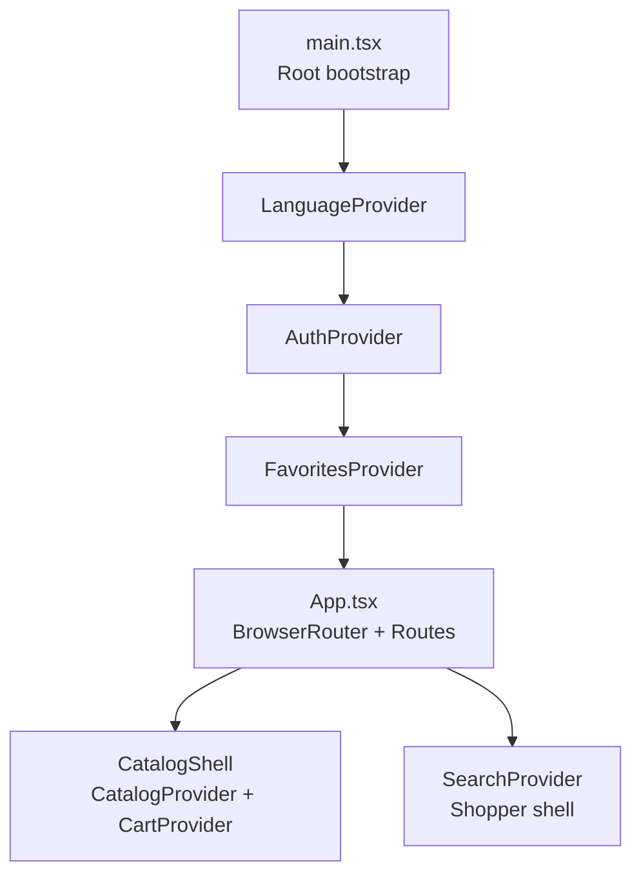
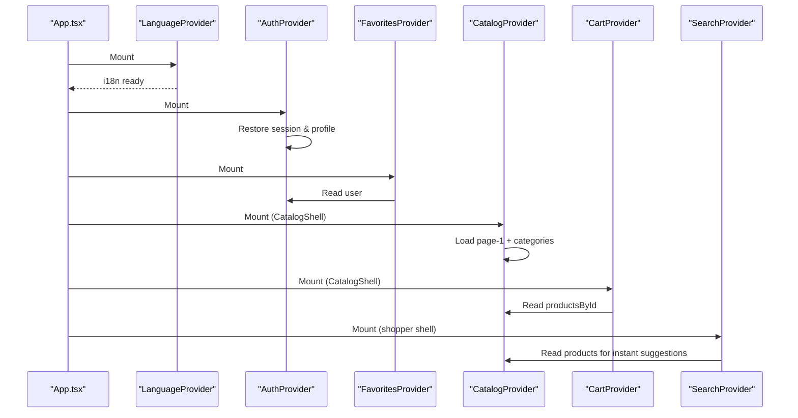
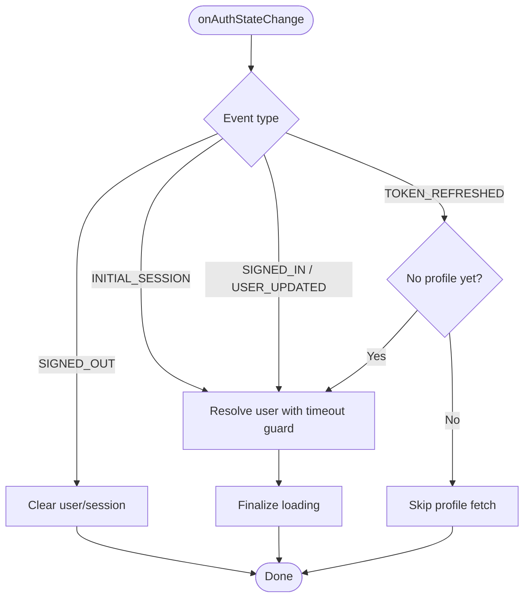
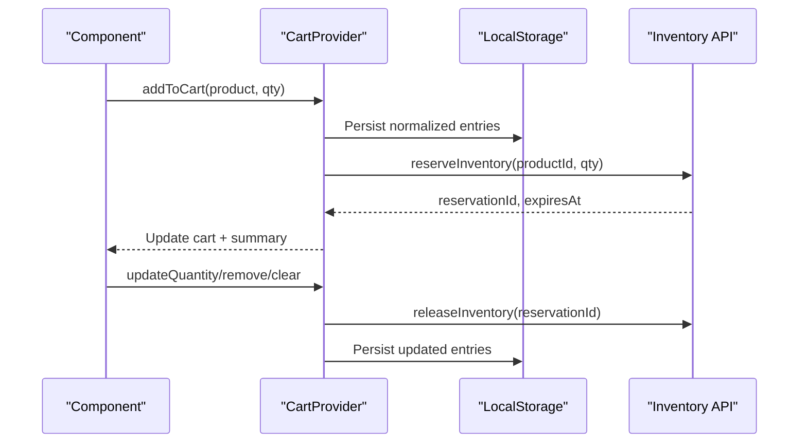
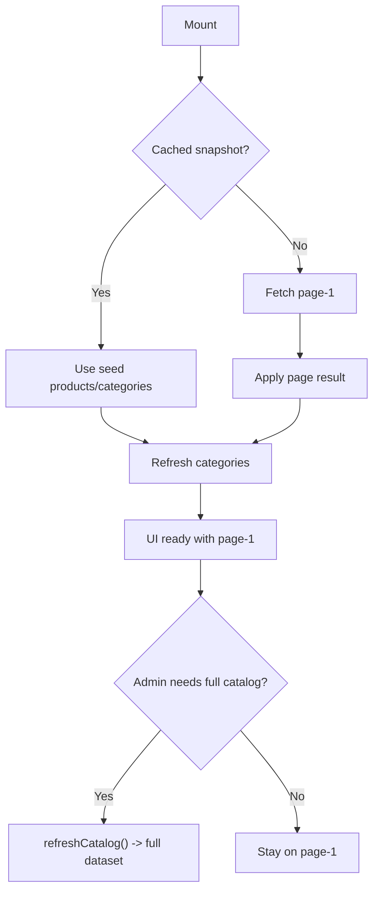
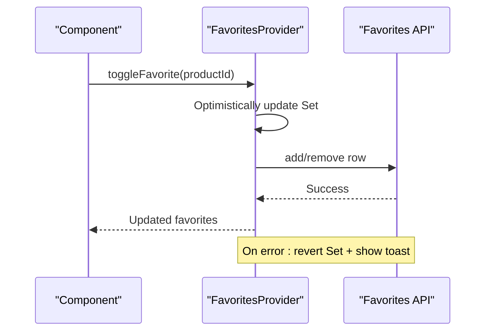
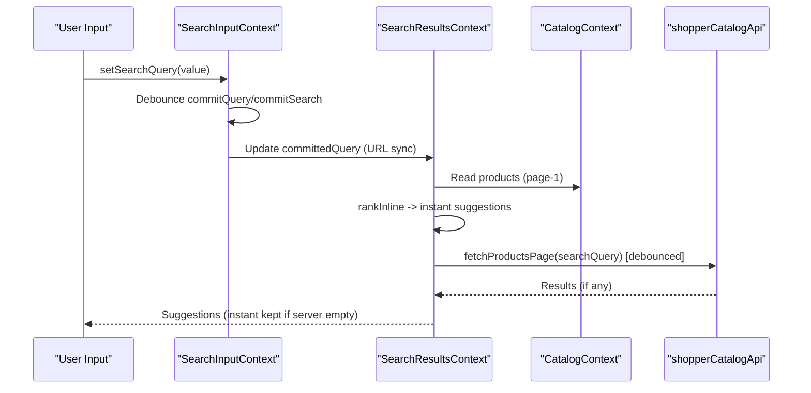
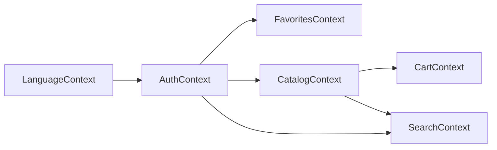

# React Context Providers

<cite>
**Referenced Files in This Document**
- [main.tsx](file://apps/shopper-web/src/main.tsx)
- [App.tsx](file://apps/shopper-web/src/app/App.tsx)
- [AuthContext.tsx](file://apps/shopper-web/src/contexts/AuthContext.tsx)
- [CartContext.tsx](file://apps/shopper-web/src/contexts/CartContext.tsx)
- [CatalogContext.tsx](file://apps/shopper-web/src/contexts/CatalogContext.tsx)
- [FavoritesContext.tsx](file://apps/shopper-web/src/contexts/FavoritesContext.tsx)
- [LanguageContext.tsx](file://apps/shopper-web/src/contexts/LanguageContext.tsx)
- [SearchContext.tsx](file://apps/shopper-web/src/contexts/SearchContext.tsx)
</cite>

## Table of Contents
1. Introduction
2. Project Structure
3. Core Components
4. Architecture Overview
5. Detailed Component Analysis
6. Dependency Analysis
7. Performance Considerations
8. Troubleshooting Guide
9. Conclusion

## Introduction
This document explains the React Context providers used in the shopper web application to manage global state for authentication, shopping cart, product catalog, user favorites, internationalization (i18n), and search. It covers how each provider is created and composed, how components consume context values, how updates are handled, error handling strategies, and performance optimizations such as memoization, selective re-renders, deferred updates, and background loading.

## Project Structure
The application bootstraps providers at the root level and composes them around route trees:
- Root-level providers: Query client, i18n, auth, and favorites are mounted globally in the app entry.
- Route-scoped providers: Catalog and Cart are mounted for routes that need product data; Search is scoped to the shopper shell.

**Diagram sources**
- [main.tsx:42-56](file://apps/shopper-web/src/main.tsx#L42-L56)
- [App.tsx:79-89](file://apps/shopper-web/src/app/App.tsx#L79-L89)
- [App.tsx:153-179](file://apps/shopper-web/src/app/App.tsx#L153-L179)

**Section sources**
- [main.tsx:42-56](file://apps/shopper-web/src/main.tsx#L42-L56)
- [App.tsx:79-89](file://apps/shopper-web/src/app/App.tsx#L79-L89)
- [App.tsx:153-179](file://apps/shopper-web/src/app/App.tsx#L153-L179)

## Core Components
- AuthContext: Manages authentication session, user profile, role-based flags, sign-in/sign-out, Google OAuth, and live role/status propagation via realtime.
- CartContext: Manages cart items with local persistence, inventory reservations, and pricing summary.
- CatalogContext: Provides paginated products, categories, derived lists, metrics, and optional full-catalog load for admin features.
- FavoritesContext: Manages user’s favorite product IDs with optimistic UI and server sync.
- LanguageContext: Wraps i18next, exposes current language, toggling, and a typed translation function.
- SearchContext: Provides input state, URL synchronization, debounced commits, and suggestions using instant fuzzy ranking plus server-side search.

**Section sources**
- [AuthContext.tsx:114-130](file://apps/shopper-web/src/contexts/AuthContext.tsx#L114-L130)
- [CartContext.tsx:45-68](file://apps/shopper-web/src/contexts/CartContext.tsx#L45-L68)
- [CatalogContext.tsx:67-103](file://apps/shopper-web/src/contexts/CatalogContext.tsx#L67-L103)
- [FavoritesContext.tsx:14-22](file://apps/shopper-web/src/contexts/FavoritesContext.tsx#L14-L22)
- [LanguageContext.tsx:14-20](file://apps/shopper-web/src/contexts/LanguageContext.tsx#L14-L20)
- [SearchContext.tsx:22-45](file://apps/shopper-web/src/contexts/SearchContext.tsx#L22-L45)

## Architecture Overview
Providers are layered to minimize unnecessary re-renders and to scope expensive operations:
- LanguageProvider wraps everything to set document direction and language early.
- AuthProvider initializes sessions and profiles, then provides role flags and actions.
- FavoritesProvider depends on AuthProvider to fetch/update favorites for authenticated customers.
- CatalogProvider loads page-1 products quickly and categories from cache or network; full catalog is loaded on demand by admins.
- CartProvider depends on CatalogProvider for product inflation and uses AuthProvider for reservation logic.
- SearchProvider is scoped to the shopper shell and reads from CatalogProvider for instant suggestions.

**Diagram sources**
- [main.tsx:42-56](file://apps/shopper-web/src/main.tsx#L42-L56)
- [App.tsx:79-89](file://apps/shopper-web/src/app/App.tsx#L79-L89)
- [App.tsx:153-179](file://apps/shopper-web/src/app/App.tsx#L153-L179)

## Detailed Component Analysis

### AuthContext
Purpose
- Maintain authentication session and user profile.
- Provide role-based flags (admin, manager, pharmacist, driver, staff).
- Handle login, register, Google OAuth, sign out, and profile refresh.
- Subscribe to realtime profile changes to enforce role/status updates during a session.

Key implementation patterns
- Context creation and provider with memoized value.
- Supabase auth listener handles INITIAL_SESSION, SIGNED_IN, TOKEN_REFRESHED, SIGNED_OUT.
- Timeout-guarded profile fetch to avoid blocking UI on slow backends.
- Realtime channel to detect role/status changes and force sign-out when suspended/inactive.
- Memoized selectors for role flags to reduce re-renders.

Consumption
- useAuth() returns { user, session, loading, login, register, loginWithGoogle, signOut, refreshProfile, isAdmin, isManager, isPharmacist, isDriver, isStaff }.

Error handling
- Graceful fallbacks on timeout or missing rows.
- Suspended/Inactive states throw domain-specific errors and trigger sign-out flows.
- Toast notifications for status changes.

Performance
- Background retry for profile fetch after initial timeout.
- Memoized context value and stable callbacks.
- Defer heavy work off the auth event loop to avoid deadlocks.

**Diagram sources**
- [AuthContext.tsx:313-389](file://apps/shopper-web/src/contexts/AuthContext.tsx#L313-L389)
- [AuthContext.tsx:199-213](file://apps/shopper-web/src/contexts/AuthContext.tsx#L199-L213)

**Section sources**
- [AuthContext.tsx:114-130](file://apps/shopper-web/src/contexts/AuthContext.tsx#L114-L130)
- [AuthContext.tsx:245-389](file://apps/shopper-web/src/contexts/AuthContext.tsx#L245-L389)
- [AuthContext.tsx:391-521](file://apps/shopper-web/src/contexts/AuthContext.tsx#L391-L521)
- [AuthContext.tsx:524-689](file://apps/shopper-web/src/contexts/AuthContext.tsx#L524-L689)
- [AuthContext.tsx:697-737](file://apps/shopper-web/src/contexts/AuthContext.tsx#L697-L737)

### CartContext
Purpose
- Manage cart items with local persistence and inventory reservations.
- Compute pricing summary and handle add/remove/update/clear operations.

Key implementation patterns
- Local storage-backed entries with normalization and merging.
- Inflate stored entries into full CartItem objects using catalog data.
- Reserve inventory per item with idempotency keys and expiration; release on changes or clear.
- Online/offline awareness to gate reservation calls.
- Memoized cart and summary computations.

Consumption
- useCart() returns { cart, summary, addToCart, removeFromCart, updateQuantity, clearCart, setCartReservation, isLoading }.

Error handling
- Parse reservation errors to adjust quantities or remove items when stock is insufficient or invalid.
- Release reservations on failure paths to avoid stale holds.

Performance
- Immediate product caching to resolve newly added items without waiting for catalog hydration.
- Stable references for functions and memoized derived data.

**Diagram sources**
- [CartContext.tsx:197-555](file://apps/shopper-web/src/contexts/CartContext.tsx#L197-L555)

**Section sources**
- [CartContext.tsx:45-68](file://apps/shopper-web/src/contexts/CartContext.tsx#L45-L68)
- [CartContext.tsx:197-555](file://apps/shopper-web/src/contexts/CartContext.tsx#L197-L555)

### CatalogContext
Purpose
- Provide paginated products, categories, derived lists, metrics, and optional full catalog for admin pages.

Key implementation patterns
- Seed from cached snapshot; load page-1 immediately for fast first paint.
- Categories refreshed from DB on mount; derive categories only when needed.
- Server-side search and filtering via fetchProductsPage with pagination.
- Explicit refreshCatalog to load full dataset for admin features.
- Optimistic upsert/remove for mutations.

Consumption
- useCatalog() returns products, categories, productsById, categoriesById, featuredProducts, inStockProducts, metrics, lastUpdated, allProducts, allProductsById, isFullCatalogReady, isLoading, isLoadingMore, error, totalProductCount, hasNextPage, currentPage, activeFilters, loadNextPage, search, filterByCategory, refreshCatalog, refreshCategories, upsertProduct, removeProduct.
- useFullCatalog() returns stable full-catalog data for workers/admin.

Error handling
- Error state propagated to UI; emergency timers prevent indefinite loading.

Performance
- startTransition for batched updates.
- Deferred full-catalog loading; page-1 focus for shoppers.
- Memoized derived values and maps.

**Diagram sources**
- [CatalogContext.tsx:117-242](file://apps/shopper-web/src/contexts/CatalogContext.tsx#L117-L242)
- [CatalogContext.tsx:296-332](file://apps/shopper-web/src/contexts/CatalogContext.tsx#L296-L332)

**Section sources**
- [CatalogContext.tsx:67-103](file://apps/shopper-web/src/contexts/CatalogContext.tsx#L67-L103)
- [CatalogContext.tsx:117-242](file://apps/shopper-web/src/contexts/CatalogContext.tsx#L117-L242)
- [CatalogContext.tsx:244-371](file://apps/shopper-web/src/contexts/CatalogContext.tsx#L244-L371)
- [CatalogContext.tsx:373-505](file://apps/shopper-web/src/contexts/CatalogContext.tsx#L373-L505)

### FavoritesContext
Purpose
- Manage user’s favorite product IDs with optimistic UI and server synchronization.

Key implementation patterns
- Fetch favorites on mount for authenticated customers.
- Toggle adds/removes locally first, then persists to server; rollback on error.
- Busy/error states for UX feedback.

Consumption
- useFavorites() returns { favoriteIds, isFavorite, toggleFavorite, isBusy, errorMessage }.

Error handling
- On failure, revert optimistic change and show toast.

Performance
- Set-based favoriteIds for O(1) checks.
- Memoized context value.

**Diagram sources**
- [FavoritesContext.tsx:24-129](file://apps/shopper-web/src/contexts/FavoritesContext.tsx#L24-L129)

**Section sources**
- [FavoritesContext.tsx:14-22](file://apps/shopper-web/src/contexts/FavoritesContext.tsx#L14-L22)
- [FavoritesContext.tsx:24-129](file://apps/shopper-web/src/contexts/FavoritesContext.tsx#L24-L129)

### LanguageContext
Purpose
- Provide current language, toggle, and typed translation function while managing document direction and persistence.

Key implementation patterns
- Wrap with I18nextProvider and bridge to expose lang, toggleLanguage, t.
- Update document.documentElement.dir/lang and persist choice.

Consumption
- useLanguage() returns { lang, toggleLanguage, t }.

Performance
- Memoized translate function to avoid re-renders.

**Section sources**
- [LanguageContext.tsx:14-20](file://apps/shopper-web/src/contexts/LanguageContext.tsx#L14-L20)
- [LanguageContext.tsx:22-63](file://apps/shopper-web/src/contexts/LanguageContext.tsx#L22-L63)

### SearchContext
Purpose
- Provide search input state, committed query, URL synchronization, and suggestions with instant fuzzy ranking and server-side search.

Key implementation patterns
- Debounced commit to URL and committed query.
- URL sync effect to keep ?search consistent with state.
- Instant suggestions from already-loaded products using fuzzy scoring and in-stock boost.
- Debounced server request to fetchProductsPage; empty server responses do not overwrite instant results.
- Split contexts for input vs results to limit re-renders.

Consumption
- useSearchInput(): { searchQuery, setSearchQuery, committedQuery, commitQuery, commitSearch }
- useSearchResults(): { suggestions, isSearching, isWorkerReady, workerStatus }
- Legacy useSearch() combines both.

Performance
- useDeferredValue for responsive input.
- startTransition for non-blocking suggestion updates.
- AbortController to cancel stale requests.

**Diagram sources**
- [SearchContext.tsx:146-399](file://apps/shopper-web/src/contexts/SearchContext.tsx#L146-L399)

**Section sources**
- [SearchContext.tsx:22-45](file://apps/shopper-web/src/contexts/SearchContext.tsx#L22-L45)
- [SearchContext.tsx:146-399](file://apps/shopper-web/src/contexts/SearchContext.tsx#L146-L399)

## Dependency Analysis
- main.tsx mounts LanguageProvider, AuthProvider, and FavoritesProvider globally.
- App.tsx composes CatalogProvider and CartProvider within CatalogShell for catalog routes.
- SearchProvider wraps the shopper shell routes to provide search functionality.
- Context consumers depend on specific providers:
  - CartContext depends on CatalogContext (useCatalogOptional) and AuthContext.
  - SearchContext depends on CatalogContext.
  - FavoritesContext depends on AuthContext.

**Diagram sources**
- [main.tsx:42-56](file://apps/shopper-web/src/main.tsx#L42-L56)
- [App.tsx:79-89](file://apps/shopper-web/src/app/App.tsx#L79-L89)
- [App.tsx:153-179](file://apps/shopper-web/src/app/App.tsx#L153-L179)
- [CartContext.tsx:197-215](file://apps/shopper-web/src/contexts/CartContext.tsx#L197-L215)
- [SearchContext.tsx:146-149](file://apps/shopper-web/src/contexts/SearchContext.tsx#L146-L149)
- [FavoritesContext.tsx:24-28](file://apps/shopper-web/src/contexts/FavoritesContext.tsx#L24-L28)

**Section sources**
- [main.tsx:42-56](file://apps/shopper-web/src/main.tsx#L42-L56)
- [App.tsx:79-89](file://apps/shopper-web/src/app/App.tsx#L79-L89)
- [App.tsx:153-179](file://apps/shopper-web/src/app/App.tsx#L153-L179)

## Performance Considerations
- Memoization: All providers memoize context values and derived data to avoid unnecessary re-renders.
- Selective re-renders: Split contexts (e.g., SearchInput vs SearchResults) to limit consumer updates.
- Deferred updates: Catalog and Search use startTransition to batch UI updates.
- Lazy/full catalog: CatalogContext defers full catalog load until explicitly requested by admin pages.
- Offline resilience: CartContext gates reservation calls based on online status and releases reservations on failures.
- Debouncing: SearchContext debounces URL commits and server requests to reduce network churn.
- Timeouts: AuthContext and CatalogContext include emergency timeouts to prevent indefinite loading.

[No sources needed since this section provides general guidance]

## Troubleshooting Guide
Common issues and where to look:
- Authentication stuck in loading: Check AuthContext’s emergency timer and profile fetch timeout behavior.
- Role/status not updating mid-session: Verify realtime subscription for profile updates and forced sign-out logic.
- Cart loses items on reload: Ensure CatalogProvider has hydrated product data before writing to localStorage; CartContext guards against wiping entries before product data is available.
- Inventory reservations failing: Inspect reservation error parsing and automatic quantity adjustments or removals.
- Search suggestions disappear: Confirm server response does not overwrite instant fuzzy results; check abort controller and debounce timing.
- Favorites not syncing: Ensure user is authenticated and customer role; check optimistic update rollback on error.

**Section sources**
- [AuthContext.tsx:313-389](file://apps/shopper-web/src/contexts/AuthContext.tsx#L313-L389)
- [AuthContext.tsx:391-521](file://apps/shopper-web/src/contexts/AuthContext.tsx#L391-L521)
- [CartContext.tsx:364-388](file://apps/shopper-web/src/contexts/CartContext.tsx#L364-L388)
- [CartContext.tsx:273-340](file://apps/shopper-web/src/contexts/CartContext.tsx#L273-L340)
- [SearchContext.tsx:299-368](file://apps/shopper-web/src/contexts/SearchContext.tsx#L299-L368)
- [FavoritesContext.tsx:68-107](file://apps/shopper-web/src/contexts/FavoritesContext.tsx#L68-L107)

## Conclusion
The shopper web application uses a layered set of React Context providers to manage global state efficiently and safely. Each provider encapsulates its concerns, composes well with others, and employs robust error handling and performance techniques like memoization, deferred updates, debouncing, and background loading. Consumers access state through typed hooks, enabling predictable updates and minimal re-renders across the application.