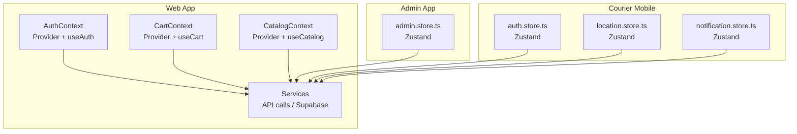
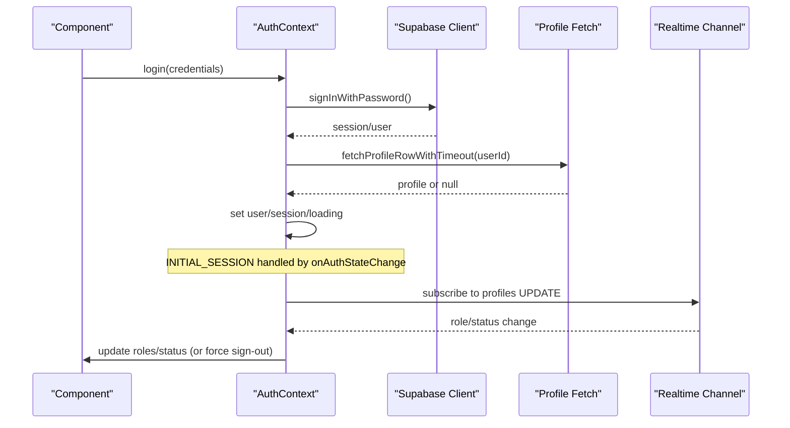
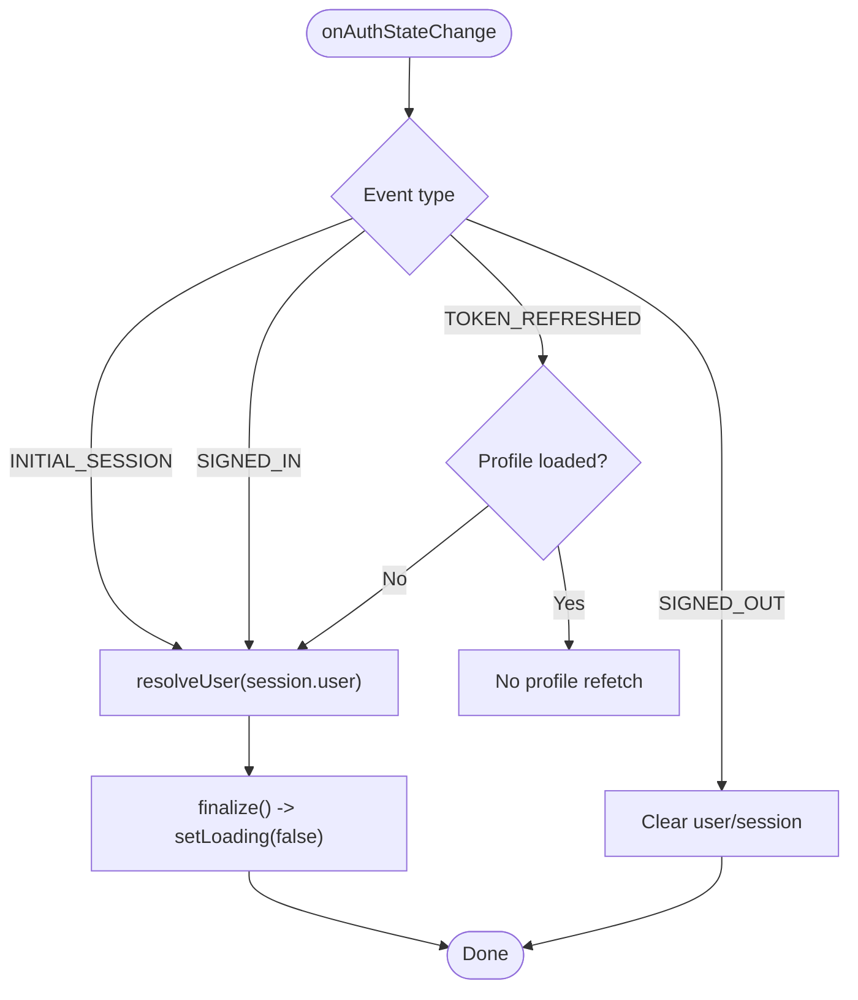
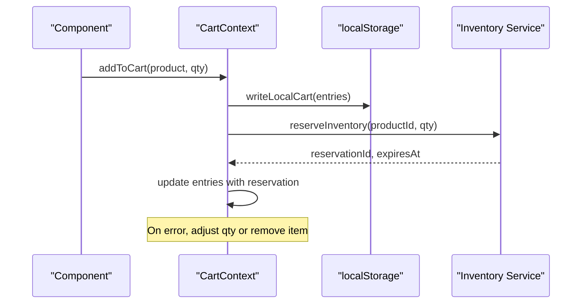
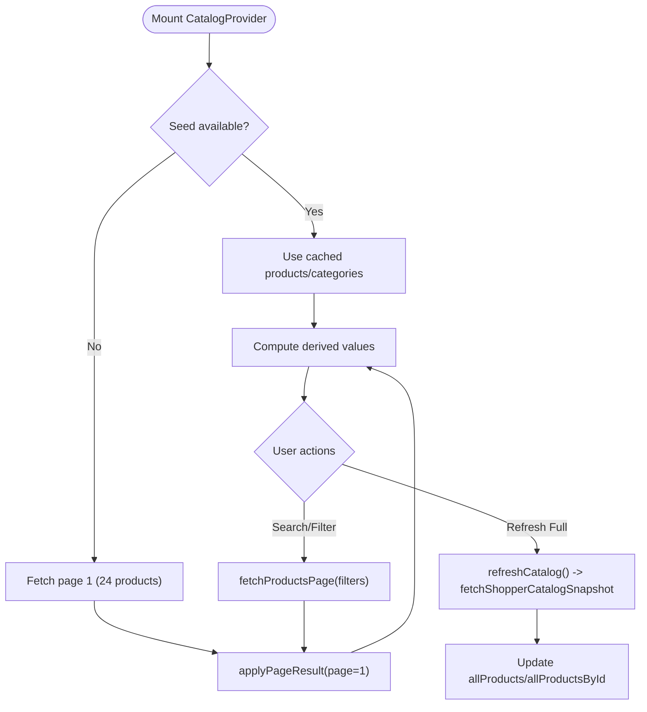
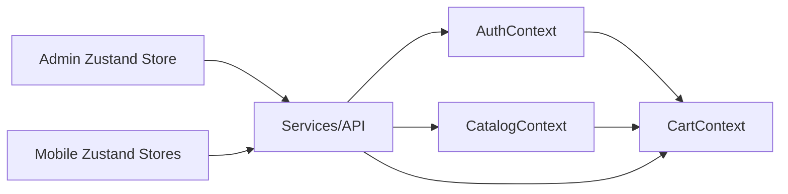

# State Management Architecture

<cite>
**Referenced Files in This Document**
- [AuthContext.tsx](file://apps/shopper-web/src/contexts/AuthContext.tsx)
- [CartContext.tsx](file://apps/shopper-web/src/contexts/CartContext.tsx)
- [CatalogContext.tsx](file://apps/shopper-web/src/contexts/CatalogContext.tsx)
- [admin.store.ts](file://apps/admin/src/stores/admin.store.ts)
- [auth.store.ts](file://apps/courier-mobile/src/stores/auth.store.ts)
- [location.store.ts](file://apps/courier-mobile/src/stores/location.store.ts)
- [notification.store.ts](file://apps/courier-mobile/src/stores/notification.store.ts)
</cite>

## Table of Contents
1. [Introduction](#introduction)
2. [Project Structure](#project-structure)
3. [Core Components](#core-components)
4. [Architecture Overview](#architecture-overview)
5. [Detailed Component Analysis](#detailed-component-analysis)
6. [Dependency Analysis](#dependency-analysis)
7. [Performance Considerations](#performance-considerations)
8. [Troubleshooting Guide](#troubleshooting-guide)
9. [Conclusion](#conclusion)
10. [Appendices](#appendices)

## Introduction
This document explains the state management architecture across the web and mobile applications, focusing on:
- When to use local component state vs. React Context vs. Zustand stores
- Global state implementations for authentication, cart, catalog, and admin/mobile domains
- Data flow patterns between server state (React Query) and client state (Zustand and Context)
- State persistence strategies (localStorage, Supabase sessions, background sync)
- Performance considerations (lazy loading, caching, transitions, timeouts)
- Examples of custom hooks, optimistic updates, and asynchronous state changes

The goal is to provide a clear mental model for developers to choose the right state layer and implement robust, performant flows.

## Project Structure
State management spans multiple apps and packages:
- Web app (shopper-web): React Context providers for Auth, Cart, Catalog; services integrate with Supabase and server APIs; optional React Query usage via services
- Admin app: Zustand store for admin-specific global state
- Courier mobile app: Zustand stores for auth, location, notifications, orders

**Diagram sources**
- [AuthContext.tsx:245-738](file://apps/shopper-web/src/contexts/AuthContext.tsx#L245-L738)
- [CartContext.tsx:197-555](file://apps/shopper-web/src/contexts/CartContext.tsx#L197-L555)
- [CatalogContext.tsx:117-467](file://apps/shopper-web/src/contexts/CatalogContext.tsx#L117-L467)
- [admin.store.ts](file://apps/admin/src/stores/admin.store.ts)
- [auth.store.ts](file://apps/courier-mobile/src/stores/auth.store.ts)
- [location.store.ts](file://apps/courier-mobile/src/stores/location.store.ts)
- [notification.store.ts](file://apps/courier-mobile/src/stores/notification.store.ts)

**Section sources**
- [AuthContext.tsx:245-738](file://apps/shopper-web/src/contexts/AuthContext.tsx#L245-L738)
- [CartContext.tsx:197-555](file://apps/shopper-web/src/contexts/CartContext.tsx#L197-L555)
- [CatalogContext.tsx:117-467](file://apps/shopper-web/src/contexts/CatalogContext.tsx#L117-L467)

## Core Components
- Authentication context (web): Centralizes session lifecycle, profile resolution, role/status propagation, sign-in/sign-out, and error handling. Provides a typed hook for components.
- Cart context (web): Manages cart items, summaries, inventory reservations, persistence to localStorage, and online/offline behavior. Exposes actions like add/remove/update/clear.
- Catalog context (web): Holds paginated products, categories, derived metrics, and full-catalog data for admin/worker needs. Implements search/filter and explicit refresh paths.
- Admin Zustand store (admin): Global state for admin features using Zustand for lightweight, scalable state.
- Courier mobile Zustand stores: Domain-scoped stores for auth, location, notifications, and orders.

Guidelines for choosing state layers:
- Local component state: UI-only flags, form inputs, temporary selections that do not need cross-component sharing or persistence.
- React Context: Cross-cutting concerns shared by many components within an app tree (e.g., auth, cart, catalog). Best when state is small-to-medium and not frequently mutated at high frequency.
- Zustand stores: Global, domain-scoped state that may be accessed from many places, especially in mobile apps or large feature areas. Good for complex async flows, subscriptions, and performance-sensitive updates.

**Section sources**
- [AuthContext.tsx:114-130](file://apps/shopper-web/src/contexts/AuthContext.tsx#L114-L130)
- [CartContext.tsx:45-68](file://apps/shopper-web/src/contexts/CartContext.tsx#L45-L68)
- [CatalogContext.tsx:67-103](file://apps/shopper-web/src/contexts/CatalogContext.tsx#L67-L103)
- [admin.store.ts](file://apps/admin/src/stores/admin.store.ts)
- [auth.store.ts](file://apps/courier-mobile/src/stores/auth.store.ts)
- [location.store.ts](file://apps/courier-mobile/src/stores/location.store.ts)
- [notification.store.ts](file://apps/courier-mobile/src/stores/notification.store.ts)

## Architecture Overview
The system separates concerns across layers:
- Server state: Fetched via services (Supabase, REST), optionally cached or managed by React Query where used. The web contexts call services directly; mobile uses Zustand stores to orchestrate API calls and manage subscriptions.
- Client state:
  - Context-based (web): Auth, Cart, Catalog maintain UI-relevant state and coordinate with services.
  - Zustand-based (admin/mobile): Domain stores encapsulate logic and side effects, exposing selectors and actions.

Data flow highlights:
- Auth: Session events drive profile resolution; realtime updates propagate role/status changes; errors handled with graceful degradation and retries.
- Cart: Local storage persists entries; online mode reserves inventory; offline mode defers reservation until connectivity resumes.
- Catalog: Page-1 fetch for fast first paint; server-side pagination; explicit full-catalog refresh for admin; categories loaded from cache or live DB.

**Diagram sources**
- [AuthContext.tsx:333-389](file://apps/shopper-web/src/contexts/AuthContext.tsx#L333-L389)
- [AuthContext.tsx:424-521](file://apps/shopper-web/src/contexts/AuthContext.tsx#L424-L521)
- [AuthContext.tsx:524-588](file://apps/shopper-web/src/contexts/AuthContext.tsx#L524-L588)

**Section sources**
- [AuthContext.tsx:333-389](file://apps/shopper-web/src/contexts/AuthContext.tsx#L333-L389)
- [AuthContext.tsx:424-521](file://apps/shopper-web/src/contexts/AuthContext.tsx#L424-L521)
- [AuthContext.tsx:524-588](file://apps/shopper-web/src/contexts/AuthContext.tsx#L524-L588)

## Detailed Component Analysis

### Authentication Context (Web)
Responsibilities:
- Manage Supabase session lifecycle and user profile resolution
- Handle initial session restoration, sign-in, sign-out, OAuth
- Provide role/status checks and reactive updates via realtime
- Implement timeouts and background retries to avoid blocking UI

Key behaviors:
- Initial session handling ensures loading clears after profile resolves or timeout
- Role/status realtime subscription forces sign-out on suspension/inactivation
- Login/register handle localized errors and account status checks

Custom hook:
- useAuth provides typed access to user, session, loading, and actions

**Diagram sources**
- [AuthContext.tsx:333-389](file://apps/shopper-web/src/contexts/AuthContext.tsx#L333-L389)
- [AuthContext.tsx:262-304](file://apps/shopper-web/src/contexts/AuthContext.tsx#L262-L304)

**Section sources**
- [AuthContext.tsx:245-738](file://apps/shopper-web/src/contexts/AuthContext.tsx#L245-L738)

### Cart Context (Web)
Responsibilities:
- Maintain cart entries, summary calculations, and inventory reservations
- Persist cart to localStorage; hydrate from cache; merge missing product details
- Coordinate online/offline behavior; reserve/release inventory via services
- Emit workflow events for mutations

Optimistic updates:
- Add/update/remove operations mutate local entries immediately
- Reservation IDs are updated optimistically; release on failure or quantity change
- Errors adjust quantities or remove items based on service responses

Persistence strategy:
- Store minimal entry data (product_id, quantity, reservation metadata)
- Normalize and clamp quantities against current stock and availability
- Guard against wiping stored entries before product data is available

**Diagram sources**
- [CartContext.tsx:414-456](file://apps/shopper-web/src/contexts/CartContext.tsx#L414-L456)
- [CartContext.tsx:273-340](file://apps/shopper-web/src/contexts/CartContext.tsx#L273-L340)
- [CartContext.tsx:379-388](file://apps/shopper-web/src/contexts/CartContext.tsx#L379-L388)

**Section sources**
- [CartContext.tsx:197-555](file://apps/shopper-web/src/contexts/CartContext.tsx#L197-L555)

### Catalog Context (Web)
Responsibilities:
- Manage page-1 products, server-paginated results, categories, and full-catalog dataset
- Provide search/filter actions backed by server queries
- Explicitly load full catalog for admin/worker needs without auto-loading on mount
- Compute derived values (metrics, featured, in-stock) efficiently

Performance optimizations:
- Seed from cached snapshot to avoid cold-start delays
- Use startTransition for batched updates
- Emergency timers prevent indefinite loading states
- Categories refreshed from live DB to match mobile app

**Diagram sources**
- [CatalogContext.tsx:117-222](file://apps/shopper-web/src/contexts/CatalogContext.tsx#L117-L222)
- [CatalogContext.tsx:244-332](file://apps/shopper-web/src/contexts/CatalogContext.tsx#L244-L332)
- [CatalogContext.tsx:334-371](file://apps/shopper-web/src/contexts/CatalogContext.tsx#L334-L371)

**Section sources**
- [CatalogContext.tsx:117-467](file://apps/shopper-web/src/contexts/CatalogContext.tsx#L117-L467)

### Admin Zustand Store
Purpose:
- Centralized global state for admin features, enabling cross-feature sharing and predictable updates
- Encapsulates async flows and side effects within store actions
- Provides selectors for efficient re-renders

Usage pattern:
- Create domain-scoped stores per feature area
- Compose actions that call services and update store state
- Use selectors to derive UI state and minimize re-renders

**Section sources**
- [admin.store.ts](file://apps/admin/src/stores/admin.store.ts)

### Courier Mobile Zustand Stores
Purpose:
- Manage domain-specific state for courier workflows: authentication, location tracking, notifications, orders
- Handle real-time updates and network resilience
- Provide hooks/selectors for components to consume state

Patterns:
- Store actions encapsulate API calls and state transitions
- Realtime subscriptions integrated into store lifecycle
- Optimistic updates where appropriate, with rollback on failure

**Section sources**
- [auth.store.ts](file://apps/courier-mobile/src/stores/auth.store.ts)
- [location.store.ts](file://apps/courier-mobile/src/stores/location.store.ts)
- [notification.store.ts](file://apps/courier-mobile/src/stores/notification.store.ts)

## Dependency Analysis
Inter-component relationships:
- Cart depends on Catalog for product inflation and pricing; integrates with Inventory services
- Auth provides user identity and role checks consumed by other contexts
- Catalog supplies product data used by Cart and UI components
- Admin and mobile stores operate independently but may share service abstractions

**Diagram sources**
- [CartContext.tsx:1-13](file://apps/shopper-web/src/contexts/CartContext.tsx#L1-L13)
- [CatalogContext.tsx:27-53](file://apps/shopper-web/src/contexts/CatalogContext.tsx#L27-L53)
- [AuthContext.tsx:37-50](file://apps/shopper-web/src/contexts/AuthContext.tsx#L37-L50)

**Section sources**
- [CartContext.tsx:1-13](file://apps/shopper-web/src/contexts/CartContext.tsx#L1-L13)
- [CatalogContext.tsx:27-53](file://apps/shopper-web/src/contexts/CatalogContext.tsx#L27-L53)
- [AuthContext.tsx:37-50](file://apps/shopper-web/src/contexts/AuthContext.tsx#L37-L50)

## Performance Considerations
- Avoid auto-loading full catalogs on mount; use explicit refresh for admin pages
- Use server-side pagination to reduce payload sizes
- Cache categories and snapshots locally with TTLs
- Employ startTransition for non-urgent updates to keep UI responsive
- Implement emergency timeouts to prevent indefinite loading states
- Minimize re-renders by memoizing derived values and using stable references
- Defer heavy computations off the main thread where possible

[No sources needed since this section provides general guidance]

## Troubleshooting Guide
Common issues and resolutions:
- Sign-out on reload: Ensure INITIAL_SESSION is handled and finalize is called after profile resolution
- Slow profile fetch: Use timeouts and background retries; degrade gracefully if profile unavailable
- Role/status staleness: Subscribe to realtime updates and force sign-out on suspension/inactivation
- Cart data loss: Guard against clearing localStorage before product data is available; normalize and validate entries
- Inventory reservation failures: Adjust quantities or remove items based on error reasons; release reservations on changes

**Section sources**
- [AuthContext.tsx:199-213](file://apps/shopper-web/src/contexts/AuthContext.tsx#L199-L213)
- [AuthContext.tsx:333-389](file://apps/shopper-web/src/contexts/AuthContext.tsx#L333-L389)
- [AuthContext.tsx:424-521](file://apps/shopper-web/src/contexts/AuthContext.tsx#L424-L521)
- [CartContext.tsx:364-388](file://apps/shopper-web/src/contexts/CartContext.tsx#L364-L388)
- [CartContext.tsx:273-340](file://apps/shopper-web/src/contexts/CartContext.tsx#L273-L340)

## Conclusion
The state management architecture combines React Context for web-wide concerns and Zustand for domain-scoped global state in admin and mobile apps. Key principles include:
- Choose the smallest scope necessary (local state, Context, or Zustand)
- Persist only what’s needed and guard hydration carefully
- Separate server state from client state; use services and optional React Query for caching and synchronization
- Optimize performance with lazy loading, caching, transitions, and timeouts
- Implement resilient error handling and realtime updates for critical flows

[No sources needed since this section summarizes without analyzing specific files]

## Appendices
- Custom hooks examples:
  - useAuth: Access authenticated user, session, and actions
  - useCart: Access cart items, summary, and mutation actions
  - useCatalog/useFullCatalog: Access paginated/full catalog data and actions
- Optimistic updates:
  - Cart mutations update local state immediately; reservations released on failure
  - Catalog upsert/remove update maps and lists instantly
- Asynchronous state changes:
  - Auth handles session events and realtime updates
  - Catalog performs server-side search/filter with loading states
  - Mobile stores manage real-time location and notifications

[No sources needed since this section provides general guidance]