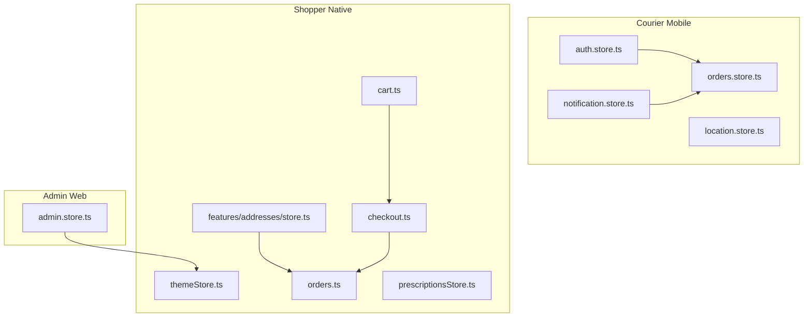
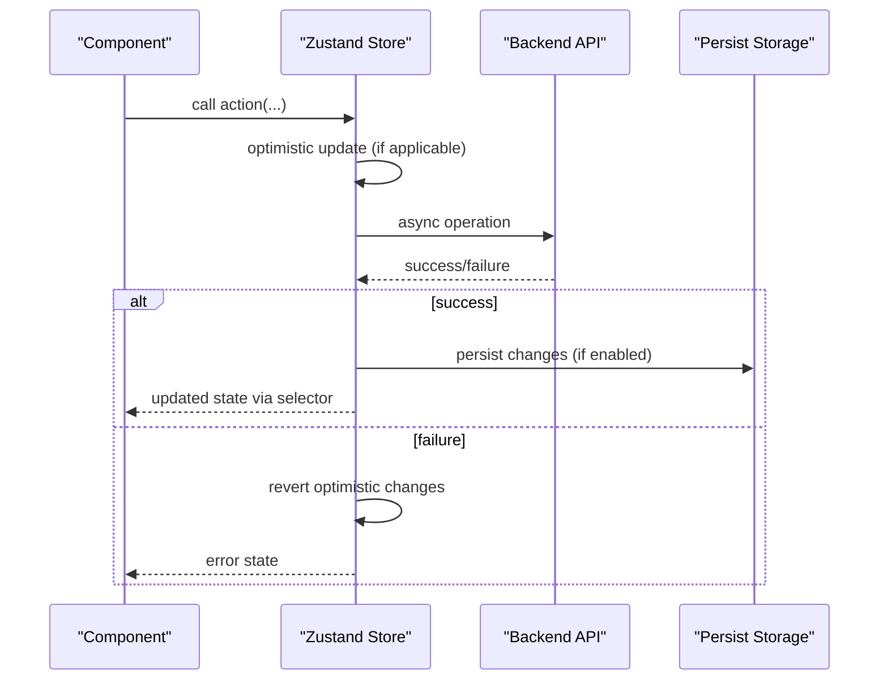
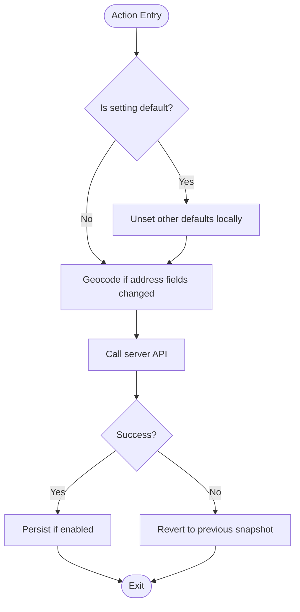
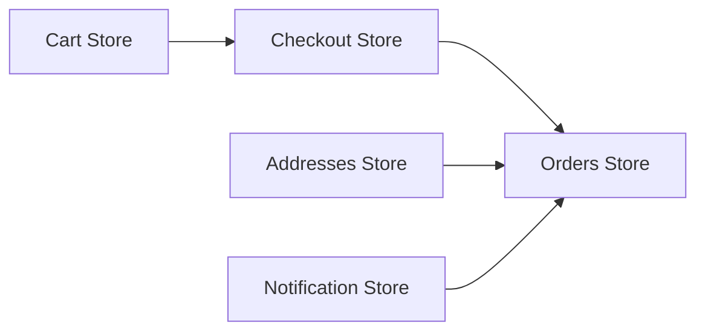

# Zustand State Stores

<cite>
**Referenced Files in This Document**
- [admin.store.ts](file://apps/admin/src/stores/admin.store.ts)
- [auth.store.ts](file://apps/courier-mobile/src/stores/auth.store.ts)
- [location.store.ts](file://apps/courier-mobile/src/stores/location.store.ts)
- [notification.store.ts](file://apps/courier-mobile/src/stores/notification.store.ts)
- [orders.store.ts](file://apps/courier-mobile/src/stores/orders.store.ts)
- [cart.ts](file://apps/shopper-native/src/stores/cart.ts)
- [checkout.ts](file://apps/shopper-native/src/stores/checkout.ts)
- [themeStore.ts](file://apps/shopper-native/src/stores/themeStore.ts)
- [orders.ts](file://apps/shopper-native/src/stores/orders.ts)
- [prescriptionsStore.ts](file://apps/shopper-native/src/stores/prescriptionsStore.ts)
- [store.ts](file://apps/shopper-native/src/features/addresses/store.ts)
</cite>

## Table of Contents
1. Introduction
2. Project Structure
3. Core Components
4. Architecture Overview
5. Detailed Component Analysis
6. Dependency Analysis
7. Performance Considerations
8. Troubleshooting Guide
9. Conclusion

## Introduction
This document explains how Zustand stores are implemented across the application and provides guidance on when to use Zustand versus React Context for global state management. It covers store creation patterns, state structure design, middleware usage (persist), asynchronous operations, optimistic updates, persistence to storage, store composition patterns, and strategies to avoid excessive re-renders. The focus includes cart, checkout, theme, order, and prescription stores, as well as related mobile and admin stores that demonstrate reusable patterns.

## Project Structure
Zustand stores are organized per feature or app boundary:
- Admin web: authentication and theme toggle persisted to localStorage.
- Courier mobile: auth, location tracking, notifications, and delivery orders.
- Shopper native: cart, checkout, theme, orders, prescriptions, and addresses with optimistic updates and persistence.

**Diagram sources**
- [admin.store.ts:1-46](file://apps/admin/src/stores/admin.store.ts#L1-L46)
- [auth.store.ts:1-92](file://apps/courier-mobile/src/stores/auth.store.ts#L1-L92)
- [location.store.ts:1-44](file://apps/courier-mobile/src/stores/location.store.ts#L1-L44)
- [notification.store.ts:1-72](file://apps/courier-mobile/src/stores/notification.store.ts#L1-L72)
- [orders.store.ts:1-135](file://apps/courier-mobile/src/stores/orders.store.ts#L1-L135)
- [cart.ts](file://apps/shopper-native/src/stores/cart.ts)
- [checkout.ts](file://apps/shopper-native/src/stores/checkout.ts)
- [themeStore.ts](file://apps/shopper-native/src/stores/themeStore.ts)
- [orders.ts](file://apps/shopper-native/src/stores/orders.ts)
- [prescriptionsStore.ts](file://apps/shopper-native/src/stores/prescriptionsStore.ts)
- [store.ts:1-157](file://apps/shopper-native/src/features/addresses/store.ts#L1-L157)

**Section sources**
- [admin.store.ts:1-46](file://apps/admin/src/stores/admin.store.ts#L1-L46)
- [auth.store.ts:1-92](file://apps/courier-mobile/src/stores/auth.store.ts#L1-L92)
- [location.store.ts:1-44](file://apps/courier-mobile/src/stores/location.store.ts#L1-L44)
- [notification.store.ts:1-72](file://apps/courier-mobile/src/stores/notification.store.ts#L1-L72)
- [orders.store.ts:1-135](file://apps/courier-mobile/src/stores/orders.store.ts#L1-L135)
- [store.ts:1-157](file://apps/shopper-native/src/features/addresses/store.ts#L1-L157)

## Core Components
- Store creation pattern: create a typed store using create, define state and actions, and export a hook.
- Persistence: persist middleware with partialize to limit stored fields; custom storage adapters for web vs. mobile.
- Asynchronous operations: async actions inside stores with try/catch and error handling.
- Optimistic updates: update local state before network calls and revert on failure.
- Composition: combine multiple small stores or selectors to build complex UI state without over-subscribing.

Key examples:
- Admin auth and theme store with localStorage persistence.
- Courier mobile auth with AsyncStorage persistence and nested profile updates.
- Notification store with pagination-like truncation and unread count maintenance.
- Address store demonstrating robust optimistic updates with geocoding and server sync.

**Section sources**
- [admin.store.ts:1-46](file://apps/admin/src/stores/admin.store.ts#L1-L46)
- [auth.store.ts:1-92](file://apps/courier-mobile/src/stores/auth.store.ts#L1-L92)
- [notification.store.ts:1-72](file://apps/courier-mobile/src/stores/notification.store.ts#L1-L72)
- [store.ts:1-157](file://apps/shopper-native/src/features/addresses/store.ts#L1-L157)

## Architecture Overview
The stores follow a consistent architecture:
- Each store encapsulates domain state and actions.
- Middleware handles persistence and storage abstraction.
- Async actions coordinate with APIs and handle errors gracefully.
- Selectors and hooks enable fine-grained subscriptions to prevent unnecessary re-renders.

[No sources needed since this diagram shows conceptual workflow, not actual code structure]

## Detailed Component Analysis

### Cart Store (Shopper Native)
Responsibilities:
- Maintain cart items, quantities, and derived totals.
- Coordinate with inventory reservation during add/remove flows.
- Provide actions to add, remove, update quantities, and clear cart.

Patterns:
- In-memory list as live view; mutations trigger UI updates.
- Integration with reservation hooks to hold stock while user checks out.

Usage tips:
- Use selectors to subscribe only to changed parts (e.g., item count).
- Combine with checkout store to transition to payment flow.

**Section sources**
- [cart.ts](file://apps/shopper-native/src/stores/cart.ts)

### Checkout Store (Shopper Native)
Responsibilities:
- Manage checkout session data, selected shipping/payment options, and validation state.
- Bridge between cart and order submission.

Patterns:
- Compose with cart store to read current cart snapshot.
- Persist minimal checkout progress if needed.

**Section sources**
- [checkout.ts](file://apps/shopper-native/src/stores/checkout.ts)

### Theme Store (Shopper Native)
Responsibilities:
- Track theme preference and apply it globally.
- Persist theme choice across sessions.

Patterns:
- Simple boolean or enum state with setter.
- Optional persistence to keep user preference.

**Section sources**
- [themeStore.ts](file://apps/shopper-native/src/stores/themeStore.ts)

### Orders Store (Shopper Native)
Responsibilities:
- Hold order history, active order details, and status transitions.
- Sync with real-time updates where applicable.

Patterns:
- Normalized or flat lists for performance.
- Actions to update statuses and append history entries.

**Section sources**
- [orders.ts](file://apps/shopper-native/src/stores/orders.ts)

### Prescriptions Store (Shopper Native)
Responsibilities:
- Manage prescription drafts, submissions, and review states.
- Coordinate with backend for upload and approval workflows.

Patterns:
- Optimistic updates for draft edits; revert on failure.
- Separate slices for pending vs. approved prescriptions.

**Section sources**
- [prescriptionsStore.ts](file://apps/shopper-native/src/stores/prescriptionsStore.ts)

### Admin Auth Store (Web)
Responsibilities:
- Authentication state (token, user, isAuthenticated).
- Theme toggle with class manipulation.
- Persisted to localStorage with selective fields.

Patterns:
- persist middleware with partialize to control what is saved.
- Side effects in actions (e.g., toggling dark mode class).

**Section sources**
- [admin.store.ts:1-46](file://apps/admin/src/stores/admin.store.ts#L1-L46)

### Courier Mobile Auth Store
Responsibilities:
- Driver authentication and profile state.
- Online/offline status and driver profile updates.
- Persisted to AsyncStorage with JSON adapter.

Patterns:
- Nested state updates for driverProfile.
- Partial updates to avoid full object replacement.

**Section sources**
- [auth.store.ts:1-92](file://apps/courier-mobile/src/stores/auth.store.ts#L1-L92)

### Location Store (Courier Mobile)
Responsibilities:
- Track GPS coordinates, heading, speed, accuracy, altitude.
- Start/stop tracking and reset state.

Patterns:
- Lightweight state with timestamp for last update.
- No persistence by default to avoid heavy writes.

**Section sources**
- [location.store.ts:1-44](file://apps/courier-mobile/src/stores/location.store.ts#L1-L44)

### Notification Store (Courier Mobile)
Responsibilities:
- Manage push token, notification list, and unread count.
- Mark individual/all as read and clear all.
- Persist limited history to AsyncStorage.

Patterns:
- Truncate notifications to keep storage small.
- Maintain computed unreadCount alongside list.

**Section sources**
- [notification.store.ts:1-72](file://apps/courier-mobile/src/stores/notification.store.ts#L1-L72)

### Orders Store (Courier Mobile)
Responsibilities:
- Available orders for drivers, active delivery lifecycle, and delivery history.
- Update active delivery status and append history items.

Patterns:
- Flat arrays for available orders and history.
- Clear active delivery after completion.

**Section sources**
- [orders.store.ts:1-135](file://apps/courier-mobile/src/stores/orders.store.ts#L1-L135)

### Addresses Store (Shopper Native)
Responsibilities:
- Fetch, add, update, remove addresses; set default address.
- Geocode addresses to include coordinates.
- Robust optimistic updates with revert on failure.

Patterns:
- Duplicate detection before creating new addresses.
- Snapshot-based revert strategy for mutations.
- Cached userId for safe revert/re-fetch.

**Diagram sources**
- [store.ts:43-150](file://apps/shopper-native/src/features/addresses/store.ts#L43-L150)

**Section sources**
- [store.ts:1-157](file://apps/shopper-native/src/features/addresses/store.ts#L1-L157)

## Dependency Analysis
- Cross-store dependencies:
  - Checkout depends on cart to read current items and totals.
  - Orders may depend on addresses for delivery routing and default selection.
  - Notifications can influence order visibility or prompts.
- Persistence dependencies:
  - Admin and courier mobile stores use persist with different storage backends (localStorage vs. AsyncStorage).
- Selector usage:
  - Prefer selecting specific fields to minimize re-renders.

[No sources needed since this diagram shows conceptual relationships, not direct code mappings]

## Performance Considerations
- Avoid storing large objects in persisted state; use partialize to limit fields.
- Use selectors to subscribe to minimal state slices.
- Batch updates within a single set call to reduce renders.
- For high-frequency updates (e.g., location), consider debouncing or throttling before calling set.
- Keep derived data (totals, counts) computed at render time or via lightweight memoization rather than duplicating in state.
- Reuse store instances across components; do not recreate stores inside components.

[No sources needed since this section provides general guidance]

## Troubleshooting Guide
Common issues and resolutions:
- Excessive re-renders:
  - Ensure you select only the necessary fields from the store.
  - Avoid subscribing to entire store state in components.
- Stale state after failures:
  - Implement revert logic using snapshots (as seen in addresses store).
- Persistence mismatches:
  - Verify partialize configuration matches your intended persisted fields.
  - On mobile, ensure correct storage adapter is configured.
- Duplicate entries:
  - Add client-side duplicate checks before creating resources (as done for addresses).
- Error propagation:
  - Catch errors in async store actions and expose error state for UI feedback.

**Section sources**
- [store.ts:84-150](file://apps/shopper-native/src/features/addresses/store.ts#L84-L150)
- [notification.store.ts:26-72](file://apps/courier-mobile/src/stores/notification.store.ts#L26-L72)
- [admin.store.ts:23-45](file://apps/admin/src/stores/admin.store.ts#L23-L45)

## Conclusion
Zustand stores in this application provide a consistent, scalable approach to global state management. They leverage middleware for persistence, support asynchronous operations with optimistic updates, and encourage composition through selectors and small focused stores. Use Zustand for cross-cutting or frequently accessed state that needs to be shared across many components, and prefer React Context for less frequent UI-only state or when you need to pass data down a component tree without introducing a global store. Follow the patterns demonstrated here to maintain performance, clarity, and reliability across the application.