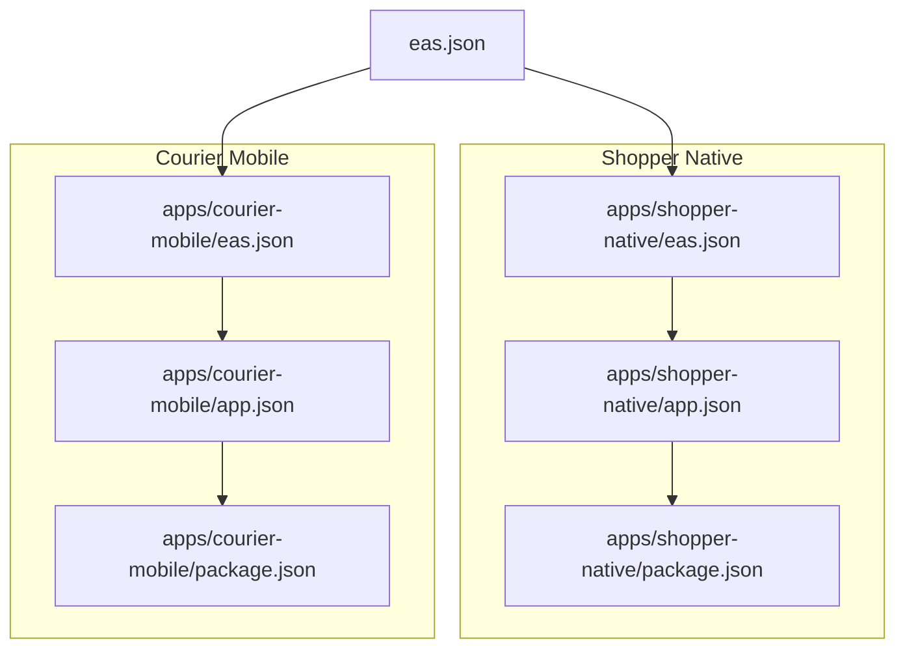
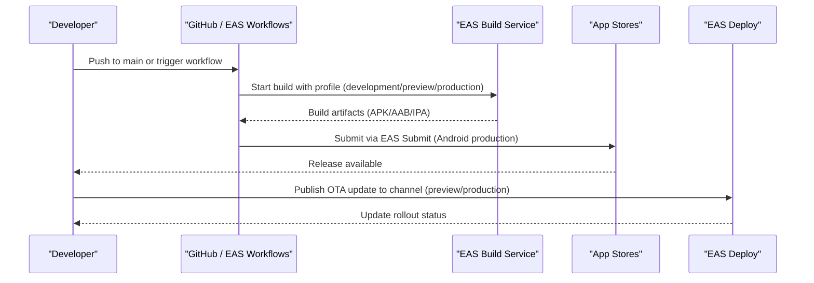
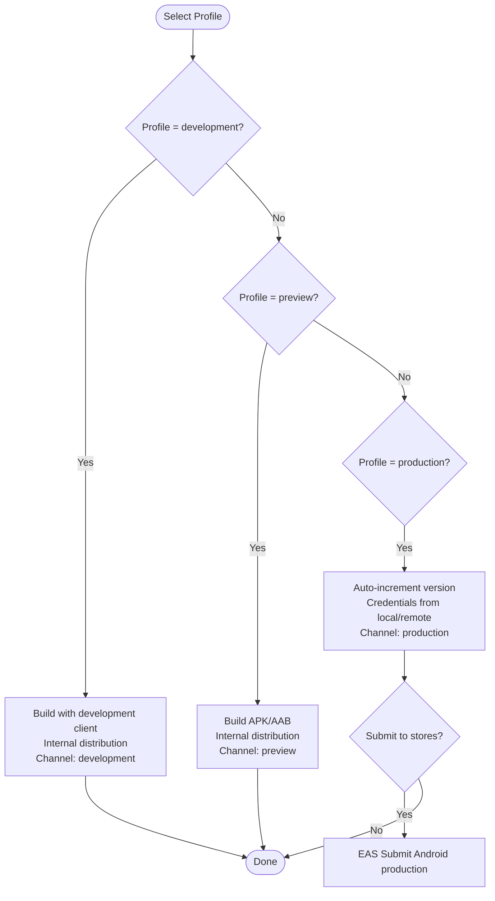
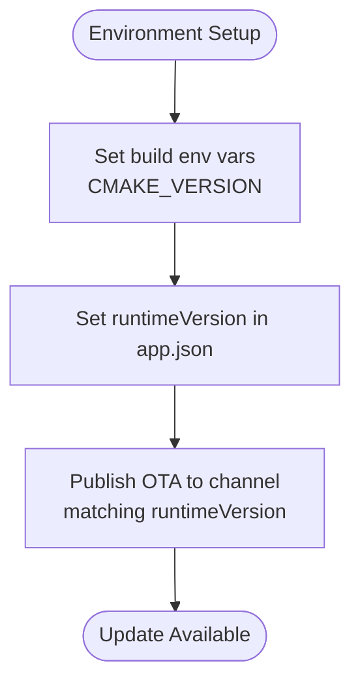
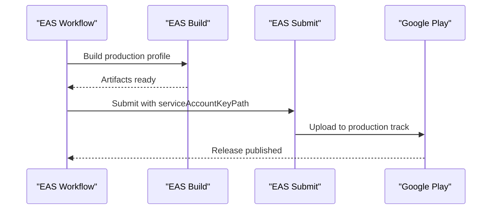
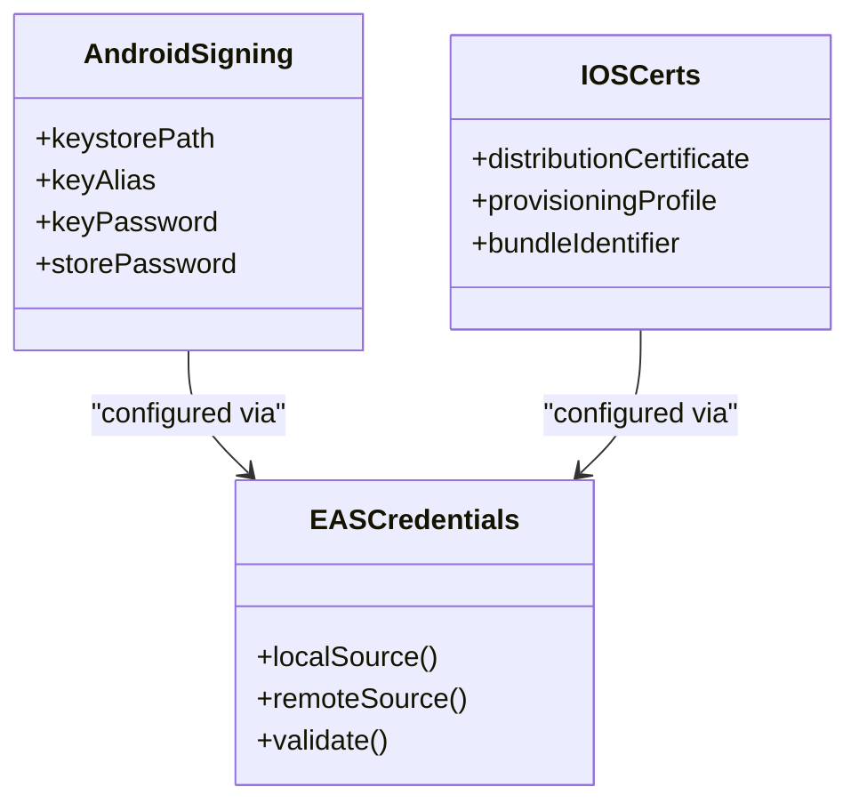
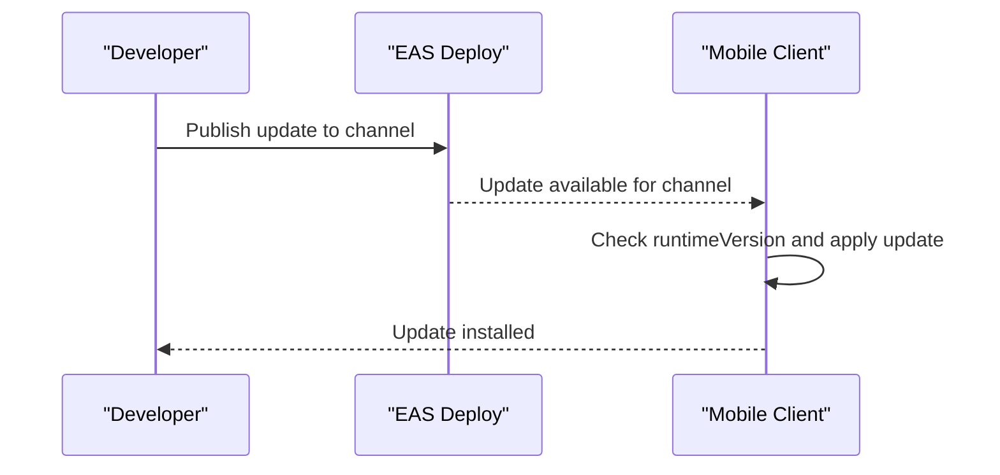
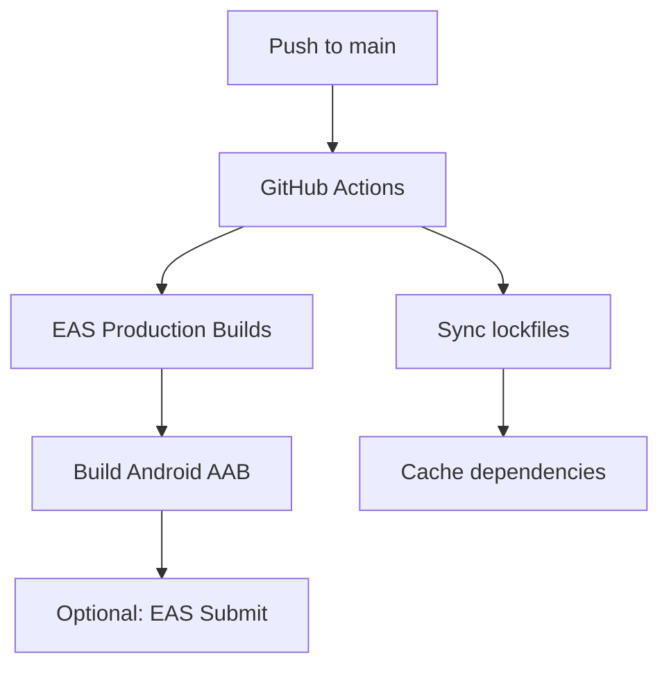
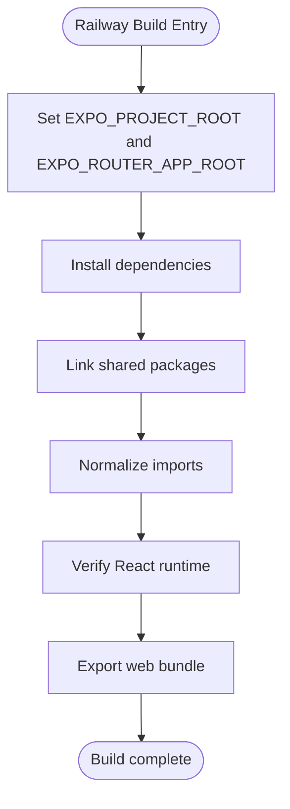
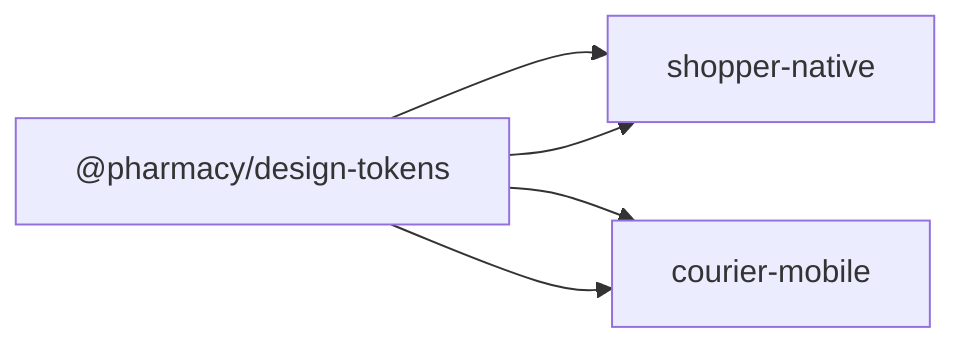

# Build & Deployment

<cite>
**Referenced Files in This Document**
- [eas.json](file://eas.json)
- [apps/shopper-native/eas.json](file://apps/shopper-native/eas.json)
- [apps/courier-mobile/eas.json](file://apps/courier-mobile/eas.json)
- [apps/shopper-native/app.json](file://apps/shopper-native/app.json)
- [apps/courier-mobile/app.json](file://apps/courier-mobile/app.json)
- [apps/shopper-native/package.json](file://apps/shopper-native/package.json)
- [apps/courier-mobile/package.json](file://apps/courier-mobile/package.json)
- [apps/shopper-native/.eas/workflows/production-builds.yml](file://apps/shopper-native/.eas/workflows/production-builds.yml)
- [scripts/railway/build-shopper-native.sh](file://scripts/railway/build-shopper-native.sh)
- [scripts/railway/start-shopper-native.sh](file://scripts/railway/start-shopper-native.sh)
- [apps/shopper-native/railway-build.sh](file://apps/shopper-native/railway-build.sh)
- [.github/workflows/sync-npm-lockfile.yml](file:.github/workflows/sync-npm-lockfile.yml)
- [.github/workflows/sync-root-lock.yml](file:.github/workflows/sync-root-lock.yml)
</cite>

## Table of Contents
1. Introduction
2. Project Structure
3. Core Components
4. Architecture Overview
5. Detailed Component Analysis
6. Dependency Analysis
7. Performance Considerations
8. Troubleshooting Guide
9. Conclusion
10. Appendices

## Introduction
This document explains how to build and deploy the mobile applications in this repository using EAS Build and EAS Deploy. It covers:
- EAS Build configuration for iOS and Android across development, preview, and production profiles
- Environment variable management and runtime versioning for OTA updates
- App store submission via EAS Submit
- Code signing requirements, provisioning profiles, and certificate management
- CI/CD automation with GitHub Actions and EAS Workflows
- Troubleshooting common build issues, optimizing build times, and managing app metadata and icons

## Project Structure
The repository contains two Expo-based mobile apps:
- Shopper Native (customer-facing app) under apps/shopper-native
- Courier Mobile (driver app) under apps/courier-mobile

Each app has its own EAS configuration and Expo manifest that define identifiers, permissions, plugins, and platform-specific settings. The root eas.json provides shared defaults and submit configuration for the primary app.

**Diagram sources**
- [eas.json:1-76](file://eas.json#L1-L76)
- [apps/shopper-native/eas.json:1-81](file://apps/shopper-native/eas.json#L1-L81)
- [apps/courier-mobile/eas.json:1-25](file://apps/courier-mobile/eas.json#L1-L25)
- [apps/shopper-native/app.json:1-113](file://apps/shopper-native/app.json#L1-L113)
- [apps/courier-mobile/app.json:1-122](file://apps/courier-mobile/app.json#L1-L122)
- [apps/shopper-native/package.json:1-104](file://apps/shopper-native/package.json#L1-L104)
- [apps/courier-mobile/package.json:1-66](file://apps/courier-mobile/package.json#L1-L66)

**Section sources**
- [eas.json:1-76](file://eas.json#L1-L76)
- [apps/shopper-native/eas.json:1-81](file://apps/shopper-native/eas.json#L1-L81)
- [apps/courier-mobile/eas.json:1-25](file://apps/courier-mobile/eas.json#L1-L25)
- [apps/shopper-native/app.json:1-113](file://apps/shopper-native/app.json#L1-L113)
- [apps/courier-mobile/app.json:1-122](file://apps/courier-mobile/app.json#L1-L122)

## Core Components
- EAS Build profiles:
  - Development: internal distribution with development client enabled
  - Preview: internal distribution, Android APK or AAB variants
  - Production: auto-incremented versions, platform-specific credential sources, channels for OTA
- App manifests:
  - Bundle identifiers, package names, permissions, splash screens, and plugin configurations
  - Runtime versioning for OTA updates
- Submission:
  - Google Play service account key path and track selection

Key behaviors observed:
- Root eas.json defines multiple build profiles and a submit profile for Android production
- Shopper native eas.json mirrors these profiles and adds explicit credential sources per platform for production builds
- Courier mobile eas.json defines development, preview, and production profiles with local versioning
- Both apps declare required permissions and platform-specific settings in their app.json files
- Shopper native sets runtimeVersion for OTA update compatibility

**Section sources**
- [eas.json:6-74](file://eas.json#L6-L74)
- [apps/shopper-native/eas.json:6-79](file://apps/shopper-native/eas.json#L6-L79)
- [apps/courier-mobile/eas.json:6-23](file://apps/courier-mobile/eas.json#L6-L23)
- [apps/shopper-native/app.json:16-39](file://apps/shopper-native/app.json#L16-L39)
- [apps/courier-mobile/app.json:16-50](file://apps/courier-mobile/app.json#L16-L50)
- [apps/shopper-native/app.json:102-111](file://apps/shopper-native/app.json#L102-L111)

## Architecture Overview
EAS Build orchestrates cloud-based builds for iOS and Android based on each app’s eas.json and app.json. EAS Deploy publishes OTA updates to configured channels. EAS Submit automates Google Play releases when credentials are configured.

**Diagram sources**
- [apps/shopper-native/.eas/workflows/production-builds.yml:1-22](file://apps/shopper-native/.eas/workflows/production-builds.yml#L1-L22)
- [eas.json:66-74](file://eas.json#L66-L74)
- [apps/shopper-native/eas.json:57-79](file://apps/shopper-native/eas.json#L57-L79)

## Detailed Component Analysis

### EAS Build Profiles and Channels
- Profiles:
  - development: internal distribution, development client enabled, channel set to development
  - preview: internal distribution, Android buildType configurable (apk or app-bundle), channel set to preview
  - production-apk/verify: auto-incremented versions, specific channels for testing and release candidates
  - production: auto-incremented versions, platform-specific credential sources, channel set to production
- Channels:
  - Used by EAS Deploy to target OTA updates; ensure runtimeVersion matches app.json runtimeVersion for successful updates

**Diagram sources**
- [eas.json:6-65](file://eas.json#L6-L65)
- [apps/shopper-native/eas.json:6-70](file://apps/shopper-native/eas.json#L6-L70)
- [apps/courier-mobile/eas.json:6-23](file://apps/courier-mobile/eas.json#L6-L23)

**Section sources**
- [eas.json:6-65](file://eas.json#L6-L65)
- [apps/shopper-native/eas.json:6-70](file://apps/shopper-native/eas.json#L6-L70)
- [apps/courier-mobile/eas.json:6-23](file://apps/courier-mobile/eas.json#L6-L23)

### Environment Variables and Runtime Versioning
- Build-time environment variables:
  - CMAKE_VERSION is set in several build profiles for consistent native builds
- Runtime versioning:
  - Shopper native sets runtimeVersion in app.json; ensure it aligns with OTA update strategy
- Secrets and credentials:
  - Use EAS project secrets for sensitive values; avoid committing secrets to repository

**Diagram sources**
- [eas.json:11-13](file://eas.json#L11-L13)
- [apps/shopper-native/eas.json:11-13](file://apps/shopper-native/eas.json#L11-L13)
- [apps/shopper-native/app.json:102-111](file://apps/shopper-native/app.json#L102-L111)

**Section sources**
- [eas.json:11-13](file://eas.json#L11-L13)
- [apps/shopper-native/eas.json:11-13](file://apps/shopper-native/eas.json#L11-L13)
- [apps/shopper-native/app.json:102-111](file://apps/shopper-native/app.json#L102-L111)

### App Store Submission with EAS Submit
- Android production submission:
  - Service account key path configured in eas.json submit section
  - Track set to production for Google Play release
- Workflow integration:
  - EAS Workflows can be extended to call EAS Submit after successful builds

**Diagram sources**
- [eas.json:67-74](file://eas.json#L67-L74)
- [apps/shopper-native/eas.json:72-79](file://apps/shopper-native/eas.json#L72-L79)
- [apps/shopper-native/.eas/workflows/production-builds.yml:9-15](file://apps/shopper-native/.eas/workflows/production-builds.yml#L9-L15)

**Section sources**
- [eas.json:67-74](file://eas.json#L67-L74)
- [apps/shopper-native/eas.json:72-79](file://apps/shopper-native/eas.json#L72-L79)
- [apps/shopper-native/.eas/workflows/production-builds.yml:1-22](file://apps/shopper-native/.eas/workflows/production-builds.yml#L1-L22)

### Code Signing, Provisioning Profiles, and Certificates
- Android:
  - Credentials sourced locally for production builds in shopper native eas.json
  - Ensure keystore and upload keys are configured in EAS credentials
- iOS:
  - Credentials sourced remotely for production builds in shopper native eas.json
  - Configure Apple certificates and provisioning profiles via EAS credentials
- Best practices:
  - Keep credentials secure using EAS credentials manager
  - Separate profiles for development, preview, and production

**Diagram sources**
- [apps/shopper-native/eas.json:57-70](file://apps/shopper-native/eas.json#L57-L70)
- [eas.json:57-65](file://eas.json#L57-L65)

**Section sources**
- [apps/shopper-native/eas.json:57-70](file://apps/shopper-native/eas.json#L57-L70)
- [eas.json:57-65](file://eas.json#L57-L65)

### Over-the-Air Updates with EAS Deploy
- Channels:
  - development, preview, production channels defined in build profiles
- Runtime version alignment:
  - Ensure runtimeVersion in app.json matches expected OTA update behavior
- Publishing:
  - Use EAS Deploy to publish updates to channels; clients fetch updates based on channel and runtimeVersion

**Diagram sources**
- [eas.json:6-65](file://eas.json#L6-L65)
- [apps/shopper-native/app.json:102-111](file://apps/shopper-native/app.json#L102-L111)

**Section sources**
- [eas.json:6-65](file://eas.json#L6-L65)
- [apps/shopper-native/app.json:102-111](file://apps/shopper-native/app.json#L102-L111)

### CI/CD Pipelines and Automation
- GitHub Actions:
  - Lockfile synchronization workflows ensure consistent dependency resolution
- EAS Workflows:
  - Production builds triggered on push to main; Android production AAB build configured
- Railway scripts:
  - Wrapper scripts for building and serving web assets; not directly related to mobile builds but part of overall pipeline

**Diagram sources**
- [.github/workflows/sync-npm-lockfile.yml:1-48](file:.github/workflows/sync-npm-lockfile.yml#L1-L48)
- [.github/workflows/sync-root-lock.yml:1-42](file:.github/workflows/sync-root-lock.yml#L1-L42)
- [apps/shopper-native/.eas/workflows/production-builds.yml:1-22](file://apps/shopper-native/.eas/workflows/production-builds.yml#L1-L22)

**Section sources**
- [.github/workflows/sync-npm-lockfile.yml:1-48](file:.github/workflows/sync-npm-lockfile.yml#L1-L48)
- [.github/workflows/sync-root-lock.yml:1-42](file:.github/workflows/sync-root-lock.yml#L1-L42)
- [apps/shopper-native/.eas/workflows/production-builds.yml:1-22](file://apps/shopper-native/.eas/workflows/production-builds.yml#L1-L22)

### Build Scripts and Web Export Pipeline
- Railway build script:
  - Sets Expo project roots, installs dependencies, links shared packages, normalizes imports, verifies React runtime, exports web bundle
- Wrapper scripts:
  - Provide consistent entry points for build and start commands in containerized environments

**Diagram sources**
- [apps/shopper-native/railway-build.sh:1-86](file://apps/shopper-native/railway-build.sh#L1-L86)
- [scripts/railway/build-shopper-native.sh:1-5](file://scripts/railway/build-shopper-native.sh#L1-L5)
- [scripts/railway/start-shopper-native.sh:1-5](file://scripts/railway/start-shopper-native.sh#L1-L5)

**Section sources**
- [apps/shopper-native/railway-build.sh:1-86](file://apps/shopper-native/railway-build.sh#L1-L86)
- [scripts/railway/build-shopper-native.sh:1-5](file://scripts/railway/build-shopper-native.sh#L1-L5)
- [scripts/railway/start-shopper-native.sh:1-5](file://scripts/railway/start-shopper-native.sh#L1-L5)

### App Metadata and Icons
- Shopper native:
  - Name, slug, icon, splash screen, bundle identifier, package name, permissions, and plugins configured in app.json
- Courier mobile:
  - Name, slug, icon, splash screen, bundle identifier, package name, permissions, and plugins configured in app.json
- Recommendations:
  - Maintain separate icon assets per platform
  - Ensure permissions match feature usage and provide clear descriptions

**Section sources**
- [apps/shopper-native/app.json:1-39](file://apps/shopper-native/app.json#L1-L39)
- [apps/courier-mobile/app.json:1-50](file://apps/courier-mobile/app.json#L1-L50)

## Dependency Analysis
- Shared packages:
  - Both apps reference shared design tokens and UI components via file protocol paths
- Node versions:
  - Build profiles specify Node versions for consistency
- Lockfile synchronization:
  - GitHub Actions keep lockfiles synchronized to prevent drift

**Diagram sources**
- [apps/shopper-native/package.json:23-24](file://apps/shopper-native/package.json#L23-L24)
- [apps/courier-mobile/package.json:17-18](file://apps/courier-mobile/package.json#L17-L18)

**Section sources**
- [apps/shopper-native/package.json:23-24](file://apps/shopper-native/package.json#L23-L24)
- [apps/courier-mobile/package.json:17-18](file://apps/courier-mobile/package.json#L17-L18)
- [.github/workflows/sync-npm-lockfile.yml:1-48](file:.github/workflows/sync-npm-lockfile.yml#L1-L48)
- [.github/workflows/sync-root-lock.yml:1-42](file:.github/workflows/sync-root-lock.yml#L1-L42)

## Performance Considerations
- Build caching:
  - Use EAS cache for node_modules and Gradle/iOS build caches
- Minification and ProGuard:
  - Enabled in shopper native build properties for release builds
- Node version pinning:
  - Consistent Node versions reduce rebuild overhead
- Channel strategy:
  - Use preview channels for rapid iteration; production channel for stable releases

[No sources needed since this section provides general guidance]

## Troubleshooting Guide
Common issues and resolutions:
- Build failures due to missing credentials:
  - Ensure EAS credentials are configured for Android keystore and iOS certificates/provisioning profiles
- OTA update not applied:
  - Verify runtimeVersion in app.json matches expected value and channel configuration
- Permission errors:
  - Confirm permissions declared in app.json match runtime usage and platform requirements
- Lockfile mismatches:
  - Run lockfile sync workflows to ensure consistent dependency resolution

**Section sources**
- [apps/shopper-native/eas.json:57-70](file://apps/shopper-native/eas.json#L57-L70)
- [apps/shopper-native/app.json:16-39](file://apps/shopper-native/app.json#L16-L39)
- [apps/courier-mobile/app.json:16-50](file://apps/courier-mobile/app.json#L16-L50)
- [.github/workflows/sync-npm-lockfile.yml:1-48](file:.github/workflows/sync-npm-lockfile.yml#L1-L48)

## Conclusion
This repository uses EAS Build and EAS Deploy to streamline mobile app builds and updates across development, preview, and production environments. With well-defined build profiles, channels, and submission configurations, teams can automate releases and manage OTA updates effectively. Ensuring proper code signing, environment variables, and CI/CD pipelines will help maintain a reliable and efficient deployment process.

[No sources needed since this section summarizes without analyzing specific files]

## Appendices

### Quick Commands Reference
- Build development client:
  - Use development profile for internal distribution
- Build preview APK/AAB:
  - Use preview profile with appropriate buildType
- Build production:
  - Use production profile with auto-increment and credential sources
- Submit to Google Play:
  - Use submit profile with service account key path

**Section sources**
- [eas.json:6-74](file://eas.json#L6-L74)
- [apps/shopper-native/eas.json:6-79](file://apps/shopper-native/eas.json#L6-L79)
- [apps/courier-mobile/eas.json:6-23](file://apps/courier-mobile/eas.json#L6-L23)