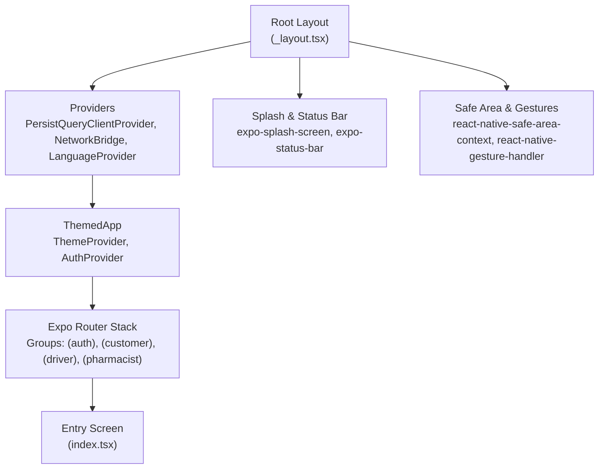
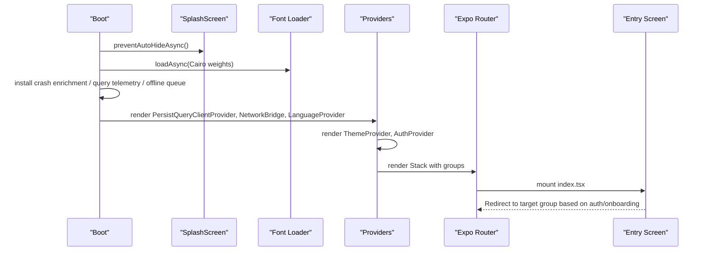
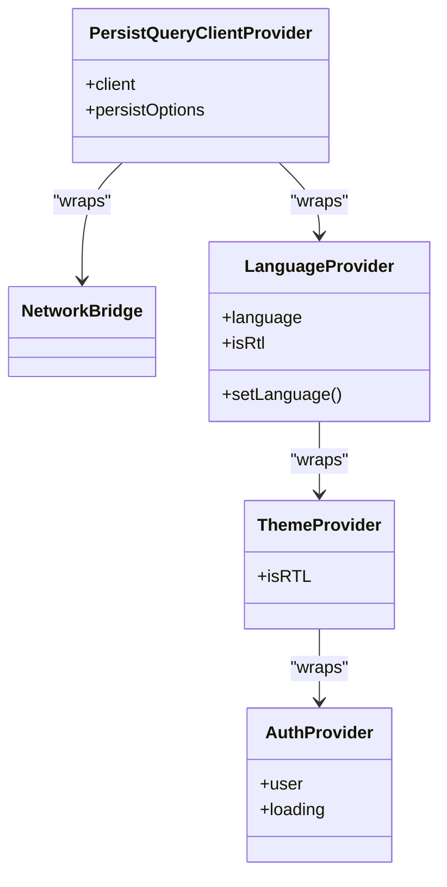
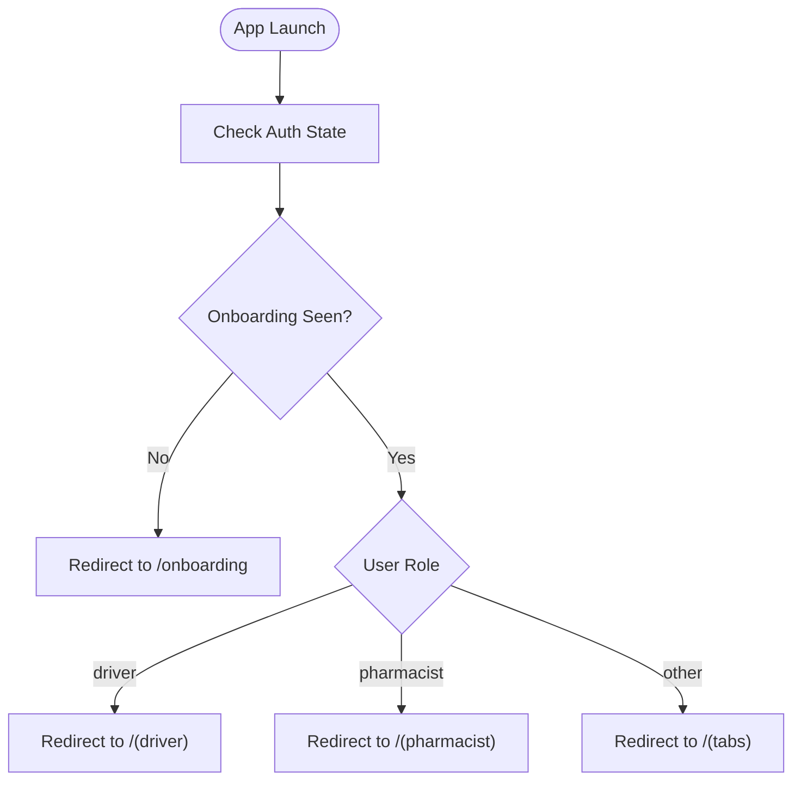
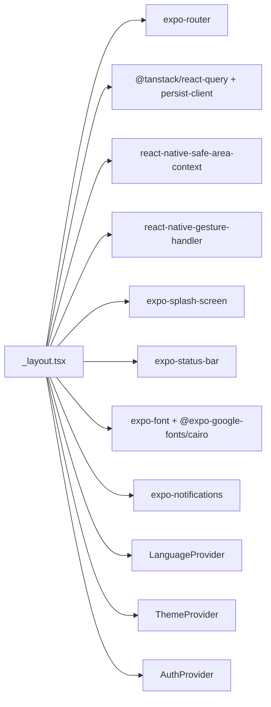

# Expo App Structure

<cite>
**Referenced Files in This Document**
- [_layout.tsx](file://apps/shopper-native/app/_layout.tsx)
- [app.json](file://apps/shopper-native/app.json)
- [package.json](file://apps/shopper-native/package.json)
- [index.tsx](file://apps/shopper-native/app/index.tsx)
- [queryClient.ts](file://apps/shopper-native/src/lib/queryClient.ts)
- [ErrorBoundary.tsx](file://apps/shopper-native/src/shared/components/ErrorBoundary.tsx)
- [LanguageProvider.tsx](file://apps/shopper-native/src/i18n/LanguageProvider.tsx)
</cite>

## Table of Contents
1. [Introduction](#introduction)
2. [Project Structure](#project-structure)
3. [Core Components](#core-components)
4. [Architecture Overview](#architecture-overview)
5. [Detailed Component Analysis](#detailed-component-analysis)
6. [Dependency Analysis](#dependency-analysis)
7. [Performance Considerations](#performance-considerations)
8. [Troubleshooting Guide](#troubleshooting-guide)
9. [Conclusion](#conclusion)
10. [Appendices](#appendices)

## Introduction
This document explains the structure and initialization of the Expo-based React Native app (shopper-native). It covers the root layout, navigation with Expo Router, provider hierarchy (including AuthProvider, ThemeProvider, LanguageProvider, and QueryClient providers), splash screen handling, error boundaries, global error handling, platform-specific configuration, font loading, status bar management, safe area handling, and how to add screens, configure navigation groups, and set up features like notifications and offline support.

## Project Structure
The app uses Expo Router’s file-based routing under apps/shopper-native/app. The root layout wires up providers, navigation, splash, fonts, and platform settings. The entry screen decides where to redirect based on authentication state and onboarding.

**Diagram sources**
- [_layout.tsx:1-292](file://apps/shopper-native/app/_layout.tsx#L1-L292)
- [index.tsx:1-53](file://apps/shopper-native/app/index.tsx#L1-L53)

**Section sources**
- [_layout.tsx:1-292](file://apps/shopper-native/app/_layout.tsx#L1-L292)
- [index.tsx:1-53](file://apps/shopper-native/app/index.tsx#L1-L53)
- [app.json:1-113](file://apps/shopper-native/app.json#L1-L113)

## Core Components
- Root layout orchestrates bootstrapping: prevents auto-hide splash, loads fonts, sets up global telemetry/offline queue, installs a global error handler, then renders the provider tree and navigation stack.
- Provider hierarchy:
  - PersistQueryClientProvider wraps the app with a TanStack Query client configured for mobile (stale time, gcTime, retry policy, network mode).
  - NetworkBridge connects network status to the app.
  - LanguageProvider exposes language and RTL state.
  - ThemedApp applies ThemeProvider and AuthProvider, configures StatusBar, notification sync, push registration, cart reservation notifier, PharmacyBootstrap, and the Expo Router Stack.
- Entry screen resolves auth and onboarding state to redirect to the correct route group.

**Section sources**
- [_layout.tsx:81-105](file://apps/shopper-native/app/_layout.tsx#L81-L105)
- [_layout.tsx:109-175](file://apps/shopper-native/app/_layout.tsx#L109-L175)
- [_layout.tsx:179-226](file://apps/shopper-native/app/_layout.tsx#L179-L226)
- [_layout.tsx:230-292](file://apps/shopper-native/app/_layout.tsx#L230-L292)
- [index.tsx:10-52](file://apps/shopper-native/app/index.tsx#L10-L52)
- [queryClient.ts:1-62](file://apps/shopper-native/src/lib/queryClient.ts#L1-L62)

## Architecture Overview
The app initializes by preventing the splash from hiding automatically, loading fonts, and starting background services. It then renders a layered provider tree that ensures data caching, theming, localization, and authentication are available to all screens. Navigation is defined declaratively in the root Stack, grouping routes by role or feature.

**Diagram sources**
- [_layout.tsx:81-105](file://apps/shopper-native/app/_layout.tsx#L81-L105)
- [_layout.tsx:230-292](file://apps/shopper-native/app/_layout.tsx#L230-L292)
- [index.tsx:10-52](file://apps/shopper-native/app/index.tsx#L10-L52)

## Detailed Component Analysis

### Root Layout and Initialization
- Prevents automatic splash hide and schedules a safety timeout to hide it after font loading completes.
- Loads multiple font weights for Cairo via expo-font.
- Installs crash enrichment, query client telemetry, and starts an offline queue runner during boot.
- Wraps the UI in ErrorBoundary, GestureHandlerRootView, SafeAreaProvider, and PersistQueryClientProvider.
- Configures StatusBar for non-web platforms with light style and transparent background.
- Renders the Expo Router Stack with grouped routes: (auth), (customer), (driver), (pharmacist), plus dedicated screens like onboarding and reset-password.

**Section sources**
- [_layout.tsx:81-105](file://apps/shopper-native/app/_layout.tsx#L81-L105)
- [_layout.tsx:179-226](file://apps/shopper-native/app/_layout.tsx#L179-L226)
- [_layout.tsx:230-292](file://apps/shopper-native/app/_layout.tsx#L230-L292)

### Provider Hierarchy
- PersistQueryClientProvider: Uses a shared QueryClient tuned for mobile with staleTime, gcTime, refetch policies, and retry logic. Mutations use offlineFirst mode to queue operations when offline.
- NetworkBridge: Bridges network connectivity changes into the app context.
- LanguageProvider: Exposes current language and RTL state; persists language selection and reacts to i18n events.
- ThemeProvider: Applies theme and RTL direction to the UI tree.
- AuthProvider: Provides authentication state and guards access to protected routes.

**Diagram sources**
- [_layout.tsx:230-292](file://apps/shopper-native/app/_layout.tsx#L230-L292)
- [LanguageProvider.tsx:28-71](file://apps/shopper-native/src/i18n/LanguageProvider.tsx#L28-L71)
- [queryClient.ts:32-57](file://apps/shopper-native/src/lib/queryClient.ts#L32-L57)

**Section sources**
- [_layout.tsx:230-292](file://apps/shopper-native/app/_layout.tsx#L230-L292)
- [LanguageProvider.tsx:28-71](file://apps/shopper-native/src/i18n/LanguageProvider.tsx#L28-L71)
- [queryClient.ts:1-62](file://apps/shopper-native/src/lib/queryClient.ts#L1-L62)

### Navigation Setup with Expo Router
- Declarative Stack defines default options (no header, fade animation).
- Route groups:
  - (auth): modal presentation with slide-from-bottom animation.
  - (customer), (driver), (pharmacist): top-level sections for different roles.
  - Dedicated screens: index (entry), onboarding, reset-password.
- Entry screen reads onboarding state and user role to redirect to the appropriate group.

**Diagram sources**
- [index.tsx:10-52](file://apps/shopper-native/app/index.tsx#L10-L52)

**Section sources**
- [_layout.tsx:205-214](file://apps/shopper-native/app/_layout.tsx#L205-L214)
- [index.tsx:10-52](file://apps/shopper-native/app/index.tsx#L10-L52)

### Splash Screen Implementation
- SplashScreen.preventAutoHideAsync() is called at startup to keep the splash visible while fonts load and boot tasks complete.
- A safety timeout hides the splash if something blocks normal completion.
- A separate ErrorBoundary wraps the SplashOverlay to ensure the splash can still be shown even if early rendering fails.

**Section sources**
- [_layout.tsx:81-89](file://apps/shopper-native/app/_layout.tsx#L81-L89)
- [_layout.tsx:230-252](file://apps/shopper-native/app/_layout.tsx#L230-L252)
- [_layout.tsx:278-282](file://apps/shopper-native/app/_layout.tsx#L278-L282)

### Error Boundaries and Global Error Handling
- ErrorBoundary component catches render-phase exceptions and shows a bilingual recovery UI without depending on custom fonts or themes to guarantee visibility.
- Root layout wraps the entire app in an ErrorBoundary and also isolates the splash overlay in its own boundary.
- A global ErrorUtils handler is installed to log fatal errors during development.

**Section sources**
- [ErrorBoundary.tsx:1-188](file://apps/shopper-native/src/shared/components/ErrorBoundary.tsx#L1-L188)
- [_layout.tsx:93-105](file://apps/shopper-native/app/_layout.tsx#L93-L105)
- [_layout.tsx:256-286](file://apps/shopper-native/app/_layout.tsx#L256-L286)

### Platform-Specific Configuration
- app.json defines:
  - App metadata, scheme, orientation, splash image, and colors.
  - iOS permissions and bundle identifier.
  - Android package name, adaptive icon, Google Services file, and requested permissions (camera, audio, location).
  - Web bundler and output settings.
  - Plugins for fonts, splash, build properties, camera, image picker, location, web browser, video, notifications, and a custom Hermes patch.
  - Typed routes experiment enabled.
- StatusBar is configured only on non-web platforms with light style and transparent background.

**Section sources**
- [app.json:1-113](file://apps/shopper-native/app.json#L1-L113)
- [_layout.tsx:191-195](file://apps/shopper-native/app/_layout.tsx#L191-L195)

### Font Loading
- Multiple Cairo font weights are loaded asynchronously using expo-font to ensure consistent typography across platforms.
- Font loading runs once at app start; splash remains visible until fonts are ready or a timeout triggers.

**Section sources**
- [_layout.tsx:23-35](file://apps/shopper-native/app/_layout.tsx#L23-L35)
- [_layout.tsx:232-252](file://apps/shopper-native/app/_layout.tsx#L232-L252)

### Status Bar Management
- Non-web platforms use a light status bar with a transparent background to blend with the app content.

**Section sources**
- [_layout.tsx:191-195](file://apps/shopper-native/app/_layout.tsx#L191-L195)

### Safe Area Handling
- SafeAreaProvider ensures content respects device notches and safe insets across platforms.
- GestureHandlerRootView enables gesture interactions throughout the app.

**Section sources**
- [_layout.tsx:256-286](file://apps/shopper-native/app/_layout.tsx#L256-L286)

### Notifications and Push Registration
- NotificationSync hook keeps local notification state in sync with server state.
- PushBootstrap registers push notifications when authenticated and handles tap actions by marking notifications read and navigating to action URLs.
- Notifications plugin is configured in app.json with a brand color.

**Section sources**
- [_layout.tsx:109-151](file://apps/shopper-native/app/_layout.tsx#L109-L151)
- [app.json:91-96](file://apps/shopper-native/app.json#L91-L96)

### Offline Support
- QueryClient is configured with:
  - Stale and garbage collection times suitable for mobile usage.
  - Refetch policies optimized for app lifecycle.
  - Retry logic that avoids reattempting terminal errors.
  - Mutations run in offlineFirst mode to queue operations when offline.
- An offline queue runner is started during boot to process queued mutations when connectivity returns.

**Section sources**
- [queryClient.ts:1-62](file://apps/shopper-native/src/lib/queryClient.ts#L1-L62)
- [_layout.tsx:85-89](file://apps/shopper-native/app/_layout.tsx#L85-L89)

## Dependency Analysis
Key runtime dependencies include:
- Expo Router for navigation and typed routes.
- TanStack Query and persist client for data caching and persistence.
- React Native Safe Area Context and Gesture Handler for UI and gestures.
- Expo modules for splash, status bar, fonts, notifications, location, camera, and more.
- Custom providers and components for auth, theme, and language.

**Diagram sources**
- [_layout.tsx:1-78](file://apps/shopper-native/app/_layout.tsx#L1-L78)
- [package.json:17-79](file://apps/shopper-native/package.json#L17-L79)

**Section sources**
- [package.json:17-79](file://apps/shopper-native/package.json#L17-L79)
- [_layout.tsx:1-78](file://apps/shopper-native/app/_layout.tsx#L1-L78)

## Performance Considerations
- Use staleTime and gcTime to reduce unnecessary network calls and manage memory efficiently.
- Avoid refetch on window focus/mount unless necessary to minimize redundant requests.
- Prefer offlineFirst mutations to maintain responsiveness when connectivity is intermittent.
- Keep splash visible until critical assets (fonts) are loaded to avoid visual glitches.
- Limit heavy work in render paths; defer initialization to effects or boot sequence.

[No sources needed since this section provides general guidance]

## Troubleshooting Guide
- If the app crashes before providers mount, rely on the root ErrorBoundary to show a recovery UI and capture diagnostics.
- If fonts fail to load, the splash safety timeout ensures the UI becomes usable; check console logs for font loading errors.
- For navigation issues, verify route groups exist and match the Redirect targets in the entry screen.
- For notification taps not working, confirm push registration is enabled and action URLs are correctly handled.
- For offline behavior, ensure the offline queue runner is started and mutations are marked offlineFirst.

**Section sources**
- [ErrorBoundary.tsx:56-89](file://apps/shopper-native/src/shared/components/ErrorBoundary.tsx#L56-L89)
- [_layout.tsx:81-89](file://apps/shopper-native/app/_layout.tsx#L81-L89)
- [index.tsx:10-52](file://apps/shopper-native/app/index.tsx#L10-L52)

## Conclusion
The shopper-native app follows a robust initialization pattern: it secures the UI with error boundaries, prepares data and networking through TanStack Query, manages theming and localization via providers, and uses Expo Router for clear, role-based navigation. Platform-specific configurations and plugins enable rich native capabilities like notifications, location, and media. The design supports offline-first workflows and resilient UX through splash management and graceful error handling.

[No sources needed since this section summarizes without analyzing specific files]

## Appendices

### How to Add a New Screen
- Create a new file under apps/shopper-native/app following Expo Router conventions.
- If the screen belongs to a role or feature, place it inside the corresponding group folder (e.g., (customer), (driver), (pharmacist)).
- Optionally register the screen in the root Stack if it is not part of a group.

**Section sources**
- [_layout.tsx:205-214](file://apps/shopper-native/app/_layout.tsx#L205-L214)

### How to Configure Navigation Groups
- Group folders under apps/shopper-native/app define nested navigation contexts.
- Use the root Stack to declare group screens and customize presentation and animations per group.

**Section sources**
- [_layout.tsx:205-214](file://apps/shopper-native/app/_layout.tsx#L205-L214)

### How to Set Up App-Wide Features
- Notifications: Ensure the notifications plugin is configured in app.json and use the provided hooks for synchronization and push registration.
- Offline Support: Rely on the QueryClient configuration and offline queue runner; mark mutations as offlineFirst where appropriate.
- Fonts and Theming: Add new fonts via expo-font and expose them through your theme layer if needed.

**Section sources**
- [app.json:91-96](file://apps/shopper-native/app.json#L91-L96)
- [_layout.tsx:109-151](file://apps/shopper-native/app/_layout.tsx#L109-L151)
- [queryClient.ts:32-57](file://apps/shopper-native/src/lib/queryClient.ts#L32-L57)