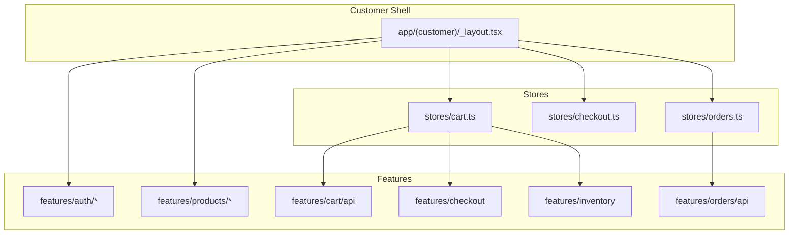
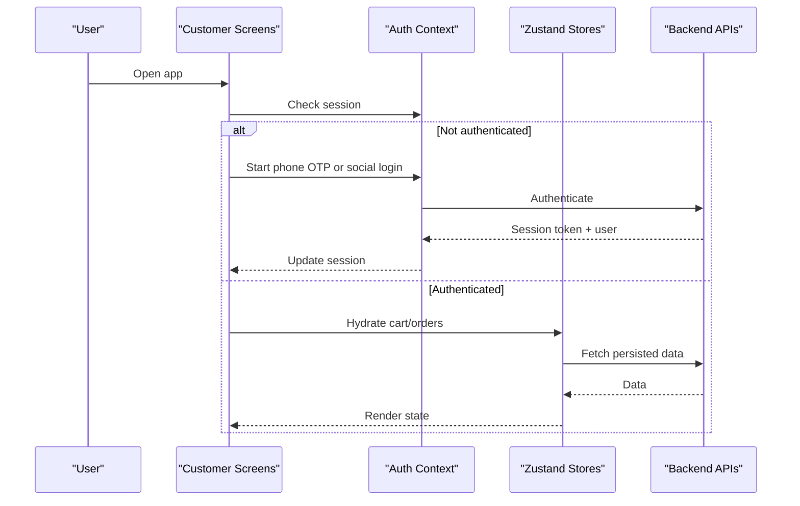
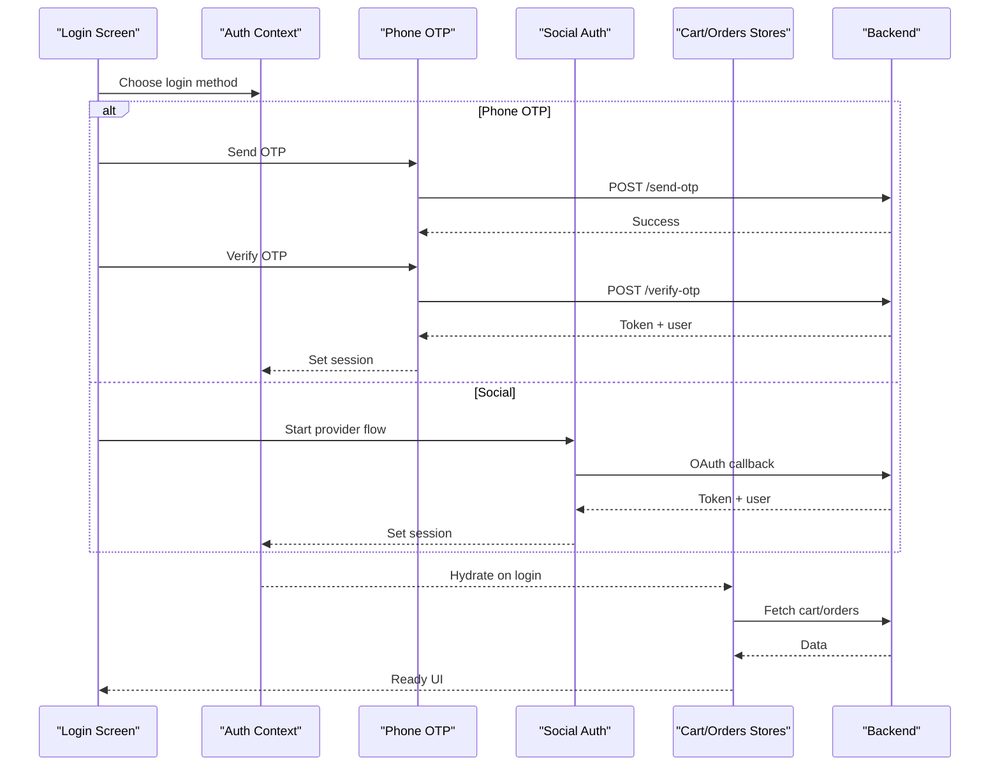
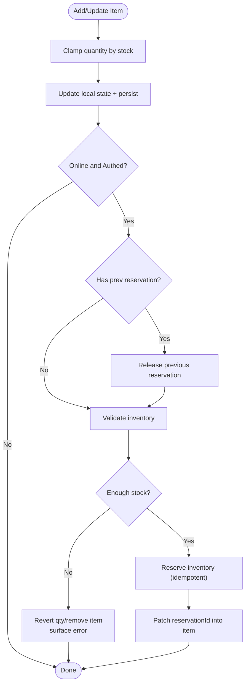
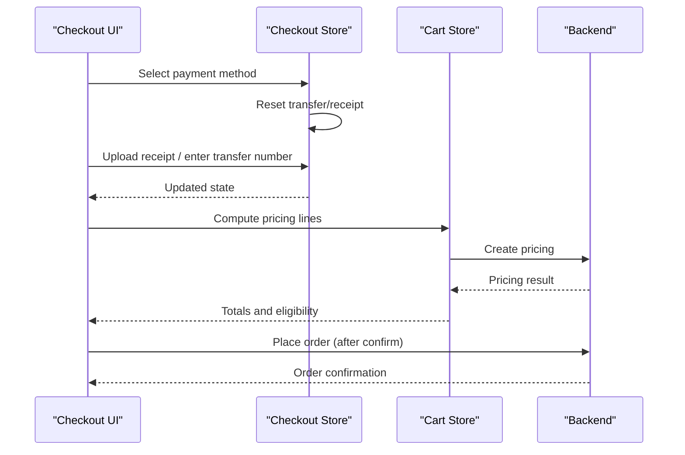
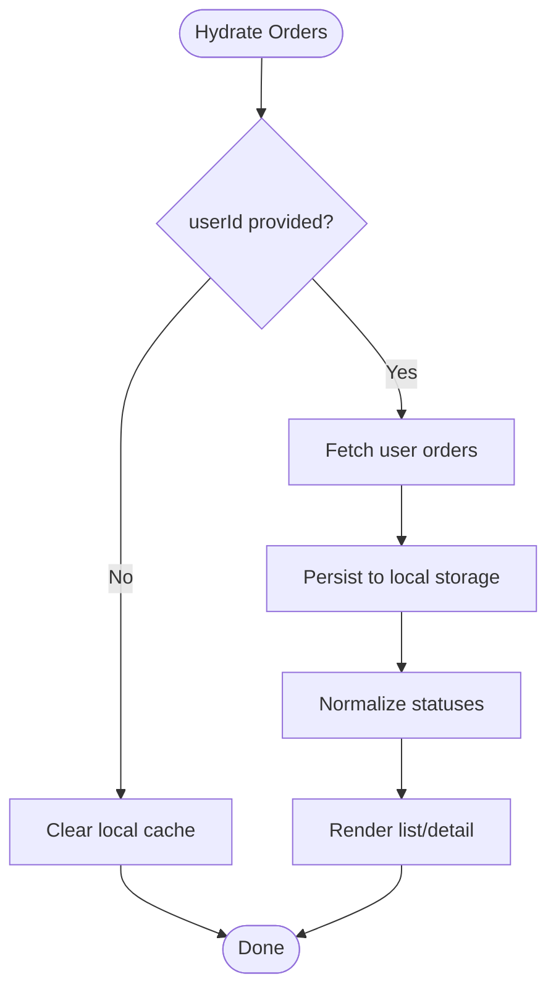
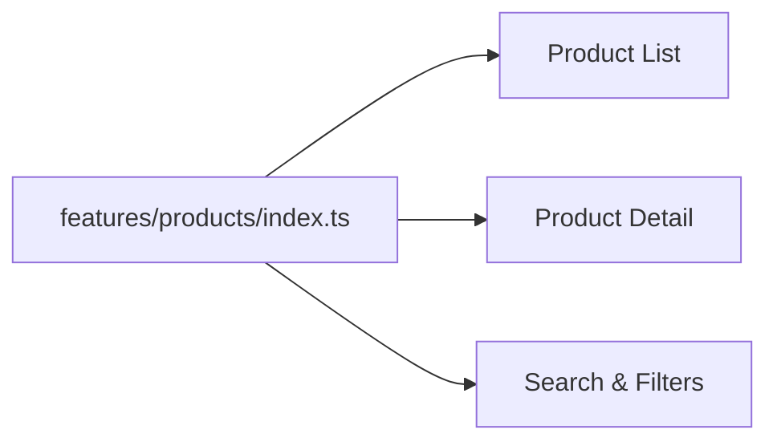
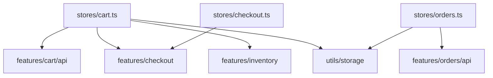

# Customer Features

<cite>
**Referenced Files in This Document**
- [cart.ts](file://apps/shopper-native/src/stores/cart.ts)
- [checkout.ts](file://apps/shopper-native/src/stores/checkout.ts)
- [orders.ts](file://apps/shopper-native/src/stores/orders.ts)
- [auth context](file://apps/shopper-native/src/features/auth/context.tsx)
- [phone OTP](file://apps/shopper-native/src/features/auth/phoneOtp.ts)
- [social auth](file://apps/shopper-native/src/features/auth/socialAuth.ts)
- [products index](file://apps/shopper-native/src/features/products/index.ts)
- [customer app layout](file://apps/shopper-native/app/(customer)/_layout.tsx)
</cite>

## Table of Contents
1. [Introduction](#introduction)
2. [Project Structure](#project-structure)
3. [Core Components](#core-components)
4. [Architecture Overview](#architecture-overview)
5. [Detailed Component Analysis](#detailed-component-analysis)
6. [Dependency Analysis](#dependency-analysis)
7. [Performance Considerations](#performance-considerations)
8. [Troubleshooting Guide](#troubleshooting-guide)
9. [Conclusion](#conclusion)
10. [Appendices](#appendices)

## Introduction
This document explains the customer-facing feature modules in the mobile application with a focus on:
- Authentication flow (phone verification and social login)
- Shopping cart management with state persistence and inventory reservations
- Checkout process with payment method handling
- Order tracking and history
- Product browsing, search, and filtering
- User profile management

It also describes architecture patterns, Zustand store implementations, API integrations, component composition, session management across features, and practical examples for implementing customer workflows.

## Project Structure
The shopper-native app organizes features by domain under src/features and uses Zustand stores under src/stores. The customer shell is defined under app/(customer). Key areas relevant to this document:
- Authentication: phone OTP and social providers are implemented as feature modules
- Cart: Zustand store with local cache, server sync, and inventory reservation lifecycle
- Checkout: lightweight Zustand store for payment method and receipt data
- Orders: read-only store with offline-first caching and status normalization
- Products: feature module exposing catalog APIs and components for browsing/search/filtering
- Customer routes: grouped layout that gates access based on authentication and roles

**Diagram sources**
- [customer app layout](file://apps/shopper-native/app/(customer)/_layout.tsx)
- [cart.ts](file://apps/shopper-native/src/stores/cart.ts)
- [checkout.ts](file://apps/shopper-native/src/stores/checkout.ts)
- [orders.ts](file://apps/shopper-native/src/stores/orders.ts)
- [products index](file://apps/shopper-native/src/features/products/index.ts)

**Section sources**
- [customer app layout](file://apps/shopper-native/app/(customer)/_layout.tsx)
- [cart.ts](file://apps/shopper-native/src/stores/cart.ts)
- [checkout.ts](file://apps/shopper-native/src/stores/checkout.ts)
- [orders.ts](file://apps/shopper-native/src/stores/orders.ts)
- [products index](file://apps/shopper-native/src/features/products/index.ts)

## Core Components
- Authentication: Phone OTP and social login flows integrated via feature modules; context provides current user/session state consumed by guards and screens.
- Cart: Zustand store with optimistic updates, AsyncStorage-backed persistence, Supabase sync, and inventory reservation lifecycle (reserve → commit/release).
- Checkout: Zustand store tracks selected payment method and related metadata; resets when switching methods to avoid stale attachments.
- Orders: Read-only store hydrates from API, normalizes statuses, and caches locally for fast rendering and offline resilience.
- Products: Feature module exposes catalog APIs and UI primitives for browsing, searching, and filtering products.

**Section sources**
- [auth context](file://apps/shopper-native/src/features/auth/context.tsx)
- [phone OTP](file://apps/shopper-native/src/features/auth/phoneOtp.ts)
- [social auth](file://apps/shopper-native/src/features/auth/socialAuth.ts)
- [cart.ts](file://apps/shopper-native/src/stores/cart.ts)
- [checkout.ts](file://apps/shopper-native/src/stores/checkout.ts)
- [orders.ts](file://apps/shopper-native/src/stores/orders.ts)
- [products index](file://apps/shopper-native/src/features/products/index.ts)

## Architecture Overview
The customer app follows a feature-driven architecture with clear separation between UI, state, and services:
- Feature modules encapsulate domain logic (auth, products, orders, etc.)
- Zustand stores manage cross-cutting state (cart, checkout, orders)
- API clients abstract network calls to backend services (Supabase functions/RPCs)
- Layouts and route groups enforce navigation and access control

[No sources needed since this diagram shows conceptual workflow, not actual code structure]

## Detailed Component Analysis

### Authentication Flow (Phone OTP and Social Login)
- Phone OTP: Initiate OTP send, verify code, establish session, then hydrate dependent stores (cart, orders).
- Social Login: Trigger provider sign-in, handle callback, set session, hydrate stores.
- Session Management: Auth context exposes current user and helpers to guard routes and trigger hydration on login/logout.

**Diagram sources**
- [auth context](file://apps/shopper-native/src/features/auth/context.tsx)
- [phone OTP](file://apps/shopper-native/src/features/auth/phoneOtp.ts)
- [social auth](file://apps/shopper-native/src/features/auth/socialAuth.ts)
- [cart.ts](file://apps/shopper-native/src/stores/cart.ts)
- [orders.ts](file://apps/shopper-native/src/stores/orders.ts)

**Section sources**
- [auth context](file://apps/shopper-native/src/features/auth/context.tsx)
- [phone OTP](file://apps/shopper-native/src/features/auth/phoneOtp.ts)
- [social auth](file://apps/shopper-native/src/features/auth/socialAuth.ts)

### Shopping Cart Management (State Persistence and Inventory Reservations)
Key behaviors:
- Anonymous users: cart persists locally; no server-side reservations until sign-in or checkout.
- Authenticated users: mutations mirror to Supabase; inventory reservations created per line item with idempotency keys.
- Quantity changes release old reservations and reserve new quantities; out-of-stock clamps quantity and surfaces errors.
- Pre-flight ensureReservations validates stock before checkout submission; post-place commitReservations binds reservations to order_id.

**Diagram sources**
- [cart.ts](file://apps/shopper-native/src/stores/cart.ts)

**Section sources**
- [cart.ts](file://apps/shopper-native/src/stores/cart.ts)

### Checkout Process (Payment Integration)
- Payment method selection clears prior transfer/receipt data to prevent cross-contamination.
- Supports multiple methods; receipts and transfer numbers are captured per method.
- Integrates with pricing engine via cart store to compute totals and eligibility.

**Diagram sources**
- [checkout.ts](file://apps/shopper-native/src/stores/checkout.ts)
- [cart.ts](file://apps/shopper-native/src/stores/cart.ts)

**Section sources**
- [checkout.ts](file://apps/shopper-native/src/stores/checkout.ts)
- [cart.ts](file://apps/shopper-native/src/stores/cart.ts)

### Order Tracking and History
- Read-only store hydrates user orders from API and caches locally for instant rendering.
- Normalizes legacy statuses to canonical values for consistent UI behavior.
- Clears local cache on sign-out; falls back to cached data on network failure.

**Diagram sources**
- [orders.ts](file://apps/shopper-native/src/stores/orders.ts)

**Section sources**
- [orders.ts](file://apps/shopper-native/src/stores/orders.ts)

### Product Browsing, Search, and Filtering
- Feature module exposes catalog APIs and components for listing, search, and filters.
- Consumers compose screens using these primitives to build product discovery experiences.

**Diagram sources**
- [products index](file://apps/shopper-native/src/features/products/index.ts)

**Section sources**
- [products index](file://apps/shopper-native/src/features/products/index.ts)

### User Profile Management
- Profile-related screens and utilities are organized under the profile feature area.
- Typical operations include viewing/editing profile details and preferences, integrated with the auth context for identity.

[No sources needed since this section doesn't analyze specific files]

## Dependency Analysis
- Cart store depends on:
  - API layer for cart items and merging
  - Checkout module for pricing computation
  - Inventory module for reservation lifecycle
  - Storage utilities for persistence
- Checkout store is independent but consumed by checkout flows
- Orders store depends on orders API and local storage

**Diagram sources**
- [cart.ts](file://apps/shopper-native/src/stores/cart.ts)
- [checkout.ts](file://apps/shopper-native/src/stores/checkout.ts)
- [orders.ts](file://apps/shopper-native/src/stores/orders.ts)

**Section sources**
- [cart.ts](file://apps/shopper-native/src/stores/cart.ts)
- [checkout.ts](file://apps/shopper-native/src/stores/checkout.ts)
- [orders.ts](file://apps/shopper-native/src/stores/orders.ts)

## Performance Considerations
- Offline-first: Cart and orders use local storage to render instantly and retry background sync.
- Idempotency: Reservation and commit operations use idempotency keys to prevent duplicates on retries.
- Optimistic UI: Immediate local updates improve perceived performance; server failures revert state gracefully.
- Minimal re-renders: Zustand selectors provide fine-grained subscriptions for pricing and counts.

[No sources needed since this section provides general guidance]

## Troubleshooting Guide
Common issues and resolutions:
- Inventory reservation failures:
  - Insufficient stock: quantity is clamped or item removed; error surfaced to UI.
  - Network errors: background retries with idempotency keys; fallback to local state.
- Checkout submission without reservations:
  - Ensure reservations pre-flight runs before placing order; failures block submission.
- Stale receipts on payment change:
  - Switching payment method resets transfer number and receipt URI automatically.

**Section sources**
- [cart.ts](file://apps/shopper-native/src/stores/cart.ts)
- [checkout.ts](file://apps/shopper-native/src/stores/checkout.ts)

## Conclusion
The customer features are built around a robust, offline-first architecture with clear separation of concerns:
- Authentication integrates phone OTP and social providers with session-aware hydration
- Cart manages persistent state and inventory reservations with idempotent operations
- Checkout captures payment details and computes pricing reliably
- Orders provide resilient, normalized history with local caching
- Products expose composable building blocks for discovery

These patterns enable scalable feature development, predictable state transitions, and smooth user experiences across sessions.

[No sources needed since this section summarizes without analyzing specific files]

## Appendices

### Example Workflows

#### Implementing a Customer Workflow: Add to Cart and Checkout
- Add item to cart:
  - Call addItem with product and quantity; store updates locally and mirrors to server if online/authed
  - If insufficient stock, quantity is clamped and error is surfaced
- Proceed to checkout:
  - Ensure reservations exist via ensureReservations; resolve any failures before submitting
  - Select payment method and attach required proof if applicable
  - Place order; after success, commit reservations to bind them to the order

**Section sources**
- [cart.ts](file://apps/shopper-native/src/stores/cart.ts)
- [checkout.ts](file://apps/shopper-native/src/stores/checkout.ts)

#### Managing Sessions Across Features
- On login:
  - Auth context sets session; hydrate cart and orders stores
- On logout:
  - Clear session; clear cart and orders caches to reset state

**Section sources**
- [auth context](file://apps/shopper-native/src/features/auth/context.tsx)
- [cart.ts](file://apps/shopper-native/src/stores/cart.ts)
- [orders.ts](file://apps/shopper-native/src/stores/orders.ts)