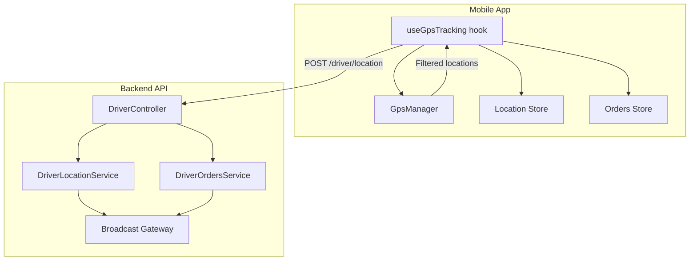
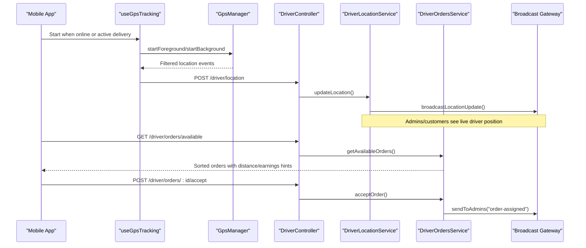
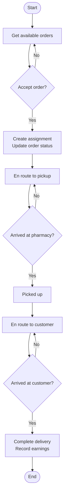
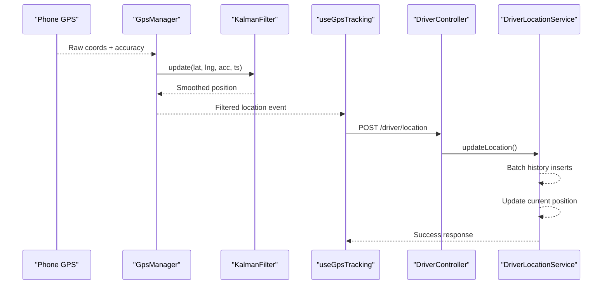
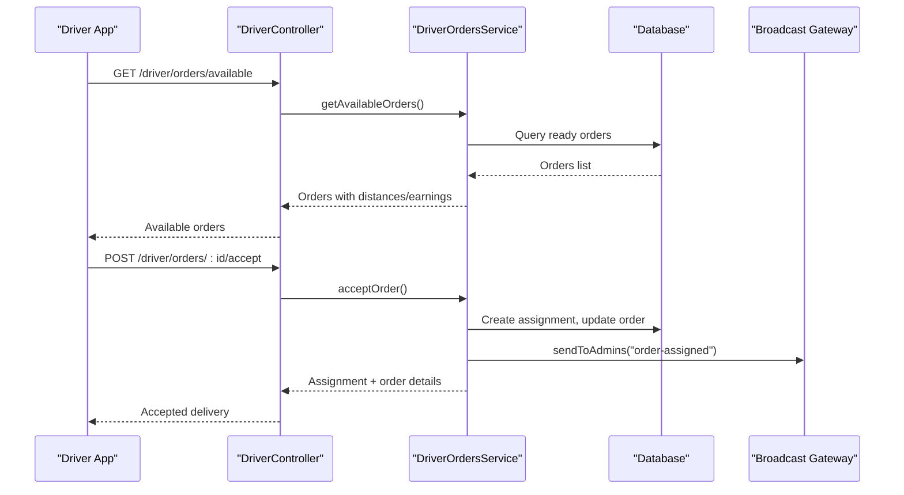
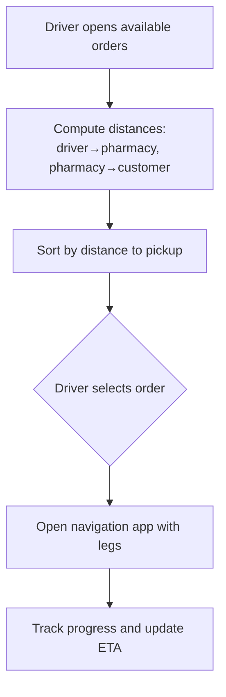
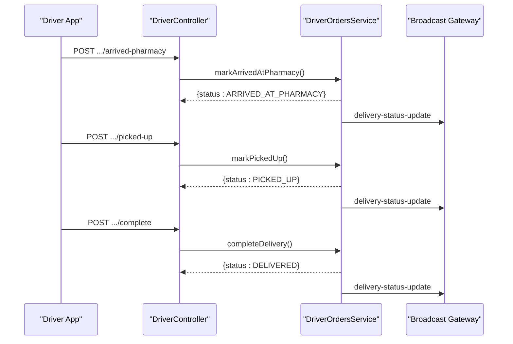
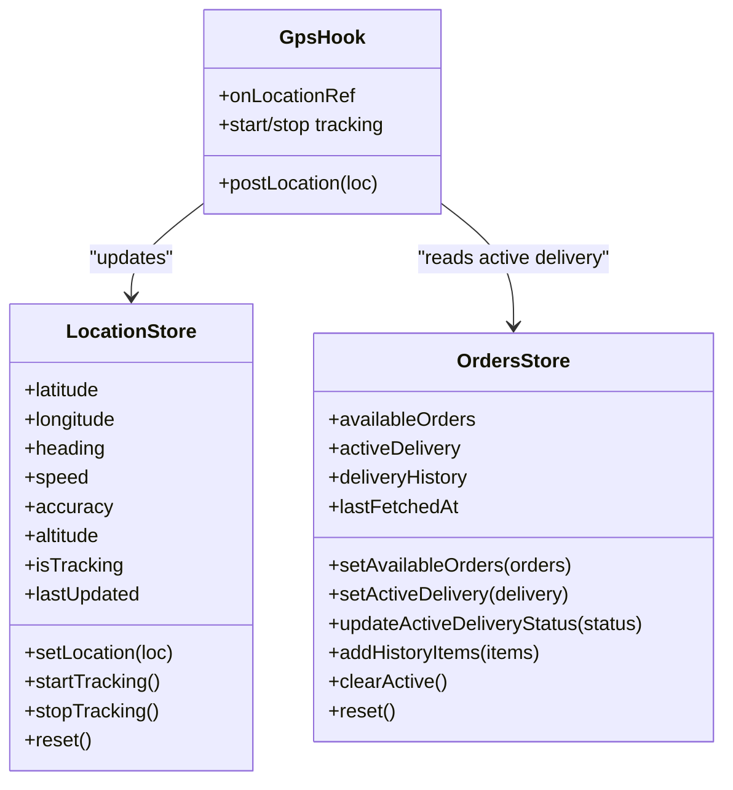
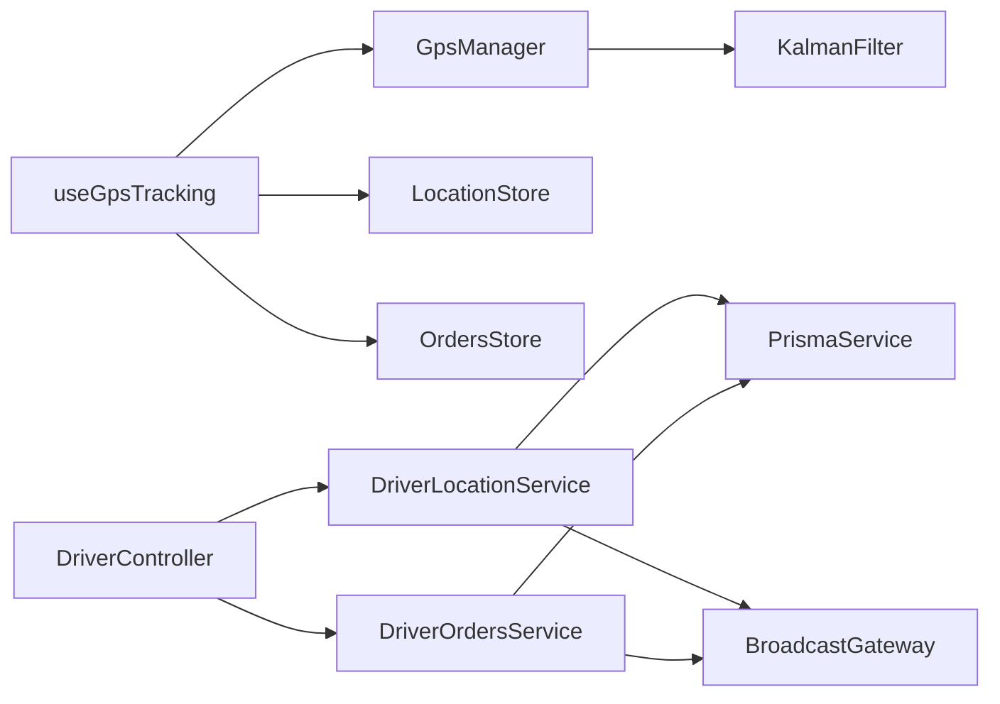

# Driver Features

<cite>
**Referenced Files in This Document**
- [driver.controller.ts](file://apps/api/src/modules/driver/driver.controller.ts)
- [driver-location.service.ts](file://apps/api/src/modules/driver/driver-location.service.ts)
- [driver-orders.service.ts](file://apps/api/src/modules/driver/driver-orders.service.ts)
- [README.md](file://apps/api/src/modules/driver/README.md)
- [useGpsTracking.ts](file://apps/courier-mobile/src/hooks/useGpsTracking.ts)
- [location.store.ts](file://apps/courier-mobile/src/stores/location.store.ts)
- [orders.store.ts](file://apps/courier-mobile/src/stores/orders.store.ts)
- [GpsManager.ts](file://apps/courier-mobile/src/lib/gps/GpsManager.ts)
- [KalmanFilter.ts](file://apps/courier-mobile/src/lib/gps/KalmanFilter.ts)
</cite>

## Table of Contents
1. Introduction
2. Project Structure
3. Core Components
4. Architecture Overview
5. Detailed Component Analysis
6. Dependency Analysis
7. Performance Considerations
8. Troubleshooting Guide
9. Conclusion

## Introduction
This document explains the driver-specific feature modules that power delivery management, real-time location tracking, order assignment and acceptance, route optimization hints, and delivery status updates. It covers the end-to-end driver workflow from receiving assignments to completing deliveries, GPS tracking implementation on mobile, offline considerations, communication with customers via backend broadcasts, and performance optimizations for location-based services. It also provides guidance for implementing driver screens, handling delivery lifecycle events, and managing driver state.

## Project Structure
The driver features span a mobile app (courier-mobile) and a backend API module (driver). The mobile app handles GPS collection, filtering, and posting locations, as well as UI state for orders and active deliveries. The backend exposes endpoints for authentication, profile management, location updates, and the full delivery lifecycle, including order availability, acceptance, transitions, and completion.

**Diagram sources**
- [useGpsTracking.ts:1-110](file://apps/courier-mobile/src/hooks/useGpsTracking.ts#L1-L110)
- [GpsManager.ts:1-245](file://apps/courier-mobile/src/lib/gps/GpsManager.ts#L1-L245)
- [location.store.ts:1-44](file://apps/courier-mobile/src/stores/location.store.ts#L1-L44)
- [orders.store.ts:1-135](file://apps/courier-mobile/src/stores/orders.store.ts#L1-L135)
- [driver.controller.ts:1-235](file://apps/api/src/modules/driver/driver.controller.ts#L1-L235)
- [driver-location.service.ts:1-352](file://apps/api/src/modules/driver/driver-location.service.ts#L1-L352)
- [driver-orders.service.ts:1-621](file://apps/api/src/modules/driver/driver-orders.service.ts#L1-L621)

**Section sources**
- [driver.controller.ts:1-235](file://apps/api/src/modules/driver/driver.controller.ts#L1-L235)
- [README.md:1-413](file://apps/api/src/modules/driver/README.md#L1-L413)

## Core Components
- Driver Controller: Exposes REST endpoints for auth, profile, status, location, documents, and order lifecycle operations.
- Location Service: Accepts GPS updates, applies Kalman filtering, batches writes, updates current position, and broadcasts via WebSocket.
- Orders Service: Manages available orders, acceptance, geofenced arrival checks, delivery lifecycle transitions, earnings recording, and broadcast updates.
- Mobile GPS Hook and Manager: Orchestrates foreground/background GPS, filters readings, adapts posting intervals by speed, and posts to backend.
- Stores: Maintain location state and order/delivery state for UI rendering and actions.

**Section sources**
- [driver.controller.ts:1-235](file://apps/api/src/modules/driver/driver.controller.ts#L1-L235)
- [driver-location.service.ts:1-352](file://apps/api/src/modules/driver/driver-location.service.ts#L1-L352)
- [driver-orders.service.ts:1-621](file://apps/api/src/modules/driver/driver-orders.service.ts#L1-L621)
- [useGpsTracking.ts:1-110](file://apps/courier-mobile/src/hooks/useGpsTracking.ts#L1-L110)
- [GpsManager.ts:1-245](file://apps/courier-mobile/src/lib/gps/GpsManager.ts#L1-L245)
- [location.store.ts:1-44](file://apps/courier-mobile/src/stores/location.store.ts#L1-L44)
- [orders.store.ts:1-135](file://apps/courier-mobile/src/stores/orders.store.ts#L1-L135)

## Architecture Overview
The system uses a hybrid approach:
- Real-time location streaming from mobile to backend with adaptive intervals and Kalman filtering to reduce noise and network load.
- Backend batching and broadcasting to keep admin dashboards and customer tracking updated.
- Delivery lifecycle managed through explicit state transitions with geofence validation at key checkpoints.

**Diagram sources**
- [useGpsTracking.ts:1-110](file://apps/courier-mobile/src/hooks/useGpsTracking.ts#L1-L110)
- [GpsManager.ts:1-245](file://apps/courier-mobile/src/lib/gps/GpsManager.ts#L1-L245)
- [driver.controller.ts:1-235](file://apps/api/src/modules/driver/driver.controller.ts#L1-L235)
- [driver-location.service.ts:1-352](file://apps/api/src/modules/driver/driver-location.service.ts#L1-L352)
- [driver-orders.service.ts:1-621](file://apps/api/src/modules/driver/driver-orders.service.ts#L1-L621)

## Detailed Component Analysis

### Driver Workflow: Assignment to Completion
- Available orders are fetched and optionally sorted by proximity to pickup using haversine distance calculations.
- Drivers accept orders; the system creates a delivery assignment, updates order status, and notifies admins.
- Lifecycle transitions include en-route to pickup, arrived at pharmacy, picked up, en-route to customer, arrived at customer, and delivered.
- Geofencing validates arrivals within a radius before allowing transitions.
- On completion, earnings are recorded and driver counters updated; final status is broadcast.

**Diagram sources**
- [driver-orders.service.ts:74-183](file://apps/api/src/modules/driver/driver-orders.service.ts#L74-L183)
- [driver-orders.service.ts:187-295](file://apps/api/src/modules/driver/driver-orders.service.ts#L187-L295)
- [driver-orders.service.ts:382-510](file://apps/api/src/modules/driver/driver-orders.service.ts#L382-L510)

**Section sources**
- [driver-orders.service.ts:74-183](file://apps/api/src/modules/driver/driver-orders.service.ts#L74-L183)
- [driver-orders.service.ts:187-295](file://apps/api/src/modules/driver/driver-orders.service.ts#L187-L295)
- [driver-orders.service.ts:382-510](file://apps/api/src/modules/driver/driver-orders.service.ts#L382-L510)

### Real-Time Location Tracking
- Mobile collects raw GPS, applies Kalman filtering, and emits smoothed positions.
- Posting interval adapts based on speed to balance accuracy and battery/network usage.
- Only significant movement triggers server posts; otherwise UI remains smooth with local updates.
- Backend applies additional filtering, batches history writes, updates current position, and broadcasts to clients.

**Diagram sources**
- [GpsManager.ts:58-144](file://apps/courier-mobile/src/lib/gps/GpsManager.ts#L58-L144)
- [KalmanFilter.ts:74-163](file://apps/courier-mobile/src/lib/gps/KalmanFilter.ts#L74-L163)
- [useGpsTracking.ts:29-78](file://apps/courier-mobile/src/hooks/useGpsTracking.ts#L29-L78)
- [driver.controller.ts:97-119](file://apps/api/src/modules/driver/driver.controller.ts#L97-L119)
- [driver-location.service.ts:30-127](file://apps/api/src/modules/driver/driver-location.service.ts#L30-L127)

**Section sources**
- [GpsManager.ts:1-245](file://apps/courier-mobile/src/lib/gps/GpsManager.ts#L1-L245)
- [KalmanFilter.ts:1-182](file://apps/courier-mobile/src/lib/gps/KalmanFilter.ts#L1-L182)
- [useGpsTracking.ts:1-110](file://apps/courier-mobile/src/hooks/useGpsTracking.ts#L1-L110)
- [driver-location.service.ts:1-352](file://apps/api/src/modules/driver/driver-location.service.ts#L1-L352)

### Order Assignment and Acceptance
- Available orders endpoint returns ready orders not assigned or previously rejected/cancelled.
- Distance and estimated earnings are computed to help drivers choose efficiently.
- Accepting an order locks the assignment atomically and updates both assignment and order states.
- Broadcast notifies admins of new assignments.

**Diagram sources**
- [driver-orders.service.ts:74-183](file://apps/api/src/modules/driver/driver-orders.service.ts#L74-L183)
- [driver-orders.service.ts:187-295](file://apps/api/src/modules/driver/driver-orders.service.ts#L187-L295)
- [driver.controller.ts:151-184](file://apps/api/src/modules/driver/driver.controller.ts#L151-L184)

**Section sources**
- [driver-orders.service.ts:74-183](file://apps/api/src/modules/driver/driver-orders.service.ts#L74-L183)
- [driver-orders.service.ts:187-295](file://apps/api/src/modules/driver/driver-orders.service.ts#L187-L295)
- [driver.controller.ts:151-184](file://apps/api/src/modules/driver/driver.controller.ts#L151-L184)

### Route Optimization and Navigation Integration
- The backend computes straight-line distances between driver, pharmacy, and customer to estimate total distance and time, enabling simple nearest-first sorting for available orders.
- For production-grade routing, integrate a mapping service to compute turn-by-turn directions and ETA; use the computed legs to guide navigation UI and display accurate ETAs.
- Use geofences at pharmacy and customer locations to trigger state transitions only when physically present.

[No sources needed since this diagram shows conceptual workflow, not actual code structure]

### Delivery Status Updates and Communication
- Each lifecycle transition updates both the delivery assignment and the canonical order status.
- Transitions such as arriving at pharmacy/customer enforce geofence checks to prevent false positives.
- Broadcasts inform admins and can be extended to notify customers about delivery progress.

**Diagram sources**
- [driver-orders.service.ts:382-510](file://apps/api/src/modules/driver/driver-orders.service.ts#L382-L510)
- [driver.controller.ts:193-233](file://apps/api/src/modules/driver/driver.controller.ts#L193-L233)

**Section sources**
- [driver-orders.service.ts:382-510](file://apps/api/src/modules/driver/driver-orders.service.ts#L382-L510)
- [driver.controller.ts:193-233](file://apps/api/src/modules/driver/driver.controller.ts#L193-L233)

### Implementing Driver Screens and Managing State
- Use the location store to track current coordinates, heading, speed, and whether tracking is active.
- Use the orders store to manage available orders, active delivery, and delivery history.
- The GPS hook starts/stops foreground/background tracking based on driver online status and active delivery presence.
- When accepting or transitioning deliveries, update the orders store to reflect the latest state and persist changes via API calls.

**Diagram sources**
- [location.store.ts:1-44](file://apps/courier-mobile/src/stores/location.store.ts#L1-L44)
- [orders.store.ts:1-135](file://apps/courier-mobile/src/stores/orders.store.ts#L1-L135)
- [useGpsTracking.ts:1-110](file://apps/courier-mobile/src/hooks/useGpsTracking.ts#L1-L110)

**Section sources**
- [location.store.ts:1-44](file://apps/courier-mobile/src/stores/location.store.ts#L1-L44)
- [orders.store.ts:1-135](file://apps/courier-mobile/src/stores/orders.store.ts#L1-L135)
- [useGpsTracking.ts:1-110](file://apps/courier-mobile/src/hooks/useGpsTracking.ts#L1-L110)

## Dependency Analysis
- Mobile dependencies:
  - useGpsTracking depends on GpsManager, location store, orders store, and API client.
  - GpsManager depends on expo-location and TaskManager for background tasks; uses KalmanFilter for smoothing.
- Backend dependencies:
  - DriverController composes auth, profile, location, orders, and file upload services.
  - DriverLocationService depends on Prisma and BroadcastGateway; implements batching and filtering.
  - DriverOrdersService depends on Prisma and BroadcastGateway; implements lifecycle transitions and geofencing.

**Diagram sources**
- [useGpsTracking.ts:1-110](file://apps/courier-mobile/src/hooks/useGpsTracking.ts#L1-L110)
- [GpsManager.ts:1-245](file://apps/courier-mobile/src/lib/gps/GpsManager.ts#L1-L245)
- [KalmanFilter.ts:1-182](file://apps/courier-mobile/src/lib/gps/KalmanFilter.ts#L1-L182)
- [driver.controller.ts:1-235](file://apps/api/src/modules/driver/driver.controller.ts#L1-L235)
- [driver-location.service.ts:1-352](file://apps/api/src/modules/driver/driver-location.service.ts#L1-L352)
- [driver-orders.service.ts:1-621](file://apps/api/src/modules/driver/driver-orders.service.ts#L1-L621)

**Section sources**
- [driver.controller.ts:1-235](file://apps/api/src/modules/driver/driver.controller.ts#L1-L235)
- [driver-location.service.ts:1-352](file://apps/api/src/modules/driver/driver-location.service.ts#L1-L352)
- [driver-orders.service.ts:1-621](file://apps/api/src/modules/driver/driver-orders.service.ts#L1-L621)
- [useGpsTracking.ts:1-110](file://apps/courier-mobile/src/hooks/useGpsTracking.ts#L1-L110)
- [GpsManager.ts:1-245](file://apps/courier-mobile/src/lib/gps/GpsManager.ts#L1-L245)
- [KalmanFilter.ts:1-182](file://apps/courier-mobile/src/lib/gps/KalmanFilter.ts#L1-L182)

## Performance Considerations
- Adaptive posting interval: Adjusts frequency based on speed to reduce network and battery usage while maintaining responsiveness.
- Kalman filtering: Reduces GPS jitter and discards implausible jumps, improving map stability and reducing unnecessary server updates.
- Server-side batching: Aggregates location history writes into batches to minimize database overhead.
- Geofence validation: Prevents invalid state transitions, reducing erroneous updates and rework.
- Efficient queries: Available orders are filtered and optionally sorted by distance to support quick decision-making.

[No sources needed since this section provides general guidance]

## Troubleshooting Guide
- Location permission denied: Ensure foreground and background permissions are granted; check warnings emitted by GPS manager.
- Low GPS accuracy: Warnings are emitted when accuracy exceeds thresholds; advise users to move outdoors or wait for better signal.
- Driver must be online: Location updates require the driver to be marked online; verify status endpoints and guard behavior.
- Geofence errors: Arrival transitions fail if the driver is outside the allowed radius; ensure correct coordinates are sent.
- Active delivery conflicts: Accepting an order fails if the driver already has an active delivery; clear or complete existing work first.

**Section sources**
- [GpsManager.ts:58-121](file://apps/courier-mobile/src/lib/gps/GpsManager.ts#L58-L121)
- [driver-location.service.ts:30-44](file://apps/api/src/modules/driver/driver-location.service.ts#L30-L44)
- [driver-orders.service.ts:187-203](file://apps/api/src/modules/driver/driver-orders.service.ts#L187-L203)
- [driver-orders.service.ts:386-433](file://apps/api/src/modules/driver/driver-orders.service.ts#L386-L433)

## Conclusion
The driver feature set combines robust mobile GPS handling with a resilient backend that filters, batches, and broadcasts location data while enforcing a strict delivery lifecycle. The architecture supports efficient order discovery, acceptance, and transitions with geofence validation and real-time notifications. With adaptive tracking, Kalman filtering, and batched writes, the system balances accuracy, performance, and battery efficiency. Extending navigation integration and customer notifications will further enhance the driver and customer experience.