# Feature Modules

<cite>
**Referenced Files in This Document**
- [ARCHITECTURE.md](file://apps/shopper-native/ARCHITECTURE.md)
- [index.ts (auth)](file://apps/shopper-native/src/features/auth/index.ts)
- [index.ts (cart)](file://apps/shopper-native/src/features/cart/index.ts)
- [index.ts (checkout)](file://apps/shopper-native/src/features/checkout/index.ts)
- [api.ts (auth)](file://apps/shopper-native/src/features/auth/api.ts)
- [context.tsx (auth)](file://apps/shopper-native/src/features/auth/context.tsx)
- [api.ts (cart)](file://apps/shopper-native/src/features/cart/api.ts)
- [api.ts (checkout)](file://apps/shopper-native/src/features/checkout/api.ts)
- [payload.ts (checkout)](file://apps/shopper-native/src/features/checkout/payload.ts)
- [pricing.ts (checkout)](file://apps/shopper-native/src/features/checkout/pricing.ts)
- [validation.ts (checkout)](file://apps/shopper-native/src/features/checkout/validation.ts)
- [resilience.ts (checkout)](file://apps/shopper-native/src/features/checkout/resilience.ts)
- [api.ts (orders)](file://apps/shopper-native/src/features/orders/api.ts)
- [realtime.ts (orders)](file://apps/shopper-native/src/features/orders/realtime.ts)
- [api.ts (prescriptions)](file://apps/shopper-native/src/features/prescriptions/api.ts)
- [api.ts (driver)](file://apps/shopper-native/src/features/driver/api.ts)
- [realtime.ts (driver)](file://apps/shopper-native/src/features/driver/realtime.ts)
- [customerNotify.ts (driver)](file://apps/shopper-native/src/features/driver/customerNotify.ts)
- [api.ts (pharmacist)](file://apps/shopper-native/src/features/pharmacist/api.ts)
- [realtime.ts (pharmacist)](file://apps/shopper-native/src/features/pharmacist/realtime.ts)
- [customerNotify.ts (pharmacist)](file://apps/shopper-native/src/features/pharmacist/customerNotify.ts)
- [index.ts (inventory)](file://apps/shopper-native/src/features/inventory/index.ts)
- [index.ts (delivery)](file://apps/shopper-native/src/features/delivery/index.ts)
- [locationStore.ts (delivery)](file://apps/shopper-native/src/features/delivery/locationStore.ts)
- [useDeliveryQuote.ts (delivery)](file://apps/shopper-native/src/features/delivery/useDeliveryQuote.ts)
</cite>

## Table of Contents
1. [Introduction](#introduction)
2. [Project Structure](#project-structure)
3. [Core Components](#core-components)
4. [Architecture Overview](#architecture-overview)
5. [Detailed Component Analysis](#detailed-component-analysis)
6. [Dependency Analysis](#dependency-analysis)
7. [Performance Considerations](#performance-considerations)
8. [Troubleshooting Guide](#troubleshooting-guide)
9. [Conclusion](#conclusion)
10. [Appendices](#appendices)

## Introduction
This document explains the feature-based architecture used across the mobile applications, focusing on how each feature is a self-contained module with its own components, hooks, stores, and API integrations. It covers customer-facing features (auth, cart, checkout, orders, prescriptions), driver features (delivery, tracking, offers), and pharmacist features (inventory, prescriptions, analytics). It also documents Zustand store patterns, state management strategies, data flow between features, inter-feature communication, shared dependencies, and practical guidance for creating new features and managing feature state.

## Project Structure
The application organizes code around vertical feature slices under apps/shopper-native/src/features. Each feature encapsulates its UI, logic, types, and server interactions behind a public barrel export. Shared cross-cutting concerns live under src/shared, while legacy shared UI remains under src/components. Routes are file-based via Expo Router under app/.

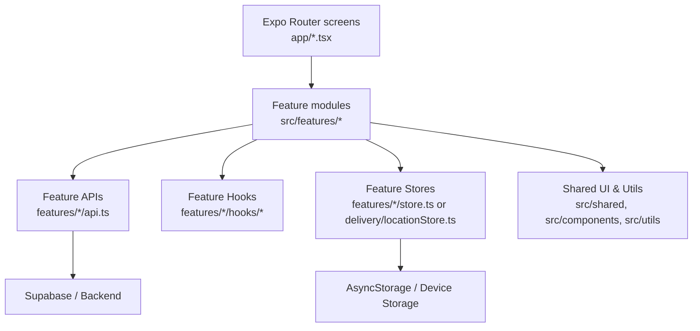

**Diagram sources**
- [ARCHITECTURE.md:1-35](file://apps/shopper-native/ARCHITECTURE.md#L1-L35)
- [index.ts (delivery):1-20](file://apps/shopper-native/src/features/delivery/index.ts#L1-L20)

**Section sources**
- [ARCHITECTURE.md:1-35](file://apps/shopper-native/ARCHITECTURE.md#L1-L35)

## Core Components
- Feature ownership and boundaries: Each feature owns its domain end-to-end (types, API, hooks, components, and optional store). Consumers import only from the feature’s barrel to preserve encapsulation.
- Store boundaries: Feature-local stores reside inside the feature; cross-feature stores are rare and placed under src/stores. Stores expose selectors to minimize re-renders. Optimistic mutations with rollback are encouraged.
- API layering: Screens compose hooks; hooks wrap TanStack Query calls; API services perform raw network calls and error mapping. Server state uses TanStack Query; client state uses Zustand with persistence.
- Route compatibility: New routes must be registered in the root layout and follow the existing route contract.

**Section sources**
- [ARCHITECTURE.md:39-124](file://apps/shopper-native/ARCHITECTURE.md#L39-L124)
- [ARCHITECTURE.md:126-139](file://apps/shopper-native/ARCHITECTURE.md#L126-L139)

## Architecture Overview
The system follows a layered approach:
- Screen layer composes feature hooks and renders UI.
- Hook layer handles caching, invalidation, optimistic updates, and derived data.
- API layer performs Supabase/backend calls and maps errors.
- State layer separates server state (TanStack Query) from client state (Zustand).

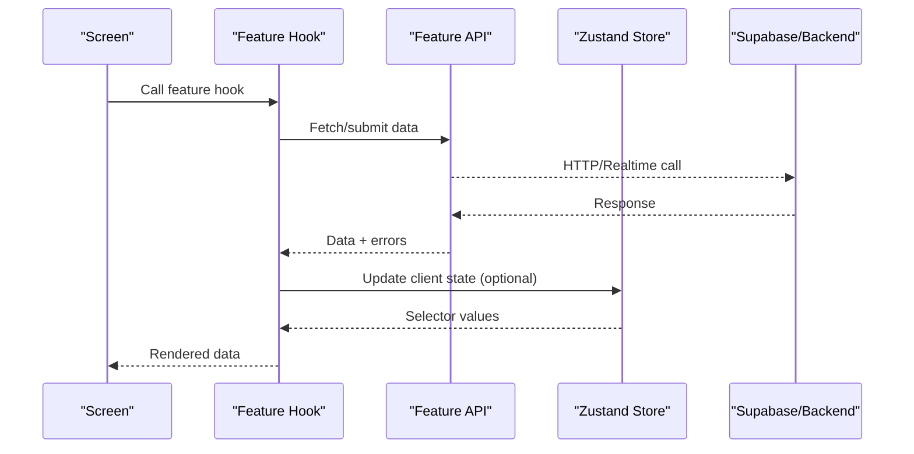

[No sources needed since this diagram shows conceptual workflow, not actual code structure]

## Detailed Component Analysis

### Customer Features

#### Auth
- Responsibilities: Sign in/up, session management, phone OTP, social auth, role handling, user profile updates, language switcher, trust badges.
- Public surface: Barrel exports functions, context provider, error mapping, and UI components.
- Integration points: Uses an internal API module and React context for session and user data.

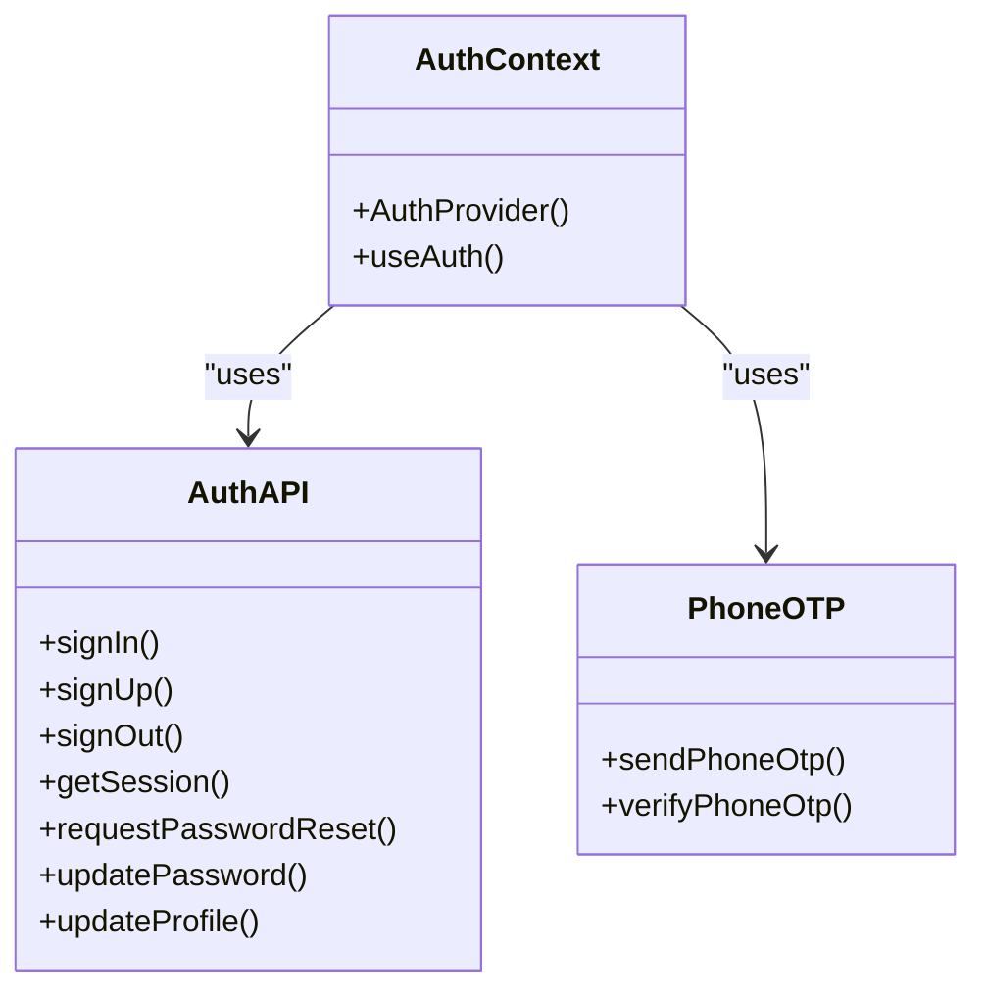

**Diagram sources**
- [index.ts (auth):1-25](file://apps/shopper-native/src/features/auth/index.ts#L1-L25)
- [api.ts (auth):1-200](file://apps/shopper-native/src/features/auth/api.ts#L1-L200)
- [context.tsx (auth):1-200](file://apps/shopper-native/src/features/auth/context.tsx#L1-L200)

**Section sources**
- [index.ts (auth):1-25](file://apps/shopper-native/src/features/auth/index.ts#L1-L25)
- [api.ts (auth):1-200](file://apps/shopper-native/src/features/auth/api.ts#L1-L200)
- [context.tsx (auth):1-200](file://apps/shopper-native/src/features/auth/context.tsx#L1-L200)

#### Cart
- Responsibilities: Cart drawer UI and cart line management.
- Public surface: Exposes the CartDrawer component and ref type.
- Integration points: Likely interacts with a feature store and API for cart operations.

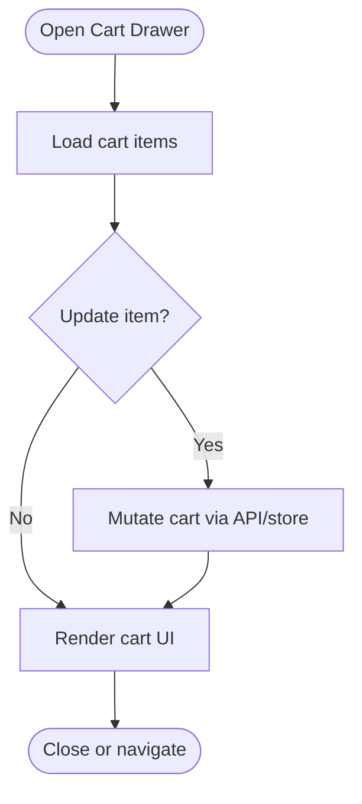

**Diagram sources**
- [index.ts (cart):1-2](file://apps/shopper-native/src/features/cart/index.ts#L1-L2)
- [api.ts (cart):1-200](file://apps/shopper-native/src/features/cart/api.ts#L1-L200)

**Section sources**
- [index.ts (cart):1-2](file://apps/shopper-native/src/features/cart/index.ts#L1-L2)
- [api.ts (cart):1-200](file://apps/shopper-native/src/features/cart/api.ts#L1-L200)

#### Checkout
- Responsibilities: Pricing engine, validation, payload building, order submission, manual payment support, resilience helpers (retry, deduplication, draft persistence).
- Public surface: Types, pricing utilities, errors, validation, payload builder, schema, createCheckoutOrder, manual payment helpers, and resilience tools.
- Data flow: Validates inputs, builds payloads, applies pricing, persists drafts, and submits orders with retry and deduplication.

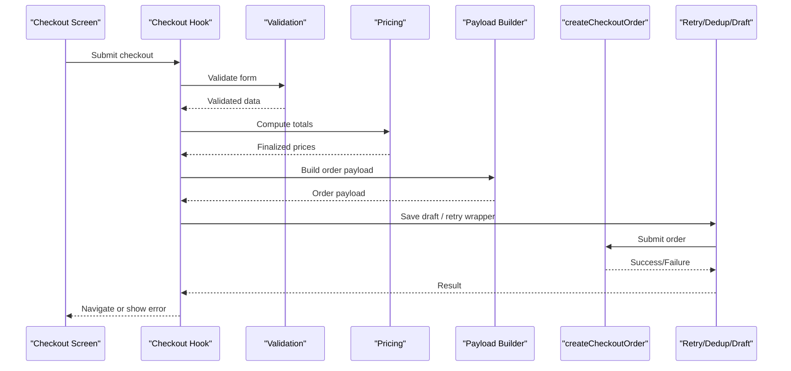

**Diagram sources**
- [index.ts (checkout):1-24](file://apps/shopper-native/src/features/checkout/index.ts#L1-L24)
- [api.ts (checkout):1-200](file://apps/shopper-native/src/features/checkout/api.ts#L1-L200)
- [payload.ts (checkout):1-200](file://apps/shopper-native/src/features/checkout/payload.ts#L1-L200)
- [pricing.ts (checkout):1-200](file://apps/shopper-native/src/features/checkout/pricing.ts#L1-L200)
- [validation.ts (checkout):1-200](file://apps/shopper-native/src/features/checkout/validation.ts#L1-L200)
- [resilience.ts (checkout):1-200](file://apps/shopper-native/src/features/checkout/resilience.ts#L1-L200)

**Section sources**
- [index.ts (checkout):1-24](file://apps/shopper-native/src/features/checkout/index.ts#L1-L24)
- [api.ts (checkout):1-200](file://apps/shopper-native/src/features/checkout/api.ts#L1-L200)
- [payload.ts (checkout):1-200](file://apps/shopper-native/src/features/checkout/payload.ts#L1-L200)
- [pricing.ts (checkout):1-200](file://apps/shopper-native/src/features/checkout/pricing.ts#L1-L200)
- [validation.ts (checkout):1-200](file://apps/shopper-native/src/features/checkout/validation.ts#L1-L200)
- [resilience.ts (checkout):1-200](file://apps/shopper-native/src/features/checkout/resilience.ts#L1-L200)

#### Orders
- Responsibilities: Listing, details, and lifecycle management of orders; real-time updates.
- Integration points: API for fetching and mutating orders; realtime channel for live status changes.

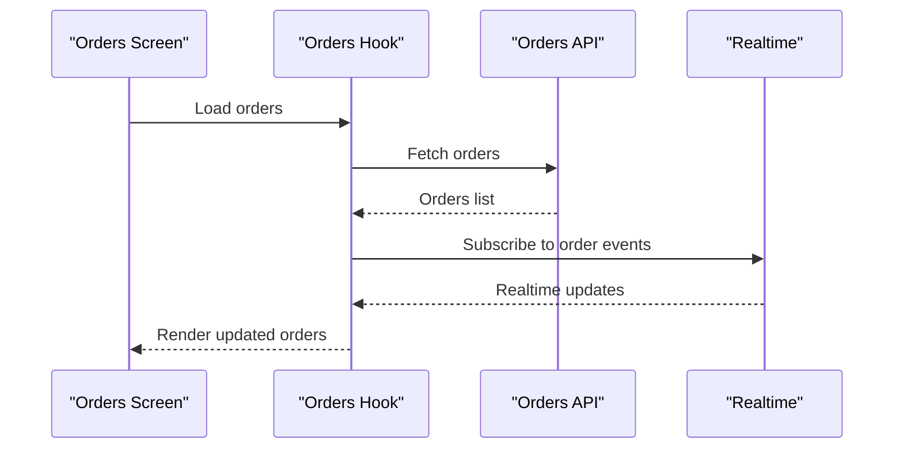

**Diagram sources**
- [api.ts (orders):1-200](file://apps/shopper-native/src/features/orders/api.ts#L1-L200)
- [realtime.ts (orders):1-200](file://apps/shopper-native/src/features/orders/realtime.ts#L1-L200)

**Section sources**
- [api.ts (orders):1-200](file://apps/shopper-native/src/features/orders/api.ts#L1-L200)
- [realtime.ts (orders):1-200](file://apps/shopper-native/src/features/orders/realtime.ts#L1-L200)

#### Prescriptions (Customer)
- Responsibilities: Viewing and managing prescriptions; uploading images; interacting with backend workflows.
- Integration points: API for prescription data and image uploads.

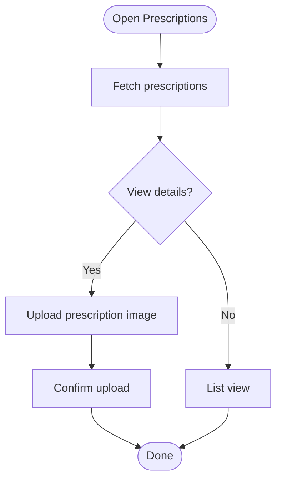

**Diagram sources**
- [api.ts (prescriptions):1-200](file://apps/shopper-native/src/features/prescriptions/api.ts#L1-L200)

**Section sources**
- [api.ts (prescriptions):1-200](file://apps/shopper-native/src/features/prescriptions/api.ts#L1-L200)

### Driver Features

#### Delivery
- Responsibilities: Branch selection, geofencing, delivery quotes, location awareness, and branch UI.
- Integration points: Location store for current branch/geofence; quote hook for pricing; delivery index exposes key utilities.

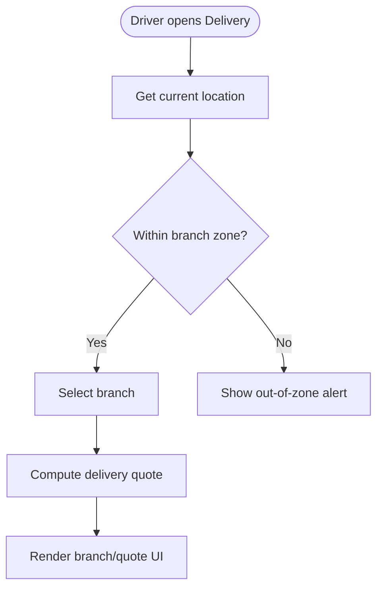

**Diagram sources**
- [index.ts (delivery):1-200](file://apps/shopper-native/src/features/delivery/index.ts#L1-L200)
- [locationStore.ts (delivery):1-200](file://apps/shopper-native/src/features/delivery/locationStore.ts#L1-L200)
- [useDeliveryQuote.ts (delivery):1-200](file://apps/shopper-native/src/features/delivery/useDeliveryQuote.ts#L1-L200)

**Section sources**
- [index.ts (delivery):1-200](file://apps/shopper-native/src/features/delivery/index.ts#L1-L200)
- [locationStore.ts (delivery):1-200](file://apps/shopper-native/src/features/delivery/locationStore.ts#L1-L200)
- [useDeliveryQuote.ts (delivery):1-200](file://apps/shopper-native/src/features/delivery/useDeliveryQuote.ts#L1-L200)

#### Tracking and Offers
- Responsibilities: Realtime tracking updates and notifications to customers; offer-related flows.
- Integration points: Driver API for tracking actions; realtime channels for live updates; customer notification helper.

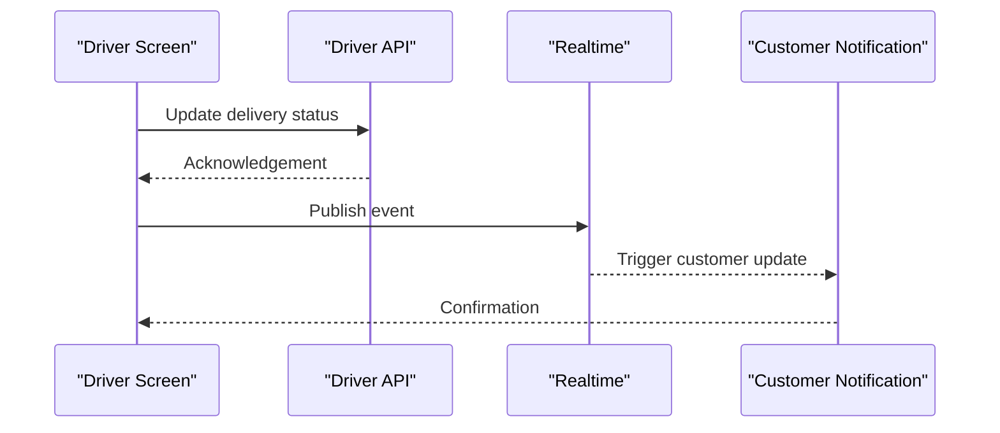

**Diagram sources**
- [api.ts (driver):1-200](file://apps/shopper-native/src/features/driver/api.ts#L1-L200)
- [realtime.ts (driver):1-200](file://apps/shopper-native/src/features/driver/realtime.ts#L1-L200)
- [customerNotify.ts (driver):1-200](file://apps/shopper-native/src/features/driver/customerNotify.ts#L1-L200)

**Section sources**
- [api.ts (driver):1-200](file://apps/shopper-native/src/features/driver/api.ts#L1-L200)
- [realtime.ts (driver):1-200](file://apps/shopper-native/src/features/driver/realtime.ts#L1-L200)
- [customerNotify.ts (driver):1-200](file://apps/shopper-native/src/features/driver/customerNotify.ts#L1-L200)

### Pharmacist Features

#### Inventory
- Responsibilities: Managing inventory items and adjustments; exposing typed interfaces and API accessors.
- Integration points: API for inventory CRUD; typed contracts for safe usage.

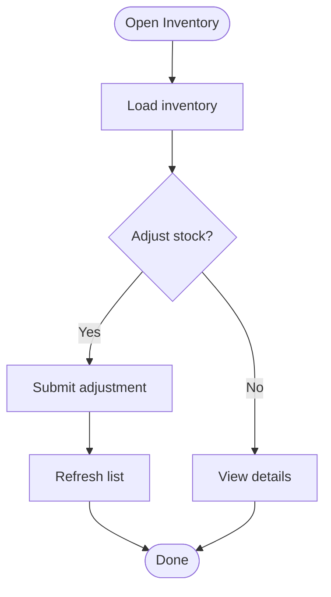

**Diagram sources**
- [index.ts (inventory):1-200](file://apps/shopper-native/src/features/inventory/index.ts#L1-L200)

**Section sources**
- [index.ts (inventory):1-200](file://apps/shopper-native/src/features/inventory/index.ts#L1-L200)

#### Prescriptions (Pharmacist)
- Responsibilities: Reviewing and processing prescriptions; notifying customers; realtime updates.
- Integration points: API for prescription workflows; realtime channels; customer notification helper.

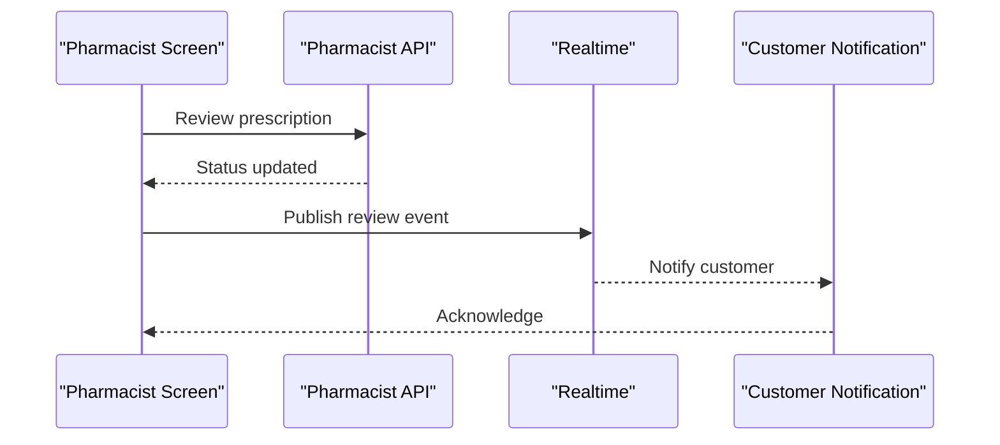

**Diagram sources**
- [api.ts (pharmacist):1-200](file://apps/shopper-native/src/features/pharmacist/api.ts#L1-L200)
- [realtime.ts (pharmacist):1-200](file://apps/shopper-native/src/features/pharmacist/realtime.ts#L1-L200)
- [customerNotify.ts (pharmacist):1-200](file://apps/shopper-native/src/features/pharmacist/customerNotify.ts#L1-L200)

**Section sources**
- [api.ts (pharmacist):1-200](file://apps/shopper-native/src/features/pharmacist/api.ts#L1-L200)
- [realtime.ts (pharmacist):1-200](file://apps/shopper-native/src/features/pharmacist/realtime.ts#L1-L200)
- [customerNotify.ts (pharmacist):1-200](file://apps/shopper-native/src/features/pharmacist/customerNotify.ts#L1-L200)

#### Analytics
- Responsibilities: Aggregating operational metrics and insights for pharmacists.
- Integration points: Typically built atop inventory, orders, and prescription data through feature APIs.

[No sources needed since this section doesn't analyze specific files]

## Dependency Analysis
Features communicate primarily through:
- TanStack Query cache and invalidation keys for server state synchronization.
- Zustand stores for client state, with selectors to avoid unnecessary re-renders.
- Realtime channels for live updates across features (e.g., orders, driver tracking, pharmacist reviews).
- Barrel exports to enforce encapsulation and reduce coupling.

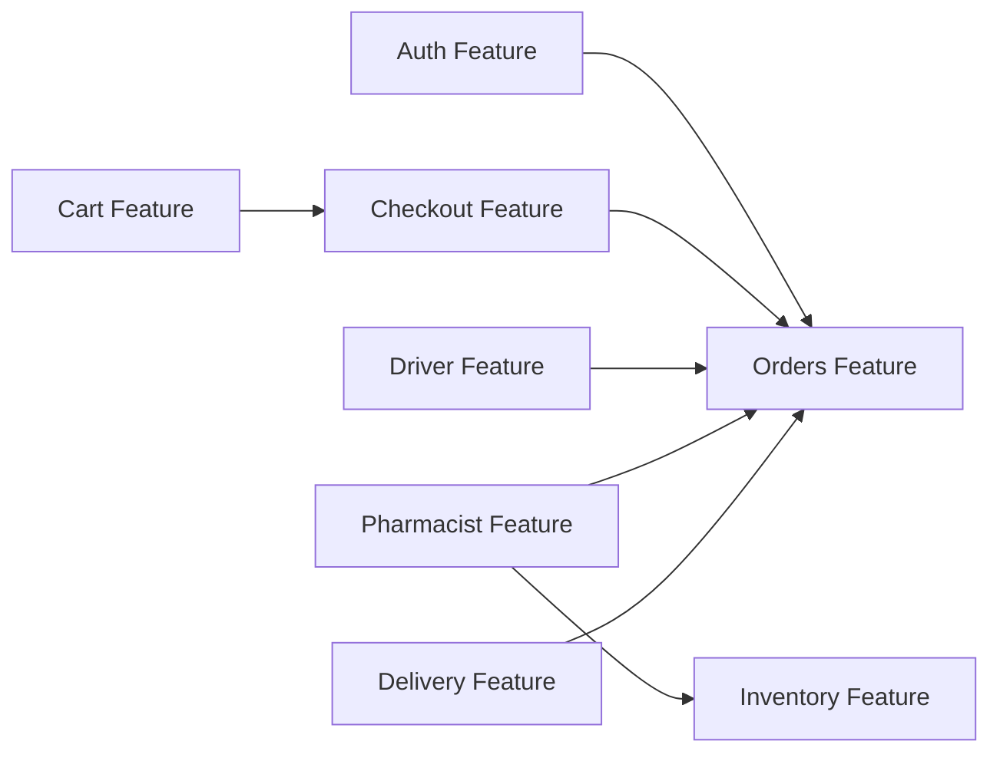

[No sources needed since this diagram shows conceptual relationships, not actual code structure]

**Section sources**
- [ARCHITECTURE.md:109-124](file://apps/shopper-native/ARCHITECTURE.md#L109-L124)

## Performance Considerations
- Prefer selector-based subscriptions in Zustand stores to limit re-renders.
- Use TanStack Query for server state to leverage caching, background refetching, and optimistic updates.
- Implement retry and deduplication for critical mutations (e.g., checkout submissions).
- Persist lightweight client state (drafts, preferences) to AsyncStorage where appropriate.
- Avoid direct Supabase calls from screens; keep network logic in feature APIs.

[No sources needed since this section provides general guidance]

## Troubleshooting Guide
Common issues and resolutions:
- Network failures: Ensure all network calls include try/catch with user-visible recovery paths (retry button, fallback data, banners).
- Realtime drift: Verify realtime subscriptions are properly managed and unsubscribed on navigation away.
- Store inconsistencies: Use optimistic updates with rollback on failure; validate before mutation.
- Route mismatches: Do not rename existing route files without updating the root layout and related references.

**Section sources**
- [ARCHITECTURE.md:157-164](file://apps/shopper-native/ARCHITECTURE.md#L157-L164)

## Conclusion
The feature-based architecture promotes clear ownership, encapsulation, and maintainability. By organizing code into vertical slices with dedicated components, hooks, stores, and APIs, teams can evolve features independently while maintaining consistent data flow and performance. Adhering to the barrel export rule, separating server and client state, and leveraging realtime channels ensures robust inter-feature communication and a responsive user experience.

[No sources needed since this section summarizes without analyzing specific files]

## Appendices

### Creating a New Feature
Steps to add a new feature following established conventions:
- Create a folder under src/features/<name> with index.ts as the public barrel.
- Add types.ts, api.ts, hooks/, components/, and optional store.ts or data.ts.
- Export only necessary symbols from index.ts to maintain encapsulation.
- Register any new routes in the root layout if applicable.
- Run type checks to ensure clean migration.

**Section sources**
- [ARCHITECTURE.md:56-84](file://apps/shopper-native/ARCHITECTURE.md#L56-L84)
- [ARCHITECTURE.md:142-153](file://apps/shopper-native/ARCHITECTURE.md#L142-L153)

### Implementing Feature-Specific Hooks
Guidelines:
- Wrap TanStack Query calls in feature hooks to handle caching, invalidation, and optimistic updates.
- Keep hooks free of direct Supabase calls; delegate to feature API.
- Compose multiple hooks when deriving complex state for screens.

**Section sources**
- [ARCHITECTURE.md:109-124](file://apps/shopper-native/ARCHITECTURE.md#L109-L124)

### Managing Feature State
Recommendations:
- Use Zustand for client state within features; expose selectors to minimize re-renders.
- For cross-feature state that is truly necessary, place it in src/stores and document its contract.
- Persist important client state (e.g., drafts) to AsyncStorage using namespaced keys.

**Section sources**
- [ARCHITECTURE.md:87-93](file://apps/shopper-native/ARCHITECTURE.md#L87-L93)

### Inter-Feature Communication Patterns
Patterns to adopt:
- Server state synchronization via TanStack Query cache and invalidation keys.
- Client state sharing via shared Zustand stores (rare) with explicit selectors.
- Live updates via realtime channels for events like order status changes, driver tracking, and pharmacist reviews.

[No sources needed since this section provides general guidance]

### Shared Dependencies
- Design tokens and theme configuration under src/theme.
- Shared UI primitives under src/components/ui and reusable components under src/shared/components.
- Utilities for formatting, storage keys, and haptics under src/utils.

**Section sources**
- [ARCHITECTURE.md:96-106](file://apps/shopper-native/ARCHITECTURE.md#L96-L106)
- [ARCHITECTURE.md:167-174](file://apps/shopper-native/ARCHITECTURE.md#L167-L174)