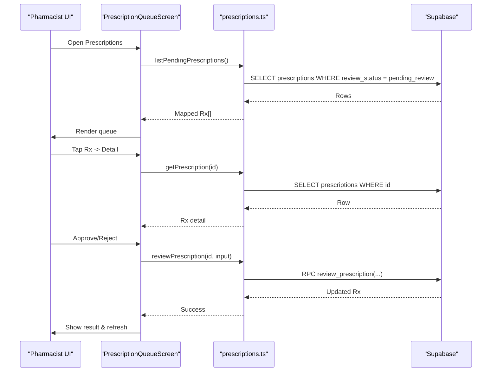
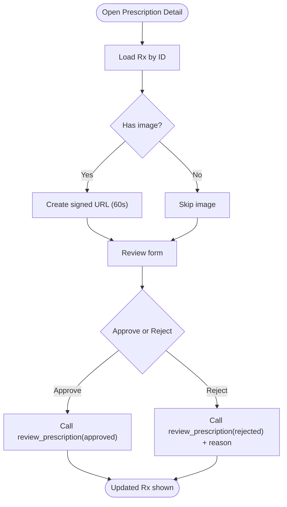
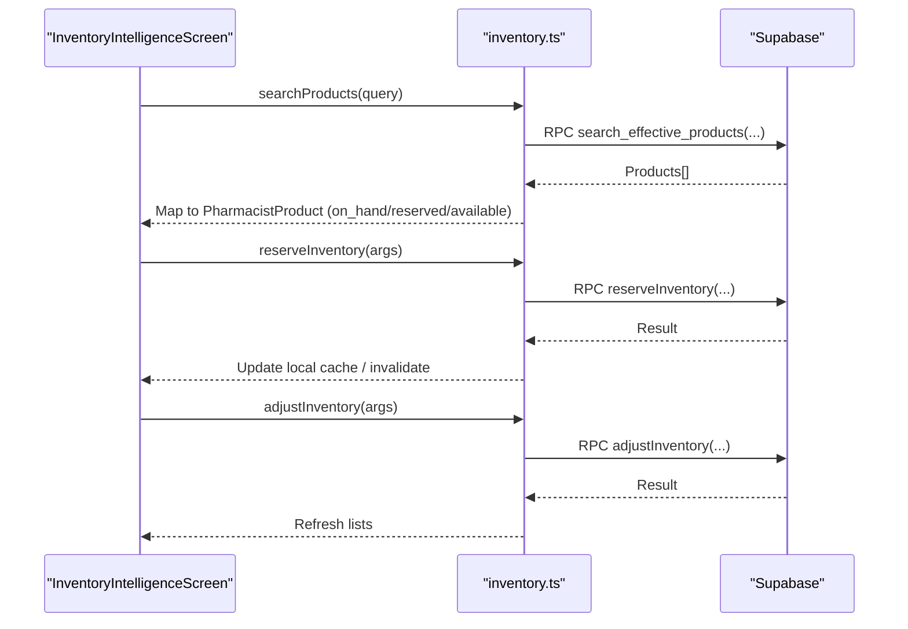
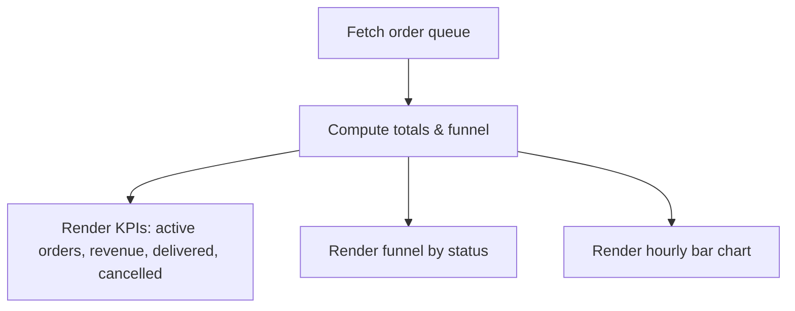
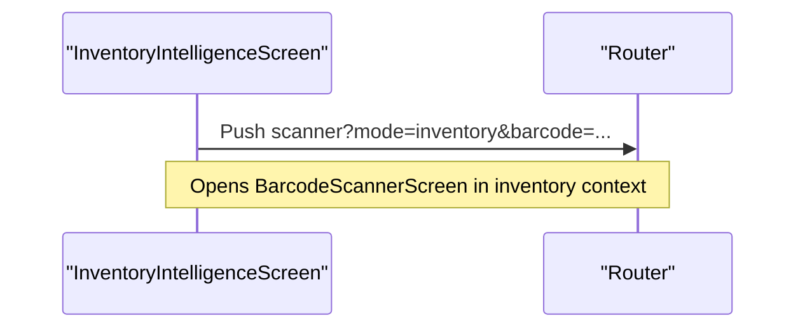
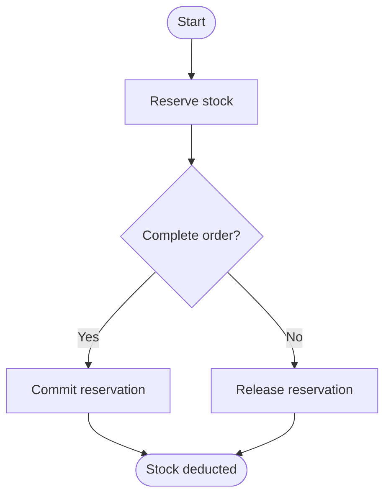
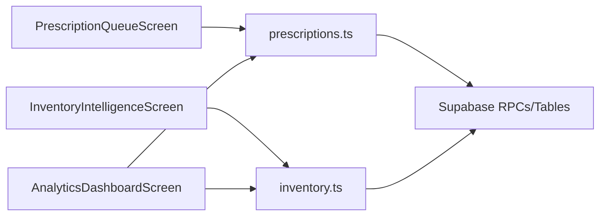

# Pharmacist Features

<cite>
**Referenced Files in This Document**
- [prescriptions.ts](file://apps/shopper-native/src/features/pharmacist/api/prescriptions.ts)
- [inventory.ts](file://apps/shopper-native/src/features/pharmacist/api/inventory.ts)
- [PrescriptionQueueScreen.tsx](file://apps/shopper-native/src/features/pharmacist/screens/PrescriptionQueueScreen.tsx)
- [InventoryIntelligenceScreen.tsx](file://apps/shopper-native/src/features/pharmacist/screens/InventoryIntelligenceScreen.tsx)
- [AnalyticsDashboardScreen.tsx](file://apps/shopper-native/src/features/pharmacist/screens/AnalyticsDashboardScreen.tsx)
- [PharmacistActionDock.tsx](file://apps/shopper-native/src/features/pharmacist/components/PharmacistActionDock.tsx)
- [index.ts](file://apps/shopper-native/src/features/pharmacist/index.ts)
- [20260705120000_prescriptions_admin_review.sql](file://supabase/migrations/20260705120000_prescriptions_admin_review.sql)
- [20260809100000_pharmacist_inventory_adjustment.sql](file://supabase/migrations/20260809100000_pharmacist_inventory_adjustment.sql)
- [20260809120000_prescription_review_rpc.sql](file://supabase/migrations/20260809120000_prescription_review_rpc.sql)
</cite>

## Table of Contents
1. Introduction
2. Project Structure
3. Core Components
4. Architecture Overview
5. Detailed Component Analysis
6. Dependency Analysis
7. Performance Considerations
8. Troubleshooting Guide
9. Conclusion

## Introduction
This document explains the pharmacist workflow features implemented in the mobile application, focusing on prescription review, inventory management with real-time updates, order fulfillment support, and an analytics dashboard. It covers the feature architecture for clinical workflows, barcode scanning integration, inventory reservation system, and pharmacist-specific UI patterns. Examples are provided as code snippet paths to guide implementation of prescription validation, inventory adjustments, and pharmacist dashboards.

## Project Structure
The pharmacist feature is organized under a dedicated module with screens, API clients, hooks, and shared components:
- Screens implement the pharmacist UI for prescriptions, inventory intelligence, analytics, and scanner flows.
- API modules encapsulate Supabase RPCs and queries for prescriptions and inventory.
- Shared components provide consistent pharmacist UX (action dock, screen header).
- Routes re-export screens from the feature barrel for navigation.

```mermaid
graph TB
subgraph "Pharmacist Feature"
A["screens/*"] --> B["api/*"]
A --> C["components/*"]
D["index.ts"] --> A
D --> C
end
E["Supabase DB/RPC"] <- --> B
```

**Diagram sources**
- [index.ts:1-19](file://apps/shopper-native/src/features/pharmacist/index.ts#L1-L19)
- [prescriptions.ts:1-175](file://apps/shopper-native/src/features/pharmacist/api/prescriptions.ts#L1-L175)
- [inventory.ts:1-222](file://apps/shopper-native/src/features/pharmacist/api/inventory.ts#L1-L222)

**Section sources**
- [index.ts:1-19](file://apps/shopper-native/src/features/pharmacist/index.ts#L1-L19)

## Core Components
- Prescription Review:
  - Queue listing with status filters and detail navigation.
  - Approval/rejection via RPC with audit fields.
  - Secure image access via signed URLs.
- Inventory Intelligence:
  - Low stock, out-of-stock, and search tabs.
  - Real-time on-hand/reserved/available metrics.
  - Barcode lookup and quick scan actions.
- Analytics Dashboard:
  - KPIs for orders, revenue, deliveries, cancellations.
  - Order funnel and hourly distribution chart.
  - Prescription pipeline counts and inventory health metrics.
- Pharmacist UI Patterns:
  - Action dock for primary operations.
  - Consistent headers, chips, and empty states.

**Section sources**
- [PrescriptionQueueScreen.tsx:166-310](file://apps/shopper-native/src/features/pharmacist/screens/PrescriptionQueueScreen.tsx#L166-L310)
- [InventoryIntelligenceScreen.tsx:314-649](file://apps/shopper-native/src/features/pharmacist/screens/InventoryIntelligenceScreen.tsx#L314-L649)
- [AnalyticsDashboardScreen.tsx:422-800](file://apps/shopper-native/src/features/pharmacist/screens/AnalyticsDashboardScreen.tsx#L422-L800)
- [PharmacistActionDock.tsx:17-73](file://apps/shopper-native/src/features/pharmacist/components/PharmacistActionDock.tsx#L17-L73)

## Architecture Overview
The pharmacist feature composes UI screens that call typed API functions. The API layer uses Supabase RPCs and queries to read/write prescription reviews and inventory data. Real-time updates are achieved by invalidating React Query caches and leveraging server-side views/RPCs for accurate stock and pricing.



**Diagram sources**
- [PrescriptionQueueScreen.tsx:166-310](file://apps/shopper-native/src/features/pharmacist/screens/PrescriptionQueueScreen.tsx#L166-L310)
- [prescriptions.ts:83-148](file://apps/shopper-native/src/features/pharmacist/api/prescriptions.ts#L83-L148)
- [20260809120000_prescription_review_rpc.sql:1-200](file://supabase/migrations/20260809120000_prescription_review_rpc.sql#L1-L200)

## Detailed Component Analysis

### Prescription Review Workflow
- Queue: Filterable list of prescriptions by status; taps navigate to detail.
- Detail: Displays patient info, doctor, submission source, and image preview via signed URL.
- Actions: Approve or reject using a server-side RPC that sets audit fields and transitions status.



**Diagram sources**
- [prescriptions.ts:120-148](file://apps/shopper-native/src/features/pharmacist/api/prescriptions.ts#L120-L148)
- [prescriptions.ts:165-174](file://apps/shopper-native/src/features/pharmacist/api/prescriptions.ts#L165-L174)
- [20260809120000_prescription_review_rpc.sql:1-200](file://supabase/migrations/20260809120000_prescription_review_rpc.sql#L1-L200)

**Section sources**
- [prescriptions.ts:83-159](file://apps/shopper-native/src/features/pharmacist/api/prescriptions.ts#L83-L159)
- [PrescriptionQueueScreen.tsx:166-310](file://apps/shopper-native/src/features/pharmacist/screens/PrescriptionQueueScreen.tsx#L166-L310)

### Inventory Management and Real-Time Updates
- Search and discovery: Full-text and barcode search via RPC; exact barcode match prioritized.
- Stock visibility: On-hand, reserved, and available computed per product; low/out-of-stock lists.
- Mutations: Reserve, release, commit, extend, and adjust inventory through shared inventory API wrappers.



**Diagram sources**
- [inventory.ts:96-133](file://apps/shopper-native/src/features/pharmacist/api/inventory.ts#L96-L133)
- [inventory.ts:188-206](file://apps/shopper-native/src/features/pharmacist/api/inventory.ts#L188-L206)
- [20260809100000_pharmacist_inventory_adjustment.sql:1-200](file://supabase/migrations/20260809100000_pharmacist_inventory_adjustment.sql#L1-L200)

**Section sources**
- [inventory.ts:96-222](file://apps/shopper-native/src/features/pharmacist/api/inventory.ts#L96-L222)
- [InventoryIntelligenceScreen.tsx:314-649](file://apps/shopper-native/src/features/pharmacist/screens/InventoryIntelligenceScreen.tsx#L314-L649)

### Order Fulfillment Support and Queue Management
- The analytics dashboard aggregates active orders, revenue, and delivery/cancellation stats.
- Order funnel shows counts per status to help pharmacists prioritize verification/preparation steps.
- Hourly distribution helps identify peak times for staffing and workflow planning.



**Diagram sources**
- [AnalyticsDashboardScreen.tsx:422-800](file://apps/shopper-native/src/features/pharmacist/screens/AnalyticsDashboardScreen.tsx#L422-L800)

**Section sources**
- [AnalyticsDashboardScreen.tsx:422-800](file://apps/shopper-native/src/features/pharmacist/screens/AnalyticsDashboardScreen.tsx#L422-L800)

### Barcode Scanning Integration
- Inventory screen provides a scanner entry point and per-product scan action.
- Scanner mode can be driven by parameters to focus on inventory tasks.
- Product lookup supports exact barcode matching after broad search results.



**Diagram sources**
- [InventoryIntelligenceScreen.tsx:388-404](file://apps/shopper-native/src/features/pharmacist/screens/InventoryIntelligenceScreen.tsx#L388-L404)
- [inventory.ts:124-133](file://apps/shopper-native/src/features/pharmacist/api/inventory.ts#L124-L133)

**Section sources**
- [InventoryIntelligenceScreen.tsx:388-404](file://apps/shopper-native/src/features/pharmacist/screens/InventoryIntelligenceScreen.tsx#L388-L404)
- [inventory.ts:124-133](file://apps/shopper-native/src/features/pharmacist/api/inventory.ts#L124-L133)

### Inventory Reservation System
- Reserve: Temporarily hold stock for an order or task.
- Release: Cancel reservation when no longer needed.
- Commit: Convert reservation into permanent stock deduction.
- Extend: Prolong reservation expiry.
- Adjust: Manual stock correction for audits or corrections.



**Diagram sources**
- [inventory.ts:188-206](file://apps/shopper-native/src/features/pharmacist/api/inventory.ts#L188-L206)
- [20260809100000_pharmacist_inventory_adjustment.sql:1-200](file://supabase/migrations/20260809100000_pharmacist_inventory_adjustment.sql#L1-L200)

**Section sources**
- [inventory.ts:188-206](file://apps/shopper-native/src/features/pharmacist/api/inventory.ts#L188-L206)

### Pharmacist-Specific UI Patterns
- Action Dock: Persistent bottom action bar with primary and secondary actions, safe area aware, loading-aware.
- Screen Header: Standardized title/subtitle with optional trailing actions (e.g., scanner).
- Chips/Filters: Status-based filtering for prescriptions and inventory tabs.
- Empty States: Consistent messaging for loading and no-data scenarios.

**Section sources**
- [PharmacistActionDock.tsx:17-73](file://apps/shopper-native/src/features/pharmacist/components/PharmacistActionDock.tsx#L17-L73)
- [PrescriptionQueueScreen.tsx:212-236](file://apps/shopper-native/src/features/pharmacist/screens/PrescriptionQueueScreen.tsx#L212-L236)
- [InventoryIntelligenceScreen.tsx:474-564](file://apps/shopper-native/src/features/pharmacist/screens/InventoryIntelligenceScreen.tsx#L474-L564)

## Dependency Analysis
- UI screens depend on feature APIs for data and mutations.
- APIs depend on Supabase RPCs and tables/views for canonical pricing and inventory.
- Database migrations define RLS policies and RPCs enabling pharmacist operations.



**Diagram sources**
- [PrescriptionQueueScreen.tsx:166-310](file://apps/shopper-native/src/features/pharmacist/screens/PrescriptionQueueScreen.tsx#L166-L310)
- [InventoryIntelligenceScreen.tsx:314-649](file://apps/shopper-native/src/features/pharmacist/screens/InventoryIntelligenceScreen.tsx#L314-L649)
- [AnalyticsDashboardScreen.tsx:422-800](file://apps/shopper-native/src/features/pharmacist/screens/AnalyticsDashboardScreen.tsx#L422-L800)
- [prescriptions.ts:83-159](file://apps/shopper-native/src/features/pharmacist/api/prescriptions.ts#L83-L159)
- [inventory.ts:96-222](file://apps/shopper-native/src/features/pharmacist/api/inventory.ts#L96-L222)

**Section sources**
- [prescriptions.ts:1-175](file://apps/shopper-native/src/features/pharmacist/api/prescriptions.ts#L1-L175)
- [inventory.ts:1-222](file://apps/shopper-native/src/features/pharmacist/api/inventory.ts#L1-L222)

## Performance Considerations
- Use RPCs for complex reads/writes to minimize client logic and ensure consistency.
- Defer heavy computations on the server (e.g., effective price joins, search ranking).
- Invalidate only relevant query keys on user actions to reduce refetch overhead.
- Prefer exact barcode matches to avoid unnecessary scans or retries.
- Limit list sizes with pagination or thresholds (e.g., low stock limit).

## Troubleshooting Guide
- Prescription review fails:
  - Verify RPC exists and permissions allow staff roles.
  - Ensure required fields (decision, notes, reason) are provided.
- Inventory mutation errors:
  - Confirm reservation exists before committing or releasing.
  - Validate quantities and product IDs; check RLS policies.
- Barcode lookup returns unexpected items:
  - Use exact match filter; consider trimming and lowercasing inputs.
- Dashboard stale data:
  - Trigger targeted invalidation for dashboard, order queue, and prescriptions.

**Section sources**
- [prescriptions.ts:135-148](file://apps/shopper-native/src/features/pharmacist/api/prescriptions.ts#L135-L148)
- [inventory.ts:188-206](file://apps/shopper-native/src/features/pharmacist/api/inventory.ts#L188-L206)
- [AnalyticsDashboardScreen.tsx:494-516](file://apps/shopper-native/src/features/pharmacist/screens/AnalyticsDashboardScreen.tsx#L494-L516)

## Conclusion
The pharmacist feature set delivers a robust workflow for reviewing prescriptions, managing inventory with real-time stock visibility, supporting order fulfillment, and providing actionable analytics. The design leverages server-side RPCs for safety and performance, while the UI emphasizes clarity, speed, and consistency for high-stakes pharmacy operations.