# Mobile Architecture

<cite>
**Referenced Files in This Document**
- [app.json](file://apps/shopper-native/app.json)
- [package.json (shopper-native)](file://apps/shopper-native/package.json)
- [_layout.tsx (shopper-native)](file://apps/shopper-native/app/_layout.tsx)
- [eas.json (shopper-native)](file://apps/shopper-native/eas.json)
- [package.json (courier-mobile)](file://apps/courier-mobile/package.json)
- [_layout.tsx (courier-mobile)](file://apps/courier-mobile/app/_layout.tsx)
- [useGpsTracking.ts](file://apps/courier-mobile/src/hooks/useGpsTracking.ts)
- [usePushNotifications.ts](file://apps/courier-mobile/src/hooks/usePushNotifications.ts)
- [stores/index.ts](file://apps/courier-mobile/src/stores/index.ts)
</cite>

## Table of Contents
1. Introduction
2. Project Structure
3. Core Components
4. Architecture Overview
5. Detailed Component Analysis
6. Dependency Analysis
7. Performance Considerations
8. Troubleshooting Guide
9. Conclusion

## Introduction
This document explains the mobile architecture for the Expo-based React Native applications that power customer and driver experiences. It covers feature-based organization, navigation with Expo Router, state management patterns, platform-specific implementations, offline capabilities, push notifications, GPS tracking, native module integrations, build configuration, deployment processes for iOS and Android, and performance optimization strategies.

## Project Structure
The repository contains multiple apps:
- Shopper Native (customer-facing): a full-featured Expo app with role-based routes for customers, drivers, and pharmacists.
- Courier Mobile (driver-facing): an Expo app focused on delivery operations, including GPS tracking and push notifications.
- Additional web and admin apps are present but out of scope for this mobile-focused document.

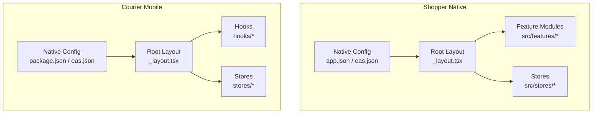

**Diagram sources**
- [_layout.tsx (shopper-native):1-292](file://apps/shopper-native/app/_layout.tsx#L1-L292)
- [_layout.tsx (courier-mobile):1-124](file://apps/courier-mobile/app/_layout.tsx#L1-L124)
- [app.json:1-113](file://apps/shopper-native/app.json#L1-L113)
- [eas.json (shopper-native):1-81](file://apps/shopper-native/eas.json#L1-L81)
- [package.json (courier-mobile):1-66](file://apps/courier-mobile/package.json#L1-L66)
- [eas.json (courier-mobile):1-25](file://apps/courier-mobile/eas.json#L1-L25)

**Section sources**
- [_layout.tsx (shopper-native):1-292](file://apps/shopper-native/app/_layout.tsx#L1-L292)
- [_layout.tsx (courier-mobile):1-124](file://apps/courier-mobile/app/_layout.tsx#L1-L124)
- [app.json:1-113](file://apps/shopper-native/app.json#L1-L113)
- [package.json (shopper-native):1-104](file://apps/shopper-native/package.json#L1-L104)
- [package.json (courier-mobile):1-66](file://apps/courier-mobile/package.json#L1-L66)

## Core Components
- Root layouts bootstrap global providers, fonts, splash screen, error boundaries, and route stacks.
- Feature modules encapsulate domain logic (auth, orders, cart, etc.) in shopper-native.
- Stores centralize application state using Zustand; data fetching uses TanStack Query with persistence.
- Platform configuration declares permissions, plugins, and build settings.

Key responsibilities:
- Navigation: Expo Router file-based routing with grouped routes for roles and tabs.
- State: Zustand stores for UI and domain state; TanStack Query for server state with async storage persister.
- Offline: Persisted query client and offline queue runner to handle connectivity issues.
- Push notifications: Registration, channel setup, foreground handling, and tap routing.
- GPS tracking: Foreground/background location updates with adaptive posting intervals.

**Section sources**
- [_layout.tsx (shopper-native):1-292](file://apps/shopper-native/app/_layout.tsx#L1-L292)
- [_layout.tsx (courier-mobile):1-124](file://apps/courier-mobile/app/_layout.tsx#L1-L124)
- [package.json (shopper-native):1-104](file://apps/shopper-native/package.json#L1-L104)
- [stores/index.ts:1-19](file://apps/courier-mobile/src/stores/index.ts#L1-L19)

## Architecture Overview
The mobile architecture follows a layered approach:
- Presentation: Expo Router screens organized by features and roles.
- Domain features: Encapsulated business logic per feature folder.
- State layer: Zustand stores for local state; TanStack Query for remote data with persistence.
- Infrastructure: Native modules via Expo plugins, network bridge, offline queue, observability hooks.

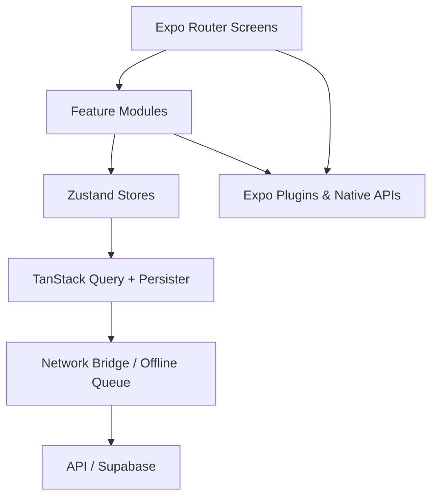

[No sources needed since this diagram shows conceptual workflow, not actual code structure]

## Detailed Component Analysis

### Navigation and App Bootstrapping (Shopper Native)
- Root layout initializes fonts, splash screen, error boundaries, and global providers.
- Role-based route groups: (auth), (customer), (driver), (pharmacist).
- Notification sync and push registration run at root level to ensure timely availability.
- Cart reservation errors surfaced via a global sheet.

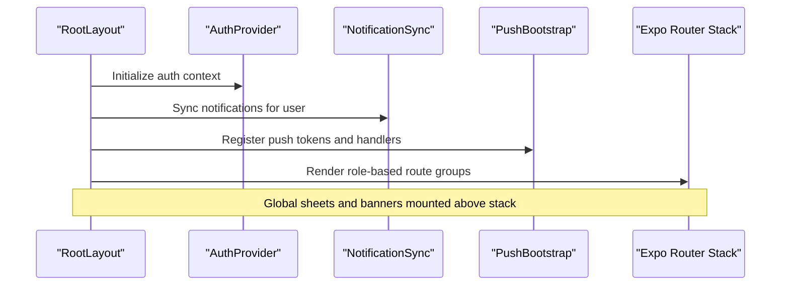

**Diagram sources**
- [_layout.tsx (shopper-native):1-292](file://apps/shopper-native/app/_layout.tsx#L1-L292)

**Section sources**
- [_layout.tsx (shopper-native):1-292](file://apps/shopper-native/app/_layout.tsx#L1-L292)

### Navigation and App Bootstrapping (Courier Mobile)
- Root layout sets up font loading, splash safety timeout, and providers.
- Auth guard redirects between (auth) and (tabs) based on authentication state.
- GPS tracking and push notification hooks are mounted at root to start immediately when authenticated.
- Toast and network banner are globally available.

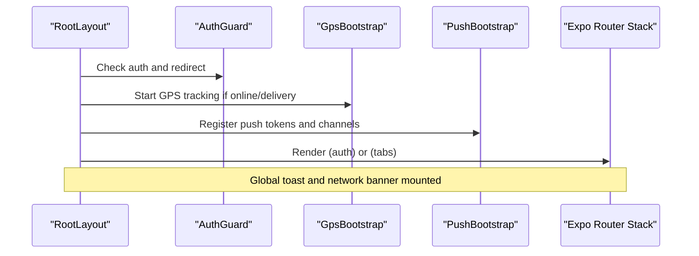

**Diagram sources**
- [_layout.tsx (courier-mobile):1-124](file://apps/courier-mobile/app/_layout.tsx#L1-L124)

**Section sources**
- [_layout.tsx (courier-mobile):1-124](file://apps/courier-mobile/app/_layout.tsx#L1-L124)

### State Management Patterns
- Zustand stores expose typed selectors and actions for auth, location, orders, and notifications.
- TanStack Query persists cache to device storage and resumes paused mutations after hydration.
- Network-aware components update UI based on connectivity status.

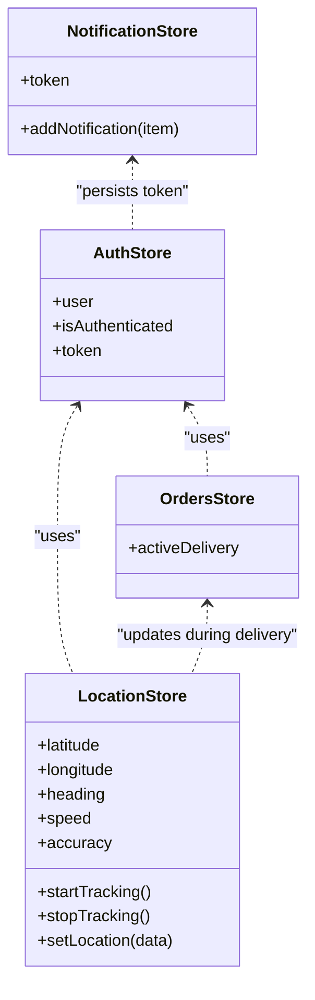

**Diagram sources**
- [stores/index.ts:1-19](file://apps/courier-mobile/src/stores/index.ts#L1-L19)

**Section sources**
- [stores/index.ts:1-19](file://apps/courier-mobile/src/stores/index.ts#L1-L19)
- [_layout.tsx (courier-mobile):1-124](file://apps/courier-mobile/app/_layout.tsx#L1-L124)

### GPS Tracking Flow (Driver)
- Foreground tracking starts when driver is online.
- Background tracking activates during active deliveries.
- Locations are filtered and posted to backend with retry/queueing.
- On app resume, foreground tracking restarts if needed.

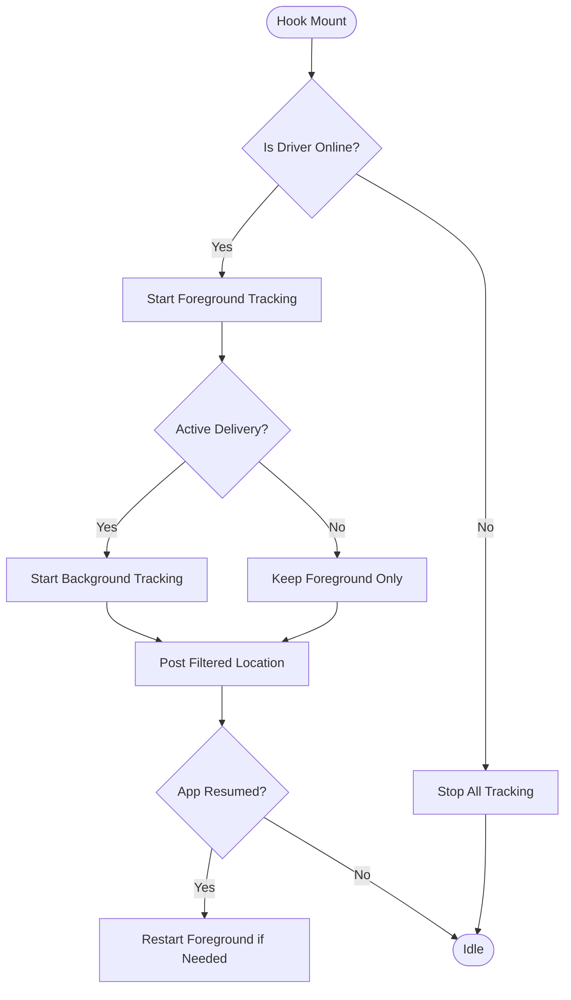

**Diagram sources**
- [useGpsTracking.ts:1-110](file://apps/courier-mobile/src/hooks/useGpsTracking.ts#L1-L110)

**Section sources**
- [useGpsTracking.ts:1-110](file://apps/courier-mobile/src/hooks/useGpsTracking.ts#L1-L110)

### Push Notifications Integration
- Permission request and channel setup on Android.
- Token retrieval and registration with backend.
- Foreground notifications displayed as toasts; background taps route to specific screens.

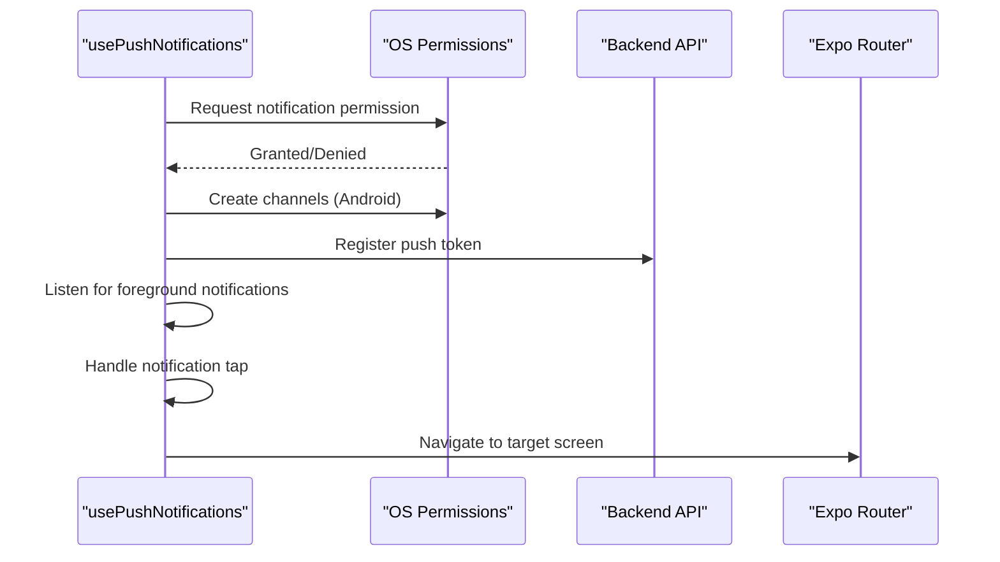

**Diagram sources**
- [usePushNotifications.ts:1-120](file://apps/courier-mobile/src/hooks/usePushNotifications.ts#L1-L120)

**Section sources**
- [usePushNotifications.ts:1-120](file://apps/courier-mobile/src/hooks/usePushNotifications.ts#L1-L120)

### Platform-Specific Implementations and Native Integrations
- Camera access configured via Expo plugin with localized permission descriptions.
- Image picker integrated for payment receipts.
- Location services enabled with usage descriptions and fine/coarse permissions.
- Notifications configured with color and channels.
- Build properties enable Kotlin version, minification, and New Architecture flags.

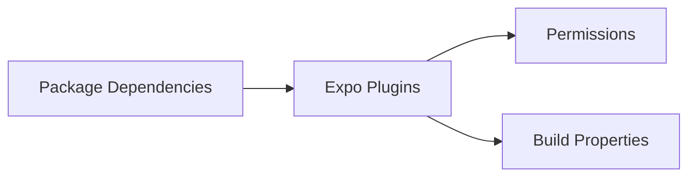

**Diagram sources**
- [app.json:1-113](file://apps/shopper-native/app.json#L1-L113)
- [package.json (shopper-native):1-104](file://apps/shopper-native/package.json#L1-L104)

**Section sources**
- [app.json:1-113](file://apps/shopper-native/app.json#L1-L113)
- [package.json (shopper-native):1-104](file://apps/shopper-native/package.json#L1-L104)

### Offline Capabilities
- TanStack Query persisted client ensures cache survives app restarts.
- Offline queue runner queues mutations when network is unavailable and replays them later.
- Network bridge updates UI based on connectivity changes.

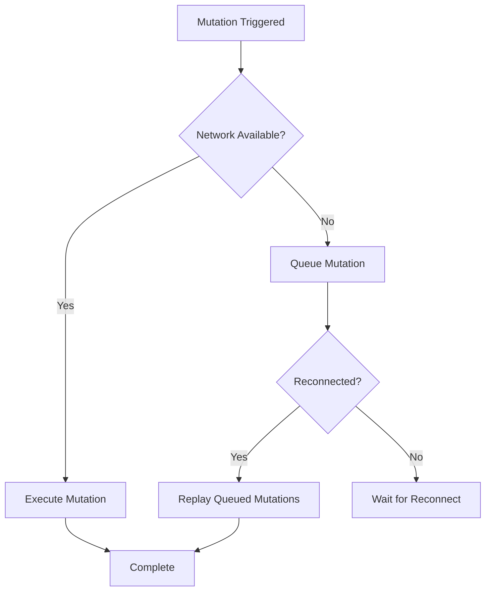

**Diagram sources**
- [_layout.tsx (shopper-native):1-292](file://apps/shopper-native/app/_layout.tsx#L1-L292)

**Section sources**
- [_layout.tsx (shopper-native):1-292](file://apps/shopper-native/app/_layout.tsx#L1-L292)

### Build Configuration and Deployment
- EAS profiles define development, preview, and production builds for both platforms.
- Channels separate distribution streams; auto-increment versions for production.
- Submit profile configures Play Store track and service account key path.

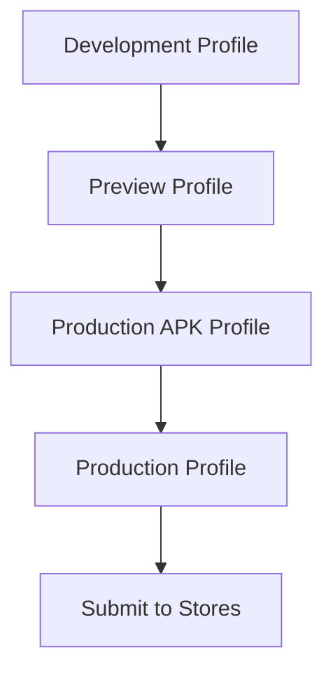

**Diagram sources**
- [eas.json (shopper-native):1-81](file://apps/shopper-native/eas.json#L1-L81)
- [eas.json (courier-mobile):1-25](file://apps/courier-mobile/eas.json#L1-L25)

**Section sources**
- [eas.json (shopper-native):1-81](file://apps/shopper-native/eas.json#L1-L81)
- [eas.json (courier-mobile):1-25](file://apps/courier-mobile/eas.json#L1-L25)

## Dependency Analysis
- Shopper Native depends on Expo ecosystem, TanStack Query, Zustand, maps, camera, location, and notifications.
- Courier Mobile depends on Expo ecosystem, socket client for real-time updates, and similar native modules.
- Shared packages include design tokens and UI components.

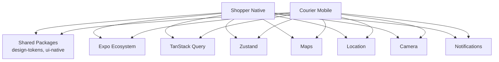

**Diagram sources**
- [package.json (shopper-native):1-104](file://apps/shopper-native/package.json#L1-L104)
- [package.json (courier-mobile):1-66](file://apps/courier-mobile/package.json#L1-L66)

**Section sources**
- [package.json (shopper-native):1-104](file://apps/shopper-native/package.json#L1-L104)
- [package.json (courier-mobile):1-66](file://apps/courier-mobile/package.json#L1-L66)

## Performance Considerations
- Use New Architecture flags and minification in release builds to improve performance and reduce bundle size.
- Persist query cache to disk to avoid redundant network requests and speed up cold starts.
- Limit GPS polling frequency and use filtered locations to reduce battery and bandwidth usage.
- Defer heavy tasks off the main thread where possible; leverage reanimated and worklets for smooth animations.
- Optimize images and assets; use lazy loading for lists and maps.

[No sources needed since this section provides general guidance]

## Troubleshooting Guide
- Push notifications: Ensure permissions granted and channels created on Android; verify token registration with backend.
- GPS tracking: Confirm location permissions; check foreground/background modes; validate app lifecycle events for resume behavior.
- Offline mode: Verify network bridge updates; confirm queued mutations replay upon reconnection.
- Build issues: Validate EAS credentials and environment variables; review build logs for native compilation errors.

**Section sources**
- [usePushNotifications.ts:1-120](file://apps/courier-mobile/src/hooks/usePushNotifications.ts#L1-L120)
- [useGpsTracking.ts:1-110](file://apps/courier-mobile/src/hooks/useGpsTracking.ts#L1-L110)
- [_layout.tsx (shopper-native):1-292](file://apps/shopper-native/app/_layout.tsx#L1-L292)
- [eas.json (shopper-native):1-81](file://apps/shopper-native/eas.json#L1-L81)

## Conclusion
The mobile architecture leverages Expo Router for structured navigation, Zustand and TanStack Query for robust state management, and carefully configured native integrations for camera, location, and notifications. The courier app adds advanced GPS tracking and real-time communication tailored for drivers. Build and deployment are streamlined through EAS with clear channels and submission workflows. Following the outlined patterns will help maintain scalability, reliability, and performance across both customer and driver applications.