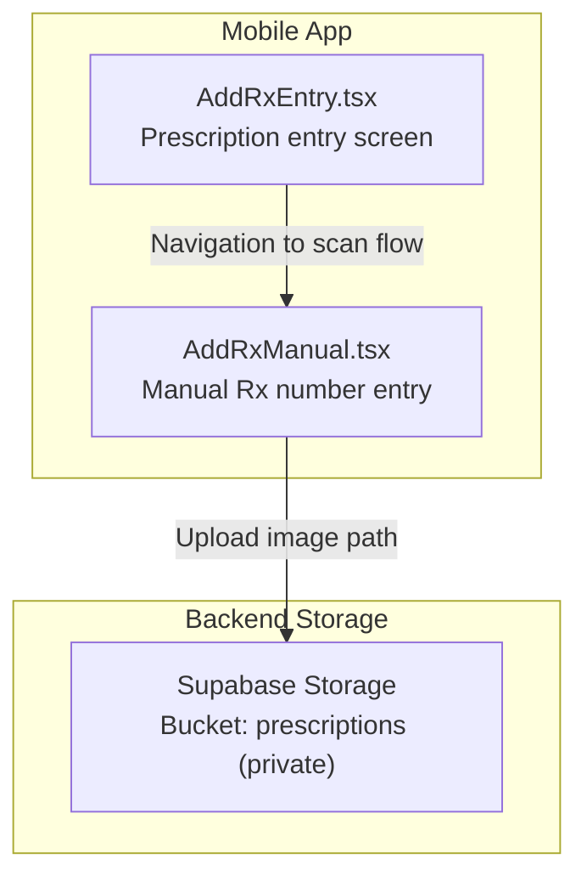
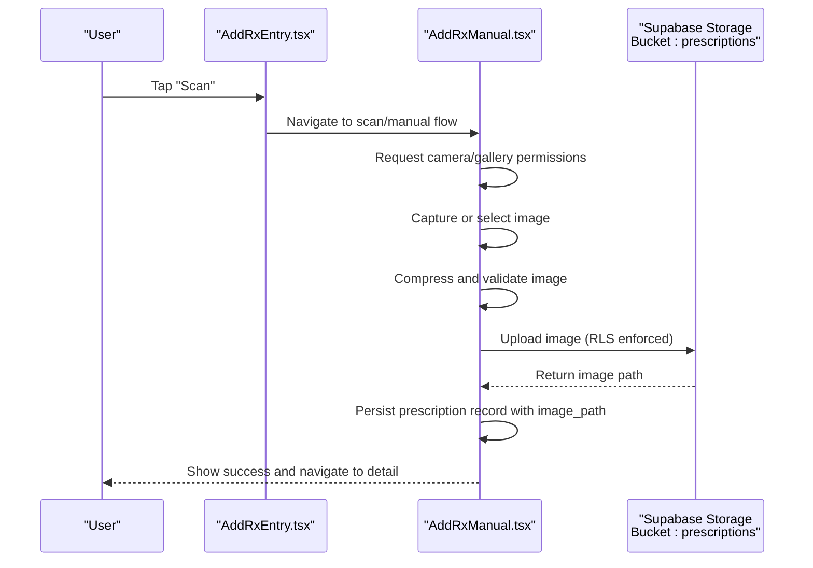
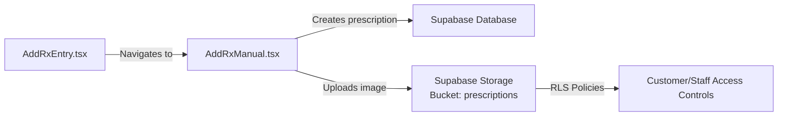

# Camera & Image Processing

<cite>
**Referenced Files in This Document**
- [AddRxEntry.tsx](file://apps/shopper-native/src/features/prescriptions/screens/AddRxEntry.tsx)
- [AddRxManual.tsx](file://apps/shopper-native/src/features/prescriptions/screens/AddRxManual.tsx)
- [prescription_image_upload.sql](file://supabase/migrations/20260817100000_prescription_image_upload.sql)
</cite>

## Table of Contents
1. [Introduction](#introduction)
2. [Project Structure](#project-structure)
3. [Core Components](#core-components)
4. [Architecture Overview](#architecture-overview)
5. [Detailed Component Analysis](#detailed-component-analysis)
6. [Dependency Analysis](#dependency-analysis)
7. [Performance Considerations](#performance-considerations)
8. [Troubleshooting Guide](#troubleshooting-guide)
9. [Conclusion](#conclusion)

## Introduction
This document explains how the mobile application integrates camera and image processing features for prescription workflows, including scanning entry points, barcode scanning capabilities, and image upload flows. It covers camera permissions, capture settings, file compression strategies, OCR considerations, and image validation. It also provides guidance on implementing prescription photo capture, barcode scanning for product identification, and optimizing images for upload while handling permission errors and performance constraints for large files.

## Project Structure
The relevant implementation spans:
- Prescription screens that provide user flows to add prescriptions via WhatsApp, manual entry, and a scan entry point.
- A Supabase migration that enables secure storage of prescription images with role-based access controls.

**Diagram sources**
- [AddRxEntry.tsx:154-162](file://apps/shopper-native/src/features/prescriptions/screens/AddRxEntry.tsx#L154-L162)
- [AddRxManual.tsx:295-307](file://apps/shopper-native/src/features/prescriptions/screens/AddRxManual.tsx#L295-L307)
- [prescription_image_upload.sql:16-75](file://supabase/migrations/20260817100000_prescription_image_upload.sql#L16-L75)

**Section sources**
- [AddRxEntry.tsx:154-162](file://apps/shopper-native/src/features/prescriptions/screens/AddRxEntry.tsx#L154-L162)
- [AddRxManual.tsx:295-307](file://apps/shopper-native/src/features/prescriptions/screens/AddRxManual.tsx#L295-L307)
- [prescription_image_upload.sql:16-75](file://supabase/migrations/20260817100000_prescription_image_upload.sql#L16-L75)

## Core Components
- Prescription entry screen: Presents multiple ways to add a prescription, including a scan option that navigates to a dedicated flow.
- Manual entry screen: Implements a robust input experience for prescription numbers and includes submission logic that can be extended to handle image uploads.
- Secure storage pipeline: A private storage bucket with policies ensuring users can only manage their own files and staff can review them.

Key responsibilities:
- AddRxEntry.tsx: Orchestrates entry options and navigation to the scan flow.
- AddRxManual.tsx: Handles data entry state, validation, and submission; serves as a natural place to integrate image capture and upload.
- Supabase migration: Defines the storage bucket and RLS policies for secure prescription image management.

**Section sources**
- [AddRxEntry.tsx:154-162](file://apps/shopper-native/src/features/prescriptions/screens/AddRxEntry.tsx#L154-L162)
- [AddRxManual.tsx:295-307](file://apps/shopper-native/src/features/prescriptions/screens/AddRxManual.tsx#L295-L307)
- [prescription_image_upload.sql:16-75](file://supabase/migrations/20260817100000_prescription_image_upload.sql#L16-L75)

## Architecture Overview
The prescription image workflow integrates UI navigation, optional native camera capture, image optimization, and secure upload to a private storage bucket.

**Diagram sources**
- [AddRxEntry.tsx:154-162](file://apps/shopper-native/src/features/prescriptions/screens/AddRxEntry.tsx#L154-L162)
- [AddRxManual.tsx:295-307](file://apps/shopper-native/src/features/prescriptions/screens/AddRxManual.tsx#L295-L307)
- [prescription_image_upload.sql:23-75](file://supabase/migrations/20260817100000_prescription_image_upload.sql#L23-L75)

## Detailed Component Analysis

### Prescription Entry Screen (AddRxEntry.tsx)
- Provides an entry card for scanning prescriptions and navigates to a scan route.
- The scan option is presented alongside other methods (WhatsApp, manual entry), enabling a consistent UX for adding prescriptions.

Implementation notes:
- Navigation to the scan flow is handled by pushing to a specific route.
- The screen remains lightweight and focused on guiding users to the appropriate method.

**Section sources**
- [AddRxEntry.tsx:154-162](file://apps/shopper-native/src/features/prescriptions/screens/AddRxEntry.tsx#L154-L162)

### Manual Entry Screen (AddRxManual.tsx)
- Manages prescription number input with validation and duplicate checks.
- Includes submission logic that can be extended to attach an image path to the created prescription.
- Serves as a suitable integration point for camera capture and image upload since it already handles creation and navigation upon success.

Integration opportunities:
- Add camera permission requests before capturing images.
- After successful capture, compress the image and upload to the prescriptions bucket.
- On upload success, update the prescription record with the returned image path.

**Section sources**
- [AddRxManual.tsx:295-307](file://apps/shopper-native/src/features/prescriptions/screens/AddRxManual.tsx#L295-L307)

### Secure Storage Pipeline (prescription_image_upload.sql)
- Creates a private storage bucket named “prescriptions”.
- Enforces strict RLS policies:
  - Customers can upload, update, read, and delete only their own files.
  - Staff roles (admin, manager, pharmacist) can read all files for review.

Security implications:
- Ensures privacy of prescription documents.
- Enables controlled access for pharmacy staff to review submissions.

**Section sources**
- [prescription_image_upload.sql:16-75](file://supabase/migrations/20260817100000_prescription_image_upload.sql#L16-L75)

## Dependency Analysis
- AddRxEntry.tsx depends on navigation to the scan flow.
- AddRxManual.tsx depends on authentication context and mutation hooks to create prescriptions; it can be extended to depend on camera and storage services.
- The backend relies on Supabase Storage with RLS policies to enforce access control.

**Diagram sources**
- [AddRxEntry.tsx:154-162](file://apps/shopper-native/src/features/prescriptions/screens/AddRxEntry.tsx#L154-L162)
- [AddRxManual.tsx:295-307](file://apps/shopper-native/src/features/prescriptions/screens/AddRxManual.tsx#L295-L307)
- [prescription_image_upload.sql:23-75](file://supabase/migrations/20260817100000_prescription_image_upload.sql#L23-L75)

**Section sources**
- [AddRxEntry.tsx:154-162](file://apps/shopper-native/src/features/prescriptions/screens/AddRxEntry.tsx#L154-L162)
- [AddRxManual.tsx:295-307](file://apps/shopper-native/src/features/prescriptions/screens/AddRxManual.tsx#L295-L307)
- [prescription_image_upload.sql:23-75](file://supabase/migrations/20260817100000_prescription_image_upload.sql#L23-L75)

## Performance Considerations
- Image capture and compression:
  - Prefer capturing at a resolution sufficient for readability but not excessively large (e.g., target width around 1200–1600px).
  - Use lossy compression (e.g., JPEG quality ~70–85%) to reduce payload size while preserving legibility.
  - Avoid unnecessary EXIF metadata; strip orientation and location data when possible.
- Upload efficiency:
  - Chunked uploads are beneficial for large files; if supported by your client library, enable progress tracking and retries.
  - Validate file type and size before upload to prevent wasted bandwidth.
- Memory and UI responsiveness:
  - Perform compression off the main thread where possible.
  - Show loading indicators during capture, compression, and upload phases.
- Network resilience:
  - Implement retry logic with exponential backoff for transient failures.
  - Handle network changes gracefully and queue uploads when offline if needed.

[No sources needed since this section provides general guidance]

## Troubleshooting Guide
Common issues and resolutions:
- Camera/gallery permission denied:
  - Prompt the user to grant permissions and explain why they are required for capturing prescription images.
  - If denied, guide the user to app settings to enable permissions manually.
- Invalid image format or size:
  - Validate MIME types (e.g., image/jpeg, image/png) and enforce maximum file size limits before upload.
  - Provide clear error messages and allow re-capture or selection from gallery.
- Upload failures due to RLS:
  - Ensure the authenticated user’s ID matches the folder structure expected by policies (e.g., bucket path starts with user ID).
  - Verify that the storage bucket exists and policies are applied as defined in the migration.
- Large image performance:
  - Re-compress images if they exceed size thresholds.
  - Consider progressive upload or resumable transfers for very large files.

**Section sources**
- [prescription_image_upload.sql:23-75](file://supabase/migrations/20260817100000_prescription_image_upload.sql#L23-L75)

## Conclusion
The application provides a structured entry point for prescription scanning and a robust manual entry flow that can be extended to support full prescription photo capture and upload. The secure storage pipeline ensures privacy and controlled access for staff review. By integrating camera permissions, image compression, and resilient upload logic into the manual entry screen, you can deliver a smooth, reliable prescription submission experience.

[No sources needed since this section summarizes without analyzing specific files]