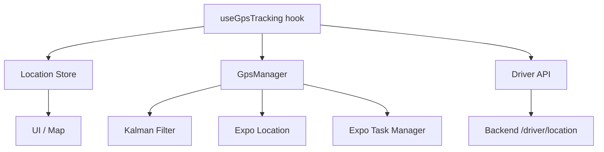
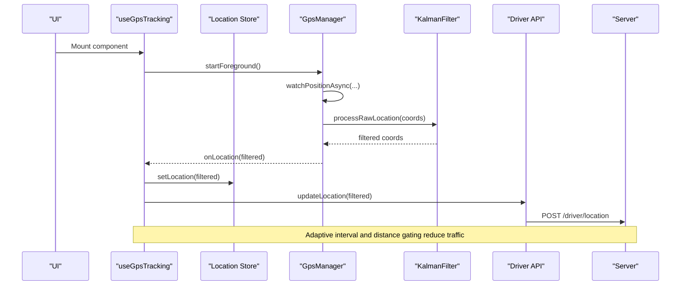
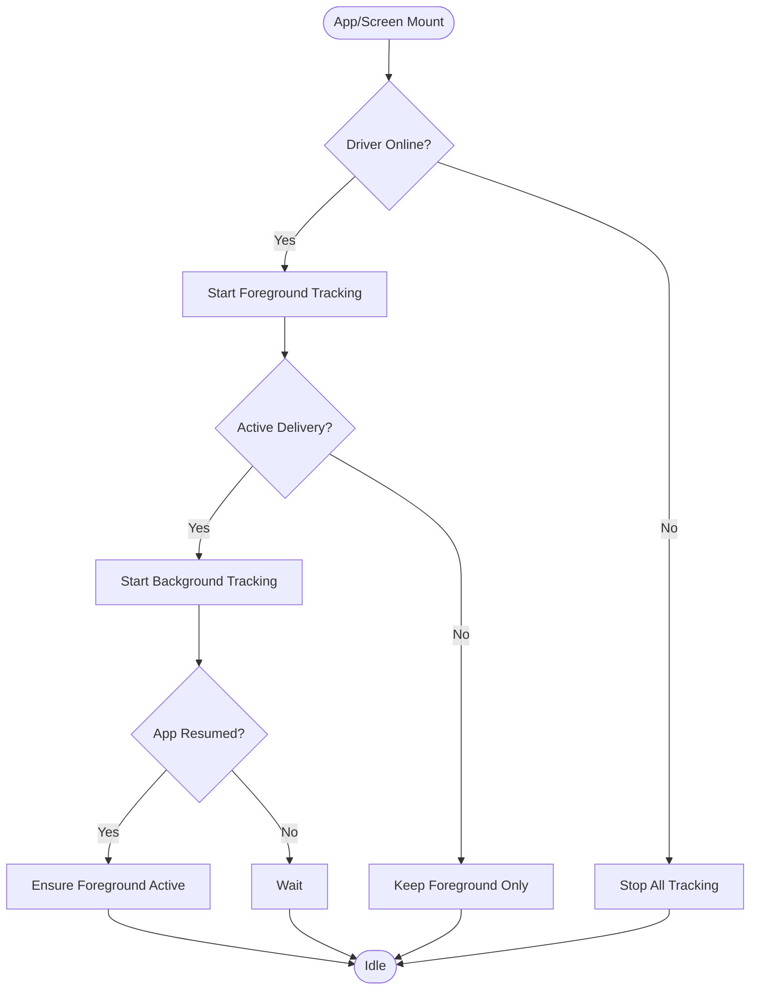
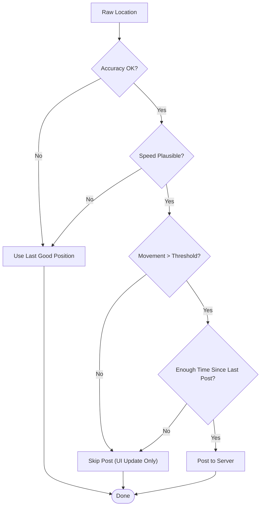
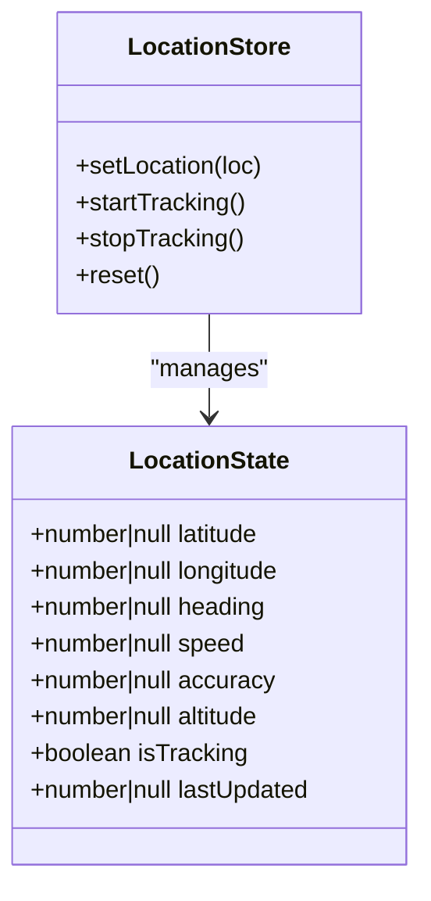
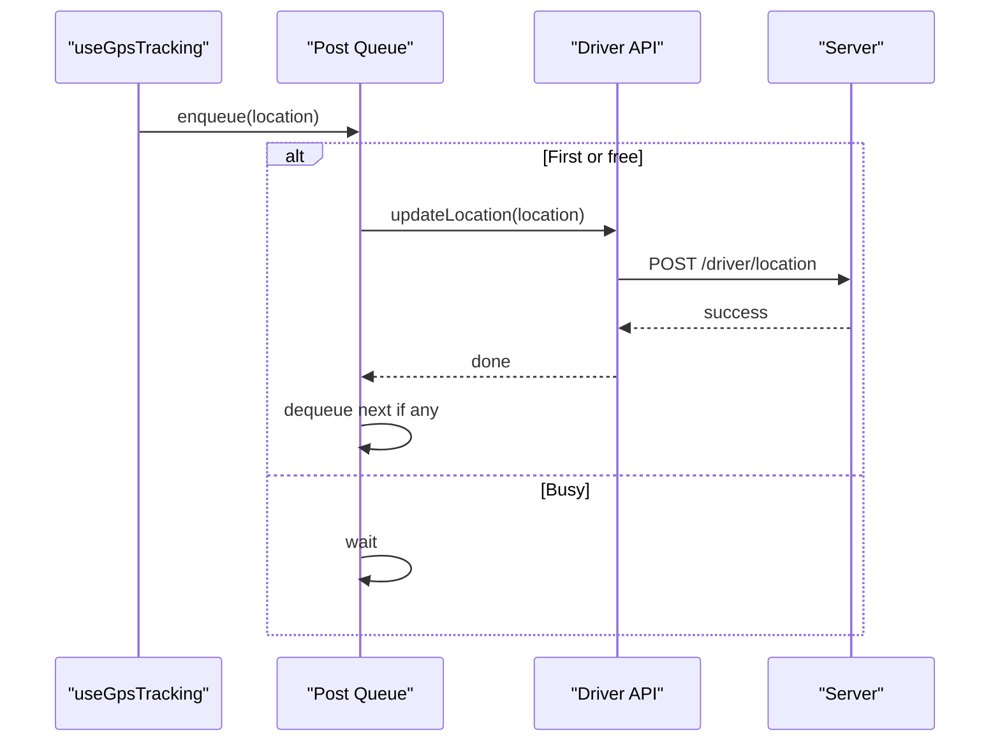
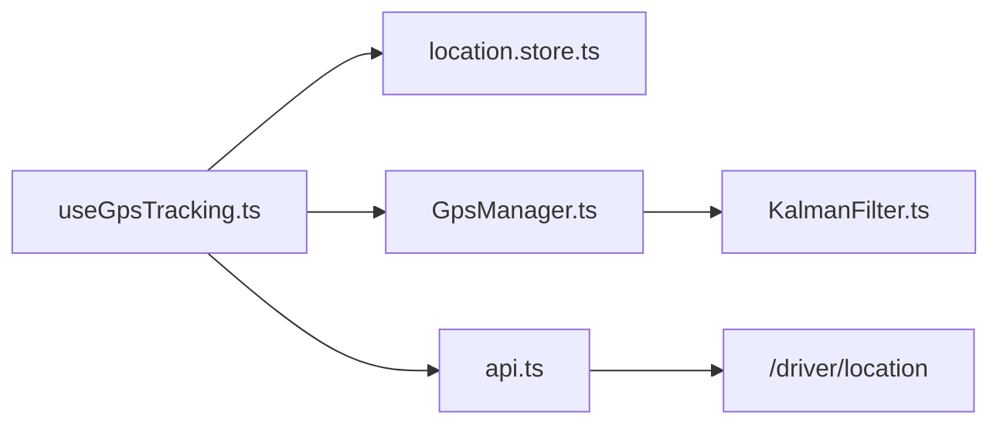

# GPS Tracking & Location Services

<cite>
**Referenced Files in This Document**
- [useGpsTracking.ts](file://apps/courier-mobile/src/hooks/useGpsTracking.ts)
- [location.store.ts](file://apps/courier-mobile/src/stores/location.store.ts)
- [GpsManager.ts](file://apps/courier-mobile/src/lib/gps/GpsManager.ts)
- [KalmanFilter.ts](file://apps/courier-mobile/src/lib/gps/KalmanFilter.ts)
- [api.ts](file://apps/courier-mobile/src/lib/api.ts)
</cite>

## Table of Contents
1. Introduction
2. Project Structure
3. Core Components
4. Architecture Overview
5. Detailed Component Analysis
6. Dependency Analysis
7. Performance Considerations
8. Troubleshooting Guide
9. Conclusion

## Introduction
This document explains the GPS tracking and location services implementation for the React Native courier application. It covers background and foreground location tracking, geofencing considerations, state management for driver positions, real-time location broadcasting to the server, permission handling, battery optimization, and platform-specific integration points.

## Project Structure
The location system is implemented in the courier-mobile app with a clear separation of concerns:
- A hook orchestrates lifecycle events (foreground/background), integrates with the location store, and posts locations to the backend.
- A singleton GPS manager encapsulates native location APIs, background tasks, filtering, and adaptive posting intervals.
- A Kalman filter smooths raw GPS readings and applies accuracy/speed gating.
- A Zustand store manages UI-facing location state and tracking flags.
- An API client posts filtered locations to the server.

**Diagram sources**
- [useGpsTracking.ts:19-109](file://apps/courier-mobile/src/hooks/useGpsTracking.ts#L19-L109)
- [GpsManager.ts:30-227](file://apps/courier-mobile/src/lib/gps/GpsManager.ts#L30-L227)
- [KalmanFilter.ts:74-163](file://apps/courier-mobile/src/lib/gps/KalmanFilter.ts#L74-L163)
- [api.ts:75-103](file://apps/courier-mobile/src/lib/api.ts#L75-L103)

**Section sources**
- [useGpsTracking.ts:19-109](file://apps/courier-mobile/src/hooks/useGpsTracking.ts#L19-L109)
- [GpsManager.ts:30-227](file://apps/courier-mobile/src/lib/gps/GpsManager.ts#L30-L227)
- [KalmanFilter.ts:74-163](file://apps/courier-mobile/src/lib/gps/KalmanFilter.ts#L74-L163)
- [api.ts:75-103](file://apps/courier-mobile/src/lib/api.ts#L75-L103)

## Core Components
- useGpsTracking hook: Starts/stops foreground and background tracking based on driver online status and active delivery; updates the location store; queues and posts locations to the server.
- GpsManager: Wraps expo-location for foreground/background tracking; registers a background task; filters and adapts update frequency; emits processed locations via callbacks.
- KalmanFilter: Smooths lat/lng using independent 1D filters; enforces accuracy and speed gates; suppresses jitter.
- Location Store: Holds current position, heading, speed, accuracy, altitude, tracking flag, and last updated timestamp.
- Driver API: Posts location data to the backend endpoint with authentication headers.

**Section sources**
- [useGpsTracking.ts:19-109](file://apps/courier-mobile/src/hooks/useGpsTracking.ts#L19-L109)
- [GpsManager.ts:30-227](file://apps/courier-mobile/src/lib/gps/GpsManager.ts#L30-L227)
- [KalmanFilter.ts:74-163](file://apps/courier-mobile/src/lib/gps/KalmanFilter.ts#L74-L163)
- [location.store.ts:1-44](file://apps/courier-mobile/src/stores/location.store.ts#L1-L44)
- [api.ts:75-103](file://apps/courier-mobile/src/lib/api.ts#L75-L103)

## Architecture Overview
The system uses a layered architecture:
- Presentation layer: UI consumes location state from the store.
- Orchestration layer: The hook coordinates lifecycle and network posting.
- Service layer: GpsManager handles native location access, background tasks, and filtering.
- Data layer: API client sends location updates to the server.

**Diagram sources**
- [useGpsTracking.ts:19-109](file://apps/courier-mobile/src/hooks/useGpsTracking.ts#L19-L109)
- [GpsManager.ts:58-80](file://apps/courier-mobile/src/lib/gps/GpsManager.ts#L58-L80)
- [GpsManager.ts:150-213](file://apps/courier-mobile/src/lib/gps/GpsManager.ts#L150-L213)
- [KalmanFilter.ts:94-149](file://apps/courier-mobile/src/lib/gps/KalmanFilter.ts#L94-L149)
- [api.ts:95-103](file://apps/courier-mobile/src/lib/api.ts#L95-L103)

## Detailed Component Analysis

### Foreground and Background Tracking Flow
- Foreground tracking starts when the driver goes online; stops when offline.
- Background tracking starts during an active delivery; stops when no longer needed.
- App resume logic ensures foreground tracking resumes when returning to the app while online.

**Diagram sources**
- [useGpsTracking.ts:80-108](file://apps/courier-mobile/src/hooks/useGpsTracking.ts#L80-L108)
- [GpsManager.ts:58-80](file://apps/courier-mobile/src/lib/gps/GpsManager.ts#L58-L80)
- [GpsManager.ts:93-132](file://apps/courier-mobile/src/lib/gps/GpsManager.ts#L93-L132)

**Section sources**
- [useGpsTracking.ts:80-108](file://apps/courier-mobile/src/hooks/useGpsTracking.ts#L80-L108)
- [GpsManager.ts:58-132](file://apps/courier-mobile/src/lib/gps/GpsManager.ts#L58-L132)

### Location Filtering and Posting Logic
- Raw locations are smoothed by a Kalman filter.
- Accuracy and speed gates discard implausible jumps.
- Adaptive posting interval depends on speed; stationary mode reduces frequency further.
- Distance-based gating avoids redundant posts when near the last posted point.

**Diagram sources**
- [KalmanFilter.ts:94-149](file://apps/courier-mobile/src/lib/gps/KalmanFilter.ts#L94-L149)
- [GpsManager.ts:150-213](file://apps/courier-mobile/src/lib/gps/GpsManager.ts#L150-L213)

**Section sources**
- [KalmanFilter.ts:94-149](file://apps/courier-mobile/src/lib/gps/KalmanFilter.ts#L94-L149)
- [GpsManager.ts:150-213](file://apps/courier-mobile/src/lib/gps/GpsManager.ts#L150-L213)

### State Management for User Positions
- The location store holds latitude, longitude, heading, speed, accuracy, altitude, tracking flag, and last updated time.
- The hook updates the store with each filtered location and toggles tracking state based on online/delivery context.

**Diagram sources**
- [location.store.ts:3-44](file://apps/courier-mobile/src/stores/location.store.ts#L3-L44)

**Section sources**
- [location.store.ts:3-44](file://apps/courier-mobile/src/stores/location.store.ts#L3-L44)
- [useGpsTracking.ts:19-73](file://apps/courier-mobile/src/hooks/useGpsTracking.ts#L19-L73)

### Real-Time Location Broadcasting to the Server
- Each filtered location is posted via the driver API to the backend endpoint.
- A queue ensures only one request at a time; subsequent locations are queued and sent after completion.
- Authentication is attached automatically via an Axios interceptor.

**Diagram sources**
- [useGpsTracking.ts:29-73](file://apps/courier-mobile/src/hooks/useGpsTracking.ts#L29-L73)
- [api.ts:24-43](file://apps/courier-mobile/src/lib/api.ts#L24-L43)
- [api.ts:95-103](file://apps/courier-mobile/src/lib/api.ts#L95-L103)

**Section sources**
- [useGpsTracking.ts:29-73](file://apps/courier-mobile/src/hooks/useGpsTracking.ts#L29-L73)
- [api.ts:24-43](file://apps/courier-mobile/src/lib/api.ts#L24-L43)
- [api.ts:95-103](file://apps/courier-mobile/src/lib/api.ts#L95-L103)

### Geofencing Capabilities
- The current implementation focuses on continuous location tracking rather than explicit geofence regions.
- For geofencing-like behavior, you can monitor proximity to known points using the stored coordinates and compute distances on the client side, then trigger actions when thresholds are crossed.
- If region-based triggers are required, integrate a geofencing library and tie its callbacks into the same posting pipeline used by GpsManager.

[No sources needed since this section provides conceptual guidance]

### Permissions and Platform-Specific Integration
- Foreground permissions are requested before starting watchPositionAsync.
- Background permissions are requested before starting background location updates.
- A background task is defined and invoked by the OS to deliver locations when the app is not in the foreground.
- Android foreground service notification settings are configured for background tracking.

**Section sources**
- [GpsManager.ts:58-80](file://apps/courier-mobile/src/lib/gps/GpsManager.ts#L58-L80)
- [GpsManager.ts:93-132](file://apps/courier-mobile/src/lib/gps/GpsManager.ts#L93-L132)
- [GpsManager.ts:229-244](file://apps/courier-mobile/src/lib/gps/GpsManager.ts#L229-L244)

## Dependency Analysis
The following diagram shows how components depend on each other:

**Diagram sources**
- [useGpsTracking.ts:19-109](file://apps/courier-mobile/src/hooks/useGpsTracking.ts#L19-L109)
- [location.store.ts:1-44](file://apps/courier-mobile/src/stores/location.store.ts#L1-L44)
- [GpsManager.ts:30-227](file://apps/courier-mobile/src/lib/gps/GpsManager.ts#L30-L227)
- [KalmanFilter.ts:74-163](file://apps/courier-mobile/src/lib/gps/KalmanFilter.ts#L74-L163)
- [api.ts:75-103](file://apps/courier-mobile/src/lib/api.ts#L75-L103)

**Section sources**
- [useGpsTracking.ts:19-109](file://apps/courier-mobile/src/hooks/useGpsTracking.ts#L19-L109)
- [GpsManager.ts:30-227](file://apps/courier-mobile/src/lib/gps/GpsManager.ts#L30-L227)
- [KalmanFilter.ts:74-163](file://apps/courier-mobile/src/lib/gps/KalmanFilter.ts#L74-L163)
- [api.ts:75-103](file://apps/courier-mobile/src/lib/api.ts#L75-L103)

## Performance Considerations
- Adaptive posting interval: Updates faster when moving quickly and slower when stationary to save battery and bandwidth.
- Distance gating: Avoids posting when the driver has not moved significantly since the last post.
- Kalman smoothing: Reduces noisy jumps and minimizes unnecessary re-renders and network calls.
- Background task efficiency: Uses balanced accuracy and reasonable intervals for background updates.
- Network batching: A simple queue serializes requests to prevent overlapping uploads.

[No sources needed since this section provides general guidance]

## Troubleshooting Guide
Common issues and resolutions:
- Location permission denied:
  - Ensure foreground and background permissions are granted before starting tracking.
  - Handle denial gracefully and prompt the user to enable permissions in settings.
- Background location restrictions:
  - Verify that the background task is registered and enabled in the app configuration.
  - On some platforms, background updates may require additional manifest entries or entitlements.
- Low GPS accuracy:
  - The system warns when accuracy exceeds a threshold; consider waiting for better signal or prompting the user to move outdoors.
- Excessive battery usage:
  - Reduce update frequency or switch to lower accuracy modes when high precision is not required.
  - Rely on distance and speed-based gating to minimize network calls.
- Stale or missing location updates:
  - Confirm that the app resumes foreground tracking when returning to the app while online.
  - Validate that the background task is running and processing locations.

**Section sources**
- [GpsManager.ts:58-80](file://apps/courier-mobile/src/lib/gps/GpsManager.ts#L58-L80)
- [GpsManager.ts:93-132](file://apps/courier-mobile/src/lib/gps/GpsManager.ts#L93-L132)
- [GpsManager.ts:150-213](file://apps/courier-mobile/src/lib/gps/GpsManager.ts#L150-L213)
- [useGpsTracking.ts:80-108](file://apps/courier-mobile/src/hooks/useGpsTracking.ts#L80-L108)

## Conclusion
The location subsystem combines robust native integration, intelligent filtering, and efficient networking to provide reliable driver tracking. By leveraging adaptive intervals, distance gating, and Kalman smoothing, it balances accuracy with battery and bandwidth constraints. The modular design makes it straightforward to extend with geofencing or additional analytics while maintaining performance and reliability.