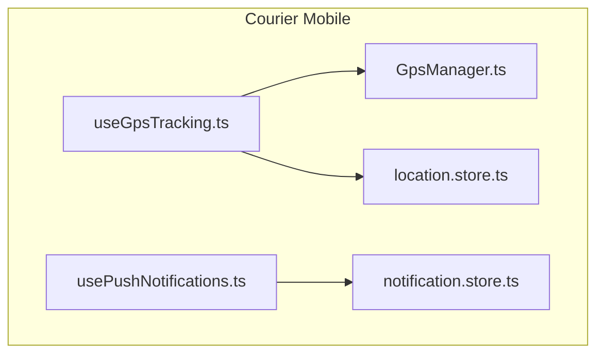
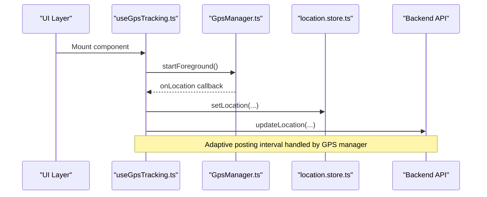
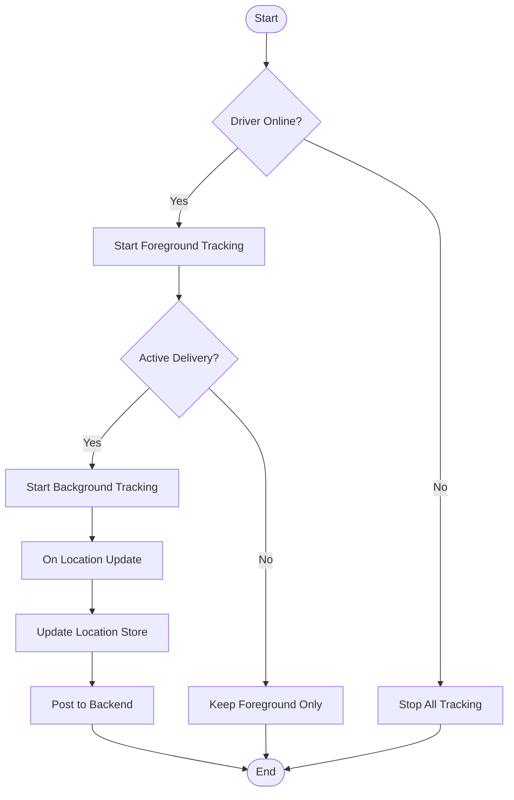
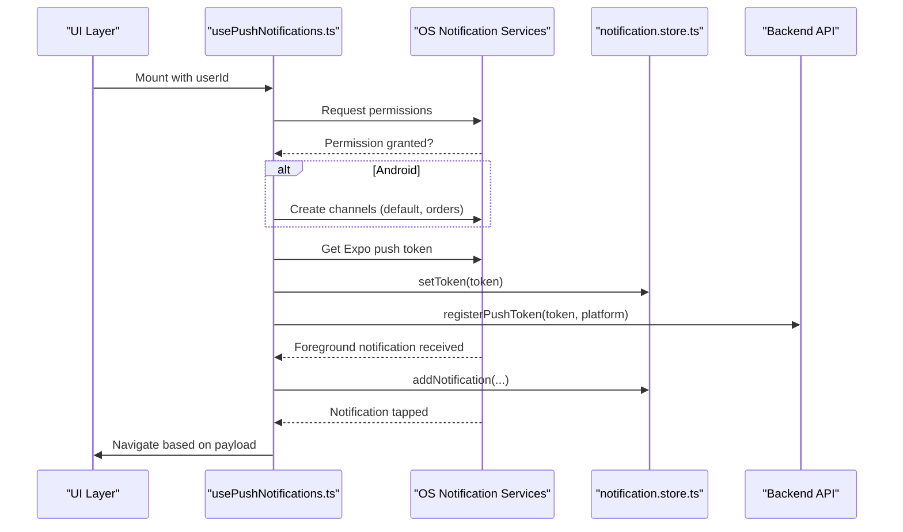
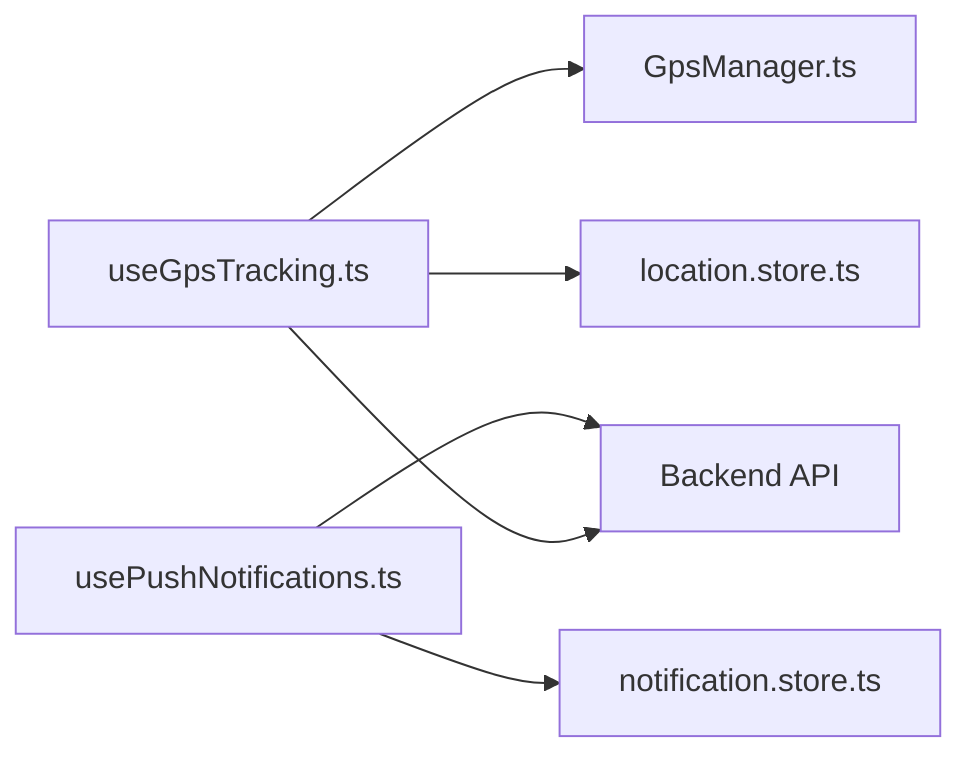

# Native Integrations

<cite>
**Referenced Files in This Document**
- [useGpsTracking.ts](file://apps/courier-mobile/src/hooks/useGpsTracking.ts)
- [GpsManager.ts](file://apps/courier-mobile/src/lib/gps/GpsManager.ts)
- [location.store.ts](file://apps/courier-mobile/src/stores/location.store.ts)
- [usePushNotifications.ts](file://apps/courier-mobile/src/hooks/usePushNotifications.ts)
- [notification.store.ts](file://apps/courier-mobile/src/stores/notification.store.ts)
</cite>

## Table of Contents
1. Introduction
2. Project Structure
3. Core Components
4. Architecture Overview
5. Detailed Component Analysis
6. Dependency Analysis
7. Performance Considerations
8. Troubleshooting Guide
9. Conclusion

## Introduction
This document explains native platform integrations for the React Native applications, focusing on:
- GPS tracking with background location services
- Push notification setup for iOS and Android
- Camera access for prescription scanning
- Native module bridges, permissions, and platform-specific configurations
- Integration with device sensors, storage APIs, and system services
It also provides examples for implementing location tracking, handling notification events, managing native permissions, addressing platform differences, testing native features, troubleshooting common issues, and guidelines for adding new native functionality while maintaining cross-platform compatibility.

## Project Structure
The relevant native integrations are implemented primarily in the courier-mobile application using React hooks, a centralized GPS manager, and Zustand stores for state management. The key modules include:
- GPS tracking hook that orchestrates foreground/background location updates and posts to the backend
- A GPS manager abstraction for native location services
- Location state store for UI and business logic
- Push notification hook for permission handling, token registration, and event listeners
- Notification store for persisting and managing in-app notifications

**Diagram sources**
- [useGpsTracking.ts:1-110](file://apps/courier-mobile/src/hooks/useGpsTracking.ts#L1-L110)
- [GpsManager.ts:1-200](file://apps/courier-mobile/src/lib/gps/GpsManager.ts#L1-L200)
- [location.store.ts:1-44](file://apps/courier-mobile/src/stores/location.store.ts#L1-L44)
- [usePushNotifications.ts:1-120](file://apps/courier-mobile/src/hooks/usePushNotifications.ts#L1-L120)
- [notification.store.ts:1-72](file://apps/courier-mobile/src/stores/notification.store.ts#L1-L72)

**Section sources**
- [useGpsTracking.ts:1-110](file://apps/courier-mobile/src/hooks/useGpsTracking.ts#L1-L110)
- [GpsManager.ts:1-200](file://apps/courier-mobile/src/lib/gps/GpsManager.ts#L1-L200)
- [location.store.ts:1-44](file://apps/courier-mobile/src/stores/location.store.ts#L1-L44)
- [usePushNotifications.ts:1-120](file://apps/courier-mobile/src/hooks/usePushNotifications.ts#L1-L120)
- [notification.store.ts:1-72](file://apps/courier-mobile/src/stores/notification.store.ts#L1-L72)

## Core Components
- GPS Tracking Hook: Coordinates starting/stopping foreground and background location based on driver online status and active delivery; applies filtered locations to the store and posts to the backend with an adaptive interval managed by the GPS manager.
- GPS Manager: Abstraction over native location services (foreground and background), providing methods to start/stop tracking and query current tracking mode.
- Location Store: Centralized state for current coordinates, heading, speed, accuracy, altitude, tracking flags, and timestamps.
- Push Notifications Hook: Handles permission requests, Android channel configuration, token retrieval and registration, and sets up listeners for foreground notifications and taps.
- Notification Store: Persists push tokens and recent notifications, tracks read status, and exposes actions to manage them.

**Section sources**
- [useGpsTracking.ts:1-110](file://apps/courier-mobile/src/hooks/useGpsTracking.ts#L1-L110)
- [GpsManager.ts:1-200](file://apps/courier-mobile/src/lib/gps/GpsManager.ts#L1-L200)
- [location.store.ts:1-44](file://apps/courier-mobile/src/stores/location.store.ts#L1-L44)
- [usePushNotifications.ts:1-120](file://apps/courier-mobile/src/hooks/usePushNotifications.ts#L1-L120)
- [notification.store.ts:1-72](file://apps/courier-mobile/src/stores/notification.store.ts#L1-L72)

## Architecture Overview
The integration architecture connects UI hooks to native capabilities via managers and stores, ensuring separation of concerns and clear data flows.

**Diagram sources**
- [useGpsTracking.ts:1-110](file://apps/courier-mobile/src/hooks/useGpsTracking.ts#L1-L110)
- [GpsManager.ts:1-200](file://apps/courier-mobile/src/lib/gps/GpsManager.ts#L1-L200)
- [location.store.ts:1-44](file://apps/courier-mobile/src/stores/location.store.ts#L1-L44)

## Detailed Component Analysis

### GPS Tracking Implementation
- Foreground tracking starts when the driver is online; stops when offline.
- Background tracking starts during an active delivery and stops when not active or offline.
- App lifecycle awareness resumes foreground tracking when the app becomes active if needed.
- Location updates are filtered and posted to the backend with queuing to avoid concurrent writes.

**Diagram sources**
- [useGpsTracking.ts:1-110](file://apps/courier-mobile/src/hooks/useGpsTracking.ts#L1-L110)

**Section sources**
- [useGpsTracking.ts:1-110](file://apps/courier-mobile/src/hooks/useGpsTracking.ts#L1-L110)
- [location.store.ts:1-44](file://apps/courier-mobile/src/stores/location.store.ts#L1-L44)

### Push Notification Setup (iOS and Android)
- Requests notification permissions and configures Android channels for default and orders.
- Retrieves Expo push token and registers it with the backend along with platform type.
- Sets up handlers for foreground notifications and taps to navigate within the app.
- Persists tokens and notifications locally for resilience and UX.

**Diagram sources**
- [usePushNotifications.ts:1-120](file://apps/courier-mobile/src/hooks/usePushNotifications.ts#L1-L120)
- [notification.store.ts:1-72](file://apps/courier-mobile/src/stores/notification.store.ts#L1-L72)

**Section sources**
- [usePushNotifications.ts:1-120](file://apps/courier-mobile/src/hooks/usePushNotifications.ts#L1-L120)
- [notification.store.ts:1-72](file://apps/courier-mobile/src/stores/notification.store.ts#L1-L72)

### Camera Access for Prescription Scanning
- Use a camera library compatible with Expo/React Native to capture images from the device camera or gallery.
- Request camera permissions before opening the camera; handle denied scenarios gracefully.
- Process captured images for OCR or upload to backend for prescription review.
- Ensure image compression and validation to reduce bandwidth and improve performance.

[No sources needed since this section provides general guidance]

### Native Module Bridges and Platform-Specific Configurations
- Encapsulate native calls through a manager layer (e.g., GpsManager) to abstract platform differences.
- Expose consistent interfaces for starting/stopping services and querying states.
- Configure platform-specific settings such as Android notification channels and iOS entitlements where applicable.
- Centralize error handling and logging to simplify debugging across platforms.

[No sources needed since this section provides general guidance]

### Permissions Handling
- Always check existing permissions before requesting; cache results to avoid repeated prompts.
- Provide user-friendly explanations for why permissions are required.
- Handle denial paths by guiding users to system settings and offering fallback behaviors.

[No sources needed since this section provides general guidance]

### Device Sensors, Storage APIs, and System Services
- Integrate sensors (e.g., motion, compass) via libraries and normalize outputs for cross-platform use.
- Use persistent storage (AsyncStorage or secure storage) for tokens and small datasets; keep sensitive data encrypted.
- Leverage system services (location, notifications, background tasks) through well-defined abstractions.

[No sources needed since this section provides general guidance]

## Dependency Analysis
The following diagram shows how components depend on each other to implement native integrations.

**Diagram sources**
- [useGpsTracking.ts:1-110](file://apps/courier-mobile/src/hooks/useGpsTracking.ts#L1-L110)
- [GpsManager.ts:1-200](file://apps/courier-mobile/src/lib/gps/GpsManager.ts#L1-L200)
- [location.store.ts:1-44](file://apps/courier-mobile/src/stores/location.store.ts#L1-L44)
- [usePushNotifications.ts:1-120](file://apps/courier-mobile/src/hooks/usePushNotifications.ts#L1-L120)
- [notification.store.ts:1-72](file://apps/courier-mobile/src/stores/notification.store.ts#L1-L72)

**Section sources**
- [useGpsTracking.ts:1-110](file://apps/courier-mobile/src/hooks/useGpsTracking.ts#L1-L110)
- [GpsManager.ts:1-200](file://apps/courier-mobile/src/lib/gps/GpsManager.ts#L1-L200)
- [location.store.ts:1-44](file://apps/courier-mobile/src/stores/location.store.ts#L1-L44)
- [usePushNotifications.ts:1-120](file://apps/courier-mobile/src/hooks/usePushNotifications.ts#L1-L120)
- [notification.store.ts:1-72](file://apps/courier-mobile/src/stores/notification.store.ts#L1-L72)

## Performance Considerations
- Batch and throttle location updates to minimize network overhead; rely on the GPS manager’s adaptive interval.
- Avoid redundant permission prompts by caching permission states.
- Compress images before uploading to reduce bandwidth and improve responsiveness.
- Use background tasks judiciously to preserve battery life; stop tracking when not needed.
- Persist only necessary data locally; prune old notifications and tokens periodically.

[No sources needed since this section provides general guidance]

## Troubleshooting Guide
- GPS not updating:
  - Verify foreground/background modes are started appropriately based on online status and active delivery.
  - Ensure location permissions are granted and high-accuracy mode is enabled if required.
  - Check that the app lifecycle events resume tracking when returning to the foreground.
- Push notifications not received:
  - Confirm permissions were granted and Android channels created correctly.
  - Validate that the push token was retrieved and registered with the backend.
  - Inspect foreground listener and tap navigation logic to ensure payloads are processed.
- Camera access failures:
  - Ensure camera permissions are requested and granted.
  - Handle denied permissions by directing users to system settings.
  - Validate image processing pipeline and network upload endpoints.

**Section sources**
- [useGpsTracking.ts:1-110](file://apps/courier-mobile/src/hooks/useGpsTracking.ts#L1-L110)
- [usePushNotifications.ts:1-120](file://apps/courier-mobile/src/hooks/usePushNotifications.ts#L1-L120)

## Conclusion
The native integrations leverage a clean separation between UI hooks, native abstractions, and state stores to deliver robust GPS tracking and push notifications across platforms. By centralizing permission handling, configuring platform-specific settings, and using efficient data flows, the application maintains reliability and performance. Following the provided guidelines will help you extend native functionality while preserving cross-platform compatibility and ease of maintenance.