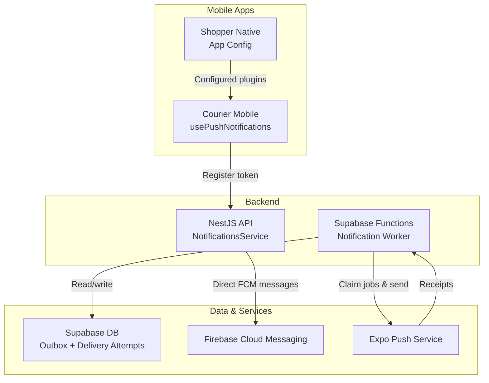
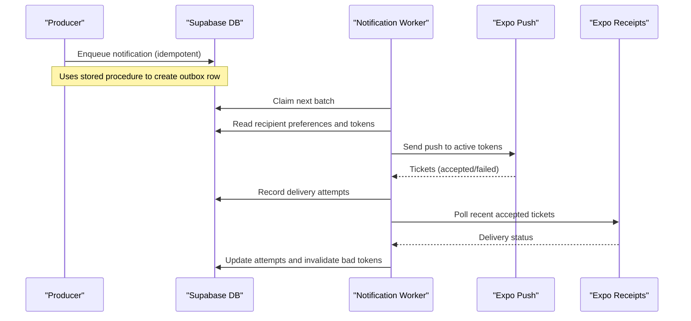
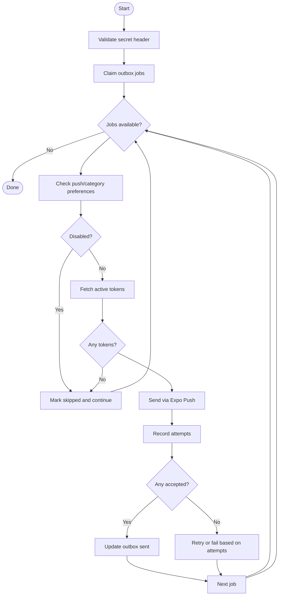
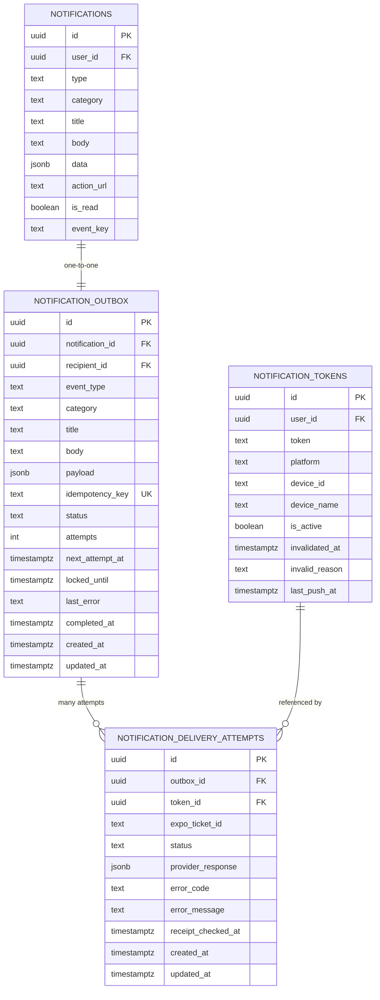
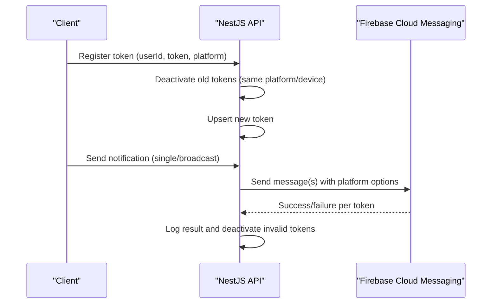
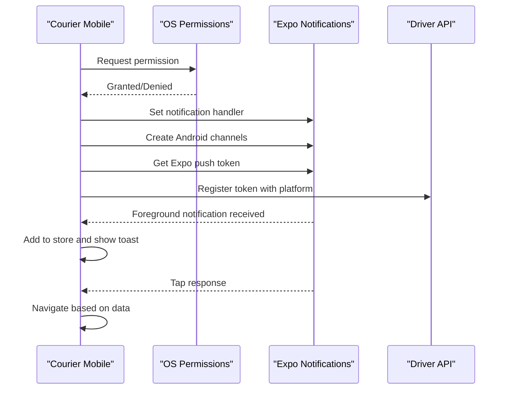
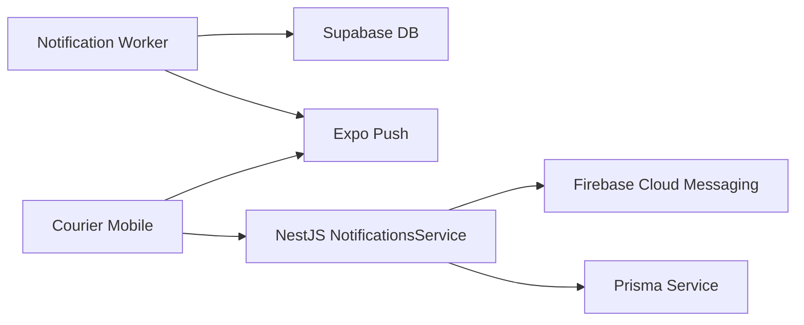

# Push Notifications System

<cite>
**Referenced Files in This Document**
- [index.ts](file://supabase/functions/notification-worker/index.ts)
- [20260713090000_notification_delivery_pipeline.sql](file://supabase/migrations/20260713090000_notification_delivery_pipeline.sql)
- [notifications.service.ts](file://apps/api/src/modules/notifications/notifications.service.ts)
- [usePushNotifications.ts](file://apps/courier-mobile/src/hooks/usePushNotifications.ts)
- [notification.store.ts](file://apps/courier-mobile/src/stores/notification.store.ts)
- [app.json](file://apps/shopper-native/app.json)
</cite>

## Table of Contents
1. [Introduction](#introduction)
2. [Project Structure](#project-structure)
3. [Core Components](#core-components)
4. [Architecture Overview](#architecture-overview)
5. [Detailed Component Analysis](#detailed-component-analysis)
6. [Dependency Analysis](#dependency-analysis)
7. [Performance Considerations](#performance-considerations)
8. [Troubleshooting Guide](#troubleshooting-guide)
9. [Conclusion](#conclusion)
10. [Appendices](#appendices)

## Introduction
This document explains the push notification system implemented across iOS and Android for the application. It covers Firebase Cloud Messaging (FCM) setup, token registration and management, notification types, worker service behavior, message routing, delivery guarantees, backend sending examples, app-side event handling, platform-specific configurations (Android channels and iOS categories), and testing strategies.

The system uses two complementary paths:
- A durable outbox-based pipeline backed by Supabase functions and database tables to deliver notifications via Expo Push with retry, idempotency, and receipt tracking.
- An optional direct FCM path via the NestJS API using Firebase Admin SDK for immediate or broadcast messaging.

## Project Structure
Key parts of the push notification system are distributed across:
- Backend API: Notification service that can send directly via FCM and manage tokens/logs.
- Serverless Worker: Supabase Edge Function that processes an outbox queue and sends via Expo Push with retries and receipts.
- Mobile Apps: React Native/Expo apps that register devices, handle permissions, set up channels/categories, and process incoming notifications.
- Database Schema: Migrations defining tables and stored procedures for durable delivery.

**Diagram sources**
- [usePushNotifications.ts:1-120](file://apps/courier-mobile/src/hooks/usePushNotifications.ts#L1-L120)
- [notifications.service.ts:1-229](file://apps/api/src/modules/notifications/notifications.service.ts#L1-L229)
- [index.ts:1-127](file://supabase/functions/notification-worker/index.ts#L1-L127)
- [20260713090000_notification_delivery_pipeline.sql:1-94](file://supabase/migrations/20260713090000_notification_delivery_pipeline.sql#L1-L94)
- [app.json:1-113](file://apps/shopper-native/app.json#L1-L113)

**Section sources**
- [usePushNotifications.ts:1-120](file://apps/courier-mobile/src/hooks/usePushNotifications.ts#L1-L120)
- [notifications.service.ts:1-229](file://apps/api/src/modules/notifications/notifications.service.ts#L1-L229)
- [index.ts:1-127](file://supabase/functions/notification-worker/index.ts#L1-L127)
- [20260713090000_notification_delivery_pipeline.sql:1-94](file://supabase/migrations/20260713090000_notification_delivery_pipeline.sql#L1-L94)
- [app.json:1-113](file://apps/shopper-native/app.json#L1-L113)

## Core Components
- Notification Outbox and Delivery Tracking
  - Tables store queued notifications, delivery attempts, and token status to ensure durability and observability.
  - Stored procedures enable safe claiming and batch enqueueing with idempotency keys.
- Supabase Notification Worker
  - Claims pending jobs, checks recipient preferences, resolves device tokens, sends via Expo Push, records attempts, and polls receipts to mark delivered or failed.
- NestJS Notifications Service
  - Initializes Firebase Admin SDK, registers tokens, and sends single or broadcast messages directly via FCM with platform-specific options.
- Mobile App Integration
  - Requests permissions, configures Android channels, sets foreground handlers, captures Expo push tokens, and routes taps to screens.

**Section sources**
- [20260713090000_notification_delivery_pipeline.sql:1-94](file://supabase/migrations/20260713090000_notification_delivery_pipeline.sql#L1-L94)
- [index.ts:1-127](file://supabase/functions/notification-worker/index.ts#L1-L127)
- [notifications.service.ts:1-229](file://apps/api/src/modules/notifications/notifications.service.ts#L1-L229)
- [usePushNotifications.ts:1-120](file://apps/courier-mobile/src/hooks/usePushNotifications.ts#L1-L120)

## Architecture Overview
The system provides two delivery mechanisms:

1) Durable Outbox via Supabase Worker
   - Producers enqueue notifications into a dedicated table with idempotency keys.
   - The worker claims batches, respects user preferences, sends via Expo Push, logs attempts, and updates status based on provider receipts.
   - Retries use exponential backoff; invalid tokens are invalidated automatically.

2) Direct FCM via NestJS API
   - The service initializes Firebase Admin SDK from environment variables.
   - It supports single-user, multi-user, and broadcast messaging with platform-specific payloads.
   - Invalid tokens are deactivated automatically on specific errors.

**Diagram sources**
- [20260713090000_notification_delivery_pipeline.sql:50-94](file://supabase/migrations/20260713090000_notification_delivery_pipeline.sql#L50-L94)
- [index.ts:37-127](file://supabase/functions/notification-worker/index.ts#L37-L127)

**Section sources**
- [index.ts:1-127](file://supabase/functions/notification-worker/index.ts#L1-L127)
- [20260713090000_notification_delivery_pipeline.sql:1-94](file://supabase/migrations/20260713090000_notification_delivery_pipeline.sql#L1-L94)

## Detailed Component Analysis

### Supabase Notification Worker
Responsibilities:
- Authenticate requests via secret header.
- Claim outbox jobs safely with locking and attempt counting.
- Respect per-user push preferences and category toggles.
- Resolve active device tokens and send via Expo Push with high priority and default sound.
- Persist delivery attempts and update outbox status based on acceptance and receipts.
- Invalidate tokens when providers report DeviceNotRegistered.

**Diagram sources**
- [index.ts:37-127](file://supabase/functions/notification-worker/index.ts#L37-L127)

**Section sources**
- [index.ts:1-127](file://supabase/functions/notification-worker/index.ts#L1-L127)

### Database Schema and Stored Procedures
Key elements:
- notification_outbox: durable queue with status transitions, idempotency key, and retry scheduling.
- notification_delivery_attempts: per-token delivery results and provider responses.
- notification_tokens: extended with invalidation fields and last push timestamps.
- enqueue_notification: idempotent enqueue with privilege checks and payload validation.
- claim_notification_outbox: lock-safe claim with SKIP LOCKED and attempt increment.
- enqueue_notification_batch: bulk enqueue with namespace-scoped idempotency.

**Diagram sources**
- [20260713090000_notification_delivery_pipeline.sql:1-94](file://supabase/migrations/20260713090000_notification_delivery_pipeline.sql#L1-L94)

**Section sources**
- [20260713090000_notification_delivery_pipeline.sql:1-94](file://supabase/migrations/20260713090000_notification_delivery_pipeline.sql#L1-L94)

### NestJS Notifications Service (FCM Path)
Capabilities:
- Initialize Firebase Admin SDK from environment variables.
- Register tokens with deactivation of older tokens per platform/device.
- Send single or multicast messages with platform-specific settings (Android channel, APNS priority).
- Log delivery outcomes and deactivate invalid tokens automatically.

**Diagram sources**
- [notifications.service.ts:30-229](file://apps/api/src/modules/notifications/notifications.service.ts#L30-L229)

**Section sources**
- [notifications.service.ts:1-229](file://apps/api/src/modules/notifications/notifications.service.ts#L1-L229)

### Mobile App Integration (Courier Mobile)
Features:
- Request notification permissions and configure Android channels for different importance levels.
- Capture Expo push token and persist it locally; register with backend API.
- Handle foreground notifications to display in-app toasts and add to local store.
- Route navigation on tap based on payload data (e.g., order details or screen targets).

**Diagram sources**
- [usePushNotifications.ts:1-120](file://apps/courier-mobile/src/hooks/usePushNotifications.ts#L1-L120)
- [notification.store.ts:1-72](file://apps/courier-mobile/src/stores/notification.store.ts#L1-L72)

**Section sources**
- [usePushNotifications.ts:1-120](file://apps/courier-mobile/src/hooks/usePushNotifications.ts#L1-L120)
- [notification.store.ts:1-72](file://apps/courier-mobile/src/stores/notification.store.ts#L1-L72)

### Platform-Specific Configuration
- Android Channels
  - The mobile hook creates channels such as “default” and “orders” with appropriate importance and vibration patterns.
  - The worker includes a channelId field in its Expo payload to route to the correct channel.
- iOS Categories and Settings
  - The shopper native app configures Expo notifications plugin with color and other build properties.
  - Ensure APNS credentials are configured in your Expo/Firebase setup for background delivery and rich media.

**Section sources**
- [usePushNotifications.ts:51-68](file://apps/courier-mobile/src/hooks/usePushNotifications.ts#L51-L68)
- [index.ts:66-70](file://supabase/functions/notification-worker/index.ts#L66-L70)
- [app.json:91-96](file://apps/shopper-native/app.json#L91-L96)

## Dependency Analysis
- Worker depends on:
  - Supabase client for reading profiles, tokens, and updating outbox/attempts.
  - Expo Push endpoints for sending and retrieving receipts.
  - Environment variables for secrets and credentials.
- NestJS service depends on:
  - Firebase Admin SDK initialized from environment variables.
  - Prisma service for token and log persistence.
- Mobile apps depend on:
  - Expo Notifications for permissions, channels, and token retrieval.
  - Local state stores for in-app notification history.

**Diagram sources**
- [index.ts:1-127](file://supabase/functions/notification-worker/index.ts#L1-L127)
- [notifications.service.ts:1-229](file://apps/api/src/modules/notifications/notifications.service.ts#L1-L229)
- [usePushNotifications.ts:1-120](file://apps/courier-mobile/src/hooks/usePushNotifications.ts#L1-L120)

**Section sources**
- [index.ts:1-127](file://supabase/functions/notification-worker/index.ts#L1-L127)
- [notifications.service.ts:1-229](file://apps/api/src/modules/notifications/notifications.service.ts#L1-L229)
- [usePushNotifications.ts:1-120](file://apps/courier-mobile/src/hooks/usePushNotifications.ts#L1-L120)

## Performance Considerations
- Batch Processing
  - Worker claims batches up to a configurable limit to reduce overhead.
  - NestJS service chunks multicast messages to avoid large payloads.
- Idempotency
  - Outbox rows use unique idempotency keys to prevent duplicate deliveries.
- Retry Strategy
  - Exponential backoff with capped intervals ensures resilience against transient failures.
- Token Management
  - Inactive or invalid tokens are pruned to minimize wasted sends.
- Preferences Filtering
  - Early skip for users who disabled push or specific categories reduces unnecessary work.

[No sources needed since this section provides general guidance]

## Troubleshooting Guide
Common issues and resolutions:
- No Active Tokens
  - If no active tokens exist for a recipient, the worker marks the job as skipped. Ensure the app registers tokens after login and on device changes.
- Device Not Registered
  - When Expo reports DeviceNotRegistered, the worker invalidates the token. Re-register the token on the next app launch.
- Permission Denied
  - On Android/iOS, if permissions are denied, the app cannot receive notifications. Prompt users to enable notifications in settings.
- Firebase Credentials Missing
  - If Firebase Admin SDK is not initialized due to missing environment variables, direct FCM sends will be disabled. Verify configuration.
- Receipt Failures
  - Receipt polling may occasionally fail; the worker retries on subsequent runs. Monitor delivery attempts for persistent errors.

**Section sources**
- [index.ts:47-127](file://supabase/functions/notification-worker/index.ts#L47-L127)
- [notifications.service.ts:30-48](file://apps/api/src/modules/notifications/notifications.service.ts#L30-L48)
- [usePushNotifications.ts:31-49](file://apps/courier-mobile/src/hooks/usePushNotifications.ts#L31-L49)

## Conclusion
The push notification system combines a durable outbox-based worker for reliable delivery via Expo Push with an optional direct FCM path for immediate messaging. It enforces idempotency, respects user preferences, tracks delivery attempts, and handles platform-specific requirements. Mobile apps integrate seamlessly by managing permissions, channels, and in-app notification flows. Together, these components provide robust, scalable, and observable push notifications across iOS and Android.

[No sources needed since this section summarizes without analyzing specific files]

## Appendices

### Notification Types and Routing
- Order Updates
  - Use event types and categories to differentiate order lifecycle events. Include action URLs or identifiers in payload to navigate to relevant screens.
- Delivery Status
  - High-priority messages with appropriate channels ensure timely visibility for drivers and customers.
- Promotional Messages
  - Category toggles allow users to opt-in/out of marketing-related notifications.
- System Alerts
  - Critical alerts should use higher importance channels and minimal payload to maximize reach.

[No sources needed since this section provides general guidance]

### Examples: Sending Notifications from the Backend
- Using Supabase Outbox
  - Call the stored procedure to enqueue a notification with an idempotency key. The worker will process and deliver it reliably.
- Using NestJS Notifications Service
  - Invoke methods to send to a single user, multiple users, or broadcast to all. Platform-specific options are applied automatically.

[No sources needed since this section provides general guidance]

### Handling Notification Events in the App
- Foreground Handling
  - Configure a notification handler to display in-app toasts and update local stores.
- Background/Killed State
  - Use payload data to navigate to specific screens upon tap. Ensure deep links or route names are included in the payload.

**Section sources**
- [usePushNotifications.ts:89-111](file://apps/courier-mobile/src/hooks/usePushNotifications.ts#L89-L111)
- [notification.store.ts:26-72](file://apps/courier-mobile/src/stores/notification.store.ts#L26-L72)

### Managing Notification Preferences
- User-Level Controls
  - Allow users to toggle push globally and per category. The worker checks these preferences before sending.
- Storage and Sync
  - Persist preferences locally and sync with backend to ensure consistency across devices.

[No sources needed since this section provides general guidance]

### Testing Notification Delivery
- Unit Tests
  - Mock Expo Push and receipt endpoints to validate worker logic for retries and invalidation.
- Integration Tests
  - Enqueue test notifications and verify outbox transitions and delivery attempts.
- Device Testing
  - Test on physical devices to confirm permissions, channels, and routing behavior. Validate both foreground and background scenarios.

[No sources needed since this section provides general guidance]