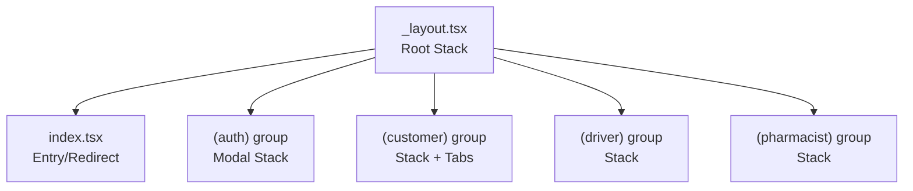
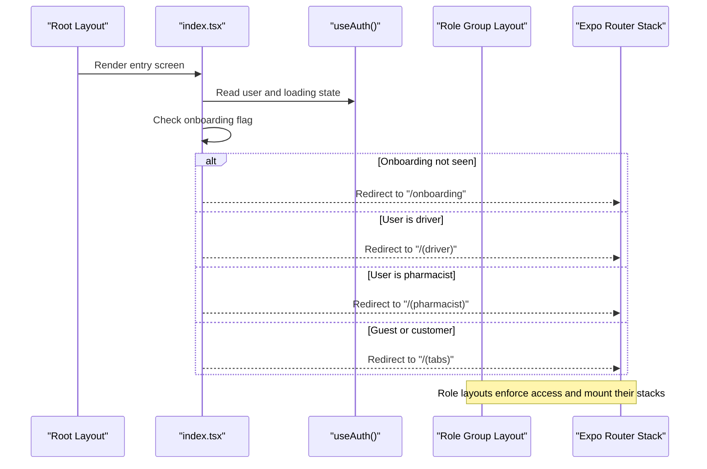
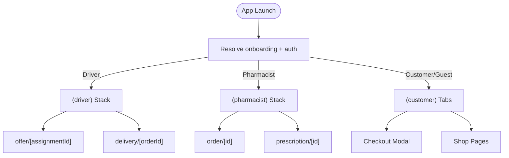

# Navigation & Routing

<cite>
**Referenced Files in This Document**
- [apps/shopper-native/app/_layout.tsx](file://apps/shopper-native/app/_layout.tsx)
- [apps/shopper-native/app/index.tsx](file://apps/shopper-native/app/index.tsx)
- [apps/shopper-native/app/(auth)/_layout.tsx](file://apps/shopper-native/app/(auth)/_layout.tsx)
- [apps/shopper-native/app/(customer)/_layout.tsx](file://apps/shopper-native/app/(customer)/_layout.tsx)
- [apps/shopper-native/app/(driver)/_layout.tsx](file://apps/shopper-native/app/(driver)/_layout.tsx)
- [apps/shopper-native/app/(pharmacist)/_layout.tsx](file://apps/shopper-native/app/(pharmacist)/_layout.tsx)
- [apps/shopper-native/app/(customer)/(tabs)/_layout.tsx](file://apps/shopper-native/app/(customer)/(tabs)/_layout.tsx)
</cite>

## Table of Contents
1. Introduction
2. Project Structure
3. Core Components
4. Architecture Overview
5. Detailed Component Analysis
6. Dependency Analysis
7. Performance Considerations
8. Troubleshooting Guide
9. Conclusion
10. Appendices

## Introduction
This document explains the navigation and routing system built with Expo Router for the shopper-native application. It covers file-based routing, route groups by user role (customer, driver, pharmacist), nested navigation patterns, modal presentations, deep linking, authentication guards, role-based routing, dynamic parameters, programmatic navigation, transitions, platform-specific behaviors, back handling, and performance optimization. It also provides guidelines for adding new routes and organizing navigation hierarchies.

## Project Structure
The app uses Expo Router’s file-based routing under apps/shopper-native/app. Route groups are organized by role:
- (auth): Authentication flows presented as a modal stack
- (customer): Customer experience with nested tabs and sub-groups
- (driver): Driver-only routes with role guard and dynamic parameters
- (pharmacist): Pharmacist workbench with role guard and dynamic parameters

The root layout defines the global Stack navigator and registers all top-level screens and route groups. The entry screen decides the initial target based on onboarding state and authenticated user role.

**Diagram sources**
- [apps/shopper-native/app/_layout.tsx:179-226](file://apps/shopper-native/app/_layout.tsx#L179-L226)
- [apps/shopper-native/app/index.tsx:10-52](file://apps/shopper-native/app/index.tsx#L10-L52)
- [apps/shopper-native/app/(auth)/_layout.tsx:4-11](file://apps/shopper-native/app/(auth)/_layout.tsx#L4-L11)
- [apps/shopper-native/app/(customer)/_layout.tsx:4-13](file://apps/shopper-native/app/(customer)/_layout.tsx#L4-L13)
- [apps/shopper-native/app/(driver)/_layout.tsx:14-39](file://apps/shopper-native/app/(driver)/_layout.tsx#L14-L39)
- [apps/shopper-native/app/(pharmacist)/_layout.tsx:27-68](file://apps/shopper-native/app/(pharmacist)/_layout.tsx#L27-L68)

**Section sources**
- [apps/shopper-native/app/_layout.tsx:179-226](file://apps/shopper-native/app/_layout.tsx#L179-L226)
- [apps/shopper-native/app/index.tsx:10-52](file://apps/shopper-native/app/index.tsx#L10-L52)

## Core Components
- Root Stack: Defines global screens and route groups with consistent animations and presentation modes.
- Entry Redirect: Determines initial route based on onboarding status and user role; redirects to the appropriate group.
- Role Guards: Each role-specific layout validates the current user and redirects unauthorized users.
- Nested Tabs: Customer group includes a tabbed interface with custom tab bar and badges.
- Modal Presentation: Auth flows are presented modally with slide-from-bottom animation.

Key responsibilities:
- Centralized navigation configuration at the root
- Role-based access enforcement per group
- Consistent transition styles across stacks
- Deep link support via route names and dynamic segments

**Section sources**
- [apps/shopper-native/app/_layout.tsx:179-226](file://apps/shopper-native/app/_layout.tsx#L179-L226)
- [apps/shopper-native/app/index.tsx:10-52](file://apps/shopper-native/app/index.tsx#L10-L52)
- [apps/shopper-native/app/(auth)/_layout.tsx:4-11](file://apps/shopper-native/app/(auth)/_layout.tsx#L4-L11)
- [apps/shopper-native/app/(customer)/_layout.tsx:4-13](file://apps/shopper-native/app/(customer)/_layout.tsx#L4-L13)
- [apps/shopper-native/app/(driver)/_layout.tsx:14-39](file://apps/shopper-native/app/(driver)/_layout.tsx#L14-L39)
- [apps/shopper-native/app/(pharmacist)/_layout.tsx:27-68](file://apps/shopper-native/app/(pharmacist)/_layout.tsx#L27-L68)
- [apps/shopper-native/app/(customer)/(tabs)/_layout.tsx:434-492](file://apps/shopper-native/app/(customer)/(tabs)/_layout.tsx#L434-L492)

## Architecture Overview
The navigation architecture centers around a root Stack that mounts role-based route groups. The entry screen resolves the initial route using local storage and auth state. Each role group enforces access control and configures its own Stack or Tabs. Dynamic parameters are used for order and prescription details.

**Diagram sources**
- [apps/shopper-native/app/_layout.tsx:179-226](file://apps/shopper-native/app/_layout.tsx#L179-L226)
- [apps/shopper-native/app/index.tsx:10-52](file://apps/shopper-native/app/index.tsx#L10-L52)
- [apps/shopper-native/app/(driver)/_layout.tsx:14-39](file://apps/shopper-native/app/(driver)/_layout.tsx#L14-L39)
- [apps/shopper-native/app/(pharmacist)/_layout.tsx:27-68](file://apps/shopper-native/app/(pharmacist)/_layout.tsx#L27-L68)

## Detailed Component Analysis

### Root Layout and Global Stack
- Registers top-level screens and route groups
- Applies consistent header and animation settings
- Integrates push notifications and cart error UIs
- Wraps providers for theme, auth, language, and query persistence

Best practices:
- Keep global side effects (notifications, network bridge) in root
- Use minimal options in root stack to avoid unnecessary re-renders
- Ensure splash screen hides after fonts load and providers mount

**Section sources**
- [apps/shopper-native/app/_layout.tsx:179-226](file://apps/shopper-native/app/_layout.tsx#L179-L226)
- [apps/shopper-native/app/_layout.tsx:230-290](file://apps/shopper-native/app/_layout.tsx#L230-L290)

### Entry Screen and Role-Based Redirect
- Reads onboarding preference from storage
- Waits for auth loading before redirecting
- Routes drivers to (driver), pharmacists to (pharmacist), others to customer tabs or onboarding

Guidelines:
- Always guard against flashing intermediate routes by waiting for both onboarding and auth
- Use explicit targets to prevent accidental exposure of restricted sections

**Section sources**
- [apps/shopper-native/app/index.tsx:10-52](file://apps/shopper-native/app/index.tsx#L10-L52)

### Authentication Group (Modal Stack)
- Presents login/register flows as a modal stack with slide-from-bottom animation
- No headers; focuses on form interactions

Usage:
- Navigate to this group when unauthenticated or when switching accounts
- Use modal presentation to keep context behind forms

**Section sources**
- [apps/shopper-native/app/(auth)/_layout.tsx:4-11](file://apps/shopper-native/app/(auth)/_layout.tsx#L4-L11)

### Customer Group (Nested Tabs and Sub-Groups)
- Stack includes tabs, checkout modal, and feature pages
- Tabs layout defines a custom bottom tab bar with badges and haptics
- Redirects non-customer roles away from tabs if needed

Patterns:
- Use modal presentation for checkout to preserve context
- Keep tabs focused on core shopping flow; map secondary features as stack screens
- Badge updates reflect real-time state (cart count, unread notifications)

**Section sources**
- [apps/shopper-native/app/(customer)/_layout.tsx:4-13](file://apps/shopper-native/app/(customer)/_layout.tsx#L4-L13)
- [apps/shopper-native/app/(customer)/(tabs)/_layout.tsx:434-492](file://apps/shopper-native/app/(customer)/(tabs)/_layout.tsx#L434-L492)

### Driver Group (Role Guard and Dynamic Routes)
- Validates user role and redirects unauthorized users to customer tabs
- Mounts driver-specific realtime sync once per session
- Declares dynamic routes for offers, deliveries, and issues

Dynamic parameters:
- offer/[assignmentId]
- delivery/[orderId]
- issue/[orderId]

**Section sources**
- [apps/shopper-native/app/(driver)/_layout.tsx:14-39](file://apps/shopper-native/app/(driver)/_layout.tsx#L14-L39)

### Pharmacist Group (Role Guard and Workbench)
- Validates user role (pharmacist, admin, manager) and redirects unauthorized users
- Mounts pharmacist-specific realtime sync once per session
- Declares dynamic routes for orders and prescriptions

Dynamic parameters:
- order/[id]
- prescription/[id]

**Section sources**
- [apps/shopper-native/app/(pharmacist)/_layout.tsx:27-68](file://apps/shopper-native/app/(pharmacist)/_layout.tsx#L27-L68)

### Nested Navigation Patterns
- Route groups isolate role-specific experiences
- Nested stacks within groups provide hierarchical navigation
- Tabs inside customer group encapsulate primary workflows
- Modals overlay content for focused tasks (e.g., checkout, auth)

**Diagram sources**
- [apps/shopper-native/app/index.tsx:10-52](file://apps/shopper-native/app/index.tsx#L10-L52)
- [apps/shopper-native/app/(customer)/_layout.tsx:4-13](file://apps/shopper-native/app/(customer)/_layout.tsx#L4-L13)
- [apps/shopper-native/app/(driver)/_layout.tsx:14-39](file://apps/shopper-native/app/(driver)/_layout.tsx#L14-L39)
- [apps/shopper-native/app/(pharmacist)/_layout.tsx:27-68](file://apps/shopper-native/app/(pharmacist)/_layout.tsx#L27-L68)

## Dependency Analysis
Navigation depends on:
- Auth state for role resolution and guards
- Realtime hooks mounted in role layouts for live updates
- Tab bar dependencies for badges and haptics
- Platform APIs for status bar and safe areas

Coupling:
- Role layouts depend on auth and feature-specific hooks
- Tabs layout depends on notification and cart stores for badges
- Root layout integrates global services (notifications, network, language)

Potential circularities:
- Avoid importing navigation utilities directly into role guards; rely on Expo Router’s Redirect and Stack.Screen declarations

External integrations:
- Push notifications trigger navigation via action URLs
- Offline queue runner and crash enrichment run at root

**Section sources**
- [apps/shopper-native/app/_layout.tsx:109-151](file://apps/shopper-native/app/_layout.tsx#L109-L151)
- [apps/shopper-native/app/(driver)/_layout.tsx:14-39](file://apps/shopper-native/app/(driver)/_layout.tsx#L14-L39)
- [apps/shopper-native/app/(pharmacist)/_layout.tsx:27-68](file://apps/shopper-native/app/(pharmacist)/_layout.tsx#L27-L68)
- [apps/shopper-native/app/(customer)/(tabs)/_layout.tsx:313-430](file://apps/shopper-native/app/(customer)/(tabs)/_layout.tsx#L313-L430)

## Performance Considerations
- Minimize re-renders in root stack by keeping options simple and avoiding heavy computations in screenOptions
- Use route groups to isolate rendering contexts per role
- Prefer lazy mounting for non-tab routes; keep only active tabs mounted
- Use single realtime hook instances per role layout to avoid duplicate channels
- Optimize tab bar animations and badge updates to reduce jank
- Defer heavy initialization until after splash screen hides

[No sources needed since this section provides general guidance]

## Troubleshooting Guide
Common issues and resolutions:
- Flash of wrong route on launch: Ensure entry waits for both onboarding and auth before redirecting
- Unauthorized access to role groups: Verify role guards in each group layout redirect appropriately
- Deep links not working: Confirm route names and dynamic segments match Stack.Screen declarations
- Modal not closing: Ensure proper navigation actions close modals or reset stacks
- Back button behavior: Rely on Expo Router’s default back handling; avoid intercepting unless necessary

Debugging tips:
- Log role and loading states in role layouts during development
- Validate route names and params in deep links
- Test on both web and native platforms due to differences in navigation behavior

**Section sources**
- [apps/shopper-native/app/index.tsx:10-52](file://apps/shopper-native/app/index.tsx#L10-L52)
- [apps/shopper-native/app/(driver)/_layout.tsx:14-39](file://apps/shopper-native/app/(driver)/_layout.tsx#L14-L39)
- [apps/shopper-native/app/(pharmacist)/_layout.tsx:27-68](file://apps/shopper-native/app/(pharmacist)/_layout.tsx#L27-L68)

## Conclusion
The navigation system leverages Expo Router’s file-based routing and route groups to deliver a clear separation between customer, driver, and pharmacist experiences. Role guards ensure secure access, while nested stacks and tabs provide intuitive navigation. Dynamic parameters enable deep linking to specific resources. Following the guidelines in this document will help maintain consistency, performance, and scalability as the app evolves.

[No sources needed since this section summarizes without analyzing specific files]

## Appendices

### Adding New Routes
Steps:
- Create a new file under the appropriate route group (e.g., (customer), (driver), (pharmacist))
- If it belongs to a nested group, create a folder and index file accordingly
- Register the route in the group’s _layout.tsx using Stack.Screen or Tabs.Screen
- For dynamic routes, use bracket notation (e.g., [id])
- Add any required role checks in the group layout if the route should be restricted

Best practices:
- Keep route names concise and descriptive
- Use consistent animations and presentation modes per group
- Avoid deep nesting beyond what is necessary for clarity

**Section sources**
- [apps/shopper-native/app/(customer)/_layout.tsx:4-13](file://apps/shopper-native/app/(customer)/_layout.tsx#L4-L13)
- [apps/shopper-native/app/(driver)/_layout.tsx:14-39](file://apps/shopper-native/app/(driver)/_layout.tsx#L14-L39)
- [apps/shopper-native/app/(pharmacist)/_layout.tsx:27-68](file://apps/shopper-native/app/(pharmacist)/_layout.tsx#L27-L68)

### Programmatic Navigation Examples
- Navigate to a route group: Use Redirect or router.push with the group path
- Open a modal: Navigate to the (auth) group which is configured as a modal stack
- Go back: Use standard back actions; Expo Router handles platform differences
- Pass parameters: Use dynamic segments in route names and read them in the target screen

Platform notes:
- Web may handle history differently; test deep links and back behavior on web
- Native platforms respect swipe-to-go-back and hardware back buttons

**Section sources**
- [apps/shopper-native/app/_layout.tsx:179-226](file://apps/shopper-native/app/_layout.tsx#L179-L226)
- [apps/shopper-native/app/(auth)/_layout.tsx:4-11](file://apps/shopper-native/app/(auth)/_layout.tsx#L4-L11)