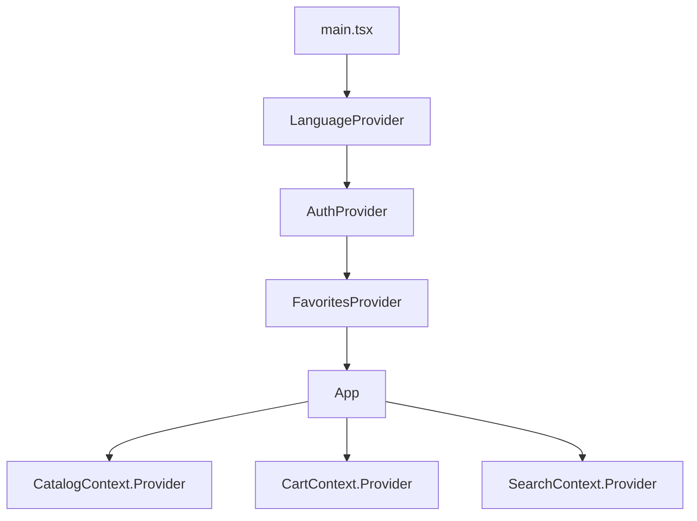
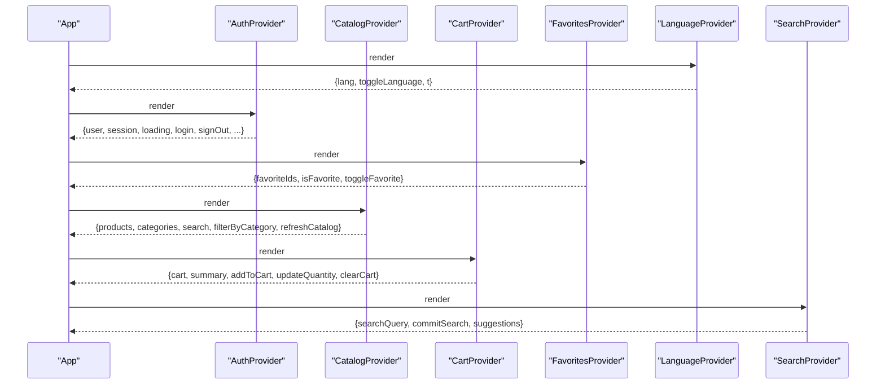
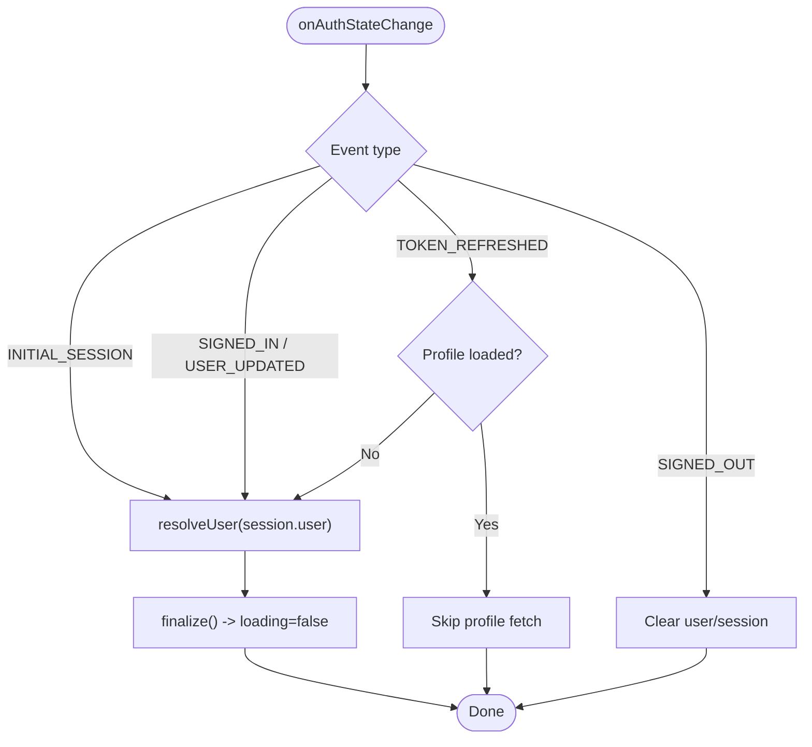
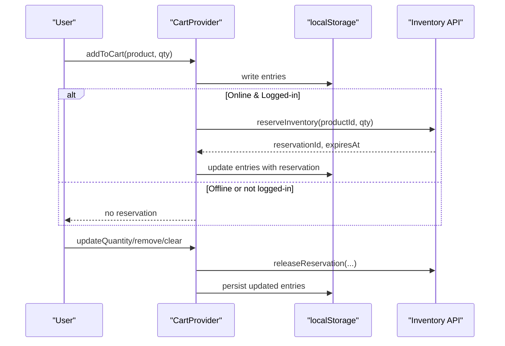
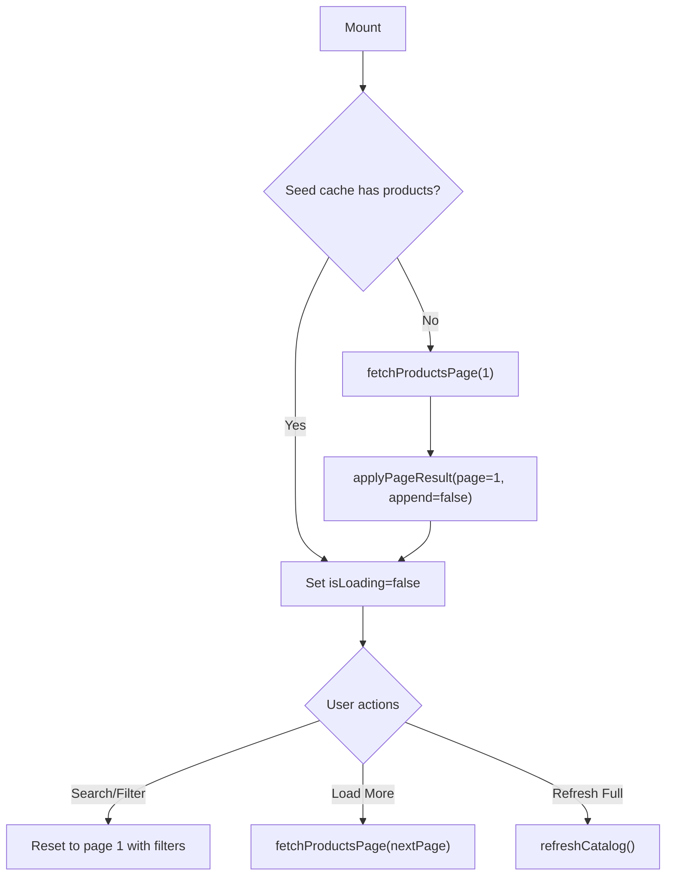
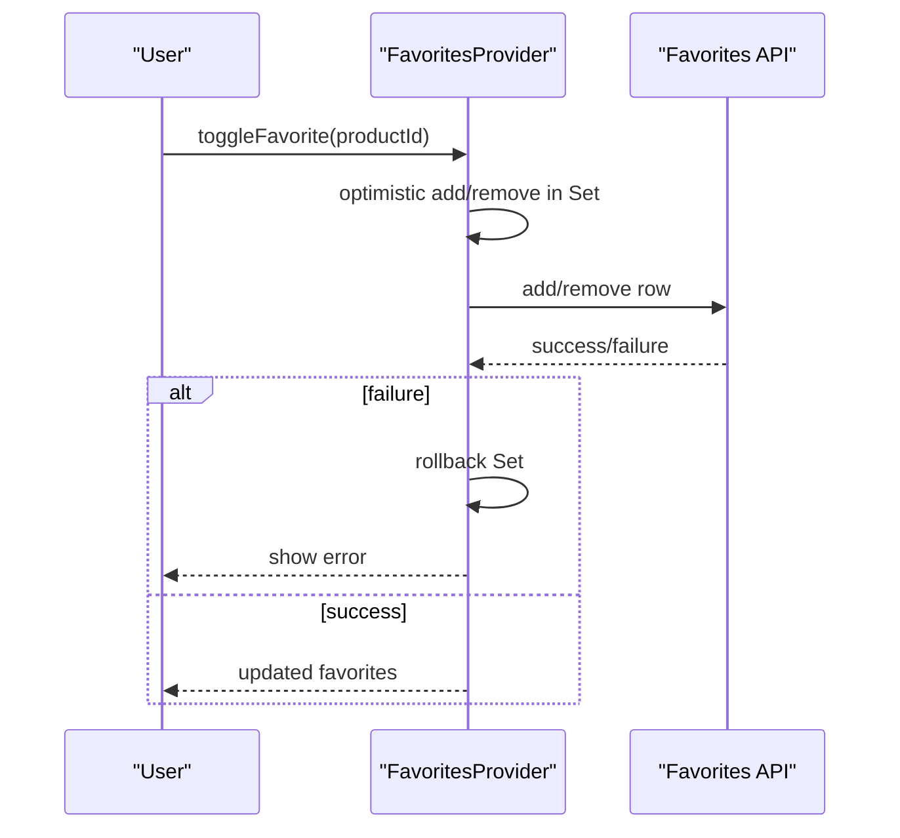
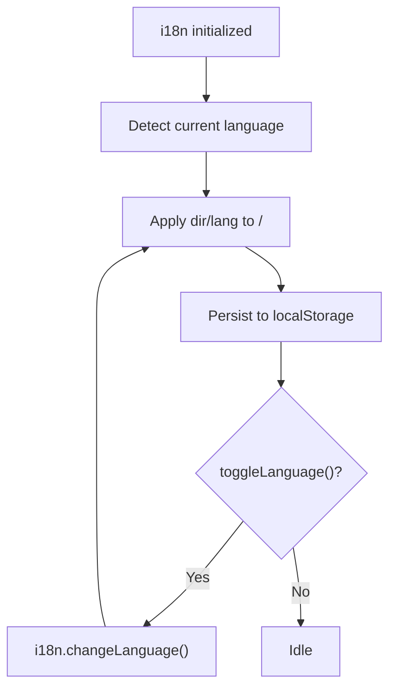
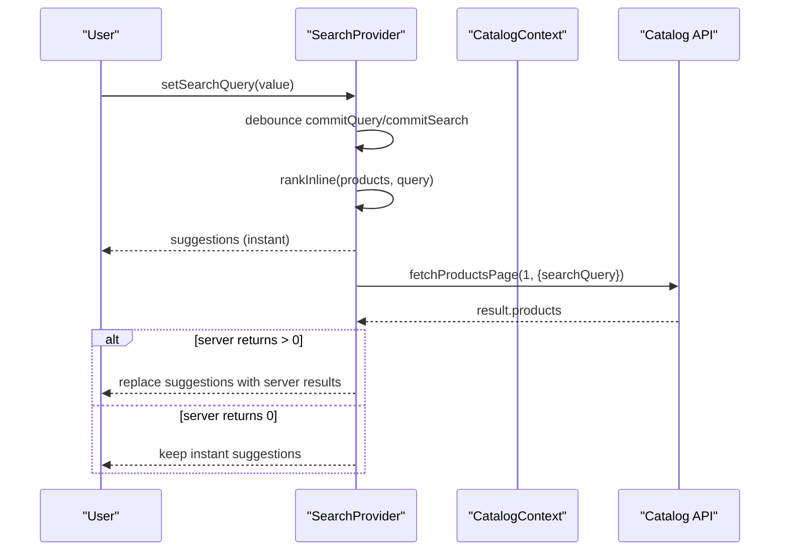
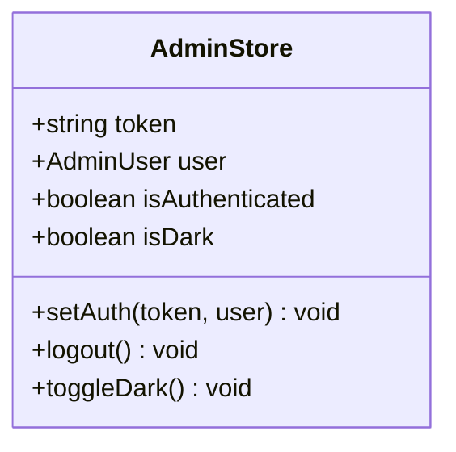
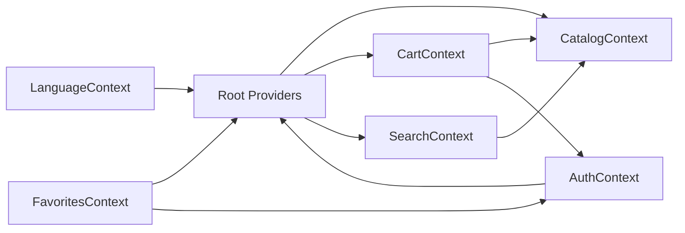

# Context Providers

<cite>
**Referenced Files in This Document**
- [main.tsx](file://apps/shopper-web/src/main.tsx)
- [AuthContext.tsx](file://apps/shopper-web/src/contexts/AuthContext.tsx)
- [CartContext.tsx](file://apps/shopper-web/src/contexts/CartContext.tsx)
- [CatalogContext.tsx](file://apps/shopper-web/src/contexts/CatalogContext.tsx)
- [FavoritesContext.tsx](file://apps/shopper-web/src/contexts/FavoritesContext.tsx)
- [LanguageContext.tsx](file://apps/shopper-web/src/contexts/LanguageContext.tsx)
- [SearchContext.tsx](file://apps/shopper-web/src/contexts/SearchContext.tsx)
- [admin.store.ts](file://apps/admin/src/stores/admin.store.ts)
</cite>

## Table of Contents
1. Introduction
2. Project Structure
3. Core Components
4. Architecture Overview
5. Detailed Component Analysis
6. Dependency Analysis
7. Performance Considerations
8. Troubleshooting Guide
9. Conclusion

## Introduction
This document explains the React Context providers used for global UI state and application-wide concerns in the shopper web application, with a focus on authentication, cart, catalog, favorites, language, and search. It also documents composition patterns, performance techniques (React.memo and useMemo), and best practices to avoid unnecessary re-renders. Where relevant, it contrasts these with the admin app’s Zustand-based store for theme and auth.

## Project Structure
The shopper web app composes multiple providers at the root to share state across the tree:
- LanguageProvider wraps i18n and exposes language direction and translation helpers.
- AuthProvider manages user session, roles, and status, including realtime role/status updates.
- FavoritesProvider synchronizes per-user favorites with optimistic updates and error rollback.
- CatalogContext provides paginated product data, categories, and full-catalog access for admin pages.
- CartContext persists cart items locally, inflates them with product data, and reserves inventory.
- SearchContext coordinates input, URL sync, and server-backed suggestions with instant local ranking.

**Diagram sources**
- [main.tsx:42-58](file://apps/shopper-web/src/main.tsx#L42-L58)

**Section sources**
- [main.tsx:42-58](file://apps/shopper-web/src/main.tsx#L42-L58)

## Core Components
- Authentication context: Session lifecycle, profile resolution, role/status checks, realtime propagation, and sign-out flows.
- Cart context: Local persistence, product inflation, inventory reservation/release, and summary computation.
- Catalog context: Page-1 fast load, server pagination, category loading, optional full-catalog refresh, and derived metrics.
- Favorites context: Per-user favorite set with optimistic updates and network error rollback.
- Language context: i18n integration, RTL/LTR direction, and persisted language preference.
- Search context: Debounced input, URL synchronization, instant local ranking, and server-backed suggestions.

**Section sources**
- [AuthContext.tsx:245-730](file://apps/shopper-web/src/contexts/AuthContext.tsx#L245-L730)
- [CartContext.tsx:197-555](file://apps/shopper-web/src/contexts/CartContext.tsx#L197-L555)
- [CatalogContext.tsx:117-466](file://apps/shopper-web/src/contexts/CatalogContext.tsx#L117-L466)
- [FavoritesContext.tsx:24-121](file://apps/shopper-web/src/contexts/FavoritesContext.tsx#L24-L121)
- [LanguageContext.tsx:22-55](file://apps/shopper-web/src/contexts/LanguageContext.tsx#L22-L55)
- [SearchContext.tsx:146-400](file://apps/shopper-web/src/contexts/SearchContext.tsx#L146-L400)

## Architecture Overview
The provider hierarchy ensures that consumers can access shared state without prop drilling. Consumers subscribe only to the slices they need via custom hooks, minimizing re-renders.

**Diagram sources**
- [main.tsx:42-58](file://apps/shopper-web/src/main.tsx#L42-L58)
- [AuthContext.tsx:697-730](file://apps/shopper-web/src/contexts/AuthContext.tsx#L697-L730)
- [CatalogContext.tsx:434-466](file://apps/shopper-web/src/contexts/CatalogContext.tsx#L434-L466)
- [CartContext.tsx:539-555](file://apps/shopper-web/src/contexts/CartContext.tsx#L539-L555)
- [FavoritesContext.tsx:109-121](file://apps/shopper-web/src/contexts/FavoritesContext.tsx#L109-L121)
- [LanguageContext.tsx:42-55](file://apps/shopper-web/src/contexts/LanguageContext.tsx#L42-L55)
- [SearchContext.tsx:393-400](file://apps/shopper-web/src/contexts/SearchContext.tsx#L393-L400)

## Detailed Component Analysis

### Authentication Context
Responsibilities:
- Manage Supabase session events and resolve user profiles with timeouts and background retries.
- Enforce account status (Active/Inactive/Suspended) and redirect or force sign-out when needed.
- Subscribe to realtime profile changes to reflect role/status updates immediately.
- Expose typed actions (login, register, loginWithGoogle, signOut, refreshProfile) and derived booleans (isAdmin, isStaff, etc.).

Key implementation highlights:
- Uses refs to avoid stale closures in realtime handlers and to reference latest callbacks safely.
- Wraps profile fetches with timeouts to prevent indefinite blocking during cold starts.
- Emits localized toast messages and navigates using window.location from the provider scope.

**Diagram sources**
- [AuthContext.tsx:313-389](file://apps/shopper-web/src/contexts/AuthContext.tsx#L313-L389)
- [AuthContext.tsx:262-304](file://apps/shopper-web/src/contexts/AuthContext.tsx#L262-L304)

**Section sources**
- [AuthContext.tsx:114-130](file://apps/shopper-web/src/contexts/AuthContext.tsx#L114-L130)
- [AuthContext.tsx:245-730](file://apps/shopper-web/src/contexts/AuthContext.tsx#L245-L730)

### Cart Context
Responsibilities:
- Persist cart entries to localStorage and inflate them into CartItem objects using catalog data.
- Reserve inventory for logged-in users online and release reservations on quantity changes or removals.
- Compute cart summary via pricing utilities.

Performance considerations:
- Uses useMemo for merged product maps and inflated cart to avoid recomputation.
- Guards against overwriting stored entries before product data is available to prevent data loss.

**Diagram sources**
- [CartContext.tsx:414-527](file://apps/shopper-web/src/contexts/CartContext.tsx#L414-L527)
- [CartContext.tsx:273-358](file://apps/shopper-web/src/contexts/CartContext.tsx#L273-L358)
- [CartContext.tsx:364-388](file://apps/shopper-web/src/contexts/CartContext.tsx#L364-L388)

**Section sources**
- [CartContext.tsx:14-68](file://apps/shopper-web/src/contexts/CartContext.tsx#L14-L68)
- [CartContext.tsx:197-555](file://apps/shopper-web/src/contexts/CartContext.tsx#L197-L555)

### Catalog Context
Responsibilities:
- Load page-1 products quickly on mount; categories are refreshed from the database.
- Provide server-side pagination, search, and filtering.
- Optionally load the full catalog snapshot for admin features.

Performance considerations:
- Uses startTransition for batched state updates.
- Derives categories and metrics with useMemo to minimize recalculations.
- Avoids auto-loading the full catalog to prevent heavy initial payloads.

**Diagram sources**
- [CatalogContext.tsx:186-222](file://apps/shopper-web/src/contexts/CatalogContext.tsx#L186-L222)
- [CatalogContext.tsx:244-332](file://apps/shopper-web/src/contexts/CatalogContext.tsx#L244-L332)

**Section sources**
- [CatalogContext.tsx:55-103](file://apps/shopper-web/src/contexts/CatalogContext.tsx#L55-L103)
- [CatalogContext.tsx:117-466](file://apps/shopper-web/src/contexts/CatalogContext.tsx#L117-L466)

### Favorites Context
Responsibilities:
- Maintain a Set of favorite product IDs per authenticated customer.
- Perform optimistic updates and rollback on failure.
- Sync favorites from the server on mount when the user is eligible.

**Diagram sources**
- [FavoritesContext.tsx:68-107](file://apps/shopper-web/src/contexts/FavoritesContext.tsx#L68-L107)

**Section sources**
- [FavoritesContext.tsx:14-22](file://apps/shopper-web/src/contexts/FavoritesContext.tsx#L14-L22)
- [FavoritesContext.tsx:24-121](file://apps/shopper-web/src/contexts/FavoritesContext.tsx#L24-L121)

### Language Context
Responsibilities:
- Bridge react-i18next to expose a stable translation function and language toggling.
- Persist language preference and apply RTL/LTR direction to DOM elements.

**Diagram sources**
- [LanguageContext.tsx:22-55](file://apps/shopper-web/src/contexts/LanguageContext.tsx#L22-L55)

**Section sources**
- [LanguageContext.tsx:12-20](file://apps/shopper-web/src/contexts/LanguageContext.tsx#L12-L20)
- [LanguageContext.tsx:22-55](file://apps/shopper-web/src/contexts/LanguageContext.tsx#L22-L55)

### Search Context
Responsibilities:
- Manage input state, debounced commits, and URL synchronization for search queries.
- Provide instant local suggestions by ranking currently loaded products.
- Debounce and execute server-side search, merging results while preserving instant matches.

**Diagram sources**
- [SearchContext.tsx:169-207](file://apps/shopper-web/src/contexts/SearchContext.tsx#L169-L207)
- [SearchContext.tsx:305-368](file://apps/shopper-web/src/contexts/SearchContext.tsx#L305-L368)

**Section sources**
- [SearchContext.tsx:20-61](file://apps/shopper-web/src/contexts/SearchContext.tsx#L20-L61)
- [SearchContext.tsx:146-400](file://apps/shopper-web/src/contexts/SearchContext.tsx#L146-L400)

### Theme Provider (Admin App)
The admin app uses a Zustand store to manage authentication and theme state, including dark mode toggling and persistence.

**Diagram sources**
- [admin.store.ts:12-45](file://apps/admin/src/stores/admin.store.ts#L12-L45)

**Section sources**
- [admin.store.ts:1-46](file://apps/admin/src/stores/admin.store.ts#L1-46)

## Dependency Analysis
- main.tsx composes LanguageProvider, AuthProvider, and FavoritesProvider at the root.
- Feature contexts (Catalog, Cart, Search) are typically mounted within route shells or feature boundaries to limit their scope and reduce re-renders.
- Cross-context dependencies:
  - CartContext depends on CatalogContext for product inflation and on AuthContext for user-driven reservations.
  - FavoritesContext depends on AuthContext to gate behavior by user role.
  - SearchContext depends on CatalogContext for the current product slice and server APIs.

**Diagram sources**
- [main.tsx:42-58](file://apps/shopper-web/src/main.tsx#L42-L58)
- [CartContext.tsx:197-218](file://apps/shopper-web/src/contexts/CartContext.tsx#L197-L218)
- [FavoritesContext.tsx:24-35](file://apps/shopper-web/src/contexts/FavoritesContext.tsx#L24-L35)
- [SearchContext.tsx:146-149](file://apps/shopper-web/src/contexts/SearchContext.tsx#L146-L149)

**Section sources**
- [main.tsx:42-58](file://apps/shopper-web/src/main.tsx#L42-L58)
- [CartContext.tsx:197-218](file://apps/shopper-web/src/contexts/CartContext.tsx#L197-L218)
- [FavoritesContext.tsx:24-35](file://apps/shopper-web/src/contexts/FavoritesContext.tsx#L24-L35)
- [SearchContext.tsx:146-149](file://apps/shopper-web/src/contexts/SearchContext.tsx#L146-L149)

## Performance Considerations
- Memoization:
  - Use useMemo for derived values (e.g., cart summary, product maps, metrics) to avoid recomputation on every render.
  - Use useCallback for action functions passed to children to stabilize references.
- Splitting contexts:
  - Separate input vs results contexts (as in SearchContext) to prevent unrelated consumers from re-rendering.
- Deferred updates:
  - Use useDeferredValue for typing-sensitive inputs to keep UI responsive.
  - Use startTransition for non-urgent updates (e.g., applying large catalog pages).
- Avoiding unnecessary re-renders:
  - Keep provider value shapes stable; memoize the entire value object where appropriate.
  - Prefer narrow consumer hooks that select only the fields they need.
- Network and I/O:
  - Debounce server calls (search, suggestions) and abort in-flight requests on rapid input changes.
  - Use timeouts and emergency timers to prevent indefinite loading states.

[No sources needed since this section provides general guidance]

## Troubleshooting Guide
Common issues and resolutions:
- Sign-out on reload:
  - Ensure INITIAL_SESSION is handled and finalize() is called after profile resolution to clear loading reliably.
- Profile fetch timeout:
  - Wrap profile queries with timeouts; fall back gracefully and retry in background.
- Role not recognized:
  - Validate role parsing and ensure profile data is loaded before routing decisions.
- Cart data loss on reload:
  - Do not overwrite localStorage until product data is available; guard writes with a flag indicating product data presence.
- Suggestions disappearing:
  - Preserve instant fuzzy results if server returns zero results; avoid overwriting with empty arrays.
- Dark mode not applied:
  - In the admin app, ensure toggleDark updates both store state and DOM classes.

**Section sources**
- [AuthContext.tsx:313-389](file://apps/shopper-web/src/contexts/AuthContext.tsx#L313-L389)
- [AuthContext.tsx:199-213](file://apps/shopper-web/src/contexts/AuthContext.tsx#L199-L213)
- [CartContext.tsx:364-388](file://apps/shopper-web/src/contexts/CartContext.tsx#L364-L388)
- [SearchContext.tsx:305-368](file://apps/shopper-web/src/contexts/SearchContext.tsx#L305-L368)
- [admin.store.ts:33-38](file://apps/admin/src/stores/admin.store.ts#L33-L38)

## Conclusion
The shopper web app uses a layered set of React Context providers to manage global state efficiently and safely. By combining careful composition, memoization, deferred updates, and robust error handling, the app minimizes re-renders and maintains responsiveness even under heavy data loads. The admin app complements this with a Zustand store for compact, persistent state like theme and auth. Following the patterns documented here will help maintain consistency, performance, and reliability as the application evolves.