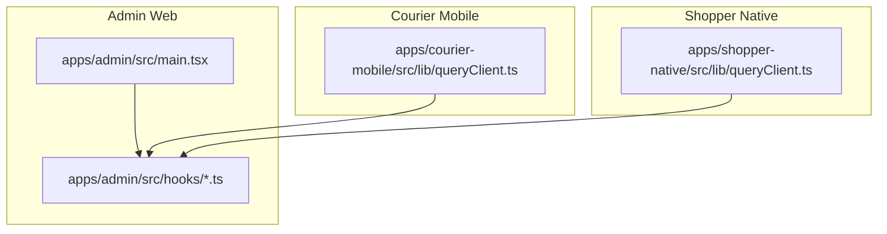
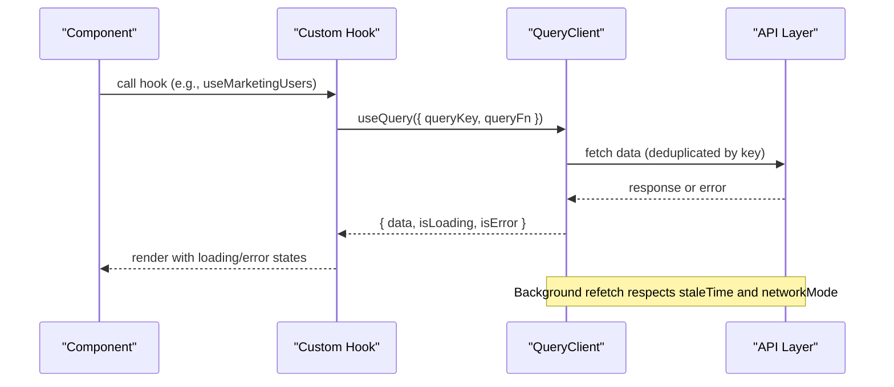
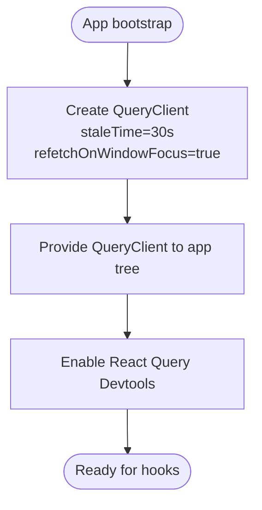
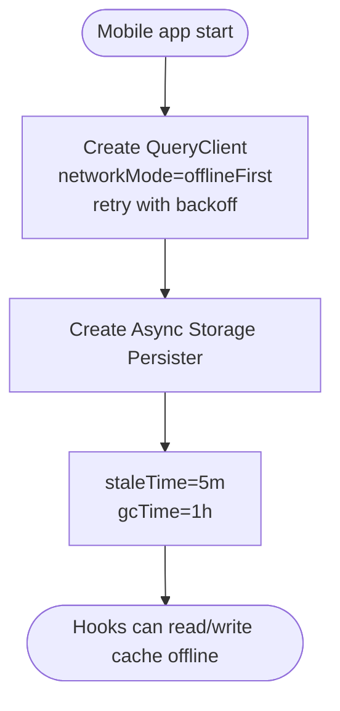
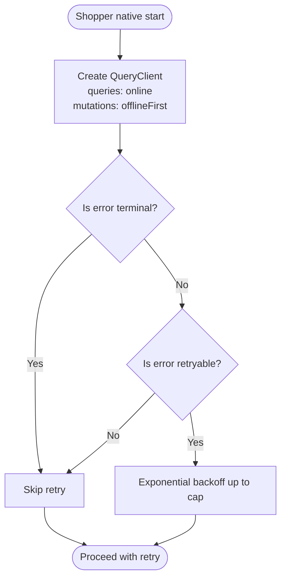
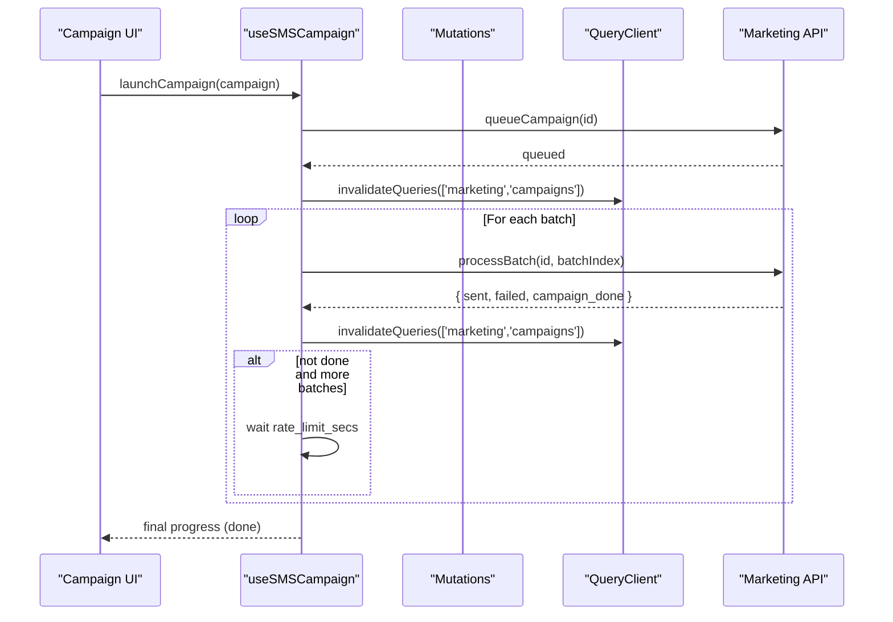
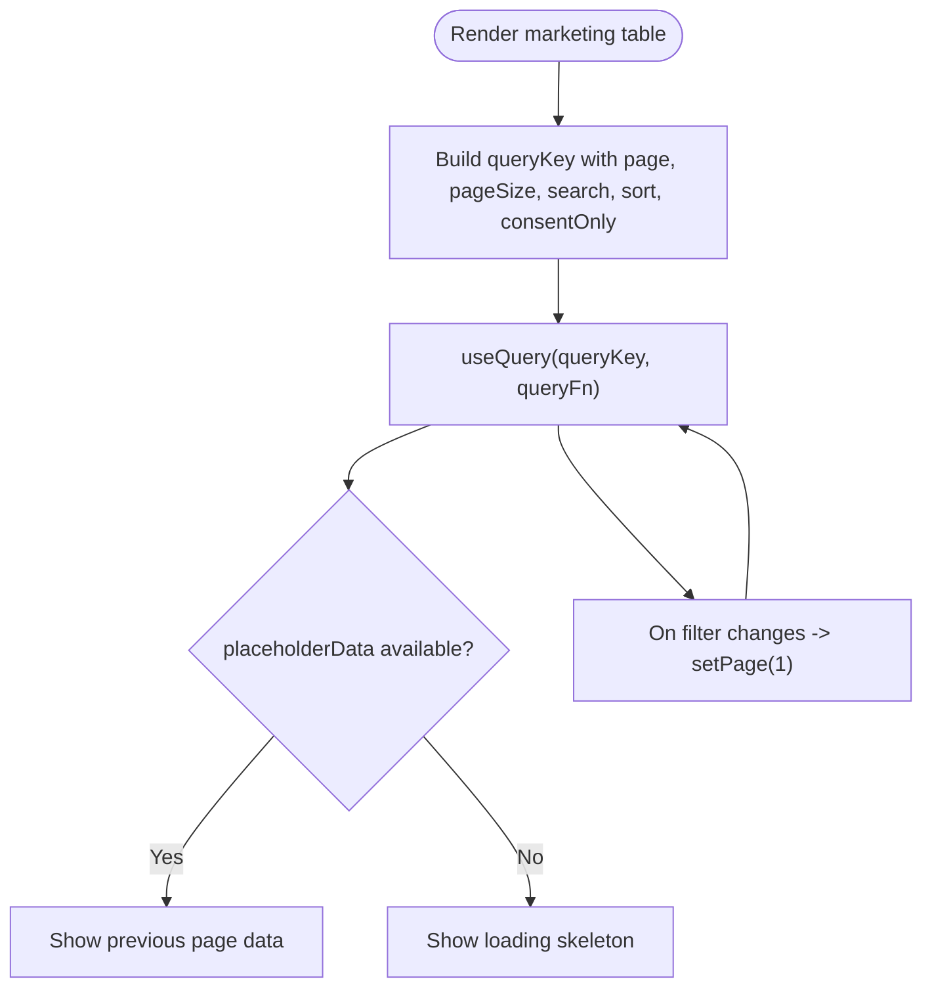
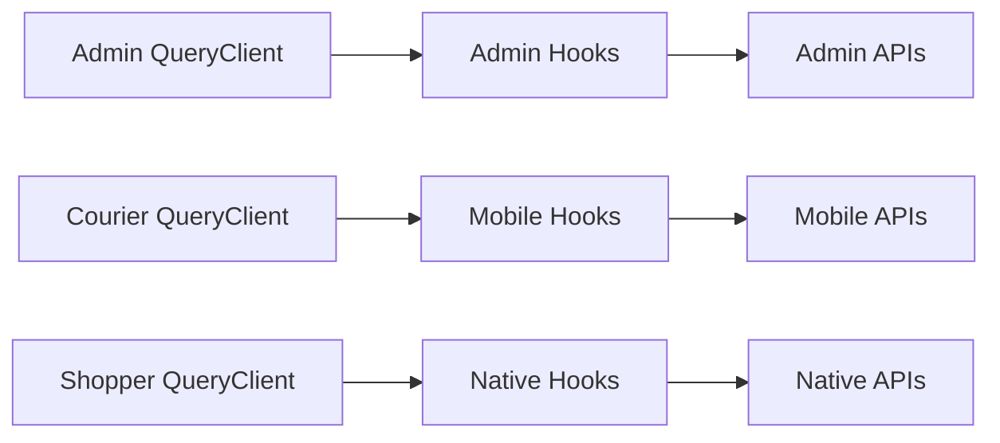

# React Query Integration

<cite>
**Referenced Files in This Document**
- [queryClient.ts](file://apps/courier-mobile/src/lib/queryClient.ts)
- [queryClient.ts](file://apps/shopper-native/src/lib/queryClient.ts)
- [main.tsx](file://apps/admin/src/main.tsx)
- [useSMSCampaign.ts](file://apps/admin/src/hooks/useSMSCampaign.ts)
- [useMarketingUsers.ts](file://apps/admin/src/hooks/useMarketingUsers.ts)
</cite>

## Table of Contents
1. [Introduction](#introduction)
2. [Project Structure](#project-structure)
3. [Core Components](#core-components)
4. [Architecture Overview](#architecture-overview)
5. [Detailed Component Analysis](#detailed-component-analysis)
6. [Dependency Analysis](#dependency-analysis)
7. [Performance Considerations](#performance-considerations)
8. [Troubleshooting Guide](#troubleshooting-guide)
9. [Conclusion](#conclusion)
10. [Appendices](#appendices)

## Introduction
This document explains how React Query (TanStack Query) is integrated across the project to manage server state, implement caching strategies, and support real-time data synchronization patterns. It covers query client configuration, cache policies, background refetching, optimistic updates, authentication integration points, custom hooks, loading states, error boundaries, offline-first behavior, cache invalidation, pagination handling, and performance optimizations such as deduplication and memory management.

## Project Structure
React Query is configured at the app level and consumed via custom hooks:
- Admin web app initializes a QueryClient and provides it through QueryClientProvider.
- Mobile apps configure QueryClient with mobile-specific defaults and persistence where applicable.
- Feature hooks encapsulate queries and mutations, centralizing cache invalidation and state transitions.

**Diagram sources**
- [main.tsx:9-26](file://apps/admin/src/main.tsx#L9-L26)
- [queryClient.ts:5-26](file://apps/courier-mobile/src/lib/queryClient.ts#L5-L26)
- [queryClient.ts:32-57](file://apps/shopper-native/src/lib/queryClient.ts#L32-L57)

**Section sources**
- [main.tsx:9-26](file://apps/admin/src/main.tsx#L9-L26)
- [queryClient.ts:5-26](file://apps/courier-mobile/src/lib/queryClient.ts#L5-L26)
- [queryClient.ts:32-57](file://apps/shopper-native/src/lib/queryClient.ts#L32-L57)

## Core Components
- QueryClient configuration per app:
  - Admin web: short staleTime for near-realtime admin dashboards; window focus refetch enabled.
  - Courier mobile: offline-first network mode for both queries and mutations; persistent storage via Async Storage persister; exponential retry delays.
  - Shopper native: online network mode for queries to avoid retries when offline; offlineFirst for mutations; terminal error detection to prevent unnecessary retries; longer gcTime for persistence across app lifecycle.
- Custom hooks:
  - useSMSCampaign: orchestrates campaign lifecycle using mutations and query invalidation; includes batch processing loop with rate limiting and progress tracking.
  - useMarketingUsers: paginated, searchable, sortable list with placeholderData to keep UI responsive during page transitions.

**Section sources**
- [main.tsx:9-26](file://apps/admin/src/main.tsx#L9-L26)
- [queryClient.ts:5-26](file://apps/courier-mobile/src/lib/queryClient.ts#L5-L26)
- [queryClient.ts:32-57](file://apps/shopper-native/src/lib/queryClient.ts#L32-L57)
- [useSMSCampaign.ts:30-119](file://apps/admin/src/hooks/useSMSCampaign.ts#L30-L119)
- [useMarketingUsers.ts:19-70](file://apps/admin/src/hooks/useMarketingUsers.ts#L19-L70)

## Architecture Overview
The architecture centers on a shared QueryClient per app that defines default behaviors for queries and mutations. Feature hooks consume these defaults while adding domain-specific logic like pagination, search, sorting, and invalidation triggers.

**Diagram sources**
- [useMarketingUsers.ts:36-43](file://apps/admin/src/hooks/useMarketingUsers.ts#L36-L43)
- [queryClient.ts:5-26](file://apps/courier-mobile/src/lib/queryClient.ts#L5-L26)
- [queryClient.ts:32-57](file://apps/shopper-native/src/lib/queryClient.ts#L32-L57)

## Detailed Component Analysis

### Admin App Query Client Setup
- Initializes QueryClient with short staleTime to keep admin data fresh.
- Enables refetchOnWindowFocus to refresh data when users return to the tab.
- Wraps the app with QueryClientProvider and devtools for debugging.

**Diagram sources**
- [main.tsx:9-26](file://apps/admin/src/main.tsx#L9-L26)

**Section sources**
- [main.tsx:9-26](file://apps/admin/src/main.tsx#L9-L26)

### Courier Mobile Query Client and Persistence
- Uses offlineFirst network mode for both queries and mutations to improve resilience.
- Configures retry policy with exponential backoff capped at a maximum delay.
- Persists cache to AsyncStorage via a persister keyed uniquely per app context.

**Diagram sources**
- [queryClient.ts:5-26](file://apps/courier-mobile/src/lib/queryClient.ts#L5-L26)

**Section sources**
- [queryClient.ts:5-26](file://apps/courier-mobile/src/lib/queryClient.ts#L5-L26)

### Shopper Native Query Client and Terminal Error Handling
- Queries run only when online to avoid wasted retries; mutations are offlineFirst to queue writes.
- Implements terminal error detection to skip retries for 4xx and specific PostgREST codes.
- Uses longer gcTime to survive app backgrounding and leverages persistence strategy elsewhere.

**Diagram sources**
- [queryClient.ts:32-57](file://apps/shopper-native/src/lib/queryClient.ts#L32-L57)

**Section sources**
- [queryClient.ts:32-57](file://apps/shopper-native/src/lib/queryClient.ts#L32-L57)

### Custom Hook: Campaign Lifecycle (useSMSCampaign)
- Manages create, queue, cancel, and batch processing with sequential execution and rate limiting.
- Uses mutations and invalidates the campaigns list after each step to reflect progress.
- Exposes local progress state for UI feedback and an audit log query for detailed records.

**Diagram sources**
- [useSMSCampaign.ts:71-119](file://apps/admin/src/hooks/useSMSCampaign.ts#L71-L119)

**Section sources**
- [useSMSCampaign.ts:30-119](file://apps/admin/src/hooks/useSMSCampaign.ts#L30-L119)

### Custom Hook: Paginated Marketing Users (useMarketingUsers)
- Encapsulates pagination, search, sort, and consent filter into a single query key.
- Uses placeholderData to maintain previous data during transitions for smoother UX.
- Provides helpers to update filters and reset to page 1 when parameters change.

**Diagram sources**
- [useMarketingUsers.ts:22-43](file://apps/admin/src/hooks/useMarketingUsers.ts#L22-L43)

**Section sources**
- [useMarketingUsers.ts:19-70](file://apps/admin/src/hooks/useMarketingUsers.ts#L19-L70)

## Dependency Analysis
- QueryClient instances are created per app and provided to the component tree.
- Hooks depend on QueryClient via React Query’s context to execute queries/mutations.
- Invalidation keys are centralized in hooks to ensure consistent cache updates.

**Diagram sources**
- [main.tsx:9-26](file://apps/admin/src/main.tsx#L9-L26)
- [queryClient.ts:5-26](file://apps/courier-mobile/src/lib/queryClient.ts#L5-L26)
- [queryClient.ts:32-57](file://apps/shopper-native/src/lib/queryClient.ts#L32-L57)
- [useSMSCampaign.ts:30-119](file://apps/admin/src/hooks/useSMSCampaign.ts#L30-L119)
- [useMarketingUsers.ts:19-70](file://apps/admin/src/hooks/useMarketingUsers.ts#L19-L70)

**Section sources**
- [main.tsx:9-26](file://apps/admin/src/main.tsx#L9-L26)
- [queryClient.ts:5-26](file://apps/courier-mobile/src/lib/queryClient.ts#L5-L26)
- [queryClient.ts:32-57](file://apps/shopper-native/src/lib/queryClient.ts#L32-L57)
- [useSMSCampaign.ts:30-119](file://apps/admin/src/hooks/useSMSCampaign.ts#L30-L119)
- [useMarketingUsers.ts:19-70](file://apps/admin/src/hooks/useMarketingUsers.ts#L19-L70)

## Performance Considerations
- Deduplication: React Query automatically deduplicates concurrent requests sharing the same queryKey, reducing redundant network calls.
- Stale times:
  - Admin: short staleTime ensures near-realtime updates for operational dashboards.
  - Mobile: longer staleTime reduces network usage and improves perceived performance.
- Garbage collection: gcTime controls how long unused entries remain in memory; tune based on app lifecycle and persistence strategy.
- Network modes:
  - Offline-first (mobile): allows reads/writes without connectivity; ideal for resilient UX.
  - Online-only (shopper native queries): avoids retries when offline; mutations still queue for later.
- Retry policies:
  - Exponential backoff with caps prevents thundering herds.
  - Terminal error detection skips retries for non-recoverable errors.
- Pagination optimization:
  - Use placeholderData to preserve previous pages during transitions.
  - Reset to page 1 on filter changes to avoid inconsistent states.
- Memory management:
  - Adjust gcTime to balance freshness vs memory footprint.
  - Persist critical caches to disk on mobile to survive app restarts.

[No sources needed since this section provides general guidance]

## Troubleshooting Guide
- Unexpected refetches:
  - Check refetchOnWindowFocus settings; disable if unnecessary refetches occur.
- Excessive retries:
  - Ensure terminal error detection is active for 4xx responses and known error codes.
  - Verify retryDelay and max attempts align with backend rate limits.
- Stale data in admin:
  - Confirm staleTime is appropriate; consider enabling refetchOnWindowFocus for live dashboards.
- Offline behavior mismatches:
  - Validate networkMode per operation type (online for queries, offlineFirst for mutations).
- Cache inconsistencies:
  - Centralize invalidation keys in hooks; ensure all mutations invalidate related queries.

**Section sources**
- [queryClient.ts:5-26](file://apps/courier-mobile/src/lib/queryClient.ts#L5-L26)
- [queryClient.ts:32-57](file://apps/shopper-native/src/lib/queryClient.ts#L32-L57)
- [main.tsx:9-26](file://apps/admin/src/main.tsx#L9-L26)
- [useSMSCampaign.ts:30-119](file://apps/admin/src/hooks/useSMSCampaign.ts#L30-L119)

## Conclusion
The project implements robust React Query integrations tailored to each platform:
- Admin web prioritizes freshness and developer experience.
- Mobile apps emphasize resilience and offline capabilities with persistence.
- Shopper native balances online-only queries with offline-first mutations and intelligent retry policies.
Custom hooks encapsulate complex workflows, ensuring consistent cache invalidation and user experiences. Proper tuning of staleTime, gcTime, networkMode, and retry strategies yields efficient, reliable data flows across the application.

[No sources needed since this section summarizes without analyzing specific files]

## Appendices

### Authentication Context and Request Interceptors
- Integrate token management by wrapping API calls within your service layer or interceptors so that authenticated requests include tokens from your auth context.
- On token refresh or logout, invalidate relevant queries to force re-authentication flows.
- For mutations requiring auth, leverage offlineFirst to queue operations until connectivity and valid tokens are available.

[No sources needed since this section provides general guidance]

### Real-Time Data Synchronization
- Combine React Query with WebSocket or Server-Sent Events to push updates and trigger query invalidations for affected keys.
- Use optimistic updates in mutations to provide immediate UI feedback, then reconcile with server state upon success or rollback on failure.

[No sources needed since this section provides general guidance]

### Example Patterns Reference
- Query client setup: see admin provider and mobile configurations.
- Custom hooks with pagination and invalidation: see marketing hooks.
- Batched operations with progress and rate limiting: see campaign lifecycle hook.

**Section sources**
- [main.tsx:9-26](file://apps/admin/src/main.tsx#L9-L26)
- [queryClient.ts:5-26](file://apps/courier-mobile/src/lib/queryClient.ts#L5-L26)
- [queryClient.ts:32-57](file://apps/shopper-native/src/lib/queryClient.ts#L32-L57)
- [useSMSCampaign.ts:30-119](file://apps/admin/src/hooks/useSMSCampaign.ts#L30-L119)
- [useMarketingUsers.ts:19-70](file://apps/admin/src/hooks/useMarketingUsers.ts#L19-L70)