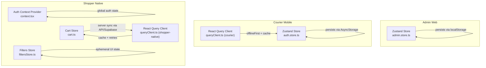
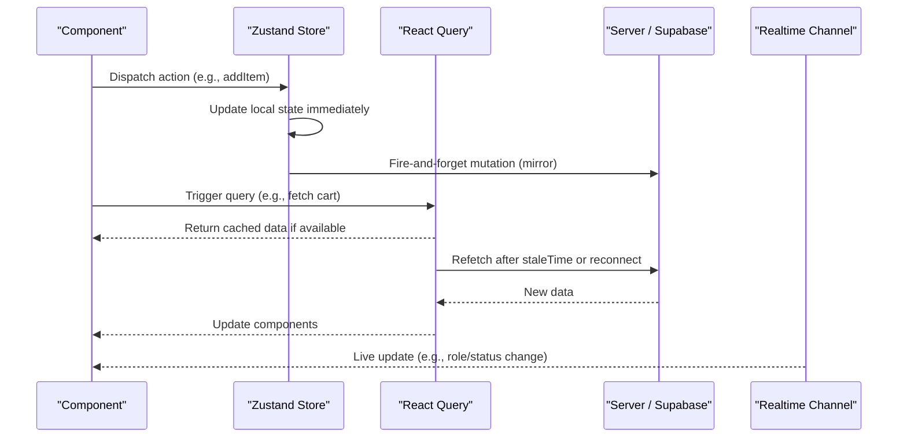
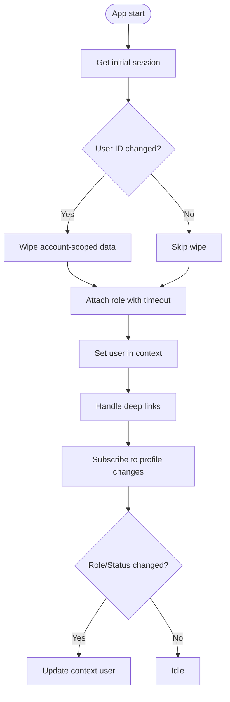
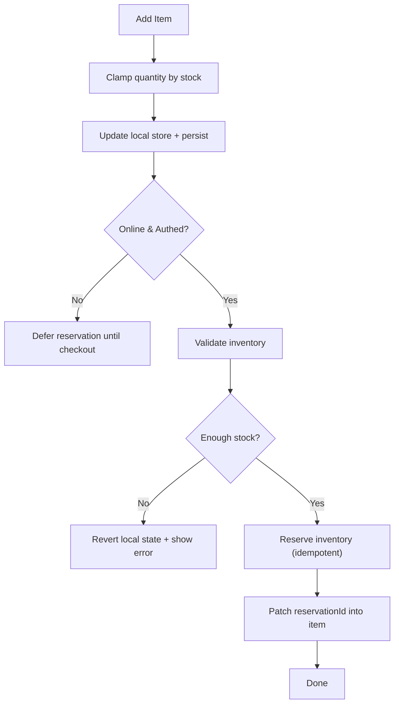
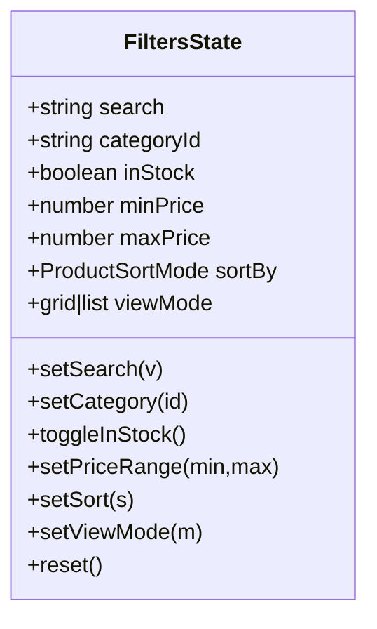
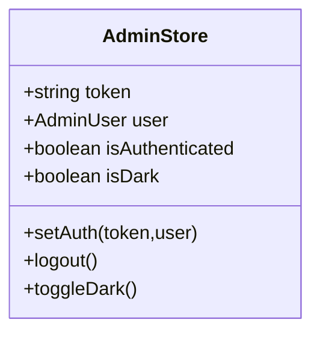
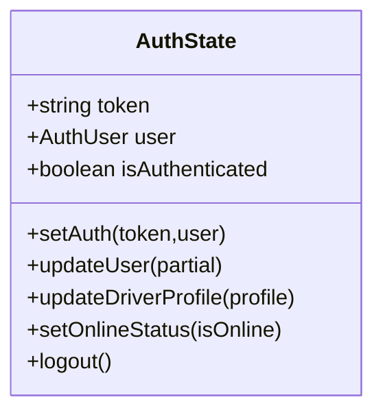
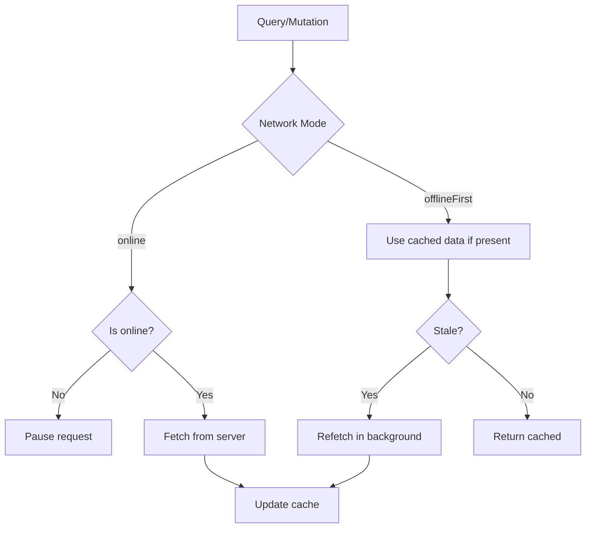
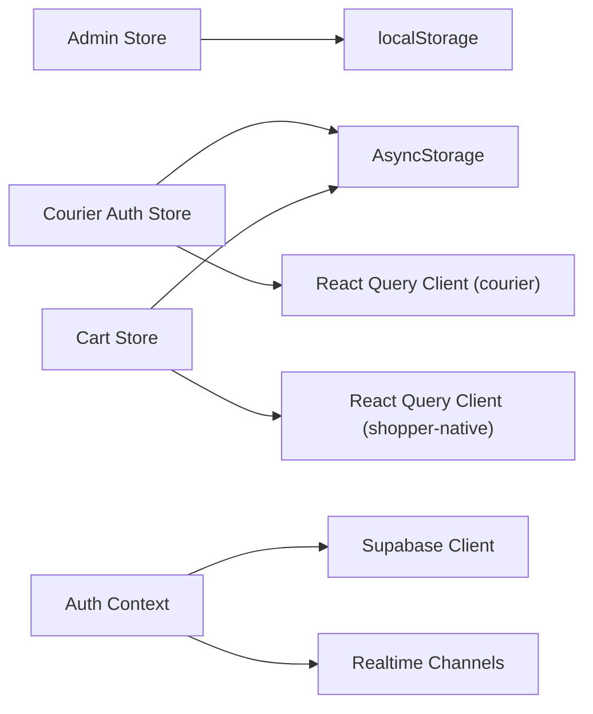

# State Management

<cite>
**Referenced Files in This Document**
- [admin.store.ts](file://apps/admin/src/stores/admin.store.ts)
- [auth.store.ts](file://apps/courier-mobile/src/stores/auth.store.ts)
- [context.tsx](file://apps/shopper-native/src/features/auth/context.tsx)
- [queryClient.ts (courier)](file://apps/courier-mobile/src/lib/queryClient.ts)
- [queryClient.ts (shopper-native)](file://apps/shopper-native/src/lib/queryClient.ts)
- [cart.ts](file://apps/shopper-native/src/stores/cart.ts)
- [filtersStore.ts](file://apps/shopper-native/src/features/products/stores/filtersStore.ts)
</cite>

## Table of Contents
1. Introduction
2. Project Structure
3. Core Components
4. Architecture Overview
5. Detailed Component Analysis
6. Dependency Analysis
7. Performance Considerations
8. Troubleshooting Guide
9. Conclusion

## Introduction
This document explains the multi-layered state management approach used across the application:
- Local UI state via Zustand stores for ephemeral or feature-scoped state.
- Server state via React Query for caching, background refetching, and optimistic updates.
- Global UI state via React Context providers for cross-cutting concerns such as authentication and app-wide flags.

The goal is to clearly separate local state, server state, and global application state while providing robust persistence strategies, real-time updates, and resilient offline-first behavior.

## Project Structure
State management spans multiple apps and layers:
- Admin web uses a simple persisted Zustand store for auth and theme.
- Courier mobile uses persisted Zustand stores with AsyncStorage-backed persistence and a tuned React Query client.
- Shopper native combines a rich context provider for authentication, a complex cart store with inventory reservations, and a carefully tuned React Query client for mobile networks.

**Diagram sources**
- [admin.store.ts:1-46](file://apps/admin/src/stores/admin.store.ts#L1-L46)
- [auth.store.ts:1-92](file://apps/courier-mobile/src/stores/auth.store.ts#L1-L92)
- [context.tsx:120-348](file://apps/shopper-native/src/features/auth/context.tsx#L120-L348)
- [queryClient.ts (courier):1-27](file://apps/courier-mobile/src/lib/queryClient.ts#L1-L27)
- [queryClient.ts (shopper-native):1-62](file://apps/shopper-native/src/lib/queryClient.ts#L1-L62)
- [cart.ts:1-689](file://apps/shopper-native/src/stores/cart.ts#L1-L689)
- [filtersStore.ts:1-61](file://apps/shopper-native/src/features/products/stores/filtersStore.ts#L1-L61)

**Section sources**
- [admin.store.ts:1-46](file://apps/admin/src/stores/admin.store.ts#L1-L46)
- [auth.store.ts:1-92](file://apps/courier-mobile/src/stores/auth.store.ts#L1-L92)
- [context.tsx:120-348](file://apps/shopper-native/src/features/auth/context.tsx#L120-L348)
- [queryClient.ts (courier):1-27](file://apps/courier-mobile/src/lib/queryClient.ts#L1-L27)
- [queryClient.ts (shopper-native):1-62](file://apps/shopper-native/src/lib/queryClient.ts#L1-L62)
- [cart.ts:1-689](file://apps/shopper-native/src/stores/cart.ts#L1-L689)
- [filtersStore.ts:1-61](file://apps/shopper-native/src/features/products/stores/filtersStore.ts#L1-L61)

## Core Components
- Zustand stores encapsulate local state and actions with clear boundaries per feature or domain.
- React Query clients configure caching, retry policies, and network modes tailored to platform constraints.
- Context providers manage global UI state like authentication, deep-link handling, and live role/status propagation.

Key patterns observed:
- Persisted Zustand stores for long-lived user/session data using platform storage (localStorage on web, AsyncStorage on mobile).
- Ephemeral stores for transient UI state that should reset on launch.
- Offline-first mutations with optimistic UI and idempotent server operations.
- Real-time updates via Supabase realtime channels for critical user attributes.

**Section sources**
- [admin.store.ts:1-46](file://apps/admin/src/stores/admin.store.ts#L1-L46)
- [auth.store.ts:1-92](file://apps/courier-mobile/src/stores/auth.store.ts#L1-L92)
- [context.tsx:120-348](file://apps/shopper-native/src/features/auth/context.tsx#L120-L348)
- [queryClient.ts (courier):1-27](file://apps/courier-mobile/src/lib/queryClient.ts#L1-L27)
- [queryClient.ts (shopper-native):1-62](file://apps/shopper-native/src/lib/queryClient.ts#L1-L62)
- [cart.ts:1-689](file://apps/shopper-native/src/stores/cart.ts#L1-L689)
- [filtersStore.ts:1-61](file://apps/shopper-native/src/features/products/stores/filtersStore.ts#L1-L61)

## Architecture Overview
The system separates responsibilities:
- Local UI state: lightweight, fast, often non-persistent (e.g., filters).
- Server state: cached, retried, and synchronized via React Query; mutations can be optimistic.
- Global application state: shared across screens (e.g., authenticated user, roles), managed by context and sometimes backed by stores.

**Diagram sources**
- [cart.ts:157-367](file://apps/shopper-native/src/stores/cart.ts#L157-L367)
- [queryClient.ts (shopper-native):32-57](file://apps/shopper-native/src/lib/queryClient.ts#L32-L57)
- [context.tsx:258-313](file://apps/shopper-native/src/features/auth/context.tsx#L258-L313)

## Detailed Component Analysis

### Authentication Context Provider (Global UI State)
Responsibilities:
- Initialize session from Supabase and handle deep links for email confirmation/reset flows.
- Reconcile user identity changes and wipe account-scoped data when switching users.
- Attach user roles with timeout protection to avoid blocking sign-in.
- Subscribe to realtime profile updates to reflect role/status changes mid-session.
- Provide sign-out flow that detaches push tokens and clears local data.

**Diagram sources**
- [context.tsx:31-104](file://apps/shopper-native/src/features/auth/context.tsx#L31-L104)
- [context.tsx:141-208](file://apps/shopper-native/src/features/auth/context.tsx#L141-L208)
- [context.tsx:258-313](file://apps/shopper-native/src/features/auth/context.tsx#L258-L313)

**Section sources**
- [context.tsx:31-104](file://apps/shopper-native/src/features/auth/context.tsx#L31-L104)
- [context.tsx:120-241](file://apps/shopper-native/src/features/auth/context.tsx#L120-L241)
- [context.tsx:258-348](file://apps/shopper-native/src/features/auth/context.tsx#L258-L348)

### Cart Store (Local + Server Sync with Inventory Reservations)
Responsibilities:
- Maintain an optimistic local mirror of cart items with persistent storage.
- Hydrate from local cache and merge with server data when authenticated.
- Reserve inventory for each line item with idempotency keys and pre-validation to reduce server errors.
- Release or re-reserve inventory on quantity changes or removals.
- Commit reservations upon order placement and report failures without blocking success.

**Diagram sources**
- [cart.ts:111-127](file://apps/shopper-native/src/stores/cart.ts#L111-L127)
- [cart.ts:157-367](file://apps/shopper-native/src/stores/cart.ts#L157-L367)
- [cart.ts:563-656](file://apps/shopper-native/src/stores/cart.ts#L563-L656)

**Section sources**
- [cart.ts:1-689](file://apps/shopper-native/src/stores/cart.ts#L1-L689)

### Filters Store (Ephemeral UI State)
Responsibilities:
- Hold transient UI inputs for product grid (search, category, price range, sort, view mode).
- Reset on app launch to avoid stale views.
- Expose stable selectors to minimize unnecessary re-renders.

**Diagram sources**
- [filtersStore.ts:15-52](file://apps/shopper-native/src/features/products/stores/filtersStore.ts#L15-L52)

**Section sources**
- [filtersStore.ts:1-61](file://apps/shopper-native/src/features/products/stores/filtersStore.ts#L1-L61)

### Admin Store (Persisted Local Auth + Theme)
Responsibilities:
- Persist token, user, authentication flag, and theme preference.
- Provide actions to set auth, logout, and toggle dark mode.

**Diagram sources**
- [admin.store.ts:4-45](file://apps/admin/src/stores/admin.store.ts#L4-L45)

**Section sources**
- [admin.store.ts:1-46](file://apps/admin/src/stores/admin.store.ts#L1-L46)

### Courier Auth Store (Persisted Local Auth)
Responsibilities:
- Persist driver auth state including profile and online status.
- Provide actions to update user, driver profile, online status, and logout.

**Diagram sources**
- [auth.store.ts:5-91](file://apps/courier-mobile/src/stores/auth.store.ts#L5-L91)

**Section sources**
- [auth.store.ts:1-92](file://apps/courier-mobile/src/stores/auth.store.ts#L1-L92)

### React Query Clients (Caching, Retries, Network Modes)
- Courier mobile: offline-first queries/mutations with short stale times and exponential backoff; async storage persister for cache durability.
- Shopper native: online queries with longer cache lifetime, terminal error classification to avoid retrying 4xx, offline-first mutations for optimistic flows.

**Diagram sources**
- [queryClient.ts (courier):5-26](file://apps/courier-mobile/src/lib/queryClient.ts#L5-L26)
- [queryClient.ts (shopper-native):32-57](file://apps/shopper-native/src/lib/queryClient.ts#L32-L57)

**Section sources**
- [queryClient.ts (courier):1-27](file://apps/courier-mobile/src/lib/queryClient.ts#L1-L27)
- [queryClient.ts (shopper-native):1-62](file://apps/shopper-native/src/lib/queryClient.ts#L1-L62)

## Dependency Analysis
- Stores depend on platform storage for persistence (localStorage on web, AsyncStorage on mobile).
- Cart store depends on inventory services and React Query’s online manager to coordinate offline behavior.
- Context provider depends on Supabase client for auth and realtime channels.
- React Query clients centralize retry and caching policies, decoupling components from network specifics.

**Diagram sources**
- [admin.store.ts:23-44](file://apps/admin/src/stores/admin.store.ts#L23-L44)
- [auth.store.ts:47-90](file://apps/courier-mobile/src/stores/auth.store.ts#L47-L90)
- [cart.ts:24-49](file://apps/shopper-native/src/stores/cart.ts#L24-L49)
- [queryClient.ts (shopper-native):14-57](file://apps/shopper-native/src/lib/queryClient.ts#L14-L57)
- [queryClient.ts (courier):1-26](file://apps/courier-mobile/src/lib/queryClient.ts#L1-L26)
- [context.tsx:258-313](file://apps/shopper-native/src/features/auth/context.tsx#L258-L313)

**Section sources**
- [admin.store.ts:23-44](file://apps/admin/src/stores/admin.store.ts#L23-L44)
- [auth.store.ts:47-90](file://apps/courier-mobile/src/stores/auth.store.ts#L47-L90)
- [cart.ts:24-49](file://apps/shopper-native/src/stores/cart.ts#L24-L49)
- [queryClient.ts (shopper-native):14-57](file://apps/shopper-native/src/lib/queryClient.ts#L14-L57)
- [queryClient.ts (courier):1-26](file://apps/courier-mobile/src/lib/queryClient.ts#L1-L26)
- [context.tsx:258-313](file://apps/shopper-native/src/features/auth/context.tsx#L258-L313)

## Performance Considerations
- Prefer ephemeral stores for transient UI state to avoid unnecessary persistence overhead.
- Use selective selectors in Zustand to minimize re-renders.
- Configure React Query staleTime and gcTime based on data volatility and device memory constraints.
- Use offline-first mutations for optimistic UX; ensure idempotency keys prevent duplicate side effects.
- Classify terminal errors to avoid wasteful retries on 4xx responses.
- Debounce or throttle heavy operations where appropriate; leverage background refetching instead of polling.

[No sources needed since this section provides general guidance]

## Troubleshooting Guide
Common issues and remedies:
- Deep link handling failures during auth: ensure handlers gracefully catch navigation errors and do not crash the app at startup.
- Role attachment timeouts: use bounded timeouts to prevent blocking sign-in flows; default to safe fallback roles and retry on next auth event.
- Realtime channel errors: implement retry with exponential backoff and remove/recreate channels on CHANNEL_ERROR or TIMED_OUT.
- Inventory reservation failures: parse server messages to provide actionable feedback; revert local state and surface errors to UI.
- Sign-out cleanup: detach push tokens and wipe account-scoped data before clearing user to prevent stale data exposure.

**Section sources**
- [context.tsx:31-104](file://apps/shopper-native/src/features/auth/context.tsx#L31-L104)
- [context.tsx:178-194](file://apps/shopper-native/src/features/auth/context.tsx#L178-L194)
- [context.tsx:295-303](file://apps/shopper-native/src/features/auth/context.tsx#L295-L303)
- [cart.ts:137-155](file://apps/shopper-native/src/stores/cart.ts#L137-L155)
- [cart.ts:317-365](file://apps/shopper-native/src/stores/cart.ts#L317-L365)
- [context.tsx:315-338](file://apps/shopper-native/src/features/auth/context.tsx#L315-L338)

## Conclusion
This multi-layered approach cleanly separates local UI state, server state, and global application state:
- Zustand stores deliver fast, scoped state with optional persistence.
- React Query manages server state with robust caching, retries, and offline-first mutations.
- Context providers orchestrate global concerns like authentication and live updates.

By combining these patterns, the application achieves responsive UIs, resilient networking, and maintainable state architecture suitable for both web and mobile platforms.

[No sources needed since this section summarizes without analyzing specific files]