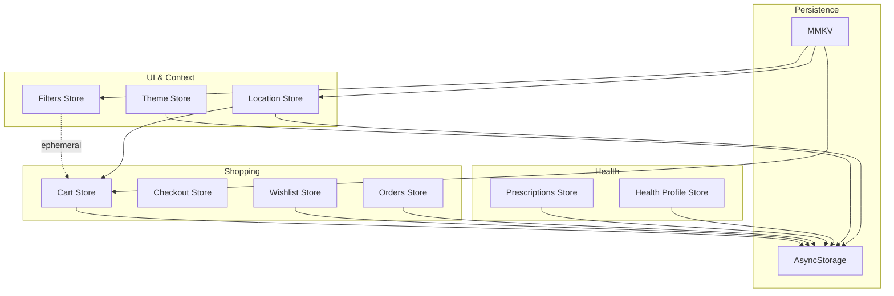
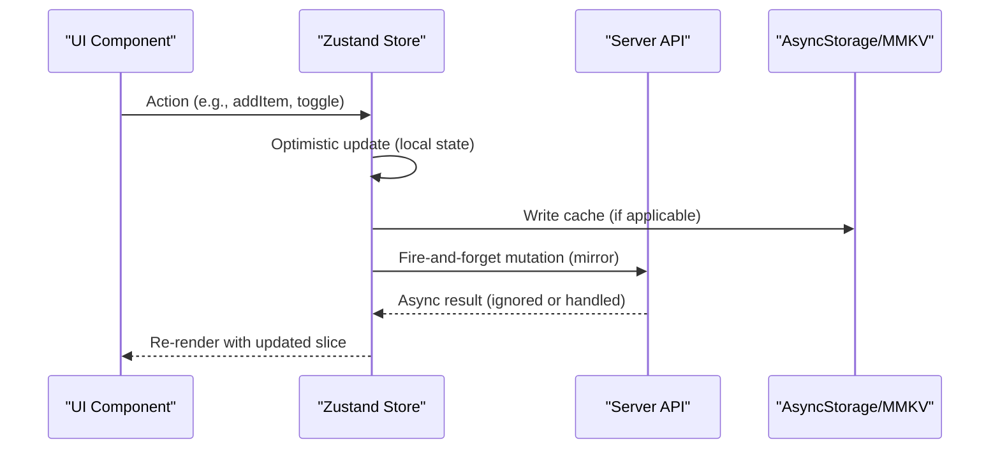
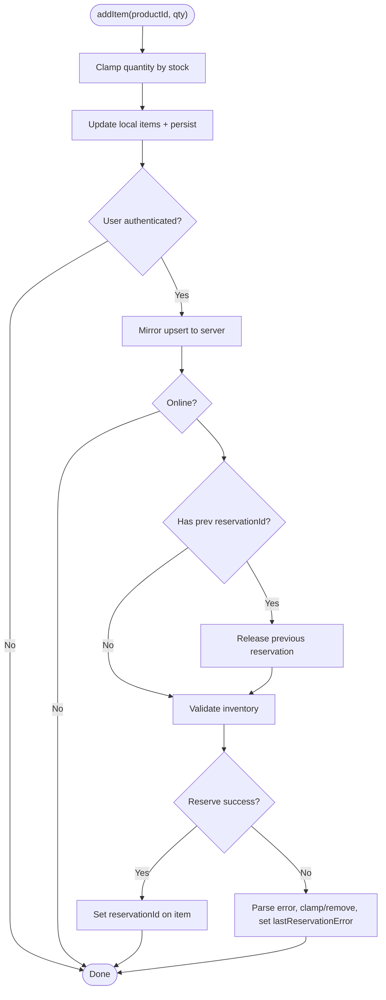
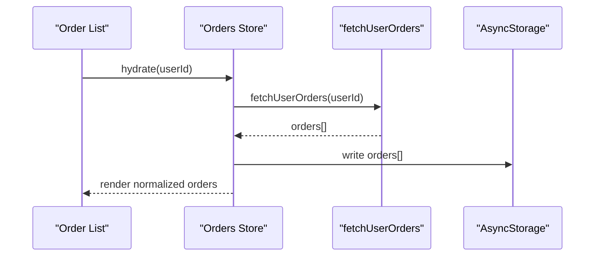
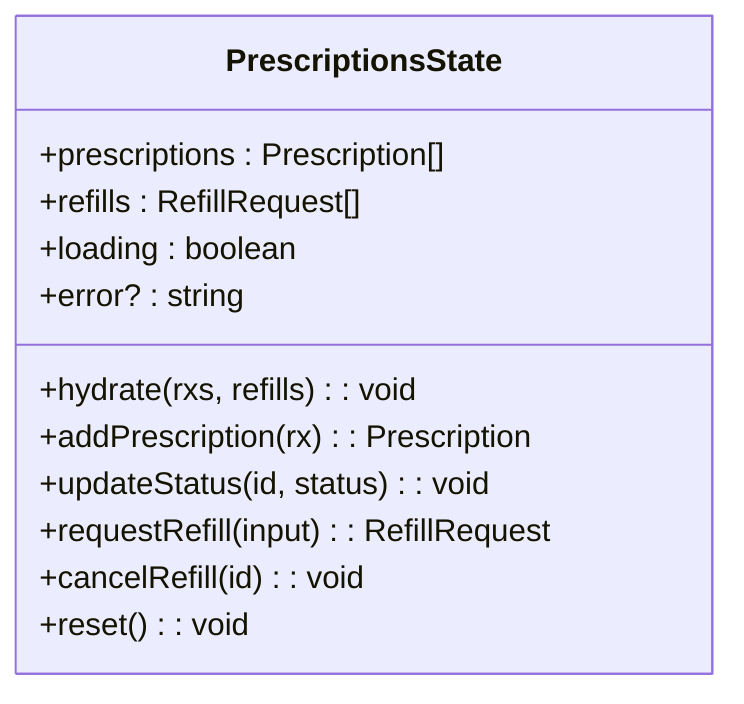
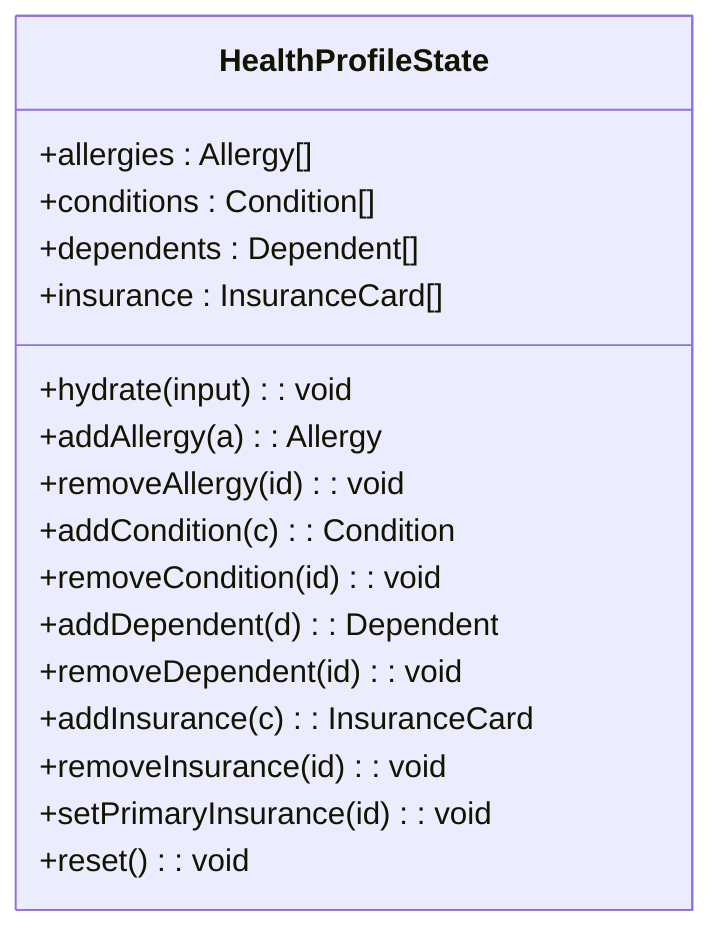
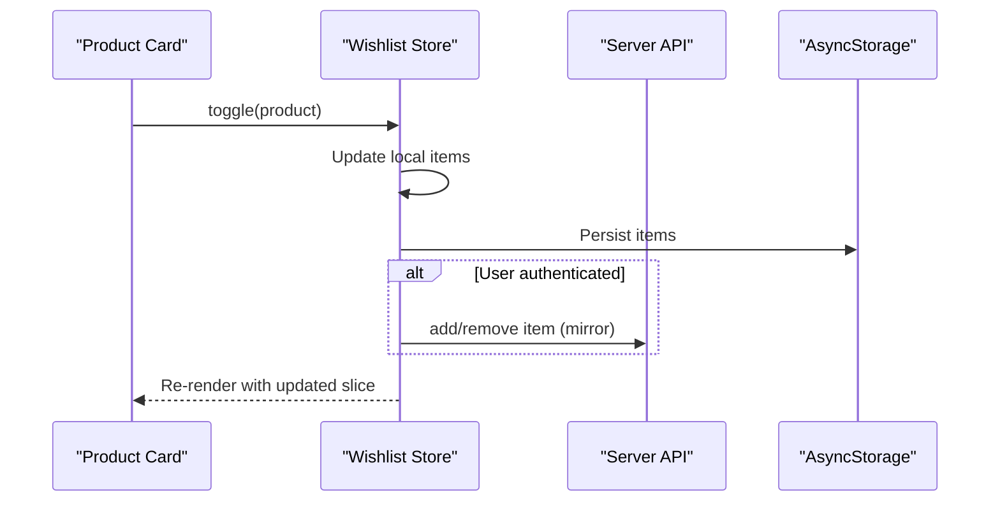
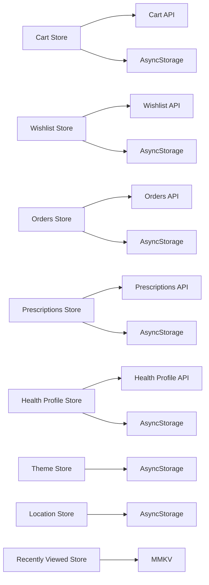

# Zustand Stores

<cite>
**Referenced Files in This Document**
- [cart.ts](file://apps/shopper-native/src/stores/cart.ts)
- [checkout.ts](file://apps/shopper-native/src/stores/checkout.ts)
- [orders.ts](file://apps/shopper-native/src/stores/orders.ts)
- [prescriptionsStore.ts](file://apps/shopper-native/src/stores/prescriptionsStore.ts)
- [healthProfileStore.ts](file://apps/shopper-native/src/stores/healthProfileStore.ts)
- [themeStore.ts](file://apps/shopper-native/src/stores/themeStore.ts)
- [wishlist.ts](file://apps/shopper-native/src/stores/wishlist.ts)
- [locationStore.ts](file://apps/shopper-native/src/features/delivery/locationStore.ts)
- [filtersStore.ts](file://apps/shopper-native/src/features/products/stores/filtersStore.ts)
- [recentlyViewedStore.ts](file://apps/shopper-native/src/features/products/stores/recentlyViewedStore.ts)
- [mmkv.ts](file://apps/shopper-native/src/lib/mmkv.ts)
- [offlineQueue.ts](file://apps/shopper-native/src/lib/offlineQueue.ts)
</cite>

## Table of Contents
1. [Introduction](#introduction)
2. [Project Structure](#project-structure)
3. [Core Components](#core-components)
4. [Architecture Overview](#architecture-overview)
5. [Detailed Component Analysis](#detailed-component-analysis)
6. [Dependency Analysis](#dependency-analysis)
7. [Performance Considerations](#performance-considerations)
8. [Troubleshooting Guide](#troubleshooting-guide)
9. [Conclusion](#conclusion)
10. [Appendices](#appendices)

## Introduction
This document explains the Zustand-based client state management system used across the shopper-native application. It covers store architecture for cart, checkout flow, order tracking, prescriptions, health profile, theme preferences, and wishlist. It also documents store patterns (action creators, selectors), middleware usage (persist with AsyncStorage), persistence strategies using MMKV for performance-sensitive data, and techniques for optimistic updates, async operations, memoization, selective subscriptions, and store composition.

## Project Structure
The stores are organized by domain within the shopper-native app:
- Core shopping flows: cart, checkout, orders, wishlist
- Health-related: prescriptions, health profile
- UI preferences: theme, filters
- Delivery context: location
- Performance utilities: MMKV-backed recently viewed and offline queue

**Diagram sources**
- [cart.ts:1-689](file://apps/shopper-native/src/stores/cart.ts#L1-L689)
- [checkout.ts:1-32](file://apps/shopper-native/src/stores/checkout.ts#L1-L32)
- [orders.ts:1-166](file://apps/shopper-native/src/stores/orders.ts#L1-L166)
- [prescriptionsStore.ts:1-193](file://apps/shopper-native/src/stores/prescriptionsStore.ts#L1-L193)
- [healthProfileStore.ts:1-210](file://apps/shopper-native/src/stores/healthProfileStore.ts#L1-L210)
- [themeStore.ts:1-24](file://apps/shopper-native/src/stores/themeStore.ts#L1-L24)
- [wishlist.ts:1-112](file://apps/shopper-native/src/stores/wishlist.ts#L1-L112)
- [locationStore.ts:1-101](file://apps/shopper-native/src/features/delivery/locationStore.ts#L1-L101)
- [filtersStore.ts:1-61](file://apps/shopper-native/src/features/products/stores/filtersStore.ts#L1-L61)
- [recentlyViewedStore.ts:1-112](file://apps/shopper-native/src/features/products/stores/recentlyViewedStore.ts#L1-L112)
- [mmkv.ts:1-50](file://apps/shopper-native/src/lib/mmkv.ts#L1-L50)
- [offlineQueue.ts:1-100](file://apps/shopper-native/src/lib/offlineQueue.ts#L1-L100)

**Section sources**
- [cart.ts:1-689](file://apps/shopper-native/src/stores/cart.ts#L1-L689)
- [checkout.ts:1-32](file://apps/shopper-native/src/stores/checkout.ts#L1-L32)
- [orders.ts:1-166](file://apps/shopper-native/src/stores/orders.ts#L1-L166)
- [prescriptionsStore.ts:1-193](file://apps/shopper-native/src/stores/prescriptionsStore.ts#L1-L193)
- [healthProfileStore.ts:1-210](file://apps/shopper-native/src/stores/healthProfileStore.ts#L1-L210)
- [themeStore.ts:1-24](file://apps/shopper-native/src/stores/themeStore.ts#L1-L24)
- [wishlist.ts:1-112](file://apps/shopper-native/src/stores/wishlist.ts#L1-L112)
- [locationStore.ts:1-101](file://apps/shopper-native/src/features/delivery/locationStore.ts#L1-L101)
- [filtersStore.ts:1-61](file://apps/shopper-native/src/features/products/stores/filtersStore.ts#L1-L61)
- [recentlyViewedStore.ts:1-112](file://apps/shopper-native/src/features/products/stores/recentlyViewedStore.ts#L1-L112)
- [mmkv.ts:1-50](file://apps/shopper-native/src/lib/mmkv.ts#L1-L50)
- [offlineQueue.ts:1-100](file://apps/shopper-native/src/lib/offlineQueue.ts#L1-L100)

## Core Components
- Cart store: Manages items, promo code, shipping fee, hydration from server or local cache, inventory reservations, and pricing computation. Provides selectors for pricing, item count, promo eligibility, and last reservation error.
- Checkout store: Holds payment method, transfer number, receipt URI, and reset behavior; clears previous upload when payment method changes.
- Orders store: Read-only view of user orders with hydration to Supabase and local cache via AsyncStorage; normalizes legacy statuses to canonical ones.
- Prescriptions store: Local source of truth for prescriptions and refill requests; persisted via AsyncStorage with migrations; provides CRUD and query helpers.
- Health profile store: Persists allergies, conditions, dependents, and insurance; supports primary insurance selection and resets; persisted with migrations.
- Theme store: Persists theme mode (system/light/dark).
- Wishlist store: Mirrors server wishlist with local cache; supports toggle, has-check, and clear.
- Location store: Central delivery context (coordinates, permission, area, branch); persisted and exposes selector helper for granular subscriptions.
- Filters store: Ephemeral UI filters for product grid; stable selectors to avoid unnecessary re-renders.
- Recently viewed store: MMKV-backed LRU list of recently viewed products; zero network cost reads.

**Section sources**
- [cart.ts:1-689](file://apps/shopper-native/src/stores/cart.ts#L1-L689)
- [checkout.ts:1-32](file://apps/shopper-native/src/stores/checkout.ts#L1-L32)
- [orders.ts:1-166](file://apps/shopper-native/src/stores/orders.ts#L1-L166)
- [prescriptionsStore.ts:1-193](file://apps/shopper-native/src/stores/prescriptionsStore.ts#L1-L193)
- [healthProfileStore.ts:1-210](file://apps/shopper-native/src/stores/healthProfileStore.ts#L1-L210)
- [themeStore.ts:1-24](file://apps/shopper-native/src/stores/themeStore.ts#L1-L24)
- [wishlist.ts:1-112](file://apps/shopper-native/src/stores/wishlist.ts#L1-L112)
- [locationStore.ts:1-101](file://apps/shopper-native/src/features/delivery/locationStore.ts#L1-L101)
- [filtersStore.ts:1-61](file://apps/shopper-native/src/features/products/stores/filtersStore.ts#L1-L61)
- [recentlyViewedStore.ts:1-112](file://apps/shopper-native/src/features/products/stores/recentlyViewedStore.ts#L1-L112)

## Architecture Overview
The system uses a layered approach:
- UI components subscribe to small slices of Zustand stores via selectors for fine-grained reactivity.
- Stores encapsulate business logic and coordinate with APIs (Supabase) and persistence layers (AsyncStorage, MMKV).
- Middleware (persist) handles durable storage for user preferences and critical data.
- MMKV is used for high-performance synchronous key/value storage for frequently accessed, non-user-scoped data (e.g., recently viewed).
- Offline-first patterns ensure responsiveness: local state updates immediately, then mirror to server asynchronously.

**Diagram sources**
- [cart.ts:157-367](file://apps/shopper-native/src/stores/cart.ts#L157-L367)
- [wishlist.ts:40-106](file://apps/shopper-native/src/stores/wishlist.ts#L40-L106)
- [prescriptionsStore.ts:112-193](file://apps/shopper-native/src/stores/prescriptionsStore.ts#L112-L193)
- [healthProfileStore.ts:108-210](file://apps/shopper-native/src/stores/healthProfileStore.ts#L108-L210)
- [mmkv.ts:1-50](file://apps/shopper-native/src/lib/mmkv.ts#L1-L50)

## Detailed Component Analysis

### Cart Store
Responsibilities:
- Hydration from server or local cache depending on authentication state.
- Add/remove/update quantity with immediate local updates and background sync.
- Inventory reservation lifecycle: validate, reserve, release, commit; idempotency keys prevent duplicates.
- Pricing computation delegated to a dedicated engine; store only supplies lines and promo/shipping inputs.
- Selectors expose derived values (pricing, item count, promo eligibility, last reservation error).

Key patterns:
- Optimistic updates with fire-and-forget mirroring to server.
- Pre-flight validation to reduce server errors.
- Error handling that clamps quantities and surfaces user-facing messages.

**Diagram sources**
- [cart.ts:198-367](file://apps/shopper-native/src/stores/cart.ts#L198-L367)
- [cart.ts:563-619](file://apps/shopper-native/src/stores/cart.ts#L563-L619)
- [cart.ts:621-656](file://apps/shopper-native/src/stores/cart.ts#L621-L656)

**Section sources**
- [cart.ts:1-689](file://apps/shopper-native/src/stores/cart.ts#L1-L689)

### Checkout Store
Responsibilities:
- Manage payment method, transfer number, receipt URI.
- Reset fields when payment method changes to avoid stale uploads.

Usage:
- Simple setters and reset action; no persistence required.

**Section sources**
- [checkout.ts:1-32](file://apps/shopper-native/src/stores/checkout.ts#L1-L32)

### Orders Store
Responsibilities:
- Hydrate user orders from server into memory and persist locally for fast next launch.
- Normalize legacy status strings to canonical statuses before rendering.
- Clear local cache without affecting server history.

**Diagram sources**
- [orders.ts:131-165](file://apps/shopper-native/src/stores/orders.ts#L131-L165)
- [orders.ts:78-84](file://apps/shopper-native/src/stores/orders.ts#L78-L84)

**Section sources**
- [orders.ts:1-166](file://apps/shopper-native/src/stores/orders.ts#L1-L166)

### Prescriptions Store
Responsibilities:
- Maintain prescriptions and refill requests locally; persisted via AsyncStorage with versioned migrations.
- Provide queries (getById, getActive, getExpiring) and mutations (add, update status, request/cancel refill).
- Designed for offline-first reads; writes typically go through React Query mutations that call this store optimistically.

**Diagram sources**
- [prescriptionsStore.ts:83-102](file://apps/shopper-native/src/stores/prescriptionsStore.ts#L83-L102)
- [prescriptionsStore.ts:112-193](file://apps/shopper-native/src/stores/prescriptionsStore.ts#L112-L193)

**Section sources**
- [prescriptionsStore.ts:1-193](file://apps/shopper-native/src/stores/prescriptionsStore.ts#L1-L193)

### Health Profile Store
Responsibilities:
- Persist allergies, conditions, dependents, and insurance cards with migrations.
- Support adding/removing records and setting primary insurance.
- Designed for offline-first reads; writes via React Query mutations that call this store optimistically.

**Diagram sources**
- [healthProfileStore.ts:70-99](file://apps/shopper-native/src/stores/healthProfileStore.ts#L70-L99)
- [healthProfileStore.ts:108-210](file://apps/shopper-native/src/stores/healthProfileStore.ts#L108-L210)

**Section sources**
- [healthProfileStore.ts:1-210](file://apps/shopper-native/src/stores/healthProfileStore.ts#L1-L210)

### Theme Store
Responsibilities:
- Persist theme mode (system/light/dark) via AsyncStorage.

Usage:
- Simple setter; minimal state shape.

**Section sources**
- [themeStore.ts:1-24](file://apps/shopper-native/src/stores/themeStore.ts#L1-L24)

### Wishlist Store
Responsibilities:
- Mirror server wishlist with local cache; support toggle, has-check, and clear.
- Background sync for authenticated users; local-only for anonymous.

**Diagram sources**
- [wishlist.ts:40-106](file://apps/shopper-native/src/stores/wishlist.ts#L40-L106)

**Section sources**
- [wishlist.ts:1-112](file://apps/shopper-native/src/stores/wishlist.ts#L1-L112)

### Location Store
Responsibilities:
- Central delivery context: coordinates, permission, selected area, selected branch.
- Persisted via AsyncStorage; exposes selector helper for granular subscriptions.

Usage:
- Consumers subscribe to specific fields to avoid whole-store invalidation cascades.

**Section sources**
- [locationStore.ts:1-101](file://apps/shopper-native/src/features/delivery/locationStore.ts#L1-L101)

### Filters Store
Responsibilities:
- Ephemeral UI filters for product grid; not persisted.
- Stable selectors to minimize re-renders.

**Section sources**
- [filtersStore.ts:1-61](file://apps/shopper-native/src/features/products/stores/filtersStore.ts#L1-L61)

### Recently Viewed Store (MMKV-backed)
Responsibilities:
- Maintain a capped LRU list of recently viewed product IDs.
- Use MMKV for synchronous, JSI-backed storage; robust against full storage by truncating oldest entries.

**Section sources**
- [recentlyViewedStore.ts:1-112](file://apps/shopper-native/src/features/products/stores/recentlyViewedStore.ts#L1-L112)
- [mmkv.ts:1-50](file://apps/shopper-native/src/lib/mmkv.ts#L1-L50)

## Dependency Analysis
Stores interact with:
- Server APIs (Supabase functions/RPCs) for hydration and mutations.
- AsyncStorage for persistent user data and caches.
- MMKV for high-performance ephemeral or public data.
- Analytics and crash reporting utilities for observability.

**Diagram sources**
- [cart.ts:1-689](file://apps/shopper-native/src/stores/cart.ts#L1-L689)
- [wishlist.ts:1-112](file://apps/shopper-native/src/stores/wishlist.ts#L1-L112)
- [orders.ts:1-166](file://apps/shopper-native/src/stores/orders.ts#L1-L166)
- [prescriptionsStore.ts:1-193](file://apps/shopper-native/src/stores/prescriptionsStore.ts#L1-L193)
- [healthProfileStore.ts:1-210](file://apps/shopper-native/src/stores/healthProfileStore.ts#L1-L210)
- [themeStore.ts:1-24](file://apps/shopper-native/src/stores/themeStore.ts#L1-L24)
- [locationStore.ts:1-101](file://apps/shopper-native/src/features/delivery/locationStore.ts#L1-L101)
- [recentlyViewedStore.ts:1-112](file://apps/shopper-native/src/features/products/stores/recentlyViewedStore.ts#L1-L112)
- [mmkv.ts:1-50](file://apps/shopper-native/src/lib/mmkv.ts#L1-L50)

**Section sources**
- [cart.ts:1-689](file://apps/shopper-native/src/stores/cart.ts#L1-L689)
- [wishlist.ts:1-112](file://apps/shopper-native/src/stores/wishlist.ts#L1-L112)
- [orders.ts:1-166](file://apps/shopper-native/src/stores/orders.ts#L1-L166)
- [prescriptionsStore.ts:1-193](file://apps/shopper-native/src/stores/prescriptionsStore.ts#L1-L193)
- [healthProfileStore.ts:1-210](file://apps/shopper-native/src/stores/healthProfileStore.ts#L1-L210)
- [themeStore.ts:1-24](file://apps/shopper-native/src/stores/themeStore.ts#L1-L24)
- [locationStore.ts:1-101](file://apps/shopper-native/src/features/delivery/locationStore.ts#L1-L101)
- [recentlyViewedStore.ts:1-112](file://apps/shopper-native/src/features/products/stores/recentlyViewedStore.ts#L1-L112)
- [mmkv.ts:1-50](file://apps/shopper-native/src/lib/mmkv.ts#L1-L50)

## Performance Considerations
- Selective subscriptions: Use per-field selectors to avoid whole-store re-renders (e.g., location store selector helper, filters store stable selectors).
- Memoization: Compute derived values like pricing inside selectors or hooks to minimize recalculations.
- Store composition: Keep stores focused on one domain; compose UI via multiple small subscriptions rather than monolithic state.
- Persistence strategy:
  - AsyncStorage for user-scoped data (cart, wishlist, orders, prescriptions, health profile, theme, location).
  - MMKV for high-frequency, non-user-scoped data (recently viewed) to achieve synchronous reads and low overhead.
- Offline-first: Immediate local updates with background mirroring to server; graceful fallback to cached data on network failure.
- Idempotency: Use unique idempotency keys for inventory reservations and commits to prevent duplicate side effects during retries.

[No sources needed since this section provides general guidance]

## Troubleshooting Guide
Common issues and resolutions:
- Inventory reservation failures:
  - Insufficient stock: Store clamps quantity or removes item; surfaces localized message via lastReservationError.
  - Product not found / invalid quantity / not authenticated: Parsed and logged; UI can show appropriate feedback.
- Network errors during hydration:
  - Fallback to local cache (AsyncStorage) to keep UI responsive; log warnings in development.
- Storage full (MMKV):
  - Truncate oldest entries to maintain capacity; retry once after cleanup.
- Migration issues:
  - Ensure migrate() functions handle version bumps safely; purge dev seed records to avoid contaminating user data.

**Section sources**
- [cart.ts:136-155](file://apps/shopper-native/src/stores/cart.ts#L136-L155)
- [cart.ts:259-367](file://apps/shopper-native/src/stores/cart.ts#L259-L367)
- [cart.ts:563-619](file://apps/shopper-native/src/stores/cart.ts#L563-L619)
- [orders.ts:136-158](file://apps/shopper-native/src/stores/orders.ts#L136-L158)
- [prescriptionsStore.ts:167-190](file://apps/shopper-native/src/stores/prescriptionsStore.ts#L167-L190)
- [healthProfileStore.ts:167-198](file://apps/shopper-native/src/stores/healthProfileStore.ts#L167-L198)
- [recentlyViewedStore.ts:1-112](file://apps/shopper-native/src/features/products/stores/recentlyViewedStore.ts#L1-L112)

## Conclusion
The Zustand-based stores provide a cohesive, performant, and resilient client state layer. They combine optimistic updates, selective subscriptions, and robust persistence (AsyncStorage and MMKV) to deliver a smooth user experience across shopping, health, and preference domains. The design emphasizes separation of concerns, idempotent server interactions, and graceful degradation under network or storage constraints.

[No sources needed since this section summarizes without analyzing specific files]

## Appendices

### Creating a New Store (Pattern Reference)
- Define state interface and actions.
- Use create() to define the store.
- Wrap with persist() if data should survive app restarts; configure partialize() to exclude transient fields.
- Provide selectors for granular subscriptions.
- Implement optimistic updates and mirror mutations to server.

**Section sources**
- [prescriptionsStore.ts:112-193](file://apps/shopper-native/src/stores/prescriptionsStore.ts#L112-L193)
- [healthProfileStore.ts:108-210](file://apps/shopper-native/src/stores/healthProfileStore.ts#L108-L210)
- [themeStore.ts:12-23](file://apps/shopper-native/src/stores/themeStore.ts#L12-L23)
- [locationStore.ts:56-86](file://apps/shopper-native/src/features/delivery/locationStore.ts#L56-L86)

### Managing Complex State Relationships
- Compose UI by subscribing to multiple small stores (e.g., cart + location + filters).
- Derive computed values via selectors to avoid redundant logic.
- Coordinate cross-store effects carefully; prefer single-source-of-truth per domain.

**Section sources**
- [cart.ts:664-689](file://apps/shopper-native/src/stores/cart.ts#L664-L689)
- [locationStore.ts:88-101](file://apps/shopper-native/src/features/delivery/locationStore.ts#L88-L101)
- [filtersStore.ts:54-61](file://apps/shopper-native/src/features/products/stores/filtersStore.ts#L54-L61)

### Implementing Optimistic Updates and Async Operations
- Immediately update local state for instant feedback.
- Persist to cache where applicable.
- Fire-and-forget mirror to server; handle errors by reverting or clamping state.
- Use idempotency keys for reliable retries.

**Section sources**
- [cart.ts:198-367](file://apps/shopper-native/src/stores/cart.ts#L198-L367)
- [wishlist.ts:76-94](file://apps/shopper-native/src/stores/wishlist.ts#L76-L94)
- [prescriptionsStore.ts:125-162](file://apps/shopper-native/src/stores/prescriptionsStore.ts#L125-L162)
- [healthProfileStore.ts:124-159](file://apps/shopper-native/src/stores/healthProfileStore.ts#L124-L159)

### Using MMKV for High-Performance Data
- Prefer MMKV for frequently accessed, non-user-scoped data (e.g., recently viewed).
- Implement safe fallbacks and capacity management.
- Combine with Zustand stores for seamless integration.

**Section sources**
- [recentlyViewedStore.ts:1-112](file://apps/shopper-native/src/features/products/stores/recentlyViewedStore.ts#L1-L112)
- [mmkv.ts:1-50](file://apps/shopper-native/src/lib/mmkv.ts#L1-L50)
- [offlineQueue.ts:1-100](file://apps/shopper-native/src/lib/offlineQueue.ts#L1-L100)