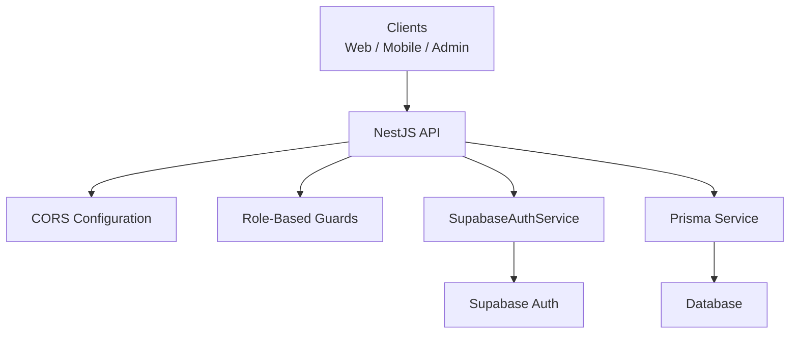
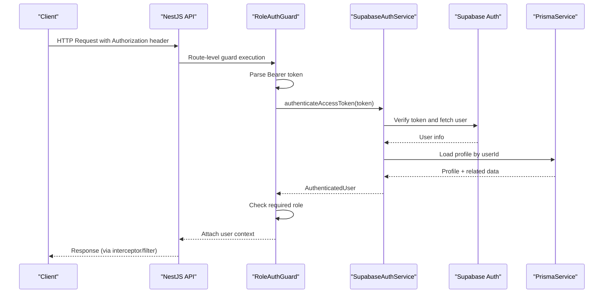
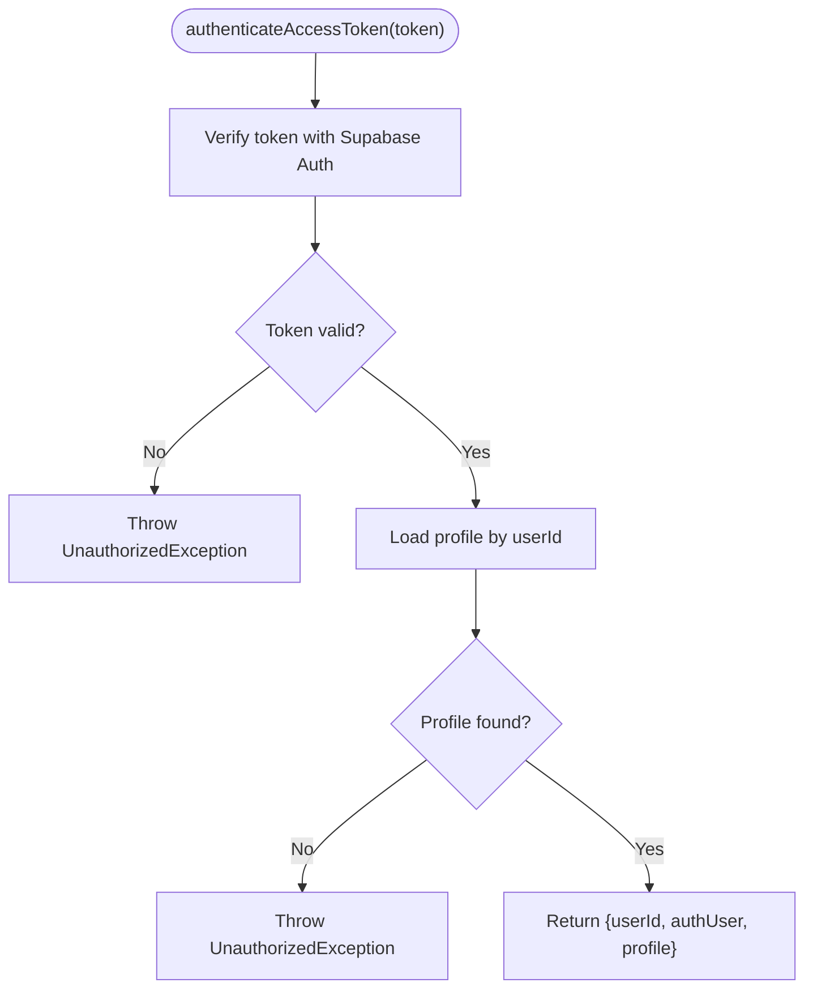
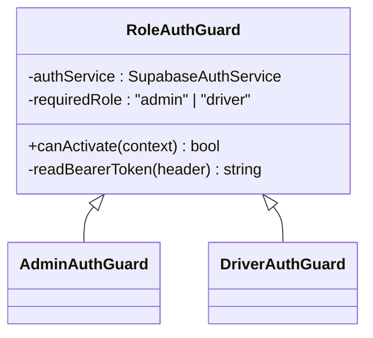
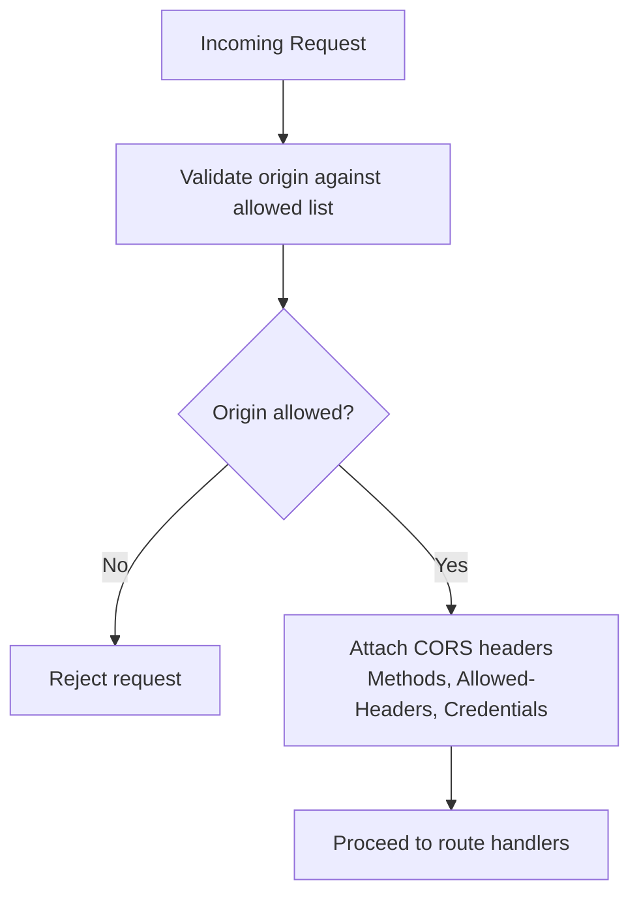
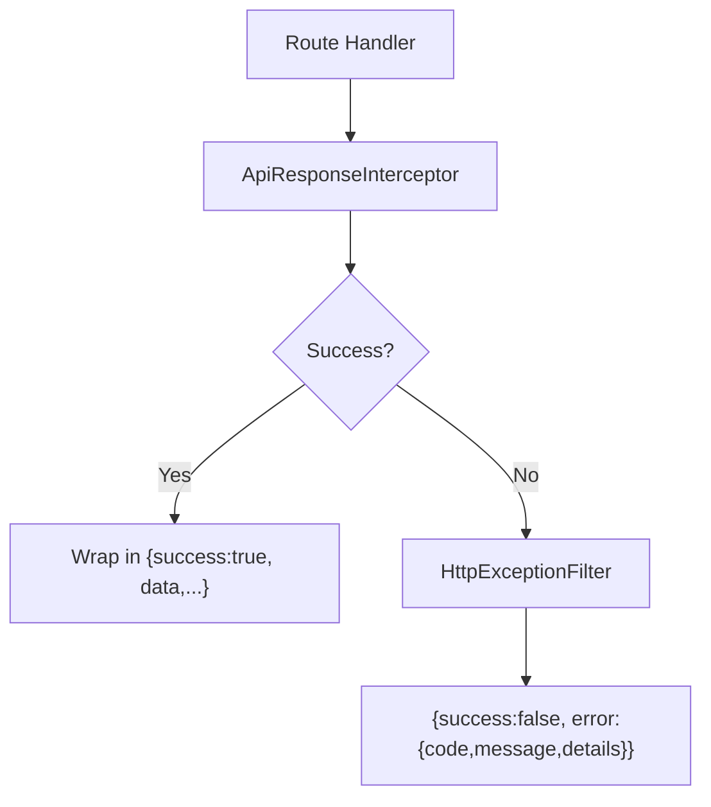
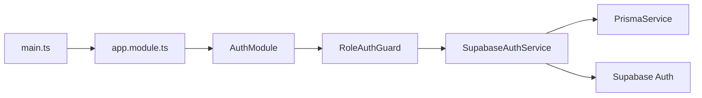

# Security Architecture

<cite>
**Referenced Files in This Document**
- [main.ts](file://apps/api/src/main.ts)
- [app.module.ts](file://apps/api/src/app.module.ts)
- [supabase-auth.service.ts](file://apps/api/src/auth/supabase-auth.service.ts)
- [role-auth.guard.ts](file://apps/api/src/auth/role-auth.guard.ts)
- [admin-auth.guard.ts](file://apps/api/src/auth/admin-auth.guard.ts)
- [driver-auth.guard.ts](file://apps/api/src/auth/driver-auth.guard.ts)
- [http-exception.filter.ts](file://apps/api/src/common/http-exception.filter.ts)
- [api-response.interceptor.ts](file://apps/api/src/common/api-response.interceptor.ts)
</cite>

## Table of Contents
1. [Introduction](#introduction)
2. [Project Structure](#project-structure)
3. [Core Components](#core-components)
4. [Architecture Overview](#architecture-overview)
5. [Detailed Component Analysis](#detailed-component-analysis)
6. [Dependency Analysis](#dependency-analysis)
7. [Performance Considerations](#performance-considerations)
8. [Troubleshooting Guide](#troubleshooting-guide)
9. [Conclusion](#conclusion)
10. [Appendices](#appendices)

## Introduction
This document describes the security architecture for authentication, authorization, data protection, and secure communication across platforms. It focuses on how the API layer validates tokens, enforces roles, manages sessions via Supabase Auth, and configures CORS and error handling. Where applicable, it also outlines mobile-specific security considerations such as secure storage, biometric authentication, and app signing.

## Project Structure
The backend is a NestJS application that:
- Configures CORS explicitly to allow specific origins and methods
- Uses global interceptors and filters for consistent responses and error handling
- Integrates Prisma for database access
- Provides an auth module with role-based guards and a Supabase-backed authentication service

**Diagram sources**
- [main.ts:7-35](file://apps/api/src/main.ts#L7-L35)
- [app.module.ts:14-27](file://apps/api/src/app.module.ts#L14-L27)
- [supabase-auth.service.ts:11-24](file://apps/api/src/auth/supabase-auth.service.ts#L11-L24)
- [role-auth.guard.ts:11-27](file://apps/api/src/auth/role-auth.guard.ts#L11-L27)

**Section sources**
- [main.ts:7-35](file://apps/api/src/main.ts#L7-L35)
- [app.module.ts:14-27](file://apps/api/src/app.module.ts#L14-L27)

## Core Components
- Authentication service: Validates credentials, creates users, and verifies access tokens using Supabase Auth. It resolves email from phone when needed and enriches context with profile data.
- Role-based guards: Extract Bearer tokens, authenticate them, enforce required roles (admin, driver), and attach user context to requests.
- Global response interceptor: Normalizes successful responses into a consistent envelope.
- Global exception filter: Converts exceptions into structured error responses with safe details.

Key responsibilities:
- Token validation and enrichment
- Role enforcement at route boundaries
- Secure configuration via environment variables
- Consistent and safe error reporting

**Section sources**
- [supabase-auth.service.ts:26-64](file://apps/api/src/auth/supabase-auth.service.ts#L26-L64)
- [role-auth.guard.ts:11-36](file://apps/api/src/auth/role-auth.guard.ts#L11-L36)
- [api-response.interceptor.ts:11-20](file://apps/api/src/common/api-response.interceptor.ts#L11-L20)
- [http-exception.filter.ts:11-43](file://apps/api/src/common/http-exception.filter.ts#L11-L43)

## Architecture Overview
The request flow enforces authentication and authorization before reaching business logic:

**Diagram sources**
- [role-auth.guard.ts:11-36](file://apps/api/src/auth/role-auth.guard.ts#L11-L36)
- [supabase-auth.service.ts:49-64](file://apps/api/src/auth/supabase-auth.service.ts#L49-L64)
- [api-response.interceptor.ts:11-20](file://apps/api/src/common/api-response.interceptor.ts#L11-L20)
- [http-exception.filter.ts:11-43](file://apps/api/src/common/http-exception.filter.ts#L11-L43)

## Detailed Component Analysis

### Authentication Service (SupabaseAuthService)
Responsibilities:
- Sign-in with password using Supabase Auth
- Create users via admin API with metadata
- Validate access tokens and load associated profiles
- Resolve email from phone number when provided as identifier

Security notes:
- Uses service role key for server-side operations
- Disables session persistence and auto-refresh on the client SDK instance used server-side
- Throws unauthorized errors for invalid credentials or missing profiles

**Diagram sources**
- [supabase-auth.service.ts:49-64](file://apps/api/src/auth/supabase-auth.service.ts#L49-L64)

**Section sources**
- [supabase-auth.service.ts:26-64](file://apps/api/src/auth/supabase-auth.service.ts#L26-L64)

### Role-Based Access Control (RoleAuthGuard and Specializations)
Responsibilities:
- Extract Bearer token from Authorization header
- Authenticate token and load user context
- Enforce required role (admin or driver)
- Attach user object to request context

**Diagram sources**
- [role-auth.guard.ts:5-36](file://apps/api/src/auth/role-auth.guard.ts#L5-L36)
- [admin-auth.guard.ts:5-9](file://apps/api/src/auth/admin-auth.guard.ts#L5-L9)
- [driver-auth.guard.ts:5-9](file://apps/api/src/auth/driver-auth.guard.ts#L5-L9)

**Section sources**
- [role-auth.guard.ts:11-36](file://apps/api/src/auth/role-auth.guard.ts#L11-L36)
- [admin-auth.guard.ts:5-9](file://apps/api/src/auth/admin-auth.guard.ts#L5-L9)
- [driver-auth.guard.ts:5-9](file://apps/api/src/auth/driver-auth.guard.ts#L5-L9)

### CORS and Secure Communication
- CORS is configured explicitly to allow specific domains and localhost patterns
- Allowed methods include common REST verbs plus OPTIONS
- Credentials are enabled for cross-origin requests
- Preflight caching reduces overhead

**Diagram sources**
- [main.ts:10-28](file://apps/api/src/main.ts#L10-L28)

**Section sources**
- [main.ts:10-28](file://apps/api/src/main.ts#L10-L28)

### Error Handling and Safe Responses
- Global interceptor wraps successful responses in a standard envelope
- Global filter converts exceptions into structured JSON with safe details (no stack traces)
- Errors include path and method for debugging without leaking internals

**Diagram sources**
- [api-response.interceptor.ts:11-20](file://apps/api/src/common/api-response.interceptor.ts#L11-L20)
- [http-exception.filter.ts:11-43](file://apps/api/src/common/http-exception.filter.ts#L11-L43)

**Section sources**
- [api-response.interceptor.ts:11-20](file://apps/api/src/common/api-response.interceptor.ts#L11-L20)
- [http-exception.filter.ts:11-43](file://apps/api/src/common/http-exception.filter.ts#L11-L43)

## Dependency Analysis
High-level dependencies:
- NestJS bootstrap wires CORS, interceptors, and filters
- AppModule imports feature modules and the auth module
- Auth module depends on SupabaseAuthService and PrismaService
- Guards depend on SupabaseAuthService for token verification and role checks

**Diagram sources**
- [main.ts:7-35](file://apps/api/src/main.ts#L7-L35)
- [app.module.ts:14-27](file://apps/api/src/app.module.ts#L14-L27)
- [role-auth.guard.ts:11-36](file://apps/api/src/auth/role-auth.guard.ts#L11-L36)
- [supabase-auth.service.ts:11-24](file://apps/api/src/auth/supabase-auth.service.ts#L11-L24)

**Section sources**
- [main.ts:7-35](file://apps/api/src/main.ts#L7-L35)
- [app.module.ts:14-27](file://apps/api/src/app.module.ts#L14-L27)

## Performance Considerations
- CORS preflight caching reduces repeated OPTIONS requests
- Token verification leverages Supabase’s server-side validation; avoid redundant checks
- Keep profile queries minimal and indexed appropriately in the database
- Use global interceptors/filters to reduce per-route boilerplate and ensure consistent performance characteristics

[No sources needed since this section provides general guidance]

## Troubleshooting Guide
Common issues and resolutions:
- Invalid or expired token: Ensure clients send a valid Bearer token; verify token lifecycle in Supabase and refresh as needed
- Missing profile: Confirm user has a corresponding profile record after account creation
- Insufficient permissions: Verify the user’s role matches the required role for the endpoint
- CORS failures: Check that the client origin is included in the allowed list and that credentials are properly handled
- Unexpected errors: Review structured error responses for code and details; inspect logs on the server side

**Section sources**
- [supabase-auth.service.ts:26-64](file://apps/api/src/auth/supabase-auth.service.ts#L26-L64)
- [role-auth.guard.ts:11-36](file://apps/api/src/auth/role-auth.guard.ts#L11-L36)
- [http-exception.filter.ts:11-43](file://apps/api/src/common/http-exception.filter.ts#L11-L43)

## Conclusion
The API implements a robust, layered security model:
- Authentication via Supabase Auth with server-side token verification
- Role-based authorization enforced through reusable guards
- Secure CORS configuration limiting cross-origin access
- Consistent, safe error handling and response formatting
For full coverage, integrate input validation, SQL injection prevention, XSS protection, CSRF mitigation, encryption at rest/in transit, secrets management, rate limiting, and mobile-specific safeguards as outlined below.

[No sources needed since this section summarizes without analyzing specific files]

## Appendices

### JWT Token Lifecycle (Recommended Implementation)
- Issuance: After successful sign-in, obtain a short-lived access token and a refresh token from Supabase Auth
- Usage: Clients include the access token in the Authorization header for each request
- Validation: Server verifies the token signature and expiry via Supabase Auth
- Refresh: When the access token expires, use the refresh token to obtain a new access token
- Revocation: Invalidate tokens if compromise is suspected; rely on Supabase token revocation features

[No sources needed since this section provides conceptual guidance]

### Role-Based Access Control (RBAC) Best Practices
- Define explicit roles (e.g., admin, driver) and enforce them at route boundaries using guards
- Store role information in profiles and validate on every protected request
- Apply least privilege: only expose endpoints necessary for each role
- Audit role changes and maintain an immutable log of permission updates

[No sources needed since this section provides conceptual guidance]

### Session Management Strategies
- Prefer stateless JWTs for API calls; store tokens securely in clients
- For web apps, consider HttpOnly cookies for refresh tokens and short-lived access tokens
- Implement token rotation and sliding expiration where appropriate
- Centralize logout and token invalidation flows

[No sources needed since this section provides conceptual guidance]

### Input Validation, SQL Injection Prevention, XSS Protection, CSRF Mitigation
- Input validation: Validate and sanitize all inputs at API boundaries using schema validators
- SQL injection prevention: Use parameterized queries or an ORM (Prisma) exclusively; never concatenate raw SQL
- XSS protection: Escape outputs in UI layers; enforce Content Security Policy headers in reverse proxy or CDN
- CSRF mitigation: For cookie-based sessions, implement CSRF tokens; prefer stateless JWTs to simplify CSRF concerns

[No sources needed since this section provides conceptual guidance]

### Secure Communication Patterns
- Enforce HTTPS everywhere; configure TLS termination at the edge
- Restrict CORS to known origins and methods; avoid wildcard origins in production
- Set security headers (e.g., HSTS, X-Content-Type-Options, Referrer-Policy) at the gateway or reverse proxy

[No sources needed since this section provides conceptual guidance]

### Encryption at Rest and In Transit
- In transit: TLS for all endpoints; pin certificates where feasible
- At rest: Enable database encryption and encrypt sensitive fields at the application layer when necessary

[No sources needed since this section provides conceptual guidance]

### Secrets Management
- Store secrets (e.g., Supabase keys) in environment variables managed by your deployment platform
- Never commit secrets to version control; rotate regularly
- Limit service role key usage to privileged server-side operations only

[No sources needed since this section provides conceptual guidance]

### Security Headers and CORS Policies
- Configure strict CORS policies with explicit origins and methods
- Add security headers at the reverse proxy or CDN layer
- Cache preflight responses to improve performance while maintaining security

**Section sources**
- [main.ts:10-28](file://apps/api/src/main.ts#L10-L28)

### Rate Limiting Strategies
- Implement rate limiting at the API gateway or reverse proxy to protect endpoints from abuse
- Use IP-based and user-based throttling for sensitive actions (login, password reset)
- Monitor and alert on anomalous traffic patterns

[No sources needed since this section provides conceptual guidance]

### Mobile-Specific Security Concerns
- Secure storage: Use platform keystores (Android Keystore, iOS Keychain) for tokens and secrets
- Biometric authentication: Gate sensitive actions behind biometric prompts on supported devices
- App signing: Sign releases with strong keys; enable integrity checks where possible
- Certificate pinning: Consider pinning to your API’s certificate for added protection
- Obfuscation and anti-tampering: Use build-time obfuscation and runtime checks to deter reverse engineering

[No sources needed since this section provides conceptual guidance]

### Examples of Secure API Endpoints and Middleware
- Protected endpoints: Require Bearer tokens and enforce role-based guards for admin and driver routes
- Middleware pattern: Centralize logging, request ID propagation, and audit trails in global interceptors
- Example flows:
  - Login: Validate credentials, return tokens, and set up client-side secure storage
  - Data mutation: Validate inputs, enforce RBAC, and return standardized success/error envelopes

[No sources needed since this section provides conceptual guidance]