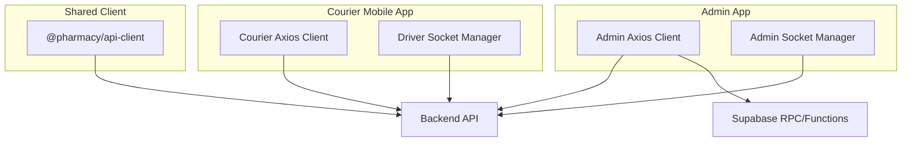
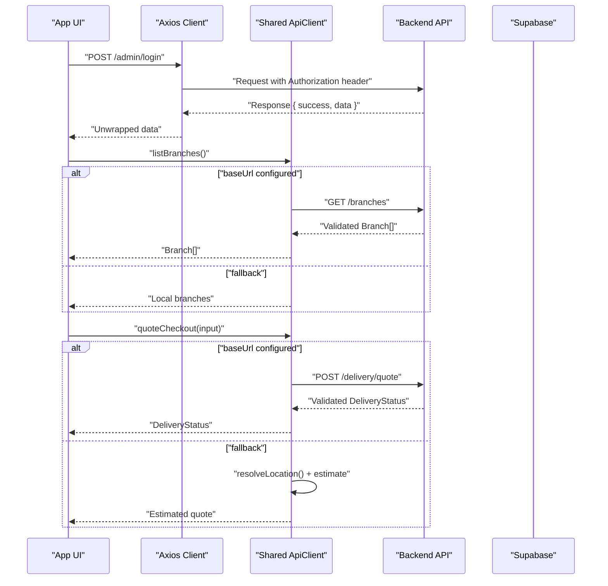
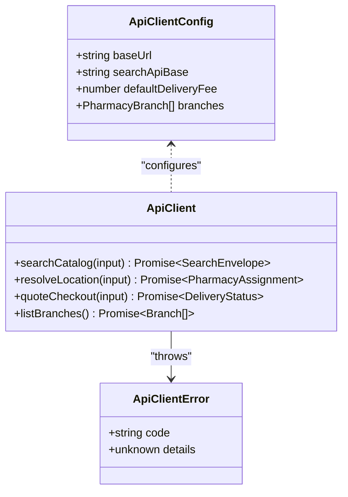
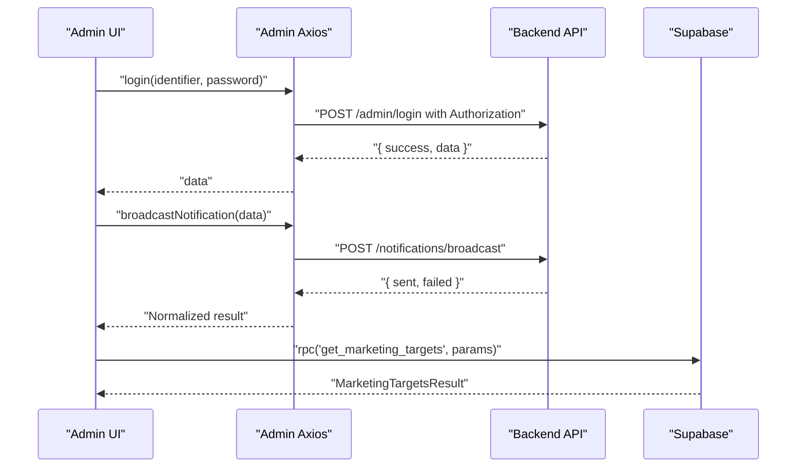
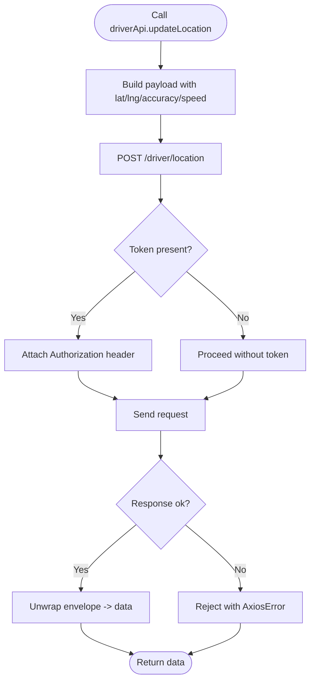
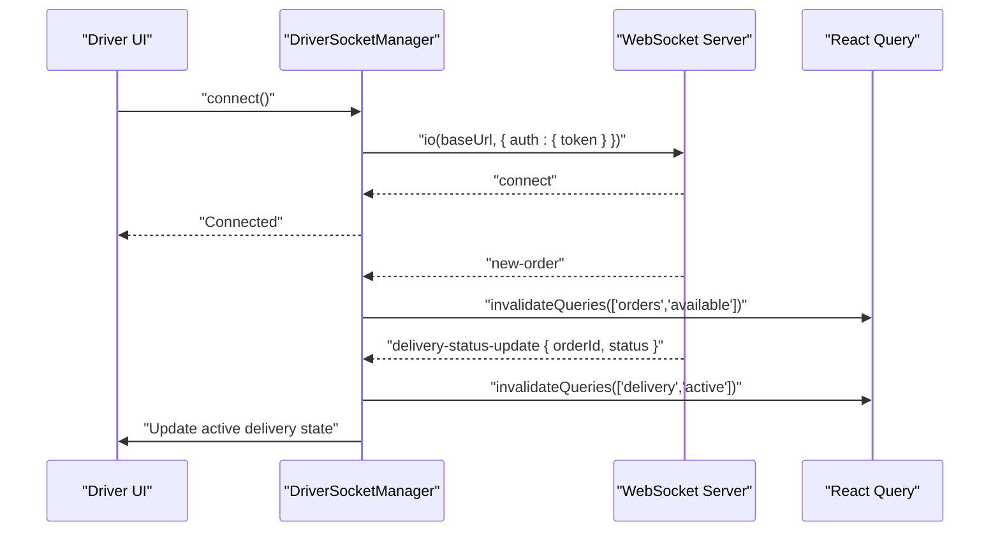
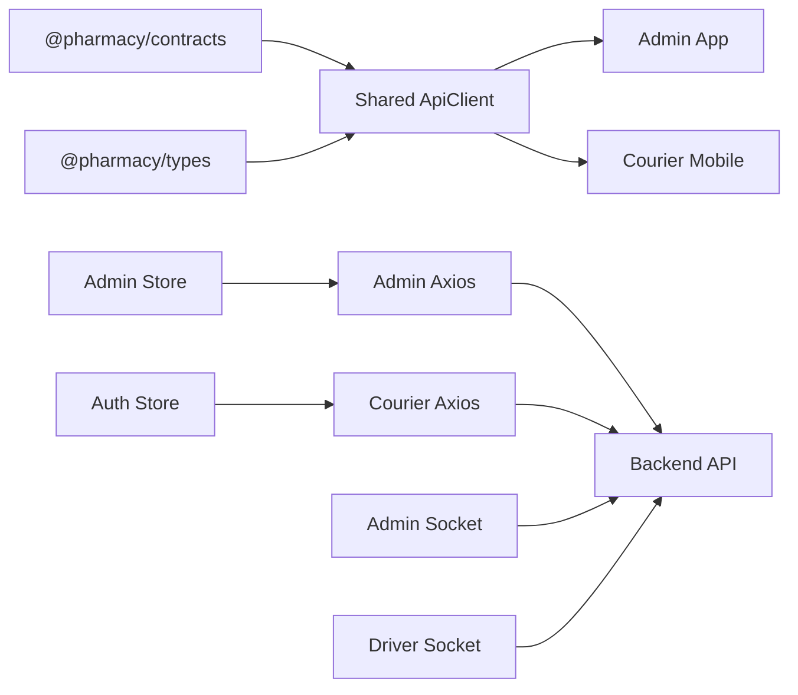

# API Client Library

<cite>
**Referenced Files in This Document**
- [index.ts](file://packages/api-client/src/index.ts)
- [package.json](file://packages/api-client/package.json)
- [api.ts (Admin)](file://apps/admin/src/lib/api.ts)
- [socket.ts (Admin)](file://apps/admin/src/lib/socket.ts)
- [api.ts (Courier Mobile)](file://apps/courier-mobile/src/lib/api.ts)
- [socket.ts (Courier Mobile)](file://apps/courier-mobile/src/lib/socket.ts)
</cite>

## Table of Contents
1. [Introduction](#introduction)
2. [Project Structure](#project-structure)
3. [Core Components](#core-components)
4. [Architecture Overview](#architecture-overview)
5. [Detailed Component Analysis](#detailed-component-analysis)
6. [Dependency Analysis](#dependency-analysis)
7. [Performance Considerations](#performance-considerations)
8. [Troubleshooting Guide](#troubleshooting-guide)
9. [Conclusion](#conclusion)
10. [Appendices](#appendices)

## Introduction
This document explains the centralized API client library and how applications communicate with the backend. It covers request/response handling, error management, caching strategies, authentication integration, real-time WebSocket connections, typed API methods, interceptors, retry mechanisms, offline support, performance optimization, request batching, debugging, extending endpoints, and versioning compatibility.

The repository implements a shared API client package for domain-level operations and per-app HTTP clients using Axios with interceptors for authentication and error handling. Real-time updates are provided via Socket.IO-based managers in both Admin and Courier Mobile apps.

## Project Structure
At a high level:
- packages/api-client: Shared client abstraction for search, branch listing, location assignment, and delivery quoting with response validation and fallbacks.
- apps/admin: Web admin app with an Axios-based HTTP client and a Socket.IO manager for live driver locations.
- apps/courier-mobile: Driver mobile app with an Axios-based HTTP client and a Socket.IO manager for order events and status updates.

**Diagram sources**
- [index.ts:40-67](file://packages/api-client/src/index.ts#L40-L67)
- [api.ts (Admin):6-29](file://apps/admin/src/lib/api.ts#L6-L29)
- [socket.ts (Admin):6-36](file://apps/admin/src/lib/socket.ts#L6-L36)
- [api.ts (Courier Mobile):18-43](file://apps/courier-mobile/src/lib/api.ts#L18-L43)
- [socket.ts (Courier Mobile):18-69](file://apps/courier-mobile/src/lib/socket.ts#L18-L69)

**Section sources**
- [index.ts:40-67](file://packages/api-client/src/index.ts#L40-L67)
- [api.ts (Admin):6-29](file://apps/admin/src/lib/api.ts#L6-L29)
- [api.ts (Courier Mobile):18-43](file://apps/courier-mobile/src/lib/api.ts#L18-L43)

## Core Components
- Shared API client (packages/api-client):
  - Configurable base URL and optional local branches.
  - Typed fetch wrapper that validates responses against schemas and throws structured errors.
  - Methods for searching catalog, listing branches, resolving nearest branch, and quoting delivery cost.
  - Fallback logic to keep UI functional when backend is unavailable.

- Admin HTTP client (apps/admin):
  - Axios instance with timeout and JSON headers.
  - Request interceptor attaches Bearer token from store.
  - Response interceptor handles 401 by logging out and redirecting.
  - Typed helpers for admin endpoints and marketing features via Supabase RPC/Edge Functions.

- Courier Mobile HTTP client (apps/courier-mobile):
  - Axios instance with dynamic base URL resolution.
  - Request interceptor attaches Bearer token; response interceptor logs out on 401.
  - Generic typed helpers (get/post/patch/delete) that unwrap standardized envelopes.
  - Driver-specific endpoints including auth, profile, orders, location, and document upload.

- Real-time sockets:
  - Admin socket manager connects to /driver-locations with token auth and reconnection.
  - Driver socket manager connects to backend with token auth, reconnection limits, and event handlers for new orders, delivery status updates, and assignments.

**Section sources**
- [index.ts:69-122](file://packages/api-client/src/index.ts#L69-L122)
- [index.ts:242-341](file://packages/api-client/src/index.ts#L242-L341)
- [api.ts (Admin):6-89](file://apps/admin/src/lib/api.ts#L6-L89)
- [api.ts (Courier Mobile):18-71](file://apps/courier-mobile/src/lib/api.ts#L18-L71)
- [socket.ts (Admin):6-61](file://apps/admin/src/lib/socket.ts#L6-L61)
- [socket.ts (Courier Mobile):18-87](file://apps/courier-mobile/src/lib/socket.ts#L18-L87)

## Architecture Overview
The system uses a layered approach:
- Per-app HTTP clients encapsulate transport details, authentication, and error handling.
- The shared client provides domain-focused APIs with strong typing and validation, falling back to local data when needed.
- Real-time communication is handled by dedicated socket managers per app, integrating with React Query invalidation where applicable.

**Diagram sources**
- [api.ts (Admin):6-29](file://apps/admin/src/lib/api.ts#L6-L29)
- [index.ts:247-341](file://packages/api-client/src/index.ts#L247-L341)

## Detailed Component Analysis

### Shared ApiClient (packages/api-client)
Responsibilities:
- Centralized configuration via configureApiClient.
- Typed fetch wrapper that parses responses using schema validation and throws ApiClientError with code and details.
- Domain methods:
  - searchCatalog: returns suggestions, results, collections, facets, and timestamps.
  - listBranches: prefers backend source if baseUrl is set; otherwise falls back to configured branches.
  - resolveLocation: computes nearest branch using haversine distance and builds ETA band.
  - quoteCheckout: calls backend quote endpoint or estimates locally.

Key implementation patterns:
- Response normalization and validation ensure consistent shape across endpoints.
- Error propagation includes structured codes for easier handling at call sites.
- Local fallbacks maintain UX during development or backend unavailability.

**Diagram sources**
- [index.ts:40-67](file://packages/api-client/src/index.ts#L40-L67)
- [index.ts:69-78](file://packages/api-client/src/index.ts#L69-L78)
- [index.ts:242-341](file://packages/api-client/src/index.ts#L242-L341)

**Section sources**
- [index.ts:40-67](file://packages/api-client/src/index.ts#L40-L67)
- [index.ts:69-122](file://packages/api-client/src/index.ts#L69-L122)
- [index.ts:242-341](file://packages/api-client/src/index.ts#L242-L341)

### Admin HTTP Client (apps/admin)
Features:
- Axios instance with baseURL, timeout, and JSON content type.
- Request interceptor injects Bearer token from admin store.
- Response interceptor handles 401 by clearing session and redirecting to login.
- Typed adminApi methods for drivers, orders, stats, notifications, branches, inventory, products, customers.
- Marketing API integrates directly with Supabase RPC and Edge Functions for campaign workflows.

**Diagram sources**
- [api.ts (Admin):6-89](file://apps/admin/src/lib/api.ts#L6-L89)
- [api.ts (Admin):147-328](file://apps/admin/src/lib/api.ts#L147-L328)

**Section sources**
- [api.ts (Admin):6-89](file://apps/admin/src/lib/api.ts#L6-L89)
- [api.ts (Admin):147-328](file://apps/admin/src/lib/api.ts#L147-L328)

### Courier Mobile HTTP Client (apps/courier-mobile)
Features:
- Dynamic base URL resolution supporting Expo constants.
- Axios instance with timeout and JSON headers.
- Request interceptor attaches Bearer token; response interceptor logs out on 401.
- Generic typed helpers (apiGet, apiPost, apiPatch, apiDelete) that unwrap standardized envelopes.
- Driver-specific endpoints covering auth, profile, statistics, status toggles, location updates, order lifecycle, document uploads, and push token registration.

**Diagram sources**
- [api.ts (Courier Mobile):18-71](file://apps/courier-mobile/src/lib/api.ts#L18-L71)
- [api.ts (Courier Mobile):75-160](file://apps/courier-mobile/src/lib/api.ts#L75-L160)

**Section sources**
- [api.ts (Courier Mobile):18-71](file://apps/courier-mobile/src/lib/api.ts#L18-L71)
- [api.ts (Courier Mobile):75-160](file://apps/courier-mobile/src/lib/api.ts#L75-L160)

### Real-Time WebSocket Connections
Admin socket manager:
- Connects to /driver-locations with token auth and websocket transport.
- Reconnection enabled with exponential backoff caps.
- Listener registry ensures callbacks persist across reconnects.

Driver socket manager:
- Connects to backend root with token auth, websocket transport, timeouts, and limited reconnection attempts.
- Listens for new-order, delivery-status-update, and order-assigned events.
- Integrates with React Query to invalidate relevant queries upon events.

**Diagram sources**
- [socket.ts (Courier Mobile):18-87](file://apps/courier-mobile/src/lib/socket.ts#L18-L87)
- [socket.ts (Admin):6-61](file://apps/admin/src/lib/socket.ts#L6-L61)

**Section sources**
- [socket.ts (Admin):6-61](file://apps/admin/src/lib/socket.ts#L6-L61)
- [socket.ts (Courier Mobile):18-87](file://apps/courier-mobile/src/lib/socket.ts#L18-L87)

## Dependency Analysis
- Shared client depends on Zod-like schema validation via contracts and types for response parsing.
- Admin and Courier clients depend on their respective stores for token retrieval and side effects like redirects or logout.
- Sockets depend on environment variables/constants for base URLs and integrate with query invalidation for cache consistency.

**Diagram sources**
- [package.json:16-19](file://packages/api-client/package.json#L16-L19)
- [index.ts:1-18](file://packages/api-client/src/index.ts#L1-L18)
- [api.ts (Admin):1-29](file://apps/admin/src/lib/api.ts#L1-L29)
- [api.ts (Courier Mobile):1-43](file://apps/courier-mobile/src/lib/api.ts#L1-L43)
- [socket.ts (Admin):1-36](file://apps/admin/src/lib/socket.ts#L1-L36)
- [socket.ts (Courier Mobile):1-36](file://apps/courier-mobile/src/lib/socket.ts#L1-L36)

**Section sources**
- [package.json:16-19](file://packages/api-client/package.json#L16-L19)
- [index.ts:1-18](file://packages/api-client/src/index.ts#L1-L18)
- [api.ts (Admin):1-29](file://apps/admin/src/lib/api.ts#L1-L29)
- [api.ts (Courier Mobile):1-43](file://apps/courier-mobile/src/lib/api.ts#L1-L43)

## Performance Considerations
- Timeouts: Both Axios instances use a 15-second timeout to avoid hanging requests.
- Response validation: Shared client validates responses early to fail fast and reduce downstream processing.
- Fallbacks: Shared client gracefully falls back to local data when backend is unreachable, improving perceived performance.
- Real-time updates: Driver socket invalidates only affected queries to minimize unnecessary refetches.
- Recommendations:
  - Use query caching and background refetch policies in your app layer to reduce network load.
  - Batch related mutations where possible to reduce server round-trips.
  - Prefer GET with pagination and filtering for large lists.
  - Debounce frequent location updates to limit bandwidth usage.

[No sources needed since this section provides general guidance]

## Troubleshooting Guide
Common issues and resolutions:
- 401 Unauthorized:
  - Admin and Courier clients log out users and clear sessions on 401 responses. Ensure tokens are refreshed before making requests.
- Invalid response shape:
  - Shared client throws ApiClientError with code INVALID_RESPONSE. Check backend contract changes and update schemas accordingly.
- Socket connection failures:
  - Verify base URL configuration and token presence. Check reconnection settings and server availability.
- Offline mode:
  - Shared client can operate with local branches and estimated quotes when baseUrl is not configured. For full offline support, implement local persistence and queue retries at the app layer.

**Section sources**
- [api.ts (Admin):20-29](file://apps/admin/src/lib/api.ts#L20-L29)
- [api.ts (Courier Mobile):33-43](file://apps/courier-mobile/src/lib/api.ts#L33-L43)
- [index.ts:87-122](file://packages/api-client/src/index.ts#L87-L122)
- [socket.ts (Admin):10-36](file://apps/admin/src/lib/socket.ts#L10-L36)
- [socket.ts (Courier Mobile):24-49](file://apps/courier-mobile/src/lib/socket.ts#L24-L49)

## Conclusion
The API client library combines a robust shared client with per-app HTTP and real-time layers. It emphasizes typed interactions, strict response validation, and resilient fallbacks. Authentication is integrated via interceptors, and real-time updates are managed through dedicated socket managers. Following the guidelines here will help you extend endpoints, handle errors consistently, optimize performance, and maintain compatibility across versions.

[No sources needed since this section summarizes without analyzing specific files]

## Appendices

### Making API Calls and Handling Responses
- Admin:
  - Use adminApi methods for authenticated endpoints; they automatically attach tokens and normalize responses.
  - Example path references:
    - [Login:34-35](file://apps/admin/src/lib/api.ts#L34-L35)
    - [Get all drivers:41-42](file://apps/admin/src/lib/api.ts#L41-L42)
    - [Broadcast notification:71-82](file://apps/admin/src/lib/api.ts#L71-L82)
- Courier Mobile:
  - Use driverApi methods; generic helpers unwrap envelopes and return typed data.
  - Example path references:
    - [Login:77-83](file://apps/courier-mobile/src/lib/api.ts#L77-L83)
    - [Update location:95-103](file://apps/courier-mobile/src/lib/api.ts#L95-L103)
    - [Complete delivery:126-132](file://apps/courier-mobile/src/lib/api.ts#L126-L132)

**Section sources**
- [api.ts (Admin):33-89](file://apps/admin/src/lib/api.ts#L33-L89)
- [api.ts (Courier Mobile):75-160](file://apps/courier-mobile/src/lib/api.ts#L75-L160)

### Implementing Custom Interceptors
- Add request interceptors to inject tokens or correlation IDs.
- Add response interceptors to transform payloads or handle global errors (e.g., 401).
- Reference implementations:
  - [Admin request/response interceptors:12-29](file://apps/admin/src/lib/api.ts#L12-L29)
  - [Courier request/response interceptors:24-43](file://apps/courier-mobile/src/lib/api.ts#L24-L43)

**Section sources**
- [api.ts (Admin):12-29](file://apps/admin/src/lib/api.ts#L12-L29)
- [api.ts (Courier Mobile):24-43](file://apps/courier-mobile/src/lib/api.ts#L24-L43)

### Retry Mechanisms and Offline Support
- Current behavior:
  - No built-in retry in Axios instances; rely on application-level retry policies if needed.
  - Shared client provides fallbacks for certain operations when baseUrl is not configured.
- Recommendations:
  - Implement exponential backoff retries for transient errors at the app layer.
  - Queue mutations offline and replay when connectivity resumes.
  - Use queryClient options to control refetchOnWindowFocus and stale times.

[No sources needed since this section provides general guidance]

### Extending the Client with New Endpoints
- Shared client:
  - Add new methods to the client object and export via getApiClient.
  - Use fetchWrapped for validated responses and define schemas in contracts.
  - Reference: [Client methods:242-341](file://packages/api-client/src/index.ts#L242-L341)
- Per-app clients:
  - Add typed helpers or module-specific functions following existing patterns.
  - Reference: [Admin endpoints:33-89](file://apps/admin/src/lib/api.ts#L33-L89), [Courier endpoints:75-160](file://apps/courier-mobile/src/lib/api.ts#L75-L160)

**Section sources**
- [index.ts:242-341](file://packages/api-client/src/index.ts#L242-L341)
- [api.ts (Admin):33-89](file://apps/admin/src/lib/api.ts#L33-L89)
- [api.ts (Courier Mobile):75-160](file://apps/courier-mobile/src/lib/api.ts#L75-L160)

### Versioning Compatibility
- Envelope unwrapping:
  - Courier client supports both direct payloads and standardized envelopes.
  - Reference: [Envelope unwrap helper:47-59](file://apps/courier-mobile/src/lib/api.ts#L47-L59)
- Schema validation:
  - Shared client enforces response shapes; update schemas when backend evolves.
  - Reference: [fetchWrapped validation:87-122](file://packages/api-client/src/index.ts#L87-L122)
- Best practices:
  - Introduce versioned routes (e.g., /v1/) when breaking changes occur.
  - Maintain backward-compatible envelopes while deprecating old fields gradually.

**Section sources**
- [api.ts (Courier Mobile):47-59](file://apps/courier-mobile/src/lib/api.ts#L47-L59)
- [index.ts:87-122](file://packages/api-client/src/index.ts#L87-L122)