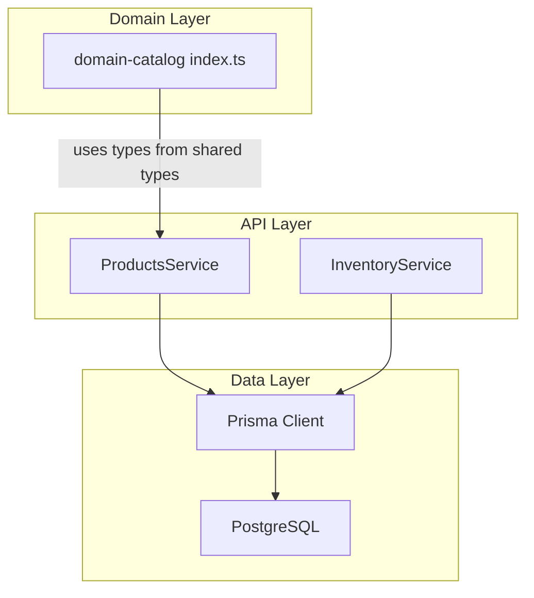
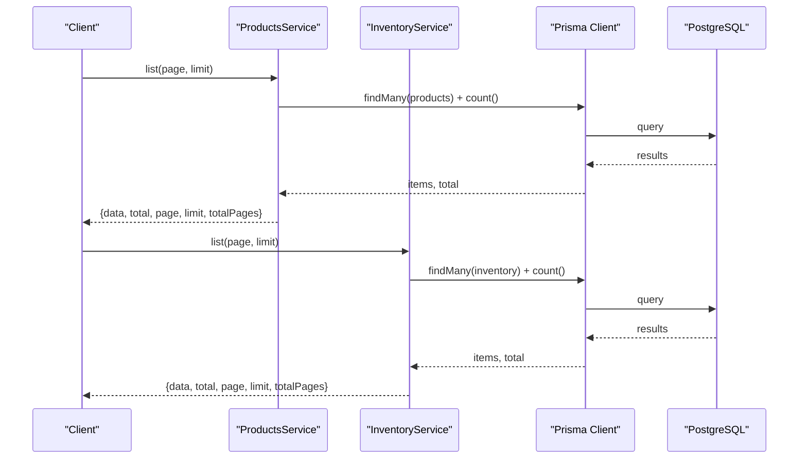
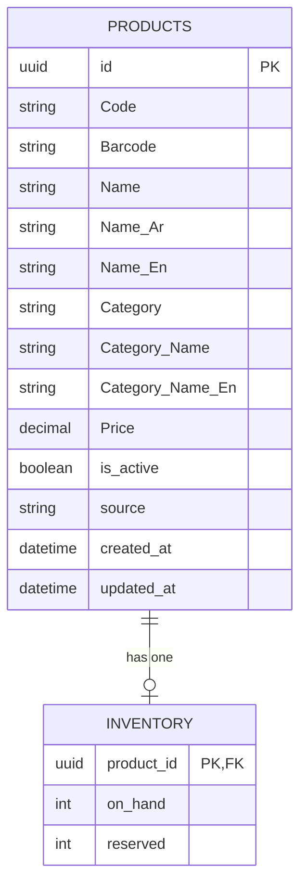
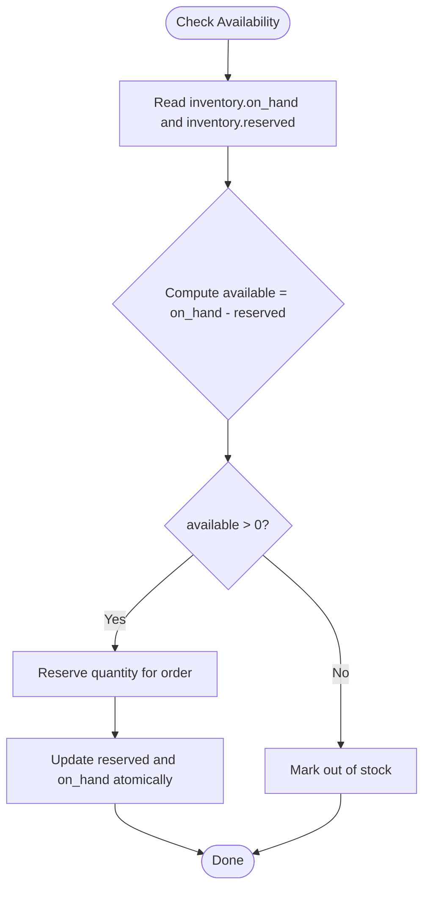
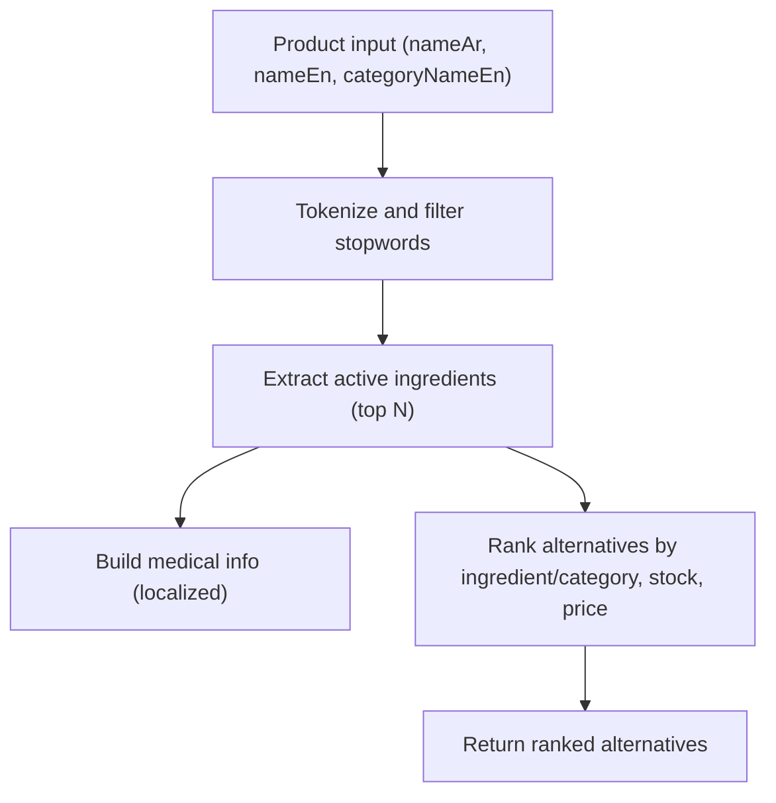
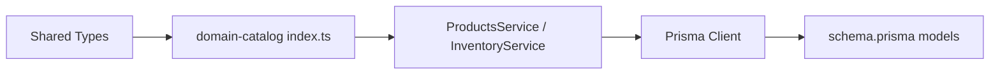

# Domain Catalog

<cite>
**Referenced Files in This Document**
- [index.ts](file://packages/domain-catalog/src/index.ts)
- [products.service.ts](file://apps/api/src/modules/products/products.service.ts)
- [inventory.service.ts](file://apps/api/src/modules/inventory/inventory.service.ts)
- [schema.prisma](file://apps/api/prisma/schema.prisma)
</cite>

## Table of Contents
1. [Introduction](#introduction)
2. [Project Structure](#project-structure)
3. [Core Components](#core-components)
4. [Architecture Overview](#architecture-overview)
5. [Detailed Component Analysis](#detailed-component-analysis)
6. [Dependency Analysis](#dependency-analysis)
7. [Performance Considerations](#performance-considerations)
8. [Troubleshooting Guide](#troubleshooting-guide)
9. [Conclusion](#conclusion)
10. [Appendices](#appendices)

## Introduction
This document explains the Domain Catalog package and its integration with the API layer to manage product catalog business logic and data structures. It covers product entity modeling, category handling, pricing fields, inventory integration patterns, search and filtering capabilities, availability checks, and versioning strategies. It also provides examples for CRUD operations, bulk updates, and synchronization workflows, along with performance optimization, caching strategies, and real-time inventory updates across multiple branches.

## Project Structure
The domain catalog functionality is split into:
- A pure domain utility module that processes product data for search, medical info generation, and alternative product ranking.
- An API service layer that exposes paginated listing for products and inventory via Prisma.
- A database schema defining the core entities (products, inventory) and their relationships.

**Diagram sources**
- [index.ts:1-126](file://packages/domain-catalog/src/index.ts#L1-L126)
- [products.service.ts:1-27](file://apps/api/src/modules/products/products.service.ts#L1-L27)
- [inventory.service.ts:1-27](file://apps/api/src/modules/inventory/inventory.service.ts#L1-L27)
- [schema.prisma:595-613](file://apps/api/prisma/schema.prisma#L595-L613)
- [schema.prisma:529-536](file://apps/api/prisma/schema.prisma#L529-L536)

**Section sources**
- [index.ts:1-126](file://packages/domain-catalog/src/index.ts#L1-L126)
- [products.service.ts:1-27](file://apps/api/src/modules/products/products.service.ts#L1-L27)
- [inventory.service.ts:1-27](file://apps/api/src/modules/inventory/inventory.service.ts#L1-L27)
- [schema.prisma:595-613](file://apps/api/prisma/schema.prisma#L595-L613)
- [schema.prisma:529-536](file://apps/api/prisma/schema.prisma#L529-L536)

## Core Components
- Product entity model: defines identifiers, names (multilingual), category fields, price, active flag, source, timestamps, and a one-to-one relationship with inventory.
- Inventory model: tracks on-hand and reserved quantities per product.
- Domain utilities: tokenization, ingredient extraction, medical info builder, and alternative product ranking based on ingredients and category.
- API services: paginated listing for products and inventory using Prisma queries.

Key responsibilities:
- Domain utilities transform raw product data into enriched views for UI and recommendations.
- Services provide efficient pagination and counts for large catalogs.
- Schema enforces relational integrity between products and inventory.

**Section sources**
- [schema.prisma:595-613](file://apps/api/prisma/schema.prisma#L595-L613)
- [schema.prisma:529-536](file://apps/api/prisma/schema.prisma#L529-L536)
- [index.ts:25-84](file://packages/domain-catalog/src/index.ts#L25-L84)
- [index.ts:86-125](file://packages/domain-catalog/src/index.ts#L86-L125)
- [products.service.ts:8-25](file://apps/api/src/modules/products/products.service.ts#L8-L25)
- [inventory.service.ts:8-25](file://apps/api/src/modules/inventory/inventory.service.ts#L8-L25)

## Architecture Overview
The catalog architecture separates concerns:
- Domain utilities operate on typed product shapes to compute derived information without side effects.
- API services orchestrate persistence via Prisma and return structured responses.
- Database schema models the canonical product and inventory state.

**Diagram sources**
- [products.service.ts:8-25](file://apps/api/src/modules/products/products.service.ts#L8-L25)
- [inventory.service.ts:8-25](file://apps/api/src/modules/inventory/inventory.service.ts#L8-L25)
- [schema.prisma:595-613](file://apps/api/prisma/schema.prisma#L595-L613)
- [schema.prisma:529-536](file://apps/api/prisma/schema.prisma#L529-L536)

## Detailed Component Analysis

### Product Entity Model
- Fields include unique identifier, optional code/barcode, multilingual names, category and localized category names, price, active status, source, and timestamps.
- One-to-one relation to inventory enables stock tracking per product.

**Diagram sources**
- [schema.prisma:595-613](file://apps/api/prisma/schema.prisma#L595-L613)
- [schema.prisma:529-536](file://apps/api/prisma/schema.prisma#L529-L536)

**Section sources**
- [schema.prisma:595-613](file://apps/api/prisma/schema.prisma#L595-L613)
- [schema.prisma:529-536](file://apps/api/prisma/schema.prisma#L529-L536)

### Category Handling and Hierarchies
- The current schema stores category as a flat field with localized names. No explicit hierarchy table exists.
- To support hierarchies, introduce a categories table with parent references and update product references accordingly.

Recommendation:
- Add a categories table with fields like id, name_en, name_ar, slug, parent_id, and order.
- Replace product.category with a foreign key to categories.id.
- Provide APIs to traverse and render hierarchical trees.

[No sources needed since this section proposes future changes not present in the current schema]

### Pricing Calculations
- Price is stored directly on the product entity.
- For promotions or discounts, consider adding discount fields or a separate promotion model linked to products.
- When computing final price, apply discounts and taxes at the service layer before returning to clients.

[No sources needed since this section provides general guidance]

### Inventory Integration Patterns
- Inventory tracks on_hand and reserved per product.
- Availability can be computed as on_hand - reserved; ensure non-negative values and enforce constraints if necessary.
- Order fulfillment should decrement on_hand and increment reserved during reservation, then finalize by adjusting reserved upon shipment.

**Diagram sources**
- [schema.prisma:529-536](file://apps/api/prisma/schema.prisma#L529-L536)

**Section sources**
- [schema.prisma:529-536](file://apps/api/prisma/schema.prisma#L529-L536)

### Search and Filtering Capabilities
- Tokenization filters stopwords and normalizes text for ingredient extraction.
- Active ingredient extraction supports bilingual names and returns top tokens.
- Alternative product ranking uses ingredient overlap and category match to suggest substitutes.

**Diagram sources**
- [index.ts:25-84](file://packages/domain-catalog/src/index.ts#L25-L84)
- [index.ts:86-125](file://packages/domain-catalog/src/index.ts#L86-L125)

**Section sources**
- [index.ts:25-84](file://packages/domain-catalog/src/index.ts#L25-L84)
- [index.ts:86-125](file://packages/domain-catalog/src/index.ts#L86-L125)

### Product Availability Checks
- Use inventory.on_hand and inventory.reserved to determine availability.
- Ensure atomic updates when reserving stock to prevent overselling.
- Surface availability flags to clients for display and purchase gating.

[No sources needed since this section provides general guidance]

### Catalog Versioning Strategies
- Current schema lacks explicit versioning. Recommended approaches:
  - Soft delete with effective dates: add start_date and end_date to products to control visibility over time.
  - Snapshotting: store product snapshots in order_items to preserve historical pricing and details.
  - Versioned updates: maintain a versions table or use audit logs to track changes.

[No sources needed since this section provides general guidance]

### Examples: Product CRUD Operations
- List products with pagination:
  - Service method computes skip/take and returns items plus total and page metadata.
- Create/Update/Delete:
  - Implement create/update/delete endpoints using Prisma methods on the products model.
  - Validate inputs and handle conflicts (e.g., duplicate codes).

Reference implementation pattern:
- Paginated listing pattern used in products service.

**Section sources**
- [products.service.ts:8-25](file://apps/api/src/modules/products/products.service.ts#L8-L25)

### Bulk Updates
- Use Prisma’s updateMany or transactional batches to update multiple products efficiently.
- Apply validation and change detection before persisting.
- Emit events or logs for auditability.

[No sources needed since this section provides general guidance]

### Catalog Synchronization Workflows
- Ingest external catalogs by mapping fields to the products schema.
- Handle upserts to reconcile differences and maintain consistency.
- Sync inventory separately to reflect stock changes from suppliers or warehouses.

[No sources needed since this section provides general guidance]

## Dependency Analysis
- Domain utilities depend on shared types for product shapes and do not access persistence.
- API services depend on Prisma and expose REST endpoints (controllers not shown here).
- Database schema defines entities and relationships consumed by Prisma.

**Diagram sources**
- [index.ts:1-5](file://packages/domain-catalog/src/index.ts#L1-L5)
- [products.service.ts:1-6](file://apps/api/src/modules/products/products.service.ts#L1-L6)
- [inventory.service.ts:1-6](file://apps/api/src/modules/inventory/inventory.service.ts#L1-L6)
- [schema.prisma:595-613](file://apps/api/prisma/schema.prisma#L595-L613)
- [schema.prisma:529-536](file://apps/api/prisma/schema.prisma#L529-L536)

**Section sources**
- [index.ts:1-5](file://packages/domain-catalog/src/index.ts#L1-L5)
- [products.service.ts:1-6](file://apps/api/src/modules/products/products.service.ts#L1-L6)
- [inventory.service.ts:1-6](file://apps/api/src/modules/inventory/inventory.service.ts#L1-L6)
- [schema.prisma:595-613](file://apps/api/prisma/schema.prisma#L595-L613)
- [schema.prisma:529-536](file://apps/api/prisma/schema.prisma#L529-L536)

## Performance Considerations
- Pagination: Use skip/take with precomputed totals to avoid full scans.
- Indexes: Ensure indexes on frequently filtered fields such as category, is_active, and barcode/code.
- Query batching: Combine related reads where possible to reduce round trips.
- Caching: Cache product listings and search results with appropriate invalidation policies.
- Denormalization: Consider materialized views for complex aggregations (e.g., category counts).
- Concurrency: Use transactions for inventory reservations to prevent race conditions.

[No sources needed since this section provides general guidance]

## Troubleshooting Guide
- Missing inventory records: If a product has no inventory row, treat availability as unknown or zero depending on policy.
- Negative availability: Enforce constraints or guard logic to prevent negative on_hand after reservations.
- Stale data: Implement cache invalidation on product/inventory updates.
- Search anomalies: Verify tokenization rules and stopwords; adjust thresholds for ingredient extraction.

**Section sources**
- [schema.prisma:529-536](file://apps/api/prisma/schema.prisma#L529-L536)
- [index.ts:25-84](file://packages/domain-catalog/src/index.ts#L25-L84)

## Conclusion
The Domain Catalog package provides robust utilities for processing product data, generating medical information, and ranking alternatives. Combined with API services and a clear database schema, it supports essential catalog operations including listing, availability checks, and search enhancements. Future enhancements should introduce category hierarchies, versioning, and advanced pricing/promotions to meet evolving business needs.

## Appendices

### API Endpoints Reference
- Products listing:
  - Method: GET
  - Path: /api/products
  - Query params: page, limit
  - Response: { data[], total, page, limit, totalPages }
- Inventory listing:
  - Method: GET
  - Path: /api/inventory
  - Query params: page, limit
  - Response: { data[], total, page, limit, totalPages }

[No sources needed since this section summarizes endpoint patterns inferred from services]