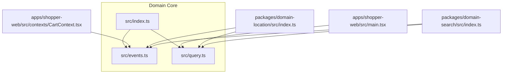
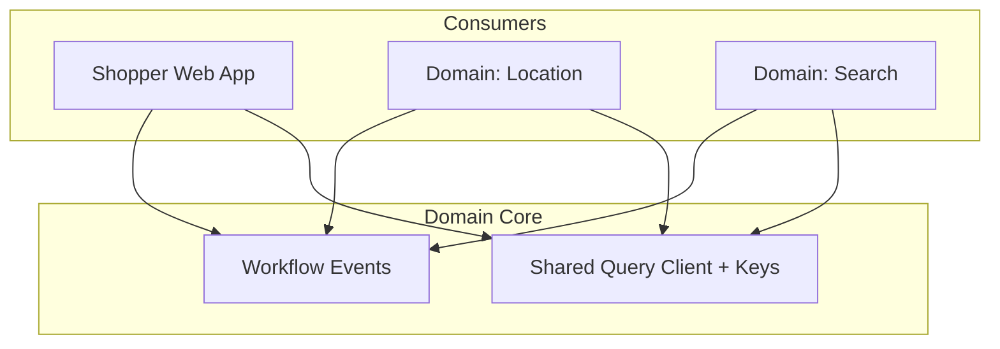
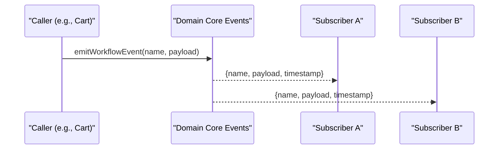
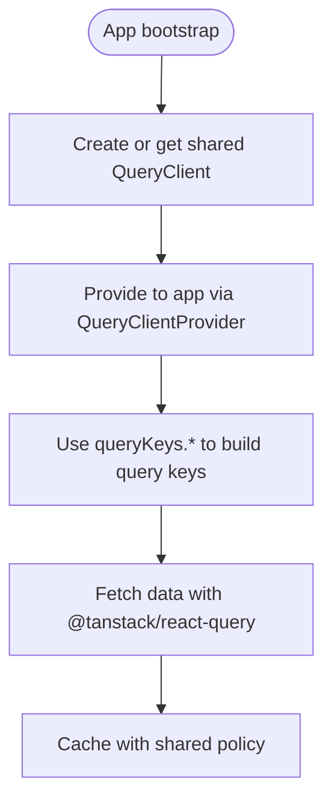
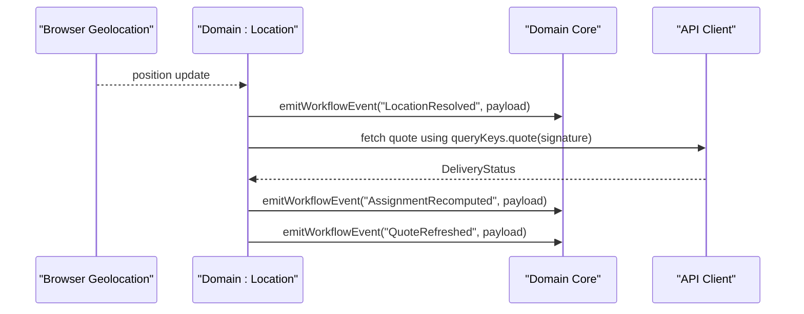
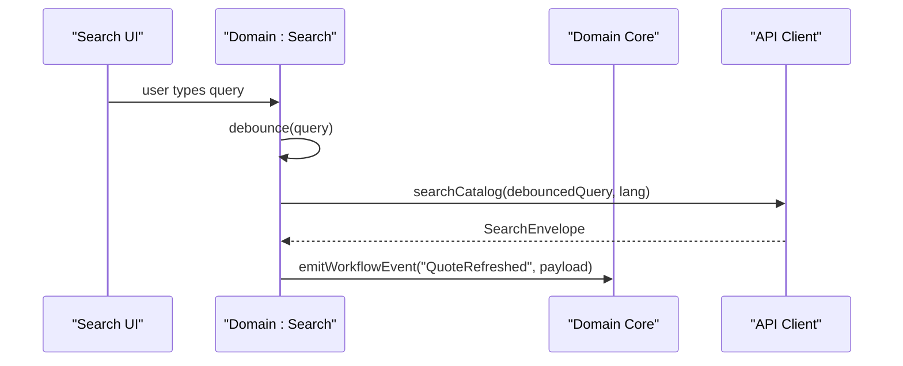
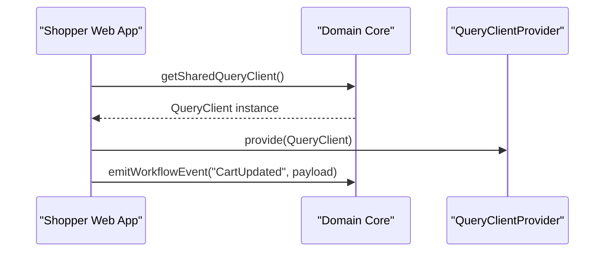
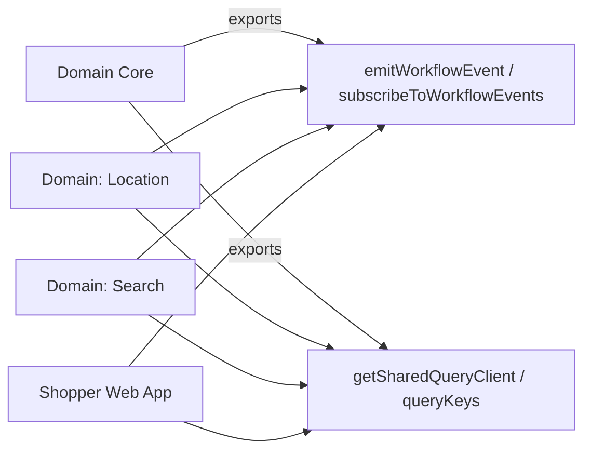

# Domain Core

<cite>
**Referenced Files in This Document**
- [package.json](file://packages/domain-core/package.json)
- [index.ts](file://packages/domain-core/src/index.ts)
- [events.ts](file://packages/domain-core/src/events.ts)
- [query.ts](file://packages/domain-core/src/query.ts)
- [CartContext.tsx](file://apps/shopper-web/src/contexts/CartContext.tsx)
- [main.tsx](file://apps/shopper-web/src/main.tsx)
- [domain-location index.ts](file://packages/domain-location/src/index.ts)
- [domain-search index.ts](file://packages/domain-search/src/index.ts)
</cite>

## Table of Contents
1. [Introduction](#introduction)
2. [Project Structure](#project-structure)
3. [Core Components](#core-components)
4. [Architecture Overview](#architecture-overview)
5. [Detailed Component Analysis](#detailed-component-analysis)
6. [Dependency Analysis](#dependency-analysis)
7. [Performance Considerations](#performance-considerations)
8. [Troubleshooting Guide](#troubleshooting-guide)
9. [Conclusion](#conclusion)

## Introduction
Domain Core is the foundational package that provides shared, cross-domain capabilities for the entire application ecosystem. It centralizes two critical concerns:
- A lightweight workflow event bus used to publish and subscribe to domain events across features (for example, cart updates, location resolution, quote refreshes).
- A shared React Query client configuration and canonical query key helpers so all domains can cache data consistently and avoid duplication.

By encapsulating these primitives, Domain Core enables other domain packages to remain focused on their own business logic while reusing common infrastructure.

## Project Structure
Domain Core is a small, focused package with a minimal surface area:
- Package metadata defines the package name and module type.
- The entry point re-exports public APIs from internal modules.
- Two core modules implement:
  - Workflow events: constants, types, emitter, and subscriber.
  - Shared query utilities: canonical query keys and a singleton QueryClient factory.

**Diagram sources**
- [index.ts:1-3](file://packages/domain-core/src/index.ts#L1-L3)
- [events.ts:1-52](file://packages/domain-core/src/events.ts#L1-L52)
- [query.ts:1-36](file://packages/domain-core/src/query.ts#L1-L36)
- [main.tsx:1-60](file://apps/shopper-web/src/main.tsx#L1-L60)
- [CartContext.tsx:1-560](file://apps/shopper-web/src/contexts/CartContext.tsx#L1-L560)
- [domain-location index.ts:1-145](file://packages/domain-location/src/index.ts#L1-L145)
- [domain-search index.ts:1-90](file://packages/domain-search/src/index.ts#L1-L90)

**Section sources**
- [package.json:1-7](file://packages/domain-core/package.json#L1-L7)
- [index.ts:1-3](file://packages/domain-core/src/index.ts#L1-L3)

## Core Components
- Workflow Event Bus
  - Provides a typed set of event names and a simple pub/sub mechanism.
  - Emits events with a timestamp and optional payload; subscribers receive standardized event objects.
  - Useful for decoupling domain reactions (e.g., analytics, UI state resets, downstream recomputations).

- Shared Query Client and Keys
  - Exposes a factory to create a configured QueryClient instance with sensible defaults for retries, refetch behavior, and stale time.
  - Provides a singleton accessor to ensure one client per runtime context.
  - Defines canonical query key builders for search, assignment, quotes, prescriptions, tracking, and courier manifests.

These components are intentionally small and stable, making them reliable building blocks for other domains.

**Section sources**
- [events.ts:1-52](file://packages/domain-core/src/events.ts#L1-L52)
- [query.ts:1-36](file://packages/domain-core/src/query.ts#L1-L36)

## Architecture Overview
Domain Core sits at the base of the domain layer. Other domains consume it to:
- Publish workflow events when state changes or side effects complete.
- Use shared query keys and a shared QueryClient to keep caching consistent across features.

**Diagram sources**
- [events.ts:1-52](file://packages/domain-core/src/events.ts#L1-L52)
- [query.ts:1-36](file://packages/domain-core/src/query.ts#L1-L36)
- [CartContext.tsx:1-560](file://apps/shopper-web/src/contexts/CartContext.tsx#L1-L560)
- [domain-location index.ts:1-145](file://packages/domain-location/src/index.ts#L1-L145)
- [domain-search index.ts:1-90](file://packages/domain-search/src/index.ts#L1-L90)
- [main.tsx:1-60](file://apps/shopper-web/src/main.tsx#L1-L60)

## Detailed Component Analysis

### Workflow Event Bus
The event bus defines a fixed set of workflow events and exposes:
- An emitter function to publish events with a timestamped envelope.
- A subscription function that returns an unsubscribe handle.
- A typed list of event names to ensure consistency across domains.

Typical usage patterns:
- Emit events after mutations or asynchronous operations (for example, after updating the cart or resolving a delivery quote).
- Subscribe in feature layers to react to cross-cutting concerns (for example, refreshing related queries or triggering analytics).

**Diagram sources**
- [events.ts:1-52](file://packages/domain-core/src/events.ts#L1-L52)
- [CartContext.tsx:1-560](file://apps/shopper-web/src/contexts/CartContext.tsx#L1-L560)

**Section sources**
- [events.ts:1-52](file://packages/domain-core/src/events.ts#L1-L52)
- [CartContext.tsx:1-560](file://apps/shopper-web/src/contexts/CartContext.tsx#L1-L560)

### Shared Query Client and Keys
Domain Core provides:
- A factory to create a QueryClient with default options suitable for monorepo apps.
- A singleton accessor to reuse the same client instance.
- Canonical query key builders for common data shapes (search, assignment, quote, prescriptions, tracking, courier manifest).

Consumers use these to:
- Ensure consistent caching behavior across domains.
- Avoid duplicate clients and conflicting cache policies.
- Keep query keys predictable and composable.

**Diagram sources**
- [query.ts:1-36](file://packages/domain-core/src/query.ts#L1-L36)
- [main.tsx:1-60](file://apps/shopper-web/src/main.tsx#L1-L60)

**Section sources**
- [query.ts:1-36](file://packages/domain-core/src/query.ts#L1-L36)
- [main.tsx:1-60](file://apps/shopper-web/src/main.tsx#L1-L60)

### How Domains Extend and Utilize Core

#### Example: Location Domain
- Uses the event bus to publish location-related events when browser geolocation resolves.
- Uses the event bus to publish assignment and quote refresh events after fetching delivery quotes.
- Uses shared query keys to build deterministic keys for quote retrieval based on cart and coordinates.

**Diagram sources**
- [domain-location index.ts:1-145](file://packages/domain-location/src/index.ts#L1-L145)
- [events.ts:1-52](file://packages/domain-core/src/events.ts#L1-L52)
- [query.ts:1-36](file://packages/domain-core/src/query.ts#L1-L36)

**Section sources**
- [domain-location index.ts:1-145](file://packages/domain-location/src/index.ts#L1-L145)

#### Example: Search Domain
- Debounces user input and uses shared query keys to fetch a search envelope.
- Emits a workflow event when search results change to signal downstream consumers.

**Diagram sources**
- [domain-search index.ts:1-90](file://packages/domain-search/src/index.ts#L1-L90)
- [events.ts:1-52](file://packages/domain-core/src/events.ts#L1-L52)
- [query.ts:1-36](file://packages/domain-core/src/query.ts#L1-L36)

**Section sources**
- [domain-search index.ts:1-90](file://packages/domain-search/src/index.ts#L1-L90)

#### Example: Shopper Web App Integration
- Bootstraps the shared QueryClient and provides it to the app tree.
- Uses the event bus to emit cart mutation events for consistent cross-feature signaling.

**Diagram sources**
- [main.tsx:1-60](file://apps/shopper-web/src/main.tsx#L1-L60)
- [CartContext.tsx:1-560](file://apps/shopper-web/src/contexts/CartContext.tsx#L1-L560)
- [query.ts:1-36](file://packages/domain-core/src/query.ts#L1-L36)
- [events.ts:1-52](file://packages/domain-core/src/events.ts#L1-L52)

**Section sources**
- [main.tsx:1-60](file://apps/shopper-web/src/main.tsx#L1-L60)
- [CartContext.tsx:1-560](file://apps/shopper-web/src/contexts/CartContext.tsx#L1-L560)

## Dependency Analysis
Domain Core has no runtime dependencies beyond what is explicitly declared by its consumers. Consumers import:
- Event bus functions and types from Domain Core.
- Query client factory and query key helpers from Domain Core.

**Diagram sources**
- [events.ts:1-52](file://packages/domain-core/src/events.ts#L1-L52)
- [query.ts:1-36](file://packages/domain-core/src/query.ts#L1-L36)
- [domain-location index.ts:1-145](file://packages/domain-location/src/index.ts#L1-L145)
- [domain-search index.ts:1-90](file://packages/domain-search/src/index.ts#L1-L90)
- [CartContext.tsx:1-560](file://apps/shopper-web/src/contexts/CartContext.tsx#L1-L560)
- [main.tsx:1-60](file://apps/shopper-web/src/main.tsx#L1-L60)

**Section sources**
- [events.ts:1-52](file://packages/domain-core/src/events.ts#L1-L52)
- [query.ts:1-36](file://packages/domain-core/src/query.ts#L1-L36)

## Performance Considerations
- Event bus:
  - Synchronous dispatch to all subscribers; keep listeners lightweight to avoid blocking.
  - Prefer debouncing or throttling expensive handlers if needed.
- Query client:
  - Defaults include limited retries and a reasonable stale time to balance freshness and network load.
  - Use canonical query keys to maximize cache hits and minimize redundant requests.
  - Avoid creating multiple QueryClient instances; always use the shared accessor.

[No sources needed since this section provides general guidance]

## Troubleshooting Guide
- No subscribers receiving events:
  - Ensure subscriptions are established before emitting events.
  - Verify the correct event name is used and that payloads match expectations.
- Duplicate or missing cache entries:
  - Confirm consumers use the shared QueryClient and canonical query keys.
  - Check that query keys incorporate all changing inputs (for example, language, coordinates, cart signature).
- Unexpected re-renders or performance issues:
  - Review event listener cost; move heavy work off the main thread or debounce.
  - Validate that query keys are stable and not regenerating unnecessarily.

**Section sources**
- [events.ts:1-52](file://packages/domain-core/src/events.ts#L1-L52)
- [query.ts:1-36](file://packages/domain-core/src/query.ts#L1-L36)

## Conclusion
Domain Core provides the essential plumbing for cross-domain communication and consistent data caching. By centralizing workflow events and shared query infrastructure, it allows other domains to focus on their specific business rules while maintaining a cohesive, performant architecture. Adopting Domain Core’s patterns ensures predictable interactions, easier testing, and better separation of concerns across the application.

[No sources needed since this section summarizes without analyzing specific files]